# B站最系统的护网行动红蓝攻防教程，掌握护网必备技能：应急响应／web安全／渗透测试／网络安全／信息安全 - P26：web安全-2.网络基础部分 - 跟小鱼学安全 - BV1SF411174M

什么是HGTP？HDP其实我们呃在我们现今的生活当中的话，如果大家去浏览网站的话是。啊，肯定会碰到这样子的一个协议的对吧？当当然的话大家可能会用，但是不是很了解它是什么样子的一个东西。

这样的话我们一起来看一下HTP的话也叫超文本传输协议。它的一个缩写就是HTTP就我们传输的一些一些网址的话，你标准的一个呃标准的一个网址，一个UL的话，它是要带这样子的一个协议的。也就是HTTP。

当然的话我们在浏览器里面输的话，其实也可以输。比如说百度点com，对吧？你直接输入百度点com的话，它会自动帮你补全，就是补它浏览器，它会帮你补成。如果说它使用的是1个HTPS是S的协议的话。

它就会补成HTPS。GDP的话，它是一种基于一种用于分布式协作式和超媒体信息系统的一一个应用层的一个协协议。它其实的话是一个基于浅求与响应，而且是无状态的应用层的一个协议。这样的话大家就了解一下吧啊。

在后面的话会对它做一个比较详细的一个介绍。它是基于TCPIP的一个协议来传输数据的。然后这里我们设计这种设计这个AHTP的一个初衷，其实就是为了提供一种发布和接收HTM页面的一个方法。

也就是我们时常去浏览网站，我们就使用到这样的1个HTP协议来发送我们的一个请求，以及接收服务器发回给我们的这种HTHTM的一个页面。然后的话我们就能够查看到呃网页的一个内容。啊。

我们一起来了解一下HTP它的一个发展的一个历史。历史的话主要的话就看一下这张图，大家呃看一下吧。啊，呃我这里标的一个红框的话，就是我们呃最常见的。1个HTB的一个版本，HTTB1。1的一个版本。

当然的话现在的话有HTP2的一个版本，而且是逐渐的啊覆盖市场了。嗯。这句话大家呃了解一下就OK了。🤧Yeah。然后我们来了解一下HDB它的一个工作的流程，它是如何去进行一个工作的。呃。

大家跟我一起来看一下。首先的话是。我们的一个客户端，它会通过1个TCP的一个三次握手与服务器进行一个连接。就我们首先需要客户端。也就是我们呃呃在这里讲这个之前的话，我们先来了解一下有这样子的两种架构吧。

就是BS以及CS的一个架构。就CS的话就是line server，也就是客户机与服务器的一个结构。还有BS的一个结构结构的话，就是浏览器bro browser，还有serv的一个。结构。

我其实呃我们常用的也是我们去访问一个网页，对吧？我们经常。经常使用的也是打开一个浏览器，对吧？打开看打开一个浏览器，然后输入一个网址，或者说去导航站随意点开一个呃链接，就能够去访问这样的一个页面。

就是这样子的话，就是1个BS的1个。结构。嗯。嗯，HTP它首先它会通过TCP的一个三次握手与服务器进行一个连接。然后经理连接之后的话，才能够去进行一个数据的一个传递。

然后的话我们从客户端传递给服务器的1个HTP的一个请求。到了一个服务器之后。他就会。对我们的一个请求做一个解释响应。然后响应之后的话，它会向客户端同样的发送1个HTP的一个响应。

然后客户端接收到这样子的一个响应之后，也就是啊从服务端发送过来的一个内容。然后的话展示给我们。然后完成了这样子的一个过程之后的话，他会通客户端也会通过TCP的一个4次断开。

就是4次挥手与服务器断开TCP的一个连接。啊，这里关于TCP的一个三次握手，四次挥手，这个的话是网络相关的一个支持。我这里的话也就不做过多的一个叙述。这是啊网络的一个基础的协议的一个理解。

大家如果不理解的话，去网上看找资料呃，了解一下吧。那我们看一下这这个图的话，就是1个TCP的一个三次握手。首先的话，客户端它会向服务端发送这样子的1个SYN的一个。诶。请求，然后的话接收之后。

然后给一个响应。服务端给响应，然后到了一个客户端之后的话，他会呃再发送一个请求给服务端，这就是建力连接的一个过程，也就是三次握手。然后的话我们的这种数据传递完毕之后的话，就会有一个断开的一个过程。

这就是TCP的一个4次挥手的一个大概的一个过程。嗯。然后这里的话呃我们一起来了解一下呃HDP的一个。特性以及啊它的一个机制，就是说持续连接的一个机制。在HTP的0。9以及1。0版本中的话。

它是TCP的这个连接，它是在每一次请求，还有回运之后的话，它就会关闭。也就是呃因为我们首先需要尽力连接，连接之后的话就需要请就需要尽力请求，对吧？呃，连接之后的话，建力连接呃，就是请求发送。

然后响应之后，然后的话就会TCP的一个连接就会断开。然后的话在HTP的1。1版本中的话，就呃引入着了这样子的一个持续连接，也就是保持连线的一个机制。这个机制的话可以重复在多个请求回应之间使用。

就呃就这样子的话，它的一个优点的话就是可以很少等待的一个时间，就省去了中间。呃，因为你每次连接之后，然后关闭，关闭之后又继续连接，对吧？这样子的话，它中间会有一个等待的时间。被你需要这一个请求完成之后。

然后再尽力连接，再做一个下一个请求。这样子的话，它会有等待的一个时间。然后这样子的一个机制的话，就可以呃在发送第一个请求之后，不需要再重新进行1个TCP的一个握手。然后连接之后再发送请求。也就是啊如图。

这里的话就是。啊，就是只是。哦，我们一起来看一下这个图吧。这个图的话就是我们首先发送一个请求，对吧？哦，我首先TCP连接连接之后的话，我们比如说我们get请求，请求一个index点选HTM的一个页面。

在服务器请求然请求之后。服务器给我们一个响应，给我们一个响应之后的话。然后的话再去他会断开。断开之后的话，再去请求请求响应请求响应。然后再这样子关闭。然后在呃。HTP1。1中的话，它就会有这样子的一个。

这个持续连接的一个机制，我们这里请求之后响应响应之后，我们可以有多个请求。可以同时的去进行。就我们可以同时请求一个这个。scriptGS以及这个s点CS的一个呃请求。就说在这样子的一个连接之内。

然后的话可以同时呃响应。这样子的话，我们可以明显看到它的一个嗯。时间的话是大大的减少了。嗯。好，我们一起来看一下什么是统一资源定位服务，也就是URL。我们经常会提到的1个URL。

其实UIUIL就是我们常说的一个网址。它主要的话就是用于查找资源的一个信息。然后一个完整的业务的话，包括下面这几个部分。诶。就比如说我们的我这里的话访问我们恒天网实验室，对吧？

我们的这里的话就是1个UOL。对吧包括了这样的一个域名。就我们可以通过这样的1个UL来来访问到这样子的一个页面。然后这样的一个UR的话，它包括了下面的这样的一些信息。有这由以下这一些部分组成。

首先的话我们一起来看一下。首先一个就是我们的一个协议方案名，这里的话是1个HTP的一个协议。呃，关于这个。比说我们在这里。就输了一个。Yeah。嗯。🤧K。出了一个百度点com对吧？

它就到了百度的一个首页。但是我们其实看的话，我们点开看它其实是这样子的1个URL，它是使用的1个HTPS的一个协议。以及这里的话是有1个3W点百度点com，它是一个呃web服务器的一个。🤧嗯。呃。

二级域名。然后第二个的话就是一个登录信息，一个认证的信息。这里的话是。呃，在有一些网页的话，它需要认证的话，我们可以在这里在HGP后面接上我们的一个呃登录的一个信息来去呃印证。

这种需要登录的一个网页来去进行一个访问。然话这个呃应该不是很常见。然后后面的话接的是我们的一个服务器地址，也就是我们的一个域名。然后域名之后的话，接我们的一个服务器的一个端口。端口的话，跟说一下的话。

就是外表服务器的话，它默认的一个端口就是80。这个如果是你使用的一个默认端口的话，这里可以省略。也就是我们这里，比如我们这里访问了一个百度，它其实默认的也是一个80的一个端口。我们可以在后面接1个80。

讲咪说嗯。完安全的你。Yeah。可以看到我在这里后面接一个8年的话，它其实也是会跳转到这样子。跳转到我们的这样子的一个页面。Yeah。然后的话如果是在其他的一个端口有有相应的一个服务的话。

他做了一个端口的一个更改。我们在后面的话就需要接上我们的一个端口号。比如说常见的1个8080端口啊。然后后面端端口后面的话接的就是我们的一个文件路径。嗯。

也就是我们呃就比如说我们上节课搭建我们的1个DVWA对吧？我们的1个DVWA的一个目录啊，放置在我们的一个wordb服务器跟目录下面。然后的话我们要去访问这1个DVWA的话。

我们需要在我们的1个IP或者是说你的一个域名后面。

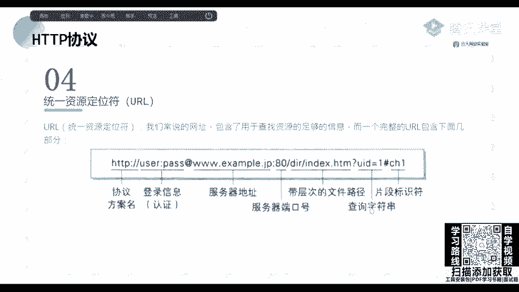

呃。Yes。🤧。嗯，我这的话看一下。What are can you study。嗯。嗯。嗯。哎，我不用这个了，我用我的这个机器吧。嗯。🤧咳。嗯。好，这样的话，我以这1个OWSP做一个举例。

就是我们现在的话在我们的一个服务器的一个根目录，对吧？然后的话我们想要访问这样子的一个呃这个网站。我们需要接我们服务器上面的一个。这一个目录。

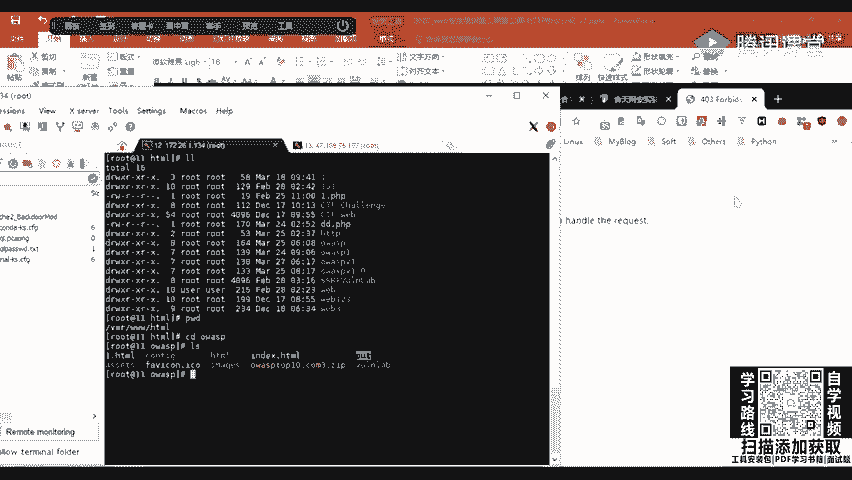

才能够去进行一个访问，也就是它的一个文件路径。

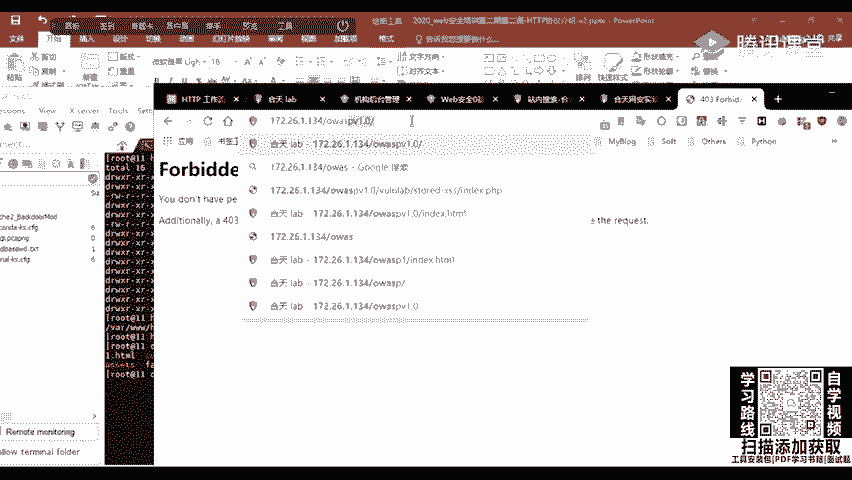

回错，然后的话我们就可以访问到这样子的一个界面，对吧？然其它其实访问之后的话，它的一个文件其实这一个index点HTM的一个文件。但是的话我们可以在后面，因为它默认的话。

它会去查找当前这个目录下面它是否有这样子的一个index。

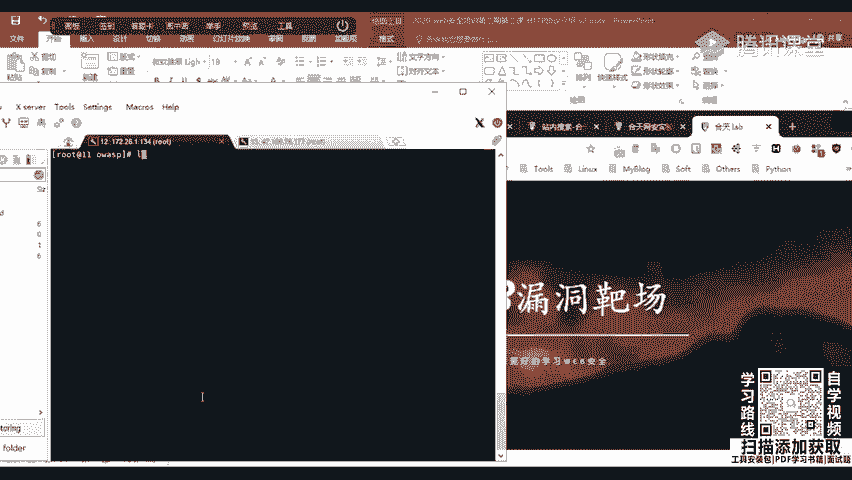

等一个默认页面。

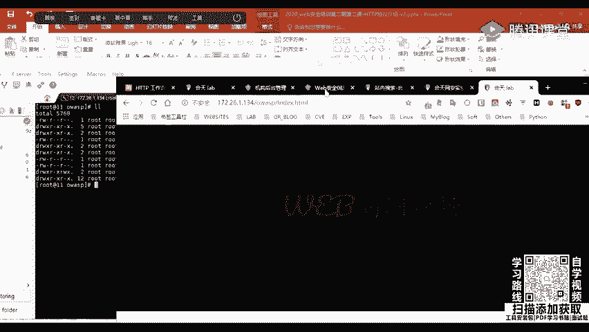

就是我们也可以在后面加上去，访问的也是同样的一个页面。然后这里的这个部分的话，也就是我们的有层次的一个文件路径。🤧。然后在这个再层次的一个文件路径后面的话，我们可以。

以这种问号的一个形式接我们的一个传递的一个参数，也就是我们所说的一个查询的一个字符串。它的一个形式的话是然后的话它是用等号去进行一个临界，就是我们的一个传参参数，然后接后面接我们的一个传递的一个值。

那后后面的话是我们可以接一个井号，井号的话在。嗯，我们的一个前端里面的话可以叫做锚点，也就是我们可以定位到当前页面下面的呃。某一个信息的一个片段，我们可以用这样子的一个。

这个后面接的话就是一个片段的一个标识符。

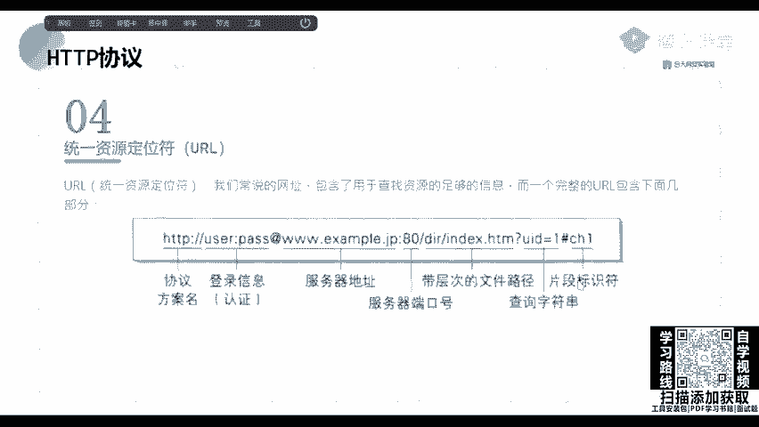

咁样可以诶。二。

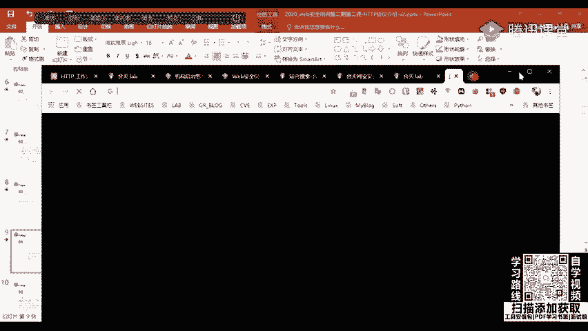

比如说。哼。😊，嗯。我搜索1个HTP，然后我进百度百科。

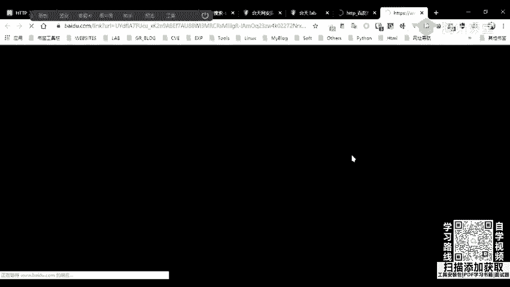

然后可以看到这里它的一个UR地址就是。啊，域名对吧？然后默认的话它是8080端口，然后后面接我们的一个路径。路径后面之之后的话有一个问号，这个问号后面的话接的是传递的一个参数。🤧Okay。嗯。

然后我们这里的话，我们查询这样子的1个HTP，对吧？就是像我们的一个服务器传递这样的一个呃值。然后的话它会返回这样子的一个页面结果。然后我们想比如说我们想要去。看这一个。对吧看这一个。8也就是版本号。

就这一个版本号。然后这里的话就是在前端里面的话会有这样子的一个锚点。然后我们可以在后面接一个-8，然后访问到这样子的这个页面的这一个。诶。Yeah。嗯。可以看到我这里的话输入一个期的话。

它就跳转到了这个状态信息的这一个片片段，对吧？作为一个我的话就到了这样的一个运作方式。这里。这就是他的一个。定段的一个。标识符。Thank。嗯。😊，然后这里的话呃是一个我这里写的一个文字的一个描述。

大家可以看一下，跟我前面讲的话是类似的。啊，大家对这个有没有什么疑问呢？应该没有什么问题吧。这个的话其实都是大家呃比较常见的。可能大家就是说在呃也会去使用到。

但是没有去啊深入的去啊研究它为什么会是为什么它的这样的一个UR链接，它是会这样子去构成的对吧？因为其实前面呃有给那些就是单接触这一块的呃同学做。这样子的一个外表安全培训的话。

他呃我记得是有有有人问过我这样子一个问题，就是说我我怎么去访问一个页面，然后他后面为什么他会接这样子的一些东西啊？🤧嗯。就是说我们我想要去访问一个指定的页面，他为什么要去接这一个呢？

他他他可能会不会写域名，然后直接就接这样子的一个啊字符，对吧？但是这样子的话，它是无法去访问到资源的。因为它不是1个UR的一个格式。我看大家的话都没有什么问题啊啊，那我们继续。啊。

了解完1个UIL之后的话，我们来看看一下什么是URI。URI的话叫做统一资源标志符。它是用来抽象用来标识抽象或物理资源的一个紧凑之字符串。其实呃在这里的话。

我们只需要了解到就是URI和URO它的一个区别。UI的话，它是1个UI的一个子集。也就是说。UI就是包括了URL。啊，大这里的话还要注意一点的话，就是HDP它是使用这个UII来传输数据和经理连接的。嗯。

我们可以来看一下，呃，还有的话是。HB它是一个客户端以及服务端的一个架构模型。我们来来看一下这个图板。这个图的话就呃直观的。表达了这样子的一个关系，就UII就是这一个大圈，对吧？它里面包含了有UIL。

还有UIN以及还有其他的一些。🤧然后就是说。我们看一下这一个UIL就是说这样子的一个形式，谷歌点com还有UINUIN的话，这个的话就大概提一下吧，就是它是一个统一资源名称就。

特定的一个命名空间的一个标识。1个ID。Yeah。呃，呃，下面我们一起来看一下。下面的这一些呃。UIL或者是说UI或者是呃什么，我们来对它做一个分辨。就说下面这些哪些是UIL，我们一起来看一下。

首先第一个。呃，这个的话。嗯。这里答案写出来了。这样的话呃。就各位同学们来哎。来一起做一个互动，好吧，就我们一起来看一下。首先我说第一个就第一个的话，大家觉得它是1个UOL，还是还是说什么。都不是。

如果觉得他是一个妖饵的话，呃，大家在公屏上打个一，好吧。我看全都是打了一啊。对，没错，它就是1个UL。对呃，为什么它是1个UL呢？我们一起来看一下。首先呃前面的话我们其实有哦这里的话我忘记提了。

就说协议的一个方案名的话啊，我这里的话有列举了这样的一些HDPFTP还有fi协议啊，还有。mail to mail tonet到DP等等这样的一些协议方案。就我们其实呃常常见的也是HTP嘛。

就是fi协议，我们应该也是会常见到的对吧？

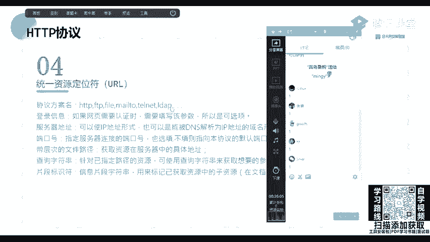

这样的话我举一个例子。呃。

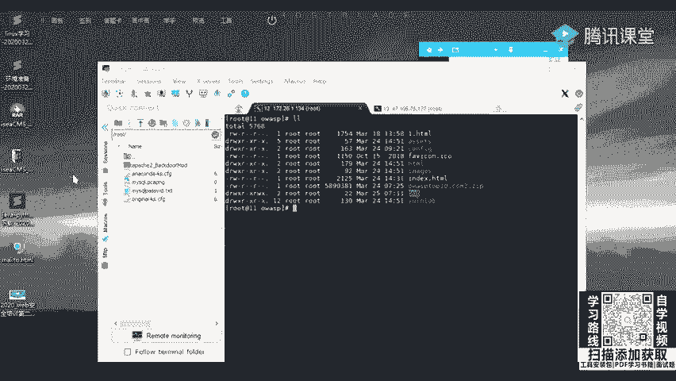

打一个P点。

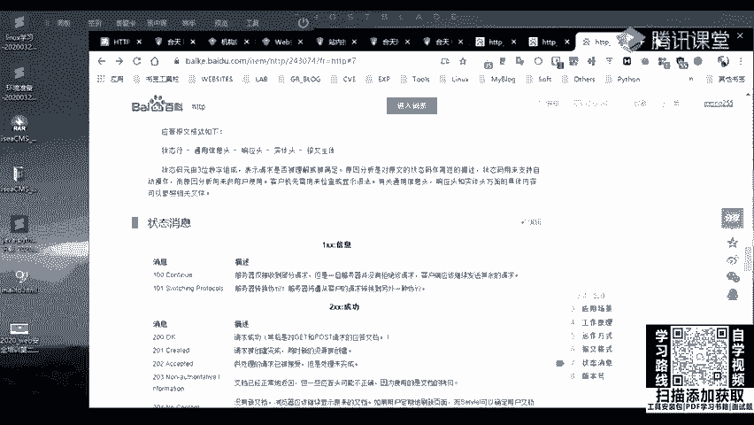

Yeah。Yeah。Yeah。🤧对话。Yeah。Okay。咦。😊，诶。我就以这一个文件做一个例子。比如说我这里打开打开之后的话，呃，它会在浏览器里面。展示给我们，对吧？然的话其实我们可以看到我们点一下。

我们可以看到它的一个完整的一个路径。完整的一个路径的话是fi协议，就前面有一个file，然后后面的话是接我们的一个本地文件的一个路径，以及我们的一个文件名，对吧？就这个fi协议。

其实就是用于啊来找到我们本地的这样的一个资源来打开我们本地的这个这种文件。

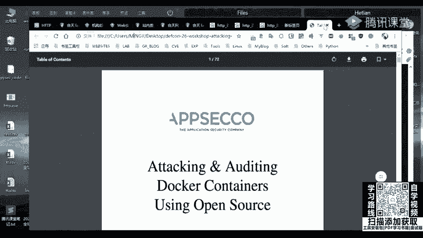

然后的话就是。嗯。啊，不好意思啊，喉咙有点。稍微有点紧。Hello。冇。然后的话就是呃。比如说这一个mail to这一个mail two的话，其实就是我们的呃我这里的话也这一个。文件做一个演示吧。

就他其实就是这样子的一个呃代码，这个代码的话其实就是一个呃链接。然后它使用的话是一个这一个mail的一个协议。我们来看一下它的一个效果吧。

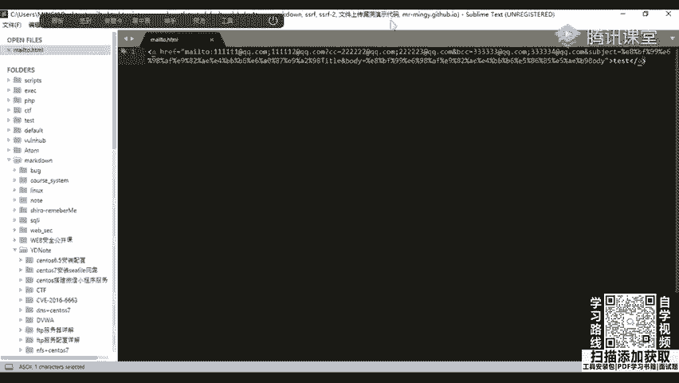

我们直接打开。打开之话，它是这样子的一个页面，对吧？我们点一下。点一下之后的话，它会跳转到我们那一个邮箱。可以看到这里的话，它是。可以看到的话，它这里话自动跳转了我本地的这样的一个呃。

这个foxmail这一个接收邮件的一个软件，然后的话它自动的填充了我们在那个代码里面所写入的一个，比如说啊邮箱对吧？收件人、抄送人、主题，还有内容等等这样的一个东西。这个的话其实就是用于啊我们去。呃。

这样子去打开一个邮件，或者说呃打开给给某一个人发送邮件。啊。然的话回到我们刚刚的这一几个题目。就第一个的话，我们可以看到它首先协议方案是1个FFTP对吧？然后后面的话是我们的一个域名。

然后的话是接我们的一个呃文件路径，对吧？它是完全符合我们的1个UR的一个格式的。然后第二个呢。好，这个的话其实就是1个HTM的一个代码嘛。然后就实大家看那个就是别人的一些博客什么的对吧？

然后你点击那个邮箱地址，对吧？它就会跳转到呃邮箱，然后的话你就可以给他发发邮件，对吧？其实啊也是类似的。然后第二个的话，它是一个大家做一个判断。他是不是1个UL？好啊。看来大家都对这一个都比较了解了。

啊，没错，他就是一个U。Okay。然后下面的话嗯。我就不一个一个的去问吧啊，比如说这个对吧？这个我们可以。看到的话就是我们刚刚演示的，就在m to后面接我们的一个邮箱地址。

这个的话它也符合我们的一个这里的话它是接了一个呃。这个是这个是。IPV6吧。然后后面的话接我们的一个。一些参数。它同样的是符合我们的1个UL的一个格式的。第四个也是。啊。这样的话我就不一一的去讲了吧。

就是呃他的一个。大家应该都能够有一个基本的一个判断。然后这里获得这两个的话，可以看到它这里1个TTLL，它是没有这样子的一个协议的。然后的话后面接一个一串数字的话，它不是1个URL。还有这个URN的话。

URN的话就是前面我们说到的，它是一。嗯，它是这个对吧？它不是属于1个URL的，它虽然也是同样的，是属于啊URI。嗯。嗯。😊，然后呃介绍完URI之后的话，我们一起来看一下。啊。

这也是我们今天啊课程的一个主要的一个内容吧。首先前面的话我们有说到我们的一个。呃，我们想要去浏览一个页面，对吧？首先的话我们需要跟服务器建立这样的一个连接DB的一个三次握手，对吧？经理连接之后的话。

我们在客户端再去向服务端去发送我们的一个请求。对吧发送请求的话，这里的话就涉及到一个客户端的一个请求消息。它是啊由哪一些部分所构成，然后才能够被客被服务端所接受。然后的话。被服务端做一个处理解释。

然后响响应回我们客户端想要的一个内容。这话我们先来看一下客户端的一个请求消息。也就是1个HTB的一个请求报文。首先的话我们先来看一下，它是由四一个由四个部分组成，主要的话包含有请求函、请求头空行。

还有请求数据。就是我们从这一个。呃，这张图里面的话也能能够直观的看出来。它主要的话由这四部分构成请求函头部，还有呃这里的话有一个空格的空函。然后后面的话接我们的一个请求数据。2请求函的话。

它是由这样的一一些部分组成，包括的话有请求方法，后面的话是接空行，然后再接我们的1个UIL这里的话其实呃。应该不是这样说，这里的话是接我们的一个呃文件路径。

也就是1个URI我们请求的1个UI后面的话接空格，然后接我们的一个协议版本。这个版本的话就是我们呃我们的1个HDP请求，对吧？常用的一个版本就是HDP杠1。1。然后后面记住一是有一个回车换行符的。🤧嗯。

哦，这的话我就不一一的去说了。后面的话会呃有详细的一个。呃，分别对这一些部分做一个。谢打。我们看一下这样的一个请求的一个数据。我这里的话有做一个标注。比如说我这里去访问我们的一个核田网实验室，对吧？

访问。保之的话，他会发送这样的一个请求。这个请求的话，它是一个可以看到它所使用的一个请求方法是pos。然后后面的话接我们的一个文件。Yeah。然后后面的话接我们的一个协议版本。

注意最后的话是有一个回车换行符的。也就是我们有一个C啊CRLF这样子的一个换行符。Yeah。然后后面的话底下这一部分的话，就是我们的一个请求头部的一个字段。就它的一个字段的话，就是有这样子的啊一些头部。

然后后面的话接一些值所构成，就是这一部分。Oh。在最后的话呃，就是在请求头部跟。我们的一个请求数据之间的话是会有一个空行。那个空行空行的意思的话就是表示我们的一个请求头部的一个数据啊是已经啊完毕了。

就已经结束了。然后的话在后面的话再去接我们的一个请求数据，也就是表示我们请求的数据啊开始。然后这一部分的话就是我们的一个请求数据。我这里的话是一个登录的一个界面。

所以可以看到请求的一个数据化就是呃用户名以及密码等等。的一些呃这里密码的话是做了一个加密的一个处理。嗯。那我们再来分别来了解一下请求函的一个构成吧。我们。它的一个构成的话就是这样子。

首先message message的话就是一个请求方法。就比如说我们前面所说的一个post。然后后面的话注意是空行，后面接我们的一个啊request uII。然后后面的话接我们的一个协议版本。

然后的话呃1个CIF回车换行。那请求方法的话，我们前面啊有了解到一种就是post，对吧？post的话它是呃像我们前像我们前面的这个requestUI所标示的这个资源来附加新的数据。

这个附加的话其实就是向它传送新的数据。然后get的话就是请求我们的这个啊。文件这个UI所标识的一个资源。还有呃head foot。dele等等这样的一些请求方法。这样的话呃大家看一下。

后面的话会有实际的一个例子给大家做一个演示。有这样的一些请求的一个方法。然后在请求函之后的话就是请求头部，对吧？请求头部的话，它的一个构成其实就是headbed的一个字段。然后接我们的一个head值。

然后回声换行。请求头部的话，它其实就是他的一个意思是允许客户端传递关于自身的一个信息。然后希望服务服务端向我们响应什么样子的一个形式，响应什么样的一个数据。然后在我们常用的1个1。1版本中的话。

你桥头的话是就除了host。houses的话就是我们的这里这一个这一个域名是我们的一个主机。服务器的一个地址，还天lob点com。除了这个的话，其他都是可选的。

比如说它啊你它是可以不需要啊在请求包中包含这样子的一些头部字段的。然后这里的话是呃我列举了一些就是呃请求头部字段的一些。呃。对他的一个解释以及例子。Yeah。嗯，这里我不做。啊。

我就不一个一个的去解释了吧。我这里的话写的比较详细，而且的话还有一个例子。比如说呃hos host的话就是我们请求的服务器的一个域名，还有端口号。就像这样子的。哦。

content lens就是我们请求内容的一个长度。就我们通过这一个conent list的话来设置我们，比如说我前面这里的这一个请求，对吧？可以看到这里有个content lens是316。

这个316的话就是表示我们这里的一个请求数据，它的一个长度就是360316个字节。好吧，361个呃。制服吗。呃，还有常见的一些，比如说。wiwi的话就是嗯。我们。之前所访问的一个页面。

然后的话访问之前访问的一个页面是呃。比如说是这样的一个页面，然后我们在请求头部字段当中的话，带上这样子一个页面的话，就是告诉服务端。我是之前是在从这一个页面过来的，就之前访问的是这样一个页面。

然后在这一个页面，然后访问到啊。另外的一个。页面。然后还有的话就是orange，就是。指明当前请求是来自于哪一个站点？P。以及啊一个cookie，就cookie的话。

就是把我们保存在这个域名下面的这个cookie值会发送给我们的一个web服务器。这里的话是我以呃核天网实验室的一个cookie的一个类型做的一个例子。

在后面的话会给大家介绍一个cookie以及session，会有讲到。嗯。Yeah。然后这里的话其实前面给大家也已经说过了，就空行的话，它就它其实就是表示请求头的一个结束。然后标标志着请求正文的一个开始。

也是我们的一个请求的一个数据。然，请求数据的话哦，我这里举了两个例子。请求数据的话有这样子的。我这里举了两个呃两种方法，就是get方式的一个请求以及poss的方式的一个请求。

用get方式的一个请求数据的话，它会把我们要我们的一个数据参数，它会作为1个URL的一个一部分。就是他会放在文件路径后面。在我们的一个就是请求的，我们传递参数在问候方面。接我们的一个呃传递的一个参数。

然后这一部分的话就称为查询字符串嘛，里面啊有说到较好的一个格式的时候，然后它是会有以这样子的一个啊参数名，后面接我们的一个传递的一个数据，然后以and符号做一个分隔，就是多个参数之间的话。

它会以end符号啊做一个分格。pos的方法发送的一个数据的话，它就是在我们的一个请求体当中，就是在我们的空盘后面。然后接我们的一个呃发送的一个数据。比如说这样子的一个数据。Yeah。

然后前面的话我们介绍了一个客户端的一个请求消息，以及它的一个组成部分。

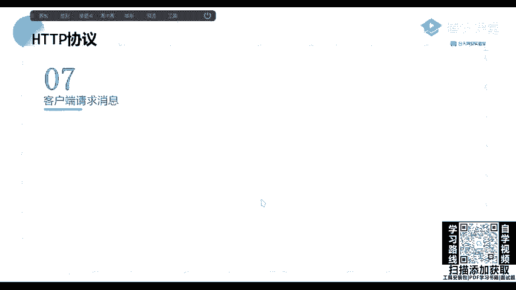

啊，不知道大家有没有什么疑问。应该呃没有什么疑问吧。我想大家应该都能听得懂吧。Yeah。插 for的货。插播的货的话就是嗯。它是啊比如说我们的一个我们经常我们去访问一个网页，对吧？访问一个网页的话。

它其实从客户端到服务端之间，它不是说直接会有一一个这样子的一个呃传递。它中间可能会有相应的一些代理，对吧？在这个代理的话，它中间会经过一个这样的一个代理。

我们可以通过这样的一个插fo货这样的一个字段来告诉服务端我们的一个真实的一个呃。地址然后的话服务端的话能够通过这个地址来了解到你是从哪里过来的。Yeah。啊，这里的话关于其他的一些呃。头部的一个信息。

我们可以看一下这一个丸址吧。

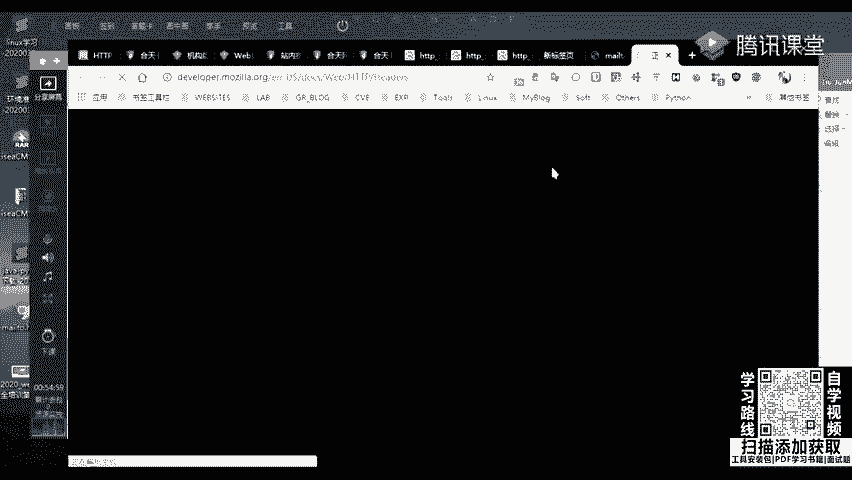

啊，这个是英文。Thank。我们可以看一下这一个网址，这里的话有很呃很详细的关于啊HTP的一些字段的一个解释。我这里PP的话只是列举了几个。关于这个叉 for four。嗯。

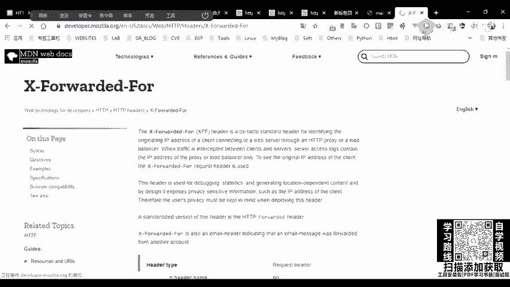

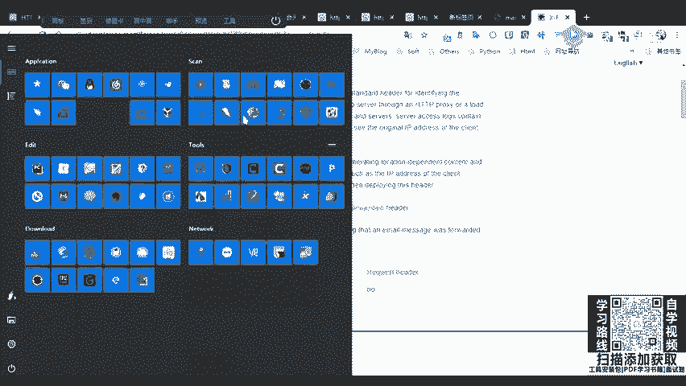

嗯。啊，我们就以这嗯。英文的话大家自己想办法做一个翻译吧，翻译吧。如果看不懂的话，我们就以这样子的一个例子来看一下吧，就可以看到我这里的话一个 for for，对吧？

这里后面所接的一个字段去就是我们的一个client，我们的一个我们客户端的一个啊IP我们的一个服务地址。然后后面的话接我们的一个如果是说经过了一层代理的话，它就会接我们的一个代理的一个啊地址。

如果再经过一层代理的话，它后面再接上我们的一个代理地址，然后发送给服务端。服务端之的话，就能够去啊能够知道它是啊从哪里。发送过来的一个请求。这个应该理解吧。还有什么其他问题吗？

其实就就是通过这一个能够找到我们客户端的一个真实的1个IP地址嘛。他从哪里发过来的一个请求？Yeah。没有了是吧。好，如果没有了的话，我们继续。呃，了解完我们的一个请求消息之后。

我们来大概看一下它的一个响应的一个消息。同样的它是呃包含了四个部分，就是这四个部分组成，就包括状态函，以及我们的一个消息的一个响应头部。以及我们那个空盘，然后的话是我们想要的一个正文。

这话跟呃请求呃消息是类似的。我们可以看到。嗯，就前面我这我前面。发送的一个这样的一个数据包。啊，就是跟我前面这里是。对应的。就这一个我这里的话向他发送了一个登录的一个请求，对吧？

但是我这里的话是写了一个假的一个呃用户名以及密码。所以说他这里返回给我的一个消息，可看到他返回的话是一个。协议的一个版本是1。1，然后的话后面接我们的一个状态嘛。

200的话就是表示我们那一个请求是啊正确的，而且呃。返回了一个响应的一个消息，就是我们的一个请求过程是没有问题的。就是我们的一个请求响应过程啊。

应该是说然后后面的话是接1个OK就是我们的一个状态码的一个描述。哦，下面接的是我们的一个消息的一个爆头。就是啊发送给我们的一个呃。客户端。的一些消息。然，后我们可以看到呃，这里的话主要说一下这一个。呃。

sserv的话就是说表示我的一个服务端，对吧？我服务端的话是1个eng的1。5。6的一个呃服务。然后的话呃我这里接一个content type的话，意思我这里发送给你的一个数据。

它是一个jason啊接节省的一个数据。然后他这个编码的话是1个呃UTF杠8的。这里。这里有一个sad cookie。就s cookieook的话。

就是呃在在后面我给大家讲一个cookie筛选的时候会有说到这样的话我提一下。就是啊我们客户端去访问我们那个服务端的时候，我们第一次去访问的时候。访问之后的话，就是发送我们的一个请求之后。

服务端它会呃响应给我们这样子的一个set cookie的一个一个字段。然后这一个st cookieook就是服务端，它生成了一个cookie，然后响应给客户端。客户端的话它会做一个呃存储。存储之后的话。

就便于我们下次的下一次的一个访问以及请求。然后后面的话是接控盘以及我们的响应正文。这里响应正文的话，它是我们的一个ja省的一个格式。嗯。然后呃状态函，然后的话就是协议版本。状态码以及状态码的一些描述。

我们。来了解一下状态码。呃，这些的话大家看一下吧，就是大家了解一下就可以了。就大家在去，比如说用BP去进行一个抓包的时候，对吧？我们看到这样子的一个状态嘛，就能够知道啊它的一个意思。就账态码的话。

它其实是有三位数字组成嗯。うんうん。主要的话就是看第一个数字，第一个数字的话，它就表示了我们响应的一个类别。就是它的一个类型。就比如说它第一个字，第一个数字的话是一，就是一个指示信息。

就是表示就是告诉客户端，我们你的请求已经被服务器接收了。然后他等待下一步的一个处理。就说他的一个请求是还呃还没有完成的嘛。然后二的话就是成功。就是表示呃你的这一个请求已经被服务器接收。

而且服务器啊已经处理完毕，然后发送了一个响应给客户端。就是说我们的一个请求已经成功的完成了。然后三的话就是重定向。四的话就是客户端的一个错误。五就是表示服务端的一个错误。

就比如说嗯常见的1个302的一个跳转，就说我们访问一个这样的一个页面，它需要跳转到另一个页面，就它会响响应响应给你1个302。然后的话它会呃。继续有下一步的一个请求，是跳转到呃指定的一个页面。

还有呃404404的话就是说嗯。就是说你这一个文件的话是没有找到，就是说你客户端的一个请求，你是错误的，又有语法错误。啊，还有的话就是五开头的话，就是说明你服务端的话。

服务端在处理你客户端的一个请求的时候，是啊发生了一个错误。然后这是一些常见的一个状态嘛。大家看一下。了解一下。🤧嗯。😊，Okay。然后了解完请呃就是响应消息的一个状态函之后。

我们来了解一下它的一些头部字段。然后呢，这里的话其实呃。这里的话大家呃看一下吧，我不一一的去讲解了。啊，关于这一个。头部知道的话呃，同样的就是大家去看一下那个。刚刚我发给大家的那个网址。

就是有很详细的关于这一个呃专业的关于头部字段的一些了解。因为它的一个头部字段的话是啊。比较多的。没看到有这么多，如果讲的话是。不是一一节两节课能够讲完的。

这样的话呃就是我这里列举了一些常见的一些头部字段。🤧嗯嗯。然后这里还有就是空函以及响应数据的话，跟前面的话是啊前面也有说到了。也是类似的。嗯。😊。

然后下面的话我们呃就前面的话都是一些就是理论的一些基础吧。这的话下面的话我就是用一些呃实际的一些操作来带大来带大家一起来理解一下。首先第一个的话就是一个。get请求。就前面我们了解到get的话。

它就是获取查询我们想要的一个资源是吧？就获取。啊，指定了一个资源。呃，访问一个指定的一个页面，它是不包含请求的一个主体主体的。也就是后面它是没有相应的一个请求数据的。🤧嗯。嗯，这以的话呃。

大家呃跟我可以跟我一起来进行一个相应的一个操作。首先的话就打开BP打开BP的话。呃，这里大概给大家说一下BP的一个使用方法。呃，应该在刚开始上课的时候就给大家介绍一下。🤧嗯。😊。

。Okay。啊，我这里的话用另外一个浏览器啊。

三。这样的话我用的这个ag浏览器啊，首先DP的话它是一个抓包一个代理抓包的一个软件。就是我们可以通过这一个软件来抓抓取我们想我们访问的一些数据包，它的一个请求以及响应，我们都能够查看得到，可以看到。

然后怎么去对他怎么去使用它呢？首先的话我们需要在浏览器里面做一个代理，就是设置我们的一个代理。呃，我这里的话是使用的这一个工具。呃，这个switch omage这样子的一个工具。呃。

当然的话这个工具的话是呃在谷歌商店里面可以去进行一个安装的，但是的话需要科学上网。这的话呃大家自己去。呃，想办法。如果想想要去使用这个工具的话，这工具的话就是你切换的时候就比较方便。

不然的话你没有也是可以去进行设置的。我们的话打开我们的一个设置。呃，然后的话是在。呃，我不用这个吧，因为这个可能大家不是很常用这个浏览器，我就用谷歌吧。我这的话打开这一个设置，对吧？但是的话。呃。

翻到最底下有一个高级高级证的话。我先把它。我先把它停用。就如果你呃装了那个插件的话，就会由那一个插件来控制你的一个计算机的代理。如果你没有装的话，就是这样子，我们打开我们的一个计算机的一个代理。哦。

这里的话它会跳转到。呃，他会跳转到这里啊。就系统的一个设置。这里的话我们。打开这里就是使用代理服务器，然后输入我们的一个地址。嗯。就我们本地，然后我们的办理的一个端口是8080。为什么要设置8080呢？

因为BP的话，大家可以在这里有一个propro这里的话有一个optionions，这里一个选项。它默认的话它的一个呃。代理的一个端口的话是这个8080端口。就本地的办0办0端口。

然后所以这里的话我们需要设置跟他一样的。哦。😮，保存。呃，当然这里的话。嗯。这样的话就是这个的话。如果说你你想要带理你本地的，比如说你loc host，比如说你想要访问你的一个你在本地的一个网站，对吧？

如果说你使用的是这样子的一个啊127。0。1。就是说在页面上面你输入这样子的，或者是说loc host来去访问你本地的这个web服务器的话，然后你想要去用这个BP去进行抓包的话，你就需要把这你的这一些。

这些。呃，参数都把它给删除掉。因为这里的意思的话就是说如果是呃有这样的有符合这样子的一些呃IP的话，他就不会去走代理。比如说第一个的话就是loc cost的嘛。

就如果说你是使用loc cost去访问你服务器的话，它是不会走代理的那那你如果说你不想要。诶。😊，就不想把它去掉，然后要想访问本地的话，你就。

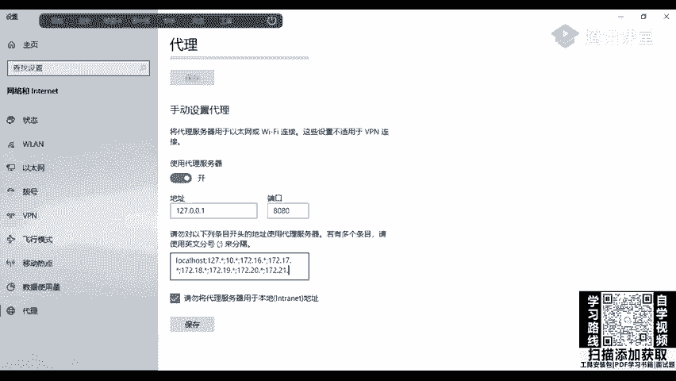

可以就是找到你自己的一个内网IP我们CMD里面查看IP config。找到你本地的1个IP，然后的话可以使用你本地的1个IP来去进行一个访问，就能够通过啊BP来进行一个抓包。

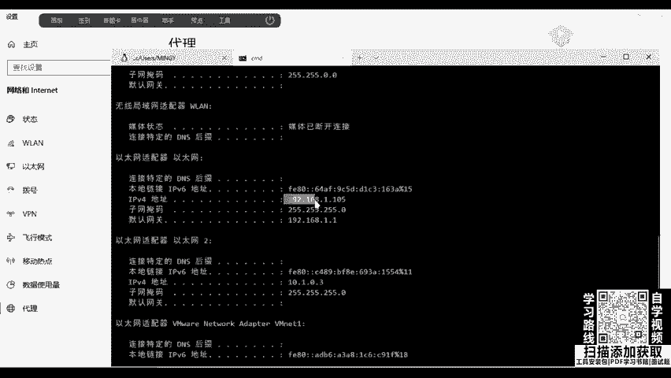

这样的话呃设置完毕之后，我们。就能够去。呃，设置完毕之后的话，我们就需要在这里。这里的话有一个inccept intercept intercept的话就是啊。进行一个拦截抓包，这里有一个选项。

这里是一个off的话，就是说明它是没有开启抓包的。如果说点一下，就它会信呃它会变成黑色嘛，就是ison，就说明它已经可以呃做一个拦截了。就说我们这里访问的一个数据包都会经过啊，我们的这样的1个BP。

可以看到这里的话呃，有抓到一个包，我们可以点这个forward来发送。发生的话，它就是就是下一步的一个请求嘛。如果说你不想你不想要这一个包的话，你就可以把它jo丢掉。嗯。

这话呃我就不一一的一个一个的去那个了。然后这里的话呃，我还是习惯使用这一个，因为这样子的话就是。啊，操作要更加方便一些。嗯，这样的话我就不去使用这一个了。我使用这一个浏览器。

当然的话火狐火狐的一个设置也是一样的，就是在设置里面有一个代理设置。我这的话就用这一个。选择BP。然后我想要去，我先去。抓个包对吧？呃。在抓包之前的话，我再介绍一下这个吧。

这个的话有1个HTP的1个history，就这个history的话，就是我们这里啊我不开这一个，对吧？我因为我开这个的话，它就会拦截你当前你反请求的这样的一个包。如果不开这里的话，它。

比如说我这里我先把它清掉。然后的话我去访问呃，我们和天网实验室，对吧？可以看到那这里的话就会有这样的一些数据包。从这一个开始。对吧它首先的话是啊一个一个get请求，请求了我们的服务器的主机是这一个对吧？

那我们可以在这里能够看得到他的一个请求的一个请求呃消息，请求报文。就跟我们前面是啊类似的对吧？就包括我们的一个请求函以及请求头。因为这里的话没有呃其他的一个请求数，没有用get方式去请求数据。

而且各的方式的话，它是没有这样的一个请求体的。也就是在后面的话呢是没有啊一些数据的。你就算用get方式去呃传递数据的话，也是在我们的这里在我们的1个UIIUL上面去进行一个添加。

然他在这里的话能够查看到一些它的一些参数。啊，以及它的一些头部，这里的话是一些字段，以及它的一些头部的一个值。这个的话是它的1个16进制。哦，其实主要的话就是看这个request，还有respon。

也就是它的一个响应。响应的话可以看到我这里请求的是这一个呃海天乐，然后它是一个啊就是干干的话就是直接是访问的他的一个网站，后面的话没有接。其他的一个路径，然后它的一个响应的话就是这样子。

同样呢是包括一个呃。呃，状态函，然后包括一个请求头可以看到这里的话，我们请求我们请求这一个网站的话，它就会响应给你这样子的一个s cookie。里面的话就包含我们的一些我们的一个cookie值。哦。

这个cookie值的话，我们可以在第二个请第二个请求当中能够可以看到。可看到在这里的话，它就会带上了这样子的一个cookie值。也就是客户端他在发送向服务端发送请求的时候。

他会带上我们的一个呃cookie值。然后的话再发送请求。嗯。😊，这样的话就是能够查看到呃，我这里去访问。呃，实验室的一个页面，然后的话它有哪哪样的一些请求，它会都会在列列在这里。

比如是我们的1个HDP请求的一个历史记录。这就是这一个模块。然后刚刚的话我们看到了一个get请求，对吧？它是像这样子的一个形式。我们如果说想要重新去发送这样的一个get请求的话。

我们可以把它发送到我们的一个repeat这一个模块。发送到rep的模块的话，我们可以通过右键然后嗯。🤧这里send torepeat这个当然号习我是习惯性的话会使用快捷键，就是cttrorl加啊。

就是这个ctrl加，然后的话它就会发送到我们的一个repeat模块。然会把我们的一个get请求的一个啊消息报文，它会列到这里，然后我们直接点这个发送发送之后的话。

它就会向服务器发送我们的这样的一个请求好，以及。返回服务端的一个响应。这就是一个呃get请求。🤧嗯。🤧嗯。Yeah。然后的话就是postpost的话就是像我们的一个指定的一个呃UIS呃附加新的一个资源。

也就是传递我们的一个数据。就一般的话pos的请求的话，它。是用于我们的一个表单的一个提交以及文件的一个上传。什么是表单的一个提交呢？就这里的话，我以这一个。我们的一个登录。对啊。登录的一个页面。

我先在这里。嗯，我先把它清掉。就。方便查看。首先这里的话是一个登录的一个。呃，这样子的一个界面对吧？这里的话就是呃如果懂情端的话，就是知道我们在这里啊进行登录的时候，它其实就是一个表单。

然后我们把我们的一个数据填写到这里。比如说我这里是12345。2QK点com。密码的话。随便输一个，然后的话我这里。进行一个登录。登录之后的话，它就会有这样子的一个请求。啊。

我们可以看到它的一个请求类型的话就是一个posts，对吧？嗯。然后pos了之后的话，它就会有这样的一个响应。这样的话主要是看这一个。这里我们poss了之后的话，可以看到。他boss的一个。估计。😡。

一个文件路径就是这一个对吧？login点action，也就是我们的这一个。

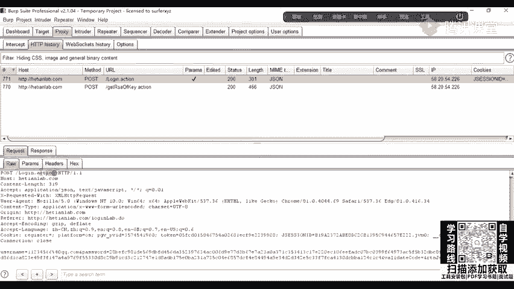

这一部分。

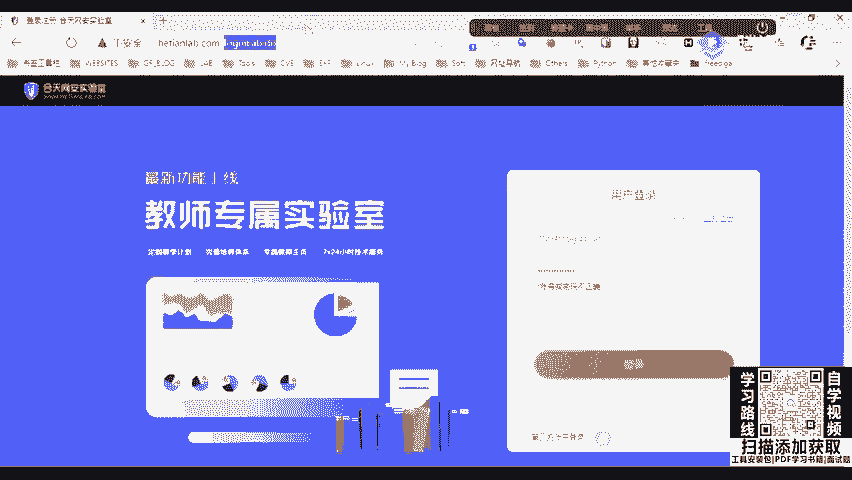

然后的话是我们的一个host。我们请求的一个服务主机，以及我们的一些啊头部字段，就告诉服务器我啊我的一些信息。比如说我是从哪里过来的，对吧？

re我是我上一个访问的页面是这一个loing label in do对吧？就我的这一个请求，它是从这一个页面过来的，以及orange的话，就是我的一个啊，我是从这一个和心lob点com这个网站。🤧嗯。

嗯，然后的话就是一个cookie值。这里主要的话就是看一下这里啊，这里的话就是我们请求的一个数据，也就是我们所说的一个表单。它的一个构成的话就是这里我们的一个参数。后面的话接我们的一个值。

比如说这个user name，就是后面接我们的一个用户名，对吧？它sword后面接的话是我们的一个密密码。当然的话这里是一个加密的一个密码。呃，请求的一个参数的话，用啊多个参数之间的话。

用and进行一个连接。嗯。这这就是一个po的一个请求。然后因为这里的话是一个呃用户跟密码是错误的，所以它的一个响应的话可以看到它返回的是一个节省的一个数据，对吧？

然后返回的一个节省数据的话是这样子的一个数据，它的一个结果的话是f，也就是失败的啊，就说你的一个请求是呃错误的。就是说请求是不成功的。比如可以看到这里的话，账号密码是不正确嘛，对吧？啊，不是说请求成功。

是你的这一个账号密码是错误的，它会返回这样子的一个呃响应给客户端。

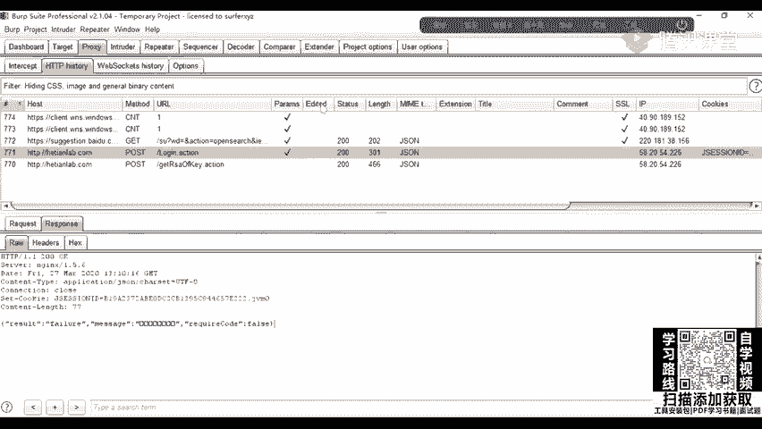

哎，然后的话就不会有下面的一个请求。

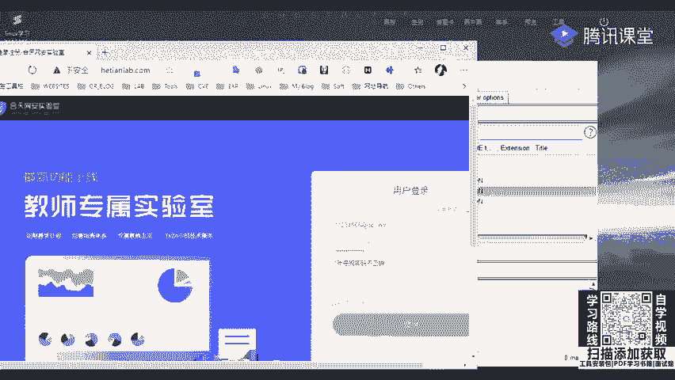

就比如说这个话是没有登录成功嘛，对吧？它不会跳转到我们登录之后的一个界面。

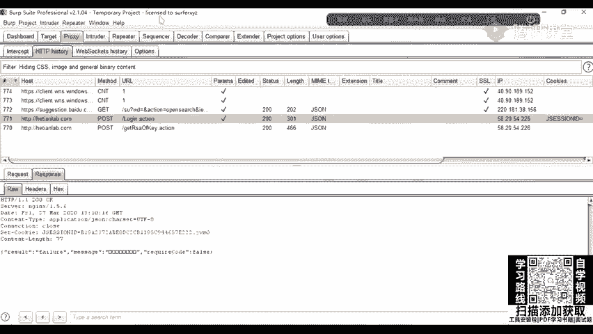

这就是一个pos的请求呃，提交表单。

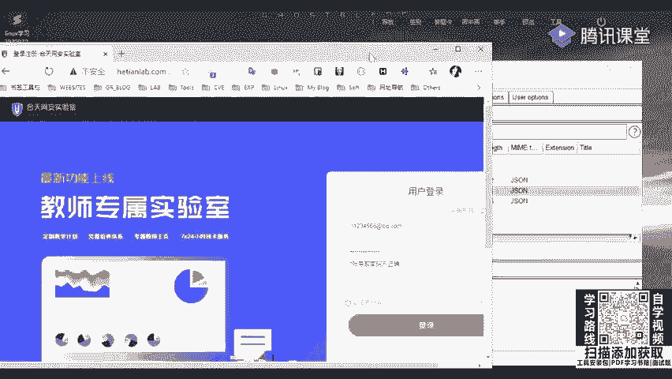

呃，还有的话就是呃用于再进行一个文件上传，对吧？文件上传的话，我以嗯。我这一个服务器。给一个例子吧。好了。

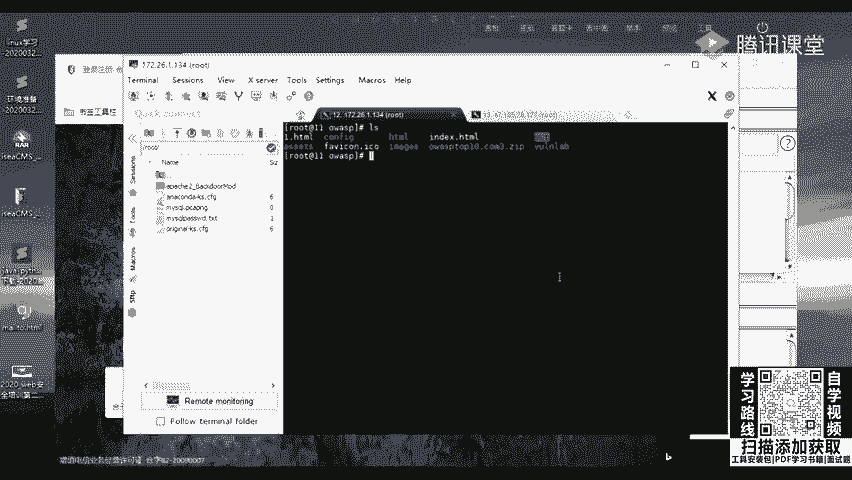

嗯。

我以这一个呃文件上传这一个啊，我随便。打开一个，这边的话是一个上传文件的一个页面，对吧？

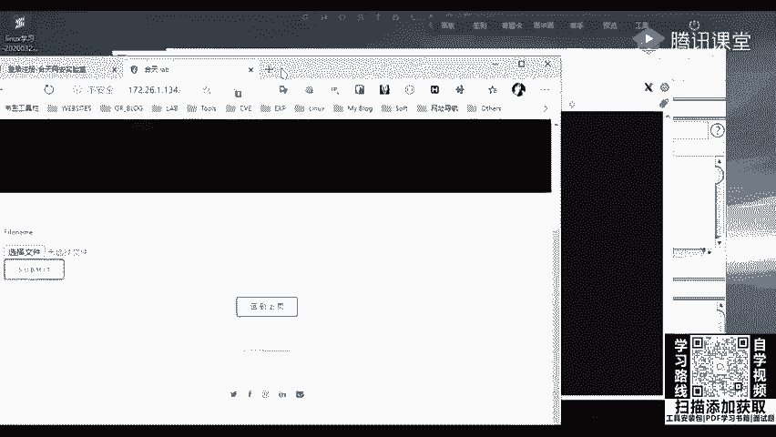

嗯，这样的话我随便找一个文件。首首先的话我先选择一个文件。Okay。我操上传一个这个S点PHB。打开，然后这里的话我先对它做一个。抓包吧。然后我们点击submit，也就是提交上传。

然后的话可以看到它的一个请求的话，就是这样子一界面，我先把它发到我们的一个repeat对吧？他的一个请求的一个报文是这样子的一个po的请求。请求的一个呃文件的路径的话。

就是这个upload下面的1个1点PP对吧？啊，主要的话是看这里。下面这里的话一个请求的一个请求体。就我们的所传递的一个数据，它是这样子的一串数据。电的话给大家介绍一下。嗯。我们先看一下PPT吧。

就给大家介绍一下PDP他请求的方法。的几种coner type，就是说几种呃。类型。首先第一个的话就是这个application叉W form，就是这个的话是最常见的一个po的一个提交数据的一个方式。

就是我们的就在传递表单的时候，它是使用的这样的一个conttainent type呃其实。呃。Yeah。哦。删掉你啊。好，这一个。就这里刚刚的话就是我们用po来去提交我们的一个进行一个登录，对吧？

一个form母表单可以看到它的一个conent type，就是这里它的个conent type的话就是这一串。这个的话就是啊表示就是呃我传递的一个数据的话，它是一个原生的。

就是一个form母表单的一个数据。嗯。😊，然，它是呃浏览器能够支持的。然后第二种的话就是这个martypart multity part form date。就这种方式的话，它一般是用来上传文件。

也就是我这里给大家说到的这一个，在你上传文件的时候，它的一个conter type。他的一个嗯。加密的一个方式是在这样子。他的话要注意的话，他这一个。在上传文件的时候。

它会首先会在这一个contenter type上面会随机生成一个这样的一个boundary的一个字段。它是一个随机的一个字符串，就这一个。然后的话生成这样的一个随机字符串之后。他这一个是什么意思呢？

就是嗯。看一下这一段话吧。它是呃这个boundary，它是用于分隔不同的一个字段，就是避免与正文的一个内容重复。然后这里的话是一个随机生成的一个字符串。然，因为它是比较长的。🤧嗯。😊，🤧。Yes。

Yeah。不好意思，烤有点干了。嗯。我看了一下时间哦，好像。要加班了。然后这里的话呃我我。呃，这次课程的话，我先就把这一个讲完吧，好吧，把这一个pos的一个理解理解讲完。哦。😮。

后面的话后面的一些内容的话，我下节课再给大家做一个。介绍吧。好哇。这里的话呃可能内容的话会稍微多一点。然，下节课的话呃是一个考核，考核之前的话呃，考核的话，我会把这一个用这个网址发给大家。

以及啊有一个实验。这呃这一个网址这里的话就是呃一个。比较简单的一个靶场。这关于头部字段的一些理解的一个题目。大家可以呃就做一下，然后下一次课的时候就是把这个考核做一个讲解。对题目的话是比较简单的。

就建议大家自己独立完成。然后的话还有这一个实验，这个实验的话就是关于呃一个put方法的一个漏洞的一个利用。嗯。就是这一个tomca的一个远程代码执行漏洞，是它是呃关于一个put方法的一个利用。呃。

因为本来我这节课也会有给大家讲一个put方法的一个利用。但是因为呃时间关系的话。呃，就下节课再给大家做一个讲解吧。那么还有一部分的一个内容。这样的话我先把这个po post的方法给大家呃讲完。

就前面的话讲到我们使用这样子的一个方式方式来呃这样的一个编码方式，就这个con type来用来上传文件的时候会去使用到。然后的话它会在这个con types里面的话。

它会生成这样子的一个随机的一个字字符串。他主要是为了分隔不同的一个字段。我们可以来看一下这一个。Yeah。它是以这一个随机生成的一个字符串，对吧？你呃发送的这一个数据，也就是我们的一个请求体。

它是以这一个字串开头。然后后面的话是接我们的一些，比如说我这里上传的是一个文件，对吧？它这里接的话是我们的一个文件名，对吧？F name以及它的一个啊conent type它的一个数据类型。他呢个嗯。

不是数据类型，是那个。呃，文本的一个。呃。这个是。叫啥的。不能玩呢。嗯。啊，这个的话是。嗯。啊，就叫做con type啊，就是它的一个呃编码的一个数据流的一个类型吧。

然后我这里的话是这里的话是呃传的这个S点PP文件里面的一个内容。这个内容的话就是一个常见的一个一句话嘛，对吧？然后后面的话同样的就是接我们的一个。呃。

这样的一个band怼来分隔我们的一个上面的一个内容以及下面的内容。然后的话呃最后的话再以这一个band怼里字符串做一个结尾。这就是上传文件，它的一个请求头的一个啊构成的一个部分构成的一些部分的一个讲解。

我们这里可以来看一下，就是我这里来发送这样的一个请求包，可以看到它这里是呃有这样的一个响应就是。啊，它不支持上传我们的1个PHP的一个文件。H。这就是呃使用pos的方式来向服务端传递一个数据。

这这里的话是呃传递我们的一个form母表单。然后这里的话是我们在上传文件的时候，它的一个呃上传文件的一个请求体的一个格式。也就是我们上传文件的一些内容，以及它的一些呃属一些信息。嗯。啊嗯。

然后后面的一些相关的还有一个headhead方法，以及option啊，还有啊put以及delete方法。这样的话。呃，我们留在下一节课再给大家做一个讲解吧。因为现在的话呃时间已经不早了。嗯。

我也忘记看时间了，所以啊可能稍微又耽误了大家一点时间吧。哦，大家呃应该没有什么问题吧。如果有什么问题的话，呃，大家在群里或者是说明天再问吧，因为现在也不早了。呃，想大家应该也应该要早点休息了吧。

如果有什么问题的话，下一节课或者是说呃在群里，然后的话再问我吧。好吧。那我们今天的一个课程内容的话就到这里结束了。好，有问题的话，我再私聊我吧。欢迎大家来进行一个提问吧。啊，谢谢大家的一个啊观看。😊。

我们下节课再见。好，大家晚上好。呃，我们现在的话正式开始我们本次课程的一个内容。然后因为上一节课的话，因为时间关系，就是说呃还有一部分的一个内容没有给大家介绍完。然的话呃。

我们这节课的话把上节课啊没有讲完的一些内容的话，再做一个补充。首今上节课的话，我们讲到了就是HTV请求请求方法的监理，讲到了前面的两个也也是我们常见的一个get方法，以及我们的一个pos的方法。🤧嗯。

😊，那的话对post的呃几种的几种can type，也就是我们传说的这种数据的一个类型做了一个呃讲解。Yeah。然，下面的话我们一起来看一下这一个head的一个请求方法。

就head它是请求获取由我们的这1个UI所标识的资源的一个响应消息的一个爆头首部。就它它是不会返回我们的一个报文主体的，它只返回我们的一个响应消息的这一个包括状态行以及头部。

而不会呃而不会返回我们的一个响应响响应的一个主体。那option的话就是查询资源所支持的一个方法，也就是通过这一个optionions方法的话，来查询服务器它所支持的这样的一些请求方法。

比如说如果比如说我们可以通过这一个option方法来查看。这一个我这一个服务器，它支持的这一些方法，有这有我在这里横框所框的这一些方法，有get啊，head。

post delete确等等的这样的一些方法。然后第三个的话就是这一个put。或者的话就是请求服务器存储的一个资源。然后我们利用这1个UI来作为它的一个标识。然，这里需要呃提到的一点的话。

就是服务器它会将请求主体的一个内容会保存到我们UL指定的一个资源位置。就是通过这个word的方法，可以帮可以把我们的一个请求体请求主体中的一个内容保存到呃服务器的指定的一个位置。Yeah。然。

这里的话就会有两种两种情况。就是说第一种第二我指定的一个资源，如果它不存在的话，服务器它会就会新建这样的一个文件。也就是以我们这里的1个UII作为它的一个标识，或者是说文件名的一个文件。

然后的话将我们请求主体里面的一个内容。保存到我们新建的这一个文件里面，然后它返回那个响应状态码的话是201。嗯。😊，啊第二种情况的话就是UR它指定的资源存在的话，服务器就会重置这一个文件里面的一个内容。

然后用我们发送的这个请求主体中的内容来覆盖云文件的一个内容。然后想应的一个状态码是200或者。204。嗯。对大家可以看一下我这里的一个例子。就说我通过这一个put方法。因为我们前面的话已经知道了。

就是说它这里它是支持一个put方法的一个使用的。🤧嗯。然后的话我们可以通过这个put的方法来上传我们这里的。呃，不是是来像我们的这一个服务器。指定的这一个呃UI的一个资源。

来写入我们这里一个请求体的一个。呃，内容就把我们这里请求题的内容写入到我们的这里。比如说这一个put目录下面的一个infor点PHP文件里面。然后这里写入的一个内容的话就是一个PHP in。啊。

大家可以看到这里的话，它返回的一个状态码的话是201。然后的话有一个状态的一个描述，描述字段是created。H。😊，前面我们是呃介绍了，就是说这里如果是反馈这个这这个201的话。

就是说说明我们指定的资源，就说我们的一个服务器上面的话，它是没有这样子的一个in或点PP文件的。然后我们通过put方法来新建了这样子的一个文件。哦，可以看到他在这里的话有这样的一个呃。一个英文的一个。

提示就说这里有一这里的一个我们的这个URI已经。啊，就是说这个文件已经被创建了。dele方法的话。是请求服务器删除我们的1个UI所标识的一个资源。

就前面的话put的话就是像我们的一个服务器创建一个我们指定的这一个文件，对吧？E的话就是呃删除我们指定的这样的一个文件。然，上除之后的话，它会返回这样的1个2连4的一个呃响应码。嗯。可以看到啊。

这里的话是因删除删除成功了。然后的话我们再去执行一下这一个就是访问，就是通过get来去获取这一个资源的话，可以看到它是呃找不到这样的一个文件的。

就是说我们前面通过put方法上传了这一个文件是呃已经找不到了，就说明我们已经删除成功。嗯。然后的话是一个ch。ch的话就是入径追踪。嗯，它的一个作用的话就是请求服务器回送收到的一个请求信息。

主要的话主要的一个作用是用来测试，还有诊断我们发送的这样个一个请求。它是否在客户端与服务端之间。做一个传送的时候，被呃网关啊、防火墙代理等等做了一个更改。

我们通过这一个确实方法来去印证我们的这一个请求请求消息里面。的一个内容是否被做了一个更改。可以看到我们通过这个方法能够在我们的一个响应体中。返回我们的一个请求头的一个内容。然后可以通过这个内容的话。

来跟我们的一个请求做一个比较。来进行一个判断是否被更改了。Yeah。嗯。😊，好的话下面我们一起来呃通过几个例子。通过几个实际的例子来给大家就是解释一下。来对他做一个进一进一步的一个理解。🤧嗯。😊。

这样的话大家首先呃可以跟我一起来做，就是打开我们的1个BP。🤧打开PP说的话呃。😊，我这里的这一个服务器的话，已经呃做了一个配置。嗯。大家可以直接来去用我的这个服务器做一个测试。🤧嗯。

首先的话我先对他做做一个抓包。抓包的话上节课已经给大家讲过了。🤧K。嗯。没的话，我这里。访问一下这样的一个页面，然后这里的话就会有呃这样的一些请求包，我们找到这个对吧？

就通过get方法来请求我们的这一个资源。那我们把这个包发到我们的这一个重放模。对我们可以通过这一个模块的话来进行一个呃发包改包。你看到我这里的话，get之后的话，它会呃。😊，返回了1个304。

就这样的一个状态嘛，304的话就是呃以上课的话就是有一个纯定向的一个。呃，意思。🤧哦。不好意思，喉咙有点。不了嗯。好。🤧嗯。嗯嗯。啊，我们看可以看到的话，这里的话是一个get方法，对吧？我们这里。

首先的话我们先来看一下这个head。艾的方法。我们直接把这里的一个get方法改成模板，改为我们的一个head方法，然后进行一个发送。发送之后的话，听呃。这个包没有响应体。我重新换一个吧。嗯。Yeah。

🤧K。我让这一个吧。Yeah。然我们发送一下这个包的话，可以看到他这边话返回了一个呃200，然后的话有它的一个响应头部以及一个响应体。也就是他响应的一个消息，对吧？

然后我们这里改为get ahead方法。啊，进行一个发送，可以看到这里的话，原本有的一个响应消息的话是已经没有了，它只返回了一个响应的一个头部，以及我们的一个状态行。这就是ha方法的一个呃。理解实用。

啊，第二个的话就是options。op时的话就是用来查询指定服务器的能够资援的一个能够支持的这种请求的一个方法。ん。😊，我们同样的把它的一个请求方法改成optionions，然后可以看到。

就是说在这里有一个ory这样子的一个响应的一个。跑步。然后他后面的话有接这样一串的一个东西，那这一串的话就是我包含了我们前面有说到的这样的一一些请求方法，对吧？option啊。

get aheadpost date确等等。以及后面的这样的一些后面的这些的话是。🤧嗯。😊，我们的一个web服务器，它里面的一个webDDAV它里面如果开启了这1个DAV的话。

它就会有它能够支持这样的一些方法。前面的话是我们的一些呃HP里面的一个请求请求的一个方法。🤧嗯。😊，然后的话就是一个put方法。put方法的话呃。其实我们我给大家布置的这一个实验的话。

就是利用的这样的一个铺的方法，对吧？如果大家有去做这个实验的话，我们可以通过这个如果。服务器它支持这样的一个put方法的话，我们可以通过这一个put来去向服务器传上传我们的一个呃木马文件。

然后的话来进行一个。Get a show。这里我同样的以我这一个机器做一个。测试。😡，这里我使用一个put方法。然后的话我把这里的一个是想要上传文件的一个目录做一个更改。我这边的话是。

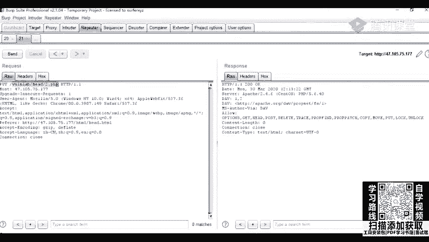

啊，就设置指定了一个目录。

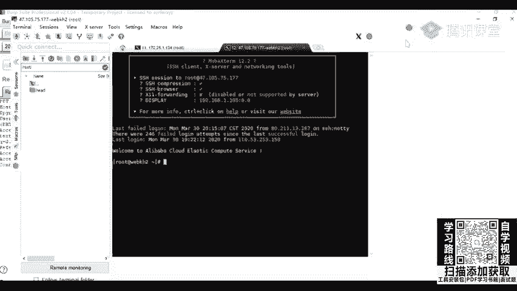

嗯。😊，我这边的话是呃指定了这样的一个目录。如果大家要去在尝试的时候的话，就上传到这一个库存目录下面。

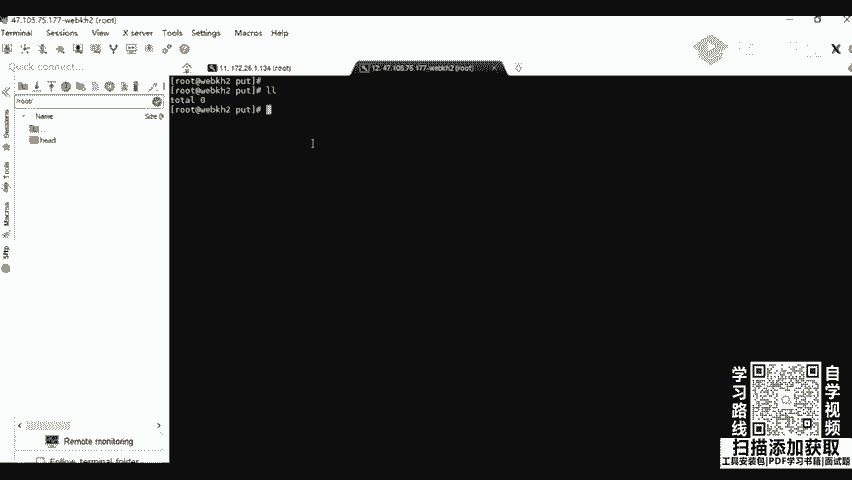

🤧嗯。😊。

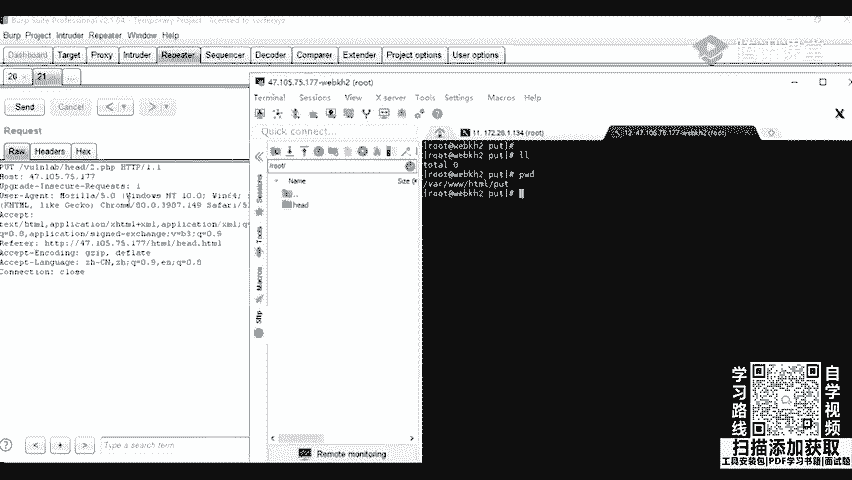

首先的话这里的话我需要更改一下，因为我是要上传到铺的目录，对吧？我们这里需要把它做一个更改，把它上传改到不同目录，然后指定我们的一个想要把我们的一个请求内容写入到哪一个文件里面。

比如说我这里写一个infor点PHP。然，在我们的这里的一个请求体的这一个部分内容。大家要注意的话就是。呃，要注意的话，就是前面我们有讲过，对吧？就是你的一个请求头部跟你的一个请求主体之间的话。

需要有一个空格。需要呃不不是空格，需需要一个空行，就是来做一个分隔。这样的话我呃写一个嗯。HBin的一个。代码。这样的话我直接进行一个发包，就把我的通过铺的方法，把我的这一个内容啊写入到。呃。

他的这个位置是。这个infor点HP文件里面。啊 sent。嗯个。挂包之后的话，我们可以看到这里它会有这样一个提示，对吧？就说。资源这一个infor点片区这一个文件的话已经被创建。

就是说我们怎么去进行一个印证呢？我们可以直接来去进行一个访问。访问的一个目录是呃这个服器过程目录下面的一个info。点PHP对吧？好。

访问执行之后的话可以看到它成功的执行了我们刚刚的1个PHP的一个代码。也就是显示我们的1个PHP in的一个信息。然后的话这里。我同样的可以。写我们的一个一句话。然后的话来进行一个呃。Get需要。

我这里的话写了一个简单的一个一句话呃。如果大家就是不是很了解相关的这的这样的一些PHP一句话的话，呃，大家直接百度一下吧，百度一下的话就会有很多就是这种呃十分简单的一个一句话。然后的话在后面嗯。

在后面讲文件上传的时候，会给大家有趣啊讲怎么去啊去做一个使用。这句话大概介绍一下吧。呃。我叫你直接发这里吧。然后这里的话就是呃一个简单的1个BHP的一个呃执行命令的一个代码。

就是使用的这一个L函数来执行命令。然后这里的话是呃一个。啊，使用一个pos的方法来获取我们的这样的一个传递的一个参数。这个参数的话就是pass，就我们传递的用pos的方式。

向我们的这一个木马传递我们的一些命令。他的话我这里的话呃。写到PHP呃，这个in for一吧，一点PHP。啊，发送发送的话可以看到已经创建完成啊，我们。做一个访问。完了之后的话呃，没有任何的一个东西。

如果大家看到这样的一个页面的话，就说明你的一个文件的话是已经上传成功了。あと系。也是可以被解析的。哦，我们上传了这样子的一个一句话木马的话，我们怎么去进行一个连接呢？连接的话呃。我们。需要用到。

一个web share的一个管理工具。我这的话就用这个C knife C刀。

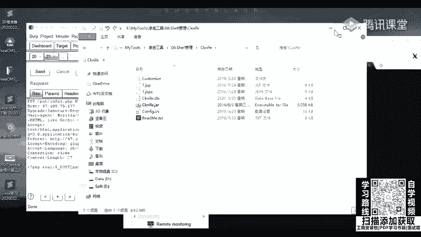

它是呃使使用的一个java元所编写的。就其实呃就跟菜刀是一样的。那这样的话，我们通过这样的一个web需要管理工具来去连接我们这里的。这一个木马。你接木马的话，我们。首先复制一下这一个它的一个链接。

我们需要在这里填写我们的木马的一个地址。然后这里的话是填写我们的一个密码，密码是什么呢？密码的话就是我们的这里的一个post，就是获取我们呃像这一个木马传递数据的这一个参数，这个pass。

也就是我们的一个密码。啊，停停写在这里。然后这里的话因为我们是1个PHP，对吧？我们选择这1个PHP。然后进行一个添加，添加之后的话就是这个。啊，我们直接双击。

装击之后的话可以看到我们这里直接进入到了它的。

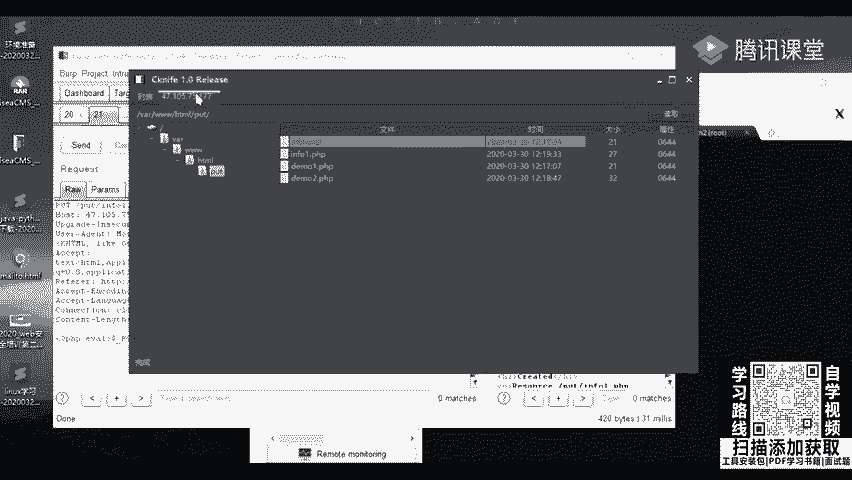

这个目录这个目录的话，我们可以看到我们刚刚上传的这样的两个文件，我们双击看一下它的一个内容，对吧？然后这个这个的话就是我们的这里连接的这个一句话木嘛。以及还有他的其他的一些文件，它的这样的一些目录。

可以看到对吧？以及它的呃根目录，就是说整个文件系统。然，我们也可以呃通过它的一个模拟终端来执行我们的一个命令。播外卖可看到当前那一个用户的话是阿帕奇。呃。当前所在的目录的话是在这一个目录。

也就是我们上传的这一个一句话木马的一个目录。

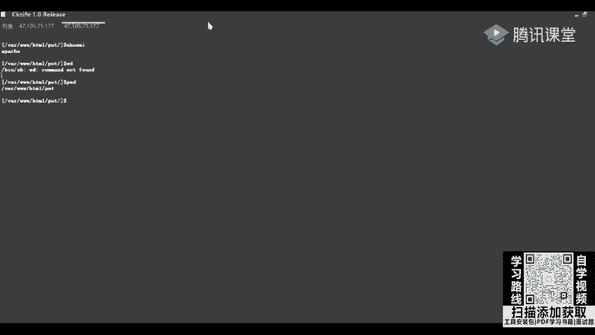

就是一个呃通过这一个put方法来上传我们的一个一一句话木马来。然后的话再通过这个呃web share的一个连接工具来获取我们的呃就是服务器的这样的一个权限。当然的话，现在获得的一个权限的话。

只是一个它的一个web服务器的一个阿帕奇的一个权限。就不是呃。

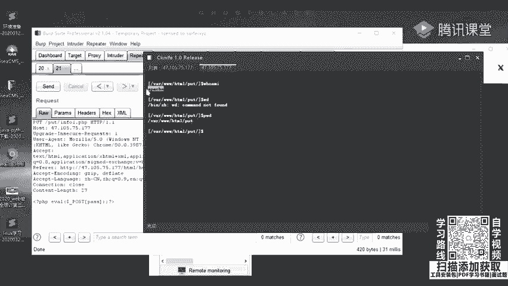

不是服务器的一个最高权限root。그。好，大家呃唉我刚刚看的话，有这个的话是有有人已经上传了，是吧？大家可以做一个尝试。然后的话呃大家如果得到需要之后的话，不要把我这一个服务器里面的东西呃删掉。

或者是说不要动我服务器里面的一个东西啊，好吧。

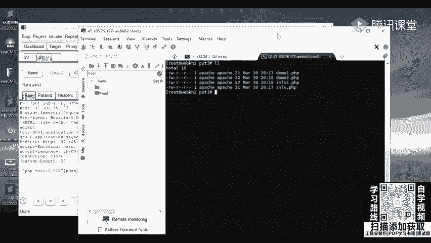

就只是给大家做一个就是体验一下，然后做一个演示。然后的话这里的话就是一个put方法。然后我们一起来看一下一个delate。elele方法。前面put办法的话是来创建一文件。

第类的话就是删除我们指定的这样的一个文件。按照我们使用呃。直接在把这里的一个put改为 it。改为一个deele的方法，然后的话我们删除。呃，这个in点PP对吧？嗯。😊，然后直接发包。

包上包之后的话可以。诶。哦，这里打错了DLET。直接发爆发爆照的话呃，返回的话是1个204，对吧？是说明的话我们这里已经啊这一个请求包的话已经呃发送成功。然后我们可以通过。get方法来去获取一下这一个。

文进的一个内容。你看到的话，他会提示就是说这一个文件的话是已经找不到了。也就是我们文件已经被删除成功了。同外我们可以在这里。

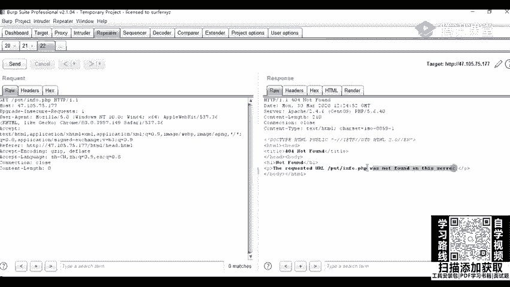

来去查看一下。可以看到的话，已经呃那一个infor点配置的话已经是被删除了的。

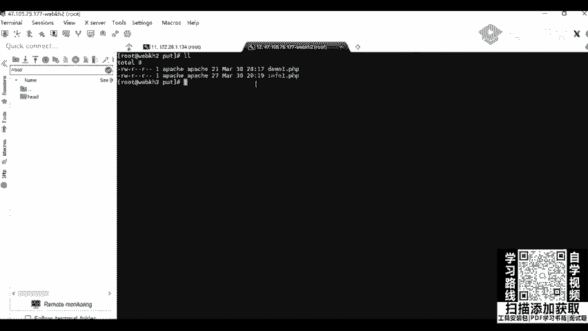

这就是一个delay方法。然后的话是一个chss。ch的话嗯，这个的话就比较简单。然案照我们。改一下请求方法。切。啊， send。嗯。Yeah。嗯。Mo。支持。

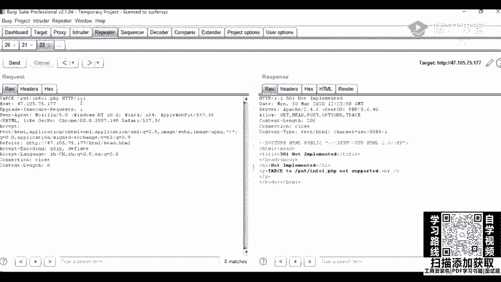

Yeah。这话我重新抓个包吧。

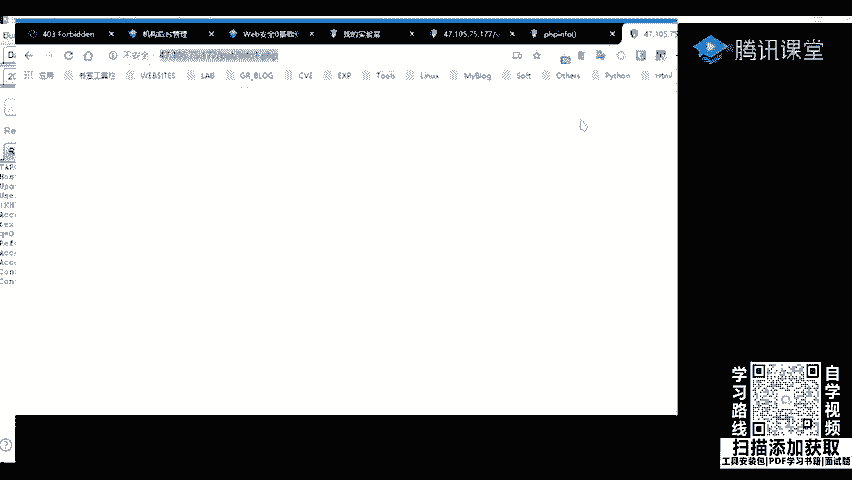

Yeah。嗯。Yeah。It's take shape。Yes。Yeah。Yeah。嗯。Yeah。不支持吗？天心。Yes。但什。Yeah。Yeah。Okay。嗯，支持的呀。哦，可以啊。

可以看到我这里的话呃，把这里的一个请求方法更改为确实的话，可以可以看到它的一个响应体，就是响应消息的话，返回的话就是我们这里的一个请求包的一个内容，请求消息的一个内容，对吧？就呃没有。

没有什么大的一个差别。这是一个che方法，就主要的话就是用来呃警测。判断我们的一个请求啊请求方法里面的一些内容是否有被更改。这就是。上面的话就是呃。这个HB请求方法的一个它的一个利用，以及它的一些。呃。

对他的一个理解。啊，大家有没有跟着我一起做呢？我刚刚看的话服务器是是已经呃是有人在做的吧，对吧？就建议的话大家呃就是用我这一个服务器的话尝试一下吧。哼。就啊你自己去操作一下的话。

就是对他的一个理解的话会更深刻一点嘛。啊，这里的话大家有没有什么疑问呢？应该没有什么问题吧。🤧嗯。😊，这个。你啊，你你。不要去更改这一个呀。就说你。你这里的话，你改的话，你就改你这里不是有吗？

host嘛，host的话就是主机嘛，然后po的话就是端口嘛。啊，你。这里的话你是说这个抓包是吗？抓包的话，你直接在这里。这里的话不是有。你。浏览器你访问之后嘛，访问之后的话不是会有这样的一一些请求包吗？

对吧？get请求包。然后的话在这里的话，我们直接把这一个包把它。就是send send torepeat repeatpeat的话就是重放，就是这一个重放模块用来发包改包的。或者说你用快捷键。

我是喜欢习惯用快捷键就是ctl加。然后到这里吧。到这里的话，它这样的一些信息的话是已经配置好了的。就呃不需要不需要你去手动的去更改什么的。对吧。然后这样的话你就可以在这里把更改我们的这些请求头啊。

以及我们的这样的一些内容。然后的话再把我们的这一个请求包把它给发送出去。这边的话就是它的一个响应。就是响应的一些消息。现在还有问题吗？呃，你你应该你是。呃，你应该是上节课没有听吧。没有问题了是吧？

好的好的。大家没有问题的话，那我们继续我们下面的一个内容嗯。下面的话就是呃。cookie section的一个警界，就是呃带大家一起来了解一下这两个东西是什么。呃。

这两这里的话主要的话就是一些基本的一个概念，大家就是跟我一起大概过一遍嘛。🤧嗯。😊，就HDPR，它是一个基于请求响应无状态的一个应用层的一个协议。的话呃就是着重理解一下这一个无状态，它是什么意思。

就无状态的话，它就是说服务器它是不知道用户上一次做了什么。就这里的话它会严重阻碍我们的这一个外表应用程序的一个交互。就。意思的话就是说嗯。比如说我们访问一个网站，对吧？我我们访问一个这样的一个网站。

通过这个HTB的一个请求给他发包。包包粥的话呃，我们访问的是这一个。嗯。举一个例子就是。大家购物。对吧大家在购物的时候，我们想要去我们去挑选一个一个东西，选择一个商品。选择好了之后的话。

我们在想要去进行一个结账的时候，就说把我们的一个购物车，对吧？把它给清空，想要结账的时候，这个时候你就会碰到一个问题。什么问题呢？就是说HB它是不知道你上次的一些一个请求。🤧嗯。😊。

也就说不知道你挑选了哪一些物品的。你的这一些物品的话，你想要去进行一个结账的话，它是呃不知道的，不知道去呃给你的哪一些物品做一个结账。而且呃服务器服务端的话，他不知道你。

不知道是你本人还是说其他人再去进行这样的一个请求，这就是他的1个HDP的一个无状态的一个特性。然后这样子的话就是说我是严重的就是呃阻碍了我们去。比如说进行一个购物，对吧？然。

cookie的话就是为了解决这样子的一个问题。它是网站为了辨别我们用户的一个身份来存储在我们本地终端上的这样的一个数据，它是由服务端生成，然后的话发送给我们的一个客户端。

通常的话就是我们通常访问网站的话，就是通过浏览器嘛。然后呃cookie的话，它是可以按在客户端中的一个存储位置的话分为这样的两种的，就是内存cookie，还有硬盘的一个cookie。

就是内存cookie的话，就是我们的这样的这样的一个cookie的话，它是呃存储在浏览器的一个内存。就存储在内存当中的。然后我们浏览器关闭之后的话，它的一个cookie就失效了。

也也就是我们的一个登录状态就失效了。然后硬盘库以的话就是。保存在我们的一个硬盘里面，但但是的话它是有一个过期的一个时间。他需要我们去进行一个设置。然后的话到了这样的一个过期时间的话，就会呃自动的失效。

然后cookie它的一一个作用的话，主要的话就是呃。在客户端存储用户访问网站的一些信息，主要的一些应用啊，就是用来记住密码。就是我们用于我们下次的一个自动登登录。

就不用不需要我们每次都去输入我们的一个账号密码，然后登录网站，然后就是购物车的一个功能，对吧？就我。我通过这个cookie的话，能够辨别我的一个身份，然后的话能够保存我呃购买的这样的一些物品。

它的一些信息。然后第三的话就是记录用户的一些浏览数据啊，就是我啊可以记录你就是浏览的哪一些啊物品，然后的话进行商品广告的一些推荐等等。当然的话他同样的是有缺陷的。就酷的话。

它会附加在我们的每1个HTP请求中。然后第二个的话就是它的一个。他在HB请求中的话，它是一个明文传递的。所以的话它的一个安全性是呃存在问题的。当样的话除非是使用我们等会会介绍的1个HTPS。

然后cookie它的一个大小的话是也是存在一个限制，就只能存储4KB左右的一个呃内容。然后这里的话就是呃cookie的一些工作原理。呃，这里的话大概大家大概看一下吧，等会我一个我以一个例子来。

做一个就是讲解吧。就首先的话它就是呃服务端，它会创建一个cookie嘛，就是在我们用户去浏览网站的时候，它会生成这样的一个cookie ID。然后的话他会呃就是将我们那个cookie的话。

它会放到我们那个响应头里面。然后就是有一个set cookieook的这样的一个响应头部。然后的话就存储在我们本地。存储在我们的浏览器当中，就是浏览器收到这样的一个报文之后。

它会在呃浏览器当中生成相应的一个pooky。cookie的一个内容的话，就是我们响应头里面服务端生成的这样的一个cookie。然后的话我们之后的每一个对网站的一个请求。

需要去辨别我们用户身份的一个请求的话，都会把我们的这样的一个cookie值就是呃放到我们的一个请求头当中，像呃发发送到我们的一个网站服务器里面。然后的话就是。第四个话就是会读取cooking。好。

就是服务器它接收到用户对用户存储在HB请求报文当中的一个cookie之后的话，就能够啊从这一串cookie值里面找到。他所需要的一些信息。这就是他的一个基本的一个工作原理。然后筛选的话跟cook的话呃。

呃，比较类似。就筛选的话，它是一种服务端的一个机制，就是用来存储特定用户绘画的所需的一些信息。那同样的也是用来存储啊我们的一些绘画信息的。嗯。😊，然后筛选他。由服务端生成，主要的话是保存在服务端。

而不是像酷ki一样，是保存在我们的一个客户端。嗯。然后筛选它的一个根本作用就是在服务端存储用户和服务绘画的一些信息，就是存储我们的一个客户端与服务端。的这样的一个绘画的相关的一些信息。

同样呢是呃可以用于判断用户是否登录啊，还有啊购物车购物。的一些功能。工作原理的话呃。这里的话大家。大概看一下吧，我就不。不说了。🤧嗯。就呃其实也是类似的。然后它的呃cooking跟筛选的话。

它的一些区别。首先的话就是cookie它是存在客户端嘛，筛选的话它是存在服务端。然后存取的一个方式，就cookie的话呃，只能保管这样的一个阿斯卡的一些字符串。然后的话筛选的话。

它是能够存储任何的一些类型的一个数据。然，安全性的话，因为c的话，它是存储在浏览器当中，就是说对我们客户端它是可见的。然后客户端因为他是在本地嘛，就是客户端我们的一些程序的话是可以能够获取到。

获取到呃存储在浏览器当中的一个cookie的。也就是能够获取到我们登录网站的一个身份的一个凭证。然后筛选的话，它是存储在服务器上的。就它是不存在一个敏感信息的这样泄露的一个风险。嗯。哦。哦，不好意思啊。

这个呃前面的话漏了一漏了一点，就是啊本来是应该先讲HPS的。这样的话呃。就是HG片呃，主要的话就是理解一下它的一个概念吧，就是HDPS其实呃就是HTTP加1个SSL，或者说TITL的一个安全套件制成。

因为他的一个全称的话，就是这样子的一个。全称就是HDB，它就是1个HDB的一个安全版。嗯。就它相比于HTP的话，就是它的一个安全性是更有保障的。因为它是呃。他是呃有利用这样子的1个SSL来建行一个。

全信道，而且它它的一个数据包的话是一个加密的，就不像我们HTP里面的话，就是我们的一些传递的一些数据包，它都是呃铭文铭文存储在我们的一个请求当中的。嗯。主要的话是用来保护我们啊数据的一个隐私。

以及它的一个完整性。这的话呃。大概了解一下吧，就这些理论的东西的话，我就不花太多时间去讲解了。这里的话就是呃我们今天课程的就是呃上节课没有讲完的一些内容吧，就是。

其实主要的话就是带大家就是你呃了解一下HDB请求方法，它的一些基本的一个利用。然后后面的1个HPS的话，就大家理解一下它的一个概念。

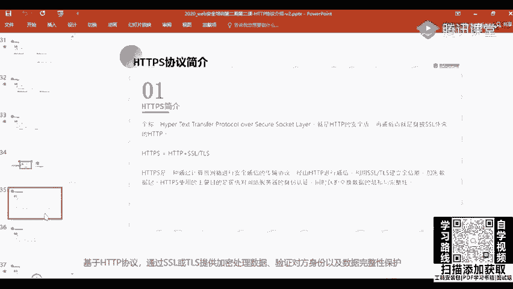

嗯。啊，cookie筛选的话呃。诶。cookie筛选的话，我这里啊。以我们的一个白天网上实验室做一个例子。

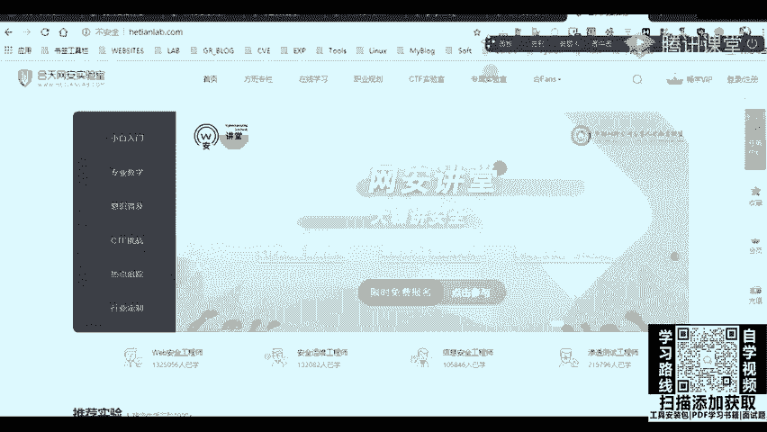

。

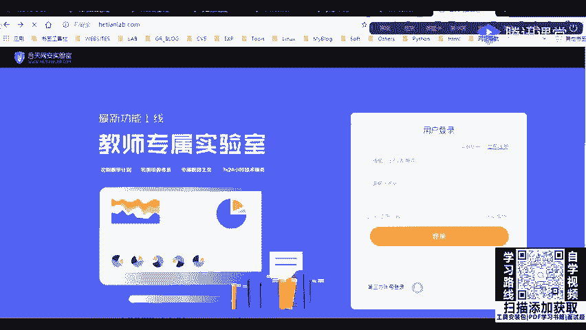

嗯。首先这里的话呃把BP打开，然后。即你。把这些请求给清掉。然，首先的话我。我这样的话访问一下我们的一个实验室，这样的话就有相应的一些呃请求包。啊，这里是。我这里重新用个浏览器吧。Okay。Okay。

嗯。Yeah。Yeah。Yeah。Yeah。这话我反问一下我们的一个核电网络实验室。然后的话我们一起来看一下这里的一些请求包。首先的话是。呃，访问的这一个请求方就是这个对吧？

首先它是通过一个get请求来访问我们的一个。啊。实验室的一个网站。啊，访问之后的话，它的一个请求包就是这样子。是条白。啊，这个。然后他的一个首先第一次访问的话，它的一个请求包就是这样子，对吧？

然后它它的一个响应，我们一起来看一下它的一个响应的话，主要的话是看这里的一个响应头部，它的一个响应头部，这里的一个set cookie。嗯。那 cookieook的话就是我们的一个服务端。

它会生成这样子的一个啊ja筛选的1个ID。然后这一部分的话就是它的一个cookie，就是服务端生成了一个cookie，然后到我们的一个。第二次。呃，下一个一个请求包的话。

里面可以看到它会携带我们的这样的生成的这样的一个cookie值。有这一个，然后的话再向我们的一个服务器发起请求。Yeah。这就是我们前面说到的一个cookie，它的一个呃基本的一个工作原理。

就当用户再去访问一个网站的时候。就是网站的一个服务器，它会生成这样的一个cookie。生成cookie之后的话，它会在它会放在我们的一个响应头部里面。

然后是放放在这样的一个set cookie这一个字段里面。然后的话他会呃。呃，就是客户端，他收到这样子的服务端的一个响应之后，他就会存储我们的一个cookie。

就把我们的一个cookie值存储到我们的客户端。也就是呃具体点的话就是浏览器。然后浏览器接收到这个cookie之后的话，存储之后的话，在下一次对网站发起请求之后。

它就会携带我们的这样的一个cookie值。这就是cookie的一个基本的一个工作原理。啊嗯。我们本次课程的一个内容的话，大概就是这一些。然后就是应大家的一个要求的话，就把呃上节课的一些题目做一个。介绍。

而，这题目的话就其实呃其实比较简单啊。我们首先的话先看第一个吧。

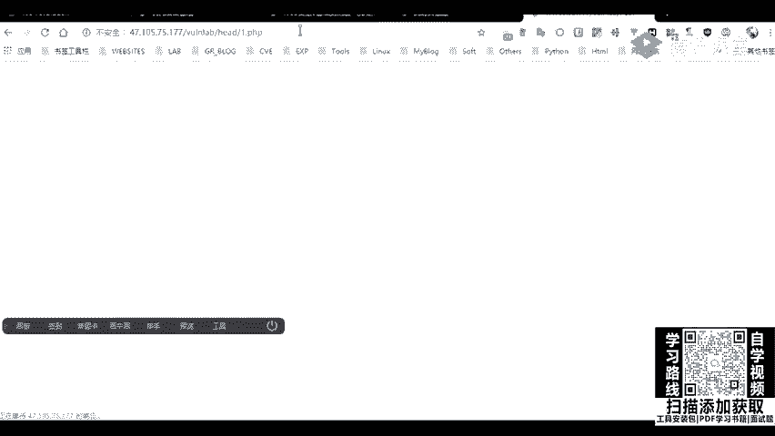

因先第一个的话就是呃。反正心。

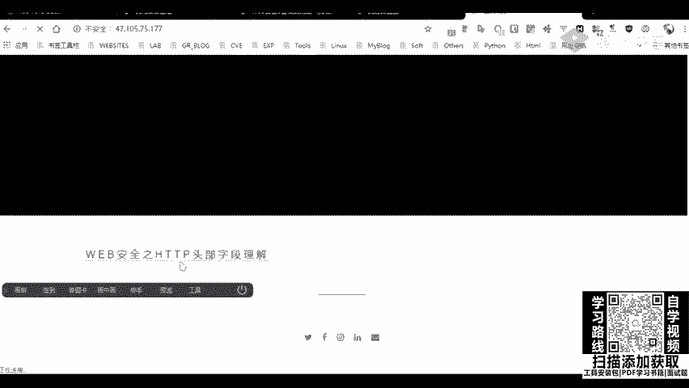

其实从题目意思就看到是HTP头步字段的一些理解嘛，对吧？首先第一个就是呃观察GDP响应头，就响应头是哪一个部分，对吧？首先大家要有一个呃概念。就什么是请求头然后什么是响应头？

然后我们这里的话直接就用谷歌它自带的这样的1个F42，就是呃。然后这里的一个network，我们可以看到这我们请求的这一个文呃，资源就是这一个对吧？1点PHP然后这里的话有一个heads。

那你head时的话，就包括了就是呃。用户的一个强应呃，请求头部以及啊。他的一个响应的一个头部。可看到呃这个request head的话就是请求头部，就是呃请求头部的话就是这样的一些内容。好，这嘅。

respondingrespon的话就是响应。这里的话就是响应头部的一些内容。然后这里的一个题目的考点的话就是这一个嘛，就我们在这个响应头部里面就观察它。有什么特特殊的一些东西，对吧？

然后可以看到有这样子的一串值，一个K。啊，hello word这个的话就是我们这个题目的一个答案。就通过这个题目来让大家分清楚，就是呃请求头部以及响应头步。这样的话我们也可以利用就是BP吧。对吧。嗯。

😊，呃。我们直接从这里就能够看得到，对吧？这是他的一个请求头部，这是他的一个响应。然后的话就是呃我们的一个答案就是这个。嗯。嗯。😊，然后第二题。嗯。这头话就是一个rafer。😡，那我们点开看一下。

就呃大家结合上节课我们讲的一个内容，就rafer。客户端的一些请求呃头部。我们呃可以看一下这个raffer这个raffer自动的话，它它的一个意思的话就是呃新情网页的一个地址。

然后当前请请求网页紧随其后。也就是它的一个值的话，就是我们之前访问的一个呃网页的一个地址。然后的话我们的这一个请求。

它就会呃有携带这样子的一个地址这一个referre值后面的话就是我们呃之前访问的一个地址。然后后后面的一个请求的话，就是我们现在的这样的一个请求。啊，我们可以看到的话，这里就是它有个提示。

这这个基本的一些英文的话应该都能看得懂吧。就是这个页面的话，只接收来自这一个网站的一个。呃，请求。对吧。所以说他只做这样的一个请求，我们可以啊能够想到就是说服务端他是怎么去判断我们啊。

去判断他他的一个请求，它是指来自这样的一个网址呢，对吧？就是说通过rafer嘛。因为re的话，它是记录的就是之前的你前面之前的一个请求，就说这个请求之前的一个请求，它是了，它是从哪一个网址发过来的对吧？

那我们怎么去。啊，找到我们的一个答案呢。就是。通过更改我们那个refer嘛。然后把我们那一个refer值设置为这一个值，不就OK了吗？系。🤧嗯。然后怎么去设置？就同样的就是通过BP嘛。嗯。

我们找到我们的这一个请求包。对吧请求呃，它的一个请求包的话就是这个我们把它放到这个repeat进行一个更改。主要更改的一个值的话，就是这一个refer。就大家可以看到我们。

这里的一个re的话就是这一个页面。然后这个页面的话其实是呃我们访问这一个页面之前的一个页面，就是这一个页面，对吧？就是呃。我们返回一下返回一下之前的这个页面，就这一个页面，对吧？嗯，我们要改的话。

就是把这里的一个refer值改成我们的。这里它的一个提示的一个百度点com，然后我们再发送我们的一个请求包，发送之后的话就可以从从它的一个响应当中得到我们的一个答案。You are right。

然后第三题就是这个叉 for for差 for for的话是嗯。呃，就是上节课的话，有同学不是问我嘛，我还特意就是对他做了一个解释。这样的话我们点开这个题目。🤧嗯。😊，这是他的一个请求包，对吧？

然后它的一个提示就是说这个页面只接受来自bro host。嗯。就直接说来来之后look house的话，我们从题目意思的话也能够知道，就是说要去使用到我们那一个叉port for。哦。

我们可以通过就是他的一个提示来去呃了解到服务端，还去对服务端他是怎么去判断我们的这个请求是否满满足他的一个要求呢？就他会去获取我们呃。我们请求的1个IP地址，对吧？

然后的话如果他的1个IP地址是符合他服务端的一个要求，也就是来自这个loc的1个IP地址的话，他就。能够呃就是就我们就能够找到我们想要的一个答案。啊，这样的话就是需要。做一个更改他的一个请求包。哦。

改呃更改的一个内容的话，就是我们的一个查for for。更改为我们的一个lock host，然后我们进行一个。응。写错了吗？摸底的摸底的。Yeah。写错了呀。

是这个叉 for word for然后look host。好，我们s。Yes。嗯。Yeah。啊。搞错了。这的话是应该是IP地址。🤧嗯。😊，这样的话是呃就是他是获取到获取就是记录。

就是啊我们的一个真实的一个。啊，就是客户端它的一个真实的1个IP地址。然后的话如果说经历了，就是经过了代理的话，就用逗号分隔。然后的话接我们的一个代理的1个IP地址。或者然后的话如果多层代理的话。

就就是一层一层的往后面加。它这里的话就是存储的它的这样的一些就呃你的这个请求，它是从哪1个呃IP或者说哪一个代理IP过来的。

而我们只需要更改这个叉port for为他要求的这样的一个loc host就能够呃得到我们的一个P。

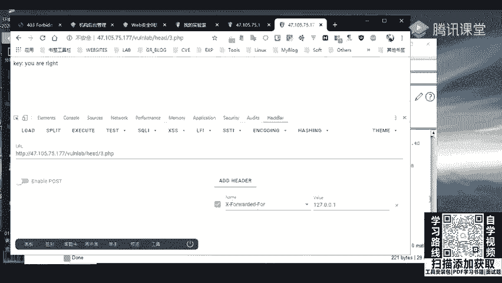

比如这一个。然后大家其实呃也可以使用这个hack barhack bar呃，直接在这里的话，也不用自己去输，就直接。

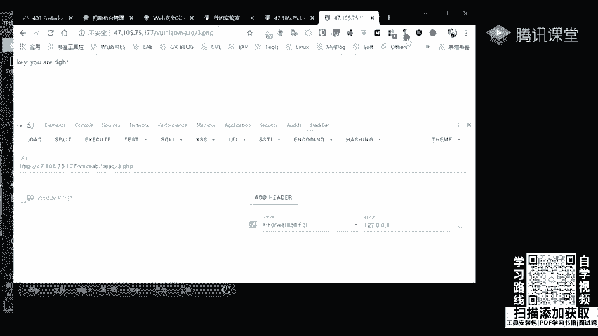

打关键词，它这里的话有。有提示就差port货，然后。就加在我们的一个请求头里面嘛，他会加加我们的这样的一个指定的一个head。然后第四个的话就是优 the优 the agentent。要在A卷的话。

可以看到它这里的话是呃。同样的就是提示。就这样的一个就是只允许来自iphone的这样的一个请求来获得我们的这样的来进入我们的这样的一个key page。对我们T存储的一个页面。嗯。😊。

就呃服务端它是通它是通过什么去判断我们的一个请求是来自什么样的一个设备呢？就是通过我们的这样的一个Uerag。我们可以看到，就是这里的一个请求的话是这样的一个。这样的一个usag，对吧？就是呃有莫栏。

还有什么win6064，还有呃。come。😡，就大家看到这样子的一一些一个东西的话，就是一个Uerag，然后还有其他的很多的一些Uerag。哦，这样的话我就不不一一介绍了。就大家看到这个的话。

就是知道能够知道你当前的这个请求，它是从什么样的一个设备发过来的，就可以看到它是从一个com，也是一个谷歌浏览器。访问过来的。然后这里的话，他他的一个题目要求的话是呃。你们要求是来自iphone对吧？

我这样的话呃直接把它改成为一个。IPhone。然后的话。进行一个请求，然后可以看到。他那个K就出来了。就是服务端它是通过这个Uerag。

通过就是呃用户的一个请求包中的一个UZag来去呃判断用户的一个请求，它是从什么样的一个设备发送过来的。就是这这个题目的话就是对这一个UZ agentent的一个理解。啊，就是一个accept。

language。acceptcept language就它它的一个请求头的一个意思的话，就是呃告诉服务端我能够接受的，我能够去呃适用的一个呃语言代码。就是呃大家呃我以。这一个为例子对吧？

这一个请求就大家可以看到它这里的这个请求包中的一个accept language的话，就是CH杠CNCH杠CN它这一个源代码对应的就是我们的一个中文简体。嗯。这学先就是他的一个语言的一个代码。

就是和国家地区。这一个的话就是代表的话就是中文的一个整体警体中文。呃，这个的话。可以看一下。Yeah。这个表吧。就这里的话，它有列列了，就是呃这个语代码跟呃国家名的一个表。哦就啊。

服务器验证了cookie还要再验证session吗？嗯，就是说呃对，这个的话我也没有提到。就这里的话就是说我们知道就是筛选的话。

它是用来保用来就是保存我们啊用户的一个客户端与服务端之间的一个绘画的一些信息，对吧？然的话筛选的话，它是通过我们的一个cookie来去进行一个就是它的一个筛选值的话。

它是存就是放在我们的一个呃cookie当中的。就前面我们的那一个例子的话，有看到。呃。前面这一个例子的话，我们可以看到。

就是这里服务端它生成的话是生成了这样的一个J sessionession IDD对吧？然后这里生成了这一个筛选I话，它是存储在。它是通过这个woookki来去进行一个传输的。呃。

放在这个cookie的一个头部字段里面的。嗯。😊，然后的话呃服务端就是我们客户端携带这样子的一个值的话，然后的话。把我们的一个请求发送到服务端，然后服务端的话就能够从它生成的。

就从从它这里的一个cookie值里面获取到他的想要的一些信息。这些信息是什么呢？就是呃你用户的一个身份的一些信息，对吧？就比如说你的一个登录状态。然后这里的话就是它呃这里的一些语言代码。

他这里的话比较多。然后从这一个题目的话，这一个提示的话我们可以看到哦呃。哦，对了，这一这里的话呃之前之前我放出来的话，这些题目的话是。呃，有几个是稍微有一点问题的。就可呃，然后的话我。

因为我之前我也没没一个一个去做。啊，我今天的话就稍微改了一下，就如果大家有做的话，就是可能第三个题目的话。呃，第三个题目的话可能就是你一访问的话就会跳转到我们的一个呃核天王实验室，对吧？

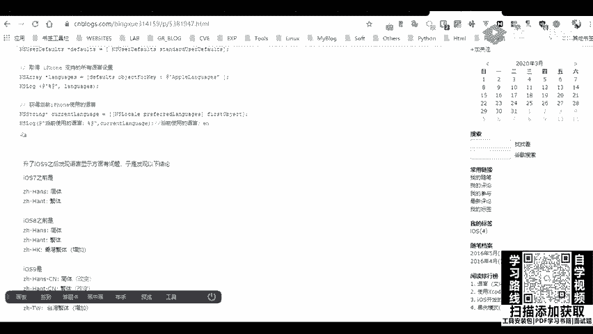

因为呃那个代码的话是有一个地方没有。没有注视量。

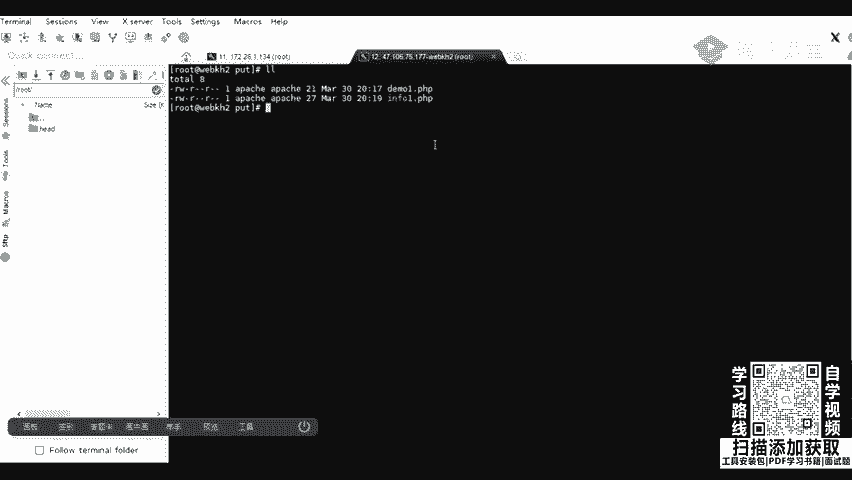

就是多写了一个代码，它有一个验证的话，就是直接跳转到我们那个核电网实验室。然后的话就是。

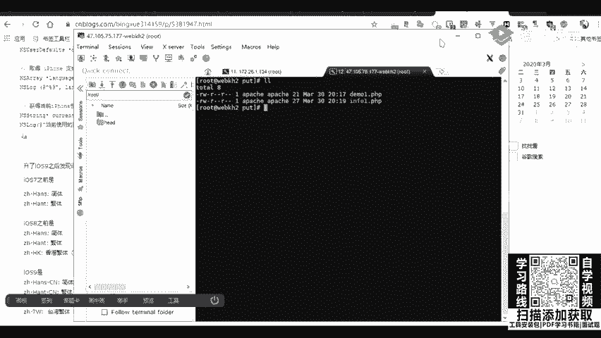

稍微有一点问题吧。然后我今天的话做了一个修改。然后这里的话我们可以看到这里一个only for这个arch。这个ps的话就是我们可以搜一下嘛，就是。呃，巴基斯坦。要我们的8帖对吧？🎼就巴基斯坦的话。

我们它的一个呃我们可以来搜一下，在这里来查找一下它的一个语音代码是什么？我们可以在这里看的话，是1个UR杠PK。然后这里的话我。这个题目所需要去啊就是。找到它的一个答案的话。

就是我们需要去更改它的一个accept language。喂，指定的这一个呃。So。这个。哦。就更改它的一个accept language。因为我这里的话，比如说这里的话是1个GH杠CN对吧？

他提示说只能来自巴基斯坦的。就直接收来自巴基斯坦的这样的一个呃语编码。然后所所以我要在这里去进行一个更改，更改它的一个语言是喂。要啊。嗯O。然后以分号做一个分隔。啊，补生二。嗯，哦算。以分号做一个分格。

然后的话我们就能够得到我们的K。然后这里的话就是涉及到一个accept language，它的一个就是一个构成。就这里的话我们可以看到我这里之前没改之前的话，是1个ZH杠CN开头，对吧？然后一个逗号。

然后ZHZHY就是代表中国嘛。然后这里的话就是整体中文的一个意思。然后后面的话就是一个QQ等于009，然后逗号E。烟的话，我们可以在这里来搜一下。是代表。美国。哦。就是代表呃使用英语嘛。你看到这里的话。

你EN的话都是以英语的。当然的话具体在于国家，后面的话要接我们的一个接他的一个国家代码。然后这里的话就是这一个Q等于0。9，大家可能不是会明白它的一个意思。这个这里的话就是它的一个权重。

就是0点它的一个权重越大的话，就是他会去啊他的一个请求的话，它会倾向于就是使用这样子的一个啊源源代码。就比如说这里的话呃默认的话是一个呃JH杠CN嘛，它它后面的话是没有这样的一个Q权重的。

就默认的话它是唯一，也就是最大的。然后他这里默认的话就会使用一个整体中文的一个语言。就是我们向服务端发起请求的话，响应就响应的话，它会响应是为一个整体中文。然后后面的话就是呃。可以是EN。

然后它的一个权重的话是009嘛。还有后面的话我是。还有后面的话可以加其他的。如果他允许的话。当然的话，我们这里也可以改改为一个新，改为一个新的话就是说明他呃可以接受所有的一个语言。

这的话就是对这一个except language的一个基本的一个理解。啊，就是第六题。第六题的话，我们可以看到就是呃就其实前面题目的话。也提示了就是cookie的一个理解嘛，对吧？

然后我们其实可以看到这里有个提示，就是please log in with a main account。它的个意思是什么呢？如果大家不懂不懂英文就翻译一下嘛，是吧。就请用管理员账户去去进行一个登录。

然后管理员的话就是这一个addmin嘛，对，用addmin的一个账户去进行一个登录。然后的话我们要去印证我们的就是我们可以首先脑脑子里面要有这样的一个概念，就服务端，它是通过什么样什么样的一个信息。

从哪里去印证，就从哪里的一个信息来印证我们的一个身份呢？对吧？就通过我们的一个cookie嘛，因为cookie里面的话，它是保存着我们的一个用户的一个信息。🤧嗯。😊，🤧哼。

然后的话这里他的要我们可以通过呃请求包来对他做一个分析。我们。看一下这一个包，可以看到这里的一个请求包装的话，主要是这个cookie。

bookookie可以看到它的一个cookies的话是loggan等于anonymous。anonymous是什么意思呢？就是匿名。就匿名的。也就是他这里的话是呃一一个匿名的一个登录的状态。

当我们想要用admin用户去进行一个登录的话，我因为这里的话是匿名用户登录的一个状态的话，它这里的话是显示需要用ro用addmin的一个权限，用addmin用户去进行一个登录，对吧？

所以我们这里是否尝试一下，把它更改呃。把它更改为一个admin。然后去发送我们的这个请求，对吧？尝试一下，然后的话就可以看到它这里话是。返回了我们那个key。然后的话也就是得到了我们想要的一个答案。

这里的话就是对cookie的一个理解嘛，就是。为什么就是我们在这里更改我们的一个addmin，就是login的 admin就能够是以addmin用户去进行一个访问呢。

因为cooking里面它存储的就是用户的一个信息，用户的一个登录信息。然后的话我们可以从从这个请求包O当中能够发现它是使用的一个anonym，就是一个匿名用户去访问的去访问去登录的一个状态。

我们可以想着去把他的一个用户去做一个更改，更改为我们想要的一个用户。看他是否呃就是。服务端他是否对这一个做了一个呃判断，或者说限制什么的。好。我们可以看到的话。

我们只需要更改这样子的一个cookie的一个请求值，就能够以若以 a面的一个用户来访问服务器的一个内容。这就是啊这个。bookki的一个题目的一个理解。嗯。呃呃，以上的话就是呃对这6个题目的一个。啊。

比较详细的一个讲解。哦，大家对这一个有没有什么疑问呢？就是啊觉得我这里啊就是讲的这些内容有。那你没有听懂吗？如果没听懂的话，我可以再给你再介绍一下。🤧嗯。Yeah。呃，大家都没有疑问吗？是吧？

都应该都听得懂吧。呃，我我觉得。我自己觉觉得话，我这里话应该是讲的应该很明白了吧。就包括这些字段它的一个意思，对吧？然后的话呃为什么要去用这样的一个字段？

然后的话怎用为什么用这个字段能够得到它的一个P值，也就是得到它的一个答案。那其实其实这里的话就是呃一些。比较简单的一个。头部知道的一个使用。好，我看大家的话都没有什么疑问。那呃大家应该是都听懂了吧。

到天龙的话，那呃。我们本节课的一个内容的话，大概就是这样子了。啊，这个实验。这个实验的话。呃，我稍微加快一点速度给大家大概介绍一下吧。呃，因为是呃。时间关系。Yeah。Okay。Yeah。呃。

这里的话呃大家应该有自己去做这样的一些实验吧，就是做我们海天王实验室上面的一个实验，就呃应该都知道怎么去进行一个操作吧。大家都知道吗？这个的话就是一个比较重大的一个就是这一个CV的一个漏洞啊。

就一般上了这种CV的一个编号的话，它的一个漏洞的话都是呃。比较大的。就这一个编号码。啊，因为它是可以远程代码执行的。远程能够远程代码执行的话。

意思意味着我们能够获得呃指定的就是存在这一个漏洞的一个服务器。它的一个权它的一个web权限。而我们就能够利用它相应的一个权限队伍，它的一个服务器做一些操作，或者是说提高到一个最高的权限。

直接接直接接管它的一个服务器。就说能够执行命令的话，它的一个危害的话就是已经是呃相当大了。就呃很直接的一个危害。然后哦这实验的话其实写的很详细了。讲的话也没有什么太多讲的，就呃。因为他这里写的这么详细。

我讲的话也是就是跟着他他一步一步的去进行一个呃相应的一个介绍。我就大概讲一下呃实验这实验的一个基本的一个构成吧，就大家怎么去呃。利用好这样子的一些资源吧。然后的话可能有些同学就是刚开始做做这些的话。

就不知道自己要去要要要去干嘛，要怎么去做。然后这里的话首先就有就大家看到实验的话，一般都会有一个指导书。就这个指导书的话就是这一个实验这一个实验的一个详细的一个操作步骤。

以及相关以及与这个实验相关的一些基础知识。🤧嗯。😊，首先第一个的话就是它的一个预备知持，就是介绍了这一个漏洞，它的一个背景嘛。然后可以看到，你为它的一个漏漏洞危害的话，它是被官方评级为高危。

就说说明他的一个影响是很大的。然后就是对这个tomca服务器的一个介绍。在前面的话，因为前面的话是介绍了一个呃阿帕奇跟NG嘛tomca它也是一个呃外应用的一个服务器，而且它也是开源的。

然后这里的它的一个影响版本的话是7。0。1到7。0。81。然后我这里实验使用的一个版本的话，大家可以看到这里的话是两个版本，就是分别介绍了这两个版本，它的一个漏洞的一个利用。然，大家在做实验的时候。

一定要就是呃。先了解一下相关的一些知识。然后的话就是看一下这里它的一个实验的一个环境。哦哦我这里先创建一个实验机。在创建的时候的话，就看一下指导书。啊，要注意的一点的话呃。就之前的话是有是有同学问嘛。

就说呃那个tomca的一个环境就不知道怎么去找不到，对吧？这里的话可以看到，就你首先你做实验就去看一下这里实验环境。哦，这里有一个工具的一个下载地址。这个下载地址的话，不是说不是说你在外网啊。

你在你直接在你自己的一个浏览器里面输这个网址就能够下载到的。而是说在这个石验机里面。实验机里面，然后下载这样的一个压缩包，里面就包含了这样的一些工具。然后呃启动的话要稍微等一下，因为呃它是一些虚拟机器。

它是需要去创建的。

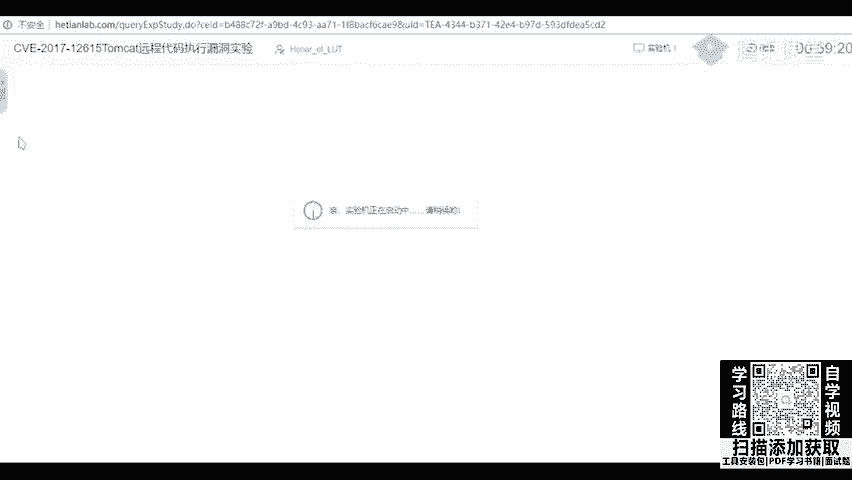

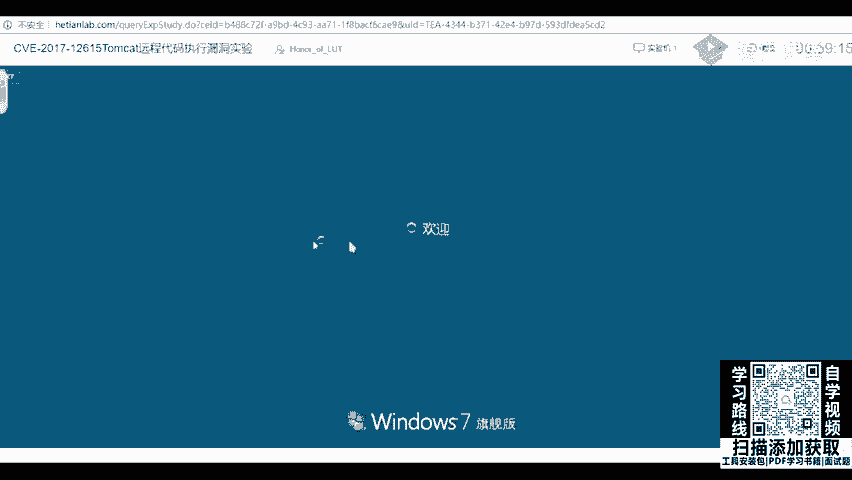

然后的话。启动启动完毕的话，就是进入到了这样子的一个呃windows的一个虚拟机器。

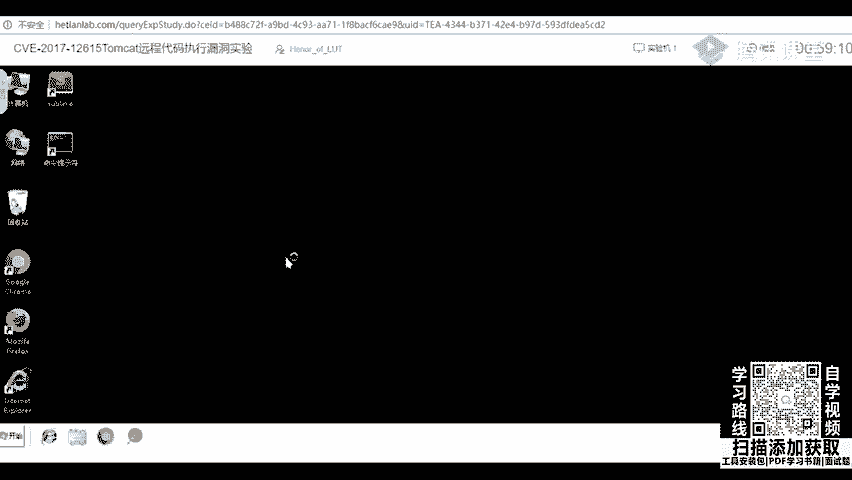

然后这里的话。可以从这里能够看到指导书以及我们的一个答题任务，还有可以做笔记等等这些。然后这里的话首先的话就是需要去下载我们的这一个。

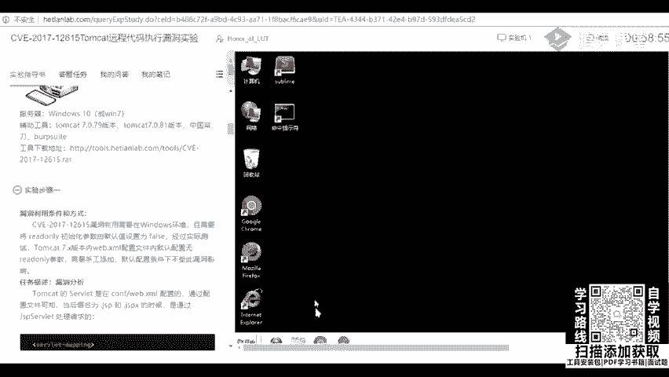

工具嘛。下载工具的话呃。大家可能会就是呃之前也有同学就是跟我反映说就是实验机不能够去复制粘贴。因为它是一个虚拟机，你这里只是呃它是呃没有不能够去复制粘贴的直接。然后的话需要大家去手打。

而且就这些的话打一个网址什么的，也不是说很很很复杂吧。嗯，如果说有一些代码什么的话呃。如果说很长的话，一般石验机器里面都会给出来的。嗯，然后直接输呃直接输入一个完整的一个D啊。

他的一个地址的话就能直接会下载完毕。下载完毕之后话，就是这样的1个IR的1个压缩包，我们把它解压。解压之后话就是这样的一个文件。然后其实可以看到大家看一下，就这里的话有几个test文件嘛。

就这这里的话就是需要。去更改代码的一些地方。然后这里的话他其实是已经给了一个text文件，就是避免就是呃。把时间花在敲这样的一些代码上面去了。嗯。对。就给的很详细了。然后这里的话这里的话就是呃。

你们就是我们想要呃我们要去。呃，搭环境的这样的两个压缩包。我们首先的话就是。啊，这一个钱钱子的话就是一个tom cat的。一个文件，这里的话我们想要去启动的话，就在这一个并目录下面。

这里的话有一个启动脚本，就是这一个start up。这个BAT的一个批处理的一个文脚本。他电话已经写好了，直接双击运行就O了。然后这里实验的话。大家就是。跟着他一步一步做就行了嘛。

那它的一个漏洞原理的话就是呃。就是这个tom kit它的这一个savate。就是。嗯。在这个配置文件的时候。呃。就这个s，它在处理我们的这个后缀名为这种顶GSP，还有顶GSPX的时候，它是通过这个。

进行一个处理的。然后的话其他的这种静态文件的话，它是通过这一个defaultt server来去进行一个处理的。然后这里的话就会有一个问题，就是。我们只需要就是啊。把我们的一个。

后缀名就是不满足这样子的一个条件，就不是丙GSP，还有。点击SPX结尾的话，它就会以一个defa这个。你这个default server来去进行一个处理。啊，你这个区进一个处理的话。

后面的话它就有分析嘛。就是他你这个去处理的时候，当去进行一个put请求的时候，它是怎样子的，它会调用子调用这样子的一个呃。这样子的一个函数去进行一个处理。然后它的一个呃问题的话就是。

他在处理这样子的一个，比如说这里1点GSP，然后的话一个空格结尾的这种文件它。他是会给这一个default去去进行一个处理的。然后的话我们可以使用利用它的这一个put。

请求来把我们的这样的一个呃这样的一个后缀的一个文件名，把它上传到我们的一个服务器上面。然后上传上去之后的话，因为是在windows上windows上面。windows机器的话，它有一些特性。

就它是不允许以空格，还有呃像斜杠啊呃一些特殊字符。呃，作为一个文件名的，我们可以在这里新建个文本文档，对吧？然后我这里的话，比如说123，然后我们这里敲一个。敲一个其他的一个字符，把鞋干。啊。

然后他这里的话有提示是吧，不能使用这种这样的一些字符。当然的话也包括空格，就空格的话，我这里输入一个在它的一个后缀名后面输了一输入了一个空格，对吧？看到。然后我回车保存之后的话。

它会自动把后面的一个空格给去除掉。就嗯啊这里的话就是利用了这样的一个特性。它我们可以通过用它包含漏洞这样的一个铺的请求，把我们的这样子的一个构造的后构精心构造的一个后缀。🤧嗯。😊。

把它上传到我们那个服务器上面，然后的话。windows环境下面的话，它又会把我们的上这种构造的这个，比如说空格这种多余的一个后缀字符把它给去除掉。然后的话它就会在服务器上面建立这样子一个以顶GSP为呃。

为后缀的一个文件。然后这个顶GSB文件里面的话，就是写的我们的一个呃不满，也就是说可以去执行命令的一个文件。然后我们可以通过呃我们的一个菜刀。

还有其他的一些web shell的一个管理管理工具来进行一个连接，得到它的一个呃web share。那下面的话就是他的一个呃。具体的一些步骤吧，就是呃针对了这两个版本。

79版本还有81版本的一一个呃利用。就呃这里的话需要我们去搭建一个环搭建环境呃。首先的话就需要去更改它的一个配置文件。这个配置文件的话，这里就是需要。在这一个con，然后这里有一个web。你猜谋？

我们需要更改这里。嗯。😊，这样的话需要加一个呃，加的一个内容的话就是。就是这一个一点text里面的文件文件的内容。这里的话就是呃设置它的一个s。啊，不是啊，不是就设置它的这里的。

这个severt在处理的时候，就呃它的一个只读属性是为forse，也就是它。把它设置为不是只读，而是可以去进行一个读写的一个呃。一个。样子。那的话直接粘贴一下。就可以就把它设置为能够去允许补写文件。啊。

进行一个保存。保存之后的话嗯，我们启动这一个tom catt。Startt up。直接双击之后的话，它会它是有这样子的一些启动的一些信息。这里的话我们啊把它就挂在这里，不要把它擦掉了。

擦掉的话就是把它给关闭了。我们这里的话直接缩小。缩小这后的话，我们就可以通过web。浏览器去进行一个访问。他这的话呃要提要提的一点的话，就是tomca它默认的一个端口的话就是8080端口。啊。

默认哪一个端口是8080。然后呃比如说之前说到的1个HTPD啊，还有eng的话，它默认的一个端口是80。那我们这里的话就是呃一个tomca的一个页面，它的一个初始页面。哦后我下面的话就是对他的一个利用。

就通过呃BP去进行一个抓包。然后的话改他的一个请求头嘛。就是其实跟我们跟我之前讲到的，用一个put方法来去进行一个上传我呃上传我们的一个web share是一样的。然后这里的话要注意的话。

就是要更改我们的一个抓包这里的呃。BP的一个选项要更改为1个8090。因为BP的话。Okay以。我先BP的话是在这里。我们直接打开。因为BP的话，我们可以看到在这里这一个pros。

这里有一个options选项，它默认的一个呃就是今天的一个端口。是8080，就他代理的一个端口是。呃，8080，然后。因为这里的一个阿帕奇，它默认的一个端口也是8080。

然后的话就说这一个端口已经被占用了。如果这里如果还是80的80，8080的话，它是无法去抓取这里的一个呃app帕这里的一个top cat的一个请求包的。所以我们需要更改为一个其他的一个端口。80。

比如说8090或者说其他的都是可以的。哦哦，进行一个。阿春。保存之后的话呃。浏览器的一个代理设置也是需要做一个同样的一个更改，就是更改成这样子。🤧嗯。😊，然后的话进行一个抓包，然后就是通过put方法。

对吧？就传递，然后这里要注意的。呃，要说的一个点的话，就是这一个。这一个文件流就是在window windows上面的一个特性，一个文件流的一个特性。就这里有一个。后面加一个加两个冒号。

然后一个and date。f，然后的话我们直接put之后的话。put之后到我们的一个windows机器上面的话，它会把它。就是把这一个文件名，把它里面的一个内容。

它其实读取到的一个文件内容是这一个哎还ingGSP然后保存到一个windows服务器上面的话，它就是一个呃还ingJSP这样子的一个文件。它后面这一串的话是没有的。因为我们需要构造这样子的一个呃文件名。

就是呃不要让它呃。不要让他。经过这个GSP的一个s去进行一个处理，而是要使用它一个默认的一个。default server去进行一个处理。🤧嗯。然后呃发送完之后的话，就是这样的一个空白页面。

就说明啊就是请求是已经成功了的。然后又能够呃可以看到在这里的话就写入了1个GSP的一个文件。然后我们直接访问就能够得到内容。然后的话当然我们也可以就是。嗯。在我们的一个请求体当中。

就我们写入的一个内容可以是1个GSP的一个木马，就这个嘛。啊不是。是这个三点text，就是把你们把这里的这个请求题的这一个内容把它给复制到我们的一个。把它复制到我们的BP。的那个请求包里面。

然后的话进行一个上传，就能够得到这样子的一个白天点JSP的一个一句话木马文件，就是一个web share。然后的话我们可以通过菜刀去进行一个连接。

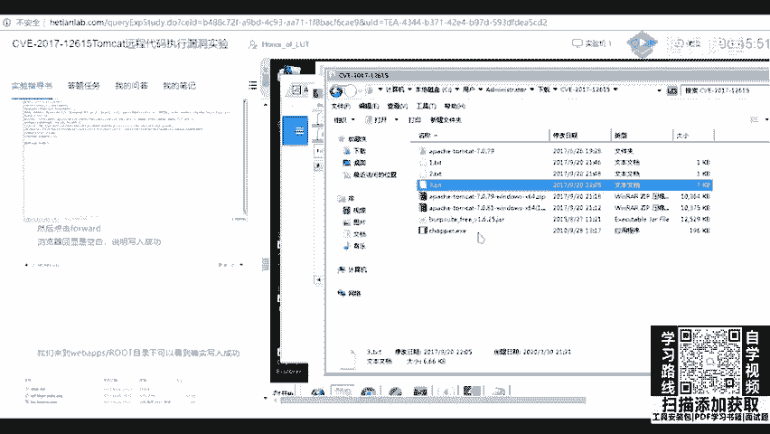

这里的话就是有一个菜刀。去进行一个连接。

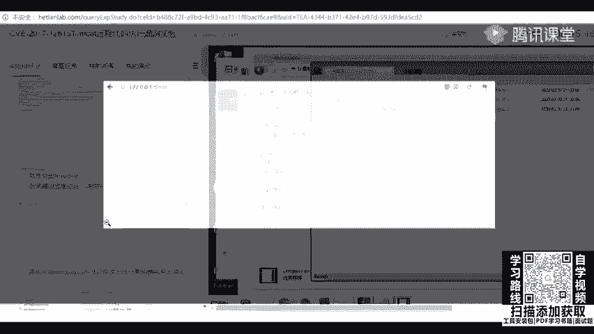

呃，这里的话因为呃我就不去一一的去进行一个操作了吧。因为时间关系啊。我，今天的话讲的讲的比较讲的有点多了。对，嗯看大家的话还是。就对这对那几个题目还有这个实验有一些问题吧。然，具体的一些操作的话。

我这里就不给大家操作了吧。大家如果在操作的时候有什么问题的话，呃，私聊我吧。好吧。然后大家有没有什么应该没有什么问题吧。实验操作是。哦，对，就是你的这一个。有一个像播放按钮的话。

这个的话就是呃就是一个实验视频嘛。在在你们自己的这里。一个实验。就这一个嘛就是有有实验视频的，大家可以呃跟着实验视频去进行一个操作。然后这里有一个教学资源，也也是有相应的一个实验的一个视频的。好。呃。

才发现这个吗？那可能大家是不太呃还是不太熟悉这一个呃我们的这一个实验室的一些操作吧。就如果。呃，我今天的话应该也也算是给大家就是大概讲解了一下怎么去进行呃这些实验的一些操作吧，就是方便大家的一个。啊。

时时时践嘛。然后大家有就是在做实验的时候，有什么问题的话，也可以在群里说。就是比如说。

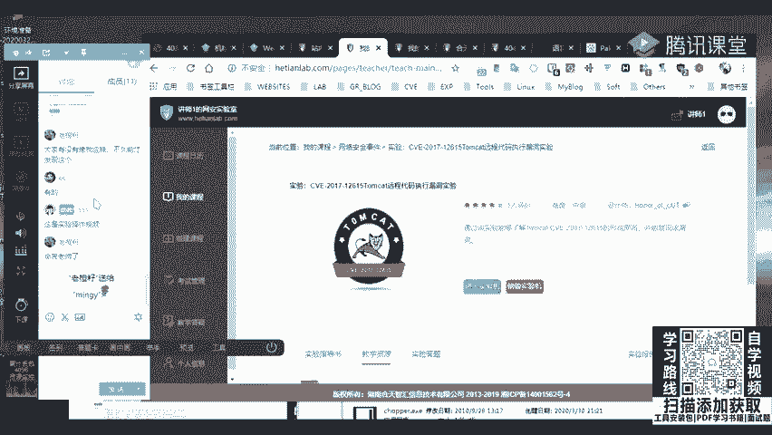

比如说这内容哪里有错，对吧？然后或者是说你实用机器有什么问题都是可以提的。

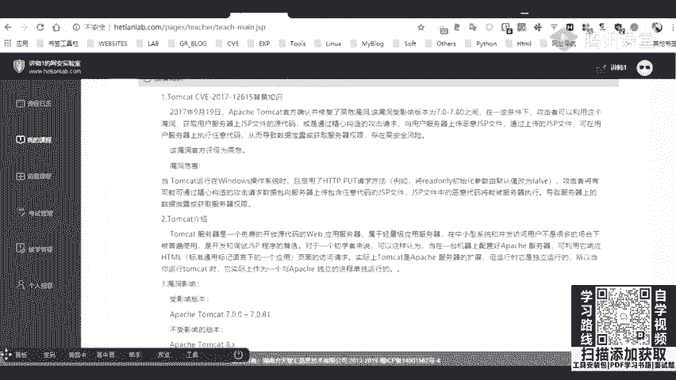

就欢迎大家来去找茬吧。🤧嗯。呃，呃，没有什么问题的话，我们本节课本节课的一个内容的话就是这样了。然后今天话讲的比较多。🤧嗯。😊，然后呃下节课的话是由另外有另呃下面的后面有一两周的课画。

是由另外的老师去给大家进去进行一个讲课。🤧嗯。😊，好，我们今天的一个课程的话就到这里结束了。呃，感谢大家的一个观看。大家早点休息，我们呃。

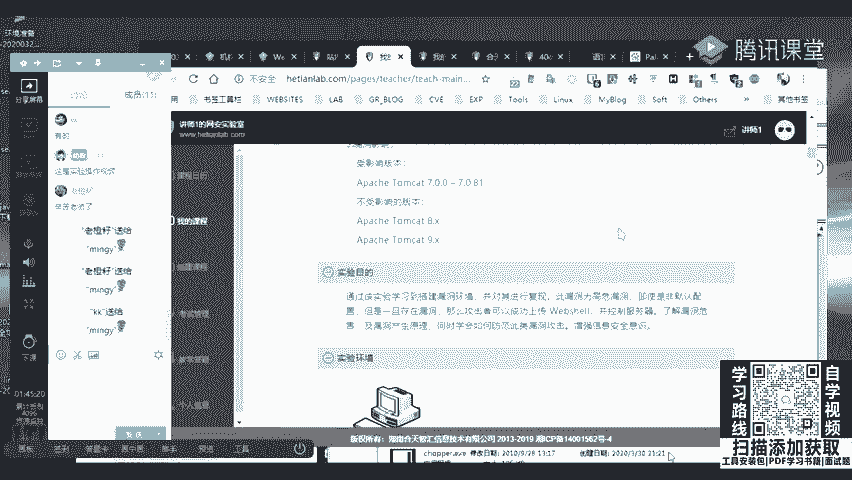

对。嗯，从今天开始的话，我们就正式的进入了一个漏洞片的讲解。前期的话大家可能嗯会学习安装环境啊等等。然后从今天开始的话，可能就会对over o top ten的一些漏洞进行一些讲解。

那首先我们这节课的话讲的是跨战脚本攻击漏洞的前端基础片。那为什么首先要讲一个前端基础呢？其实是因为我们这个跨站。脚本攻击漏洞，它主要发生的地方就是在我们前端。然后可以给。😔，嗯。大家画一个图。

我们知道我们一次请求就是从我们浏览器发送到我们的服务端。的话。我们平时日常去访问请求一个网址什么的，都是通过浏览器在它的那个地址栏输入1个UL，然后发送请求到我们的服务服务端嘛。那在浏览器这段的话。

我们可以看到我们首先来打开一个网页看一下。比如说就打开我们的和天。这是我们的一个主页面那我们这边右键查看源代码，就是查看这一个。网页它的一个前端的代码就是在这边，这个就是它的前端一个代码。

可以看到它最开始的这个标签是HTML。那在这的话，它前就是我们浏览器前端这一边的话，它涉及到的语言就可能会有HTML，然后一些java screamed。那这个d cream的话。

其实在刚才这个网页这儿也有，我们拉到最下面。在这儿它是以这个script标签，然后包裹起来的一个一段。这这两个我们今天会来介绍。那我们。这个是我们前端的一些语言，然后给我们呈现一个界面给我们。

就是前端的我们我们自己用户看得到的一个界面。内在我们服务端的话，就可能会有其他的一些语言进行它的一个逻辑处理。因为他要处理我们用户的请求嘛，所以他可能就会有其他的一些语言。

就比如说PHP或者是SP或者是java。还有等等一些语言，dnet等等那些语言。那在这的话，可能它还会与数据库进行一些交互。数据存储啊，数据持久化的时候。

就是我们要把呃数据持久的存储在我们这个应用中不随它的关闭而关闭嘛。所以我们就这时候就就可能会需要用到我们的这个数据库。那在这数据库的话，可能。如果大家之前有一点基础的话。

就可能会知道这个的话可能就有可能牵扯到我们的那个srcle注入。的那个漏洞。那我们服务端。就有时候就可能会。把数据存储到我们的数据库，与它进行一个交互。然后我们前浏览器发送一个请求，然后就到服务器。

然后服务器响应回来就是这样的一个过程。那我们今天要讲的。这个的话它主要就是发生在我们这个快站脚本攻击漏洞，它主要就是发生在前端的一个漏洞。所以说我们一开始的这一节课的话，就需要给大家介绍一个前端的基础。

那到这儿的话，大家能听得懂吗？听得懂的话就打一，听不懂的话就打2。行。😔，那接下来我们就进入今天的一个正片，就是讲我们的一个前端基础片。嗯，这个的话就是我们今天要讲的一个内容。

第一块大的内容的话就是HTML的一个概述。第二个部分的话就是javascript的概述。大家刚才看我打开的。我们的和天这个这些里面不是有很多的这种这种东西嘛，大家可能暂时还看不懂。

所以说我们接下来就要去进行一个学习。那首先的话先来看一下我们的HTML的一个概述。嗯，可能大家会问一个问题，就是什么是HTML。嗯，右边的话给了一个解释，这是百度百科里面的一个解释。Well。

大家可能看不懂啊。就是。😔，HTML是一种超文本标记语言，英文名字是这个。然后超文本标记语言是一种规范，也是一种标准。它通过标记符号标记符号来标记要显示的网页中的各个部分。简单来说，它就是一种语言。

然后。来它是通过标记符号来显示网页中的各个部分的，大家暂时看不懂没关系，接下来我们会具体的介绍。那HTML的它的一个特点就是嗯它的文件是一个文本文件，但是它的后缀是点HTML或者是点XTHTML。

我们平常在我们的电脑中看到的后缀就是可能是点TXT等等。那在这的话，我们HTML文件，它的一个后缀名就是点HTML或者是这个后面。他这个文本文件是可以由浏览器来直接执行的。我们接着往下走。

我们具体来看一下这个HT猫文本文件，它里面到底是什么东西。那首先来看一下它的一个基础股价。首先在。第二行到第十行，这儿就是用HTML以及这个反斜杠HTML。然后它是限定了文档的开始和结束。

在最开始这一个的话，它是一个文档的声明，声明我们的外b浏览器页面，就是我们这一个。这一个文件它是使用HML的。然后再我们接下来往下的话，就是这个HTML这个标签里面的话，它又分为两个部分。

第一个部分就是文档的头部，它用这个head标签来括起来。第二个部分的话就是body底的部分就是文档的一个主体。那在这儿的话，它在在这个head里面就是声明了本个这个网页，它的叉et就是编码。

编码使用UTF杠8的一个字符编码。然后它的title是这个title。我们接下来来看一下具体的每一个部分。第一个部分的话就是头部分就是ha部分。我们刚才不是说HTL分为文档分为两个部分嘛。

一个就是头部分，一个是body璃的部分。我们首先来看一下这个头的一个部分。那在这的话，它里面主要是有这两个标签，一个是title。比如说我在这里的话写的是title和天网实验室，关联大型这个在线实验室。

它就会在网页的标题栏显示，可以看到就是在这个地方显示的一个内容。第二个的话就是这个标签，这个标签是HTMR的原信息标签，它是搜索引擎，抓取网页时可能会进行分析的一个。嗯。标签。可以在这的话，他是有。

这一个属性这个content这个属性，还有这个HTTP杠这个属性以及lammb这个属性的。其中这个content它是定义了这两个属性的相关的语信息。我们看可以看一下下面这些例子。比如说这个这一行的话。

就是表示它会这个HTP杠这个会将我们这一个字段附加到我们的HP头部里面。我们HP头部的话，它就会加上这个content language就等于ZNC杠CN。大家对HTV头部有什么？嗯。

这个大家其实可以先不用看，因为这个其实不常用的。这个的话大家。我们一笔代过就行。嗯。😊，接下来的话到我到重点介绍的地方的话，我会给大家进行一个。讲解。那第二个的话。

刚才这一个标签主要其实我们经常会用来干什么呢？经常用来就是在我们。这个基础股架这去设置我们的一个字符编码，使我们的文档，我们文档中可能会出现一些中文。这样的话我们设置UTF杠58的话。

就不会造成一个乱码。这举的这些例子其实。不会怎么用到。我们接下来往下走吧，就是看body的部分。玻璃的部分的话，第一个就是一个。标签P它是一个表示一个段落的标签。中间可以加一些文本。

第二个的话就是一个超链接的标签。比如说我我们可能有一个百度一下，可能你会在一个网网页里面看到一个百度一下。然后它下面可能会有一个下划线等等那些东西。它其实是就是在HTML里面就是这样写的。

然后它的HREF属性的话就表示它要去访问的一个链接。这个他ge的话就是表明我在一个新的。新的标签页打开。第三个的话就是image图片标签，大家可能会觉得这些知识点有点碎，大家就是眼熟就好。给大家过一遍。

这个是一个image标签，就表示一个图片。图片的话，它的地址就是用这个SRC等于这个后面就是图片的地址。然后ALT的话就是。提示如果图片加的失败的话，它就会提示这个。然后有两个布局标签。

第一个的话就是DIV会计的标签，然后SPAAN就是一个行级的标签。这些大家了解一下就好。第五个的话就是三种列表的方式。第一种是无序，第二种是有序。第三种是自定义。首先我们看一下无序。

比如说我们有一个coffee或者和一个milk，它就是在网页中显示的话就是这样子的。它在代码中就是在我们的HTMO代码中波底部分，它就是这样写的。有序的话，这就有一个序号码。

12这个嗯它就是用OL把这个标签。包起来。自定义标签就是这个样子的DL。然后里面是DTDT下面有1个滴滴嗯。我们可以看到我们每一个标签都是要有这一个就是这个。斜杠DL把它包起来，把这一整个包起来。

每一个都是你看这个DT。基本上大部分的标签都是需要这种闭合。只有少部分不需要。第六个的话就给大家看一下，就是这个表格表格的话，它在这儿它的一个标现就是这个table。然后里面有。一行的话。

TRTR标签就表示一行。然后TD的话就表示有一个单元格。你可以看下面这个代码，这就是table，然后bo的话就是表示它的单边框为一，所以它这就是有一个边框。TR然后就是表示一行嘛，一行里面有两个单元格。

TD表示两个单元。这有2个TT表示有两个单元格。第一个单元格里面的内容是这样子的，第二个单元格里面的内容是这样子的。嗯。第七个的话就是form表单里面。和里面的一些小部件。这个我来给大家写一下。

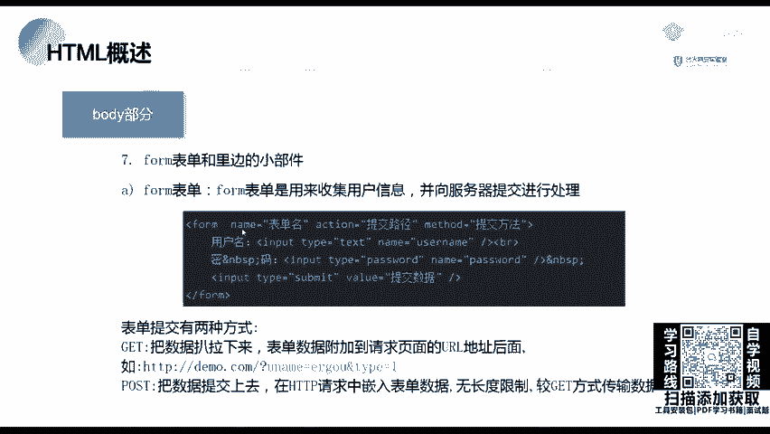

就是可能。我这么讲，大家也没有什么感觉，所以我我们一起。来写一下。😔，我这好像已经。😔，我们重新来写一下。😔，嗯，可以看到我命名的话就是点HTML。结尾的。然后我们来写一个。这title的话。

我们就直接一个demo。

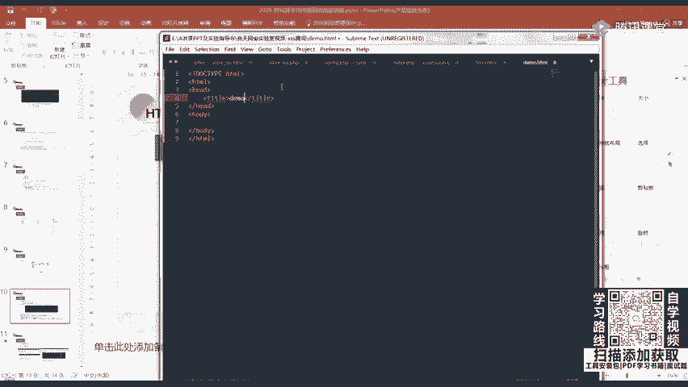

我们主要演示一下这一个标签，这个form。表单。No。嗯。😊，先不写吧，先还是跟大家讲一下。就是这个放表单它是用来干什么的。然后我们接着再来给大家讲，不然我一通写，可能大家并不知道我在干什么。

类phone表单的话，它是用来收集用户的信息，并向服务器提交进行处理。比如说我们。我们一个经典的就是一个登录，可能就是一个phone表单。那我们要我们就是有时候进器登录的时候，不是要输入我们的用户名。

然后输入我们的密码嘛。那它在前端的一个代码的话，就可能是这样子写的。我下面在这儿有说表单提交有两种方式，一种是get。提交的方法就是在这个metsal的这儿，就是这儿有一个提交的方法，一种是get。

一种是post。

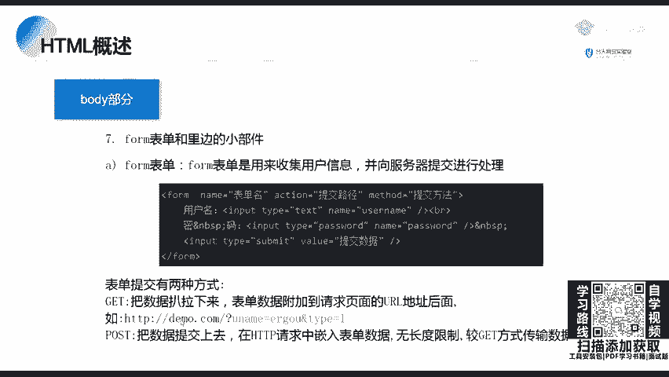

我们来看一下第一种get的话，它是把数据扒拉下来，然后表单数据会附加到请求页面的UIL地址后面。就比如说是这个样子的，这个前面是我们的一个请求的一个嗯网址。

然后后面加上我们的一个参数直接把我们这个呃表单里面的。这个lamb附加到这个后面，就是附加到UIL后面内在post里面的话，它是在HTB请求里面去嵌入我们的表带数据的。所以我们接下来来看一下。

那在这儿我们先用get。然后这个放表单里面的话就有两行，一个是我们要提交两个信息。一个是用户名。一个是。😔，B码。嗯，这些代码大家其实可以不用记啊，只要到时候看我演示就行。

然后知道它到底是个什么东西就行。

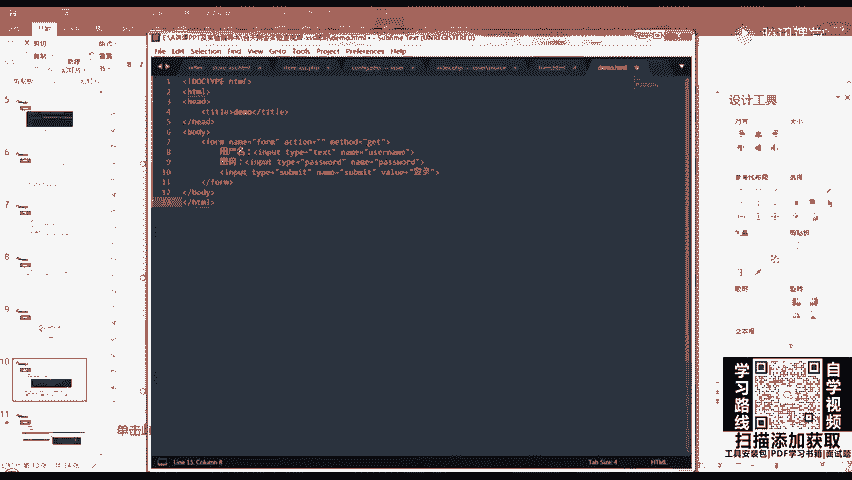

然后我们把它用。😔，浏览器进行打开。

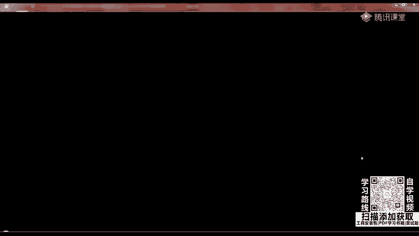

嗯，可以看到在这儿是不是就有了。两个，一个就是我们的用户名，一个是密码。我们可以输入看一下。然后点登录可以看到我们这是并没有写写它的这个action。这个action就是我们要进行一个怎么样的处理。

就是在这边填入。

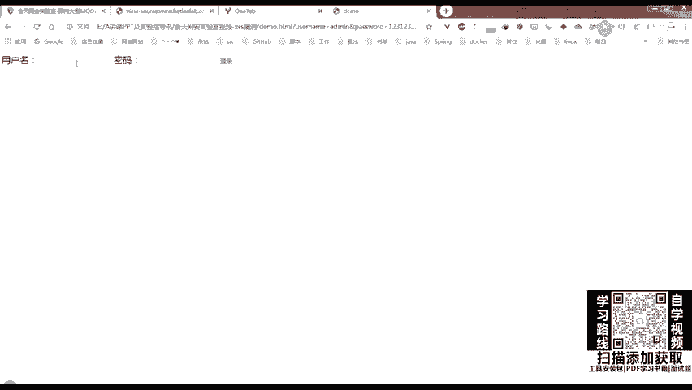

填入我们要去往的那个PHP文件，就是可能去往我们后台处理的1个PHP文件或者是怎么样的。因为我们这儿没有，就是这里写的是空，所以它就没有进行一个跳转。但是我们可以看一下，它在这儿的话就直接将我们的。

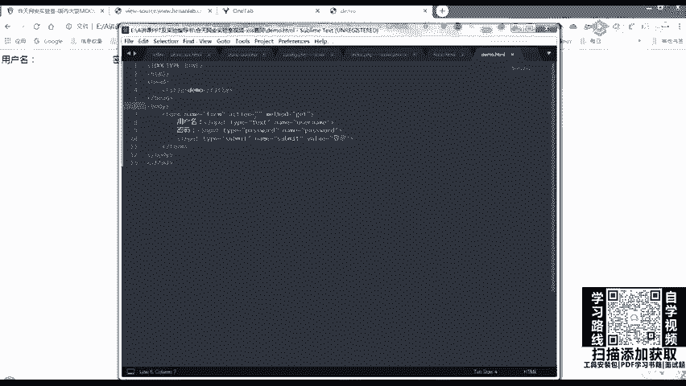

这个。用户名alminpasword等于123123就附加到了我们这个UIL这里。那如果这个就是一个表单。然后如果我们把它。

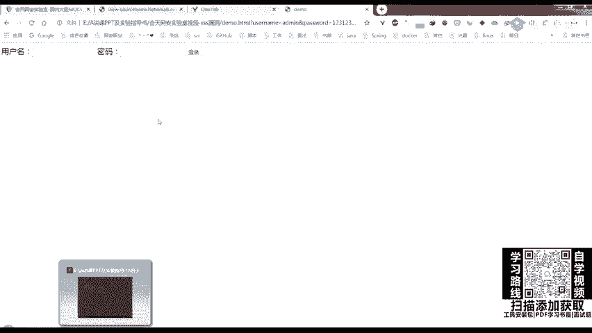

改为post。我们可以看一下。

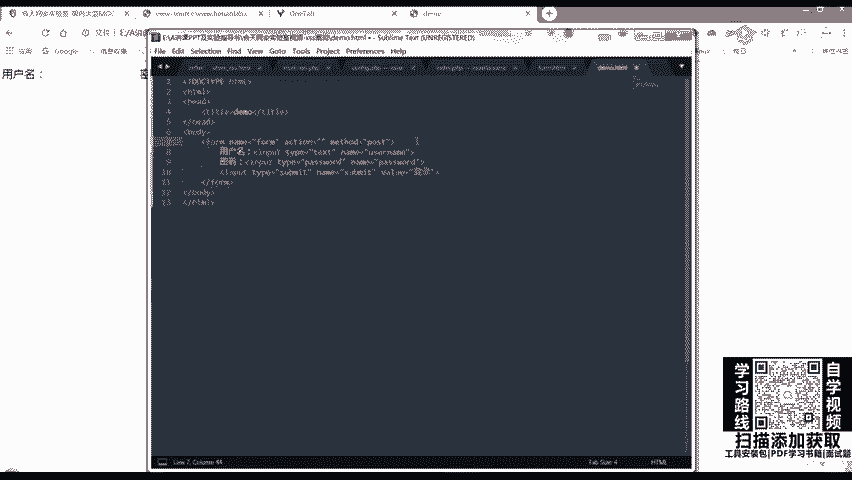

他的。😔，提交方式就是数据数据的提交方式有会有什么？不一样的地方，那为在这的话，我要开一个。代理。😔，哦，我要放到。😔，嗯，不用开代理。直接在。😔，我们直接用F12看一下就行。

我们摁就是在浏览器里面摁F12。然后。直些输入。😔，都。😔，可以看到在他的这个。黑的里面。😔，它在这儿的话，我们可以看到在它的URL数据，就是这个地址栏，这就没有了，而是在哪个地方呢？

而是在这个form date在这儿。这样可能看的不。😔，可能看的不详细。😔，就是看的不是那么。😔，明显。嗯，这个是我之前就是。😔，自己过一遍的时候写的一个代码，我们之间。

因为这个在我们的这个三W论目率下，大家之前有学PHP study嘛。然后如果我们是想要用这种网页的形式。去去进行一个访问，就是这种。嗯。能通过域名进行一个访问的话。

我们就需要把它放到我们这个3W目录下嘛，进行一个ipad等等的一些。嗯，处理那我们。😔，来看一下这个。form点HTM。😔，嗯，我把一些不相关的东西都注释掉。

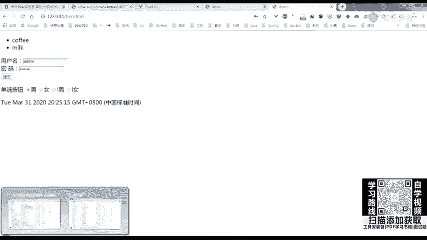

嗯，这个其实就是我们前面讲的那个。因为我自己。😔，在前面自己进行演示了一下，就是。嗯。先把这些东西都。😔，注视点啊。😔，这个就是我们的那个。这种它变成灰色的话，就是注视掉了，就是不起作用了。

然后这种有颜色，有高亮，就是这种有颜色的才是起作用的一些代码。

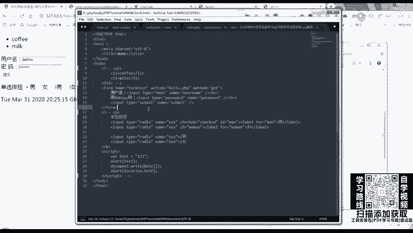

我们刷新一下。嗯，可以看到这儿的话就。因为我前面输入了，所以它有这个提示给我。就是这个了，对吧？Yeah。然后我们在这的话。😔，拦截一个数据报们。😔，就是用bBP你们之前也学了BP。

然后拦截一下这个数据包来看一下。Okay。嗯，这边的话就拦截到了这个。我们重新刷新一下。嗯。😊，在这的话就拦截到了这个数据包，对吧？它的hos是192。168。31。137。

这是我这台电脑的1个IP地址，然后它的呃那个。目录是这个form点HTML嗯先放心。其他的一些这种别的别的包我们就不拦截了。然后我在这儿输入，我看一下，我们看先看一下，在这的话，它的这个是这个get。

我们把它改成post。

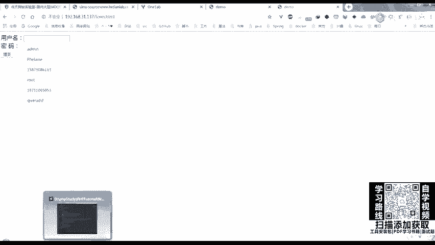

我们主要就是看一下这个post包它是怎么。

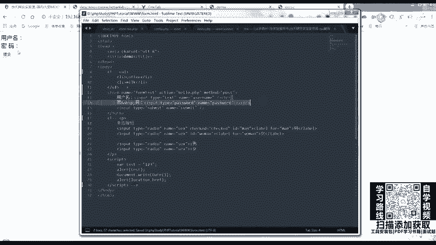

Yeah。嗯，我现在把一些。就是其他的一些包我就不拦截了。😔，嗯。我们这输入一个addmin，随便输，这输的密码是123123，然后点提交。在这的话，他并没有完成，这还没有这一直转嘛。嗯。

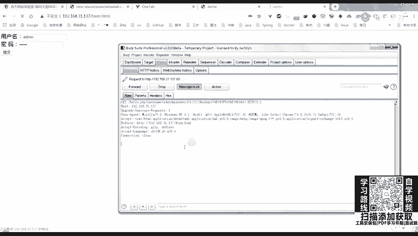

什么什么情况？😔。

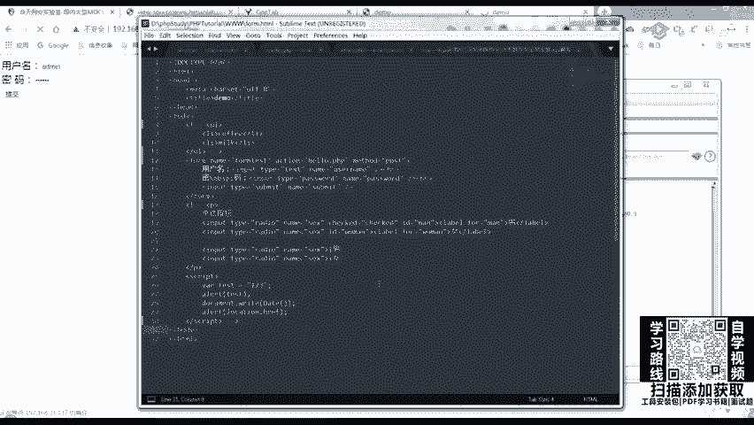

这是他出现在这个地方。

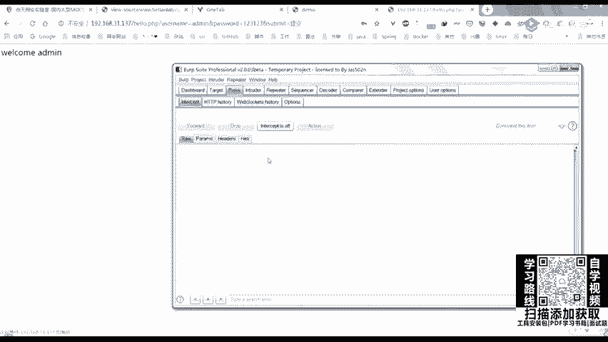

我把这个改一下。😔，他跳转到我还写了一个hello点PHP。

123123，然后。我这进行一个拦提交。😔，嗯，刚才可能是我没有刷新，直接回退的，就还是之前的那一个get方式。可以看到这个是一个post方式。然后。他的这个提交的数据就不在我们这个这个后面了。

这个form点HTML后面了，就是加一个问号usname等于什么什么pasword等于什么什么。就不是这样的一种形式，而是它是放在我们的这个。请求主体中这是请求头嘛，这个是请求头。

它是放在了我们这个请求主体中。这个就是一个1个HC请求请求的一个数据包。到这的话大家能听得懂吗？前面的一些。

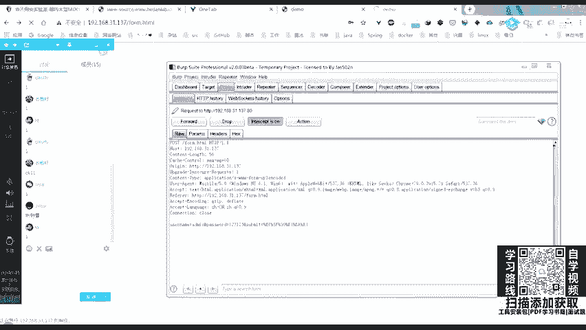

嗯，一些标签大家可以自己去尝试实践一下。嗯，这个放表单这大家有听懂吗？嗯。😊，基本上都能听懂。这这些这些标签我也可以给大家就是写一下。这的话就是刚才那个。就是无序的那种。

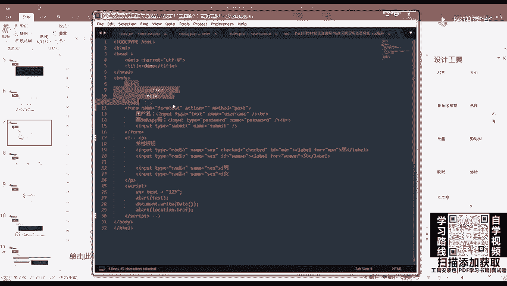

标签如果我们要有一个。链接的话就是一个A标签。我们回车之后，这儿有1个HREF就表示的是它的一个。我们点击的话，他要去访问的一个资源是哪里？比如说我们这就直接是百度点com。其他的一些就是image。

😔，嗯。图片的话就随便打1个11点JPG嘛，这个肯定是不存在这个路径的。嗯，就是。然后不存在的话题是一个。图片加载失败。😔，我们保存之后来到这边刷新一下哦，我先把这个代理给关掉。嗯。嗯。

这样的话就有因为我这个11点JPG这个路径，它无法访问到这个路径嘛，就是没有根本就没有这个11点JPG，所以它就会加载失败。这个百度的话，我们点一下就可以看到我们跳转到百度点com过来了。对吧。

其他的一些一些标签，比如说DIV这种PE标签，大家都可以自己去实实践一下。嗯，比如说一个表格。Yeah。我们刚才这个放表单。这不是很不急吗？就是用户名，然后它的这个框框就在这儿，密码。

它的框框就在这也没有对齐。这个时候我们可其实就可以在这个phone表单里面。把我们的用户名和密码。嵌入到我们这个table里面。大家可以去尝试一下，那样的话就可能会对齐。因为它每一个单元格的话。

会是就是一样的嘛，就是一样长的嘛。嗯，这个大家可以去尝试一下。那我们接着讲。😔，刚就是在。我们的form表单中，它的4种input标签。其实我刚才写的时候，不知道大家有没有注意，也有写到。

第一种就是这个根据这个type来的，就是这个text。它就是一个文本的一个文本的框。然后如果是一个密码框的话，这个tab这我们就把它设为password。你可以看到它在这里输入的话，它就变成这种点点了。

就不是我是一个密码框，把这个value的值显示出来。还有一个的话就是单选。单选按钮就是这个radio根据这个来的。嗯，这里写了两个，一个是男，一个是女的一个单选。有了单选就可能有复选。

那这个复选的话就是这个tack box。这个。😔，还可能是有一个下拉的列表，那下拉的列表的话，它就是使用这个select。然后这里面有一个option，就是选项可能是广州深圳佛山。然后在这的话。

它默认选择。这有一个默认的选择。这有一个selected等于selected的话，它在这个所在地址，它默认的就是这个深圳。然后下拉框里面有广州深圳、佛山。接下来啊这个的话可能就是一个提交表单，刚才也有。

就就是涉及到它的这个type的话，就是submit。就是提交。我们点这个提交之后，他就会根据我们那个表单里面那个action去响应到一个具体的。文件或者是当前这一个页面进行处理。

再一个的话就是一个重置按钮，它的type就是等于reset一个重置。然后是一个text error。它就是一个多行的一个文本框。因为我们刚才那种input或者是其他的一些都只有一行嘛。

这个text error的话就可能是一个比较大的一个文本文本框。这个label的话，它主要就是跟。input配合使用的，我们可以。这个label可以给大家演示一下。我其实在这儿之前也有写。😔。

把前面这些都注释掉吧。嗯，这个是我之前写的一个。😔，代码那我们保存一下。然后刷新来来看一下它的一个效果。这是有。4个。嗯，单选框。这是一个这是第二个。

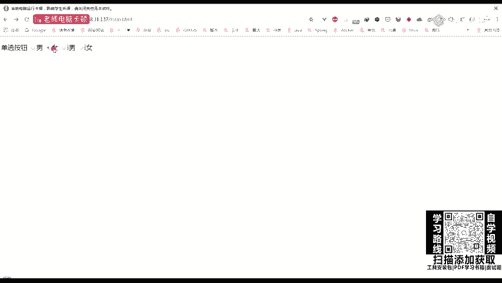

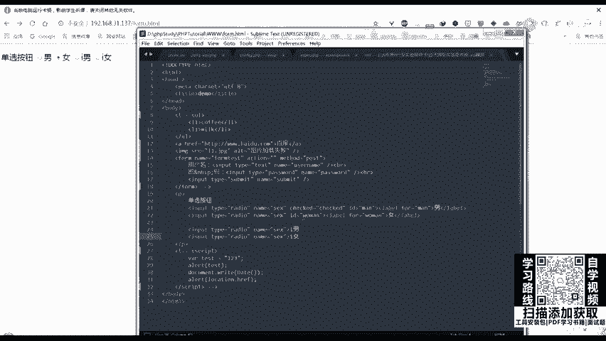

对吧。

然后这个后面也是。那在他的代码中的话。它主要这两个主要有什么不同？这一组主要是这一组和这一组有什么不同呢？它其实就是在这个后面加了这个label。这个是干什么用的呢？

主要就是我我们可以看到，如果我点这个。这个后面这个女的话。比如说我点这个后面这个I栏，这儿它是不能进行一个选择的。但是如果我在这儿点这个女的话，它就会把这个单选框给选中。

所以他其实就是为了和前面的这个。

绑定在一起，它出现是就是有一种用户友好吧。比如说我要选男，我不一定要点到这个格子里面，就是这个单选框框里面，我直接点男点女，他就可以选。但是你看这个它就不可以选。他只能点这个才能进行一个选择。嗯。嗯。

接下来的话我们会介绍一个HML的一个特殊符号。内在HTM中有些字符它是有特殊含义的，不能在浏览器中直接显示出来。比如说。这一个P标签就是一个文本标签嘛，我是。HE标签哦。我们可以来看一下。

我们其实主要是显示这一行嘛，这一串文本嘛。对吧。我们可以来。😔，把这些都注释掉。然后。我是。H一。😔，标签哦。😔，把号报存一下。我们想要它显示出来。嗯。😊，他怎么成这个样子了？我们查看一下他的。源代码。

嗯，这个朱视爷在这的话，它其实又是这样的呀。H1，而且这个标签哦比这个我视要大了好几号，对不对？那在这儿的话，其实是因为他把这个。左右兼过后HE解析为了我们HTML中的一个标签，一个这个是一个。

就是它是一级标题的一种标签，还有H2H3等等。它的字体就会变粗变大，就是一级标题、二级标题、三级标题。所以它就会解析为了这个HE这个标签。它就不能进行一个正常的显示。

那如果说我们现在就是要把这个左右间括号HE这个东西显示出来应该怎么办呢？其实就会用到我们这个实体字符。这一这个地方其实就跟我们后面这个叉SS防御的时候就会有一点关系。叉SS防御的时候。

我们就是把我们用户插入的这种标签，它的这种。特殊符号就是这种，比如说左右兼过号，把它编码为我们的实体字符。我们来试一下它还会不会就是使这个标签哦，这个字字体变大。它主要是使用这个实体字符那左肩括号。

它的实体字符就是。连接符号LT加上一个分号。然后右键括号，它的实体字符是连接符号。然后保存。嗯，可以看到这样的话，它就进行一个正常的显示了。源代码里面它也是这个样子的。这样的话就可以跟这个。

就可以安全的显示我们这个文本，而不是让我们的浏览器把它解析为1个HTML标签。嗯，我这么说，大家能听懂吗？其实我们现在已经8点44了，但是我还没有讲完一半。嗯，行。那关于这个实体字符的话。

它的表示方式就。有两种。第一种的话就是。这种符符号。嗯，连接符号加上这一串分号，还有一种是这种加我们的数字。前面还加了一个井号。嗯。😊，具体的一个特殊符号，它的实体表这列举出来一些比较常用的。

比如说我们刚才的左肩括号，右肩括号，它对应的实体名称。就是这个样子的那我们其实也可以用实体编号来进行一个代替。就是把我们刚才的那个连接符号LT分号改为这两个，其实也是可以的。然后还有其他的一些。

就是在这儿给大家展示。那其他的一些大家可以去这个网址上去看一下。我们接下来往下。往下走的话，就终于来到了我们的这个javaqui概述。dravaqui的话。😔，它是一种可以在浏览器中运行的脚本语言。

它主要用来实现在浏览器端的动作。比如说和我们的用户进行一个交互。之前我们的那个HTML文档的话，它它只只是我们写什么，写一个标签进去，它就写回显给我们什么。对吧就是比如说我们写一个文本框，写一个表单。

它就回写一个，就是在页面里面显示一个文本框显示一个表单给我们。但如果需要进行一个用户交互，或者是数据处理的话，应该怎么办呢？这个时候就可能会需要用到我们的这个javascript这个这个文本语言。

脚本语言。那它也叫javascript，它和java有什么关系嘛，其实并没有什么关系。那这简单提一下，就是java它需要编译。

它而且它运行是在我们的Java虚拟机中进行一个运行的那我们javascript的话，它是一种解释解释型的语言。源代码就在HTMLO中。而且它就是可以在浏览器中进行一个运行的脚本语言。

我们接下来来具体的看一下。在HTML中，dvascript的存在有几种方式。第一种就是在我们的cr标签里面。我们最开始给大家看那个何天打开右键，查看它的源代码的时候。

最底部是不是也是通过screencr标签插入了一1个JS代码，就是只不过它这。

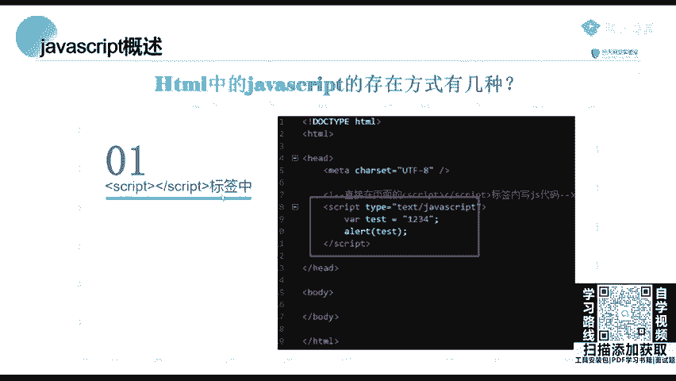

嗯，不知道。😔，就是这个。😔。

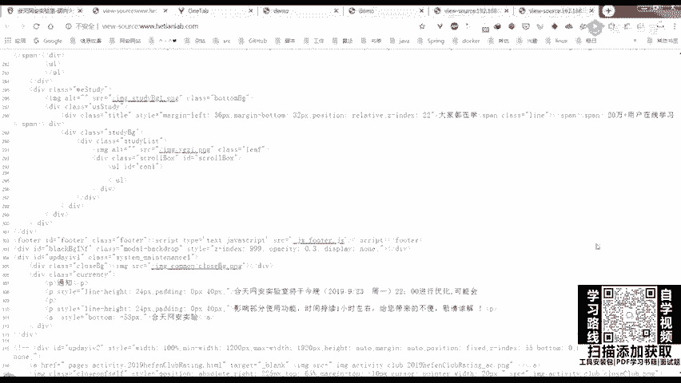

在最底下的时候，他是不是。对吧。只不过它是使用了1个SRC就表示它是引用的一个外部的1个JS代码，它就没有写在这个scriptquaprint标签里面。这个中间它是引用了外部的一个。JS代码。那我们。

😔，接下来还来看一下。第一种的话就是直接在我们的。HTM文档中加入screen标签，然后在s标签里面写上。我们的javascript的代码。

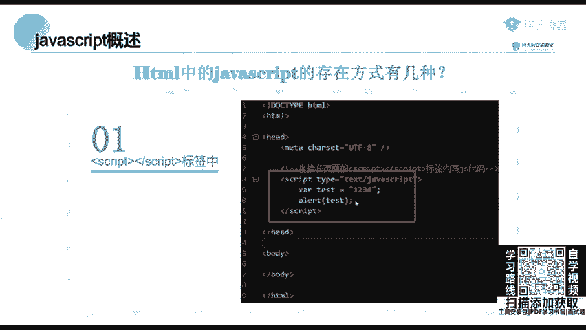

比如说在这儿我们也。来实践一下。😔，我这个好像。😔，嗯，还是不舒实吧。就直接。😔，写在这里面吧。😔，嗯。这个type也是可以不要用的。对泰不你可写可不写。😔，VR第一个变量，这个变量名是test。

然后它的值是1234。然后alent。alentt这是一个函数。把我们的tester传入进去。可以看到它会有一个怎样的一个效果呢？们刷新一下。可以看到在这的话，我们之前并没有这种弹框嘛。

它在这里的话就弹出了1个1234的一个警告框。对吧这个alentt就是英文。如果大家好一点的话，可能就会知道它就是弹出一个警告框，警告的意思嘛，alentt。然后把我们的这个test传入进来。

所以他在我们打开这个网址的话，它就有一个。就是警告框弹出给我们，就是alart警告嗯，1234，它的内容就是1234。因为我们这儿输入的是1234嘛。

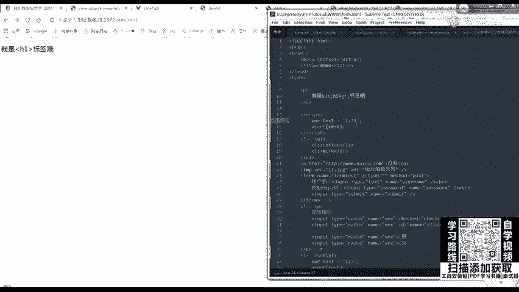

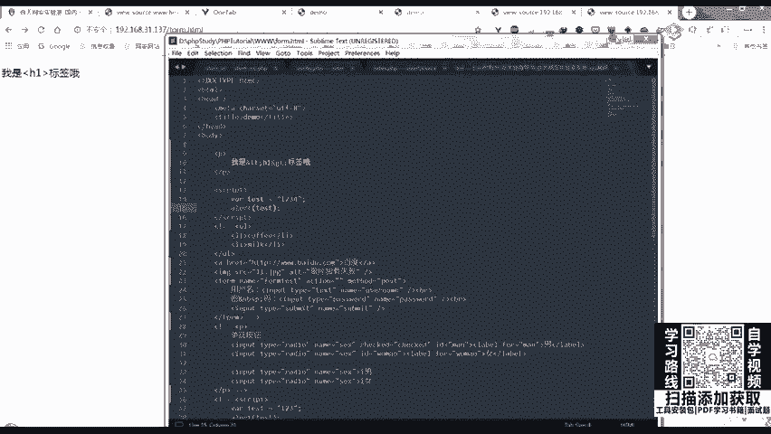

我们接下来往下，这是第一种方式，就是直接写把我们的javascript代码写在cr标签里面。第二种方式的话就是我们刚才的那个和田底部那个，它就是写在我们的这个SRC里面SRC属性。

然后指定的一个外部文件。这个是它的这个JS代码，它是一个dr代码的话，它后缀就是点JS。写入到这个是它的那个JS代码的一个地址。可以看到在右边的话，这有一个test点JS这里面写的就是我们刚才写的那个。

代码。然后我们去进行一个加载的话，它也是由一个警告框弹出给我们。只要你拽的路径是对的，就是它能够访问到这个test点JS就行。第三种方式就是在HTML的数事件处理器中。

比如说on click on mouse over。内在这的话，这有一个input标签，然后它的。呃，它不是一个button，就是一个按钮。它的value就是这个按按钮上显示的内容就是点击弹出对话框。

这个unclun clickcl就是点击嘛，onmost overmost over就是你鼠标放上去，它就会触发一个什么事件呢？这的话也是就是弹出一个这不应该是test，这应该是A呀。

alentt a嘛，那不能是test嘛，对吧？这应该写错了。嗯。就我们点击这个按钮的话，它就会弹出一个。嗯，如果这填的是A的话，就有一个test的警告框弹出给我们。这个是第三种。

就是添加到我们的事件处理器中。你一旦这个事件被触发，那在这儿的话，这里就是一个点击事件嘛。如果我点击了，它就会触发这一段。almost over这个的话。打个比方，就是把我的呃。😊，鼠标移到上面去。

它就会触发这个almost over里面定义的这个JS代码。

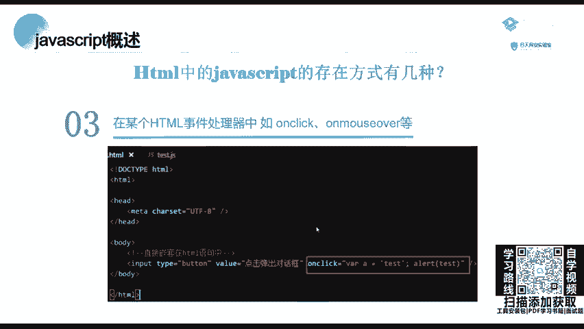

我们接下来来看，因为之前我们说他是可以和。嗯，用户进行交互，而且它是呃直接可以在我们浏览器中运行，直接嵌入到我们的HTML代码中嘛。那我们如何通过javascript去操作我们的HTML标签呢？

这个时候我们就可以通过这个doom。doom它是一个文档对象模型，它是访问和操作HtimeM文档的标准方法。我们可以通过利用javascript来访问操作HtimeM。这个是一个动数。那在这的话。

其实就是有一个嗯根元素根元素就是刚才我们写的那个最开始的那个HTML嘛。然后里面有head元素，然后有一个body。然后head里面它有一个titletitle它的文本就是文档标题。

然后在这边这个body底的话，它里面有两个元素。第一个的话就是这个A标签。就是这个链接嘛，我它的文本就是我的链接，然后有一个属性，就是我要啊点击我的链接跳转到哪一个网页上面去。然后还有1个H1。

这个元素这个这个就是一个简单的一个doom数。我们可以通过这个动数来访问。比如说我们要获取到这个title的话，我们就可以。通过这个动数来进行一个获取，具体是怎么来进行一个获取的呢？

就是我们dvascript如何去操作呢？这的话。首先第一步我们。有一个问题，就是我们如何获取到它的1个HTML元素的内容。比如说我们要在这边的话有一个。有1个HMO代码。

在HTML代码里面有一这个body里面有一个。嗯。有一个screen标签，然后它的就是使用一个document document，就是表示的那个整个文档。刚才我们那个动数。它最开始的根不就是这个文档吗。

然后再是。根元素对吧？所以在这的话，我们去访问的时候，就是X等于document点，通过get element byID就是通过获取元素的ID这个ID值到底是多少呢？就要看你。

比如说我这儿要获取这个P标签。这个元素，然后它的ID等于lamb，我们就可以通过。get element by IDD然后传入它的ID这个。这个值这这个P标签对应的ID值。

然后传入进来这个X的话就会获取到这个P标签。这样的话就能获取一个标签。那如果我们想获取这个标签的一个内容的话，是不是这样还不够？因为这样的话，我们只是还只是暂时获取到了这个PP标签。

那接下来我们获取到它的内容应该怎么做呢？就可以通过一个innerHTML来获取到对应的一个内容。这的话我直接弹出了一个警告框，ID为Lmb的内容是。

加上这个加就是字符串拼接X点innerHTML这个X已经是这个P标签了嘛，然后点innerHTM就是获取到这个标签里面对应的一个内容。然后我们去运行的话，就会有这样的一个弹窗显示给我们。

就是ID为Lmb的内容是java script的基础。嗯。这个是一个第一个简单的一个通过javascript来操作我们嗯doom数操操作我们HTM标签里面的标签的一个简单例子。我们接下来看第二个。

比如说假如我们想要修改我们的HTM元素的内容，应该怎么做呢？首先是不是也要先获取到这个标签，也要获取到那个标，我需要修改的那个标签先对吧？

那第一步同样也是document点get element by IDD。第二步的话。它同它同样是使用这个inerHTML直接赋值。Javascript得真好玩。就会你就会有一个。加载之后。

我们页面加载之后，你就不会有这个javacr的基础了。等到这个脚本执行的时候，它就。把它的内容变成了dvascript真好玩。我们最开始是一个dvacr的基础嘛。

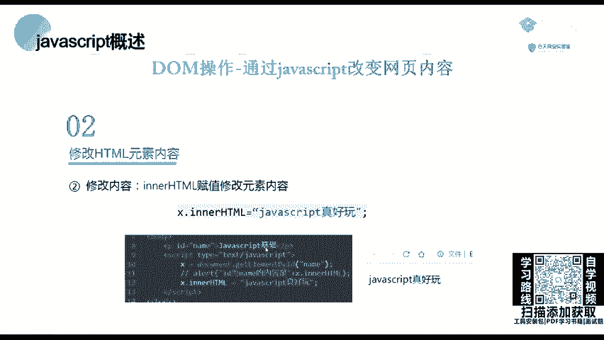

这个大家需要演示一下吗？嗯，我给大家演示一下吧。这个P标签这儿的话我们就要设1个ID了。因为我们需要通过这个ID来获取到这个元素。这个是P，我们就直接写写PID吧。然后在这的话。

我们在这个script里面。写写上我们那个操作的一个代码。那我们是不是首先是通过document。点。Get。Element。Bye。Id。然后写入这个，如果我们要获取这个P标签的话，我们就填入一个。

PID。😔，然后把这一个标签复制给我们的X。这时候这个X就获取到这个P标签了。那接下来我们让P点in那。H。tm。

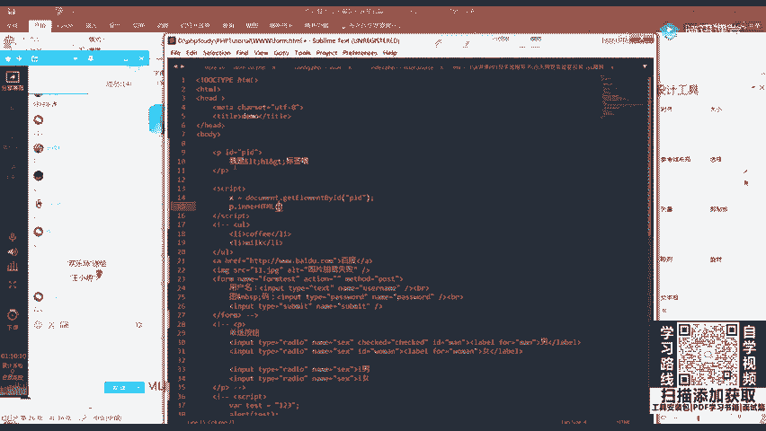

是场。直接把它修改为。我们刚才这个样子的话，直接用。这样是不是获取到它的值？我们先这样来试一下。😔，这是我们的HE标签。😔，嗯。😊。

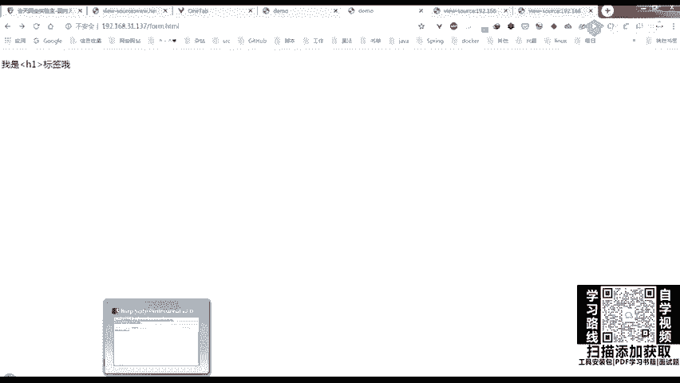

我改的是。😔，我看一下嗯。嗯，他这不用。他这不用加这个括号，直接是这样。好吧。嗯，还是没有。😔，没毛病啊。😔，好。Yeah。

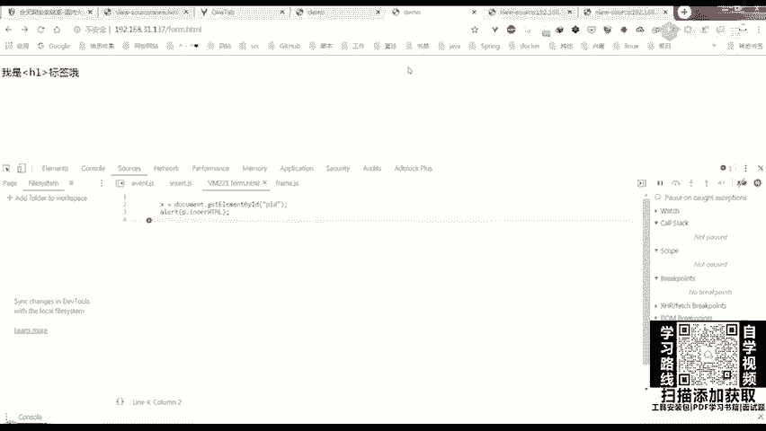

哦哦，我这写错了。😔，就写成P了，这是X。

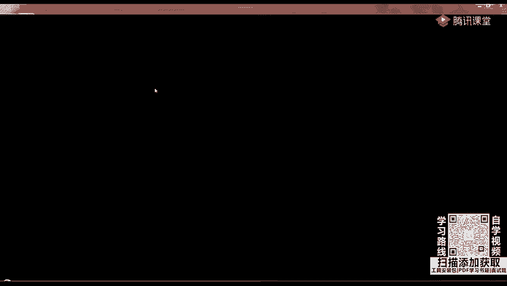

嗯，这样就有一个就是他的内容显示给我们。嗯，不好意思，刚才。写写错了，这写成了P，这是X，我们会学到的是这个X吗？Oh。对对对，不好意思不好意思。😔，嗯，接接下来如果要把它的值修改的话。

我们直接使用这个X点in了HTML。然后这的话我直接写写一个这个吧。这样的话我们再去进行一个刷新的话，他就会。在这边更改为javascript，对吧？这样就是两个例子。

就是通过javascript来操作我们的doom。文档来改变我们的网页内容。接下来还有一个就是创建一个动态的效果，是通过我们的document点right写入到我们这个HTML。页面中在这儿的话。

我是写入了一个date对象。可以看到就是这个控制台这直接有一个document点rightite，就是写入写入的东西是什么呢？这就是一个date对象，就是写入的是当前时间。第二个的话。

我这写入了一个iframe，就是一个。嗯，iframe框架。它的SIRC它里面的一个内容就是我们和田lab的一个。内容。我们也可以进行一个。操作看一下。这个就先注释掉吧。嗯，直接使用document点。

Right。我们的。😔，Dead。嗯，回去看一下。嗯，在这个后面的话就会显示我们的一个当前的时间。下面这个也是一样的，大家自己去尝试。第四个的话是添加一个页面的交互效果，利用事件的属性。

比如说un click。我们可以看先看到右边这个代码。Yes。那在这的话有一个click here的1个HR标签。然后如果我们点击这个就会触发这个un click事件嘛，它就会去调用。

这个change text这个函数，那这个函数在哪儿定义呢啊？在我们的这个scriptcr标签里面定义了，这有个函数，函数名称是这个change text，然后传入的是这个this，就是当前这个对象。

那在这的话传入的就是这个H2。然后这就是将我们传入这个值，就复制为这个ID，然后将我们ID点的它的文本就变为了欢迎参加外部安全工程师的学习。在这边这是它的一个效果，就是我们点击这个之后。

它就会把这这个HR标签里面的内容改为欢迎参加外部安全工程师的学习。这个大家需要演示吗？嗯，需要的话就打一，不需要的话就打2。嗯，没人没人听讲吗？哦哦2。行。😔，嗯，这是一个常用事件的列表。

就不只是uncl onmore over呀，还有其他的一些，比如说on focus啊， on blur on change on key down on key price on key up onload等等这一些事件。

这个是。右边是这个事件，就是他是什么时候被触发？它是比如说这个on focus的话，就是元素获取到焦点的时候。它就会触发。然后on blow的话就是元素失去焦点。

元素这元素的话就是标签那个标签绘取到焦点，标签绘取到失去焦点。等等。它的内容被改变的时候，它就会触发这个unchange。这些事件大家也可以去就是自己写1个HTM文档。

然后进行就是用那些事件来写一个H and javascript代码来进行实操一下。😊，那第二个的话就上上面讲的是一个doom嘛，下面这个话是一个boom。boom的话它是一个浏览器对象模型。

它是使javascript有能力与浏览器进行对话。一是让浏览器弹出警告。那在这的话，可能有我们前面已经用到了这个警告的一个弹框，就是这个alent。这边就是他的一个。我在底底部这个consor。

就是这个控制台这儿写了一个alent一，这就弹出了一个一的一个警告。然后是一个conform， confirmform的话就是一个确认的弹框。啊。

这个conform confirmform里面的一个内容就会显示到一个这个里面，这有一个确认和取消。我们前面这个这就没有一个什么，就只有一个确认嘛，就是嗯我警告你什么什么，你点一下确认嗯。

第二个是一个conform。第三个的话就是prot，就是一个提示。嗯，这三种的话都是可以来进行使我们的浏览器弹出一个对话框。这种的话通常是用来证明我们叉SS漏洞的存在。因为你可以弹出一个警告框的话。

我就可以做别的一些事情了，对吧？因为我们这个alent confirm prompt都是属于我们这个dvascript的代码，而不是属于HTML里面的代码，不是属于你原本那个网页里面的一个代码。

所以说如果我能让这个网页弹出一个警告框或者是一个其他的一个弹窗的话，说明我能在你这个网页里面执行我自己的1个GS代码。这样的话就可能用来证明这个漏洞的一个存在。第二个的话，获取一个cookie信息。

我们可以使用document。点cookie就可以获取到我们的这个cookie值。可以看到在这个下面就是document点cookie，它们回显给我们这个就是当前页面的一个cookie值。

然后alent document点cookie的话，它就会显示一个信号框，把我们这个当前页面的一个cookie值。弹出来就是。显示给我们。这个cookie信息之前老师有给大家说过吗？如果说过的话。

大家打个一。如果没有说过的话，打个2。嗯。说过的话，那就。😔，不讲了，cookiecookie信息的话，就是它保存在我们的浏览器里面嘛。如果我们下一次登录有这个cookie的话。

我们就不需要去输入它的用户名啊、密码等等直接。嗯，带上我们的这个cookie就可以进行一个无密码登录，对吧？嗯。第三个的话是获取一个浏览器的信息。比如说获取到它的一个屏幕信息。

就是这个screen这个前面这个windows点这个是可加可不加的。它就是会获取到我们的这个屏幕的一些信息，然后获取到我们控制页面的一个信息。比如说获取的location的话，就是获取我们当前页面。

它的一个这个HREF啊，然后其他的一些。orangeine啊，然后它的pro practical协议啊，然后它的host。这个HREF的话，就是我们那个地址栏的一个内容嘛，UIL嘛，对吧？嗯。

就是可以通过这些来获取到我们。嗯，浏览器或者是页面的一些信息。嗯。那我们这个boom的话，它就有两。总结起来就是获取和操作浏览器的一个行为。第二个的话，它其实是浏览器和编程语言之间的接口。

就可以通过allantpro等等这些来进行。交互。嗯，今天这节课的话就。呃，大概讲到这儿，感谢大家今天晚上的聆听。大家有什么问题吗？我这节课是不是讲讲课速度快了或者是慢了？如果你们觉得我慢了的话。

打个一。如果觉得不慢的话，打个2。打个20不慢。还是慢来着。2二是不卖是吗？还是慢？我自己。不慢是吧，这种这种速度你们能接受。行，那今天有大家有没有听懂的地方吗？有什么问题吗？嗯。

我们到20就是9点20的时候结束。在这个4分钟里面，大家可以嗯给我提一些问题，或者是。有什么想问的？或者是给我提意见也可以。哦。最后那个可以演示一下吗？可以呀。比如说我在这儿。😔，你看我这输入这个。

S的话，它这就有一个显示给我们screen。然后这个的话就是他的一个。一个屏幕信息，除了这个的话，还有其他的一些，它默认是。它默认是属于这个windows对象下面的。但是所有东西都是。

都是windows下面的，所以你这个windows点可加可加。然后这个location的话可以看到当前的话就是我们这个和田lab。嗯。它里面的一些信息。就是这样子的。

hosting la port呃palam search harshush，因为我们这se也没有，然后paslam默认这个后面就会加一个。斜杠嘛对吧？然后表示跟目录，然后port这的话也是默认的。

hos lab的话就是我们和田lab点com。post也是这个，然后嗯它的协议就是HZP协议。嗯。而且你这个也可以和刚才的那个结合起来去使用。Location点。😔，HREF。

对吧这就有一个提示框给我们。

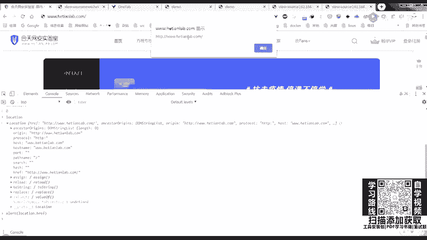

嗯。😊。

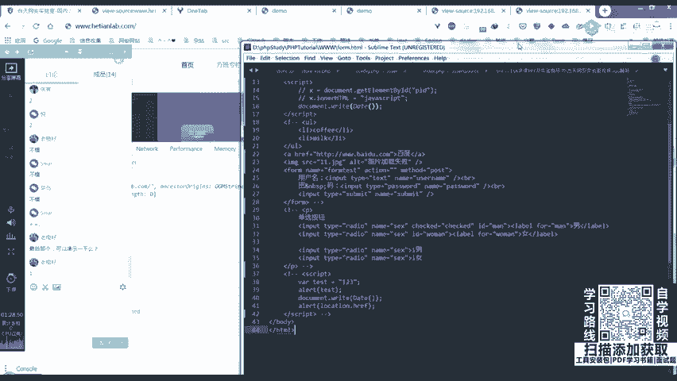

嗯，大家还有什么问题吗？今天讲的这些内容可能会有点碎，就是刚开始讲那个HTML讲了比较多的标签什么的，大家可能就是听的也无聊，然后。其实就可以去进实践一下吧，自己去写一个体验一下。

你自己写一个里面啥都有嗯的1个HTM文档，然后看怎么去修改它的内容啊，怎么增加一个用户交互啊等等，自己去就是去熟悉一下它里面的一些标签。我这没有显权。也没有写全嗯。获取。😔。

ID元素那里是因为参数是ID如果是其他参数。更改就。一样可以设吗？参数是ID什么参数？或取。😔，你这获取元素其实也不一定要通过byID啊，你还可以通过。你可以我可以看一下，就是document。点。

Get。Element。你看到没有？其实我们可以通过by IDD by class lamp by lamb by tag lamp。等等这一些来。进行一个获取。

但是我们可能最常用的话就是这个byID通过它的这个ID值。在这儿的话，这个P标签它的ID是lamb。所以我在这儿通过这个lamb。因为ID是唯一的，所以。我可以通过这个lamb来进行一个获取。

就是会就是我们会去查找整个文档里面ID为la的一个标签是什么。然后传给我们的X在这的话，就是将我们的这个P标签传给我们的X。

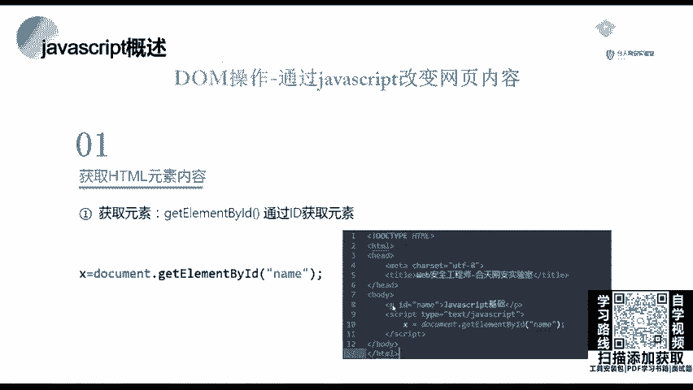

获取HTML我内容那里。😔，对，就是就是这里嘛，对吧？你这如果写ID写成别的，你在这的话也要把这个。嗯，把ID里面的参数给改了，因为它是通过你你这设的这个ID值去页面里面找的嘛。

去找哪一个标签是这个ID值的。嗯。大家还有什么还有什么问题吗？如果大家对我有什么意见或者是建议，可以去和班主任进行交流。然后班主任的话会反馈给我。嗯，现在22了。还给大家3分钟吧，就。到25的时候。

我们就下播。今天讲的基本上都是前端的一个基础。和叉SS的话可能。😔，就暂时还没有什么关系。但是有关系的话，就是在这个地方，这个实体字符这跟我们叉SS防御的时候有点关系。当然这些都是基础。你学了这些的话。

可能对后期嗯写。就是更好进行的掌握。对这个漏洞更好的掌握。大家还有什么问题吗？没有。😔，Mhm。😊，也有蛮多人在听。那没有的话，那今天这节课就到这里吗？就下课，好吧。嗯，大家明天见。

大家可以去预习一下哦，对了，那个。到时候给大家发一个网址，然后大家可以去金到那里面写。写一下那个。嗯，叉SS的一个内容。然后如果写不出来也没关系。就是进行嗯。大家可以去预习一下XSS吧。

那今天的课就到这儿。嗯，感谢大家，大家再见，明天见。😊。