# B站最系统的护网行动红蓝攻防教程，掌握护网必备技能：应急响应／web安全／渗透测试／网络安全／信息安全 - P28：web安全-4.sql注入篇讲解 - 跟小鱼学安全 - BV1SF411174M

啊，首先第一章是一个my数据库的一个基础。在讲之前呢，给大家看一下一个网站的一个普通结构呀。啊，大家学了STML，然后学了前端的话，这一根应该是看得懂的。啊，就是比如说这是我自己。

我给我这个vivo服务器。提交了一个请求。然后这个请求他就解析到解析，然后传向这个数据库。那我数据库接到你这个请求。那我就会。啊，做出一个响应嘛，然后我把这个响应传给这个vivo服务器。

然后这个服务器再传给我这个工具者。这一部分呢啊你们有没有不懂的？这个应该很好理解吧。懂的话，你扣个一。好吧，懂的话，你扣个一，让我知道一下。应该是给你们讲过的。不懂，你就可以扣个2，这个没事的。嗯，好。

没有快的话，那就是基本上都是理解了。这时候我们要想到一个问题啊。就是我这是一个正常的一个处理过程。然后我这里是一个数据库，那我数据库跟这个vivo服务器，还有这个攻击者，他们是怎样的进行一个传递呢？

对不对？他们是怎么进行的这样的一个过程呢？是你要理解的。接下来我们就开始看。

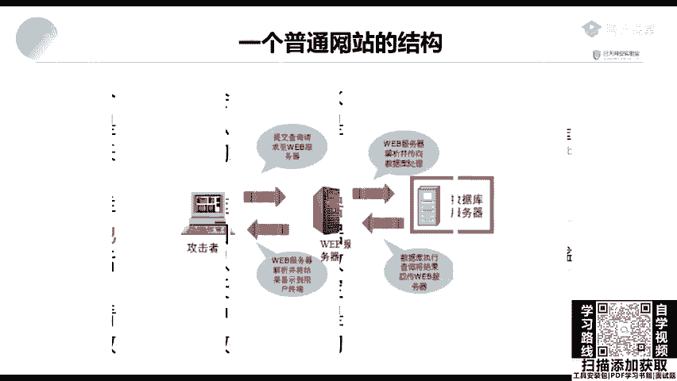

首先第一个什么是数据库？数据库的话，你简单理解就是一个存放数据的地方，对不对？你们啊因为第一节课就教你们搭了一个网站嘛，对数据库大概有一个了解就是。我这个数据库就是存放数据的一个地方。

就是我这个网站的一些关键数据都存在我这个数据库里面。然后呢。要去查找数据的时候，就是直接从数据库里面调用。这点呢应该呃有没有不理解，就是你如果数据库是什么东西都不知道，你就扣个2，好吧。应该没有吧。

如果你们搭了网站的话，肯定是应该会了解个数据库的。技术还就是总体来说技术还算比较还可以的，好吧。我以前教过就是可能数据库都不知道是什么东西的，有这样的一些。既然大部分都懂，我这里呢就简单的过一下。

你让他过一下。啊，还是看一下吧，好像他们说是有延迟。O。😊，那我数据库。过者之后我们看一下斯考是什么东西。就是。我数据库是叫sserv啊，然后我ser是什么呢？就是用来操控数据库的一个语言。

也就是说我一个P啊，比如说我的一个代码，对吧？我的一个网站，我要操控我的数据库，就是我要从我的数据库里面拿东西，那我就要通过这一门circle的语言来进行一个操作的一个存储。这有一个思烤。

那我们接下来看呢常见的ser数据库有myssserv orac。常见的就是这前面三种啊。然后其实前面你要记住啊。所有的数据库还有最多也还有个access。所有的数据库它的一个操控原理全部都是一样的。

全部都是一样的。今天我们要讲的就是这个my circle。注意啊，今天的一个重点是你不是要记住这些句子，而是要理解。就是理解这个东西是干嘛用的。啊，首先我们来看一下一个数据库的一个结构。

这里呢你简单的就理解为啊，我一个数据库就是一个大背共框。我这个大的框框里面呢，然后就会有一个表。就是我这个数据库之后就是一个表。然后我表之后呢，就是一个。字段。然后我字段里面呢，就是我存储的一个数据。

这里呢可能看看的不太清楚，我们用嗯PV study的那个东西来看一下。就是数据库的一个结构，你一定要记住啊，很简单，就是首先我是一个数据库，然后我库里面有表。然后我表里面有字段，我字段里面有数据。

那是怎么理解呢？我们来看我们的一个。我还是用这个PP卖的命来看吧。这个比较清晰。啊，首先你来看。这里呢就是我们的一个数据库的一个名字，对吧？就对应的这个数据库的一个名字，库一括2嘛，数据库的一个名字。

然后我这个数据库里面有什么东西呢？比如说我这里有一个。DVWA里面都有的嘛？DVWA的一个数据库。那我DBWA里面呢，它就有两个表，两张表。然后我看一下user的这个表，这个表里面有什么东西。

然后这个表里面呢有这么多的一个字段，比如说user ID拉us IDuser。发错的。这里呢就是这个这张表的一个字段。然后我这里面呢这个admin。它对应的就是这些字段的一个值。

你你看这里user就是admin passwordssword就是密码。他一个数据库呢，就是以一个这样的形式。进行哪个存储？这一部分有没有不懂的？呃，我还是敲越这己吧。No。这个一定要记住啊。啊。

你还是同样的，你懂的话，你就扣个一，不懂就扣个2。嗯。😊，啊，不会了，说出来没事啊，就是我看只有一部分的同学在这。啊，不会也没事。就是你一定要记住啊，就是。一定要记住这个。O。一定要记住这个结构。

它是一个这样的一个结构。那我们接下来就是一个怎么样的呢？嗯，看一下。对，就是大大号小的。Yeah。这里呢有一个数据类型，数据类型不需要记啊，就是你要知道有这种类型啊，我不需要你记。

你只要稍微看一下这个int block。还有。这里呢是一个呃书本里面会写的一个数字，但是我不需要你们记，你只要知道有这个东西就可以了，就是有这个东西。因为很多时候如果除非是你学数据库。

不然的话是用不到这些东西的。然后这里呢也是数据类型。这是文本的这一些。你记住有这个东西就OK了。然后呢，有一个约束，这个约束呢也是大家记住啊，就是你们只要知道有这个东西就OK的。

一般都是note word。你看这一个黑空。这是因为为什么要理解呢？就是在执行一个srer语句，比如说要建立表，然后建立虚库等这些东西需要用的。啊。这里呢就是。待会儿我把之后我把PPT发给你们吧。

就是中间记住啊，你们记住这三个。这几个的啊数据类型啊，还有字符串类型啊。字符串的类型啊，然后还有这个scle的一个约束。你们我不需要你们记这些记，我觉得就是在实战中。基本上是用不到。

但是你们一定要知道有这个东西。啊，那我们。就来进行一个操作。

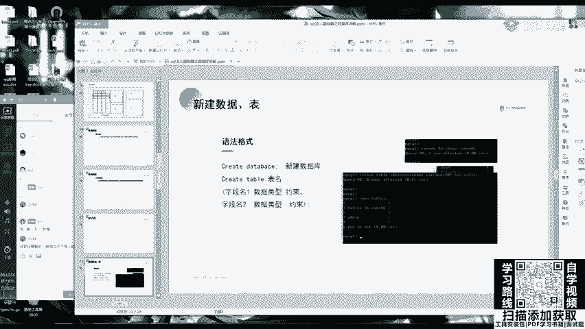

你们数据库。我今天给你们发了一个。Let me cut for my circle。本来要发新版本的呀，忘了，待会儿下完课，我给你们发一下。我发的是一个。是里。是一个这样的一个东西。Never卡。

然后呢呃如果你没有装这个的也没事，你们不是有PHB study吗？我这是老版本的，你们是新版本PB4 study呢找到麦s工具，有一个麦s的一个命令行。然后输入密码。就可以登录这个myscle。

那我们接下来要学的是什么呢？就是mys的一些简单的一个句子。

这里的一个新建数据库新建表。这里有什么用呢？就是还是给大家便于大家一个理解就是。记住一些简单的一个s个语句，我们后面的s个中路是可以用到的。首先啊你们看习惯na cut自己本机的话就是3306。

然后你输入自己的一个密码。的连接。连接测试成功就可以连接。你就可以看到自己的一个数据库。所以。然后你要怎么执行一个命令呢？就是。啊，有一个新建查询吧，应该是。查询。然后找一张表。

随便找个test新件查询。这里面呢。给大家看一下，首先是说。Desite。然后这里运行。这呢就可以看到一个数据库的一个名字。我的比较多呀。跟这里是一样的。跟这里呢是一样的。然后我们看一下呢。

就是简单的看一些句子。简单的看一些句子。首先呢第一个是创建一个数据库。啊。Thats this。然后这里然是一个新建数据库。这样如果优预约好的话，就知道这里就是一个新建的意思。

that best就是数据库嘛，对不对？我们随便创一个啊。我这要创一个空白。啊。多了个S。O。对，打错了，我知道。然后可以看到这己就创建了一个空白。还是为了这个是用来干嘛呢？还是给你们进行一个理解。

就是理解这个数据库是一个什么样的。然后呢，就是也同样的会有一些简单的一个句子。这呢就是创建哪个数据库啊，如果你们手快的呀，手快的可以跟我来一下。但是如果手慢的话，就可以啊手慢的话，你就看一下就得了。

课后自己去进行一个操作。因为你操作的话是永远跟不上的。然后呢，它这里呢就是创建一个数据库。这里的意思呢就是创建一个表，然后这里呢有一个admin的一个表明，admin里面呢有一个user name。

这个us name的属性是VRt30，然后它的一个约束是mo。

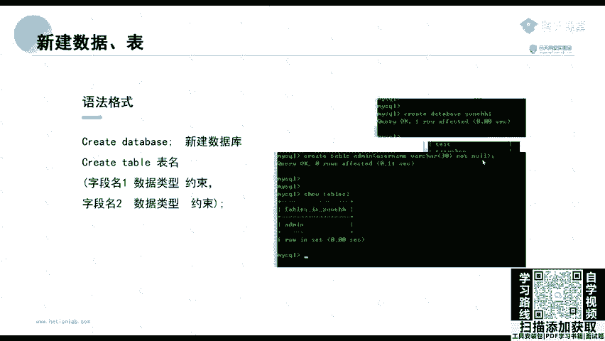

约束是一定要有的。可以看到这里。这等一个约束。当然我觉得就是这个创建表嗯。稍微理解一下就行了吧，也不用也不需要怎么记。Okay。嗯，太要弄几时呢？の明とは。哦。傻逼呢。这里呢就是我创建完数据库之后。

对吧？我要进入到这个数据库里面对。要有色。进入数据库里面，然后我在数据库里面创建一个表。然后我们收一下这一个数据库里面的一个表。哎呦，我这。说的。啊你记错了吗？没事，不管他了。自己只要。

这里呢只要记住这一个是新建表新金库。🎼这是常见的命令，这个记住啊，这个还不是重点。重点呢是这个。就是我个人觉得你my circleer里面。

不管是mysical还是其他的一个oracle access等这些。这个猪肉基本上全部是根据这4个。就这四句话就这四句话来进行一个操作的。就是你前面什么东西都不记，没事，但是这四句这4条。

这四条你一定要知道是什么意思。也就是说我们今天整个45分钟我就学4条就OK了，什么东西都不用学，我就学4条。啊，首先。看一下这里呢是一个查询语句。咩。这呢是什么意思呢？这个就是查询，然后星号。

代表一个所有这个表。OC杠U色这个表。就是我查询OCus这个表，这里面的所有一个内容。这句话能理解吗？能理解你们还是扣个一。또。好。啊，你们应该之前也是预习了呀，就是我们的一个所有的一个条件。

这个记住啊，信号是代表所有不啊，它是一个正则的一个东西。然后第二个就是进行一个增加。啊，我把这四条语句发你们把你们那个。

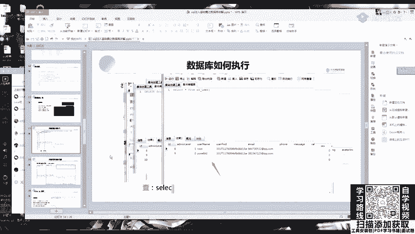

等一下。待晚上是发PPT吧。截个图吧。这四条语句发群里吧。

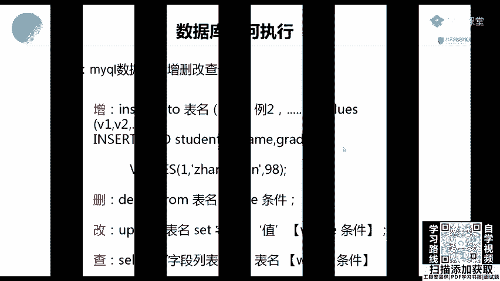

这个注入其实真的很简单，只要你们会了这四条语句。这呢是一个查询的一个语句。然后我们再来看一下。这里呢就是一个增加啊，给这个ID就就是。userPWDe这四个属性添加对应的一个值。就是ID这里就是10。

意思 name就是这个。这是一个进行一个对应的。这个OCU粉就是这张表里面的一个值。就这一张表。对OCus这个表里面的这四个值进行不对，这四个列添加对应的这四个值这条语句。我们来敲一下吧。呃。

我找个少一点的表呀。就是这张表太大了，不太好看。好像是这张表吧。这张表的话，它东西比较少。这里呢就是一个查询语句，刚刚大家都懂了。然后你们可以看到呀，它这里呢有4个属性，当然它后面也也有很多属性啊。

有很多。它这个列有很长，自上我只是随便的添加一下。ID啊，然后。WD。No。嗯。啊。😮，然后。你的XS1还是没装上。没事，待会儿课后我给你们看一下吧，就是课后我会在那个群里面开个。自然课。

因为你们都还在嘛，都有时间吧，你们有时间的话就扣个一。要是忙的话，我就再找个时间。我看一下你们大部分人的一个时间。我你。of key什么什么什么什么东西。难道我又记错了，好久没弄了。你色等 you。

B2S。Hs1呀。啊，待会儿回去给你们看一下吧，给你们看一下。哦，已经有了。就弄个12吧。好，可以看到。这里呢有添加成功。然后我们再来查看一下。看看的这个表。待会儿都给你们讲一下，就是下完课你们别走。

放学别走，待会儿晚上会给你们看点东西的。可以看到我刚刚这几页添加成功了。字体语句呢我也不一定。是的，我觉得就是这些东西啊没有很大的一个必要，你全部都记着吧。我们重要的是一个理解。这个就是四个语句。

这然是一个理解。可以看这样就是更新嘛进行一个更新。更新啊，这个语句呢还是给你们看。啊，自己就是改。更改OC杠us这个表里面sit就是这个。这一个是什么？就是这个user learn等于。

然后email等于多少，然后做了一个条件，就是修改ID等于10的这个user name等于多少，email等于多少？最长应该也能理解吧。然后可以看自己就进行了个更改。

这呢就是删除删除这个OCus里面VID等于10。就是ID等于1的这一条信息，就是我把这一条给删掉。啊，这四个语句里面有哪个地方没搞懂的，你们现在就。讲一下，就是现在发一下。

不懂的一定要说呀不懂的一定要说。因为明天的话我肯定又是交新知识了。不懂，你就扣个2啊，我等一分钟。如果没有没有扣2的，我就过了。哦，mys的一个增生改查，就是这几个语句应该都懂了，对吧？

那我们看一下接下来的一个重点。接下来的一个重点。就是有一个联合查询的一个语句。啊，你比如说看这里，我首先查询一个非要B3等于 rootot的一个语句。它就会返回我一个us面等于入手的一个结果。对不对？

但是如果我加一个联合查询呢。你们有没有发现一个变化？这就是多了一条多了一条查询的一个信息出来。对不对？所以呢为什么我会说这里是一个重点呢？啊，先给大家看一个简单的一个图。我翻一翻吧，看还能不能翻到就是。

啊。给大家看一个CMS里面是怎么写的。哦，用靶场给你们看吧。我们首先来看一下。一个正常有存在丝绸之路的一个语句是怎么写的？这一串啊这个应该大家很熟吧，就是我查询。这个所有的。在这个U表里面，所有的。

然后这个ID等于我这个ID进行一个输入的。ID等于多少，然后就返回一个结果。这条语句应该大家都懂，对不对？然后这个ID是可控的，又对不对？那这时候我们的ID。如果输入的是。这一个联合查询的一个语句呢。

那他这个返回结果会变成一个什么样的一个变化？就是会不会。我们后面的这条句子都是自己可以进行一个执行的。那会不会就是我想查询哪一个。啊，想查询哪一个？啊，哪一个东西？就是我随便查询什么东西。

他都可以给我返回一个结果，对不对？这里理解吗？理解的话扣个一。啊。大部分是不理解吗？那我再来说一遍再来说一遍。我再给大家解释一下。啊，首先我们来看。还是同样的吧，我用这个数据库进行一个操作。这里拿不要。

まさ？等于。就是嫩嘛。有路他。我自己呢就模拟一个查询语句。模拟的查询语句是不是啊就类似。就类似我这一个。这条是不是有句？就是类似我这个场景里面的这条语句。到这一步懂的话，你扣个一。

对吧这个基本上是一模一样的意思啊。嗯，好。这里呢是一模一样的。然后我这一个输入的ID的这一个值。是不是可以自己随意的进行一个变化，对不对？啊，我就拿着这个靶场的一个网站给你们看。

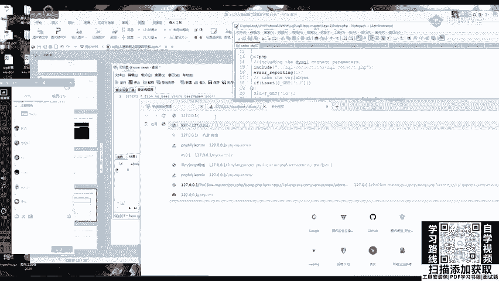

啊，比如说。就这里了，我ID等于一，对不对？就是对应的这个ID等于一进行了一个查询。

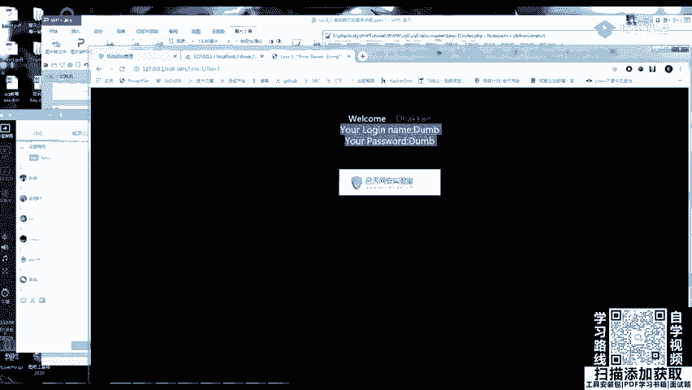

然后ID等于2。正常的网站逻辑是不是都是这样的，就是我随便找一个网站嘛，我随便找一个网站。

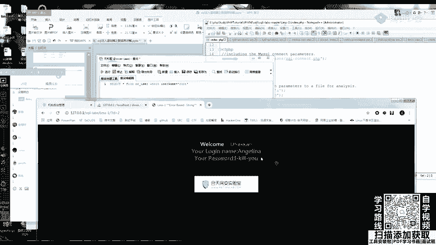

啊，上海。我随便找一个网站。吉利官方网站。啊，就比如说。我这里呢它就类似我这个ID等于282，就是这辆汽车。就跟我。它的数据啊它的一个语句是不是就有可能是一个这样的。就是我查询这个ID等于多少。

我就返回这样的一个结果，给我的一个web服务器。然后我在这里改。281。好，他商品已经下架。那我改这里了，它这里是294。那我294就是这一辆吉利加G。我281它就不存在。我262就是这一辆这一辆东西。

就是我正常的一个网站是不是都是这样写的？就是以前来说正常的一个网站。然后这里呢，我是不是说了一个数据库，有一个这样的一个句子。啊，就是比如说。我这里呢就是相当于是1个ID嘛，对吧？ID。

那我这个ID变成一个啊root。然后打一个。信号。然后再加一条这样的句子。一条这样的一个语句。啊，就是我把这条句子括在这个里面了。因为这里是我可以自己随便输入的嘛，对吧？那我扣ll在这个里面。

那我是不是。它这个s语句的一个句子就会变成一个这样子。到这里的话到这里。能理解的话，扣个一。因为我这个ID是可控的。这应该就很好理解了，对吧？好。

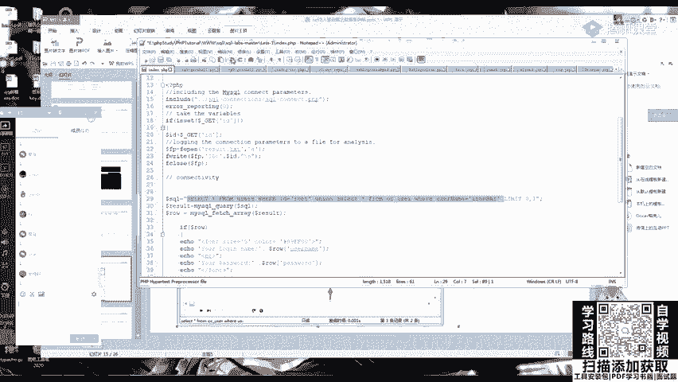

那我啊那我就进行演示一下啊，比如说这里。ID等于-1，然后我这里呢进行一个查询语句。🎼Yeah嗯。F。嗯。呃，我先看一下他得这先闭合，然后。好像是三行吧。吓。

这里呢slash that best的它它的一个意思就是我把这个拼接进去啊。我把这个拼接进去。嗯，等一下，我找个UA往解码的一个地方。

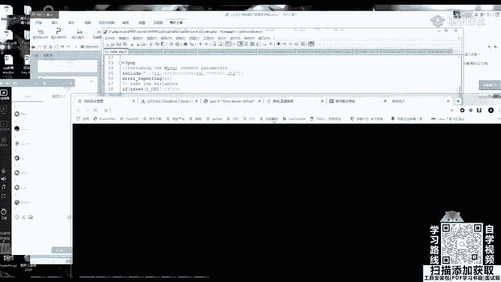

我拼接进来。他这个语句呢是不是就变成这样子，这条是我们输入的。那他是不是就会返回这一条slash database？然后就变成了。

就变成了这个样子，把这个数据库的一个名字给显示出来了。

用我们的联合查询语句。是会执行后面这一条语句的嘛？你就相当于把这个不看，然后它执行的后面这一条语句。然后你再想一下，我自己一个st，我后面的语句是不是自己可以控制的？就是我自己想怎么输入就怎么输入。

对不对？那我如果要查询它这里面的一个入册用户的一个密码呢。比如说你说啊如果我这个吉利这个网站。我存在一个四个猪入。然后呢，我就在这个地方出这个型号，然后进行一个查询。这是举个例子啊。この某某も。

然后我就是不是。如果它存在注入，我通过这样的构造，就可以把它的一个。就可以执行任意的一个色彩语句。然后把他的一个。啊，管理员用户密码给他给查出来。对不对？他这己能理解吗？能理解的话扣个一还是。

就是因为我这个ID可控。然后可以随便输入。数据库的一个语句。

这样好了吧，O。

然后我们就开始看。这里呢old by排序。这里学了是有什么用呢？就是学了之后会让你啊。学了之后就会让你知道我后面的一个srer注入是怎么样进行的。搜个注入是怎么进行的。首先我们来看。

这个old by有什么用啊？啊，我不我先不跟你们讲这个。嗯，我觉得跟你们讲这个的话会太抽象了，而且没什么用。

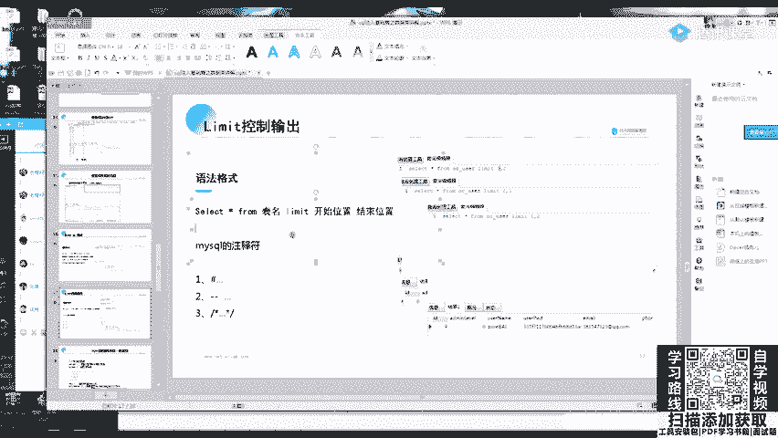

先让你们理解一下什么有一个什么样的一个用，对吧？

就是我这个old by。我这里呢有1个23列，懂吧？

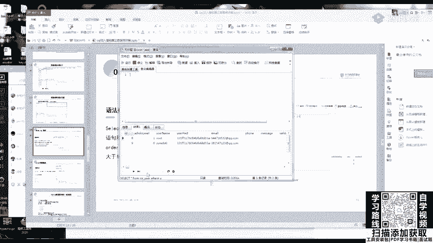

只有23列。

然后当我or by。小于这个列数的时候，我这个结果会查询出来。就是会把我的结果给返回出来。但是我当这个old by大于它的这一条列数的时候，那它就不会返回回一个结果，就是会返回错误。那这里有什么用呢？

它这里呢是一个这样的一个作用，我们还是来从代码里面进行一个分析。哦，我干脆就找到你找到这个表吧，好吧，找到这个表给你们看。这里我新建一个查询。我先看一下几张表啊。啊，可以看我这个us表有三列，对不对？

然后good back。啊。他还是返回这样的，没有问题。那我ode by4。他就返回错误了。

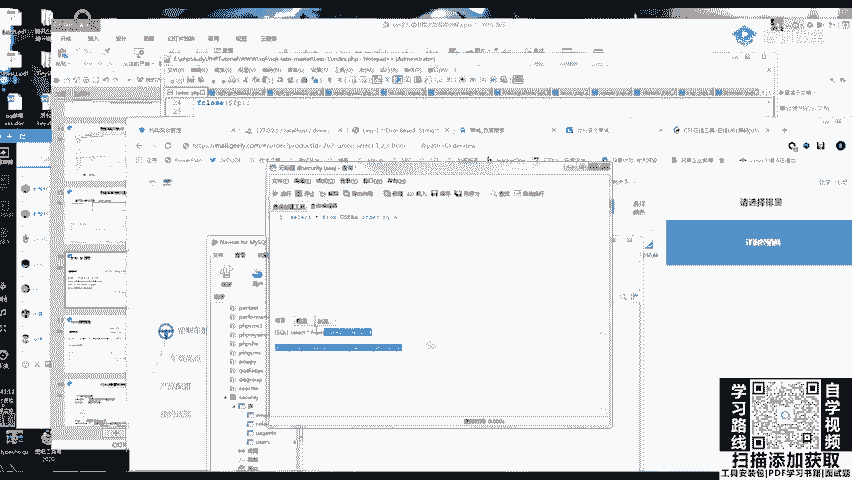

那我是不是？我的拜3它就有三列。好，我们同样的在这个上面进行一个输入。啊、没有问题。我的拜四。他说报错。

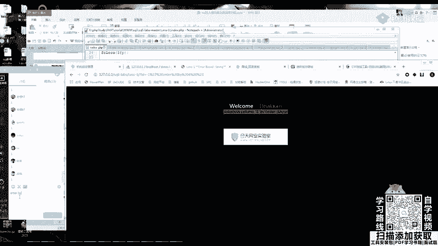

那这个有什么用呢？我们再来看后面的一个语句啊。就是这里呢有一个ecle。X的意思就是显示。显示了user name跟pasword。

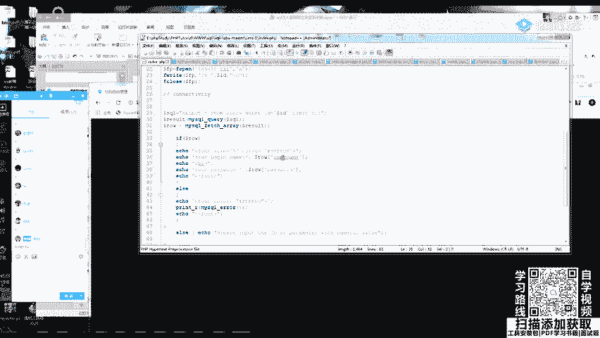

好，然后我们来看一下。

U是那根 passport错的。对应的是不是数据库里面的这一个第二列跟第三列。对不对？第二列跟第三列。

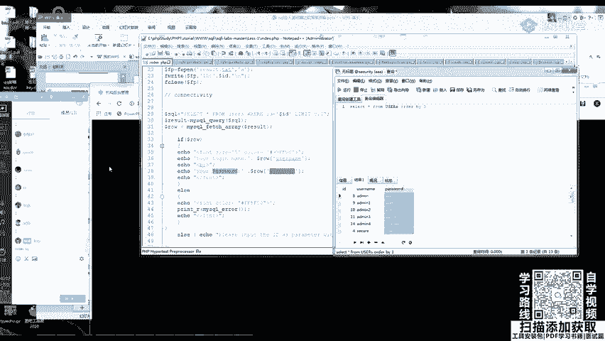

那我们的这个old by就是为了查出。它这个显示的对应的是哪一列？第一。你可以看我这里呢，因为我是欧的 by3，所以这里呢。是st123。不用虎狐给你们看吧，这个5个浏览器的UIL编码。

你们估计看的很难受。

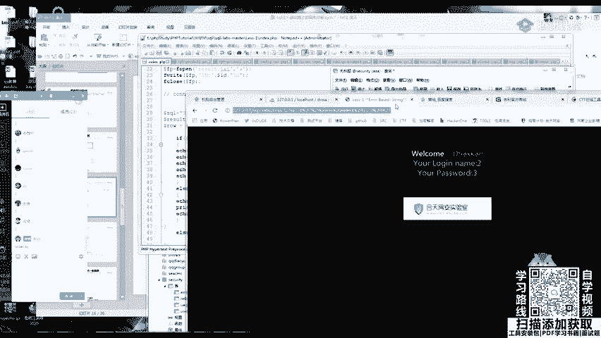

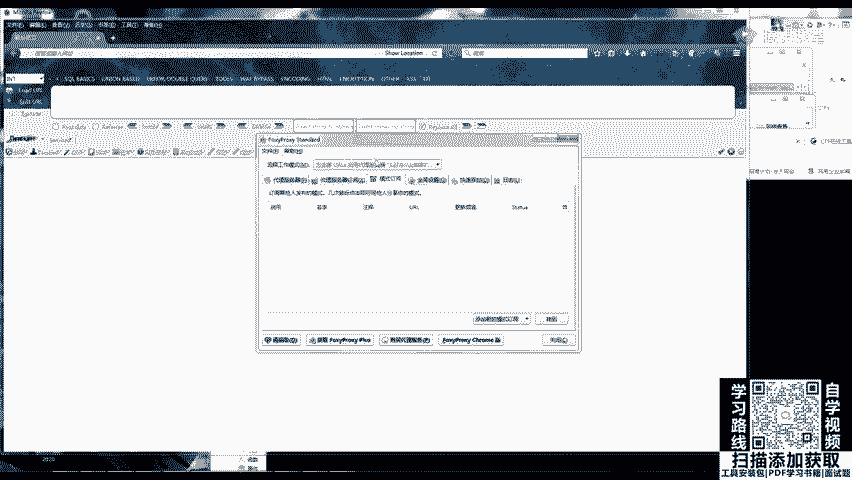

不。

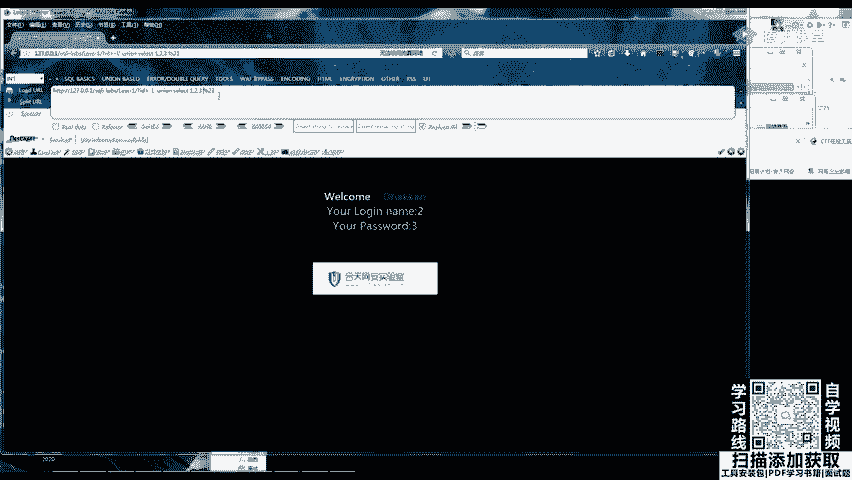

好。至以呢old by是为了查出我这个显示的是第二列还是第三列。

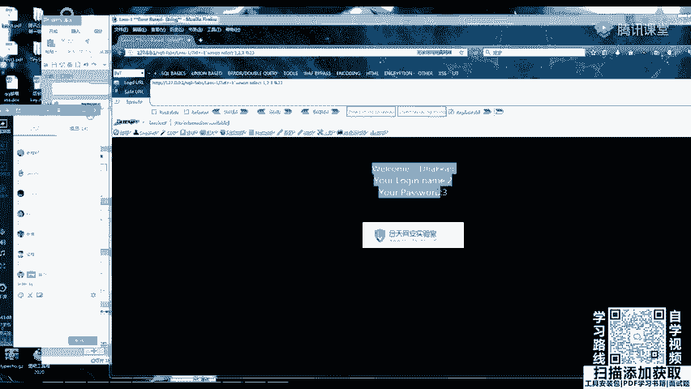

这是一个回显的一个常规操作。然后。my斯的三个注释符。注释符大家应该能理解什么意思吧，就是我加了一个注释符，那后面的东西就是没有用了，就类似这样啊。我加一个警号。随便打。你可以看颜色变了。

就是让后面的语句失效。

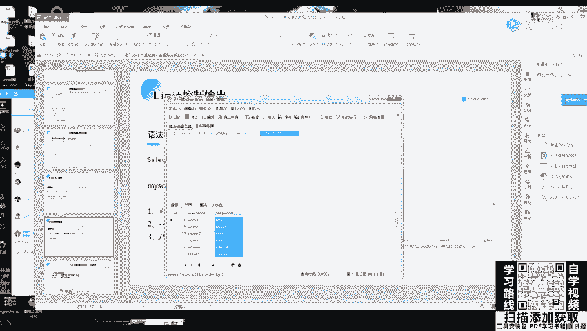

啊，我其他的不要求你们什么，但是这三个注数符你必须给我记住。

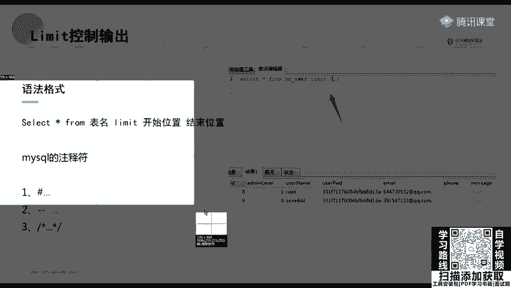

三个注释符必须给我记住，后面有大用。

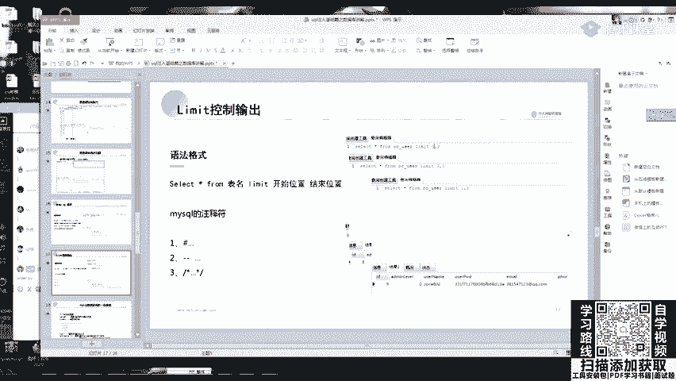

不滚。

然后这里面呢有一些常用的一个函数啊。同样的就是我不要求你全部都记住，你给我记住一个就OK。就是我不会的，没事，我全部记不住。没事，那我去百度搜一下，或者我记个小笔记。我记一个小笔记，写在自己的记事本上。

这些你们都全部给我略过。都全部都有略过，就是。我这一块我不要求你们都记住，你只要知道大概有这样的一个东西就可以了。后面我后面我再给你们练的时候，你就给我对着这张表来看它的一个scle语句。

一个一个是什么意思？因为你一天要记的话，知啊瞬间这是一个一个知识点太多了。还有这个啊这几个的话应该很好理解吧。and跟or。And。and呢跟这两个是一样的，就是雨的意思。过的话就是货的意思。

或者还有语的话就是and跟 what应该都能理解吧。and跟 what不理解的，你扣个2，让我知道好吧，and跟 what。应该没有不理解的吧。这个呢都是为了后面的几节课打一个基础。

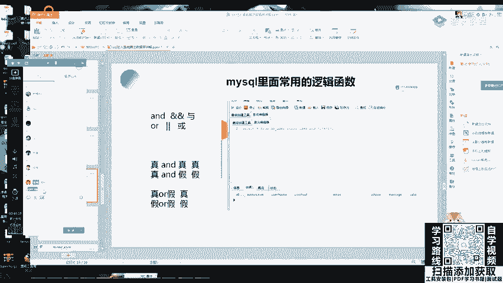

就是我不要求你们知道啊思考语句直接默写出来，但是我要必须要让你们知道它是有一个什么样的一个意。

意思。知道意思之后，很好能真的能很好的一个理解。前面呢前面的这个呢就是搜狗注入，你是不是觉得嗯好像就一点点。我支持的一个现实场景，或者注知道的差不多就这么一点，只需要这么一些，不需要更多的一个东西。啊。

还是同样的。我强调一个重点啊，就是。我刚刚发群里面的。这个登山改查4条语句。再加上这一个。忙住。即时后。哎，这个注释的一个句子。你们呢最好就写一个小笔记。比如说我创建一个我创一个文本。

你就要自己创一个文本。嗯，喝个录露笔。当然你们有那个呃笔记工具更好呀。就是比如说有道云笔记啊或者这一些的。你们自己记个笔记啊，一定要记住啊，做笔记的话。还是挺有用的，我不说特别大远，但是还是挺有用的。

自己做一个笔记。好，然后我们再来了解一个表。就是这个mys的一个特性，冰峰。information测置这一个表。这个表呢你就简单的记住这个表里面有所有的一个my的表，就是mys所有的表都在这个大表里面。

我通过这个大表。就可以查到myag数据库里面所有的一个语句。这个表。这个表。啊。

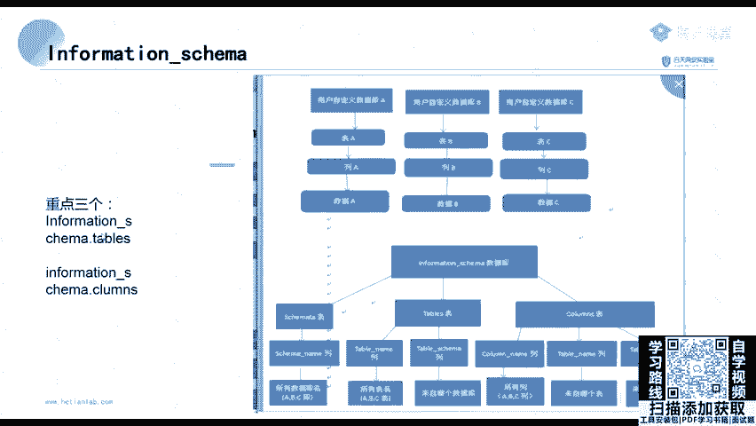

然后我还是给大家看一下。

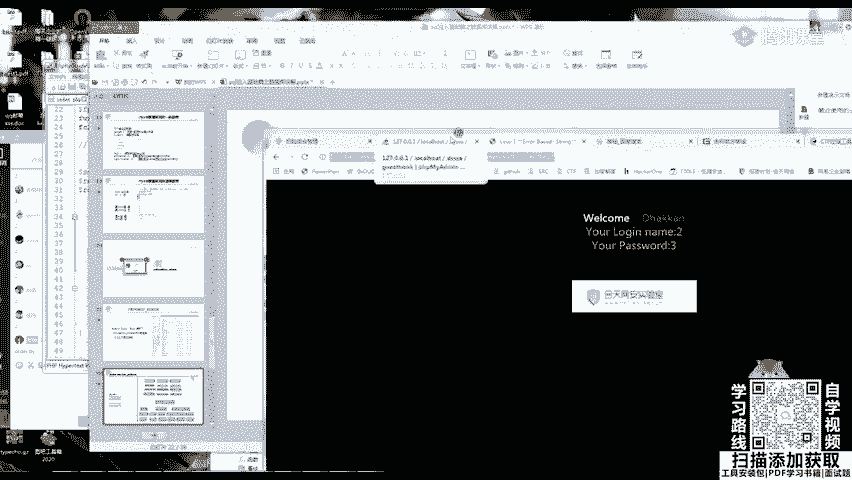

我今天好像是不是有点讲的太慢了？这些呢也只是就是你这个东西你理解就OK。记住有这样的一张表。他这张表里面呢会有一个所有的一个数据。所有的数据表。我知道慢呀。然后呢就会有这样的一个句子。啊。

我们一一个语句一个语句的来分析啊，好吧。啊，我们首先来看这样的一条语句啊。我们来看这样的一条语句。啊，首先我这里呢是查询这个table name。这个table name是一个字段。

然后在这个information设置点tables，就是这个库的。点tableabs。这张表里面。然后呢，这个条件是。table search等于这个dabb。

然后这个dsb呢就是当前的一个数据库的一个名字。那我们结合来看一下，就是我查询这一张表里面的这一个。paper name就是。这table就是这个表。哎，应该这样说。

就是查询当前数据库的一个表的一个名字。这条能理解吗？条件是等于当前的一个数据库。我查询当前数据库。的一个表的名字。因为我这个数据库里面是有所有的一个表的，就是有mas所有的一个数据库。这条能理解的话。

你扣个一这条。哦。啊，没人。啊，只有三位同学理解吗？嗯，好，我再来讲一遍再来讲一遍。我们就这样看吧。我们就这样看。我这里呢是这里它的一个数据库。然后我这个数据库。的一个。Habbles。就是在这个地方。

把这张图抠出来吧。information tables就是我查询这一个数据库里面。对不对？然后我查询之后，它就是一个这样的一张表。然后呢，再加一个条件。就这个table search置。

反正我是查询这一张表里面的这个字段嘛，table table字段。就是这个字段。然后呢，它的一个条件是。table search就这个。等于我这个当前的数据库的名字。你理解了这一条的话。

后面就很好理解啊。你首先可以看这个呢是每一张表里面的一个。这里就是my的所有的一个数据库。然后呢，我是查找这一个。这个字段等于当前的一个数据库，也就是我自己的一个数据库。

的这一个数值你就简单来说是查这两列嘛。然后我查的这一列是它这个t search等于当前数据库的一个名字。然后这个呢其实是同样的，就是我查询它这个列的名字。不要等于OCusOCus呢是刚刚这里面查出来的。

所以说你还是这一条理解。啊。不会了，我待会儿写个我待会儿一个一个给你们解释，好吧，我待会儿写一个东西给你们在里面。然后你们今天呢就会有一个任务啊，其他数据库的话就。うん。有两个文章在这里。

就是你们可以看，其实两个都是一样的，就是跟麦斯克差距都不大。Yes。然后你们今天的任务就是你去了解这两个东西啊。啊，因为时间其实有点点晚。今天你们去了解这两个东西。然后我待会把这个语句。

我一个字一字给你们解释，写上这条是什么意思？今天的一个内容就这样OK了，其实东西很少呀，东西很少，你就想简直就想四条语句。哦，五条语句吧，增山改成4条语句，再加上这一条。查找这个表的一个语句，5条语句。

你们今天就去理解这5条语就就OK了。嗯，好，今天的课程呢就暂时在这。然后我待会儿在QQ群的话，就给你们开始开一个直播，进行一个一些简单的一些东西的一些讲解啊。所以呢我就先下课了，我们QQ群见。诶。哦。

这个好像有点那个呀。어。Yeah。嗯。😊。

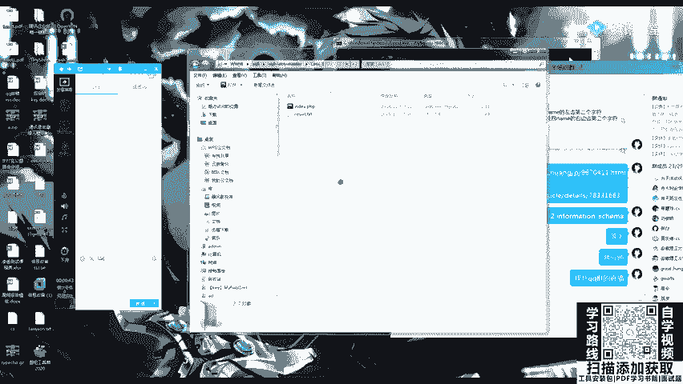

Yeah。嗯，找一下。呃，各位同学，你们现在去QQ群吧，这一个。这里我刚刚看错了哟，原来调整成那个。Okay。Yeah。뭐 돈。就是昨天学完一个麦斯的一个基础。就开始讲一个四合猪入的一个原理。

其实我昨天已经跟你们提过了，这个珠的一个原理。先下来看一下，首先第一个是索注入的一个基础，第二个是思合注入的一个利用。第三个是一个搜合注入的一个实例。这个实力呢待会你们嗯不要太急，知道吧？啊。

下完课可能明天讲完之后会给你们一个实例。首先我们开始今天的一个课程。第一个什么是四个猪入？在两四个柱子之前，大家可以看一下。这个猪入他从啊1998年开始嘛。就出现了他这个四个猪入的历史就是98年出现的。

它的一个根本原因就是因为把srer的代码插入获久或者添加到应用用户的输入参数里面进行一个攻击。然后再把这些参数传递给后台的搜客服务，加以解析并执行。不知道昨天你们啊你们还记不记得我昨天讲的这个例子。我。

我昨天讲的这个例子。昨天讲的一个例子是这样的。我这里呢有一个思考语句。然后我这里用户输入，这个是用户输入的一个参数，就是你输入值的一个位置。然后他没有对这个。进行一个过滤。

那我把这个ID变成一个呃昨天的一个联合查询语句。带入到这个里面。这个四个语句就发生了一个变化，违背违背了它原本的一个意思。他的一个原理就是这样。啊，其实很简单，你们就是用理解。そそう。啊，因为。

你就这样想吧，你之前的一个叉SS是不是就是我把系统把我用户的输入的值当成了1个STML的一个代码。所以呢就继续就发生了一个叉SS。那我这个设个注入呢。

是不是就是因为把我这个用户输入的值变成了一个scle语句进行一个执行。那就变为了一个色个猪肉。原理都是相通的呀，后面的漏洞也都是一样的。首先我们来看一个简单的一个拓普图。

就是我们在对一个网站进行一个查询的时候，昨天也是讲过了的。这是我两个正常的用户对我的网站进行一个查询。然后这己呢是我们的一个黑客啊，也就是说比如说是我。我对一个网站的一个查询？它中间呢就有一个过程。

我客户端A对网站发起一个请求，网站呢接到这个请求，就把这个请求发到数据库里面去。然后数据库就会返回这个请求。我们来看一个具体的一个过程。首先。😊，啊，从这里来听就比较简单啊。

首先我要查看一个用户ID为36的文章，对不对？就像我昨天的啊，我找一个文章，好吧，比如说百度文库。我百度文库呢，我要查看这一篇文章，它这篇文章的一个ID就是这个东西。打开啦。我们来看。调细听。

我要查看这个ID为305的文章，是不是就要请求我的一个网站发起一个这样的一个请求？查看36的文章。然后呢，我这一个就得到了这个ID为36。然后就构造一个参数。查询这个文章里面ID等于36的这个文章。

就是查询这个。表里面的这个ID等于36的文章。然后呢，他接到这个。就对我们的一个数据库发起了一个请求。那我数据库接收到这一条s考的一个请求。是不是就会返回1个ID为36的1个记录？

也就是我们刚刚在这里执行的一个。bu，然后V2ID等于A。なみいんだよね。啊。好。addmin等于它就返回一条这样的一个句子。数据库就返回了一个这样的一个结果。对不对？然后呢。

数据库呢就把这个返查询到的结果返回给我们的一个网站。然后网站。就把这一个结果进行一个编码处理。然后再返回给我们这个客户端。然后呢，就把这一个展示发给客户端。发发给一个用户，对不对？

这里呢就是一个正常的一个逻辑。至商那一个是否引擎那个逻辑。这个呃明白的话，你们就扣个一，好吧。这边还是好理解的。うん。有几位同学不理解吗？3456。嗯，好。ok。

那这个呢我们的过程就它的一个反回的一个过程就是这样，对吧？还是回到我们的一个。一定要记住啊，自己的ID就是36。那我们来看代码。他是不是跟这个就很像？跟这个就很像。然后我这里的ID没有进行个过滤。

那我在这个ID的这个地方。进行啊输入一条我们。第一节课学的一个四字语句就是联合查询语句。然后呢，这个思考语句就会发生一个变化。那就会执行我们一个自己想要的一个结果，自己构造的一个结果。

它一个设注的产生过程就是这样的。有没有对三个注入产生的过程不懂的，我觉得应该很简单了。不懂的你就扣个二出来呀，懂的你们就别管了。等10秒钟。呃，你是懂吗，扣一是懂吗？好。

那我们的一个四个注入产生的一个过程，就是因为我这个输入的这个地方，它没有进行一个过滤。那我们怎么进行一个利用呢？对不对？或者我这个四入有什么用呢？首先我们来看一下这个植物的一个危害。

那个猪柱呢常见的就是获取一个敏感数据啊。我们最常用的是获取一个敏感数据。然后当它权限够的时候，可以对文件系统，然后对注册表这些进行一个写入。但是一定要记住啊，一定要记住一个点。大部分是获学的敏感数据。

在文件系统操作跟注册表操作，这些都是有条件的。我后面会告诉你们。我们反正现在的目标就是获取敏感的一个数据。Yeah。这个执行命令的话呃，要求也很高，到时候呃后面会给你们说。好，我们首先来看。

拍一个四个猪的一个过程。就是我刚刚嗯刚刚跟你们讲的一个过程，就是我这个数据的这个参数。改成我们的一个s语句。然后呢，这个服务端就把我这个s考语句带入到数据库引擎里面。

然后这个数据库因为数据库它只会接受这个s个命令嘛，我不管你是谁，反正我只会接受这个s个命令，然后执行。然后就把这个结果返回给服务端，然后服务端再回到客户端。都是很简单的一个过程。

就是跟我前面讲的流程完全是一模一样的。那重点是我们怎么来实现这个搜会注入的过程呢，对不对？首先我们来看。s可注入的一个方式。啊。

st注入首先通过一个注入的一个方式分为了get注入pos注入cookie注入。我们先来看它的分类，它这一类是什么意思呢？我们打开我们的1个BP。BP呢我们首先来看一下啊。就是类似这种。

这种我直接请求我这种直接请求。看到没有？它这一个请求的参数在这个文图这个地方，它就是一个电子请求。再给你们讲一次贴面的还会劣是都讲过吧。然后呢。它post请求呢就是它的这个。用核天来演示吧。

就比如说我们登录的时候。登录的时候。你可以看我们这个页面是没有发生变化的。

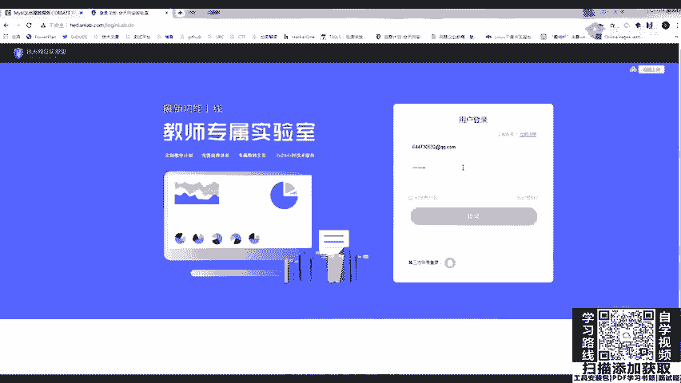

但是他这里呢又发起了一个账号密码的一个请求。它就叫pose请求。get跟pos请求的一个呃变化，就是唯一变化，就是get的一个请求参数在这个位置。pos在这个底下。然后cookie呢同样的很简单，就是。

之前给你们讲过字段嘛，STHTML的一个文件头。他那个注入产生在这个cookie这个位置。就叫cookie猪肉。然后还有一个叫headt投注入。No。有个叫headt投注。

他head头度呢就是出现在我这一个啊这个head头里面的任意一个字段。其实它就分类很简单，你们不用管这么多，它就是出现在哪个点，它就叫什么注入，出现在哪个位置。

然后注入的方式呢就会有一个回显注入盲注二次注入报括注入堆点注入宽子点注入一大堆一个东西啊。这里呢啊你们也首先了解有这个东西，我后面呢会一个一个给你们进行一个解释，就是他这个是什么意思，或者怎么操作。

后面的课程都会讲。我们接下来看。我们学斯可注路的一个。目标是不是为了找到4个猪入，对不对？然后我们来看一下它的一个原理。首先我们来把四颗柱的原理再来看一遍啊。四个猪肉的一个原理。就是因为我们的这个ID。

他没有进行一个过滤，然后就把这个s语句传到数据库里面了，进行一个执行，对不对？然后我们在呃玩这个数据库的时候，是不是发现一些问题啊？就是我这一个数据库语句稍微有一点问题，它都会给你报错，对不对？啊。

就是我稍微有一点写错的地方。比如说我这里少一个东西。稍微有一点点写错的地方，这个s客语句，那我数据库都会报错，对不对？Okay。然后你想一下，我这个数据库报错之后。那他会不会同样的呢？

同样的会把这个报错的一个形式返回给我们的一个客户端呢，以这个为例。

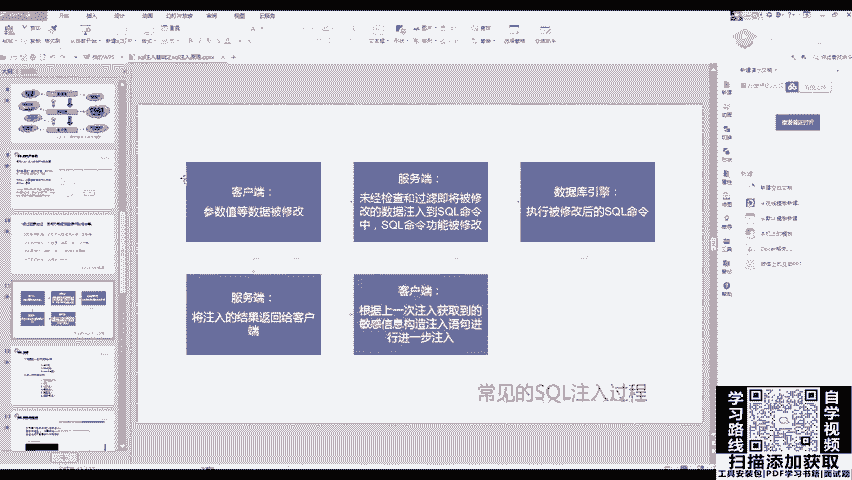

比如说我随便输入一个单引号。哎，他报错了。那就是不是说明我这个单引号代入到我这个思考语句里面去了，因为我只有代入到我s考语句里面，它才会报错。然后就导致了他这个s刻语句不完整，然后数据库报错。

这一步有没有不懂的，不懂的，现在马上敲，这一步一定要让你们理解。懂的扣个一，不懂的扣个2，好吧，还是。嗯，好啊，你们之前应该也是有进行一个预习的。也就是说我这个单引号肯定是带到我这个社Q语句里面去了。

那就说明这个位置有错，有4个注入，对不对？

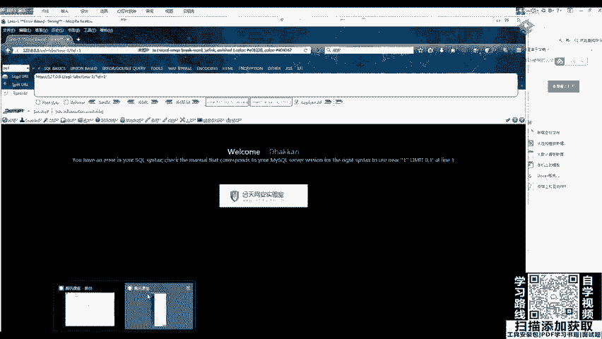

所以我输入单引号，让它报错，是不是就是一个检测色个注入的一个办法？对不对？给你们看哪个类型。这个网站呢呃不是靶场啊。是啊某一个比较隐秘某一个特殊的一个站。你可以看。

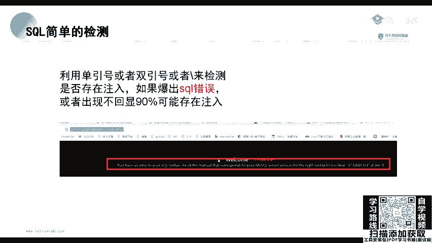

我输入单引号报错。然后或者我输入一个。反斜杠因为反斜杠有一个转移的意思嘛。就是让我这个符号失效。他也报错。那是不是然后我再输一个。A，他没有报错了，再加一个。他又报错了。

这里是不是就可以肯定我这里有一个四个猪入了。所以呢我们在测四和柱子的时候。最简单的办法就是。

我这里有一个参数啊，比如说我随便找一个位置啊。随便找一个地方，随便打开一个网站吧。嗯。随便搜搜什么呢？看看对吧。这边好个唱。啊，然后我这里呢就有一个抓包。爸妈在这里啊。

抓到的这里呢就会有一个就是我们点一个嘛，随便点一个。严个。机桶油。看一下请求。再点击随便点一下啊，加入购物车。获取广告成功fill uploadload。就例如这里呢我如果我输入一个单引号。

看它会不会报错。看到没有？他这里有防火墙啊。他这里有防火墙。我操。啊，我以我以为有4个猪入呢。我以为直接就这样注入了。没这么巧吧，对吧？就是如果我输入这个单引号，它这里呢报了一个错误。

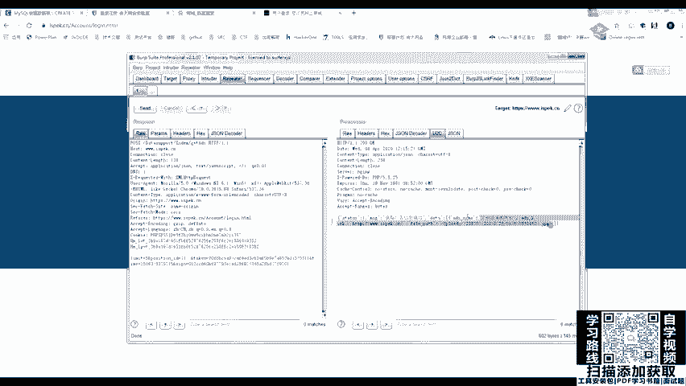

类似这样的。

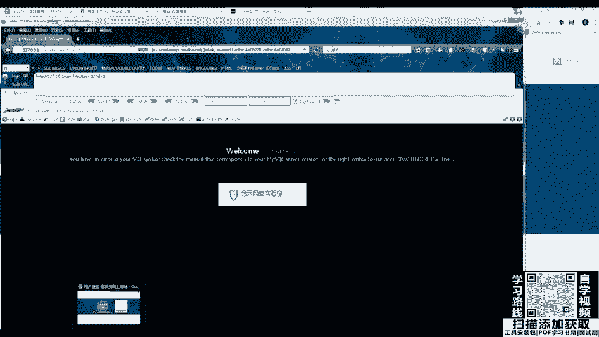

那我就可以肯定它有一个字的注入。所以我们在检测的时候呢呃。最简单的办法就是我遇到每一个点，我都去进行一个，我就随便加一个单引号进行一个判断。每一个请求我都去判断一下。手工注入就是这么麻烦。我。

好，然后我们继续看。啊，就还是以这个为例啊，我找到了这个石头猪入之后怎么办呢？怎么办？然后还有一个判断的一个例子啊。这里是啊真实存在的一个网站。给你们看。我首先第一个这是一个有回险的嘛。

你这里报了一个测个注入。他发生错误，这一点大家都知道，那我遇到忙助的时候怎么办呢？就是。大家看我这个输入呀。我这里啊是一条正常的超询语句，对不对？我在这个地方加一个单引号。

你有没有发现他这里发生了一个变化？那我再加一个单引号。有没有发现哎，跟字条一模一样。那这里是不是就可以说明一个问题？我加一个单引号，它报错了，然后我再加第二个单引号，它把s语句进行了个闭合。

然后他就回选正确。那他是不是也是存在一个私刻注入漏洞？这一步有没有不懂的？不懂的，马上扣个2。懂的话，你继续扣个一啊。What。你们这。居然全都懂了。那就好办了。那我们作为一个呃叫什么？

作为一个刚入门的黑客，找到漏洞还是要会利用的，对不对？首先这里呢啊还是给大家看一下，就是他注的一个位置，最多的其实就是一个参数值的一个位置，参数名位置啊啊就比如这些。我是我是很少遇到呀。

我遇到的更多的都是这个值的位置。试一下啊。没有什么用。唉，他们这个就有意思了，你看到没有？他们这一个输入单引号，它这里会进行一个拦截。但是我输入两个单引号，他也不能接，输入三个单引号，他也不能接。

他们这个写的有问题哇。那我们哪些地方会存在猪入呢？就是参数名cookie目录名、文具名一切都有可能吧。主要是看他那个程序怎么写。但是我们是一个黑盒测试啊。黑盒的话，我觉得要大家要讲究一个效率。

你就很简单，我就看到一个包，我就去摘个单引号测一下。有注入就有注入，没注入就算了，没注入就立马过。这个话我就不看了。然后那我们正常来说，怎么去获取一个。猪肉呢？主要有两个方式，第一个就是自动化。用工具。

自动化范围管效率高。但是呢它误报还有测试方法都很有限。第二个呢就是手工测试，它的一个优点就是测试方法灵活。缺点就是效率低，范围窄。然后根据水平而已。我给你们的建议呢就是。嗯，手工测试比较靠谱吧。

然后哦不对，测SRC手工注入比较靠谱，但是跑普通的这种站啊，比如说呃你们某个学校呀或者什么东西的AWBS会给你们机器，就跟你们说。当然啊你必须要在有授权的一个基础下才能进行一个渗透测试。不要搞事情。

然后我们就来看一下。我如何去找到一个猪入呢？

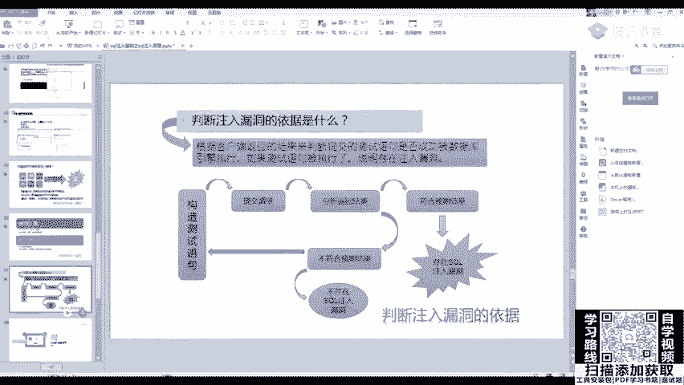

Okay。

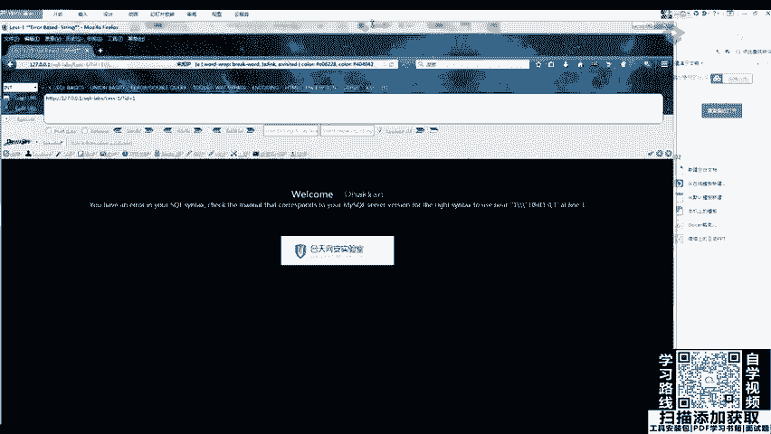

嗯，我记得有给你们有一个那个叫4期。

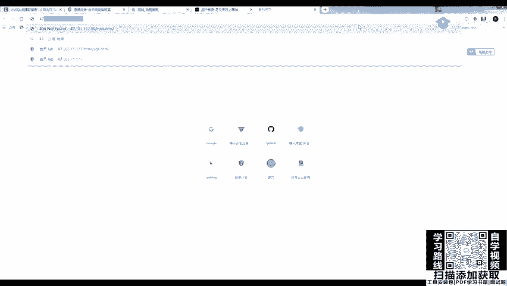

你们来打开这个地址。

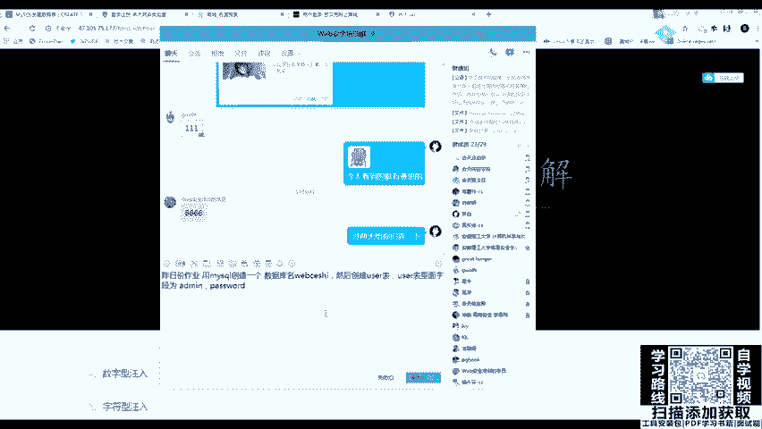

发群里面啊，打开这个地址。这里呢就有一个注的一个网站。当然这是一个练习网站了。我们做一个简单的一个判断吧。就像我刚刚教你的，如何手段进行手动进行个判断。比如说我输一个单引号。发错。我说个双引号。哦。

他这里是因为没有这个单引号的，所以不需要闭合。他就直接报错了。反正你记住书单引号或者其他的一个字符，它如果出现了这一条四个注路，就是s刻错误，什么东西什么东西。它就百分之百存在一个合合度。

记录是百分之百。百分之百是那个守住。那我们如何进行一个测试呢？待会儿讲。还是啊还是同样的，先看一下这一个漏洞依据。刚刚我也给你们讲了呀。好。他首先依据就是看你这个结果有没有成功被数据库隐擎执行。

因为我们知道嘛，只有srer语句，它不完整的时候才会报错。那我一个正常的一个微博程序，它的srer语句肯定是经过很多次测试的，百分之百是对的。只有在我。啊，只有在我这一个用户输入的这一个ID。

输入的这个参数的值。飞。这拼接到了这个四个语句里面。并且生效了。然后思那个思考数据库，它才会报错。所以说我这个构造测试语句就是我们刚刚的单引号，提交请求，然后分析一下它这个返回的结果。如果符合预期的。

就是存在它的思路。

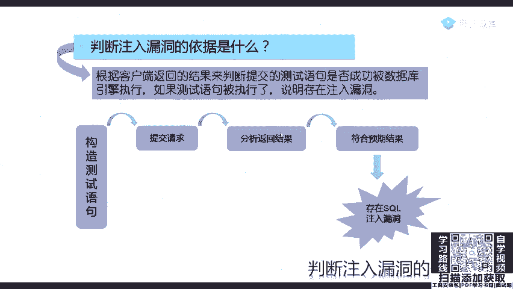

符合我们这一个报错，那就是一个不可注入。

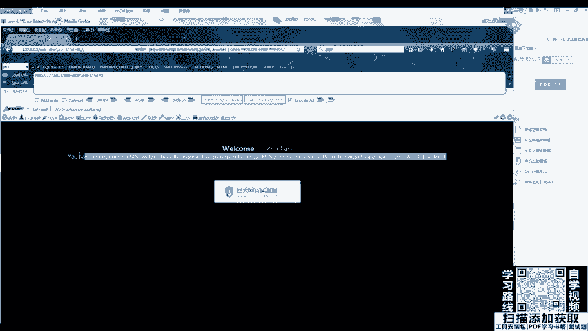

还是同样的，今天一个重点，那我怎么进行一个利用呢？就是一个整个的一个流程。大家来看啊。首先第一个用单引号报错有注入。这个是刚刚看到的。第二个就是运用一些逻辑语句，and一等于一或者and一等于2。

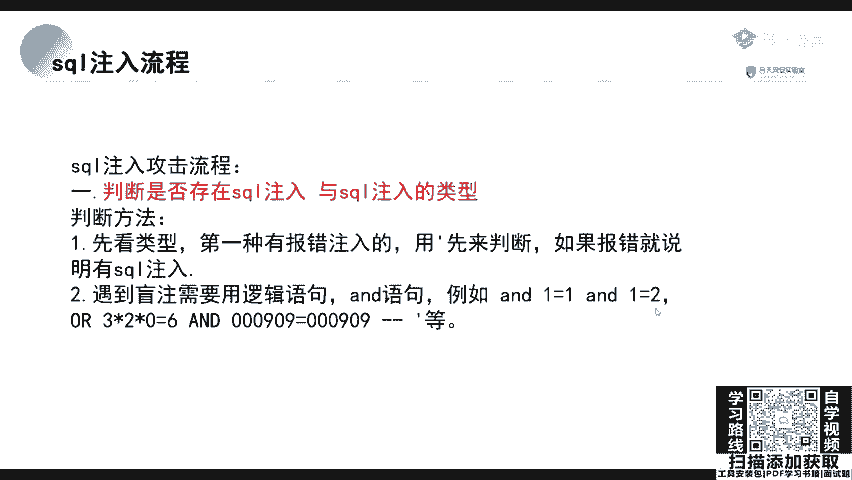

and一等于一是什么意思呢？我们再自己来看，还是同样的这一个。

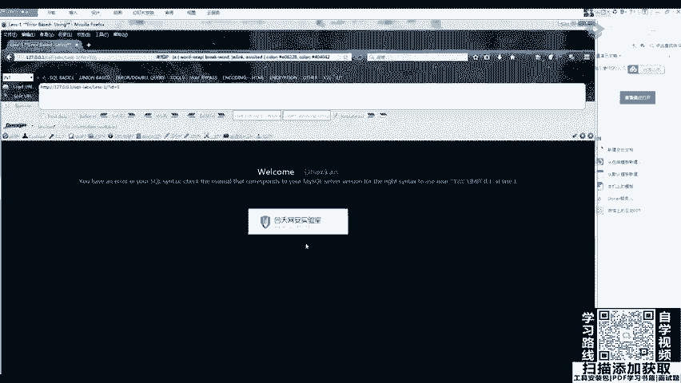

我们and啊，我们首先查询一下ID等于1。他自己呢是不是出了一串数值？我们and一等于1。加个23%啊，可以看它这里and一等于一，是不是没有一个变化？然后我们按一等于2呢。诶。

他是不是这里就没有出现一个数值了？这里是为什么有人知道吗？有人知道的话，在上面呃敲一下。对了的，我给稍微给点福利，到时候。为什么？对，and一等于1and一等于2。就是因为一等于2是错误的。对。

一等于二是错误的。那你想一下，还记得我第一节课给你们讲的吗？and他是。真啊。真。And。他才是返返回帧。对。一甲几甲，没错。待会儿啊上完课给你们稍微给你们一点点福利。😊。

所以呢这里呢就是不是肯定可以说明我这里有一个。N一等于2。他被执行了，反正呢就是。要在数据库里面执行这一个逻辑语句，它才会有这样的一个结果，对不对？要在数据库逻辑语句里面。然后类似这种and啊。

0酒啊什么什么东西相乘了，这种都是为了绕wa啊，就是不常见的。

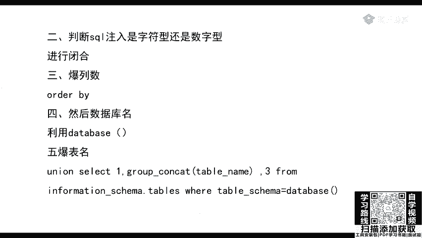

好，我们判断了一个。注入之后还是用这个sK level来进行一个算。我们首先判断了一个。错误之后。啊，我们是不是要进行一个闭合呀？你们在学叉S的时候，是不是也学过，就是我要先闭合前面那个标签。

我后面的叉SS语句，它才可以进行一个执行。对不对？那我设个注入同样的，我要先对前面的一个语句进行一个闭合。

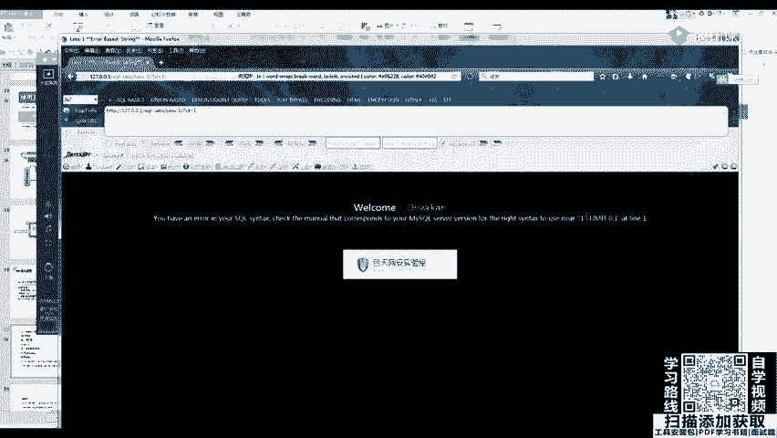

我们来看这个语句是什么样子的。

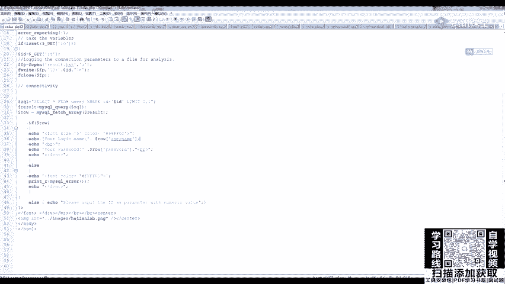

我这个语句呢，我这个ID是不是前面有一个单引号？

那我这里呢是不是要加一个单引号？

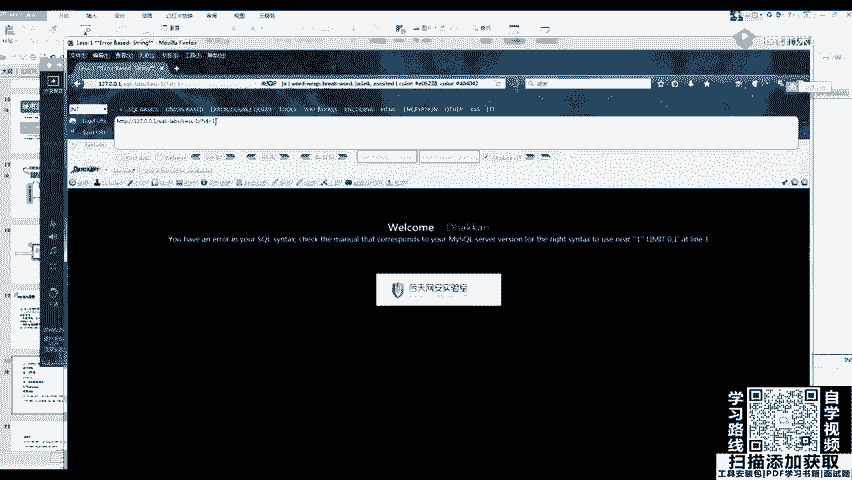

跟前面的进行一个闭合。

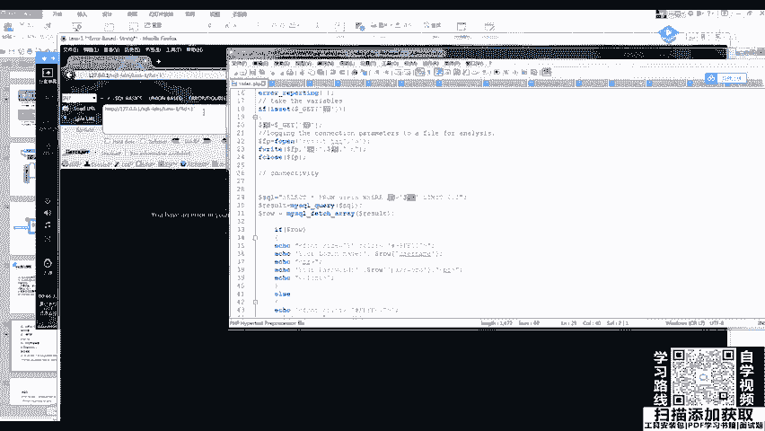

然后我再good by。3。加1个23%，就是我们的一个井号。

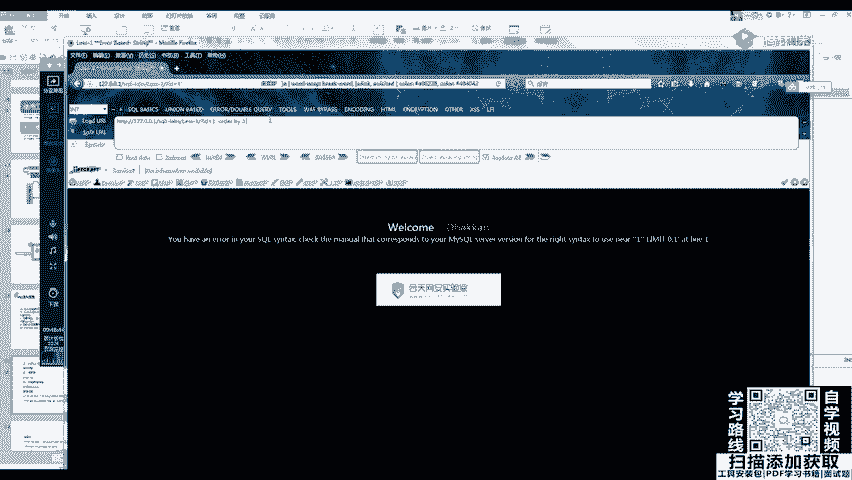

我们来组合一下。那他的这个语句是不是就变成了一个这样的一个语句？我们传到这个程序里面，它程序就变成一个这样的一个语句，对吧？那它就会执行前面这一个ID等于一，然后后面就old by3，这里呢是一个。

还记得跟你们讲吧，我就是跟你们说这一个省略的一个注视符，一定要知道。这个注释符的意思就是后面这条语句都没有用了，后面这一条语句。直接就消失了，没有用。那他是不是就变成了一个这样的一个语句？

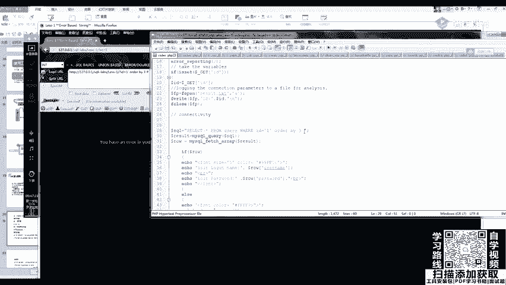

go拜翻。嗯，等一下啊。这里。因为有个处理的个过程，得用百分号。那他是不是就是成这样old的 by3。

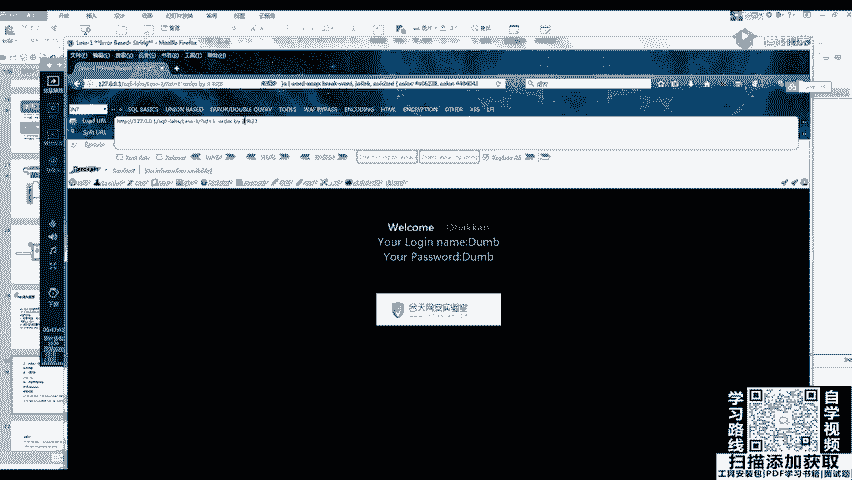

那我然后go by4。是不是就后面变成了一个。

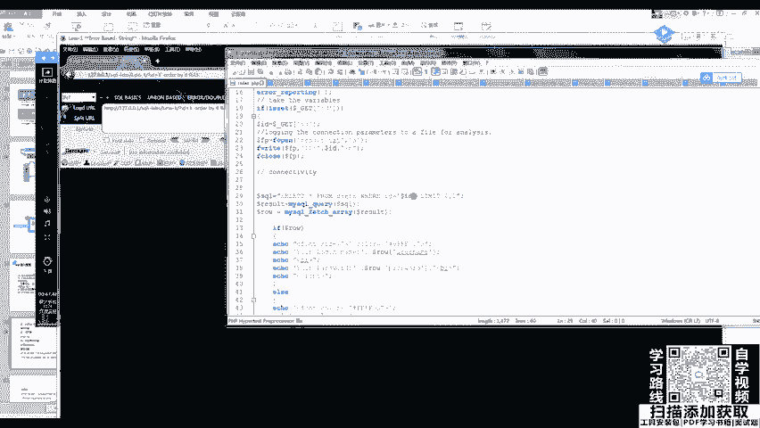

因为它只有三列嘛，我昨天给大家讲过old by是查它当前的这个表有几列。


他这里有三列，然后就进行了一个报错。然后呢，我们再查询一个。表就是我要查询我这个当前的这个表。当前这个数据库的这个表是什么样子的？首先我们来看之前说过这个。


that base是一个表的一个名字。啊，还是同样的呀，这里我给大家看一下old buy3，你先记住流程，old buy3正确。我的拜4。错误。然后呢，你就在这个地方输入。联合插询距123。

输入联合插序句123。嗯，前面要用个负一啊。为什么要用负一呢？首先我给大家解释一下，这里必须要给你们解释。


啊，首先你要知道。我如果是执行一个。ID等于1。然后加上一个联联合查询的UNIN123。那他是不是会有两个结果？Yeah。啊，我还是用我的那个。may cut给大家看一下。他这里呢是U表。进行一个查询。

好，我们。我们进行一个查询啊。啊，按照他的一个语句。不状ID等于。然后。来玩。一。嗯。然后后面一个井号。再带上这一块。最后的句子是不是就是这样子的？我们运行一下。啊，是不是可以发现这里呢有两行数据啊。

就是他查询了两行数据。对不对？但是为什么我这里呢只显示这个D前面这一行呢？只显示这个数据呢。那是因为。我这里写的就是ele一个ro点username。他只能显示一行，懂吗？

就是我这个vivo程序的显示位只有一行，那我查新了两个数据，我也只会把最前面的这一行显示给大家。那我查询一个ID等于负1呢，因为我负一不存在，所以呢我这里呢就是变成了ID123。那我这里加个负一。

这呢就变成了ID2ID3。自己能理解吧，能理解的话继续扣个一。马云要考试，溜了溜了。它就是因为vivo的这个显示位只能显示一位啊。嗯，好。如果还有不理解的，你们可以在QQ群问我。

或者啊在群里面进行大家进行一个讨论。进行一个讨论。这里呢就是二跟3。那我们尝试一下，把这个二变成一个。Sap。在不白？就是查询我们的一个。数据库的一个名字。


那它这里呢是不是就会显示这个数据库的名字，然后我这里的二，我在这里把二改成。盖了呗。那我这里是不是数据库的名字就这样出来了？对不对？


所以呢它是个注入的一个简单的一个过程就这样。那我们再来查它的一个表。


呃，我们哎直接哭吧，懒得敲了。这样我给大家来解释一下这个句子。


嗯，还是在这里来进行一个执行。


啊。好。大家看一下这个句子啊。为什么我这里要用这一个。啊。你有一个错误。


哎，他不能跳出去吗？W you Sir。啊，这里少了一个联合查询。我们首先来看一下啊。我们首先来看一下这个句子呢在这里面执行是什么意思啊？然后还有一个这个g content有什么用？


我们首先来看。group con呢，它就会把我这个table的这一个表的名字全部给它列出来。我把它去掉试一下啊。Okay。


我把它去掉。我把它去掉，它这里是不是就变为了一个四行，对不对？就是我不加这一个group content，它就是变为了四行。


我刚刚给大家讲了，他这个vi博的显示位只有一行。


所以呢。我这里呢。不加，我只能查到它的一个表，我只能查到它的第一个表，这是email这个表。那我加一个。


gme content，你们来看一下它的一个查询语句。


他就会把所有的表都进行一个输出。所以呢它的第二步就是查我们的一个表。因为我们开始数据库已经查了，然后数据库查完就是查表。


然后呢，你看你觉得哪一个表啊有比较有可能性啊，就是有敏感信息，肯定就是我们的一个user表，对不对？


那我们接下来就是查这个user表里面的一个列。


啊，我们来看一下这个语句。查询这一个。列的这个名字。在昨天昨天我让你们理解的这一个m的一个大表。然后where这个table等于这个user，就是查这个user这一个表里面的一个列。我们看一下。

那他是不是这里就把我们的一个。列他给查出来了。


因为这个列比较嗯那个呀。还是同样的给你们在这上面看。


い。Oh。


嗯。就是这个结果，这个列我们通过这个n cut看一下我们的一个us势表啊。预测表你可以看它有数据的，其实就这几条。但是呢我们的一个列嗯。我们查一下他的。一个呀。

ID user name password word。


嗯。他这个怎么啊有这么多东西啊。


他这个列。正常来说不就啊，这是他。嗯，他只有三个列啊，那为什么我这里查出这么多东西呢？


有点奇怪哦。


啊，反正到时候时间略过，待会儿我再看一下这里呢我们肯定要看的就是这里两个东西。


第一个。看一下源码。ID passwordword。这样就是us name跟password。话说他这一个。列的东西有点多呀。


我都感觉我是不是哪个地方查错了嘛？哦，我想起来了。😮，看见了想起来了。等一下啊。因为我有很多叫优表的这个东西啊。就是我的数据库里面不只有这个user的一个表呀。我的数据库可能跟你们不太一样。

我有很多很多的一个数据库。不是不是这个表，而是我我电脑里面有很多的这个数据库。好嘛。因为我这是一张大表，大家懂吧？这是一张大表。然后我那张大表里面呢有很。罗教us斯的一张表。

就是我其他数据库里面也有一张。相同的名字。然后他就查询出了这么多的一个东西。


啊，我们用这个的话就简单明了嘛。


我那一个。我卖个东西太多了。


比较尴尬。负一，然后用这个在线的。你可以看这呢就是IBUpasword。我才相信我数据库里面奇奇怪怪的东西太多了呀。啊，你可能可能看我这里呢里面也会有一个us式的一个表。或者。哪里去了呀？反正就。

因为我的库里面东西比较多呀。正常来说，你们看到的应该是ID绿name怕错的。


然后后面就更好查了呀。


正好查了。那我是不是就查一下我这个值就可以了，就是us name password word的这个值用user。


然后就可以查到我这一个。

查到我这个表的一个信息。然后我这个预思词表里面的一个账号密码是不是就查出来了？


那你如如果你想一下我这些个正常的一个网站。正常的一个用户登录网站。那我把它us里面的一个表给它查出来了。例如这是一个addmin用户。啊，然后我就得 the命得 the命直接登进去。

那是不是就成了他这个网站的管理员了？假如啊这是假如。那我如果成为了一个。啊，加个table设置。对。


嗯。

我查了其他数据库的一个表。啊，我看一下啊。对，然后再加一个条件就可以了。就是我再加一个条件。哦，我再加一个条件，就是我这一个叫什么去啊？


啊，再加一个那个。再加一个那个叫什么着啊，再加一个那个数据库，数据库等于当前的这个db，那我就可以进行一个查询了。待会儿给你们看一下。

那我这样的话，一整套的一个流程它就走下来了。我们再来回顾一下啊。首先第一个判断一个s可注入点。然后第二个就是判断它的一个字符还是数字，其实就是进行一个闭合，把我这个4K语句进行一个闭合。

第三步开始就是正式的一个。查询。al by把它的列数报出来。然后用d base。把它的一个数据库名字给报出来。然后第五个就是把它的一个表的名字给报出来，用这个东西查询。Okay。

第五个呢就是进行一个爆裂。啊，他这个。

的话。看一下啊。不か不か。不要太 nice。主要是你那里面东西太多喽。


贝尔V尔好像是可以加两个贝尔吧，看一下啊。


你好。And。


아 뭐。O。你看。我加了一个条件。这样的一个当前数据库的一个条件。我如果过多，那我就再加一个条件嘛，我多加几个条件进行一个判断就可以了。嗯。这个能理解吗？能理解的话，你扣个一，待会儿啊。


我们再用这个东西进行一个演示。你就假如说假设这是一个网站，这是一个网站。然后呢。这是一个靶场，就是我们的一个网站。那我输入一个叹号。好，他报错了，那我知道他这里有个4个4个注入。然后其实你可以看了。

就是我不看这条s客语句啊，你可以看到这个sk错误里面。它会返回你这一个错误的地方。就是它会返回你这一个位置。你哪个地方错了？就例如这里我多了一个单引号。那你有没有发现他这个错误就是。

我这个单引号没有进行一个闭合，因为这边多了一个单引号嘛，这边没有一个闭合的，对不对？我再加一个。哎，这边三个单引号，这边还是没有闭合的。那我是不是就不要打引号？你从这个语句里面就能看出来。

那我知道注入之后好，我这个不需要闭合，然后我就go the back。烦。old by3没有报错。我是拜事。他报错了。然后我这个地方。🎼是不是就输入我们的联合查询？23。这里呢跟你们说了。

就是一个显示位的一个问题，我加个负一。这里呢就变成了2跟3。然后呢，我就开始进行一个查询。它的一个库名叫什么名字？正常来说我都不需要查呀，因为这一个db。这个可以代替它的一个数据库名。Oh。Yeah。

它这个可以代替它的一个数据库明。可以看到我们的这个数据库名呢就叫和田n。然后呢，我们又开始进行一个查询，查完数据库呢，是不是就要开始查表了，对不对？他表就是。50了。直接哭吧。他表呢你可以看。

就是我们的一个table name，然后呢就去这个information这个大表里面进行一个查。这个30%号23%就是你们记住啊。这个23%或者减点空格，这个一定要有一个习惯性的一个动作啊。

就是我一定要带上。注释符不管它有没有一个，后面有没有语句。然后23%23%其实就是井号呀。一定要有一个习惯，就是我自己给它带上去。报完表嘛，就还是爆裂。跟刚刚的一样。昨天的语句还记得吧？

如果昨天语句不记得，你们就。啊，反正就练把这三个语句给记好，你如果会了这三个语句，你sQ注入后面我讲的所有的scle注入都是围绕这几个语句，都是围绕这三个语句来的。Yeah。也就是说。

s客猪如果你理解这三个语句，我就可以把所有的色客猪一个原理啊，包括其他的我都给你们讲通。全部都能理解。待会儿课后作业我会给你们布置。就是啊你记住是什么样的一个理解呢？就是。包括我每一条。

每一条语句它比如说我这个grop come cat是干嘛用的，我这个负重是干嘛用的？然后我这一个啊为什么要这样做？如果你能理解的话，整个4个柱都通了。待尔的后面给你们看。

所以呢我们的一个设个注入过程就是这样。判断，然后。闭合爆裂爆库名爆表明。报列名报值。跟我们数据库的那个表的结构是一样的，我是数据库，然后数据库底下有表，表底下有列，列底下有数值。

所以说它的一个原理就是这样，还有一个利用过程。再总结一下。数据库的一个四个注入原理，就是因为把我们这个带入的位置。就是程序没有写的好，把我们的一个插叙语句直接变成了s语句进行一个执行。然后过程就是这样。

好，今天的课程呢呃就是到这了，待会儿下课我会把这个PPT发给你们，然后会给你们一点实力吧，实力给你们做。然后今天来个课后作业。就是把我的这个。把这个网站的设置注入给我做出来。

照着我PPT上面的步骤做就OK了。然后理解每一步是什么意思？大家记得交文档给班主任。好，今天课程就到这儿，待会儿下完播给你们发点小福利。嗯。还有一分钟，稍微等一下。好。开始今天的一个课程讲解。

今天呢要给大家讲的是一个刺Q的联合查询跟一个报错入。我们来看一下。今天的一个内容啊，今天其实我在后面呢还加了一个宽字节注入。因为我觉得呃你们昨天弄了这个联合查询之后。沿河山巡有居之后嗯。

后面的报错注入呀，还有一个。宽字节注入都可以很快的理解。所以我就今天加了一点内容。我们来看一下科客的一个联合查询。是什么样子的？ということ。呃，还是同样的。昨天也是提过了这个呢ser是如何产生的？

就是从这个搜索的一个代码来看嘛。昨天都给你们详细的讲过了。就是因为我们的这个ID传入，它没有一个很好的很好的进行一个。叫什么？就这个地方没有过滤吧，就是过滤不严格。

然后导致这个传入的一个参数就直接变成了一个色色语句进行一个查询。这一点大家一定要记住啊，就是万变不离其宗。你所有的注入都是一样的一个原理，包括所有的漏洞，懂吗？就这样就这样给你们说。

所有的漏洞都是因为它这一个输入点过滤的不完整。或者就是没有考虑的那么就是没有考虑的那么周全嘛，所以他就会有一个漏洞的存在。好，我们来继续来看一下。这一关呢其实跟你们呃昨天的那个课后作业是一模一样的呀。

所以呢，联合查询据就是什么？粘合差去语句。嗯。啊，我们还是先看这个内容吧，行吗？还是你永远都记住这几个步骤就可以了。第一个就是先加一个单引号，判断有没有一个报错。然后再加一个单引号。看了。

加先加一个单引号，看会不会报错。然后再加一个代引号，它又正确，这就说明肯定会有一个四个注入。然后呢，第二个就是wood by进行一个列的一个爆裂。or buy3what buy4正确。

就是证明它只有三列。这个呢也是前面两节课都讲过了的，我就不会这么详细的给大家进行一个一一的解释了。看两节天应该讲的很详细了吧。这个。然后呢。第三步就是我们刚刚是old by成诺3嘛，所以就是。

这一条就是联合查询。系嘛。这个UNIN再加一个let。就是一个联合查询。也就是说联合插去语句，就是你可以使用这一个调语句。可以使用这条语句，它就将联合查询。没有啊没有什么一个特别多的一个含义啊。呃。

然后呢。这里呢是给你们解释一个vivo的一个显示位的一个原因。昨天也讲了，就是vivo呢，它这里一个e，它显示呢只会。显示这个第二列跟第三列。看到没有？就是那样pasword。因为它这里对应的是。

就是那样 passwords word就是对应的这个mys里面的一个值。所以它这里显示的就是二跟3，全部是看他的一个代码怎么写的。呃，到这一步有没有不理解的呀？就是你们不懂的，不懂的话，你就扣个2。

好吧，不懂的话扣个2。给你们啊一个10秒钟的时间。Okay。嗯，好，应该基本都懂吧。我觉得我昨天那节课讲的可讲的应该是比较的一个详细了呀。这里呢就是你们昨昨天的一个家庭作业啊，就是课后作业。

大家应该自己都做过了。这里呢还是同样的。你们一定要记住呀。这条句子的一个意思。这几条句子的一个意思啊，如果你就是对这一个色个注入的一个流程里面的一个语句。得一个意思。不明白的你们就扣个一出来。

我就再我再仔细的给你们讲一遍。一定要你们一定要把这几条语句给它搞懂。有没有不会的？就是啊你觉得觉得我不用讲了，你就扣个一，要讲的你就扣个2。呃，其他同学。其他同学呃要需要啊需要重新讲一遍吗？

虽然你们四个扣的一啊，行，有疑问。你你先给我提出来，就是你哪个地方有疑问，哪一个位置。啊，马上有4个。啊，我继续再快速的过一遍，好吧。就是因为有一个同学有疑问，我就再快速的过一遍。

你们也稍微啊加深一下印象。没对。啊，我首先要问啊首先要问的是你是对判断四个注入不理解呢？哦，你你是说这个desb换成一个报出来的库名，对不对？뭐。好，这里呢是因为。我这一个danceb。

跟这一个数据库的这个名字是一样的，你懂吧？跟数据库的名字是一样的，就是my circle的这个里面，我这个db是可以代替这一个它的这个本身的一个库的。就是你填两个都可以，你两个都可以用。好嘛。

就是我如果填这一个desb，这个代替的，我就不需要加一个双引号，我给你们看一下啊。


我给你们看一下。嗯，还是用这个给你们讲，好吧。好，你看你看我这一个的查询结果。我这条语句在这个地方加这个db的一个语句，是一个这样的一个结果，对不对？哎，他的一个库名是多少去了？

这里我先看一下它的一个库名啊。它的库名是和田nbel，对不对？那我们把这个地方改为客le。就是我这里一个。单引号和心le。后面得到的一个查询结果是一样的。就是因为des就是等于。跟当前的数据库是相等的。

2。好嘛。就是他跟当前的数据库名是一样的。所以你这个呃。这个应该就不用说了。这里我只是看你的一个个人习惯吧，我个人习惯是用这样。就你不要跟着我老师的一个思路，就是卡死在这儿。啊。

就是你自己要有自己的一个想法。对。还有没有不理解的所位同学。Yeah。Yeah。诶。어。好，其他同学也可以说啊，就是不知道的也没事啊，这个是很正常的。我当时我自己学这个之路，我自学我也学了挺久的。

当时我们当时那个呃网上的一个教程，他们是一个s课过程，就是给他给你们有一个星期的一个ser的一个课程，一个星期吧，整整一个星期。我是因为把我的一个理解给你们讲了，所以我这个课程会过的比较少。

就是不像他们那样，一整个星期整个星期这样。实际是个猪入的话，要学的东西有很多啊，因为它有一整本书，你们如果读大学的，知道有一本就是你们那个TCPIP还是什么去，就是有一大本书。

一一本砖头书特别厚的四合猪入，专门讲四合猪入的，也有一本这么大的一本书。想要深入的理解，可以去看。啊，然后我们再来看一下，就是你们要记住啊。这三个。这三个函数。是需要你们稍微记住的。

这三个是需要你们自己记住的一个。首先我们看一下一个语法，conact。它这里呢就是一个usname password。就是一个查询嘛，查询user里面的。但是呢我这里加了一个逗号。

你们可以看到它的一个查询结果，这里呢就边上有个逗号。然后concastWS的话也跟这个是基本上是一样的。可以看一下。只不过呢它的一个用法呢就是。他这个前面的这个符号在这个前面。

把多个字符串连成一个字符串，但是可以一次性的指定这个分隔符。然后这一个group come你们应该也用的比较多了。就是把所有的数据都连成。啊，就是都连成一个值吧。

就是我把这个分组里面的值全部都给它连起来。这个是需要记住的呀，就是没有什么其他的一个理由，就是你们要记住。然后我们在这里进行一个跳过这里的查看表里面的列。查看列里面的内容，这些呢应该是都会了。

然后就来到今天的一个重点了。本来我是想今天讲sick map的，但是后来把课程推了一下吧，就是先把报酬注入跟快速节注入给你们讲完，明天的话就教你们一个s map。首先我们来看一下什么叫暴错助入。

报数注入呢就是通过特殊函数的错误使用，并且使其输出错误结果来获得一个信息的。遇到有报错回险的时候，但是没有数据回显的时候，可以利用。这一关是什么意思呢？就是什么时候要用到报错输入呢？啊。

我举个例子啊我举个例子。这里好像就有一个bost注入吧。我给你们举一个例子。看一下有没有报错猪。这个布尔盲度是。哦，这里没有包头住。我看一下啊。而是用我本地的一个环境来给你们看一下吧。

他这里因面没有报酬注入啊。但是。报s注入是什么意思？就是例如我们在判断数据库啊，在判断一个。叫什么东西是吧？在判断。这个中路的时候。我们输入一个单引号，它是不是会输出这一串错误，对不对？

就是这里有一串报错的一个信息。嗯，我看下片别 study。뭐 다。真实场景的话呃，我待会儿下完课，我给你们看一个真实场景啊，就是把那个地址发给你们，给你们看一个真实场景。好，首先我们来看一个。


哦，我这开了BP的。应该是第五关吧。Okay。并不予议。好，就是这样啊，你比如说你看这个棺材啊，就是呃比如说我输入ID等于一是没有一个输出的，对不对？


然后我输入一个。单引号。然后呢。他这里就发生了一个报错。No。但是我继续如果我比如说我像第一关一样，我像第一关一样。进行一个。比如说这里一个UI文。就是进行一个联合查询。是不是可以看到。

他这里呢是没有一个。他这里呢是没有一个回险的，对不对？Yeah。所以说呢在这种没有回险，我们进行联合查询没有回险。但是呢。我这里又有报错的情况下。我又有报错信息的输出报错信息输出的一个情况下。

那就是一个那就是可以执行一个报酬注入。


它的一个重点就在这里，为什么要分报错注入跟你一个普通的注入呢？为什么不直接用盲柱呢？因为就是一个。四个注入的一个快速吧，就待会儿给你们讲盲助就知道，你要记住盲助是非常非常慢的一种注入。

就是不像我们随便输几条语句查询就可以出来了。是非常大的一个区别。然后报酬注入呢有很多的一个函数，主要是讲这两个。嗯。就是大概有十几个函数，十几个都可以用。但是我们常用的还是这两个。

通过参面文档的一个信息，它这个原理呢就是当它的一个参数不正确的时候，而产生错误，就会返回一个参数的一个信息。然后你要想这个参数呢是我们可以自己。设置的。那我把这个参数设为一个查询语句。

比如说是查询数据库的一个名字。那这个参数，然后构造的时候，把这个参数的格式改为一个不正确的。然后产生错误就会返回这个数据库查询那个语句。这两个。然后你们想了解更多的，我这里呢列了一个。

报速注入的一个速查表。어。也就是。很多种吧很多种al住的一个素差表。我待会下课能会把PPT发给你们，你们根据这个表去进行一个查询就可以了。今天就开始一个正式的一个课程。报速注入的一个利用。你们要记住啊。

这两个函数呢，它的一个适用版本是5。1。5以上。然后呢，它的一个错误用法就是在这个前后添加一个。这个叫什么号去了？诶。这叫不浪。哎，忘记叫什么了。我们来看一下，我们来看一下它的一个语法。

语法治理你可以暂时就是先省略掉。它主要报错呢就是通过这个第二个函数进行一个报错。你看这里这个拍lo的。对，我也不知道，反正就是播了。😊，好，然后我给大家看一下，就是你们要知道一点点的一个编码知识。

这个0X7呢。응。他这个0X7就是这个波浪号的一个编码。아。你看它的一个has编码。就是这个波浪号。我们把这一个就是添加试啊试一下，好吧，就是看一下效果它有什么用。

Yeah。呃，可能查user的话，你们可能不太清楚。看一下效果。おと？从这里是不是可以看出来。我这一个查询语句它生效了，因为他把这个数据库的一个名字给报出来了。

那我就给你们开始讲为什么会把这个数据库的一个名字给报出来。


。嗯，首先第一个你要看它的一个。参数我前面的一个解释。就是在对参参ML文档进行一个查询的一个函数。当参数的格式不正确的时候，还产生一个错误，就会返回参数的一个信息。那它的参数是哪一个呢？

参数呢他这个参数就是。这个叉PAATS。还有。那这里的。我们看一下我们的格式啊，这个叉ML这里是一，然后这个6这里又是一个一。那我这一个叉PAATS是不是就是我这个conact？0X7。

然后还有一个sus0X7。对不对？那我的参数就是这个。那在报错的时候，就会把我这一个参数给它返回。那我们具体应该怎么操作呢？这一个呢语法也是一模一样的呀。你们先记住这两个参数，就是这两个用法。

我接下来给大家看一个效果。这个你们不要背呀，就是不要死记硬背。你反正就觉得就是我在这个地方执行操作，它可以进行一个返回。也就说我只要我只要这整个语句，我只要在这个地方修改就可以了。

然后我们看一下后面的语句啊。首先呃这里的测个报错的话。先给大家看一下它的一个包库的一个名字啊。어。这里的desb的话。嗯，这里我是写的比较简便啊，所以直接写了个db，它也是可以报出来的。

因为我之前说过嘛，这个dabb跟我们的一个数据库名是相等的，对不对？然后他报错就把这一个数据库的一个值给显示出来了。我们接下来重点了。是看他报表的一个拍lo的。来看一下。啊。

就是你们首先这里是一个and，然后是我们刚刚的这一个XML的一个函数，对不对？然后这里一个一就是刚刚的一个参数。然后这个concact一直到这里一个大啊，一直到这个地方。一个大括号完结。

到这里就是我们的第二个参数。因为两个用法是不一样的呀，您可以看到。嗯。点开看这个参数。他这里呢只有两个只有两个参数，前面这个阿 date有3个参数。这里只有两个参数。


好，我们一条语句一条语句的来分析。首先这里呢是一个一。然后这里呢conact。这里0X7就是我们的这个。啊，波浪波浪线吧，应该是叫波浪线。然后这里0S7就是一个波浪线。

那中间这一条语句大家是不是觉得很熟悉啊？是不是我们的那一个联合查询语句里面的查询表明的一条语句？that group contact table name from。

这一条是不是就是我们查询表明的一个语句？然后呢，他就利用这个报错，把这一条语句。え？也形成一个执行，然后返回。到这一步啊，不理解的，你扣个2，理解的扣个一。喂。呃，就你一个理解的吗？呃。

为什么参没有报错，代入到srcle语句里面进行的一个查询？啊，首先你要首先我们理解这样的首先这这样的一个理解啊。啊，我们这一个整条句子，我们这整条语句是不是会带入到这个。


是不是会带入到我们的数据库里面进行一个执行？对不对？那我设个数据库语句，它执行的话就是。他会先执行我们的这一条这样的一个查询语句就是。先把他的。就先把这个括号的值给查出来，大家懂吧？

就像你做加减乘除的时候，我首先算的我是算括号里面的一个值，对不对？所以呢他就要先把这最里面的括号这一个语句进行一个执行。然后执行了之后，就会变为我们的一个这个参ML函数的一个参数。到这样这里可以理解吗？

理解的话，你们还是继续扣个一，不理解就扣个2。呃，其他同学也稍微做点反应啊啊。😊，哦。어。嗯。5位。그。嗯，好。然后。有疑问的就赶紧提啊，有疑问就赶紧提。


你首你首先我们还是首先的是。理解他为什么会。啊，为什么会返回这个东西？然后在为什么我们要执行这样的一条语句？这些语句就是都跟前面的联合查询是一模一样的，也就是昨天教你们的。他的意思是一模一样的。


啊，那既然这样就是我们利用的这一条语句，这样是进行一个。我们利用的这样的一条报酬语句是进行一个查询表明。那你们剩下的一个库名能推出来吗？就是。啊，列名怎么把这个列给报出来，能推出来吗？嗯。啊，能推出来。

就是你先说思路吧，你们知道思路的就在公屏上扣一下。要知道一个举一反三啊。그。对，改这个查询语句。还是还是继续回到原理，就是。


他这里会把参数不正确的格式。啊，它就会参数格式不正确的时候，就会返回这个参数的信息。那我们刚刚的这个参数，刚刚这个查询表的参数。是不是就是一个这样的一个参数，concat。然后呢，我这个地方是。

上次那个联合查询语句进行。查询表明的一个语句。那我把这一个查询表明的语句改为一个查询列名的语句。那它这底下的错误是不是就会返回我们的一个列？这张表里面的一个列。我们来看一下啊。


我们来看一下。爆裂。


暴裂了，他就是把。我标红一下，应该有个画板吧。关闭。暴裂呢就是把这个地方。这个地方的这里这个地方的字条语句。这条查询表的语句改为查询列的语句。我的手有点抖，所以画线不好看，你们不要介意。Okay。


好。我们来看这个包裂。你看一下我们爆裂的这个语句是什么样子的。Letter。G contact。또。这里是不是就是查询这个uson里面的一个列？是不是跟哦是不是跟我们之前的那一个叫什么去了？给我们。

之前的那个联克查询是一模一样的这条语靴。还有印象吗？那接下来的改值，那是不是也可以这样进行一个力推？Okay。嗯。他这个画板的这个功能有点。有点点小坑。


那我们就来演示一下吧，就是。来演示一下还是。嗯，用哪个东西来演示呢？


还是用之前给你们的这个网站来进行一个演示。实操实操的话是体验啊。实操的话就可以加上里面体验吧，应该说是。首先我把这些语句。也是我把这些语句都给你们扩ll上去。有。报库报表。然后爆裂。

当然我有可能中间有哪个东西打错了，也不一定啊。


好，我们首先还是来看。好，我们最开始的第一关。我们的一个查询语句是怎么样的？我们的查询语据是。M。Lettter耳机。我们上一节课的一个查询库的一个语句。嗯。嗯。哦，没有加那个。没有闭合。

我们上一节课学的一个四个注入语句，大家都知道吧？你这里呢基本上可以不看，就是st database。那我们来看今天的一个报酬注入的一个社客语句是什么样子。


ID等于一啊，这个肥呀。あやって。这里第一关。嗯。それさ？Compact。比他。好。


我们看一下。这个报错语句。


用户用这个吧用这个吧。能估计。有这个UIL编码。太饿了很难受。好，这一条语句就是我。这个db。当然你也可以这样写，就是side。那打括好了。好，首先这第一个爆库的这个语句。

就是因为我这第二个参数是查询它这个db。到这一步懂的扣个一。嗯，好。那第二部。第二步，我们是不是就要爆裂？


那我们就把呃上一步的一个查询语句，因为我们上一步的一个。查询这个表的一个语句是这样的吗？就是。我还是夸到自己来。group can have pro，然后后面一串一大串。

然后我这里呢就把我的这个表给查出来了，对不对？那我把这个查表的这一串语句呢。


然后copy到这个里面来。后别到这个位置来。会会到这个位置的？就是包头猪的这个位置来。と。然后就会发现。是不是查询到的一个结果是一样的呀？得到的一个效果。


那我爆裂，那就更简单了呀。啊，我爆裂之前也是一个st cat。这里呢是查我这个us表里面的一个列。どうど。这里我之前跟你们说过了，是因为我这里面的一个us表有点多。然后我继续了。

我还是把这条语句扩到这个报错语句句里面来。


进行一个查询，是不是也是得到的结果是一样的。那我后那我后面的差值。还有包括呃查它的一个值。是不是也跟我这一个就是也也跟我昨天的那一个。叫什么跟我昨天的一个联合查询语就是一样的。这样一步一步下来的。啊。

这样报酬注你应该懂了吧，懂了的话，你扣个一。不懂的话，你就把不懂的打到公屏上。啊。嗯。啊。五黑。还有一个月啊。哦，好。来晚啦。嗯啊。行你待待会儿回去复习那写啊。😊，呃，就是你反正记住啊，一定要举一反三。

包括后面的盲柱也是一样的，都是一样的原理。你记住这个原理。


然后呢，这里有一点要注意的是，就是这个报速注入，它的一个返回啊，它有一个返回的一个限定。


我把这张表发到群里面。就是他报错的一个值。看到没有？函数有一个选错的一个长度的一个限制。这是数据库里面写死的呀。就是我这两个它只有1个32的一个显错。就是我可能一个一次性的报错，可能会显不完全。

当然这个你都不用管了，就是。你这个都不用管后面的一个假设 map的话，基本上都是会有一个完成的。因为我最后的不是教你们所住，而是教你们。


怎么进行一个手工加工具进行一个结合？好话。手工加工制结合又快。挺好用。就比如说我刚刚这里啊，我的一个user表里面有很多一个列嘛，它你可以看我这个post注，它只出了一个。12345，它指出了5个函数。

你们可以数，刚好应该就是32位。


然后你看我这个结果。我这个回血是不是出来了一大串？


一大串东西。那这个时候我们怎么办呢？看一下他的一个情况。这里呢我们同样可以用and，然后加一。因为昨天给你们演示了嘛，这个ve的条件是可以用and进行一个加的。那我就在这里呢加一个and。我这一个。

查询的这个名字不等于。n in已经出来了这几个。


毛腾，你做几个。


到这里呢，它就啊反正就是你后面加加到最后，它总会有一个极限的一个值。这个只是一个思路，你只需要记住就可以啊。就是现实中你根本基本上用不到这个东西。然后报值报值这里我就不说了呀，跟你们说了，就是举一反三。

在这个地方lets grow。啊，group contact，然后usname password。是不是一模一样的？主要是你们要记住这个思路啊，同样的他这个报纸没有全的，你用这个VR这个查询语序。

这里呢后面会给你们PPT，你们稍微看一下就可以了。然后今天呢还要给你们讲一个。另外一个类型的主作就是跟前面。其实注入过程也都是一模一样的，懂吗？注入过程还是一样的。但是我为什么要提呢？就是因为。

我们在中国，你懂吧？这个叫宽自节注入，宽自节注入只适用于国内啊，只有国内才有这个宽字节注入。至于为什么，你待会儿看。啊，首先第一个。宽字节注入的一个原理。你们这些呢呃。这些我都不看，我把这个标红吧。

你们在做s可注入的时候，应该遇到过这样的一些情况。设有注入或者之前的叉SS，你们输入一个特殊字符，是不是有些网站就会喜欢加上反斜杠这一个东西？有遇到过吧。有遇到过的话，你就扣个一。就是会有一个反斜光。

反斜杠的一个转移。待会儿你待会儿给你看你就知道了。同样的，我这里呢啊这里靶场里面是有一道这样的题的，是有一道题的。正样有一个宽字节注入。就是比如说我输这个单引号。他这里呢就会多一个转移符，转移的字符。

那我再输一个打引号了。你看他就变成了这样。然后我输反斜杠。你看。换斜杠。那他又多了一个焊斜杠。这是为什么呢？这是因为啊他网上用了这样的一个函数啊，就是mysq里面有一个转移的个函数。

应该是PSP里面的吧。这个函数的一个意思就是把。这个也是常见的呀，现在的CMS里面还是有现在的网站里面还是有这个功能。但是很少啊这个功能是很常见的，就是特殊符号进行一个转移。然后第二个。

就是网站开启了一个数据。重点是这个吧，就是数据库设定为了1个GBK的一个编码。GBK编码是什么呢？就是GBK编码是专门针对汉字的，你懂吧？汉字。我给你们看一下是什么意思就知道了。这样说可能不太明白。啊。

你比如说就是我们在这里出一个单引号。在浏览器上输一个单以后，它是不是会UIL编码成1个27%。对吧但是我们比如说我输了一个汉字呢。Work。那我这个汉字URL编码之后会是什么样子呢？Yeah。啊。

还是用这个小葵。随便打一个汉字呀。别说一个我字。有没有发现它的1个UI编码是这样的，两位数任意的汉字呀，你就说。任意的汉字URL编码都是两位。然后任意的字符，比如说啊一呀。随便输一个字符。都是一位。

你就记住这个。啊，汉字。L编码。两位。然后字符加L。编码移位。那这里你是不是有一个想法嘞？就是因为我们刚刚随便输入一个单引号，都会被这一个斜杠。加过来对不对？就是我随便输一个单引号都会加一个斜杠。

那如果我在这个汉字前面加一个3B，就是我加一个，因为汉字是两位嘛啊不是不能用这个，比如说我随便打一个汉字啊。随便来一汉字，我用这个汉字的前面一半。因为汉字是两是两位，我用这个汉字的前面一半。

再加一个单引号。它会产生什么样的一个结果？它会这里有一个字符，就是对应的我们这个B7。然后这个斜杠。也是代表一个字符，那它有没有可能这一个B7，再加上这个斜杠。我们浏览器就把它认为这是一个汉字。

汉字是两位编码，就是把这两个编码认为是一个汉字。然后我这个单引号是不是就空水了，单引号就有效了。那我这个单引号就可以进行一个四个语句的一个闭合。嗯。简单的来说，就是因为你看代码。

myr这里设了1个GPK，然后这里呢用了这样的一个转移字符。原理就是汉族的编码为两个。那我们怎么利用呢？啊，这里呢应该也很简单了。那我们怎么利用？Yeah。首先报了一个这样的一个错出来啊，你们先说吧。

我让你们讲思路。你们对这一个宽字节的一个编码有没有不懂的，有不懂你就扣个2。懂了，你就扣个一，还是同样的。然后懂的你们就要想一下。懂的，你就想一下他这个语句怎么注入。What。就你一个搞懂了吗？

那我再说一遍，好吧。我再来讲一遍。再来给你们重复一遍。首先确定一个这样的一个值啊。它的原理呢就是。因为我加一个单引号。我每输入一个单引号，它这一个mys的语句都会给你多一个反斜杠。对不对？

然后浏览器是怎么认识这个URL编码的呢？你们可以看到一下这每一个汉字的一个编码，它都是比如说我是B开头。然后我出于这个我，然后我这里又是一个C开头。但是我们随便输字符啊。你可以看到。

我这个UI编码随便输字符，它这里呢是没有一个字母的。我随便输好吧。你可以看都是没有字母的。那浏览器遇到这个，比如说是11%。我遇到了1个11%。然后他就会认为我这里是一个汉字。

那他把我的这个11%再加一个反斜杠。两个加起来。认为是一个汉字。认为是一个汉字。那我后面的这个单引号。他就认为我是一个有效的单引号。因为我这两个是一个汉字了，那我这个单引号是不是就空出来了？

那我这个原来反斜杠的一个作用是不是就消失了？这里呢就叫宽字节注入。而且我开始讲了，为什么只有国内有呢？你想一下，除了中国，还有其他地方用汉字吗？没有吧。对，而且这一个遇到的。很少呀很少有遇到的。

因为他条件很苛刻，你看代码它有两个条件。第一个是用了这样的一个过滤，第二个是用了1个GBK的一个编码。这里们就当一个理解。然后你们呃不懂的，你说一下为什么不懂呢？我现在给你们解答。今天的内容其实不多。

一定先制GBK吗？对，一定要是GBK，它才有两位数的一个编码。如果他没有GBK的话。啊，UTF8为编码的话就是。呃，我给大家看一下UTF8。Okay。Okay。比如说我随便输一个。编码它是UTF8。

然后。他的一个中文。UTF的啊就是UTF的8呢，它的一个编码反正就是它不会认为这个中文是两个摆放好啊。就是只有GBK的编码才会把中文转成一个。只有中文才会转转为两个字符。你看一下它的一个原理啊。

因为在编码里面，GBK的编码占两个字符，只有GBK。UTF8它虽然能识别汉字，但是它的汉字编码完也还是占一个字符，它不会占两个字。这是GBK独有的。对，基本上遇不到了，但是会有一些比较老的一些站。

会有1个GBK。所以我为什么就是我只稍微提一下，我不会给你们。啊，很那个的讲。你简单的就理解为我这1个URL。我这一个宽字节就是为了绕过这个过滤，就是为了绕过这个过滤。

我把这个宽字节的个原理给你们发群里面。们好好的认识一下。嗯。嗯。然后呢，既然我绕过了这一个单引号，那我后面是不是跟我原来的银合查询是一模一样的？我自己的一个联合查询。负1。你加一个。Yeah。Oh。好。

那我后面呢就跟这个联合查询的一个语句是一模一样的了。然后我在后面。查询这个。据库呀什么的。也都是一样的。然后你们今天的一个课后作业呢。就是会Q后作业，就简单的做一下这个。이 안。

简单的把一个这两个这个宽字节注入，还有这个字符型注入。就是字符型注入，你用报错注入来做。用爆速柱来做。我把先把作业打一下，待会儿可能我群内给你们开一个简单的一个小课呀。去里面开个简单的一个小课。

很快的这种。我会把昨天的一我会给你们发一点小东西。今日作业就是。呃，宽字节也宽字节，你不需要用报错记录的。潘字节我只是需要你绕过就可以了。当然你想用爆收珠也可以，我不拦着你无所谓的这个。然后第二个就是。

安也。今天的一个课程内容呢就差不多这么多。所以说啊万变不离其宗，你们如果还是。不知道前面这个联合查询是什么意思，你就去看。看完联合长询语剧，你再看其他的一个录入。看完联合查询语句，你。

再看其他的一个注入，就可以很快的进行一个理解了。好，今天课程内容呢就是这样，然后我待会儿会在群里面给你们发一个。呃，发一个东西啊。好，我先下课了。看一下。第一个是介绍什么是sma。可以失误了。

这还打错了。


好。第一啊第点呢是什么是s map，第二个呢是s map的一些常用手法。第三个呢就是sick map编写一个temple。啊，还是跟平常的一样。就是我这一次主要的一个内容呢。

不是跟你们把s map那些呃。中文手册呀就是一个完整的说明书都给你们讲，还是一样的。我只教你们重点，还有常用的常见的，你们不需要记那么多东西啊。


我们首先来看一下什么是斯纳。s map呢就是一个开源的生的测试工具。你简单来说就是用来自动化检测，还有利用这个注入的一一个工具。啊，这个工具很久了很久很久了，但是现在一直还在更新，而且一样的特别好用。

然后他能干什么呢？他就是呃我们在学s学四个注的时候，是不是有一个烦恼，就是这个四个猪的语句特别多，而且自己写也很烦。因为你如果要把整个数据库的内容全部注出来，你算一下你那一个啊注入你要挑多少遍？

这基我啊，这基本上是不可能的，好吧。你比如说一个数据库，它可能有一些有个几百G。你要是自己手工敲敲到什么时候？然后呢，比较厉害的，他就开始写自动化的程序。写脚本，然后呢就有安全公司出了一个s map。


这款工具。他这里呢一个下载地址，我把这个发群里啊。你不管是派2还是派on3，现在都能用。そ。Okay。你们去get upub找一下这个s map这一个安装。这里呢就是sm的一个开源的一个地址。

他是老外写的呀。Yeah。嗯，我们就自己随便下载一个吧，把它下下来。但是我这云来已经下好了，您把这个解下就可以了。嗯。找一下是个曼。然后呢，大概就是一个python脚本嘛。泰看要问。

然后你们在这里打开命令行。找一下一个。开得密试一下。出现这样的一个图标。就说明你那个安装完成了。但是呃有时候可能有些人觉得很麻烦了。因为我每次都要这样打开去进行一个s map。

这里呢就教你们一个简单的一个办法。就是在windows下添加一个快捷方式。创建个快计方式。然后在这个地方就填入我们的一个CMD。当然待会告诉你这更简单了呀。

然后你右键呢在这个起始位置就加入你那个sm的一个位置。

然后你每次用的时候。就点击一下那个快捷方式，它就会自动运行。

当然有个更简单的办法。啊，你们应该啊。之前添加环境的时候，我跟你们说过吧，一个环境变量对吧？给你们讲过一个环境变量。那我把这个s map的一个环境变量添加到呃添加到我的一个。

这个范围的一个位置添加到我的这个环金变量里面去。就是添加到这个里面去。然后我看一下啊。难道是没有中文呢？啊，这三个sm点PY。直接添加到这个环境变量里面，然后这就可以直接使用了。啊。

他的一个安装应该很简单啊，就是之前你们装过path环境，还有装过这么多一个子域名工具，基本都知道用了。所以呢这个就不多说。今天还是一个主要的内容，就是教你们怎么用这个sm这个工具。


之前有同学就是说过嘛，就是。哎，老师，我的那个smuff怎么一个网上都跑不出来？应该你们是有印象的对吧？就是我一一个一个网站都跑不出来。或者你们应该也用到过，就是45，可能明明有一个4个注入点。

但是还是跑不出来。


这是为什么呢？待会儿呢就教你们s map的一个常用的一些东西。

首先我们了解一个s map的话，我们要知道一个s map的一个使用说明啊。


就是我们查见的一个说明书。


之前早就发给你们预习过了。我觉得他这里呢还写的算比较好的呀。算比较好的。就是他这一个中文吗，还有其他的都写的还算比较可以的。嗯，好，我们现在呢就开始进行一个sm的一个简单使用。你要记住一个点。

我觉得这个呢我可以给你们标红。因为s map它整个的一个功能非常非常强大。然后你要把所有的一个。所有的一个内容看完。是很难受很难受的一个东西。就是你学的垃圾知识过多，懂吧？有些东西根本就没有用。

Thank。我们还是啊跟你们先说一下，我在跑sm的时候，你们别跟我一起跑呀，不然我怕我我们的这个障这个靶场会崩掉。


啊。还是回到我们的一个靶场啊。


给到我们那个s map。我们首先来看。s个 map它的一个常用的一个参数呢，就是s个m干U。应该大家都试过了。


或者没有事的，你们可以拿我们的网站测一下。我们呃。我们用s map开始进行一个实操。首先第一个。最常用的就是sick map点PY。然后看U。你再把这一条呢就是这个存在s注入的一个网址。把它抠下来。

然后。扩到这个上面去。跑一下。他看他这条是什么意思呢？就是说他看起来像嗯一个。买思烤，然后呢，你想。跳过其他的直接用谷歌翻译吧。它后端看起来是mysrcle，你是否要跳过特定的测试？这里呢无所谓啊。

就是我们在遇到这个的时候，你按Y跟按N都无所谓。就是我觉得。然后呢，他自己呢。就开始进行了一个。然后他这里就出了，他说这个ID是一个脆弱点，你还想测其他的一个点吗？就是他这里已经识别出来了，我这一个。

我这个位置，这个ID这个地方是一个注入点。这个大家都很了解吧。然后我因为我跟你说，正常情况下，你再跑其他的是浪费时间嘛。就是我测出了一个注入点之后，再好其他的，有点浪费时间。我们直接跳过就可以了。

然后呢，就可以看到他这里。出了一个拍漏的。还有一个。说明。那就说他这个ID是一个退弱点。然后呢，就输出了这两个。第一个是一个怪的一个盲猪。第二个时间绑助。第三个就是我们的联合植入，就是都可以用。

这里呢是它一个检测的拍load。当然这里没有什么说的呀。就是你简单的，我拉斯M杠U。跑一下这个位置。就能识别出它是一个注入点。这一点有没有啊有没有需要特别说明的？如果觉得这个都看不懂的话，你们就。

去把这个s map呢下载下来。然后自己出个杠U去跑一下。


这个是最简单的用法。然后呢，我们怎么做呢？

我们还是同样的。你们还记得一个s可注入的一个过程吗？我是不是告诉过你们四个注入的一个流程，就是我先判断它是不是一个注入点。然后再把他的数据库的名字给报出来。然后再把这个数，然后再跑表，然后再跑列。

再跑列里面的数据。这个注入的流程是这样，应该都要记得吧。那我这个m也是一样的，就是我先用。这个杠杠BBS跑出一个数据库。


你们这个流程一定要记住啊杠杠DBS。然后看看DBS。跑一下。你可以发现他很快的把我们这里面的一个数据库给跑出来了。


那我们比如说我在跑这一个，我要跑这个数据库后面的表呢，就是我杠B。杠D就是前面的杠杠DBS啊，你这个DBS你就改成杠大D。


比如说我这里要爬我这个和田nb里面的一个表。难笔。昨天内。s呢就是我们的一个表明。就是你们其他的先不用记，你反正记住了。第一个杠杠DBS。就是跑数据库。第二个，刚看tables就是跑数据库的一个表。

这里呢你们待会儿就是自己去手动实操呀，一直实操到哪个程度呢？就是我不要看这个说明书，我一直杠低杠杠tverses，然后杠杠那一个查表，然后杠杠查数据。你把这边先跑下来。我们继续跑一下。这个真的。

你是不是可以看到这个工具跑的特别快呀？Yeah。是不是？就是啊如果你遇到一个搜狗注入，我直接用这个工具一跑，他所有的数据都出来了。然后就不需要你手工一个一个慢慢去写了。是不就应该嗯应该会感觉比较爽吧。

至于为什么你们可能没为什么我不一开始就教你们啊，待会儿会跟你说，因为。你呃就是如果你真的做安全的话，你就不要只光顾着就是用工具技能跑出来。很多东西的话还是要知道原理，知道原理之后你才有一个。啊。

更深走下去的一个可能性吧。


然后同样的我跑完数据库，那我是不是就要跑列了？我跑完列是不是就跑一个数据了？这里呢还是同样的。


你看杠D还是数据库名杠T因啊我们前面是跟上开verse嘛。


然后我这里就改成一个杠T杠大T，再加这个表的名字。再加这个列的名字。


大厅。然后我这一跑ID password use name。他这一个表的一个列名，然后又出来了。然后呢，我再跑。比如说我这有一个呃杠C嘛，杠C我要指定这一个。开机。然后。パ word。不算ね。Yeah。

嗯，难道我记错了吗？啊。あ棒。然后你就可以发现。几秒钟的时间。一两秒钟的时间，我这个数据就全部跑出来了。这个t map就是这样的一个简单暴力啊。好，这里呢让你们提一下问题啊。刚刚前面操作嗯有不懂的吗？

不懂的话，你扣个一。因为它仅仅是一个工具的一个使用啊。这是一个最简单的一个使用。Thank。啊，是前面可能讲的有点快啊。就是一个工具的一个简单使用，它就是你们看说明书就可以了，会有跑不出的情况下吗？

会肯定会有的。啊，你不是遇到一个死客注入，我用think map就百分之百能跑出来啊。不然我后面就是我不然我后面要跟你们讲的不就白费了吗？你就这样就这样啊，直接默认输入的话。

很大的一个可能性是跑不出来的。在真实场景里面。因为4个m它有很多的一条命令啊。但是我给你们的这个就是这种最简单的注入。肯定是能跑出来的。待会儿呢我会跟你们讲一个sick map一个通用的一个习惯。

也就是说我自己啊。添加环境那里是直接到线统。哦，对。这里呢我记得我跟你们讲过一个添加环境。这个添加环境变量的一个意思。就是你简单的可以理解为我只要在这个PAATS里面。

就是我只要在这个PAT里面加入任意的一个路径啊，你比如说我是加一个呃几个一。找个好用点的吧。就比如说我要用一个工具，对不对？啊，我每次如果要在命令行。对，如果我每次都要在命令行这里。

打开进入它的这个命令行，进入它的这个目录里面，是不是就很麻烦？那我就直接把它这一个目录添加到我们的这1个PAATH这个环境变量里面。那我每那我每次我不管CMD在哪个位置，我都可以直接使用。

就是我不需要再打开进入它这个目录底下了。这个懂了吧。就是你觉得麻烦就这样。就是你觉得呃进每次都进入他这个目录麻烦，你就加加进去啊，你觉得无所谓就可以不加。卡里下可以，卡里比卡里有自带的一个是什么啊？

它里是有自带的s up的。Okay。呃，待会儿再安装，安装的话，你们自己就是下载下来，有pathon环境就能跑。这个嗯比较简单，你们主要是要记住的是，首先你要记住这个流程，就是我先跑数据库。

再跑数据库的一个表，你现在先不要记啊，就是待会儿下完课，你们自己就拿我们的靶场，拿s map就直接跑，自己手头先做出来。然后后面那个我上次不是给了你们一个实际的一个场景吗？那一个你们就当一个真实的一个。

啊，当然正式的那个场景去用一下这个设方案不好，会有惊喜的。接下来我要讲的重点呢就是。s个m一些常用的一些东西啊。这里呢这条命令这些命令我也不说。然后我PP上也没有写。应该你们有细心的。

细心的话应该有关注过吧，就是。你比如说啊我这一个。我这一个。啊，注点是一个get的请求吗？那我get的请求。然后。我这里杠U是可以输进去的，对不对？那我如果是po的请求呢。对不对？

如果是一个boss人星球。这个 map呢它有一套专门对就是专门用来进行pos的请求的一个东西啊。还有那一个head头的，但是我觉得嗯。不好用，你懂吧？


我给你们讲一下，就是我们常用的一些东西。嗯。那一个肯定不会崩的，我发给你们的那一个肯定是不会崩的。你去查一下那家那个是业内比较出名的一个东西，知道吧？这里呢客户跟你们说。这里呢还是给你们讲一下。

就是如果遇到po请求的，你别看它这个使用说明。啊，我来给你们做一个简单的一个演示。首先我为什么之前要跟你们说。BP是一个神器呢。们线啊，首先就给我开启BP。嗯。啊，首先我们把BP开启。

然后我找一个posts请求的一个这个珠管。我把这片子P study开一下。就是你们跟啊你们记住我这一个习惯就可以了，就是一个万能，基本上是一个万能的一个表达式。一个万能的方法。当然你可以不学我这样。

但是我呃但是我教你们的。这是这椒。到后面就有自己的习惯。


你们可能会看其他的一个讲s map的一些老师，就是把se map的每一个功能点都给你们讲一遍啊，但是我觉得挺不实用的这些东西。呃，就拿这个来说吧。比如说啊我这个地方有一个注入，好吧。


然后我看一下啊。错误什么什么什么。大Q听。啊，这里呢我看一下啊。这是个什么路去啊？


第十二关我都忘记是个什么猪了，但是他肯定是有的。就是我们遇到这种情况，比如说我直接拿这个杠U。是不是肯定就没有啊，是不是肯定就跑不出来？啊，我把这个钢油给你们试一下啊。因为他的一个请求。


他的请求都在这个里面了。就是都在我这个。都在我这个包里面呢。Yeah。


看下这个是什么。基于错误的一个啊，它是双引号。双一号报错。唔系。


那遇到这种呢，比如说要登录的。


那这种情况我们怎么用s map呢？教你们一个习惯。首先第一个。啊，我这1个BP是可以把这个包给保留下来的，就是copy to file。就是我可以把这一个数据包给它保存下来。一定要记住这个。右键。

然后这个位置。保存为一个文件。然后呢，我就改一个名字，比如说我改一个。


点T个7嘛。无所谓。然后呢，他就把这个包给他存下来了。那我们把这个包呢就copy到这个s这个位置啊。我就把这个保存好的这个文件。copy到这个里面来。到这一步应该啊还比较懂吧。

就是我有一个四个柱的一个点，把这个。包保存为一个文件，再把这个文件放到4层 map这个里面。然后呢，s map呢有一个。干哈？这个参数杠拉呢就是读取。杠R就是读取这一个。TXT文本里面的一些东西啊。

读取这个文本里面的。然后我再继续进行一个输入。看一下啊。呃，这里为了快速一点啊。功付。어 응。어 응。这想让他跑一下。我们可以看了。他自己呢就开始检测我这个包里面那一个内容啊。然后呢。

因为我刚刚没有加任何参数啊，它默认呢就一般只会跑这几个东西。Okay。稍微等一下。嗯。Okay。好，我们先看一下。Oh。这个有一点点慢了。か。Oh。그。그。然后你可以看，就是我们正常的跑一个这样的包。

呃，需要的时间还是挺久的。那我可以有个什么办法呢？自己让他跑，我们继续讲一个课程。Okay。咦我居然没写出来。视觉很尴尬的。这有一个呢杠P参数。刚坯就是指定。这个猪入点。然后呢。

我要跟你们讲的就是你们要注意的就是。一个2个3个哎。三个点。注意的呢就是这三个点。就是教你们一个习惯，叫这 map。P位等啊。它是一个文本文件，然后。


这样。就是你每遇到一个有四个猪的包把它抠下来，然后你就这样把它给它放进去。好，你可以看到我这里。8。他说我的数据库大了。


不能访问到这个UAR。没这么真实吧。Yeah。뭐。自己呢就开始进行了一个检测。Yeah。这个东西老慢了。呃，教你们一点那个。反正就教你们一个习惯了，这个万能的一个通用的一条命令。这场命运你们记住啊。

我再跑一个吧。他这个这么慢，搞到什么时候去？把他结束了。然后我干。さな。是吧哦，有呢。好，我就这样指定。🎼然后我们可以看一下他跑的一个速度啊。Yeah。保号参数后面打信号也可以啊。对，这样也行。

那还有一个就是包的参数后面打星号也可以。但是有时候呢就是它这个星号。啊，我在这是我个人而言了，我在用的时候有时候会有一点点bug，你懂吧？就是好像是遇到一个什么情况去了。嗯。嗯。Oh。Well。

What。


可能是我啊本地的这个PPB48有点渣呀，所以它跑的特别慢。Yeah好。嗯。主要是有个东西我又不能给你们演示，只能线下把这个直播给关了之后，才能给你们进行一个演示。Okay。哦，我想想。

就是我们在跑这一个呢，我们在跑这一个叫什么去了？在跑我自己本地的环境时候。我傻了，我们这个靶赏可以进行一个演示呀。这里呢有一个呃布尔芒助或者是一个。这有一个。四个注入的一个点啊。

这个呢也是我给你们的一个考核，就是。他这一个有一点点过滤。还有这个slat呢也会有一点点过滤。这两关。我先给你们讲这个吧。他这个跑我还不知道得等到什么时候去。因为跑本地，你看他这个请球都慢的要死。系咩。

首先呢我的一个建议呢是自己在服务器上还是同样的。因为你自己电脑终归是要做一些东西的，还是在服务器上弄一个s就。或者弄一些粉描器，什么就比较舒服吧。我们来试一下啊。啊。这一个。试一下它的集床命令啊。

就是刚刚us刚刚EDBA刚刚OS shell。这个呢就是你们还要记得的是一个刚刚V set这个功能。你们我只给你们演示一下，你们具体的必须得自己去看说明书。因为这个东西不实操的话。

根本就体验不出什么东西。我们还是先同样的。好一下这个。응。你看我这服务器上跑的一个速度，跟我本地跑的一个速度。对吧完全是两个完全是两回事，这个速度。然后我们试一下我们试一下这个刚刚us。

他自己呢就会把我们的一个这个数据库里面的那一个叫什么去了？数据库里面的个用户名都给你枚举出来，这里其实就是一个root。然后呢，有一个。G的事这个杠杠OS shell。嗯。你们应该理解就是。哎。

之前是有给你们讲过菜刀这个工具吗？菜刀。啊，没跟你们讲菜刀吗？😡，呃，那我要讲毕境之情，这个就会比较尴尬。


啊，我就这样简单的跟你说吧，就是。我命令执行的一个意思呢，就是我控制了我这一台，就是我控制了我这一个搭建网站的这一台服务器。


控制了搭建这个网站的这台服务器，可以执行任意的命令。就是你比如说啊我自己在本地的时候，我可以执行。命令对不对？if confi或者pin什么东西。那我这里呢有一个。四个注入点就是正常来说。

my circle的4个注入是很。啊，没具体讲。我这这里也就只提一下吧，就是mysq的杠杠5C。加上。在遇到某些情况下，是可以进行啊命令执行的。啊，我就这里举个例子啊，因为我之前为了我这台服务器上呢。

为了方便你们做后面一道题，我是降低了难度的。就是有一个科写。就是呢这里呢有一个对。这里呢可以直接拿下，这有一个目录呢，它有个可写的一个操作。就这样试一下啊。然后呢，s map呢。

我加上杠杠这个杠杠OS杠 share，你们自己先只要了解，就是后面自己去实操，实操就知道这个这个工具有多舒服了。反正要到周梦了嘛，而且刚刚我也死干事了。这里呢我就给你们举例说吧，为什么要执行这个操作呢？

就是比如说我1个SIC它的一个漏洞评级，它有4个等机。我这个ser注入只能到这一个高的一个等级，就是它的一个ser注入，它的一个评级是高高危。但是如果我变成了命令执行。那我的这一个。漏洞就成那严重。

他会多好几千块钱。这里只给你们看一下啊。他这里的PWD是。对。你呢个。然后sly。好。可以看到自己呢就多了1个OS干需。可以发现。응。你会发现我这里呢可以直接进行一个命令执行。会卖阿87的个权限。

这个呢之后你们自己去拿着这个s map进行演示。就是你今天要记住的一个点，就一条命令就是。靠，我这个还没跑。就是我给你们发的这一条，我发群里好吧。这个m尴尬？응。最场命令。就是配合BP。

配合BP再保存成1个TXT文件。然后再丢到这个sm，这一条你一定要牢记。我觉得smap的一个核心就在这一条。还有s map的一个。好数据。这个你们去实操，今天要给你们讲的就是。不然只能跟你们讲这种呃。

没有什么一个技术含量的一个东西啊，因为它就是一个使用工具嘛。对不对？还有这一条是什么意思呢？就是设置代理。这里你们也去研究一下，你们4K map就不会具体跟你们讲很多了，就是一个单纯的工具使用。

这里要要给你们讲的是一个se map的一个temple的一个编写。啊，应该你们。知不知道wa是什么意思？😡，袜子。你可以简单的理解为一个防火墙。呃，提全的话，我这节课不会交呀。我这节课不会教。

后面的话提前会有一些教程。但是提全没有在V博安全里面，知道吧？当然到时候我们可以搞点资料给你们嘛。规博安全的课程是没有计划在地权的。其边其实嗯也不难让这些东西。

今下来教你们怎么用这个temple进行一个ro。可能你们啊今天就是因为才接触这个东西嘛，会有一个知识盲区啊。我就教你们一个简单的一个理解，就是你可以把这个这个temple呢就叫。

一个规则就是我可以自己编写一个规则，我可以自己编写4m的一个规则。比如说嗯。然后我也不教啊，就是我不讲这么这么抽象化的一个东西啊。就叫你没用吧，好吧。直接叫你们用。Yeah。嗯。首先第一个呢。

这里呢是一个s map的一个tle。嗯。他大概就长是个样子。就长质量。那我教你们用是怎么用呢？嗯，还是我先把这个发给你们。我把这个取消了啊。先给你们看效果。Okay。Okay。啊，比如说我这里的有一关。

有一个关卡呢叫slash的一个攻略。这关是什么意思呢？嗯。就是这一关你可以看到。我们输入语句这个st它这个地方呢把它过滤掉了。那我们输入那我们就到这个m里面跑呢。我把它丢到这个m里面跑。

我把他丢在这个庙里面跑。可以就可以发现一个东西啊，就是。因为我这里的一个slash被过滤了。他的话可能就会识别叫什么呢？好吧，这个buff他吃一个。😊，他自己有一点点的一个叫什么东西去了。这就很尴尬喽。

他自己可以稍微绕一点点一些简单的一个wa服呀，就是因我这写的太简单了。うん。因为写的太简单嘛。比如说可以这里可以用and，然后。哇，他这还是一个没有区分大小写的，就比如说。我看一下啊。

这里直接大小写就能绕过去。尴噶。嗯。哦，我想起来了，我用什么东西给你们演示看。😊，어 그런。稍微等一下啊。我开个，我先看一下啊，有没有内存够。


嗯，他是在开机，我就跟你们说，就是我这个temple可以让s mark根据我自己制定的一个规则来进行一个。完an。比如说我这里的规则就是我把这个st变成。变成一个这个样子。啊。

我用BP给你们演示看了就是。H。首先我这一个。PXY是。这里呢是一个设置代理的意思，我这里的8080就是我BP的这个端口。我让这一个s map的一个流量全部走我的BP。我们首先来看一下啊。Yeah。

我们看一下里个猪。Yeah。可以看。哎，我这有缓存呢。我加一个刚刚探跑啊。Yeah。有缓存了。换一个。好，看这里。自呢就会出现BP的一个它这一个起轴。我们以这一条为例啊。以这一条为例。Yeah。啊。

你们是不是可以看到我正常来说这里是slt，对不对？然后我刚刚这里呢这个temple用了我这个自己编写的一个temple规则。也就是说我这个st会变成这一个样子。也就是说我这个包里里面的这个。

然后我这个and呢。end呢？这里的一个end呢就会变成我这一个自己预定的一个样子。这个是根据自己的一个规则来写的呀。你可以看我自己这个and就变成了我自己规定的一个样子。Okay。Yeah。Yeah。

啊。嗯。那我这一个temple有什么意义呢？他这个temple就是。


啊，就是跟你们前面为什么要学它这个原理有关系啊。就是为什么要学它的一个原理。我们在遇到一些wauff的时候。给你们看现在是呃比较常见的一款袜子。Oh。Oh。哇，有点卡。你们看市面上常见一款袜子。I。

Okay。You do。It。感觉今天内容是不是好像有点太难了？如果讲t的话，我之前自己也扯了半天。Okay。Yeah。


Yeah。Okay。


好，我们来看这个。


呃，正常的检测and1。1。可以发现，就是比如说我遇到这种的有一个网站防火墙的一个情况下。我们是不是啊。要想办法。从这个网站防火墙里面绕过去。就是我要绕过这一个窗户墙。Yeah。

会不会有这样的一些操作呀？对，就是脚本，就是我写一个脚本嘛。规定这个s个m。他会。他的一个规则的一个变化。Yeah。但是我直接拿防火墙跟你们讲，你们可能会有点，因为没有给你们讲什么bypass，对吧？

ip pass这门课要教的话，可能我们这个课程不太够。我到后面我会发一些资料给你们自己去稍微看一下。哦。你们就简单的理解，就是我这个temple。你这个就是我给你们的tle，你甚至都不用改，你知道吧？

我直接在这个地方进行一个修改规则。就是你比如说我还要再加一行。我还要加一行。加上一个物。变成一个过2%。啊。变成一个。自己那个名字。你们后面的t，你只要在这后面拿着这个tel这个规定的一个脚本。

在这个后面改就OK了。那它有什么用呢？就是我们在遇到wauff的时候，你如果要守住是很。很恶心的一件事吧，应该说是特别恶心的一件事。你比如说我这一直在测试。Okayt have。一直都是被拦截的。呃。

比如说我随便输一个and。


爱了没有被兰姐。

然后我出一个单元号又被拦截了。


配个す。아 안。但是我还个又没有拦接。我再睡个大鱼。


你看他又拦截了。就是当我们自己手工。测试出一些脚本，就是我可以怎么绕过这个wa啊。可以绕过这个袜子啊。嗯，我找一下我的麦克脚本吧。好像是这里吧。不知道还不还能不能用啊。啊。Yeah。


看一下啊。う。Okay。哎，好像还能用。Yeah。没。어。摆斜杠Anet。这就很尴尬。等于一哎呀啊。傻了。😔，就比如说啊我自己呢我有一个规则。我我自己测试出来了一个规则，可以过掉这个防火墙。


可以从这个防货墙里面通过。


我的一个规则呢大概就是一个这样的样子。比如说。因为如果我直接用s map跑，我是跑不出数据的，你们懂吗？我如果用直接用s map跑。我这个防火墙肯定是会把我的一个s map给它进行一个拦截。

那这个时候呢，我就通过手工测试出来了一个。可以把这一个防火墙给绕过的一个方法。大概就是啊比如说我这是空格替换成这个样子。空格替换成这个样子。那你想一下，如果因为我是个汉堡，我肯定他跑不出来。

那如果我每一个啊就是我每一个。每一个文件我都要自己去手工注入。那你那你有没有想过，就是我比如说我每一个空格都要替换成这样。或者还有一些其他的一些过滤。我都要自我都要自己去手工操作。

那是不是特别麻烦的一件事？那s map的一个temple就体现出来了。就是嗯比如说我利用这个temple，我在这里面啊。我把这个给加进去。其实他这几个都一样啊。我把它自己改一下吧。So。

就是让我把我的这一个tle的这个规则给它写进去，这里来一个空格，替换成一个杠杠1%，自里的一个括号替换成哪一个字样。用答应好吧。然后呢，我就把它这个写到这个temple里面，它的一个规则的一个变化。

写到这个tle里面。

然后呢，我再利用这个temple。跑一下我的一个。存在安全狗的一个。


存在安全狗的一个。我想。然后就跑一遍。我们注意看一下这边的一个流量啊，就是你可以利用BP。跟这个sm进行一个联合的一个组合。查看这个sick map的一个拍load到底是什么样子的。好。

他这个就要开始了。我们来看一下啊。看一下它的请求，你有没有发现它这里的一个空格就变成了我们刚刚替换的。嗯。而且呢你看它有一些是会被网站防火墙拦截的。但是这里呢用了我们的tample的，它就绕过去了。

还是因为我这本地的网络的原因啊，他这个跑肯定还会跑很久。你大概的理解就是就这样理解就是。我把自己识别出来，我把自己啊我把自己的一个规则。就是我自己发明的一个规则吧，就是我自己发明的一个规则。

比如说我用我需要我发明的一个。利用这一个。


括号，然后里面加一个杠杠AA替换这个括号。


可以过掉这个防护墙。那我就把这个规则写到我的一个temple里面去。然后我以后我如果再用s map。

那我就只需要。用这个temple。就可以直接把这个防火墙给绕过去。因为你自己手工的话是特别麻烦那件事嘛。所以这还是一个兼用自动化。


当然这个东西呃。说简单也简单吧，说麻烦也麻烦，你们要自己去测才知道。然后今天的se map的话，我觉得你们。都得手动才有体验吧。我这样讲，我觉得你们应该是一点体验都没有。


Yeah。干脆就这样吧嗯。


你们今天用你们今天用这一个。


是慢不。把我们今天这个实验。1234，你们随便挑一个。我这个这个是跑不出来的呀，这个sm是跑不出来的。你在前面呃这个宽度节动入的话也有一点小技巧，你们就把前面4个。


利用这个sick five把它跑出来，好吧。今天就当这个课后作业啊。然后这个temple的话，我。再找点其他资料给你们帮你们理解一下，好吧。因为我知道刚刚肯定应该没有说的很清楚。好。

今天的话也有刚好时间到了呀。时间到的话，我们今天就先下课。然后你们自己去手动念一下这个s map吧，好吧。啊，现在开始解答吧，就是你们先把自己的提问给哪些地方不懂的。你先写出来，然后我总结一下。

我写个文档给你们扩到这个。给你们扩到这个培训的这个群里面去。你们先提前问吧，好吧。提问完之后，我就先下课。完。Okay。temple自带脚本。啊。首先第一个。temple它的脚本呢是s map自带的。

它可以绕过一些简单的wa。脚本可以一个换，还是可以换一个加一个。比如说and换掉了AND分别用的，后面还有空格。and换掉了AND两个用字，后面还有空格，结果空格没换掉，那我再加个。啊。

你简单的理解为就是。一个一个换还是换一个加个。不是他换是全局的换。懂吧？他不是只换你单独这一个，他是会把你这里面所有的空格。或者所有的and全部都变为你自己写的这个样子。tablele自带的脚换。

对你就是要加一个自定义的。知道吧。sfuse字典放在这里面的。嗯，这个你得自己写，我这里呢有一个脚本丢给你们吧。有一个好久以前自己写的一个bypass的一个脚本。但是你们要自己去改一下。

我这是bypas利用这个s level进行一个bypass的。Q子的字典。我跟你说，你字典的话肯定是。最好的眼觉是是个漫不自在的，懂吧？😊。

face map它自带的字典应该是有史以来所论扫描器里面最强大的。这个m的本质也就是。通过啊一个句组的一个字典进行一个判断的。这个。哎，这个没跑出来吗？这么尴尬吗？哦，忘底下参数了。

然后我开始说的杠杠ISK杠杠LEBL3。不管是那个杠R，还是你们这就用C简单的跑，一定要有这一个习惯呢，就是把它给加进去。这两个的作用呢就是提高它的一个风险等级跟一个检测的一个级别。

也就是说呃它默认的话默认的话级别是一。如果你不输这个的话，默认级别是一。然后不输入的话，s map只会检测一些简单的一些注。但是如果你加上了三的话，它可能会跑的时间久一点，但是它会检测的更加详细。

就是更加仔细。嗯，好。如果你们还有什么问题的话，你直接就干脆在群里面提好吧，直接在群里面提，然后待会儿就给你们进行一个解答。然后今天我就先下课先下课。首先你们。呃，可能对忙住的话不太熟呀。

因为之前一直跟你们讲的是一个有回显的一个注入。首先我们再来讲一下什么是盲助。啊，我们开始不是判断一个四个注入，还记得吧？啊，就是比如说我判断一个四个猪入。我这种有回险的。就是因为它会报错。

所以我就知道他有一个是个入入。但是遇到另外一种呢。啊，遇到这种不尔盲助，就是我加一个单引号。他并没有一个报错出来。但是你可以感觉到这个页面在发生变化。看到没有？这个U安印。我再加个单引号。没了。😊。

再加一个大家好，他要出现了。就是呢你能感觉到这个页面发生的一些变化。当然更好的就是。告诉教你们一个习惯了。万事理先，就是你在挖掘漏洞。或者在干啥的时候啊，你就。开个BP。当一个习惯了就是。当一个习惯。

我不管干啥，我都先开个BP。啊，我就跟你们说个比较有意思的呀。啊，你们有人看斗鱼吧，斗鱼这种直播的平台，对吧？上次我就呃挖挖漏洞挖洞的时候，然后我那个BP就没关。然后点开一看就是就开始看直播嘛。

因为我有时候也看这直播，对鱼。然后点开看一下，给为我看哎BP刚好没关，我就看它过一下流量。然后就带斗鱼找了找了两个洞，虽然都是小洞啊，但也有三四百块钱嘛。音。所以说啊要有一个这样的习惯。

干啥都开1个BB。呃，然后呢，其实我告诉你们怎么看了。首先第一个呃，我们来看一个正常的一个页面啊。你们可以看到这个地方，它这里呢有1个679BYTS。它这里代表的是什么？

就是我整个页面它的一个大小就是679。然后这里呢就是一个反应的一个速度，它是。啊，30MS嘛，这个679反正不变的。这两个呢你们一定要注意啊，这两个东西。然后我们再来看一下，我加个单引号。695。

再加1个679，再加1个695。再加1个679。这里呢是不是就可以发现它根据我们的一个单引号。加一个单引后，它就会进行一个页面的数据。进行一个。啊，改变嘛就是说改变就是有一些差异。

但是我一个单引号跟三个单引号，它返馈的结果又是一样的。这里呢你就有这样的一个思路啊。首先。我们的scle语句是这样的。我思成语句如果是一个错误的。那我就不会执行，就是我加了一个单引号，因为它是错误的。

所以他就不会执行。然后我再加一个单引号。然后我把那两个单就是我前面加的，就现在有两个单引号吧，两个单引号已经闭合了。然后就是一个完整的句子，它就执行了这个4K语句。然后那个页面又发生了变化。

这里呢就是一个盲助，待会儿给你们看一下效果就知道了。啊，这里呢因为我写上了一个原理。在页面里面，如果你正确执行了色彩有序，就会返回一种页面。如果ser语句执行错误，就会返回另外一种页面。

基于两种页面来判断ser语句是否正确。来达到一个获取的一个目的。这里呢要先给你们讲一个原理啊。应该你们还记得吧啊，我有跟你们讲过那个用and一等于一and一等于2来判断这一个这个注入存不存在，还记得吗？

记得的话，并且理解为还记得原理的话，你就扣个一。就是用end一等于1。And even that。啊。既然记得老话，那就好说了。啊，这里呢。你们来记一下啊。呵。啊，这就先看我的图吧。挺好的。啊。

首先第一个我们看一下这条句子，这条句子能看清吧？ID等于1。ID等于1。然后呢，这一个db的这个长度等于8。啊，我们这里回想一下，就是。and一等于2的时候。他是不是这个语句就会报错。

然后这里呢就会没有回显。当时我是教你们这样判断的对吧？然后你想一下，如果这个等式不成立的话，那是不是它没有数据？如果这个等号成立的话，那他就有数据。就是跟我们的and一等于一and一等于2一样的原理。

对不对？这样这样说的话，应该就很清楚了。然后我们再来看这个。这里样你看我当我这一个长度等于一的时候。那他就没有数据。那我当它等于8的时候，就是八是一个正确的嘛，那它就有数据。

那我这里是不是就可以猜出我这个dabb的一个长度就是为8。


因为它等号成立。那我再来看后面的。首先呃记一下这几个函数啊，这个你算呃叫什么去了？自我截图还是发群里。就是你不要去死记硬背。待会儿呢我就拿一个句子，一个句子给你们讲，你们拿着去套就可以了。

用的多就自然熟练了。如果你去啊自己记住，到时候不会用，那反而。没啥用。这个呢我就发图，里们就暂时先不看。我们来看一下呢，他这个忙助的一个流程，首先还是。其实你可以看一下。

跟我们原来的一个流程其实基本上是一样的。只是他自己呢他要获取一个数据库的一个长度。然后第三个呢，就是。猜这个数据库的一个名字。然后再猜这个表的数量。再猜某个表的长度。

当然啊就是很多地方很多步骤你可以其实可以省略掉。但是你一个正常的一个逻辑是这样的。就是正常。正常的一个拆解的一个过程。啊，首先我们来看啊它的一个过程是怎么样。第一个判断注入不用讲了。

第二个就是获取数据库的一个长度。啊，为什么要获取长度呢？啊，你比如说我刚刚这里获得了一个数据库的长度是8。然后我再来结合一下前面的。一个字符串，这也是截取字符串。啊，越忙住的话。不了。

这个我就觉得你们不看了，我直接用实例跟你们讲，我觉得看这个反而会头晕。我们来看一下啊。首先我们来看一下，我截张图。高装服放者。然后把群屏开着。哈。首先我们来看一下啊。这里呢是忙助的第一个过程。

就是我这个ID等于一and left。that's database，然后一等于1。这个left是什么意思呢？你来看这个比较一下，首先这个left name。

thateston是不就是这个st database？这是我们的数据库名。然后呢，我这一个一。就是啊你简单理解就是。啊，这个数据库名的第一个字符。然后我这里呢前面有一个and。

那是不是只有当我这一个就是当我后面这一个等式成立的时候。就只有这这个left that一等于S的时候。他才会返回一个正确的一个结果，对不对？就是一等于一嘛。到最能理解吗？啊，能理解你的话，你还是扣个一。

不能理解，你就扣个2。你先把呃还有。基本是都理解了吗？都理解的话，后面就很好理解了。就是呃如果多理解的话，后面就很简单了。看一下啊。嗯。基本上都在这了吧。好，我们继续来看，再看第二个句子啊。

再看第二个句子lin肯第一个句子是截取这个dabb的。第一个字符是S。那我后面猜第二个字符，第三个字符，第五个、第六个、第7个、第8个是不是也可以用同样的一个方法来进行一个拆解？我们用还是用这一个。

啊，首先为了快速啊。


为了快速。首先我们还是先从这个图型来看一下啊。呃，首先他这一个。数据库名是叫和田n，对不对？你们当时做什么？数据库名是和田n。然后呢呃我先不用忙忙著作，好吧。我先用这个做。这是我and一等于一继续看啊。

And一等于1。就是我按一等于的时候，这个页面它是返回正确的。然后我end一等于2。那他是返回错误的。那我比如说我把这两个条件改一下，好吧，我把这个一和一。改为一个desb。等于一。

那他是不是这个db肯定就不等于一。因为它是等于核田A嘛，所以这个语句它就报错了，就是我这个数据库就没有执行。那我当它等于和田le的时候呢。因为d base肯定是等于和田lel。那我这一个。

就是相对于这个等式是成立的。那我这个就会返回一个正确的一个结果。那我在忙住的时候是不是也是一样的？呃，首先。他那个忙。我这一等于一啊，and一等于1。他是。UR in and一等于2。他自己就没有了。

同样的。那我是不是可以从这个。That是 best。来进行一个拆解。就是。哦，就是我通过一个一个猜，就可以把它这一个数据库屏给拆出来。到致部分应该说的很明显了吧。然后呢，这里呢就是一个。开表。

就是我们拆完数据库名，是不是要开始进行猜一个表的名字了？当然这里呢我不会跟你们一句一句的，就是让你们自己去做啊，因为是很傻的一件事。你们还是最重要的，首先是理解。看一下这里呢是and。这个left呢。

然后你们就。跟前面的样嘛，就是我截取这里面这一条查询语句的第一个结果。看到没有？执行这里面的第一个结果。哦，我拿个笔一个一个来啊，首先是and。然后呢，这里呢。就是一个整体。懂嘛。

这里呢就是一个完整的一个查询语句，就是一个整体。你说从自己开始。这里呢就是一个整体。这然越我这个srcle的一个查询语句，它会返回一个结果嘛，对吧？我自己呢就是查这一个表的名字，然后。

当前数据库的这个表的名字。这条你先不看。这条语句应该很熟吧，让你们做过无数遍啊。报速注入呀，还有呃联合注入都做过。然后呢，我就返回啊，我们原来的一个数据库名。他的一个表明是不是有4个表，有4个表，对吧？

那我撕个表。但是我要猜的话，只能一个一个的猜。一个一个的猜，因为我每次只能猜。啊，一个字符嘛。对不对？那我这里呢就利用这一个。limit。我们看一下。他这个是什么意思？返回。A加一开始的B条记录。

是什么意思呢？就是比如说我是1-1，那我返回了就是第四个表中的第一个。他是从零开始吧。哦，我看一下有没有一个。它的一个总整体意思呢就是我返回我这查询表里面的第一个表，然后的第一个表再截取它的第一个字符。

看它等于多少。因为我可以用大于跟小鱼先来判断嘛。然后判断到一定的值，就再用等于。这条语句能搞懂吗？这条语句能搞懂你就扣个一。我后面就呃不会很细不会很细的说。因为后面有句说是一个意思。

它的大鱼小于是按照ABCD顺序吗？啊，有几种啊。一种就是。你26个字母有吗？对啊，因为呃我们来看一般的一个表名跟一个列名了。你看。他们是不是一般都只有最多就是。数字加上字母，再加一个。而家。

那我猜的话啊，我只要把这几十个字符。给他全部猜一遍，它总有一个是对的，对不对？他总有一个是对的。当然这里我是要你们理解这一个语句的一个意思呀，不是让你们自己手工去把这东西给拆出来呀。

不然我也不会教你们用s map的，最开始就叫。你们能理解这一个语句的意思吗？不理解，我就再给你们说一遍。首先这个and。你就先不看。然后呢，这个le他就是。返函数返回N呃。我搞个我搞个东西给你们试一下。

好吧。个 never cut。啊，我们首先来看一下啊。这一个life。比说我这是人的命，然后取一。我们看一下啊。我这个left amin这一个一，它是不是返回A。那我取一个五呢。那他是不是返回add命？

那我取个二呢。他是不是返回AD，对不对？A跟D。那我同样的啊，我这里呢。就首先我是第一个字符，因为我要猜是猜第一个字符，对不对？第一个字符，我们这里就用。Yes best。来代替。啊。

因为这一个呢是一个叉SSER，它的数据户名是叉SER。所以我第一个就返回的是S。对吧。那我第二个。返回的就是。叉S。同理第三个就是叉SS。第四个就是叉S1。那我这里呢是不是有一个东西啊，就是。

我首先我猜第一个字符。啊。我用这个来进行啊。用这个给你们来说明。嗯。看一下啊。首先你看这一条还是同样的呀，我们一个一个通过参，通过这个语句来看。这个表太多了，我找一下原来的表啊，原始的表。好。

我们来看这个。首先你来看这个语句。首先这条语句是查询它的这一个数据库的。表明。这个应该还是记得的。对吧。那我。加一个这个呢。嗯。加一个limit。咦留雨。啊。还是哭掉啊。看一下啊。

首先第一个表是email S，对不对？那我这里从零开始。因为他的意思呢就是。从A加一开始。取B条数据。就是我从零开始取第一条数据。就是email。那我。啊，取两条数据。就是email加F。1S。

这个能理解吧。那我这里加一个来。我把这个括起来。还要个括号吧。啊，我首先这个返回的是email。那我这个left这边上加个一。那第一个是不是返回的一？第二个返回的是EM。第三个就是返回的EMA。

然后到后面一直加一直到返回email，就整个表。到这里可以理解了吧。就是我这条语句它的一个意思。那我是不是就开始猜啊，比如说。我自里啊。他是不是。小于。啊，就比如说它是不是大于A。对吧。大约。大于A。

他这里要返回的是一。比如说我是不是大于。二。他还是对的，晕啊。ABCDEF大于F。他返回的是0。然后我如果因为它等于嘛，就是我等于一。下黑。等于一，它为什么是反回的这个？这个我得去研究一下啊，他好像。

大于一，它是对的。他这个就有点奇怪。他这个不符。他的一个整体思路就是通过我这条句子。他是不是正确的？来进行一个判断。这个整个的句子是不是正确的？到这里能理解的，你扣个一。应该讲的挺清楚了吧。嗯，好。

所以呢这个啊这个查表明他就是这样一条一条这样查下去的。同样的呀。同样的这个查列也是一样的。你看这条查列的一个语句。这一个呢就是。查这个username第一啊第一列。然后通过这个。

字符的这个对比来进行一个判断。那他有什么用呢？就是我自己呢主要是教你们思路。这同样的这个查值也是一模一样的。你可以看查值，我就是先查这个password。forus，然后第一个值，然后的第二个字母就是。

从左边开始的那两个字符嘛，等于这个如果是正确的，它就会返回UIE。如果是错误的，他就会什么东西都不显示。这里呢就是一个盲柱。应该很好理解吧。啊。那理解了之后，我就再带你们看一下啊。记住啊。😡。

记住这个and呀，一定要理解。因为延时盲柱跟盲助也是一样的，一模一样的。首先你要记住有一个这个东西啊，就是。诶。我这里面呢这个查询里面刺客语句里面有一个sleep的一个，就是睡眠的意思。

我给你们看一下有什么用啊。比如说我睡眠5秒。你来看一下啊。12345。看到没有？睡眠5秒之后，他就弹了。比如说我睡眠灵妙。是不是马上就谈了？睡眠10秒了。然后你就自己数10秒。看到没有？他的一个意思呢。

他的一个意思。就是让我们的一个。数据库。睡眠几秒，你这个sleep是几，它叫睡眠几秒。那我讲这个有什么用呢？啊，我们还是回到。这个首先我用这个数字型的一个注入，好吧。然后呢，还是回到我们的这一个里面。

看一下。我这里还加一个and sleep。2秒。有没有看到这个网站？反应的有点慢。回过头来啊，到这来。他这里是不是返回了2秒？我这里加一个0。他是不是只返回了28毫秒，我再加个5呢？

他这个网站返回了5秒。这个首先你要记住，有一个这样的一个sleep。然后呢。有一个if辅语句，if的话，如果你们写代码的话就知道吗？一个判断语句。它这一个时间注入呢都是这样来的。

就是第一个如果第一个语句正确，那它就会执行第二个语句。如果错误，就执行第三个语句。那你看一下这个and。如果SS等于S等于S。是正确的，他就会执行这个sleep。否则就会执行这个一。

所以它的一个依据呢就是我如果在前面是正确的那我就会延迟执行这个le，错误的话就不会延迟。因为这个执行一的话是没有。起作用的。那这里的S等于S。是不是可以结合一下刚刚的一个忙助，就是我一个查询语句。

我这一个盲猜的语句。sle。呃，他比如说他他这个数据库名等于多少？如果他前面这个等，如果前面他这个句子成立，那我就会sleep。如果不成立，那就不会延迟。我们来看一下这个。如果这个d的第一个字母等于S。

那就会延迟。如果不等于它就不会延迟。到这里那就能理解了吧。可以理解了吧，延迟注入跟一个延迟注入跟一个盲助的一个区别。啊，这是我学四诸以来的一个理解啊。呃，理解的话，你还是扣个一吧，让我知让我知道一下。

好吧。如果不知道，我就再给你们讲一遍。嗯，只有4位同学啊，完全理解了吗？五位。6回。切。啊。7位同学理解的话，就是超过大部分理解的话，我就先过一下。如果不会的，你们可以直接私聊我或者私聊我们的助教。

其实群里一直有个助教的，然后你们一直啊这里呢。这个是一个猪教。但是感觉没有啥区别。放心，待会儿晚上就会让你们看到一个区别。就是我除了忙助，我还给你们找了一个时间注入的一个漏洞。

就是单看它的一个写法来是没什么区别，对吧？啊，我们来看一下啊。给你看个有意思的。呃，是第八关吧。


好呀。八关还是第九关去了。第八关是嗯我看一下啊。ID等于1。再一个。这里呢你看我加一个单引号，它就产生变化，就是一个。忙助。好吧。


你看我这第九关。


我家这单引号有区别吗？唉，这好像是加双引号。

没有。那应该这就是一个时间度。


你看我自己家单引号也判断不出来它是。它是是不是一个注入，双引号也判双引号也判断不出来，反斜杠呢？


谁干也判断不出来。


那遇到这种注肉。那我是不是就只能用呃看一下他能不能执行sleep。And。加个5。


打要吃饭。看到没有？你看一下刚刚他反应了多久。他是不是反应了6秒？那我再改一下li0。1秒1秒加5秒，是不是刚好就6秒？那我这样才判断一个四个侏路。就是我常规手法，我没办法判断出来它是一个死猪呀。

只有通过这个sleep。


能理解了吧，为什么要学这个？


他的一个就是为什么我跟你们说。啊，对。你如果如果我不跟你们这样讲，你是啊您可能自己就慢慢去学，可以会学的很慢的。我跟你们讲了，就是他的一个判断方式是一样的。


然后其实后面都可以看，我就是这个if服这个地方。改一下这个语句，来进行个判断帮助。这样就OK。诶。


还有不清楚的吗？就是那个呃延时柱跟忙住还有不理解的吗？


当然我教你们最好的办法就是。今天。这个待会儿待会儿跟你们说，待会儿跟你们说啊，好吧。😊，你这一个同学可能违规。这个呢我们就都在。这个小课堂小QQ群里面说这种东西。待会儿下完课会给你们讲。同样的啊。

我之前教你们的s map嘛，为什么要教你们s map？因为我刚刚呃你们刚刚看了一下反应速度，对吧？就是我如果进行一个盲猜。你有没有思考过我把一整个我不说我不说把数据全部都马上拆出来。

我光是把一个我光是把他的表名给盲塞出来，你算一下时间都要多久。每个语就每个语这样猜。他每一个你就算用二分法就是大于小于这种啊，你每一个字符都好像要拆。拍多少次啊？反正要拆挺多次。

更别说你把所有的跑出来了。啊，没事没事。这个只能我看得到。所以说你想一下。这时候告诉你们的好办法就是。啊，首先。我先是手工判断了，记住啊，盲助跟这个此刻跟这一个时间注入。啊，你不管扫描器扫没扫出来。

任何的猪你都要知道怎么手工判断。就是我首先我要知道怎么判断它扫描器有没有给我一个误报。然后我跑出来之后啊，我就把我这个忙助的这个URL同样的要 map里面。昨天有跟你们讲了一个。最快的一个。就是我呃。

最方便的一个吧，就是我利用这个BP这个包。把它扩成一个text的文件。然后用s map进行一个打开。然后们s up干啊。然后就让他自己跑了。你看。这忙猪他就自己忙住出来了。其实你可以看了。

它这里盲住了这个 map也是一个一个一个一个猜的。你看它出来的一个速度，它是不是一个一个猜。只不过这种自动画的就比我们手工要舒服太多了。他也是一个字每一个字母多菜。你下。😊。

它首先第一个是它有几个数据库，这也是也都是一样的呀。然后再猜这个数据库的一个名字。然后再一个一个猜。所以说呢我们的这一个。呃，忙住的话就是这样。然后你这里有一个延时注入吧。延时注入率位太慢了呀。

他这个时间忙度特别特别慢。我这里就首先我简单的判断一下就好了。就是我不跑DBS了。EBS可太慢了。你看看他这一周测试这个延时注入。那接下来呢还要给你们讲一种嗯还要给你们讲一种。就是叫。堆叠注入。

要给你们讲一个堆叠注入，这里呢我就随便让他跑了。前面两种盲助应该我讲的很清楚了，我觉得。要给你们讲一个堆叠注入。比较有意思的一个诸葛。首先我们看一下这个思考语句的一个特性。就是我这里用逗号隔开。

你可以发现我这里呢就会执行两个语句。比如说我这一个。首先我执行一个。然后我用这一个分号隔开，那我再查询一个。看到没有？我用这个分号隔开。诶。Useer。他是我的。拍个什么数据库去了。等一下啊。

还有个什么表去了？啊，没。报什么错呀？Broom。我。啊。可以看到我这里加一个分格符的话，它会返回两个结果。就是我如果利用这个分隔符，那我这一个。语句就可以执行两个语句。然后呢，如果有分隔符的话，对嗯。

好的好的好的。哈。就是我如果有两个语句的话啊，我如果可以用分隔符，那我这一条语句是不是可以自己随便输入，就是我包括啊in。你包括更新，包括delete。

然后包括我的upate就是更新数据对别注入呢就是我如果可以用单引号隔开的话，那我所有的一个查询都可以做。就是后面所有的语句都可以做。那他什么时候会出现这种东西呢？首先我们来看什么叫堆叠输入。

就是一堆s刻语句可以一起执行。然而真实的运用也是这样吗？首先我们来看第一个，我们从源源代码来看嘛。看到这两个没有？这两个函数。我们看一下。刺刻语句里面的一个函数。首先第一个它的一个四个语句。

这是它的sK语句，然后呢，它利用这一个函数来执行这个s刻语句。这个函数呢只能单条执行，看我这上面的一个说明。只能支持单条的一个数据库查询。但是呢这里呢还有一个函数，就是可以执行一啊执行一条或者多条查询。

然后多条查询的话，就用这个分隔符。分号进行一个分隔。即系啦诶。10秒钟给你们看一下，记住这两个函数。然后我们看正常的普通的s语句啊，就是普通的s注入都是指单条的呀，单条的。但是你想一下。

如果当一个业务啊，就是如果这个业务的这个地方啊。我我有多条这个语句要运用的话，那是不是只能用这个函数？你吓。原理还是一样的，就是我这个四刻语句带进去。唯的不同点呢。就是我这个地方。哦。

我可以用这一个单元这一个分号来进行一个执行。就类似这里。我这里呢执行了1个ID等于一，然后又执行了这个in。就是像我的这个IDU是在 passwordsword里面加入38。咩看是吧 hello。

当然这一种呢也比较难遇到呀。所以呢只给你们提一下。就是可以进行一个。他这种就权限很高，可以执行任意的一个色彩语序。可以执行任意的4K语。那我为什么要跟你们讲这个呢？呃，待会呢会给你们看一下一个。啊。

就是除了我之前给你们的两个四个注入呀。还会给你们看一个新的这个注入。当然那一个我待会儿会在群里面进行演示，好吧。然后关于今天的第一个堆叠注入，还有两个盲助。不会的，你现在就在这里面说。直接给我提问。

然后我就给你们解答一下。再过5分钟左右的话，我就直接下课，然后在群里面给你们看一下小课。记住啊，重要的是理解。呃，堆叠还是不明白。好，我再讲一遍。首先第一个我这一个s考语句里面就是我是用分号。

进行一个划分的就是我一条查询语句。我是通过一个分号。你看。😊，比如说我这里呢我这样就会有两个结果。结果一结果2，那我再来一个。呃，看下还有哪个表。我这样呢，你看底下两个结果。现在是不是会有三个结果？

就是因为我ser语句是通过这个分号来进行一个注入的啊，就就是我通过这个分号来划分一个ser语句的。这里能理解吗？能理解的话，你就扣个一。他是通过这个分号。好。然后呢，他有第二个函数。看到没有？

这里呢我们的。PSP里面它有这样的两个。麦s克的一个执行的一个函数。它这一个函数你看到没有？因为我s语句要执行，对不对？我的整个程序我要跟我的一个。数据库进行一个交互。

那我就要一个函数执行这一条色彩语句，对吧？然后呢，我这里呢。刚刚我们首先回到这里，我的分号是执行一条色个语句。那我在我的这个后面还是回到原来的这里啊。啊，这个四个语句这个ID这里。我把它改成这样。哦。

哦。那怕我这个语句是不是就变成了这样子？我用分号执行了前面的这一条语句，然后又执行了这后面一条，然后又执行了这一条就执行了三条语句，三条四个语句。到这里能懂吧。好，自己能懂的话，这就简单了呀。

就是因为这里有一个函数。我这个卖4个函数，它可以执行一个或者多个数据库的查询，就是跟你普通的测Q注入没什么很大的区别。只是堆叠注入啊，因为你想一下，我堆叠注入，因为我可以用分号隔开。

那我后面的语句是不是可以自己随意，比如说自己进行一个更新啊，或者进行一个删除啊。对不对？都是可以自定义的。但是我们原最原始的一个车可输入。是不是只能啊他这里查询的话，那我只能用1个UNLN进行个查询。

就没办法。用我们的一个分号进行一个隔开。你简单理解就是堆叠注入要比普通的注入权限大。可理解了吧。呃，然后呢给你们的一个现场的一个实战练习。就是这一个知识的一个scle的一个绕过。对。助教老师都出现了呀。

这里呢是一个。啊。BES等于个CMS。你们的一个课后作业呢，就是我我不要求你们把所有的都注入出来呀，我只要求你们啊注入出一个表。都是数州货民吧。我只要求你们把这个数据库名给输入出来就可以了。

当然你们想做更多的就自己去做。你们如果把这一个啊就是只单纯用sr注入做呀，做完之后你们应该就。可以理解很多东西了吧。这个猪差不多就长握了。剩下的就是自己去寻找漏洞。对。ID然后后面加个分号。

然后你后面再执行这个语句就可以了。好，然后呢呃。你们今天得我还是发公告吧。而且公告里面4月13的一个作业。还没有选择SRC的，就把SRC发给班主任啊。明天的话，因为明天是我设个助的最后一节课了。

然后我大概的话会休息个一周多，中间是啊。啊，小姐姐给你们讲，或者是另外的呃。呃，刘师傅跟你们讲。然后我明天的话就带你们挖一下，你们选择SRRT的话，明天大概是明天吧。

明天你们就跟我一起进行一个漏洞的挖掘，进行一下尝试。呃，挖洞的话也没那么难的呀。今天今天我大概。跑了一下美团的话，今天也就也挖了一两千0块钱，1000多块钱吧，反正也就弄了，就交了两个简单的洞。好。

那今天的话就下课，剩下来我群里面给你们讲一下那两个注位呀。好吧，在群里面开小课。啊，我先下课了。开始一个今天的一个课程讲解。我。今老是给你们讲一下一个。这可注入的一个课程讲解。然后。哦。

先从这里面来看了，就是我们先来讲思路。首先打开一个这样的网站。就是啊我给的就给你们一个网站。然后呢。这时候要你们。想一下啊。这一个网站。拿到这个网站，我们的一个考核点是一个四个猪。对不对？Yeah。

今天的个考点是一个四个猪。那那你说这个网站哪些点可能会存在这个注入呢？啊，首先我们卖思的是这个。第一个这一个搜索的一个功能，这里可能会有，对不对？然后可能还有这些呃，你看这里也有ID等于多少？的这一块。

然后呢，应用案例。因为挺麻烦的呀，就是他可能其他点也可能还会有漏洞，但具体我没有注测的。这个我要给你们讲一个思路啊，就是先看PPT吧。首先我要判断我这一个网站是一个什么样的一个框架。嗯。ES。

首先呢我们要判断它一个是一个什么样的框架。那怎么判断呢？这个其实很明显了。你们可以看到。EEES企业网站管理系统，我说一下。这样管理系统。哎，居然可以发现百度可以搜到这个网站的一个东西吗？

就是可以搜到它的一个源码。这就说明了我这个网站是一个开源的。是一个开源的一个网站。嗯，那我平时在做渗透的时候会怎么做呢？我这里因为是目录的关系啊，所以用明细的话可能解不出来。

我们可以百度搜索一下指纹识别。再有一个。一般是用明细啊，但是明细只支持一级目录。그。要记住呀。哦。我们的一个。所有的网站，我们在对所有的网站在进行一个深入的时候，都要有这样的一个思路。说的好像不是王址。

这是因为我输入的这个目录呀，他目录比较长。但是这里呢呃这里我们就可以识别出是1个BECMF。然后呢，可以识别出它是1个PSP的。PSB其实可以从，我随便点一个。

从这里的一个后缀就可以识别出它是1个PHP，然后是1个BECCMS。那我们识别出来之后呢，又有什么用呢？自己先不说。我们来看一下一个简单的一个思路，这个就是以前的一个思路。首先它是进谷歌找记录。

没记录就找旁租，没旁租就开目录。这个以前的一个思路跟现在啊你去渗透一些比较老的网站还可以。但是呢现在来说不是特别实用吧。不是很实用。呃，然后呢我要教你们的两个点，就是第一个。先识别一下指指纹。

这是我刚刚跟你们说的，识别它是什么CMS。然后是一个什么样的服务器搭建的？然后呢，是一个。什么语言？比如说配置PRJSP这一些。然后第二个呢，查找目录。一定要记住啊，查找目录。

我记得我给你们说过一个工具吧，叫DIR设置或者遇见。对吧。这些扫目录的。扫后台的一个工具。这种应该嗯还是有印象吧。这里我因为我那个预键字点有点大呀，我用一个跑的快一点的，就用DNR设试来跑。

我们的一个目录是这样的。呃，然后呢我就开始对这个网站进行一下目录的一个扫描啊，你们要记住啊。如果就是你从单从这个页面找不出什么漏洞，或者看不出什么东西。这个页面。或者他有可能啊就是一个单纯的一个网站。

比如说是什么东西都没有。


这啥也没有。你呢这里呢你看到所有的站都可以用这个。来扫目录啊。然后你这里呢就可以看到一个哎，有一个admin。的一个后台。然后呢，看一下啊。然后还有一个root，t upload，还个 time。

这里呢我们根据这个目录来的，有一个命的一个后台。是不就到这一点了？


就是我扫完之后，我就看一下后台有什么东西吗。这是一个思路。发现A面的一个目录。然后呢，就开始进行一个测试。首先我们来讲第一个思路，第一个是识别它是1个BEECCMS对吧？いせ。BS。

最简单的就是我百度一下BECCCMS有没有什么历史漏洞。你看。直接就漏洞吧。当然我个人建议啊个人建议你们用谷歌呀，百度的话其实有点。哎，我也不黑他，好吧，就是不太好用。😊，就是搜这种学术性的东西。

或者搜这什么不太好用，但也是能搜到的。你可以看一下。这里有一个设Q注入。然后这里还有一个系统漏洞。你看。当然他这一个有很多漏洞啊，有好有好几个漏洞，有好几个漏洞。


你看任意文件上传各个输入。这里呢要给你们讲的就是一个四个猪入漏洞。就在这个位置。嗯，我先开一下我的BP。Yeah。啊，这个猪路这个点都找出来吧，有没有没找出来的，你没找出来就给我扣个一啊。

就是如果连这个位置的一个四个柱都没找出来的话，就扣个一。我感觉应该这里来一个是个猪肉洞。你们都没找出来吗？😡，你们没有找出来吗？3个。好吧。呃，听我听我的一个啊就是。啊。

我教你们一个最快最简单的一个办法啊，最快最短的一个办法，一定要记住啊。


就是不管是你这个BECCMS还是以后所有的网站都可以这样操作。


就是我是啊我先看到1个BS后台管理登录，或者我这里。BESCMS企业网上管理系统。我们就可以去搜，看他有没有一些历史漏洞。历史漏洞懂吗？然后我们看一下，随便就点开一个嘛，就会发现。呃，他这个看不了的话。

我找个看得到的。就可以发现很多的一些文章啊。他这里有很多的一个漏洞的一个讲解。首先看这个。是不是一样的，源码是一样的。这样它的一个它就有一个后台的一个四个猪入漏洞。


然后我们去看一下他的后台。啊，首先我们来试一下啊。还是同样的。我自己就输个单引号嘛，然后123456随便输。72B。点击登录。他这里呢就出一个验证码不正确。啊，可能是这一个有问题啊。679D。

我们这里呢可以用BP来做啊。验证码还是不正确。什么鬼嘛？你们是不是有人在跟我同时啊一起刷这个网站？好，在这里你是不是可以看出来它有一个设置注入。的一个漏洞。而且呢它这个验证码没有过期。

就是我这一个验证码我可以无数次的操作。只要我不刷新我这个。晚上。对。那这里的一个四个柱是不是就找出来了？

对吧。这呢就是我们的。首先查看历史漏洞。然后呢，它的一个考点就是后台有一个4个猪漏洞。然后呢，会有一个。啊，自顶呢可以用测个注入写下，待会会跟你们讲。因为自己降低难度了呀。

你看关键词就是BECBESC漏洞。你自就随便搜一个嘛。随便搜一个。然后我们就可以。啊。根据他的一个判断，就可以找到这个是个注入点，对吧？然后呢，我们找到这个点呢，可以看一下别人的一个分析文章。

就是啊你可以看很多分析文章，它只讲了一个。


大概。嗯。因为首先你第一个这一个是开源的。那我是不是可以下载它的个源码BES源码下载？这里呢就要考验一点代码实际的一个能力了。当然你们可能代码都不好呀。这也没事。同样的。

我来通过源码来给你们分析它这一个四个注入为什么会产生。这里呢也教你们一一点点，就是这种代码审计的一个思路啊。因为这里呢要黑盒的话。


就是你自己不看代码，然后自己去猜这个是个猪，非常非常恶心啊。


非常非常恶心。啊，我们首先来看啊。


首先我们看一下这个社备注入的一个。What。


文件是哪一个loggan点PSP。我们就找到这个文件。呃，然后呢。你当然可能会觉得很乱了，这里会很乱。嗯。首先我们来看一下它这里呢有一个。这个地方。这个地方是不是就是我们的一个user的一个参数。

就是我们的这个user。Post user。对不对？这里能看懂吧？你看这个位置。这里呢就是通过post传入这个user的这个值。然后我们再来看它这个user呢，后面到哪里呢？

到这一个checklog这一个函数里面去了。但是你首先经过了这两道过滤。啊，这里能看懂的话，你扣个一经验告诉你呃的命能出后台。这样两位同学能搞懂吗？嗯，好，这里。1234567，还有几位同学不懂吗？嗯。

副总，你就看一下前面的一些代码呀，就是我这个post就这个传参嘛，这个肯定是知道的。然后。这后面的呢就是首先他传舱经过了这两个参数，这里呢我们先这里也可以去看吧，我就跳到这一个里面去啊。

你就可以看到那是不是这样的一个函数。这个函数它有什么作用呢？关键在这里。他把这个里面的这些值。都给它变成了一个空的。这也是为什么你们的双写可以绕过去。这样就先给你们截个图啊，看一下它的一个绕过规则。

先给你们截个图啊。这个很重要。Yeah。这里呢我先不看我先不看，好吧。然后我再来看这一个che，这里面为什么会有一个注入？啊，你可以看到这是我们刚刚传入的一个user，对不对？

这是我们刚刚常用的这个user。然后这个user呢就传到了这一个mys语句里面。然后你想一下user是不是只经过了两个。刚刚的user只经过了。经过了两个过滤。然后呢。直接进入这个四个语句里面。

那我们是不是只要绕过这两个过滤嗯。高过这1个FLHTML这个基本上不用看。你看它智能就是一个实体化。他这个的意思，你们学啊是个猪儒应该有学吧。房刺和猪肉用的。就是把一个。把这两个。框框变为实体。然后呢。

这一个。就是我们要绕过这个东西。


这是一个。黑名单的一个匹配。好，我们来看一下啊。我们继续来看这个。首先我知道了，这里存在个是个注入。然后我知道了他的一个绕过的一个规则。

我们看一下怎么绕过。


首先我判断这个注入点。啊，这里啊可以看到很明显。


之几天刚刚也跟你们讲。啊，首先我们是不是要做的是一个old by。就是我刚开始最开始教你们的，就是啊先用old buy来判断嘛，对吧？Go bye。5。你看他是正确的。我是拜6。他就是一个错误的。

当然他这里呢呃。它的联合注入是没办法显示的呀，这里没办法联合显示。但是你看到这个报错的详情，是不是能想到一个报错记路？对吧我看到这里有报错，那我能想到一个报错注入。那我用报酬注入怎么做呢？首先第一个。

我们来看这个过滤的一个规则。他这里的意思呢就是把这一个st。变为空的，然后这个UNIN变为空的。Yeah。然后你想一下我为什么要这样做？啊，首先你看我这中间的UNLN两个空格。这个地方。

是不是匹配了这一条？那我这两个东西。就是并为空，把它去掉。那我后面这两个UNIN是不是组合起来了，又变成了一个这个。我这个slash。就是中间这一条双写。其实所有的绕过都是针对程序来写的呀。

就是我程序怎么写，我就怎么绕。えこ。那我到这个地方，这个UNION，然后要构造成这样。这个能理解吗？能理解的话扣个一，为什么这样够早？呃，还有几位同学不懂的，你就再来看一下。就是。

我们的这一条这条语句的意思就是把我这里面的这一些字符。看到这个匹配到的没有？就是我字里面的字符都变为一个空的。都把把这里面的字符变为一个空的。然后呢，我这里呢。当我这一串变为空的时候。

我这剩下来的两个字符，那我就重新组合起来了，变成这个样子。那我后面就好做了呀。首先我们来看一下啊。我们看一下它的一个过滤，还是看一下它把这里的and。And。然后呃from where group。

in这些啊变为一个空的那我们来看一下。首先一个简单的一个报速中路。报仇注入的语句，它是不是这样的？啊， and。首先我是报他的数据库嘛。首先我的一个数据库的一个报酬注入。是不是这样的？嗯。

先把这个扣过来吧。首先我的一个数据库报错记录。原来是这个样子，就是它一条完整的语句嘛，就是and，然后加这一个再加我们的一个desb。我们首先勾一下。哦，他这个and呢。它这个and呢。

因为是它这里呢匹配的是一个空格。and前面要有空格。他这里呢才会去掉，所以我这里直接就把BES直接报出来了。但是我按前面加个空格呢。你可以看到。这是我们的一个色彩语句。我这里的and却不见了。

那我就可以用这样的一个啊，首先一个A。然后NDand双写。这样就可以进行一个绕过。你看我们的ta刻语句。那我们再用这个呃srcle的一个包收语句，我们查了一个库了，是不是要开始查表了？插表的话也很简单。

嗯。查表呢我们还是首先来看啊呃。我把原来那个报仇之的那个PPT给弄出来啊。我就不直接哭了啊，我把语句 callll上去，然后我自己给你们敲，这样你们要看的仔细一点。首先我们看一下啊报售注入的一个报表名。

是什么样子的？这条语句的话应该大家肯定是记得的。他的一个语句呢是这样子。


这个end嘛，然后这里面呢就是一套查询语句。那我们就对着我刚刚发给你们的一个过滤的那个截图。这个截图一个一个看。首先。这个and。发现and空格才会过滤，那我就在这里加一个空格。好。

这样我按呢就构造好了。然后再来看这里呢有一个。Conc。他没有过滤掉。然后st。flash呢就是在这里，那我在这里面。输一个这样的。然后group。他又可以他又被过滤掉了。看到没有？这里。

那我还是同样的吧，用这个双写进行一个过招绕裹。然后附重也是。然后再看不样。然后table6等于d base，这里上你可以看到最坑的一个就是这个等号被过滤了。


那我这个等号被过滤了怎么办呢？我。对吧我这个等号过去了，你看一下啊。我这所有的一切前面都还是正常的。但是我后面这一个等号没了。等号为空的。那怎么办？因为我这他等号是不管多少个等号都是有空嘛。

你看SSB没了，反正就。


啊，那我是不是。可以想到另外一个就是一个in。说一下。买声卡。首先来看一下my circle中的一个硬的一个用法。啊，我只有我记得我只有在一个au注入的时候讲了一个n in。对吧。

在这里讲过一个nte音，当时还没怎么停。因为它是一个条件语句嘛，那你想一下，我这个note因语，如果我把note去掉呢，就是。这1个CO什么东西在这个值里面，当我只有一个值的时候。

是不是就啊这个就类似于。What。16进制代码不行哦，likeck也可以like也可以。方法很多呀。方法方法很多。Okay。啊。我这个呢就是这个in呢，其实就啊就是类似于一个等号。等于。

Thank you。这里呢是一样的，你们有自己的思路也不错啊，挺好的。然后我这里呢呃。就弄一个。硬的话他是要打括号嘛。Okay。然后看一下你错了。这个印呢它也被屏蔽掉了，你来看。即你嘅音。

那我们在同样的同样的老办法忽略。对呀。好，那他的这个表明是不是就出来了？后面的后面的话还需要讲吗？一个思路就是这样。首先是我先去查看它的一个过滤规则呀，我查看它的一个过滤规则。

然后我利用这个过滤规则进行一个绕过。这里的话应该挺简单的吧。啊，可能就是你们如果手工去绕的话，绕的比较恶心啊。啊。查表的数据，它会报only什么什么什么。Yeah。嗯，查表的数据，你是看查哪一个表呀？

你不能。查不出来。啊，我试一下，因为我具体它这个mys它在哪个表里面，我也忘了。然后你再来看一下爆裂的一个语句啊。还是一样的。就是我把这个我这个报表呢，因为它这个表你看到没有？它只能显示32位没有出来。

然后我这后面呢带着一个and。note in什么什么东西，就跟你们之前的报收注入一模一样，这就不讲了。然后他这里报裂呢。哎，哪里去了？Yeah。它爆裂的一个拍ro的也是一样的。

你看let group contact。他的这个名字。然后后面接一串。呃，刚刚有的同学说他没办法报什么东西啊，你是说报表的时候，对吧？就是slat。看一下啊。我。s我们是admin嘛。

他这里是报住的命 name，然后n命pass。他说的吧。就是我一顿查询，我就爆出来了这个。这1个BS a命里面有这样的一个列。然后负重。装我们的1个BES的命码。对吧。是这样吧。

然后我们再来进行一个过滤。绕过不虑这个绕过s。好吧啊。数据库操作open数。明裂。啊，这里。括号啊。这不是查出来了吗？这里。这不是可以查出来吗？你看他的用户名是ear命。

然后我们单看一个 passwordword呀。他这个怕错的不就这样吗？呃，直接绕过登录进管理啊，也可以。因为我我跟你们说过吧，就是我可以搜这个BECCMS。还有一个0。啊，对，因为看到这个这个没有。

它总共呢bi64是有32位。然后我这一个。然后我这一个蓝。这个东西呢，他把这个32位给去掉了，你懂吧？这是比较尴尬的一件事啊，他把这个32位给他去掉了。但是呢我不加这个0S7，他又。爆出来了。

他同样爆出来了。我是不是加了2个0X7呀？难怪。我加1个0X7，它就爆出来了。然后我们去搜一下啊。记住啊。CMD5。辩不见我。可以在线解密我们的1个MD5。或者稍微问点我。Yeah。

因面题或者说明你我这两个比较好用。我们去解密一下。输入我们的刚刚这个MD5的一个值。看一下。紧密。此密文无法识别。还是这个的原因吗？又多了一个0X7吗？看一下多少位，1234。第发。

1617、18192212232425，他这才报出25位呢，那我们就继续加一个条件吧。没有哎。Lo in。不要 themin password。好，可以。啊。Okay。咦。他这为什么还有呀？

01920什么什么500哦，他这是把最后面的报出来了吗？他这个就有点坑了呀。因为它是个CM，因为它是一个叫什么去了，它是一个。6啊32位，他要有32位才可以。我看一下啊。那那命23这个M就5值。

他这个报之是只能注出一半呀。是admin的一半。呃。截断。嗯。也可以。对，可以用截断。啊，就是。我这里的一个。我这里的一个g content，我就。再加1个SUB。SUBSTR然后我就再加一个条件。

0X7，然后。他这个括号得打在这个地方。Okay。嗯，S与BSTR的一个。そ。咋用去了。自己都忘了。Conquest。还是跟你们讲忙住的时候讲的。我就用left吧用left的吧，一样的。哦。

不left它总共只有这么多样，没办法呀。这里虽然就是在这个地方，因为我们原来这里呢是一个整体，对吧？服装。这条语句是一个整体。那我呢在中间把它截断一下。就是把这条语句。截断一下。

反正最后得出来的是A的命123。他的一个账号密码呢就是一个addmin23。后面呢你们就可以用这个东西登录。你看。主要是我这一个值呀，我这个值我可以啊，比如说我还可以用之前的一些啊几取字符啊。

主要还是因为。我这一个。报出就是只能报这么多位吧。到32位。你手工做没上，所以一定要记住啊，我给你们讲的思路。在啊不管是在渗透其他网站或者说我们的练习靶场之前，你首先你就得去搜一下。

说一下这个东西有什么漏洞。他是不是1个CMS？如果是CMS的话，就很有可能网上有公开的一个漏洞。啊，我跟你说，用历史漏洞的话是可以拿很多东西出来的呀。就是。叫什么叫？历史漏洞。啊，现在外面的一个漏洞。

基本上就是历史漏历史遗料的漏洞占了将近三四成吧或者四五成。然后还有一个绕口令。这两个半壁江山。整个孙通里面的。


好，然后我们再来看另外一种啊。

就是。之前是没有给你们讲的。这个srcle注入呢是可以进行一个写cel的，因为我只教过。你们用s map写excel。当然有同学自己去研究过啊，就是怎么用这一个写下。首先你要记住一个点。

写cre呢一定要是可以使用联合查询语句。一定要可以使用这一个联合查询语句。如果你不用联合插询语句是没办法写的。因为他要新调用一个s莱石的一个语句。然后我们看一个。看一下这条语句是什么意思。这里就是st。

然后这1234什么东西你都不用管了，因为总共四5条嘛。把这一串数据。写入到。Into奥斯菲，因为我这里奥斯菲尔呢，它是也是被过滤的呀，所以我这里加了两个。写入到这个路径里面去写入到这个PSP里面去。

你们可以看一下效果。所以呢这一题呢也是一你比如说你要拿C亚的话，也就很简单。他这一个题目呢总共有。首先我第一个我这个四个猪入可以拿下。就是可以拿到我们的一个网站权限。然后呢，还有一个是叫。第一。开始吧。

他后台有一个任意文件上传。看到没有？这有一个后台上传漏洞。发群里。嗯。首先你看登录到后台，你们可以去拿着呃，后面是可以复现的。当然啊下一节课的文件上传也会讲这一些东西啊，会讲的，这里我就不过多讲了。

今天呢我要教你们的就是一个。这手注入的一个选项。首先第一个满足的条件。要可以联合注入。第二个条件是叫。circlecle。配置。他那个配置叫什么东西去了，忽然之间一下忘了。啊，你可以搜一下。SEC对。

它这里呢它需要为空或者为一个。星号吧，因为空货者为星号。你们可以去搜一下这个配置。そこ。他这个是什么意思呢？他这个就是。


他这个配置的意思就是呃。标明你这个mes可以在哪一个目录可以写。当然我这里啊，我这里的一台服务器啊，好像是这一台吧。我这台服务器是设置了，你们可以任意可写。그런 거 좋아。Yeah。啊。

我们来看一下效果呀。首先我先把我的这个。LS吧，这样你们看的好一点。还是up不的，就是我这BECCMS的所有目录都可以写。大家懂吧？我们来首先我们把这个语句ca一下。啊，我同样的，我把所有句发给你们。

你首先看一下这个语句的一个作用是什么。至于我为什么这里要用0X呢。这是因为。开始给你们讲的一个配置，还记得吗？就是在这个地方。Yeah。他把这两个。给实体化了。我们的mys就没法写。


这个地方。先样我这里用0X进行了一个绕过。啊，我这个目录我改一下啊。这个目录是随便你们挑的，我们看一下啊，这里是没有我这一个。正是点PSP的。然后再看一下。多了出来。然后我看看一下。同样的。

这个1234是什么？1234。然后呢，这一条。诶。お。看一下。他这个语句呢就是把这一个。是一个代码。给他写进去。写到我的。杠4和杠BC。哦，我记得有同学是问过的呀。对。

有同学是在问这一个文件路径是怎么样的。啊，首先我要跟你们讲一个，首先我要讲一个经验。首先第一个。你看我们的网站了。你看们的网站是什么样子的？我们的网站路径是不是这样的？然后呢，我们可以从。

这里面可以看到就是呃我们在抓包的时候啊，你可以看这边有一个返回包。可以判断它是一个阿帕奇，然后是一个森产OS。阿帕奇的目录还记得吧？杠VR杠3W杠SML。

这是让你们linux搭建那个网站的时候的一个目录。这是默认的。我这里就没有改。当然还有其他办法呀。首先第一个。我这里的一个字符。的一个错误啊。啊，这个没有报出来嗯。我看一下啊。他这里没报出来的话。

那就只能用一个。看一下啊。就是m里面有一些配置啊。你们后面会学我现在我现在讲给你们听一下吧，讲给你们听一下。就是my有一个艾特艾特SDNR吧。嗯。my斯克的一个艾粉。😊，dDIR它的一个意思呢就是。

把我们的一个myscle。这查不到呀，就是把我们的一个叫什么东西去啊，把我们的一个路径。把我们的my的一个路径。给报出来。뭐。把那麦s录取报出来。至于把这个路径报出来有什么用呢？啊。

首先我如果我是linux的话，我可以猜到，对吧？但是如果是PHV48呢。PSP4 study底，那我目录是不是就没法猜？嗯。こ。等一下啊。我把我的PDP study开一下。然后我们。

来看一下这个配置没大底啊。一定要记住啊，这些常见的目录是你们自己需要记的。我们的一个网站跟目录是不是比如说我这里是一个E盘，然后这个地方3W。就是他的网站跟路径。那我们的my在哪个位置呢？你看这是3W。

这里就是my斯的位置。那我如果用刚刚的这一个。用我们的刚刚这一条。是不是可以把我这个mys的路径查出来，然后我们再结合常见的一个路径，是不是就可以把这个3W也给构造出来。所以说它的路径大部分是靠察。

所以为什么我开始说过my circle它的一个get shell是很。条件是很苛刻的。另外呢还有还有一种啊还有一种就是。数据库报错。れる？啊，就是比如说我随便找一个网站了。我想下唉，不能找别人的嗯。

比如说我你看我这我这AA。是一个错的。我看一下登录后台有没有啊。登录后台系统是指。嗯。这里这是没有的，就是可能有一些网站的话是会有一个。是会有一个。路径的一个配置啊。

就是它会直接出来在网站的一个配置里面。所以呢其实这次的一个考核说难也不难吧，只是对你们初学者来说就是比较麻烦。所以他的路径是太出来的，杠编R杠3W杠K没。

当然了当然。我记得这里好像不止一个题目吧。


啊，如果我没记错的话。你们有一个。不的。好吧，这里暂时只给了一个受助，就是还可以配合其他的一个漏洞进行一个。其他的漏洞进行一个路径的一个配置。当然我觉得这里应该就很好做了呀。负一，然后个。如何。

这里我改为一个。Okay。你看。这是我们的一个my的一个路径。啊，inux的一个路径。基本上是可以猜出来的呀。如果是另们个多的话。好，开始一个在线解答了。这个考核你们哪一个点没有听懂的？

我就再简单的给你们讲一遍。뭐。你们要记住，就是。要去会百度，百度搜索这1个CMS。然后如果还有没做出来的，待会儿记得啊，下完课自己再去做一遍。因为你可能觉得我自己听懂了。

但是你实际实操的时候就会发现很多问题。嗯，你们都没有问题吗？


都没有问题的话，我就。slash为什么不用加空格？啊，不是跟你们说了吗？代码写的，你看一下这个st是不是没有空格。然后我这个UNLON。是不是他加了空格？是根据代码来的。

虽以说啊那些盲胎的应该也找到教训了吧。如果你如果你能看着这一个过滤的一个代码来进行一个绕过。是不是就。会舒服很多。你也不要怪我们怪我坑你们了啊，这个是很正常的。


你们多动手的话，才会有一些思路吧，多动手。对啊，我代码我直接就搜嘛。BSM。然后我就可以搜到这些啊这些源码。然后他们很多渗透就是呃我可能我这个网站可能没有历史漏洞，但是我比较厉害了。

我就直接去下载它的这个源码，然后进行一个分析。有。对。No。今天重要的思路还不只是那1个AW草了一堆住，就是没有得命。哈哈哈。😊，Yeah。悠着点啊，AWS先。这他妈不跑的话。给自己写temple。

不写tle跑不出来的这个因为有过滤。然后他这一个我跟你说，他这个漏洞不知道是怎么回事，我写了time姆，他自己也没出来。所以我就没跟你们讲那个tpo了。所以为什么我教你们这个猪肉还是要教你们手工。

如果这个s map真的是个万能的，我就根本就不需要叫你们手工了。和他m不是万能的。你看我这之前都写好了一个探跑，但是他跑不出来，是真的尴尬。What。内容管理上传的码为啥会给注示？我要看才知道呀。

那一个呃。


我讲了刘师傅会打我的。


他这不是后面还有一就文件上传嘛，对吧？你看。我讲完Q之后就是文件上传了，文件上传的话，到时候会给你们讲。他们都会有的。好吧。啊，搜个猪入的一个课程基本上就在这了。另外给你们啊提个小建议。

就是觉得我们前面课程讲的还不错的话啊，给我们刷个好评，好吧。😊，给我们去放个评论。后面的话会慢慢学。待会儿的话我就给你们嗯再开个小课吧，好吧，再开一个小课。好。

那我今天整个三个注的一个学习过程基本上就完了呀。你们有时间的话，就自己再复习一下，回顾一下。


好呃，那就再见，下课了。😊。