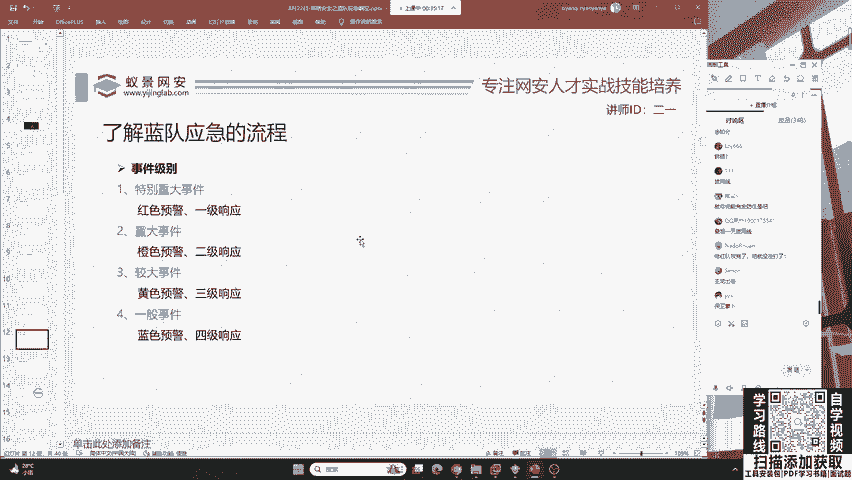
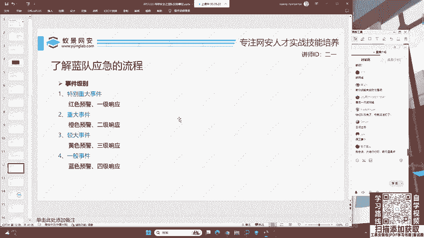
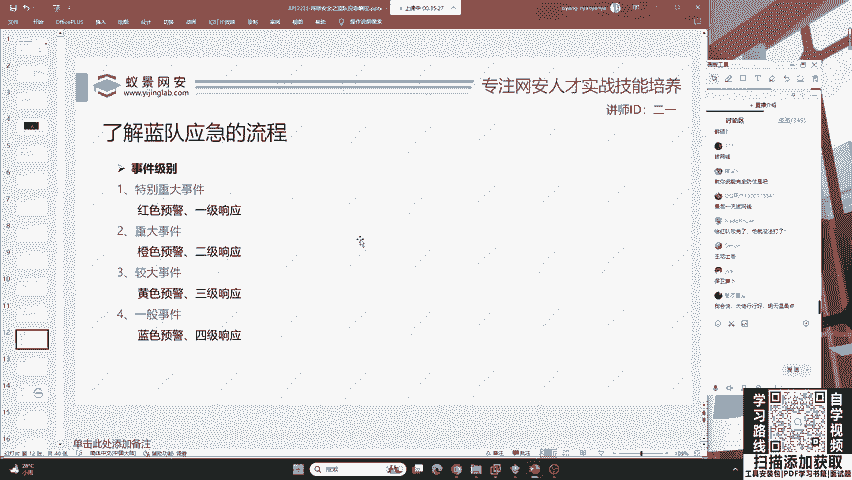
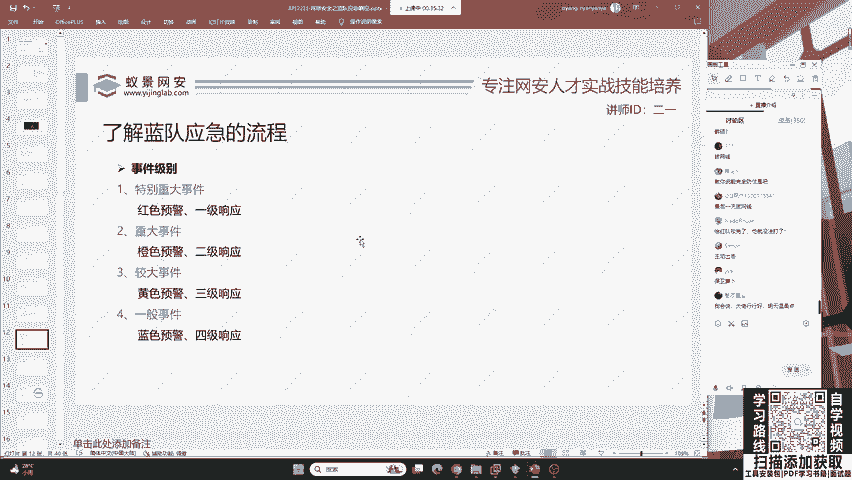
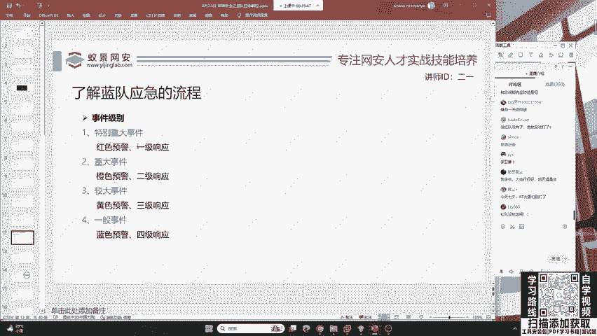
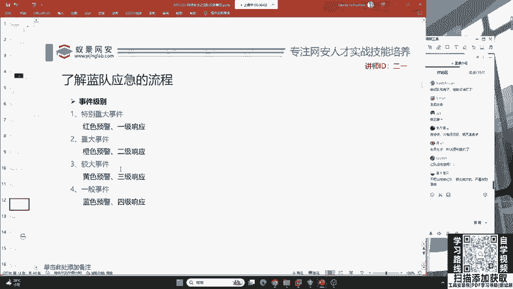

# B站最系统的护网行动红蓝攻防教程，掌握护网必备技能：应急响应／web安全／渗透测试／网络安全／信息安全 - P2：蓝队应急响应-1.应用安全 - 跟小鱼学安全 - BV1SF411174M

好，这里给大家解释，首先应急响应。它通常啊是指这个企业为了应对各种意外事件发生前所做的准备，以及意外事件发生后所采取的措施。这时候大家一定要注意啊，你不是100%能防御这红队的。

如果你现在哪一位同学说我啊我可以完全防御红队的攻击。那你就完蛋了。那红队啊，明天最后一天得吊着你去打。所以说啊咱们绝对不要口出狂言，而是要知道我们如何尽可能的做好准备，以及在被攻击之后，怎么把这样一个。

企业的损失给降到最低。好，所以说呢我们就是说要对已经发生或者是可能发生的安全事件啊进行监控、分析、协调处理以及保护资产安全。那我们主要的课程呢也是讲这些技术内容。

那下面呢给大家先先讲一下咱们蓝队应急的事件级别。就是说我们如果被红队攻击了怎么办。

这个怎么办呢？是根据。

被攻击的这个资产的大小和被攻击的危害，被攻击的漏洞类型来去定的。你不可能说你现在自己啊不小心下了一个钓鱼软件，导致你的手机啊被这个红队控制了。那红队啊给你拍了一个照片。

那大家觉得自己的个人隐私受到了侵犯，难道就是特别重大事件吗？呃，其实啊并不是因为这一个攻击的效果，只是在你员工的个人，它并没有去影响企业的整体的正常运行。啊。

所以说呢我们可以把它列为一般事件或较大事件要提高咱们员工的安全意识，以及员工的反钓鱼意识。那这些呢其实大家都能呃显而易见的去理解，就是说根据事件的大小，我们会分为特别重大重大较大和一般事件。

那其实呢就是我们这样一个事件到底是怎么去攻击的？哎，这里啊我们会见识到一个红队视角的蓝队防御，就是我们必须要清楚红队是怎么攻击我们的。这里会有一些名词，我们一起来看一下。首先，应用安全。

就是web share网站篡改和网站挂吗。哎，大家啊经常在上网的时候会遇到一个问题。比如说我现在收藏了一个网站。那这个网站呢我们等过了几年或者是过了几个月，我再打开就发现啊这个网站被植入了黑夜。

我在打开它的时候，就会不受控制的跳转到一些非法网站或者是一些呃这些诈骗网站。这有可能啊就是说这个网站被植入了后门木马，被挂了黑夜，被篡改了它的主页内容，这是我们最常见到的。很多境外的黑客。

尤其是IPT的组织啊，他都会去篡改用户的正常页面。