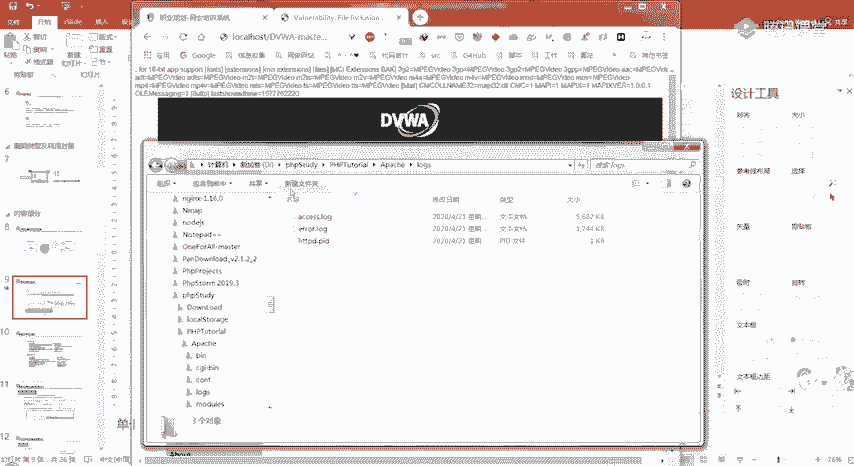
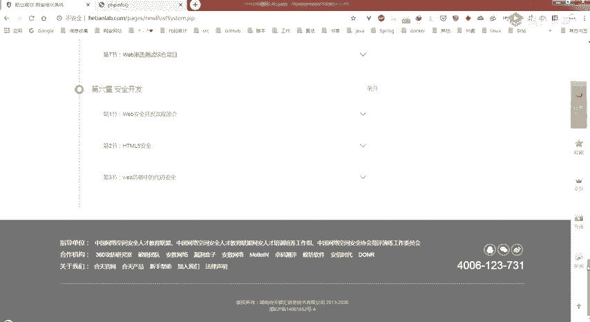
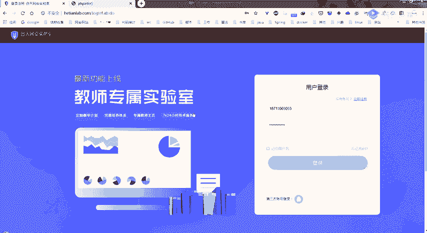
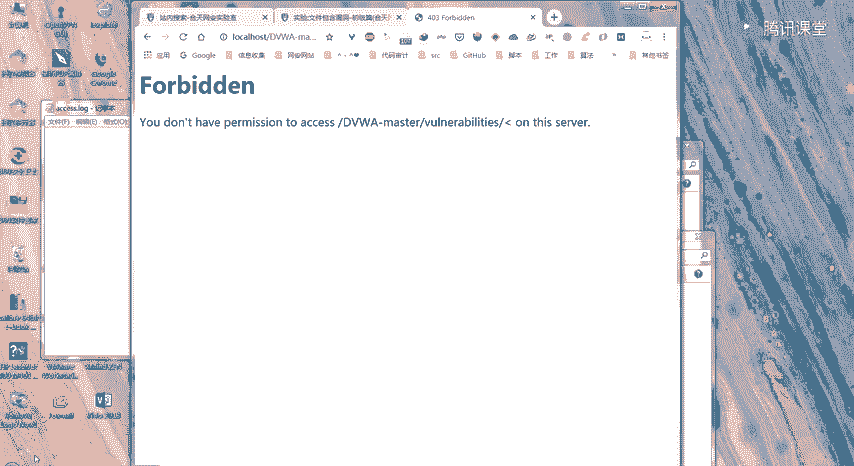
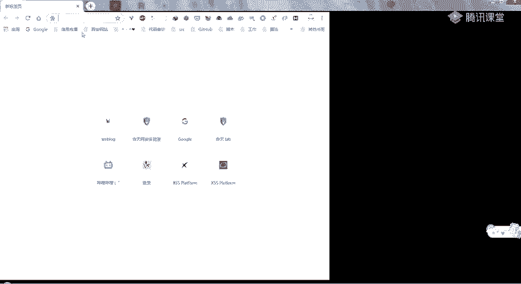
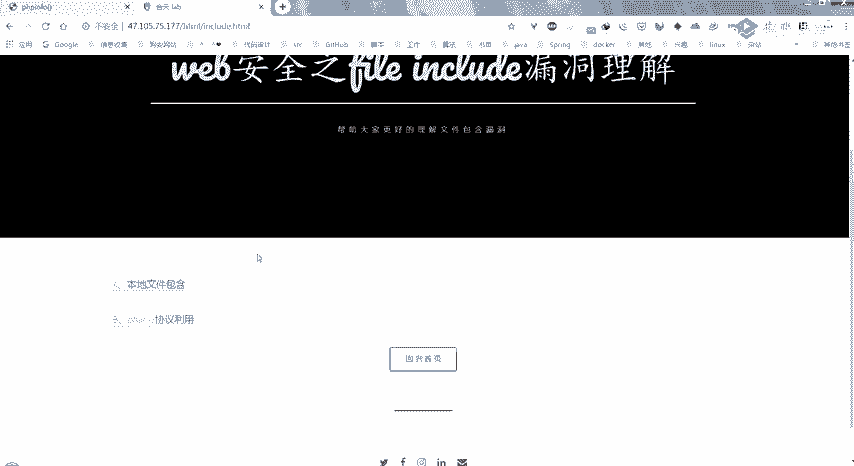
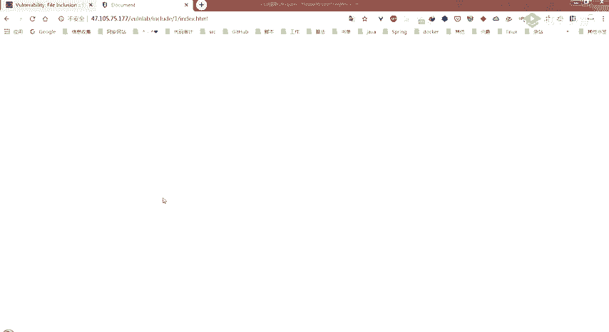
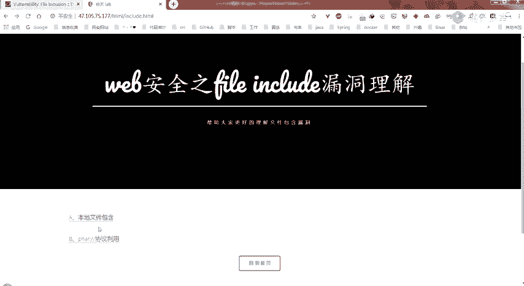
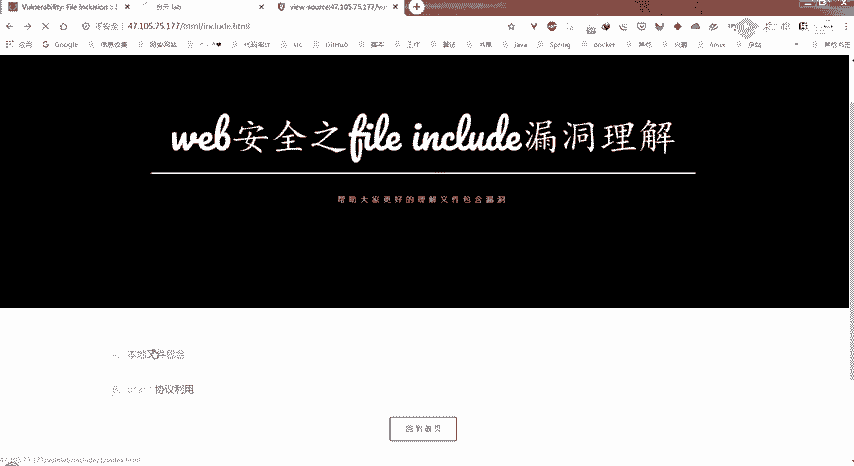
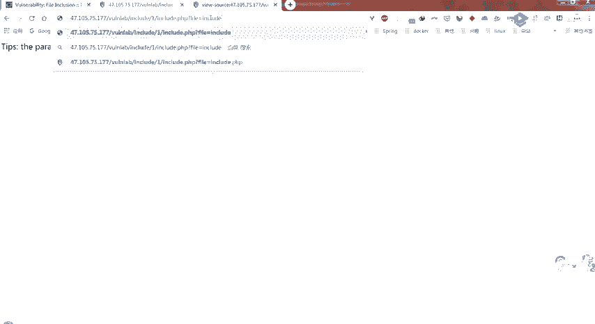

# B站最系统的护网行动红蓝攻防教程，掌握护网必备技能：应急响应／web安全／渗透测试／网络安全／信息安全 - P30：web安全-6.文件包含 - 跟小鱼学安全 - BV1SF411174M

是是只有我没有画面吧？没有，应该大家都没有画面，因为我还没有开那个。😔，全屏分享。

我先。嗯，你们现在能看得到我的屏幕吗？好的。😔，为什么今天都没有人来听课呀？😔，Yeah。那你们为什么就是有同学做了我发给你们的预习内容吗？就是发群里面的那个。这两个实验有人做吗？TVW那个做了一下。

😔，下面的这个呢，下面这个做了吗？好吧，现在8点钟了，然后可能大家也没有做我之前发给你们的一个预习内容。那我们这节课讲的是一个文件包含漏洞。如果大家有做那个实验的话，可能就会嗯先了解一下。

那我们开始今天的一个课程的讲解吧。今天讲的是这个文件包含漏洞。然后按照惯例有一个目录，最开始的话，一个漏洞的概述。第二部分的话就给大家介绍一下文件包含漏洞，它的类型分为几类。

以及然后每个类型它是如何进行一个利用的。第三个部分的话就介绍文件包含漏洞的一个危害以及防御。这个危害和防御，应该大家啊听完这个类型及利用，应该自己也能总结出一两点。

然后第四个的话就是给大家布置一个课后作业。那首先来看第一个部分。就是文件包含漏洞的一个概述。嗯，首先是一个什么是文件包含？他其实是开发人员将重复。将需要调重复调用的一个函数写入一个文件。

对该函文件进行包含时产生的一个操作，就叫文件包含。这样编写代码能够减少代码的冗余，降低代码后期维护的难度，保证网站整体风格的统一。比如说。我们的这个。我们的和天。

您可以看到它其实这个头就是这个上面我们点别的地方。就是它这个这个上面它虽然就是颜色变了一下，但是它基本内容还是没有变的。

以及它的这个下面都是没有变的这些东西其实就是每个页面里面都需要用到的一些东西就比较重复嘛，它就可以写在一个文件里面，然后进行一个引包含，把它引入进来。你看他这个尾部。也是一样的。

所以这样的话就可能就这就是一个文件包含的一个例子。那它为什么会称之为漏洞？就是漏洞产生的原因是什么？其实就是因为文件包含的函数加载的参数没有经过过滤或者是严格定义，可以被我们攻击者来控制。

包含其他的一些文件，导致就执行了一些非预期的一个代码。我们来看一下他的一个。就比如说它常见的一个漏洞代码，看01这一个部分。就是在这边的话，你可以看到在这个PHP代码中。

它包含通过这个include函数，它是一个文件包含的一个函数。包含我们这个fire la，然后这个fi la是通过get来进行传入的那这样的话，是不是这个get我们之前也有说过。

是不是我们就可以直接在它的UIL中加入这个fi la。然后它通过这个get就能取到。那这里的话，它并没有对我们这个传入之后，就是这个fi la进行一个嗯过滤。这样的话，那就能够。包含我们自己。

上传的一个文件或者是其他他们系统里面自带的一些敏感的一些文件。所以这就会产生一个文件包含漏洞。可以看到02的话，就比如说他访问的UIL就是问号后面fi lamb等于s点PHP。

那这样的话它就会把受点PHP包含进我们这个。嗯，当前这个页面里面来，那我们改变fi栏的值的话，就可以改变这个PHB代码中包含的一个文件。这么说大家能理解吗？如果能理解的话，就打个一。好。好。

大家应该都能理解这这个漏洞还蛮简单的。那我们接着来看。嗯。😊，这怎么称？😔，这个样子了。😔，就是PHP中文件包含的一些函数。第一个的话就是require。第二个的话就是这个include。嗯。

介绍这些函数的话，大家如果以后想做代码审计，可能就会嗯嗯去审计1个CMS的时候，就可以全局搜索这些关键词。就是比如说全局搜索这个require requirequire once。

inlude include once的话，你然后再看一下它在那个它的代码中有没有进行一个有效的过滤，或者是怎么样来判断它是否存在这个文件包含的一个漏洞。那我们接下来看一下它具体的一个解释。

第一个的话就是这个require组。嗯，有一个require函数。他这个四个这边给出的就是他们四个的一个区别，这个他们四个都是用来进行文件包含的一个函数。然后区别的话就是这个require的话。

它是函数去出出现错误时会直接报错，并退出程序的执行。那这个require once的话，它也是出错的时候就直接退出。但是它和这个require的一个区别，就是它仅仅只会包含一次。然后在脚本执行期间。

同一个文件可能会被多次的引用。那么为了确保只包含一次来避免函数重定义以及变量重新复值，然后出现一些呃一些问题的话，它就会使用这个require once来进行这个文件包含。第二个的话就是include。

那这个include函数的话，它是函数出现错误的时候，并不是像require这样直接退出，而是它会抛出一个异常呃，抛出一个警告，然后。程序是会继续运行的。然后include once的话，它也是。

出现错误的时候，仅仅会抛出一个引警告，而且它只会包含一次，就和这个require once差不多。这四个函数大家了解一下就好。嗯，主要可能大家如果在代码审计的话，可能就会。就会拥到。

那第二个部分的话就是这个文件包含漏洞的一个类型及其它的一个利用。我们首先来看一下第一个。它就分为两种类型，一种是本地文件包含漏洞。其实我这少打了一个漏洞，就本地文件包含以及远程文件包含。

那本地文件包含的话，顾名思义就是它被包含的文件，就是我们使用那个刚才说过的那4个函数去进行一个包含嘛。它包含的那个文件是在服务器本地的，所以就叫本地文件包含。远程文件包含的话。

就是我们使用那似个函数包含的文件，在我们远程的一个服务端，可能是我们供击者控制的一个服务端。嗯。你。这个本地文件包含它的一个利用方式的话，就是它可以包含本地敏感文件。

或者是我们自己嗯通过客户端上传文件上传上去的一个文件，然后它进行一个包含。那远程文献包含的话，它可能就是包含攻击者指定的1个UIL里面的一些恶意文件嗯。

这个LFI就是local fileinlude的一个缩写嘛。这个IFI就是A remoteote filein就是远程文件包含以及本地文件包含。我们接着来看啊，我们接着看一下这个本地文件包含漏洞。

第一个的话在这的话是给大家举了一个例子，是包含我们的一个系统文件。内在这的话，我们的C盘都有这个文件。这个windows杠win点INI。然后它里面的话里面的内容就是这儿这个。嗯，那个画笔。嗯。

就是这个灰色。这一串。的一个内容。就会显示给我们。在这里。然后。第二个的话就是包含我上传的一个文件。那在这儿这个点点杠，大家知道是什么意思吗？就是这个点点斜杠。有 post吗？😔，什么意思？Yeah。

甜点是啊，对。对，然后在这儿的话，他就这里。这个配置的话在这等于我可以这个其实是如果大家有预习的话。其实是这个。😔，哦。在这儿。这个fi include就是文件包含。嗯，如果大家想做这个的话。

之前我给大家有一个预习内容，这个文件包含漏洞。这个实验里面它的一个实验环境就是这个。然后大家先可以，就是那个课后再做，或者是之后再做。现在先看先看我吧。然后在这里的话。这个这个。

地方它有一个传入了一个参数，就是这个配置等于，然后后面加上了一个include点PHP在这的话，它我们可以点击其他的一些来看一下。你可以看到在这儿的话，它这个配置就会等于fi一点PHP然后在这里的。

他的一个内容就做了一个更改，我们返回。你看到这，它又变成了include点PHP，然后312的话。就是这个fi2的1个PHP的一个内容。那我们就可以猜测它这个配置。

这里它传入的这个参数可能就是在当前这个。FI这个index点。PHP里面去引入的一个。文件。所以说它在这等于fi一点PHP的时候，它就引入了fi一的一个文件。然后fi3的时候。

它就引入了一个fi3的一个内容。所以说我们可以在这儿试着去进行包含其他的一些一个目录。比如说在这儿的话，我们是包含了一个C盘下的。Windows。嗯，可以看到他在这里的话，因为这个搭在我本地。

所以我们可以去。看一下C盘的。Windows。你可以看到它这儿显示的东西其实和我们这个里面就是一样的，只是它没有那些换行符。对吧。所以在这的话就可以确定他可能就存在这个文件包含漏洞。

然后我在这儿给大家演示的第二个例子是说包含了一个上传的文件。那在这的话，我在这个。

这个跟目录下面它是有一个。PHPin点PHP的。然后在这里的话是执行了1个PHP for函数。

然后我在这儿尝试去进行一个。包含这个文件。就是这个PHPin点PHP这个文件。那我们当前这个目录是在哪呢？是在这个DVWA杠master，然后这个。这个什么。这个东西吗？这个里面的FI路径下面。

其实就是在这个这个地方嘛，对吧？然后我们要包含那个的话，就要使用一个相对路径去进行一个包含。那为什么这是三个点呢？三个回推呢。嗯，你可以看到。它这个上面的话就是会执行那个PHP in的一个函数。

然后这个下面。就是。他及琪的一个。本来的一个index的一个文件。那在这儿是因为他就是他这有三个回退嘛，是因为它的相对路径决定了。当前我们是在这个FI目录下的这个index点PH。

然后回退一格就到这个目录下，回退两格就到这个目录下，回退三格就到了这个3W目录下。那3W目录下就有一个这个PH for点PH。所以他这就引入了进来。嗯。嗯，大家可以看到我刚才这儿又刷新了一张图。

可能看的不太明显。在这里的话，我们前面不是包含了一个相对路径的1个PHP文件吗？在这里的话，我就直接去包含了一个当前路径下，当前目录下就是这个FI的一个。目录下的1个PHP点TXT文件。

那你可以看到它下面也是进行了一个这个PHP in for这个函数的执行。那这是为什么呢？右边这个就是它的一个。内容这个撇in点TXT的一个内容。啊，我下面其实已经写出来了。只包含一次不理解。什么意思？

😔，啊，你说只包含一次。啊，你是说那个函数是吧，这是吧，只包含一次。你到时候去做一下那个我们实验室有一个。

文件包含漏洞初级篇。他在这个步骤一里面，他就详细的介绍了这四个函数。的一个区别。在这里就有说到，他是说嗯就像文件名中只会包含一次，如果需要包含的文件已经被包含过了，再次调用这个包含该文件时就不会。

包含这个文件，然后这个函数可以防止文件被重复包含或者是变量被覆盖。嗯，然后他接下来就是给你。演示了。切身体会一下怎样去进行这四个函数的一个区别。如果不懂的话，可以去看一下那个。嗯，那我们回到这个地方。

就是回到这个包含上传文件。那在这的话，我其实是假设我这个PHPin点TXD是我们自己上传上去的。那在这儿它为什么会进行一个执行呢？其实就是因为我们在这里它有一个就是说包含的文件内容，只要符合PHB语法。

就会被当做BHB代码进行解析。无关它的后缀名是什么。所以说我们进行一个文件上传的时候，不是它可能会有一些绕过，只允许我们上传一个什么嗯图片格式的。怎么样。那我们这个时候就可以把它的后缀更改为JPD。

然后如果它存在这个本地文件包含漏洞的话，我们就可以在本地包含漏洞的地方去包含我们刚才上传的那个文件。因为它被包含的内容只要是符合PHP语法，它就会当程序PHP代码来进行解析。

所以的话你在这儿把它改成PHP info点JPGPNGJPEG。DIF等等，它都会进行一个解析。那怎样是一个符合PHP语法的呢？那你首先肯定是要有这个头的，就是这个。小于符号问号，然后PHP这个。

他才会把它识别为这是1个PHP的一个文件，是PHP的一个代码。嗯，我这么说，大家能理解吗？好的。😔，这个大家需要需要演示一下吗？如果需要演示的话，你就在这里敲一个需要演示，然后我就。给大家演示一下。

我们接着往下讲。这个需要演示吗？就是我刚才说的这个。它去包含当前目录下的1个PHP in点TXT，然后这个TSTXT里面的内容是1个PHP的代码，代码里面它是执行了这个PHP in。在这的话。

它进行一个包含，就会对这个文件里面的一个内容进行一个解析。因为它是一个符合PHP语法的，所以它就在这里。在下面这个地方就这个头就表示它是执行了这个PH in这个函数嘛。这个需要演示吗？

前面文件上传有讲过。嗯，好。那就不演熟了。嗯，这是列举了一些敏感文件的一个默认路径。那如果他更改了的话，就不是这个路径。如果没有更改的话，他默认路径就是这些大家了解一下就好。嗯。😊，嗯。

这给了一个他的一个利用方式。这个的话是配合一个日志文件的。这个给大家看一下，这个大家需要过一下吗？就是需要给大家演示一下吗？如果需要的话，就扣个一号。嗯，这个其实是什么意思呢？它包含一个日志文件。

其实是。我们现在在这里输入的这些内容，就是我们刚才访问的这些内容。其实。他在他的日志服务器那边，他的日志里面是由。记录的。那比如说我们这个PHP study的话。

它在这个阿帕里面这个logs这这个access log点log里面。就记录了我们的一个一些。可以拉到最后面，你可以看到。这个最后面是不是我们。刚才输入的一些内容。对吧。那在这儿的话。

如果我们知道服务器那边它的一个日志文件的路径，然后我们可以随意访问一些内容。在他比如说。我们去一个别的地方。在这里的话，它这有一个参数，所以我们在这可以输入我们自己的一个内容吗？

我们如果在这个地方输入1个PHPPHP info。这样的话我们。把这个东西回车之后，他是不是会把这个UIL记录到他的一个日志文件里面去？那比如在这个PHE study的话。

它就会记录到这个access点log。这个文件里面去对吧？那我们接下来如果这个网站它存在一个文件包含漏洞的话，我们去包含它的一个日志文件的路径，是不是就可以执行我们在这里写的这个代码？

我们回车这他它有什么显示没有关系，只要他把我们的这个记录到他的一个。文件里面去就好了。那在这的话，我们尝试进行一个包含。因为我们是在本地，所以就会知道它的一个相对路径。

它的相对路径其实是在我们的3W跟目录，还要上一级的这个阿帕奇路径下的logs。所以刚才是3。回退3个3个。目录的话，这就要回退4个，这这里有个记录。我就不说了，就直接。

打这个就是阿帕奇logs杠access点log，对吧？嗯，这里的话就会有很多。我的一个。😔，记录甚至前面的一些。他都有一些显示。我们拉到最后吧。因为这个文件太大了。他把我之前的一些。那可以看到。

其是他的这个地方。看得清吗？就是这个地方它并没有，因为我们是最后访问的那个什么。就是这个网址的吗这个地址的吗？对吧。就是我们刚才随便访问了一个，然后但是他这儿并没有进行一个执行。我把它删掉吧。

先把它里面的内容。嗯。他在使用。😔，我在这里重新新建一个吧。然后现在这个是没有内容的。们重新。重新来过一遍。刚才是我们随便找了一个地方，就是这个地方嘛？然后这有一个参数，我们在这个参数后面。

直接去或者是你不找一个参数，你只要是在这个站点下面，然后你直接把它路径更改为。他只要能记录的话。就都行。😔，嗯，虽然他这报了403，因为我们根本就不存在这个。嗯。这个是。不能删除了吗？😔。

好吧，他现在。😔，我把这个还是还原吧。我们可以其实可以直接在这个。后面来看一下，就是直接打开这个。文件来看一下。拉到最下面，这个太大了。嗯，他还是记录在了这里。那我刚才新建那个就是没有用。然后在这的话。

这个其实是我们刚才8点31的时候。然后访问的一个网址。你可以看到他在这儿并没有把我们的。就是中间这个百分号20的话，就是进行了，还有这个3C31的话就是进行了1个UIL编码嘛。并不是我们一个。

兼过号问号PHPPHP音符又监过号的这种形式。所以他在这里并没有。进行一个解析，内有什么方法可以让它不进行1个UIL编码呢？因为它这不执行的原因就是因为。在这里的话，它存入这个文件。

就是它记录这个日志文件进行一个记录的话。他是记录的是你进行UIL编码之后的一个内容吗？那在这儿大家有什么方法让他不进行一个编码吗？嗯，刚才弄那个。入职文件可能耽误了一些时间。然后大家现在有什么想法吗？

都为什么。😔，如果有想。没有。😔，前面我们看到就是在这里。这个文件包含在这，我们不是包含了。刚才那个日志文件嘛，就是这个嘛，然后它不是好长一串，然后中间可能会执行了这个PHPin嘛。

那是我之前的一个记录，不是我们刚才的。是我前面这一大堆。前面的一个记录，但是它最后并没有执行这个PHP这个函数，是因为它就是以这个UIL编码的方式存入了这个文件嘛，所以它并没有进行一个执行。

因为他根本就不能判别这个是不是。1个PHP的一个代码，他没有那个。小于问号PHP那个开头。所以在这儿的话，我们其实就可以通过利用我们就是你使用一个拦截代理。在这边的话。我在这里进行一个。嗯。

你可以看到他在这儿的话，在这个ge there这个UIL。它这里就已经是进行UIL编码之后的一个内容了。所以我们在这儿把它的这些东西。改掉。改为我们一个正常的一个字符。然后再进行一个forward。

因为刚才开了一个代理，所以他这需要我重新登录一下。这个时候我们再来进行一个包含。就是那个阿帕奇。Locks。As电loggo。😔，嗯。那是。😔，嗯，我们直接看最后面。在这个地方。

它是我们来看一下这个文件里面。嗯，我们前面的一个记录是在。为什么？😔，这个地方对吧？我们前面一个存入的还是这种。使用了URL编码的。然后后面这个的话就是我们。就是使用那个代理。

然后拦截之后把它更改为正常的一个字符之后存入的。对吧。所以在这的话，他就进行了一个解析。这个后面就是我们。那个后面的一些日志，就是我们我刚才不是进行了一系列的登录操作嘛，然后他也记录了进来。嗯。

这个大家有看懂吗？没有看懂的话，我们来看一下PPT吧。可能我刚才弄那个。弄那个日志文件，然后大家可能看的有点晕。其实整体的意思就是我去如果这个。网站存在一个文件包含漏洞，然后我就去。这个网站访问一个。

比如说在这里的话，就是有一个问号PHP info。这样的一个代码，然后他就会把这个记录到它的一个日志文件里面。那它直接存入的话，它是会进行1个UIL编码的。所以我们使用bo。

把它的这些字符给改为我们正常的一个字符，然后使它能够进行一个解析。所以在这我们再去。一。引入的时候，他就能有一个正常的解析给我们。我这么说，大家听明白吗？对。😔，是的，浏览器会对特殊字符进行编码。对。

它会对URL里面的一些特殊字符进行编码。为什么会产生1个UIL呢？比如说我们访问百度的时候，你去输入一个中文。嗯。我们要那样看，我们也就是要。嗯，大家自己去实践吧，因为已经43了，你去就是开一个代理。

你去看的时候，你会发现百度这两个字，它其实是使用百分号加一串一串。加一个字符，摆分号，加一个字加一个数字，然后这样的形式去进行一个传输的。他就是嗯对这些特殊字符以及它不识别的一个字符进行一个编码。

进行1个UIL编码。嗯。😊，他会进行一个解码。对。我们接下来来看下一个。下一个这个的话就是利用这个发友协议。那这个发o协议的话，其实就和前面我们直接进行一个包含是其实是差不多的。

也是显示一个本地的一个文件。那在这的话，我们使用这个file C盘下的windows，然后windiaII这也会有一个。这个文件的内容显示给我们。嗯，右边这个PHP点INI里面。

我框的这两个参数其实是我们等会远程文件包含需要用到的。这儿先不提。😔，接着是讲一个这个PHPfilter协议。这个协议的话。就是本地文件包含它利用这个协议，主要是进行查看源码这种操作。

我们刚才不是说直接包含我们的一个PHP文件或者是嗯符合它PHP语法的一个文件的话，会被解析嘛。然后我们不能看到它的一个源码只能看到它解析之后得到的一个结果，就比如说我们刚才那个PHP它就会嗯解析。

就是给我们显示出PHP这个函数执行之后的一个结果。我们不能看到那个文件的一个源码，那有时候我们需要看这个嗯PHP文件，它是怎样进行一个逻辑处理的。我们就是想知道那个文件它里面的内容是什么。

它过滤的那些字符怎么怎么的。我们想看那个PPHP的一个源代码的话，就可以使用这个。协议来进行一个。读取。他的语法其实是。嗯。😊，它的语法可以看到这个后面这个地方，它是写1个PHP冒号。

然后filter这个后面就表示它是使用怎样的一个转换器。在这这个convert点后面就是使用一个b64编码，然后。这个。再一个斜杠resource就等于这个include。

这个它整个这一串的意思就是我们要包含的这个原文件resource就是这个include点PHP然后它是怎样进行一个读取的呢？我们就使用b64加密进行一个读取这个文件。所以说它在这儿显示给我们的。

文件是一个。就是这个include点PHP进行base64加密之后的一个结果，就是我蓝色框住的这一个部分。这个大家能理解吗？你既然能得到它一个原文件，它是进行一个b64加密的。

所以我们就可以随便去找一个b64解密的一个网站，拿这一串数字，就是字符进行一个解密，你就能得到这个include点PHP它的一个源代码。这是它的一个主要作用。这么说，大家能理解吗？

就是这个PHP filter，它主要是有两个参数。第一个的话就是这一个你是使用是怎样的一个转换器，对它进行一个编码的。第二个的话就是你有一个必要的一个参数，就是你要嗯现在你要过虑的一个留是哪个文件。

这里的话就是这个include文件。然后你resource等于后面就可以写你想要读入的文件名称。OK那我们就接着往下讲。嗯，这个的话是使用一个压缩文件流的一个协议。

它利用的条件是我们PHP的版本需要大于5。3。0。这三个协议它都属于一个压缩流，他们可以进行一个访问，访问我们压缩文件里面的一个子文件。它的格式是ZIP，然后冒号斜杠。

它这里需要使用的是一个压缩文件的绝对路径。所以说它这个协议可能会比较鸡肋。因为我们很少会知道。一个网站它的绝对路径是怎样的？然后加一个井号，井号后面跟上我们一个压缩文件类的一个子文件名。

为什么这个其实是写到这儿是为什么呢？就是写到这个本地文件包含漏洞利用方式。这儿，它其实就是在这个PH in点ZIP我们这不是压缩文件吗，我们可以把它的后缀改为，比如说我在这儿演示的这个JPG。

然后或者是其他的一些你符合上传的一些。文件名。但是你在这个压缩文件里面，这个PHin点TXT里面又是我们的1个PH代码。所以说它最终进行一个包含的话，就会直接去包含我们这个PH info点TXT。

因为我们是用这个GIP协议，然后就可以访问到我们压缩文件里面的一个子文件嘛。然后我们把这个这一串传入我们这个配置。等于这个的话，他就。配置等于这个GIP最长串。的话。

它就会对这个PH in点TXT里面的内容进行一个解析。那在这有一个需要注意的地方，大家都知道我们之前学那个叉SS的时候，也有说过这个井号的话，就会表示我们仅仅只在客户端进行一个。

后面的内容它就不会传入到服务端的嘛。所以在这的话，我们需要对它进行一个UIL编码，编码成这个井号进行1个UIL编码的话就是23%。嗯。就是进进行一个编码之后才能进行一个访问。

这可能是需要注意的一个小地方。接下来看下一个协议啊，下一个协议其实是和GIP协议，就是刚才那个压缩协议是类似的，它也是可以去访问我们压缩文件里面的一个内容。但是的一个子文件，但是它是可以使用相对路径的。

所以说它这个协议可能会比前面的那些协议要好一点。利用更广一点。那在这的话，它使用的一个格式就是这个PHA啊冒号，然后斜杠。它的一个相对路径，然后再加一个斜杠。

这个斜杠后面就是一个压缩文件里面的一个子文件名。那在这儿我给大家演示的话就是。Yeah。这个给大家演示一下吧。嗯，我这已经存一个了，所以我就直接拿这个来进行一个演示吧。我把它放到桌面。然后在这的话。

我把它的后缀给改了。这个时候我们首先要将它一个进行一个上传嘛。所以在这里的话，我们先到这个。嗯，某个上传的一个页面来进行。这个地方把它打开，然后上传。在这的话，他就已经上传成功了。

我们需要加这个PHA呀。这个协议。后面加上我们的这个PHP in for点TXT。你可以看到在这里的话，它就直接执行了我们这个。PHP info点击IP因为我后面把它的。后缀名改成了JGIP嘛。

然后里面的这个HH for点TXT的一个内容。然后我们是需要使用这个协议，这个压缩流协议来进行一个访问，才能访问到它里面的一个内容的。我刚才演示，大家有看懂吗？关于这个利用的话，这个。

这个协议的一个利用的话。课后作业那个司机。

嗯，你今天的课后作业就是这个外包安全之文题包含的理解。这个B这就有一个这个。

协议的一个利用，大家可以去做一下。我刚才操作大家有看懂吗？如果看懂的话，就打个一。如果没有看懂的话，就打个2。行。那我们接着往下讲。嗯，我这这个PPT里面其实也给了一个过程，就是首先上传。

然后再进行一个包含。然后我接着在这去访问了这个shall点PHP。然后我们F12看这个网络的时候，这它的状态是200的，说说明已经有这个shall点PHP了。那为什么会生成这个shall点PHP呢？

其实就是因为在我们这个压缩文件的test点PHP里面。他这不是去进行了一个包含包含我们这个test点JPG里面的test点PHP嘛。

它里面的内容其实是把我们这个一句话木马写入到我们这个shall点PHP里面了。所以他在这里的话。就会生成1个shall点PHP。接下来的话就可能大家就可以使用一些嗯菜刀等其他的一些连接工具进行一个连接。

嗯。第二个的话就给大家讲一下这个远程文件包含包含一个远程文件。Yeah。嗯，可以看到我这个红框框这。其实它就和本地文件包含就有一个很在格式上就有一个很大的区别。

我们前面的时候是并没有使用一些HTP这种协议。这个这种协议的。而是只是使用PHP的这这种PHAR等等这些文件流的一些协议来进行。访问。或者是这种点点杠回退。对种方式来去包含它本地的一个文件。

那远程文件包含的话，它就可以去它如果存在远程文件包含漏洞，它就可以去包含我们这个远程。服务器上的一些文件。那在这的话，我就直接去包含了这个。嗯，192。168。1。239。下的一个p in。

然后它这执行成功了，那其实远程文件包含它漏洞，它存在是有两个条件的。第一个条。第一个的话就是这个参数，这个alone UILF open等于on这个是要开启的。其次就是这个。

这个参数along uL include这个参数也是要开启了。这两个参数是在这个PHP点INI这个文件里面去进行一个设置的。那后面这个参数它在PHE5。2之后默认为关闭。

所以说可能有时候远程文件包含的话嗯就比较难利用。这也给出了一个包含远程的一个shall。那在这的话，我就直接去进行包含我们本地的。因为我这。就是在本机进行实验嘛，所以在这里的话，我就去包含本地文件夹。

像3W跟目录下的一个remmoote shell点TXT在这个TXT里面的话就是。还是跟刚才一样啊，其实。我们先把这个一句话木马存入到这个拍漏，然后我们进行以写的方式打开demo点PHP。

然后将我们这个pload写入我们这个文件里面，然后再关闭我们这个文件流。可以看到在下面的话就是我们去进行一个包含之后，它就会在我们这个192。163。1。

239的这个FI路径下面就会生成这个demo点PHP。然后它的一个内容的话，就是这一个。这个一句话木马就是我们这个payload的写入的一个内容嘛。接下来我们可以使用菜刀等级或者是。

其他的一些工具进行一个连接嘛，远程连接原件。这种东西来进行一个链接。然后这里的key的话就是这个CMD。嗯，接下来就还有其他的一些方式，就是PHA。然后input这个协议。

这个协议它利用的话也是需要开启。这个后面这一个参数的这个alone uL include这个F open的话，你可以开启，也可以不开启。后面这个参数开启，它才能够进行一个利用。

那它这个协议它主要是用来接收我们的一个post数据，它会将我们post请求中的数据，然后作为PHB代码来执行。在这的话，同样是刚才那个FI路径下唉这个存在文件包含漏洞的一个点啊。

然后这个配置参数我们就在这个后面直接输入1个PHP冒号，然后这个input后面就不要接东西了，然后在post数据里面输入我们的这个内容。

这个内容的话其实也是将我们后面这一串拍漏的写入到我们这个shall点PHP里面去吗？然后这样执行之后，我们执行之后，你会发现你的就是目标服务器上的这个FI目录下。

它会有这个shall点PHP的一个文件的生成。然后它的内容就是我们这输入的这个一句话木马。这个大家这些其实大家都可以自己课后去进行一个演示，自己去进行一个尝试。大家这需要我进行一个演示吗？如果需要的话。

就大家就打个一。如果不需要的话，就扣个2。需要是吧。好。Yeah。其实他演饰也很简单。然后接下来在这个post。就直接使用这个hankb。先加载。就是他的这个UIL是存在文件包含漏洞的嘛。

然后我们直接去。😔，输入这个PHV inputput这个协议，然后我们把要写入的。要执行的一个。PHP代码写到他的这个。播放大一点。😔，写到这个body里面。这是我们的请求主体里面吗？

直接把这个复制过来。再进行一个执行。嗯，它这是一片空白的那我们去访问一下这个shall点PH吹，看看是不是200。嗯，这个其实就是已经我们看一下let work。这里就是1个200的一个状态码。

说明我们就已经生成了这个shall点PHP这个文件了。接下来大家可以使用一些。嗯，远程连接的软件进行一个软。进行一个连接。因为我这写入的是一个一句话木码嘛。

然后它的一个key就是这个叉叉叉SER就进行一个连接。我们就已经把这个一句话木马写入到这个shall点PHP里面去了。这么说，大家能理解吗？如果能理解的话，就打扣个一。不能理解的话，就扣个2。嗯。

他其实这就是将我们这个文件流转换到了我们这个post数据里面。他使用这个PHPin的话，就是这个意思。我们接着往下讲。这个的话是这个date协议。

它是将也是将我们这个原本的一个文件流重定向到了用户可控制的一个输入流，也是要在那两个参数，就是刚才给大家说的这两个参数al alone uLF open以及这个includeinlude都是要开启的状态下才能够正常使用的。

那在这的话，这个date协议这个后面的话就是有一个PHP info，我这个后面没有加问号兼括号闭合，这个也是没有关系的。你只要前面能进行一个识别就行。嗯。😊，所以的话它在这里执行的就是我们这个。

date这个逗号后面的一个内容。同样我们可以进行一个贝斯路斯加密这个。的内容就是我们这个上面的一个内容。然后他在这里的话也进行了一个执行。嗯。😊，这些大家都可以去尝试一下。嗯。

环境的话就是那个文件包含漏洞实验室里面的一个环境嗯。我们接下来来看一下这个绕过方式。这个大家。如果这个date协议我就没有演示了。大家因为我演示的话也是直接复制一下，然后到这边。给大家看一下效果。

就和我PPT里面其实是一样的，大家自己去演示一下，可就是去实践一下。可能那个。感受会更强烈一点。我就不给大家演示了。嗯，接下来我们来看一下绕过方式。第一个的话就是本地文件包含它的一个。绕过方式可以看到。

在这个上面这一串代码中，这个inlude里面它是会将我们这个get，然后file的话。它是会插在这个INC这个目录以及点HTM这个后缀中间的意思就是说我们。传入的这个file。

比如说我们传入PHPin点PHP，它就会保存到我们这个INC就会去不是保存，是去包含INC目录下的PHPin点PHP，然后再点HTM。这样来进行一个包含。这样的话可能就不能有一个。

因为它这个后缀已经指定了嘛，所以你可能就不存在那个文件。然后他就会报1个404的1个错误出现给我们。那我们如何进行一个绕过呢？其实这个前面这个其实就很好绕过，我们用点点杠回退到上一级。

如果它没有过滤点点杠的话，就可以。回退到我们这个INC前面上面那一集去嘛，那这个后缀点HTM这个后缀应该怎么办呢？这里的话其实有几种方式。第一种的话就是0000阶段。他使用也是有条件的。

就是第一个的话就是这个魔法。这个参数是要设为关闭的。这个也是在我们这个那个PHP那个地方去进行一个设置的。把它设置为关闭，而且它的PHP版本是要小于5。3。4的。比如说在这的话。

就可能我们刚才我们前面不是说不是。只要三个回退符号就可以了嘛，就是那个PHP点PHP去引入去包含它跟目录下的时候，我们不是三个。三个回退符号就可以了嘛。那在这的话，因为它前面有这个INC。

所以我们多一个回退符号句号。那后面这个的话，我们就使用1个00%进行一个截断。那这个00%截段的话，我在下面给出了它的一个简要的一个原理。就是PHP内核，它是由C语言实现的。

因此使用C语言中的一些字符串处理函数。在连接字符串的时候，零字节是作为字符串的结束符号的。所以说你这儿它会解码为0X00，就是零字解码，它就到这个点PHP就不往后面读了，就因为它就。他就他就。

他解解析的时候就以为这个字符串已经结束了，他就不会解析到这个后面点HTM了。就是这个意思，然后从而就达到一个绕过，然后进行一个包含这个PHP点PHP这个。文件就不会读到后面这个了。然后这个条线的话。

这个。这个参数如果开启的话，它会将00%转移为反斜杠0的两个单体字符，它就不具备了一个截断功能。所以说我们这的条件的话是要把这个为关闭，而且它的PHP版本是要小于这个的。

这个00%截段目录编利也是差不多一样的一个原理。嗯，接下来的话是有一个路径长度的阶段。嗯，大家这些看一下就好。其实。因为他的条件。PHB版本要小于5。2。8，然后windows目录下最大长度为。

256个字符超出的部分会被丢弃。所以说你一直点杠点杠的话，他后面的话，后面的这个就会被丢弃，他是这个意思。嗯，下面这个也类似。这个大家了解一下就好。第二个的话就是远程文件包含漏洞的一个绕过方式。

它在后面的话同样是拼接上了这一串。那在这的话，其实它就有几种绕过方式。第一种的话就是我们在HTM就是H配置后面这个HTPloc host杠shall点PHP里面。在这个后面加一个问号。

内在这个后面加一个问号，传入到我们后台的话，后台服务器，然后进行拼接的时候，它其实拼出来就是我们这个。就是这一串。再加上这个。那它在这的话。

它就把后面这一串就作为我们这个shall点PHP的一个参数传入进来了，就不能挤到一个就是拼接到一个。目录的一个作用了。所以说这样就能达到一个绕过的一个。原理。嗯，我这也有说他就将这个作为了我们这个的。

查询自符串。就是问号后面。这个。查询搜狐串。同样它这个我们使用23%、20%也是同样的一个原理一个效果。嗯，接下来我们给大家讲一下文件包含漏洞的一个危害以及防御。其实危害。和防御应该大家有一些体会。

首先我们来看一下危害危害可能就是说获取我们系统的一些敏感信息敏感目录。去进行一个包含的话，就可能泄露嘛。第二个的话可能会执行一个任意命令，甚至获取服务器的一个权限。内防御的话。

首先我们肯定是不能使用一个动态包含的。其实我们刚才漏洞出现的。根本原因就是因为。在那个我们前面不是给大家演示的那个靶场。它其实就是这个配置，是我们能任意输入的。如果我们能够进行一个过滤。

或者是你只限定为包含哪几个文件，或者是你只能包含哪个目录下的一个文件的话，会可能就会就没有这么这么大的影响。然后在没有需要的情况下设置这两个参数5V关闭状态。第二个啊就在这儿也有说说包含的文件进行限制。

使用白名单的方式，或者是设置我们允许包含的一个目录。这个使用这个参数来进行一个设置这个open base dear。第三个的话就是严格检查用户输入参数中不允许出现这种点点杠之类的这种目录跳转符。

第四个的话就是严格检查变量是否初始化化。第五个的话，不仅仅是要在客户端进行一个数据的验证以及过滤关键步骤，还是要在我们服务端。客户端的话很容易就能绕过嘛。我们服务端后台去进行一个。过滤。嗯。

最后的话是大家的一个课后作业。嗯，有两个题，到时候大家把文档发给我们的。班主任。嗯，这个打开是呃我我刚才讲的内容，大家有没有听懂的地方吗？大家如果有。嗯，没有听懂的地方的话，就打个一。如果没有的话。

就打个2。没有人理我。😔，嗯，那行。行。😊，那嗯这个是我们的一个课后作业，就是其实和你们之前的一个是在一个网址的，就是这个4期开头的。这个。😔，这里有两个实验，大家最好如果能做把两个都做出来的话，就。

蛮厉害。可以去尝试一下。嗯，首先给大家一个提示吧，就是如果嗯最终其实是可以就是get shell的，所以大家尽量能get shell的话，就去get shell。然后在这里的话，你打开这个。

Yeah。打开这个A就是。

这个的话它这里是一片空白的。在这我们去查看网页源代码，你会发现有一些东西。那在这里的话，它这儿有一个提示符，就是这个include点fi点PB。所以在这里的话我们直接去进行一个访问。Yeah。嗯。

然后他这又有一个tips。tips的内容就是说。他的参数是file。那就按照他的提示走喽。所以在这儿我们家。嗯，他把我的。拍我的都现实。Yeah。啊。我们就可以在这个file后面加上我们的一个内容。

比如说我在这儿include。

点PHP。你会发现它就包含了很多次我们这个include点PHP。好，我提示就到这儿。然后接下来的。内容的话，大家就自己去实现。然后明天把。嗯，对。然后明天把这个扣。作业如果大家能写个文档。

就最好写个文档，然后交给班主任。嗯，今天的课程内容，大家还有什么没有弄懂吗？如果没有的话，就暂时先下课，明天。再接着和大家说。嗯，那大家应该是没有什么问题了。那。嗯，今天就先这样吧，大家明天见，拜拜。

😔。