# B站最系统的护网行动红蓝攻防教程，掌握护网必备技能：应急响应／web安全／渗透测试／网络安全／信息安全 - P42：web安全-18.XML基础、DTD基础、XXE简介 - 跟小鱼学安全 - BV1SF411174M

嗯。

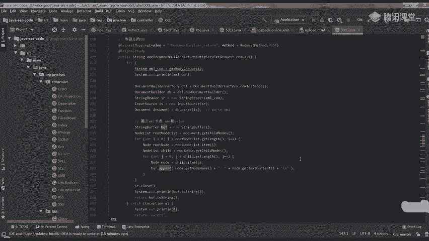

Oh。hello hello，你们能听得到我说话吗？😔，姐姐。行吧。😔，为什么为什么今天人这么少呀？你们之前。😔，人也这不少吗？可能因为放假。好吧。我好久感觉好久没有给你们上课了。

是不是啊有有没有一个月啊？Yeah。我感觉。好久了呀。Cot。好几年也不至于哈。😔，中间画了个V一。对。然后今天要讲的内容，你们有去预习吗？就是。这个。这个内容你们有去预习吗？为什么要叫我姐姐？

看了下产品有基础的东西。好吧，然后这个漏洞的话可能会就是理论知识和。可能会有点难度，所以大家要认真听，然后现在开始讲课。我们这节课讲的是这个叉叉一，然后是它全程就是叉ML外部实体注入攻击漏洞。因为他是。

这个名字大家有看到中间就有一个叉ML以及外部实体。所以说这节课的话会给先给大家介绍一些前。前期的一些基础知识就是这个叉ML以及DTT的一个基础。第二个的话就是第二个是下节课。第三个是下节节课的一个内容。

我们今天就只讲这个。嗯，我就把它放到1个PPT里面来了。嗯，那首先我们讲这个XML基础。那首先的话也是说嗯叉ML的一个定义，它是一种嗯用于标记电子文件，使其具有结构性的可扩展标记语面是不是看不懂？

其实就可以理把它理解为它就是一种语言。然后们其实它的那个形式是和我们HTM语言是差不多的，类似。但是我们的叉ML语言它并没有一个固定的标签，所有的标签它都可以有一个自定义，就不像HTML一样。

它就有那个什么嗯左右间括号HTML啊、title标签呀、A标签呀等等这些固定的这些标签。内叉ML的话，它就它的所有标签都可以自定义。然后它设计的传输。的宗旨就是传输数据，而不是像我们HTML语言一样。

就是用来显示嘛，就是前端显示。那叉ML的话，它设计的宗旨就是用来传输数据的。嗯，我们接下来来看一下。这个程序处理叉ML的一个流程。可以先看到左边这张图，左边这张图的话就是。嗯。

这边的话我们是先生成了一个叉ML。的一个文档，然后通过HCP发送给我们的服务端。服务端接收请求之后，接收到了之后，它就会进行它有1个HTM的解析的一个库，然后进行解析。解析之后。

它可能嗯会把数据回显给我们，或者是他自己进行另外的一些处理。那我们看到右边的话，他就是将我们的一个数据回写给了我们。在这儿的话，我是通过这个po传传输的这个下面就是传输的一个我们叉MO的一个。

chmail格式的一个数据。这这个下面就是一个叉ML的一个文档。的一个数据。就是这个请求题里面。那在这的话，首先我们来可以看一下下一张PPT来介绍一下他的一个。嗯，结构。

那第一行就是这个左键括号问号叉ML这一行它就是表明我我这个文档它是一个叉ML的文档。然后这个book这它就定义了一个跟。元素根节点就是这个book。

然后它的属性为IDID的值为一里面呢这个book里面包裹了4个子元素。就是整个他的意思就是说这本书嗯它的ID为一，然后它里面有嗯这本书的名字，这本书的作者，这本书的出版的年份以及这本书的价格。

它可能就是这个样子，就是它的意思就是这样。嗯。然后下面这里的话定义了它的一些语法。第一个ch面文档，它必须要有一个根元素。那在这儿的话就是我们这个book。然后第二个ch没元素必须有一个。

关闭的标签就是一个闭合标签。比如说这个book的话，它就在这个下面闭合。然后lamb的话，它就在这个后面，每一个都有一个闭合的标签。第三个的话，它是对大小显敏感的。如果你这输入这比如说这是auther。

然后你闭合的时候，在这输入了一个大写的A，然后在UTHOR的话，它是会报错的。就是它服务器那边不能进行一个正常正确的一个解析，它会报错。第四个的话就是他要被正确的嵌套，你不能说。你不能说这个页。

比如说这个。You。这个页换到这个这个auther这个这边来，然后你又把这个。这个闭合的这个oser又换到这个下面来，这样是也是不行的。你就要有一个正确的这样一种嵌套的一种感觉。

第五个的话就是叉ML的属性值，它是必须要加引号的。嗯。这个大家。了解一下就好。我们接下来来看一下它tmail文档的一个结构。刚才也有说，就是我们看到左边的话，它是包括了我们叉ML的声明。

第二个的话是DPP文档类型定义。这个类型定义的话其实是可选的，你可以写，也可以不写。第三个的话就是我们的一个文档元素。那看到右边的话，右边这张图，它首先在前面是一个叉 mail的声明。这个。😔，嗯。

下面这一段文字也是对这一个声明的一个解释。嗯。比如说第一条就是这是叉ML的一个标记，用于高速浏览器。就是这个文档是一个XML的文档。然后这个versionion的话就是它的一个版本。

第三个的话就是这个编码的值在这的话就是。我们选择的支持UTF杠8。所以说如果你在Xmail的文档里面，就是这这个里面使用的一个字符机编码是GB2312，就是和它不对应的话就可能会出错。嗯。

可以看到中间这一个就是我们前面没有没有了解过的。中间这一份这一个部分的话就是1个DTD文档类型的定义。嗯，我们接下来来看一下这个DTD来介绍一下它。嗯，DTE的定义它就是一个文档类型定义。

用来为我们chmail文档定义语义约束。嗯，前面我们不是说。在。这个地方吗？所有的标签都可以自定义。就是这些东西它都是可以进行一个自定义的那有没有方法来进行一个约束呢？

我们就可以使用这个DPD来进行一个约束。我们可以把DDD理解为一个模板，这个模板中定义了用户自己创建的根元素，以及对应子元素和根元素的合法值。元元素和属性。

而元文档元素则必须以我们的DDT为模板来对叉mmail的元素进行相应的规范化。嗯，就不要看重文字，我们。就直接看吧，看。这个。他的一个。就是刚才可以看到这张图里面。

他的意思就是就是他的一个语法是这样子的。嗯，间括号感叹号dooc type，然后是一个根元素，然后然后就是这个中括号。有一个里面就是我们的一个元素声明。所以说你下面的一个文档元素的话，你要按照这个。

元素声明来进行一个编写。列在这儿的话，它是声明了一个根元素，是我们的这个book元素。然后里面有。就是看到这一行里面它就有三个子元素，lamb author以及叶。

然后在这个下面的话就定义了这个三个元素，就是lamb also和叶它的一个。嗯，相当于是类型吧。就是这个井号PC date。这个。嗯。这边传入过去之后进行解析之后，就是像右边这样得到的这样一张图。

这种方式就是我们DTD声明的内部声明。因为它是写在我们叉ML的文档的内部的，就是包含在我们叉ML原文件中。还有一种的话是DTD的外部声明，它是写在外面的。嗯，在这的话。

它的语法和我们前面那个内部声明就有一个区别，就是它在这个。根元素后面就不是加的我们前面这个。元素声明了，而是加了一个sston。这个。关键词，然后后面加上我们的一个文件名，就是在。嗯。

文件名或者是我们的远程的1个UIL地址。这个文件名的话可能就是你要去引入的1个D外部DDD文件的一个路径。因为在这的话，我就是直接去引入了。一个。😔，192。168。1。239。

下面的跟目录下面的CDATA2点DPD。然后这个里面的一个内容的话就是我们。和刚才这个是一样的。就是这一个部分。然后下面的话就是一个文档元素，还是和之前一样。解析的话当然也是和前面一样的一个解析结果。

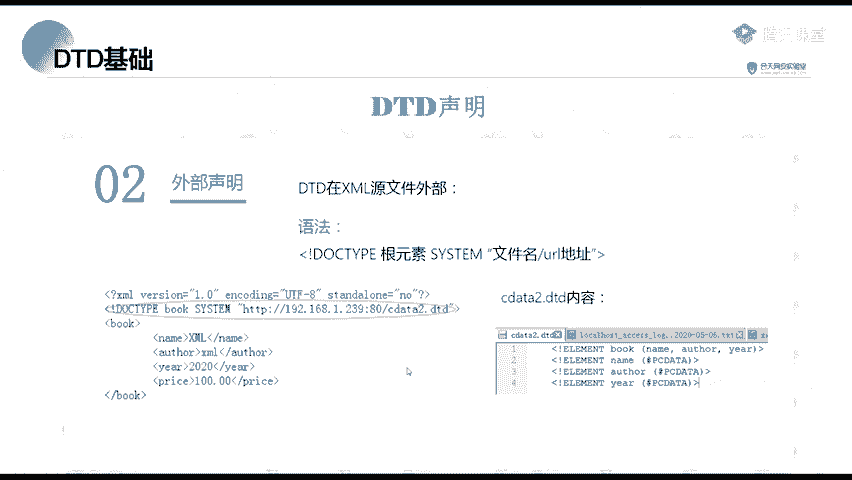

我是不是讲的太快了？我给大家演示一下吧。嗯，这个的话是一个有漏洞的一个代码，然后我来把它运行起来。

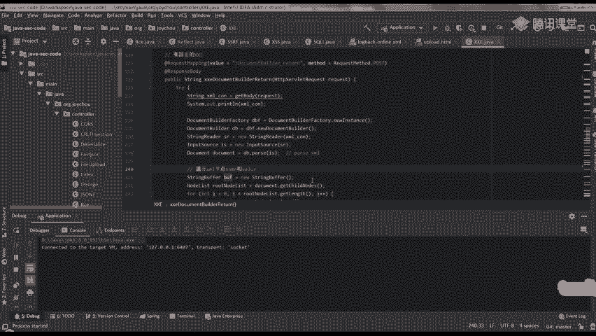

给大家看一下。

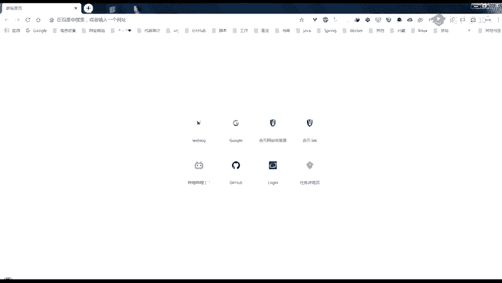

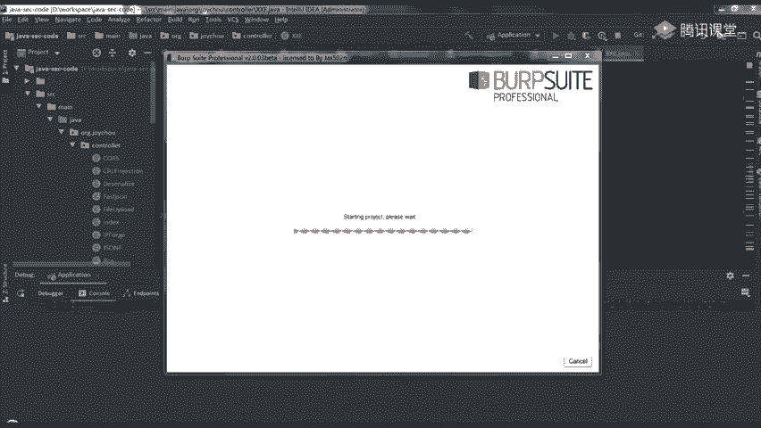

当主。嗯，这儿报了一个错，因为我们是要一个posts类型的。然后我们直接这样访问，就是在浏览器中，这样访问的话是一个get类型的嘛，所以它就报了一个错误。

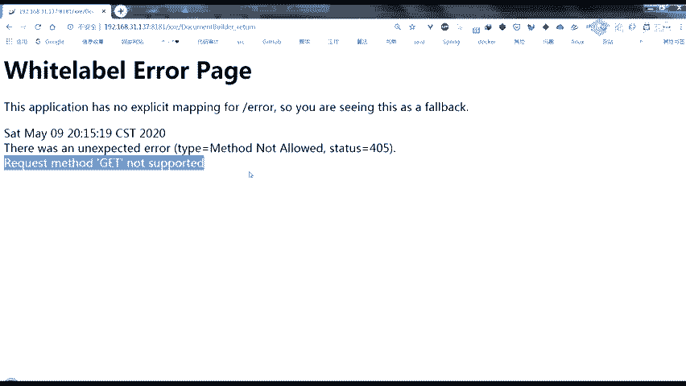

我们直接在bo里面来进行一个。嗯，把这个content type改为我们这个叉ML。然后在这边的话，可以输入我们前面。比如说就给大家演示一下这个。嗯。怎么这么慢？😔。

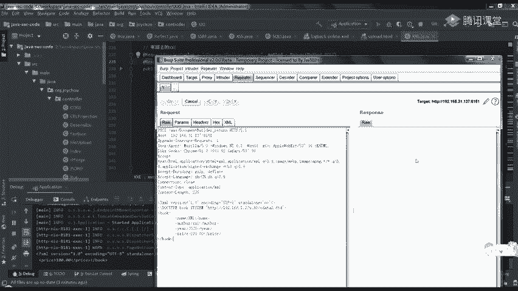

嗯，我这里写错了，我这不应该是。我边应该是。就是我现在这个程序这个程序我现在运行嘛，它是运行在8一端口的。然后我又开了这个PHP study。就是那个80端口嘛，PHP3底的话是吧？

然后我在那个跟目录下面，我给大家看一下就好了。

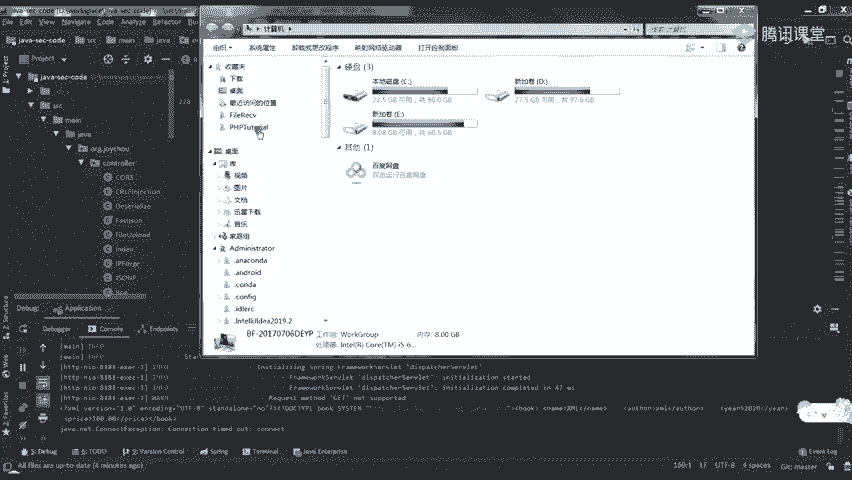

嗯，这有这个。然后再勾一下。😔，嗯，这就会有我们的一个显示结果给我们。

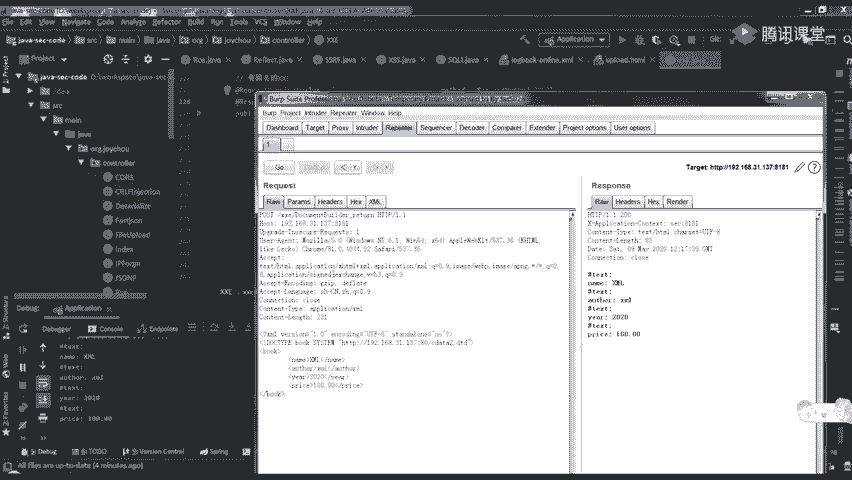

嗯，这个的话。就和我们PPT里面是一样的。我可以带着大家看一下。就是它是怎样进行一个解析的。首先是我们发送一个pos的请求到我们这个叉加页嗯document build。

然后它的内容就是它的请求体里面的话，就是我们1个叉ML的一个。文档。叉ML的一个数据嗯，昨天说。嗯，然后在这的话，它就直接进入了这个方法题，就是进入了这个。

然后他获取到了他的一个我们请求的一个波底请求体。请求底之后，在这儿进行了一个打印。所以在这里的话有这个输出给我们，就是我们请求题的一个内容。嗯，接下来主要其实就是在。这一款。这里是进行就是。他首先是。

创建了一个document标的。的一个实力factory的一个实例。然后。嗯，主要就是这一个吧，238行这进行了一个解析。对我们输入的这一个。进行了一一个解析，解析之后，然后进行了一个便利。

那在这儿的话，它直接是进行了一个返回。所以说在这里的话就会有一个回显的数据给我们。嗯。这个是这个是用java代码写的，所以说它。嗯，这个就是一个普遍的。来进行解析一个叉mail文档的一个。在吗？嗯。

然后这个是。不安全的之后，我们会给大家说他的一个。修复方法。ch猫准pos的传说都是第次。菜猫也不一定是只能获传书，你也可以就是get传书。那为什么我在这儿。就是只能用posts。因为在这个代码里面。

它写了这有要求他的mes的就是请求方法，要是post。如果它是get的话，它就会报错。而且你如果是get的话，你可能有一些如果你是传一些东西的话。

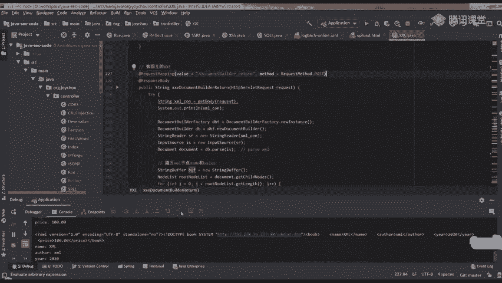

就可能需要进行一个编码。比如说那个连接符号。我们之后会说就是说是讲DDD实体的时候，就会说一个连接符号。我们也知道我们如果是一个get型的话。你在这里加。

就是在这个UIO中那个连接符号的话就是分隔两个参数的嘛。内在DDD实体里面的话，就是我们叉M文件里面的话，它就是用来引用1个DDD实体的。所以说可能会就是要进行一个编码。

当然你说它可不可以只能pos传输，那肯定也是不不行，就是不对的，就是它也可以进就是做gap传输嗯。然后我们。接着往下，我讲的快吗？你们能接受吗？都是第一次听说是有听到。嗯。没关系，讲着。嗯，好。

那我就接着往下讲。嗯。刚才说的就是这个DDD的一个声明。我们前面讲的是一个叉ML文文档嘛，然后现在讲了呃不对叉ML的嗯对文档的一个。呃，语法以及一个规范。

接下来我们讲的这个就是这个叉m文档中的1个DPD的这个部分。因为后面叉叉一的话会用到我们DPD实题，所以要介绍这个。然后D滴滴声明的话，刚才说了，这个是一个内部的声明。然后这个的这种的话。

加上我们这个sstem。就是一种外部的生命。嗯，这里的话我第二张图的话就是就是通过引入一个文件名。嗯。当然你这个就是这个CDAT2DATAT2这个点滴滴滴肯定是要在它那边就是在服务器那边是存在这个的。

不然你没就是当前目录下是存在这个。文件的不然就的话就没有嘛，对吧？嗯。接下来给大家介绍一下这个PC date。就前面。在这个地方的时候，我们有说可以把它理解为就是它的类型是一个DC date。

那它到底是什么意思？它是指的是被景析的字符数据。嗯，好像说的也不是什么我们能听得懂的话。嗯，其实就是说。PCd表示包含字符或者是文本数据，这些文本将被解析器检查实体以及标记。不过。

被解析的字符数据不应当包含任何这种连接符号，左键括号或者是右键括号字符，需要使用连接符号。这种。左肩括号以及右肩括号的实体来分别替代他们。这个时间的话就是理解为我们的这个字符试体，我们的一个。

HMO编码，然后是这种。形式的。他的意思就是说，如果你在DDD中声就是声明它的一个元素类型的时候。它是这个PC date的话，它就会对你那个文档元素。就是你在这儿声明了这个lamb。

它的属性是PC date，它就会对你这个la里面的这个。这个数据进行一个解析。那你数据里面如果包含了这些特殊字符，连接符号，左键括号、右键括号这种特殊字符的话，它就会。报错。

所以说我们需要使用它的一个实体，就是这个实体。来进行替代。嗯。可以看到在这的话。如果可以演示一下。嗯。如果我在这儿输入。

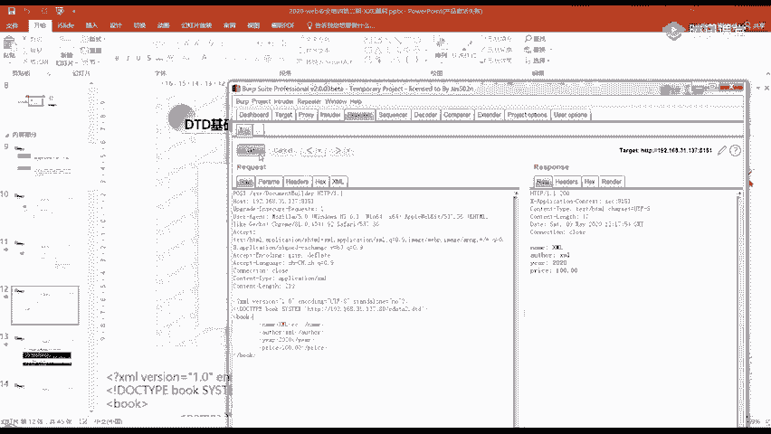

它是有一个except，我们可以来到这个程序里面。这他就会这里因为是打印了一个他的一个。嗯，异常的类型，所以这就会告诉我们。那在这的话，它是说元导元素类型，它其实就是将我们这个以它开头嘛。

以这个左间化开头，它就会去进行解析，把它解析为一个月。

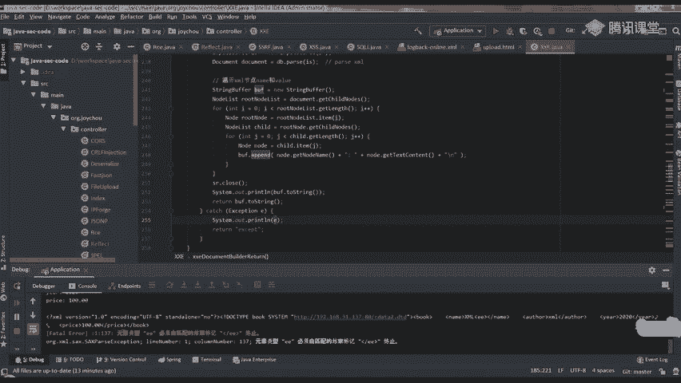

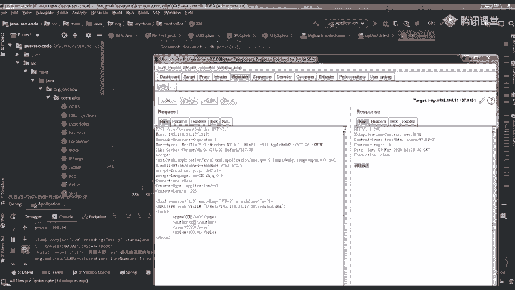

一个元素类型了。然后他说你必须要以它为中，就是来终止这个元素。所以说这样的话就会报错。

那怎样进行一个就是让他不报错呢？就是使用我们这个。

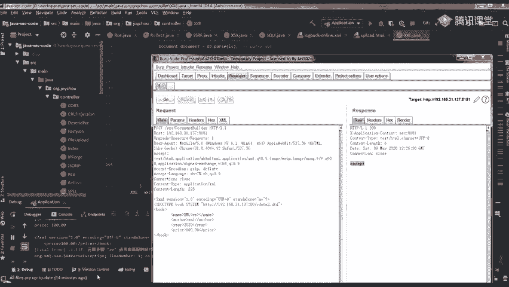

实体编码吗？编码之后，它就能进行一个正常的。前示解析出来。这这个的话就是左键括号，这个是连接符号。然后右边这个的话就是大于号。嗯，与之对应的就是与这个PCd对应的话，就是这个Cd。

它是指的是不应有ch mail解析器进行解析的一个文本数据。它里面的所有内容都会被解析器所忽略。嗯，下面有进行一个解释，在叉m元素中，小于号连接符号是非法的，小于号会会产生错误。

因为解析机会把字符解释为新元素的开始。刚才也有说连连接符号也会产生错误。因为解析机会把该字符解析为字符实体的开始。某些文本等等。为了避免错误，将脚本代码定义为CDATPA。它的语法是由这个开始的。嗯。

这里有一个注意事项，就是CDATA部分不能包含。字符串。就是不能包含它的这个结束标志，也不允许嵌套CDATA部分，否则导致异常的闭合，从而涉及信息报错。然后它结尾的这一个也不能包含任何的空格或者是画行。

我们可以直接来看一下吗。就是在这边。这个lamb这儿我们使用这个。这种语法这种形式来将我们这个数据进行一个包裹。你可以看到它回显，这儿就不会报错，而是直接将它进行一个回显给我们就不去进行一个解析了。

不像前面一样，就是遇到左键括号，它就会会要认定要有一个闭合的。因为这是叉 mail的一个语法嘛。你如果不闭合的话，它就会报错。那在这儿的话，你使用这个。

左间括号感叹号中括号CDATA然后中括号里面这可是它的一个数据，然后再用两个中括号间括号包裹起来的话，它就不会对它进行一个解析。从而有一个正确的显示。为什么说这个呢？就是为什么会说这个CDIA呢？

因为我们后面有一个地方就是说。因为叉叉一它有一种危害，就是可以去读取文件内在文件中可能会存在那些。比如说这种左键括号这种连接符号啊。这样的话，我们就可以通过这种形式来让他不对里面的内容进行解析。

而直接回写给我们。这是后面的内容。嗯。我们接下来往下吧。往下的话就是一个重点了，就是我们D滴D的一个实体。他其实是包括。它的实体的话包括几种类型。第一种的话是这个内部普通实体。他的声明是这个样子的。

左键括号感叹号entity这个实体。然后接着实体的名称，然后双引号里面是我们实体的值。他引用的话。就是这就是这个链接符号，实体名称以及分号。我们可以看到这个下面这张图。那在这儿的话。

我上面这个橙色的圈圈里面圈住的就是一个实体，它的名字就叫这个8，然后它的值是word。在我们这个下面进行引用的时候，就是hello，后面进行引用的话就是一个连接符号，大家看清。嗯。嗯。这样的话他就会。

就是进行一个引用这种形式来进行一个引用。前面这个的话是它的一个element，就是它的一个元素嘛，这个就是它的一个实体。然后我们通过这种方式进行一个引用，我们就可以引入我们滴滴滴里面的一个。就是。

定义的一个实体。其实我们可以理解为就是一个变量嘛，在这儿它定义了它的变量值是这个word。然后我们在这个文档内容里面对它进行了一个引用，对吧？然后回显给我们的话就是hello word。如果对这个。嗯。

稍微就是加一下的话就是。我们稍微做一个。思考的话。可能如果我们大量的进行一个嗯。我们如果大量的进行一个引入的话，引用的话。就可能造成一个ddos。内在热的话就是。我们首先在这里定义了一个实体。

它是word。然后接下来这些的话，它就分别就是分别去引入了。这个在这个T一里面，它引入了两次这个b。然后在T2里面，它又引入了这种。引入了4次这个T一，然后在T3里面的话就引用了5次T2。

就是承重指数型增长。最终的话我们去进行一个引用。引用的话，它是引用这个T3。所以它引用的时候，它去显示的时候它要一层一层解析，一层一层解析的话，这样其实是很后非。服务器的一个资源的。所以如果搞不好的话。

就可能会把它搞崩了。嗯，这样是。这是一个稍微在商家思考思考之后，可能会想到的一个点。第二个的话就是外部普通实体。外部普通试题的话。和我们前面那个内部互动视频。它的区别就是从这个后面之后嘛。

就是这个system，然后或者是这个public之后的这个内容。我们内部的话就是这个Nity体实体名称，然后实体的值嘛。在这里的话是有一个stem systemtem或者是这个public。

来进行区分的。这里的话有说明这个stem以及public的一个区别。大家看一下。就好，然后我们平常用的话，直接用这个4就好了。嗯。我们接下来往下。内在这的话，这儿它是定义了一个外部实体。

内在这个外部实体的话，它是引入了这个file协议，去引入了C盘下的windows。win改INI，然后在这儿对它进行了一个引用。最终他回显了我们这个。

windows零点INI里面的文件里面的一个内容回写给我们。这个可以给大家。演示一下。C盘下的。嗯个。😔，は。嗯。嗯，这个是不回线的。在这的话，它就会有一个。就是这个数据有回线给我们。

这个内容的话就是这个。这个文件的一个内容嘛，对吧？那前面其实我们也有提到，如果说我们引入的是。Oh。嗯，可以看到它其实会有一个报错。

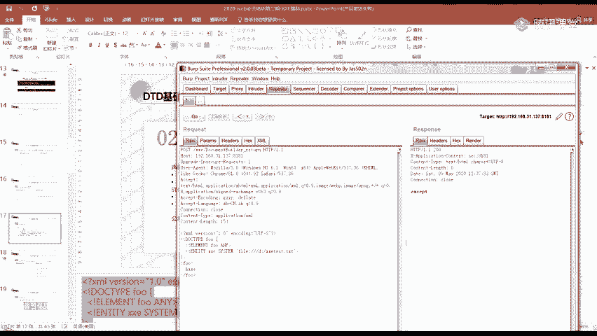

就是在就是说你融乐实体hello单位声明他，你们可以去看一下我D盘，就是引入了这个文件里面到底是些什么？

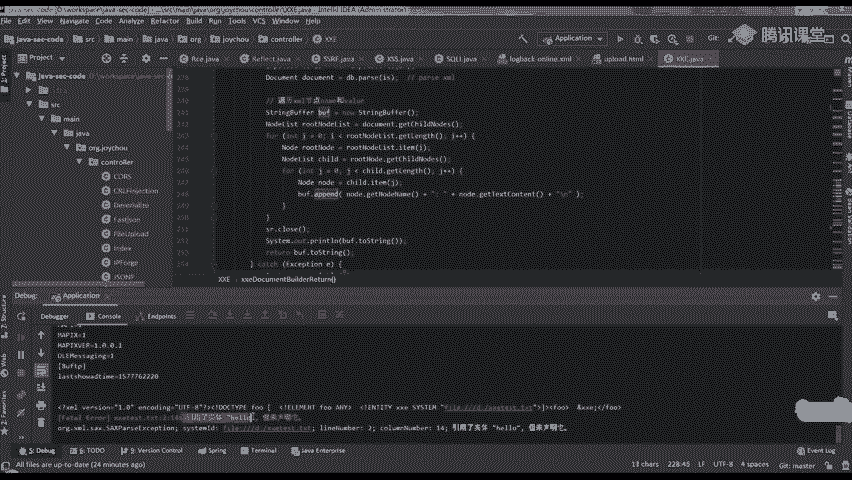

嗯。内在热的话，他就其实是对它进行了一个解析。然后以为它是我们引入的一个引入的一个内容。然后说。

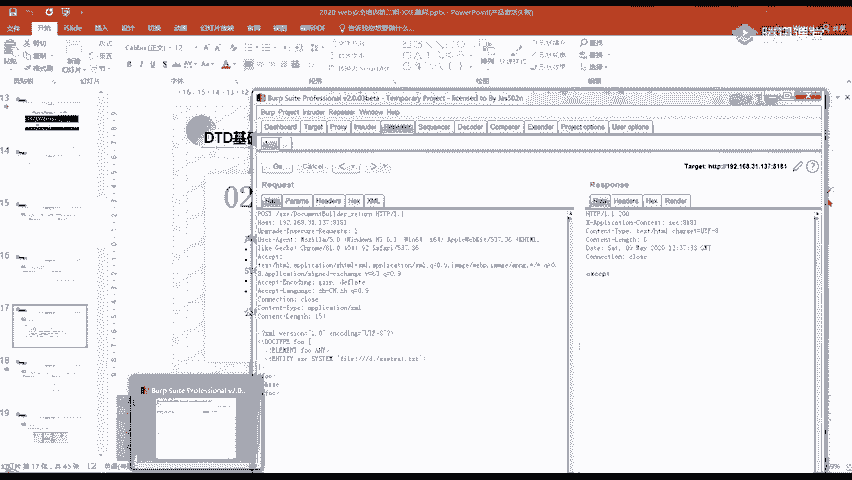

然后说你这引用了这个试题，但是我们没有声明它，所以说他就报了一个错。

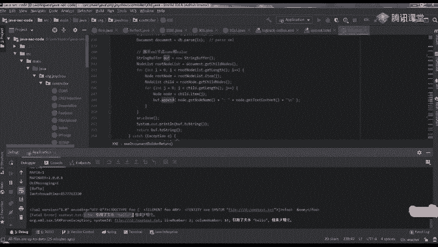

嗯，哦对我们所有的实体进行引用的话，你首先是要进行一个声明的。就是你在这儿进行了一个声明，然后才可以进行一个引用的，否则就是会报错的。因为他不知道你去这个引用到底是引用的内容是什么，在哪，它就找不到。

所以它就会报错。所以说我们要先进行一个声明。嗯，下面这个的话其实是我们PHP里面的一个一种形式就是。我们大家还记得吗？就是我之前其实也有跟大家说过，就是这个PHP的一个为协议这个feer。

然后read等于进行一个base64，就是以base64加密的方式进行读入。然后它的一个文件流的话就是这个D盘下的叉加一点text。TXT TXT。这个文件这样的话，它也是能进行一个读入的。

因为这样的话它就没有那些特殊的一些字符了嘛，对吧？但是这个是PHP文件里面独有的。像如果是说。

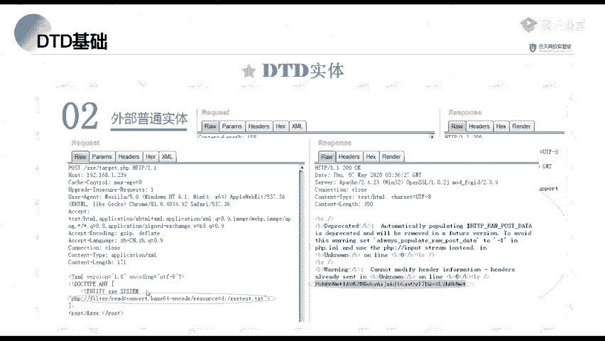

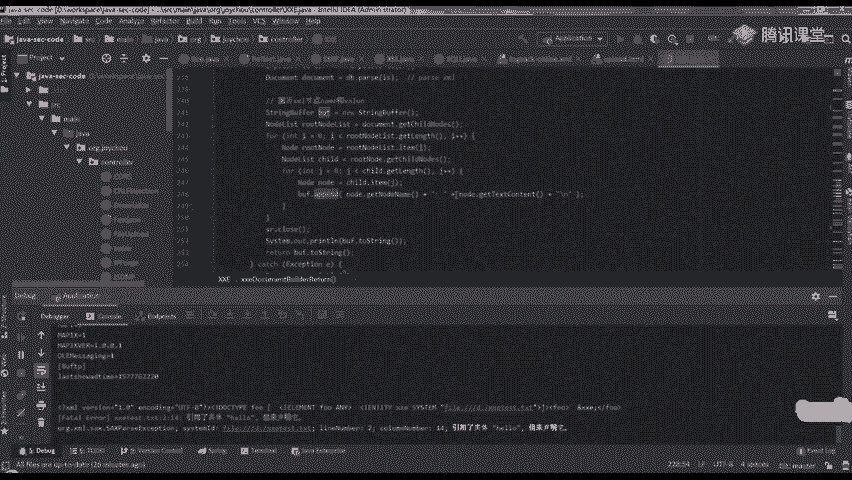

抓瓦这种的话肯定就不存在PHP的一个威胁义。嗯，然后对它进行解码之后，也能看到这个文件里面的一个内容。我也可以给大家。演示一下。这里也有一个包错。就是我们。可以来看一下这个原来吗？

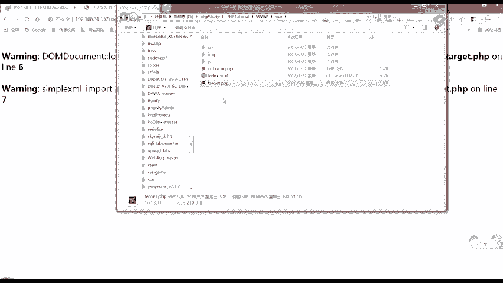

这个的话其实就是在我们。PHP里面进行解析一个常用的一串。程序吧来对我们传入的1个叉L进行一个解析。内在这的话，它是通过该。get contents通过PHP input，大家还记得这个微音吗？

他是不是就是需要把我们的一个文件流。

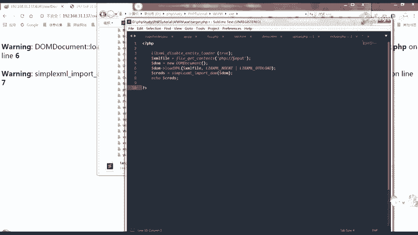

然后重定向到我们的这个。请求题里面来。所以在这里的话。我们就把它的叉M。文档写在post。在请求题里面。让他进行一个。谢实。

嗯，这读入之后就是存到这个t mail file。然后。这些就是对它进行一个解析，最终一口出来就是回显给我们嘛。

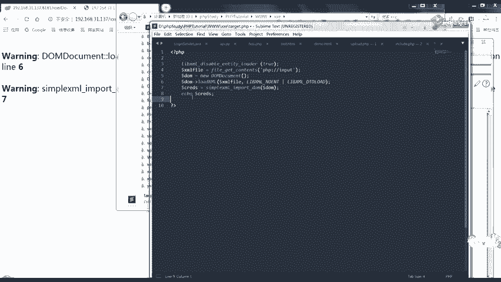

们可以。够一下，那在这里的话。他就会有这个。这是一个睫码。嗯。这是PHP语言这种它提供了这种为协议嘛。所以我们通过它的一个为协议对它进行编码的话。就没有那些特殊的字符。那如果是我们。

jarava这种程序里面没有PHP这为协议的话。那应该怎么办呢？嗯，我。这一张图的话就是就是说如果我们不使用这个PHP filter的话，直接是使用这个file进行一个那啥的话。

就是读区的话去进行一个引用。然后服务端那边进行解析的话，它就会报这些错误。也是说这个hello没有被定。没有生命。嗯。😊，嗯，这里就是给大家列举了一些各个语言引用外部实体时支持的一些协议。

我们刚才就用了这个fio协议。然后HTB协议其实也用了。对吧。这个三偶协议HDB协议。PHP吻协议。嗯。😊，这是他们在引用外部实题的时候。就是这个stem标记的这这个后面。它的值的时候。

它可以使用的一些。便宜。它其实还还有一些扩展，比如说PHP里面。他还支持，如果你装了这个扩展的话。如果你装了这个。except这个扩展的话。它其实就能达到一个远程代码执行。的一个效果。

但是我这里没有没有装，所以嗯他就会报一个错，他也不是默认会就是默认它是没有装的。折破绽。嗯。还有其他的一些语言点点net，然后这个他们支持的一些协议。嗯，我们看到这张图的话。

其实就是用我们之前说过的那个。CDI贴让它不进行一个解析，然后。然后从而就是不报错嘛。我们可以来。就是来尝试一下。嗯，我到这边吧，这边查试。嗯，他其实还是会有一个错误。

错误是说你的文档结构必须从头至尾在同一个。实体里面。这个是什么呢？这个我其实就是。我们可以看一下这个DTD这个部分。它是在这个or这个。实体中把start while以及and依次拼接起来。

然后在这个file里面引用了一个外部实，就是这个file的话就是一个外部实体。它的内容就是第一。就是叉Etest点TXT里面的一个内容。然后是这样进行一个拼接，但是大家可以看到，这样其实是会出错的。

他会不错。所以说这种形式是不行的。那有什么形式就是能让他。就是在转瓦中也论包含中。里面存在特殊字符的一些文件呢。这个时候我们可能就要介绍这个。参数实体。我我说了这么多了。就类似差什么的什么？嗯嗯。

我不知道你在说哪个地方。嗯，可以这么理解，嗯，可以这么理解。我说我讲得快不快，然后你们能接受吗？你说点我。嗯。这个就是这个外部普通实体证这种方式来查看他那边服务器那边的一个文件。这种方式大家就是这。

我刚才说的这个大家明白吗？就是嗯吗。我把它放大吧。就是这个大家。梦啊。以及下面这个PHP的这种使用它的尾型意。这种形式。我在下面有说它的这个应用外部实体的时候，它会支持这些协议吗？

所以说它就存在我们如果它存在叉加一漏洞的话，其实这里的话他们都是存在一个叉加E漏洞的，然后才会。就是让我们去进行这样的一个引引用，就是引用外部实体。然后回显给我们，这其实是一个叉大一漏洞的一个利用了。

就是跟服务器的关系有点搞不懂。什么东西跟服务器的关系？搞不懂。不服务起的话还是有点恐怖。嗯。文具。我前面给大家说介绍这个的话，大家其实不用在意啊，大家。只是说你就。正常的。

如果这个网站就是这个UIL它存在。叉叉叉叉叉一漏洞的话，它就可以进行这样的一个利用。然后至于它服务器那边，它到底是怎么写的，以及是怎么样进行解析的。大家其实暂时可以先不用管它。嗯。

只是我在这里就是用到了，所以就给大家简单的说了一下。这个后面这个参数实体的话就不记就不就不讲了吧，到下一节课再讲吧。因为大家好像没有没有太听懂。就是跟佛线还是有点空。嗯。

其实可以不用不用在意我这它服务器。其实在这里的话，我就是。启动了这个。这个项目，然后这里面自带了一个。tomca，所以他就能通过。这种UIL的形式进行一个访问嘛。那在这的话，它其实这个代码就是在代码这。

它是存在这个漏洞的，然后能让我们。这里的话演示的时候就是演示这个外部试题嘛。它就能让我们进行一个利用，因为它没有进行一个很好的过滤，以及它这个这边它解析的时候也没有嗯不允许引入外部实体等等。

所以在这里的话它是存在漏洞的。在这里的话，我其实是对它的一个进行了一个利用了。然后。利用的话它引用引用外部实体的时候，它又是允许这些协议的。所以在这里的话。就。用了这个办偶协议去读取。嗯。

他那边的一个文件。如果是linux。程序的话就是这个服务搭载领域分项的话，你就可以去多ETC然后password这个文件试一试。

这边的话可能就会会显出ETC passwordword就是服务器那边的一个文件给我们。文件内容给我们。有点明白了的感觉了，就是服务器引用了typemail。

我们只要利用pamail的这些代码就能相对的控制不些了。什么。嗯。嗯。你把这个你在这里把这个去掉，其实都没有关系。应该。我试一下。啊，这里是一个。嗯，你把它去掉都没有关系，这主要就是这个实体。这个部分。

然后你在这里申进行了一个声明。这个是他的一个声明嘛，然后你引入的时候。他这边就有一个回险。大家如果没有明白的话，可以去做一下那个实验。就是我前面发的那两个预习的实验。大家可以去做一下。

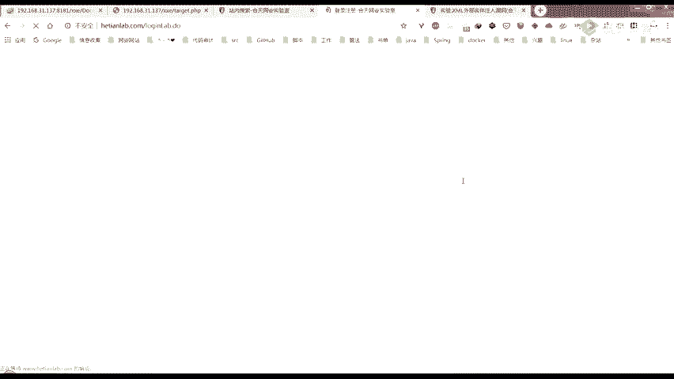

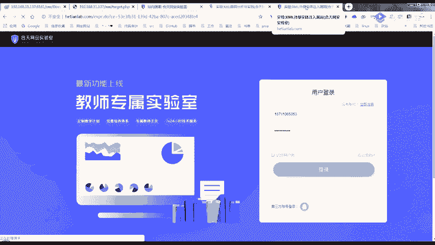

嗯，在这就说三杀一注入能做什么？嗯，其实这个的话是它的一个利用啊，只是我在这边的话就直接这样给大家演示了。不然嗯我说了这么多，大家也不知道这个有什么用，或者是跟后面的有什么联系。

所以我就在这儿就给大家说了。嗯。大家听懂了吗？有什么疑问吗？暂时没有。就是服务器嗯，我刚才回答你了吗？老陈子，我是不是还没有回答你啊？就是不用去行动了XL，我们只要利用XL的这些代码。嗯。嗯，对。

可以这么说，就是服务器引用了叉M。对他对这个插门文档进行解析，但是他又没有进行一个很好的处理。就是在这边。其实我们漏洞总而言之，言而总之，是不是就是我们后台没有进行，除了逻辑漏洞，逻辑漏洞也算吧。

就是其实就是他后台的一个代码处理过程中。有一些不严谨的地方，或者是一些逻辑的一个错误一些问题，然后才存在的这个漏洞。所以在这的话，他如果没有对。就是在代码中没有进行一个。修复就是一个防御的话。

我们就可以利用这种形式对它进行。一个。利用。因为在这个实验里面有说他能做什么，就是任意文件，就是任意读取读取任意文件。然后。SSF。boss攻击远程命令执行。这个SSI还没有给大家说。

然后远程命令执行的话其实。就是刚才也有给大家说，暂时提了一下，就是使用那个扩展那个。except那个扩展，如果装了的话，你就可以用那个。嗯，就是在这嘛就直接改为except冒号。

两个斜杠后面的话就是你要执行的一个命令。嗯。大家还有什么问题吗？我待会把PPT发到群里面吧，没对PDF发到群里面。没啥问题啊，那其他同学还有问题吗？如果有问题的话，就扣个一，我可以等你。

如果没有问题的话，就扣个2。嗯哼，大家还有问题吗？怎么没有人说话？2。嗯。😊，我给大家过一遍吧，就是今天讲的一个内容。

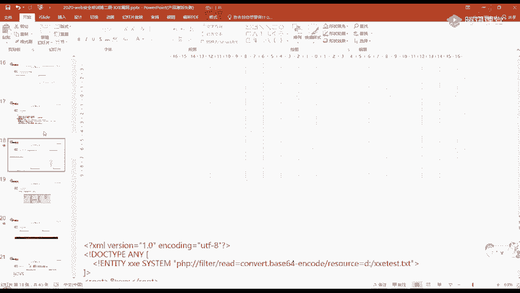

嗯，今天首先讲一下这个叉 mail，它是它的一个语法。它是怎样进行解析的？那在这的话，我们就是直接在这个post这输入了我们的一个。嗯，查m文件文档数据。然后在服务器那边进行解析之后。

我也给大家看了一下，简单看了一下它这边的代码就是传入过去，这边接收过来嘛，接收过来进行解析解析之后。然后在这个代码里面的话，它就是在这个下面有回显给我们。所以在这里的话就有一个回显。

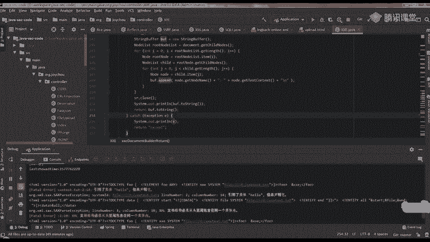

嗯，这个是他处理的一个流程。接下来的话给大家介绍一下这个叉mail语言的。一个语法。再接下来的话就给大家讲了一下它的一个文档结构。文档结构中就引入了这个提到了这个DDD。内GDE的话。

它其实就是对我们叉ML它那个文档元素。的一个约束。然后说了一下D滴D的声明，就是你要先有声明，然后再有下面的这些东西嘛。所以在这里就有这个声明。当然你没有，就是这个DDD没有的话，也是OK的。

这一种的话就是内部声明。然后下面这一种这一种的话就是直接我们用这个思想。去引入外部的1个DDD文件的话，就是一个外部的声明。我们声明的话是在这个。1。239的这个CD。DATT2里面进行一个实明的。

所以就叫一个外部声明。然后在DTD里面的话。嗯，这个是它的一个类型。这个的话就是表示它会去进行一个解析。所以说你要需要对它里面的一些特殊字符进行一个实体编码。那如果你用这个进行一个包裹的话。

用这个CDATI进行包裹的话，它就不会进行一个解析，而是直接回显给我们，就是直接就不处理忽视。嗯，就不会报错。接下来的话就给大家讲了一下。这个重点这个才是重点。其实前面的那些大家。可以先不用太在意，嗯。

是这个DDD实体，然后它分为这个内部的一个普通实体，以及外部的普通实体，外部的。普通视力。那在外部实体的时候。在这儿的话，如果他代码中没有进行一个很好的。呃，编写就是没有进行一个防御修复的话。

它就可以我们就可以用这种方式在外部实体收加这个fi协议去读取它的一个文件。然后在这个文档元素中，对它就是DTD里面的这个声明进行一个引用。然后它最终会回旋给我们。嗯。我今天讲的就是这些内容。

大家还有疑问吗？其他其他同学呢？嗯，然后在这的话，我是给大家说了，分别在dva下面daw的话，它是可以用这个fi协议的嘛。然后我们PHP里面其也是可以用fi协议的，也是可以进行读取的。

但是对于如果你要读取的那个文件里面有那种特殊字符的话，它不是引用的时候会进行一个解析吗？从而进行报错吗？啊会报错吗？所以这个时候如果你是PHP程序的话。

你们就可以用PHP为协议来对它进行读入的时候进行一个b64编码，这样的话能进行一个正常的解。嗯，正常的嗯回显给我们这边的话，因为这里的话，它就是直接读入之后回显给我们嘛，所以他这里就回显给了我们。嗯。

把他的文件内容回写给我们。那如果他直接在我们PHP中直接使用fao协议进行读取的话，也是不行的。所以说要怎样才能。就是不报错呢。就会用到我们。后面要说的。这个参数实体。然后参数识例的话。

我们就下节课再说吧，再讲再给大家讲。那到这里的话，大家还有什么问题吗？那如果没有问题的话，那今天就先到这儿，然后明天。明天准时见。嗯啊，不对，明不是明年。后天后天。😊，然后大家可以去学习一下，去就是。

提前学习一下先。做做一下这两个实验吧。

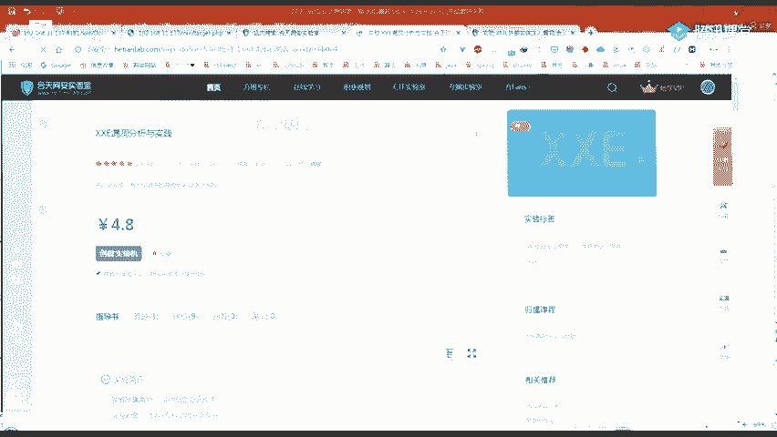

明天不见嗯。那如果大家没有什么问题的话，那今天就先拜拜啦。那我就下课了。大家再见。