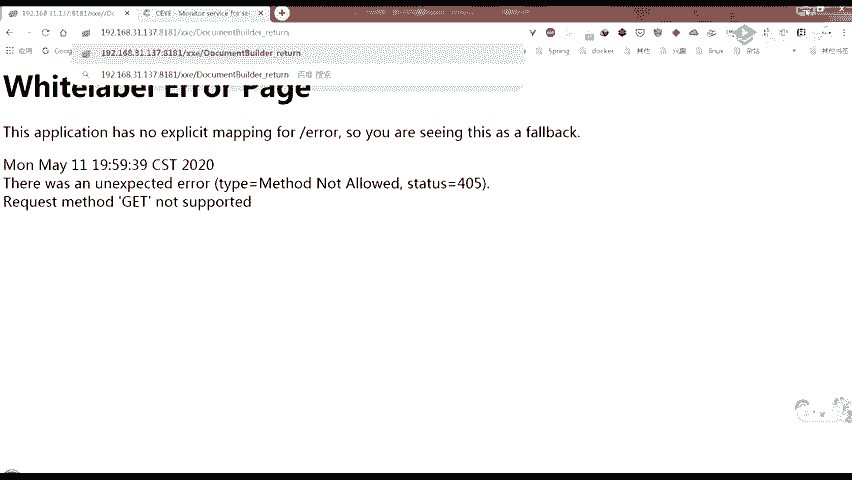

# B站最系统的护网行动红蓝攻防教程，掌握护网必备技能：应急响应／web安全／渗透测试／网络安全／信息安全 - P43：web安全-19.XXE利用 - 跟小鱼学安全 - BV1SF411174M

hello hello，大家好，大家能听得到我说话吗？😊，好的。😔，嗯，今天稍微迟了一点。😔，然后大家作业有做吗？就是。前天说做那个。😔，实验来着。大家实验做了吗？嗯，可以。😔，好吧，那话不多说。

我们就先讲今天的一个内容吧。嗯，因为今天有同学就是说让我讲一下这个命令执行，所以在这的话就补充一个，就是在PHP引用外部实体的时候，它支持了一些扩展。就是在这边。这些。那这个就是最下面这个的时候。

当我们的目标机器安装并加载了PHP的。expect这个扩展的时候就可以执行系统命令。然后它的用法是这个样子的，后面加上了我们是这个命令。嗯，那在叉ML中的话，你在这个外部实体这就用这个后面加这个ID。

如果它装的话，它就会回显我们的1个UID给我们。嗯，这个是简单的介绍了一下。😔，然后昨天是讲到了。😔，参数实体就讲到了这儿嘛，对吧？就是我们是想说，如果是java里面的话。

然后我们要包含的那个不是包含要读取的那个文件，它里面又有含有特殊字符。我们这个时候想要用用这个Cd这个东西把它包起来，然后读出来，看看能不能把它读出来。但是这时候它就包了一个错误。

说ch mail文档结构必须从头至尾包含在同一个实体中。嗯，这个就是他不允许将内部实题和外部实题结合使用。所以在这里的话，它这样是不行的。所以接下来的话我们就先来看一下参数试题。

然后参数实体这边它的声明的话就是这个样子的，它分为两种，一种是内部的一个声明，一种是外部的声明。然后在内部的话，这里它这个值是实体值。它中它相比前面的就加了一个这个百分号嘛，对吧？

然后外部的话就加这个system，然后后面是它的1个URL。嗯，可以看下面这张图里不是对。下面这张图里面。就是在这个DTD中，这里这个上面这个框框这个椭圆的话，它就声明了一个实体，是一个参数实体。

它用百分号，然后空格，然后它的实体名称就叫这个parpar entity。后面是它实体的一个值。接下来下面的话，它就声明了之后，在下面进行了一个引用。一用的话，它是跟我们之前的那个实体是不一样的。

我们之前的是使用连接符号，然后这种形式来进行引用的嘛，它这里的话是使用这个百分号。然后NTT分号来进行一个引用。最后在我们云文档元素里面的话，我们去引用这个。跟真治体。所以他会回显这个BABR给我们。

嗯，右边有说明，就是说使用百分号实体名这里的空格，就是这个中间的空格是不能少的。然后在DTD中定义，然后只能在DTD中使用百分号实体名分号进行一个引用，它不能在这个像这个跟entty一样。

在文档文档里面就是文档内容里面进行引用。它只能在这个DTD中进行一个引用。嗯，我们可以看下一张PPT的话，就是一个对比。首先大家可以回顾一下，就是和上一节课一起回顾一下。就是首先在这个地方的话。

它是声明了一个内部实体，然后它的实体名称就叫nomal，它的值是hello。然后在这个lomo一的话，它是一个外部的普通实体。然后它的内容就是file。就是CwinwinII的一个文件内容。

下一行的话就是我们一个参数试题，是一个内部的一个参数试题。嗯，然后在这个里面的话，它的。里面的一个实体是这个内部实体word。嗯，下一行的话就是一个外部的一个实体，外部参数实体。

在这里的话就去引用了我们本地的9999端口下的C date点DTD。然后我们分别引用这两个这这两个。嗯，参数实体就是在DTD中进行一个引用的。接下来在文档内容里面，这里规hy漏又去引用了这个。呃。

PARA参数实体里面定义的这个内部实体，这就用它来进行一个引用了。接下来接着就是我们一个。普通外部普通实题的一个内容。所以回想到这边的话，就是hello word，就是这个的值。

后面的话就是我们这个文件的一个内容。内这的话，如果我们去监听这个本地的9999端口的话，也会看到就是也会有这个请求给我们。就是我们可以看到它请求过来的UIL是这个。嗯。这个是参数实体，它的一个。

简单的声明以及引用。那我们就回到之前说过的，我们如何让它来进行一个就是将我们的文件读取出来呢？首先假假如说是这个样子。这里的话就声明了一些。内部参数实体以及外部参数实体。

然后在这个or里面将它们拼接了起来。最后在这个文档元素中进行一个引用。就是把这个file第盘下的叉叉Etest点TXT放到我们这个CDATTA这个格式里面来嘛。然后在O里面进行一个拼接，拼接之后。

然后再进行一个引用调用。但是这里的话他报了一个错，是说参数实体引用这个百分之。Start。不能出现在DTD的内部子集的标记内。这个内部资金其实就是我们叉MO的DTD区，就是这个地方。

我下面这一段文字有说明，就是说参数实体必须定义在单独的DTD文档中。单独的DT文档就比如说是我们外部的一个，比如说我们前面那张。这这个这种就是一个单独的DDD文件嘛。

就是我们外部去进行一个引用的这种单独的DDD文件进行引用进来。或者是直接写在我们叉mail文档里面的一个滴滴滴。那前面那种就是单独的1个DDD文档的话，它就是。我们这个叉ML文档的外部字集。

然后后面这种就是这一种的话，就是称为我们叉ML文档的内部字集。但是我们引用的话只能在DTD文档中，就是只能在我们的一个单独的DTD文档外部子集中，而不能在我们叉ML的DDD这个地方，这是它规定的。

所以那这样的话，我们其实是不是就可以说我们是不是只要把它的这个引用。放到一个外部的单独的一个DTD文件中。然后我在这个地方，就是在。就是把。嗯。😊，就是把这一。行放在一个单独的。嗯，DTD文件中。

然后在这儿的话，我们新定义一个另外的一个外部实体，外部普通实体。然后它的UIL的话就是我们这个我们把它放到一个单独的DTD文件的一个路径，这样的话是不是就可以进行一个引用了呢？我们来看一下。😔，嗯。

可以看到在下一张PPT的话，我就是这么做的，就是把这个放到一个单独的。1个DDD文件中，然后在这儿的话新定一个。我这边是新定义了一个参数外部参数实体。然后在这里的话。Yeah。进行了一个。😔，调用。

这个调用的话，其实在这儿的话就是这个百分号DTD这个这个地方，它其实就是声明了我们这个哦这个实体，它是为这个的，就是把它们拼接起来的一个内容。然后在我们文档元素里面再去进行了一个。调用。

最终的话他就会将就是这样回显给我们。嗯，大家有听懂吗？就是说我们原本是打算这样直接把它拼起来的嘛，就是直接在它的1个叉ML的DTD文档里面，然后把它们拼接起来。但是这个时候的话，它会报错。

就它提示说参数实体引用不能出现在DDD的内部子集中。那所以这样的话，我们就可以把它的这个参数实体引用，放到外面来放放到一个外部单独定义的一个DDD文件中。这样然后在这个地方我们先把这个DDD引用进来。

就是调用调用。这个时候我们调用完这个百分之DDD分号之后，就对我们这个or实体进行了一个声明了，就已经有这个or实体了。所以在我们这个文档元素里面就可以用这个连接符号or分号进行一个。

引用最终的话它就会有一个回显给我们，就是我们这个D盘侠叉叉一test点TXT文件的内容。大家有听懂的吗？如果听懂的话，就打个一。是我掉线了还是怎么着，为什么没有人理我？😔，好蛋了。😔，嗯。不难不难。😔。

你啲。😔，就是有个问题，那我直接。😔，在。😔，Yeah。嗯，我刚才不是说了吗？你是说这个样子吗？就直接这样吗，那不是会报错吗？就是他规定不能这样子。但是我们可以这个样子，就是把它放到一个单独的一个外部。

它的一个叉L的一个外部字集中。然后在这里的话，我们去引用进来。就不要太。😔，听好。好吧，哎我我刚才其实想说。😔，那这样子的话。😔，这样可不可以了？我们来试一下。😔，就是。😔。

然后我现在这IP变变成了131。😔，13。し？看一下可不可以。😔，嗯，这个也要改。嗯，必须有正确的符号组成。😔，好吧，这样是不行的。😔，我们去看一下，看一下这个日志里面有没有。就为他。😔，来访问了。

但是他并没有。😔，就是他并没有回显给我们。😔，他访问失去访问了。你看一下CDAT3是什么东西。好吧，你这样就不行，他并没有。😔，会显给我们，还是说元素内容必须由格式正确的字符数据或标记组成。哦哦哦。

我这是一个。我这是一个外部普通实题，然后我去在这个里面定义了，又定义了一个内部实题，这样是不行的。还是得加这个百分号。就是。把它定义成一个参数实体这样子。才行。嗯嗯。我刚才只是试了一下。不理解。

咋能这么行。😔，嗯，这个待会会说这个待会会说。嗯，我们接着往下走吧。还有另外一种形式，就是说我们可以把这个它引用的东西放在外边。但是我们只要只要只要是它引用是在外边，它那个前面那个。

就是这一串不是说嗯只能在DDD文档中及及外部资集中吗？就是它的引用只能在。我们的外部子集中。所以的话我们也可以把刚才那一整段放到一个外部的一个子集中。

然后在这的话我们去进行一个引用引用DDD这的顺序是不能乱的。你先要引用了这个DD滴，然后再去引用这个or。因为你只有引用了这个D滴滴把它引用进来了，才才把我们这个or给的它的一个声明给引用进来了。

然后你在这边再进行一个引用的话，它才能把它引用进来。最后在这里的话，我们就。嗯，将我们这个file在这个地方输出。嗯，这样也是可以的。

其实只就只要是把我们的一个嗯引用放在一个外部的一个单独的文件中就可以了，对吧？嗯，我们接下来讲叉叉一吧。叉叉一的话其实。嗯。

它的一个定义叉叉一就是叉 external entity及叉L外部实体注入攻击发生在应用程序解析叉M输入的时候，它并没有禁止外部实体的加载，导致攻击者可以通过叉M的外部实体获取服务器中本应被保护的数据。

那它产生的原因是在文档类型定义的部分，可以引用我们外部的DTD文件，所以这里就可能会容易出现安全问题。叉M解析器解析外部实体时支持多种协议。

比如说fi协议可以读取本地文件内容使用HTP协议可以获取外部资源等等。这个我们上节课以及刚才也有就是用到，因此，攻击者可以构造恶意的外部实体。当解析器解析了包含恶意外部实体的叉M类型文件时，便会导致。

たらい的。就是这个漏洞。我们接下来可以看一下它的利用场景。叉战一的话其实它是分为有回显以及无回显。有回显的话，它就是可以直接在页面中看到我们pilo的执行结果或者是执行的现象。那。😔。

他也可以说就是带内XMM外部试体及攻击者可以放送。带有叉叉一有效负载，这个有效负负载就是我们的那个排lo的请求。并从包含某些数据的外部应用程序中获取到响应。其实简单来说。

其实就是它是会回显给我们我们发送了我们嗯的一个piload的过去，它会回显给我们。那无毁显的话，它又称为这个blind叉叉E可以使用外带数据通道提取数据及带外叉ML外部实体。OOB杠叉叉1嗯。

这个这两个大会都会说。漏洞发现。首先的话可能是需要寻找能够接受我们叉ML作为输入内容的一个端点。我们其实可以去可以发现就是。嗯，我们的一些比如说最简单的一个登录的一个地方。

它不是有username以及password嘛？主流的话可能就是用jason来一个来进行传输数据的那这个时候如果你把它的那个请求方法，HTP里面的一个请求方法就是这个。嗯，请求方案就是。哎，我在说什么？

这个这个请求方法就是那个get post，有的时候你把它改成post。然后我刚才要说的是你把这个HTP头部里面有一个content type字段。把它改为。这个。😔，这个application。

然后杠叉 mail，它如果是一个jason格式的话，它可能就是obplication，然后obly。application，然后后面是一个jason格式嘛。所以如果你把它改为一个叉ML的话。

它或许也能够进行解析嗯。嗯。看看陈复去是否解析了发送的内容。如果解析了，那么可能会存在叉叉E的漏洞。第二个的话，如果站点解析叉ML就可以尝试引用实体和D滴滴。如果可以引用外部实体则存在叉叉一漏洞。

我们可以看一下，首先是找到叉ML内容的输入点，然后检测叉ML是否。能被成功解析。那在这儿的话，我就直接用我自己搭的一个这个来进行。演示在这的话，我就直接输入了usnamehello。

那这的话它是成功将我们这个hello回显给我们，就是将我们这个叉M。这种数据给解析了的。所以接下来的话我就可以尝试看看它是不是可以引用外部实体。嗯，可以看到下一张就是这张PPT的话。在这个地方。

我是定义了一个外部的参数实体，然后它的。这个。😔，嗯，UIL的话是这个C。CI点IO里面提供了一个拍ro的。这个大家之前有去用过吗？应该。有吧。就是这个东西。嗯，就是这个他会给我们每一个人分发一个域名。

然后在这个拍lo的话，它这里其实就有一个这个叉mail实体注入。我就直接把这个复制过来，然后把这个地方把它的这个。这个域名改为我们自己的一个域名就好了。然后你在这个HP。request that就会有。

回旋如果他能够解析的话，就是存在叉叉E漏洞的话。就像这边这样有一个回钱给我们。就说明他存在这个叉叉异漏洞。这个大家应该没有什么问题吧。如果没有问题的话，那你就扣个一。O。接着往下降。

将这个叉叉E的录利用。那这边的话，本地文件读取其实已经前面有提到，就是如果是有回显的传染一的话，我们就有三种方式嘛，就是这个file。中直接进行读取。如果是PHP程序的话。

我们还可以使用这个PHP的一个维协议进行一个读取它的一个文件流。然后当所读取的函文件包含了。这种特殊符号的话，使用。C date然后利用的话是我们外部参数实体。啊，这个就不多说了。

那这儿有一个需要就是可能需要注意一点的地方吧，就是。有些菜没有解析它是支持列目录的，就是直接把目录给列出来。那我们前面的话就使用这三种的话，都是我们已经知道我们要去读取的文件是哪一个文件。

然后才能进行一个把它就是读取出来嘛。那有些叉m解析库的话，它是支持直接你在后面输入一个目录。然后他就可以把目录下的一个文件都回显给我们。然后攻击者可以通过列目录读文件。

然后获取账号密码后进行进一步的攻击。比如说读取这个tomcat杠 users点t mail，得到账户密码后，登录tomcat的manager部署web shell嗯。这个后面大家就看一下就好。

主要主要是主要是知道他有时有些的解析库，它是支持列目录的。嗯，接下来的话就看一下无悔血的叉叉一。大多数情况下，服务器上的chal数据处理后并不会灰显。所以即使是漏洞存在我们的piload被解析了。

但是由于没有输出，也不能得到数据，所以我们也不知道到底他有没有这个漏洞。因此我们就可能想要。想要利用的话，就必须找到一个不依靠其回显的方法，就是外带一个数据，把我们把我们想要读取的一个数据，或者是它的。

一个文件内容。比如说这说本地文件读取的话，就是一个文件内容发送到远程服务器上。它的利用思路是通过外部DDD方式，可以将内部参数实体的内容与外部DDD声明的实体的内容拼接起来。嗯。

利用拍lo的来从目标主机读取到的文件内容后，将文件内容作为UIL的一部分来请求我们本地监听的端口是不是看不懂。哎，没关系，我们一步步来看一下。就是刚才那个思路的话，其实并不是。嗯，大家可能就这么一说。

可能不能接受，所以。就我们慢慢来。那首先我们如果要读取一个本地文件，本地文件读取的话就是要读它的一个服务器那边的一个文件的话，我们肯定是要先定一个实体的。

然后它的值是用我们fi有协议来进行请求本地文件的一个内容，对吧？这是肯定要的，就是。嗯。😊，然后第二个的话，我们是。Yeah。我们是需要定义另外一个参数实体，将它引引用进来。

就是我们要把它的那个file协议读取出来的文件内容作为我们UIL中的。比如说在下面这张图里面的话，就把它作为A值后面的一个内容，就直接把我们这个file files，就是这边定义的这个参数实体。

然后在这边引用进来。然后在这里的话，所以如果我们去监听了这个9999端口的话，就能看到我们这个fis。然后就是这个。嗯，Cwinwin点II里面的一个内容，本来是应该这样的对吧？

然后我们在这个DDD里面对这个send进行一个引用。引用之后，在这里又对这个fis进行了一个引用。但是嗯可以看到我们监听就是这个监听这个9999端口之后。

可以发现它这里ges后面这个A就直接是等于百分号fis就没有对它进行一个解析，就没有把它后面的这个内容拼接上面来拼接到这里来。嗯，这的话是因为几乎所有的叉ML解析器都不会解析同级参数实体的内容。

它们两个其实是同级的。所以你说你在这儿声明了这个send。然后你在这个send里面又去把这个fis给引用进来，它是不会进行一个解析的。因为他们俩是同级，那我们就会想，那要是不同级，可不可以呢？

就把我们这个东西。嗯，可以看一下下面这种就是说参数实体也可以嵌套定义。当两个参数实体不是同一级时，我们可以尝试调用一下，就是下面这一张图。内在这儿的花。😔，嗯，可以看到在这个start就是。我用个壁吧。

就是在这个start这个。参数实体里面。然后他的。值的话就是我们有一个就是一个实体。另外一个参数实体，这儿的话是对它进行了一个呃编码。然后这的话有一个send，然后system是一个外部的。

在这个地方的话，对它进行了一个引用。对这就是。对这上明的这个files进行了一个引用。所以这样的话就当就把它们变成了不同级。因为。这个start明显是比这个。start是只有我们start声明了。

才会有这个send。然后这个send里面它的值才是这个。File。就是才会对这个file进行了一个引用。所以说这儿的话，他们两个就是这个start以及这个files，他们两个是不同级的。现在那这样的话。

我们可以进行一个。就是引用试一下。我们就直接先把这个。Starter。引用进来引用进来之后才有这个send的一个声明。然后有send声明之后，我们就可以对它进行一个引用。对吧。嗯，我们这样运行之后。

但是它这样还是不行，它还是会有一个报错，就是说。参数实体应用就是这个百分之。fis不能出现在DDD的内部子集的标记内，这一个报错是不是有一点熟悉，就是我们刚才才说过的那个对吧？

它不能出现在DDD的外部子集的标记中，那就可以是。外部自析啊，对吧？就我们前面说了那么一大堆，嗯，大家应该就懂了吧，也是因为这个限制，所以前人就想到，既然内部不行，就引用外部的DDD试试。

现在就在把自己的服务器加入到我们DTD文件中。我们那么看一下最终的一个结果。嗯，可以看到。这张图里面。这张图里面的话，我们其实就是将我们前面的那一个把它们放到了一个外部的DDD中，然后在这个。

这边进行了一个。引用。对吧然后我们去监听这个。8998这个端口的话。我们直接是用python杠MHTV server8998这样简单的提了一个服务。起了1个HTP服务，然后监听8998。然后在这儿的话。

我们就可以看到，其实就会有它的一个。他就把这个D盘下一点TXT就带出来了，就是这个hello word，这个后面是我一个中文的感叹号。嗯。😊，我这么说，大家有听懂吗？嗯，我这还给了一个注释。

就是说假如我们的HCB它带不出数据的话，你可以尝试一下FTP。FTP的话就是HFTP服务F如何起开启它呢？就直接使用这个python杠MPYFTPDlib杠PP后面就加上你的一个端口就好了。嗯。

这个大家有听懂吗？就是我现在说的这个我会显得。那个编码是实体编码吗？对。嗯，其实我这的话。大家有看到我这其实和就是和前面的可能不一样。这的话我是直接将。直接将这个D滴滴放在我们这个。

dooc type four这就是引用，这个就是一个DDD的一个外部声明嘛。这样的话就没有一个就是那个enttT，就是没有这个关键字，这样的话可能就会绕过一些wa。嗯。嗯。大家还有问题吗？

就主要是使用这种方式。就将我们的file先定义出来嘛。首先是肯定是要把我们的file给定义出来，就是用一个参数实体派漏的把它定义起来。接下来的话，因为它们不是不能是同级的。

所以我要把这个拍 load放到一个另外一个ang里面。所以在这里的话，我就把它放到了。这个trick。这个里面来，然后在这个trick里面，它又是一个嗯。外部参数试题。在这个后面的话。

就直接将我们这个拍lo的引用进来了。所以说这样的话，我们的这个现在我们的这个int以及这个payload，他们就不属于同级的了。但是我们如果是直接这样进行放在这个里面进行引用的时候，他就会报一个错码。

报那个不能出现在DTD的内部子集中，就是不能出现在DTD的一个文档里面来。所以这个时候我们就把它。放到一个外部的DDD中。对吧。这个百分之啊不是什么这个连接符号井号37和我们前面这里有一个。这个是嗯。

这个是连接符号井号X25，它们两个是一样，只是这个是用16进制表示的，所以它前面有一个X嘛。都是这个版分号的一个编码。大家还有什么问题吗？这儿有听懂吗？如果听懂的话，就打个一。如果没有听懂的话。

就打个2。Okay。没有人理我。😔，是卡了吗？是延迟了吗？一好的，那我们接着往下讲。嗯，这个也是一个本地文件读取。然后在这的话，这一张图相比上一张图的话，其实。就是我们把这个DTD这个。这个。

放到我们这个entity里面，就是放到这个嗯DOC type里面来了，就放到这个里面来了。然后在这个里面进行了一个。引引用就是不对，不是引用，这个是声明吗？这个是声明了这个DD滴的一个。嗯。

外部参数实体。然后在这进行了一个引用，接下来就引用了这个。in这个。然后再。有这个send。发出去。所以在这里的话，我这儿是使用了这个PHP filter这个为协议。

然后将我们这个C盘下windowswinNI读出来。嗯，这里就是这个东西，就是这个。P等于后面的这一串内容，接下来就可以把它拿去进行一个解码。解码之后得到的就是它的那个文件内容。

因为为什么会就是要这样呢？因为有时候使用。使用这种方式，它带不出来，就是它不会有数据回显给我们。所以如果是为了稳妥的话，大家还是可以就是把。它声明为一个外部参数实体，然后这样进行一个引用。这是两种方式。

我们接下来往下走，就是主内网主机探测。如果我们是已经知道了它的一个内网的一个网段的话，我们是不是就可以对它进行一个内网主席探测了。怎么操作呢？其实就是在我们bp里面的那个爆破模块。inruder嘛。

就是那个intro那个模块，然后将我们后面这一个字段，就是比如说这里是192。16。1。239，我们就将它设置为一个变量。这个这个是什么意思？应该大家都懂了吧。就是我们我们是在这申明了一个外部普通实题。

它的内容就是这个，然后在这里进行引用的话，就会有这个就是去访问我们的这个HDP192。168。1点。这个内容的80端口对吧？嗯，然后在这设置拍lo的时候，我们就将它设置为1到254嘛。然后步长数为一。

我们可以就是最后我们start就是开启攻击之后，我们就可以通过这个lenance来进行一个判断，看我们就是它是不是。存活的。嗯。😊，如果是无回线的话，我们其实就可以通过。也是这种形式，就是这里是一。

但是这个时候因为它是无回血的，我们可以通过它的一个响应时间来进行一个判断。你可以看到这边其实是差不多是21秒的样子。但如果是一个存活的一个主机。的话，195这195说前面这里。这里扫出来的。

所以我就直接用195试一下。这样的话它其实才。一秒都不到，对吧？就回显给我们了。所以说它的这个。时间是有一个很明显的差别的那这样手动的话肯定是很麻烦。所以大家可以写一个脚本来进行一下判断。

判断的条件可能就是根据它的这个时长。来进行一个判断。如果自己不会写的话，也可以去网上搜一下，比较多。也。嗯。其实类类似于这样的话，就是内网主机探测的话，就是这种形式的话。

是不是也就可以对它的端口进行一个探测了？对吧我们如果知道这个192。168。1。195是存活的，这样的话我们就是在后面加一个冒号。我们这个时候就把后冒后面这个端口号把它设置为一个变量，然后进行一个爆破。

你爆破的话，只要爆破那些常常用的一些端口，或者是一些危险的端口就好了，嗯，对吧？当然这个应该也没有什么问题吧。这个需要演示一下吗？那现在的话，针对我这个子网的话，就是服务器那边它的一个。呃。

网段的话就是192。168。31嘛，点1嘛，从一开始从1到254嘛，它的一个网段是对吧？然后在这里进行一个。叉叉一进行一个引用。现在看一下。😔，发送到 intuder。😔，然后把这个声明加一个。

这个大家应该都会吧。对吧这个排lo的选程。😔，members从1到254，然后步长为一。嗯。这个县程你也可以设置一下。然后就start开开始攻击就ok了，就完事了。应该不难吧。如果你是需要对他的一个。

端口进行。爆破的话，比如说是。😔，嗯，是是。😔，45端口，然后。😔，爱的。😔，接下来在这的拍入的话，你就可以把它设置为。simple list，然后从你自己的本地进行一个添加也行。

添加的本地输入的一些端口，常用的端口也行，就是这样来进行一个。判断。这个大家都懂了吗？后面的从这个周二中上传excel，导致叉叉遗漏的话，我们就下节课再讲。嗯，然后因为我就是把这个PPT修改了一部分。

所以说你们要现在新的吗？还是之前的就可以了。因为我昨天哦不对，前天给大家发过一份嘛。要，新的是吧？好，行。嗯，现在56了，大家还有什么问题吗？就是关于今天的这些内容。可能就是这个地方会稍微有点难度。

就是无会县需要。把他的数据外带出来的这种形式的话，大家可能就有点难接受。但是。不知道现在有没有。就是明白了。后面前面不用跟。😔，嗯，这个其实你跟与不跟都无所谓，因为它主要是是为什么呢？

就是你主要是要把它的这个数据回显给我们就好了。然后你这边如果是监听的话，我们可以其实可以看一下。就是我们PHB study去进行一个。记录的时候，它的一个logsaccess点log。嗯。

看到它在这里的话，其实就是会记录整个它的1个UIL除了它前面那个跟。就是。比如说这个的话就除了这个之外，它后面的这一节从叉叉一开始，这个后面的这一节都会记录下来嘛，就把它。

就是访问的这个UIL请求的这个UIL给记录下来嘛。所以说你这加一个问号与加不加问号，其实都没太大区别，主要是能把它的一个数据给带出来就行。

对吧。我这么说，你听懂了吗？然后大家今天的一点。😔，今天的作业的话。😔，大家可以去做一下这个实验。这个叉叉一把掌。嗯，大家觉得作业要交吗？如果。😔，嗯，还是就是。嗯，大家就稍微教一下吧，就就随便写一下。

让我知道你就是去做了这个实验，然后。嗯，就行。交的吧嗯。交了吧，那你前面就是今天的不对，前天的怎么就没交呢？😊，那你们就好吧。😔，作业给交上来给我看一下，就让我也知道下次一定。

但我也知道你们就是做了好吗？😔，嗯。😊，今天的内容大家。还有什么问题吗？如果没有什么问题的话。我们就可以下课了。然后明天见。明天还有一节课，后天还有一节课。实验做15分钟，把它写到文档里有2个小时。

为什么为什么要两个小时啊？😔，啊，你是想把它总结出来是吗？还是怎么着？嗯，总结的话你可以如果你没有太多的时间的话，你就直接把最后你做完之后的那个截图截个出来，然后发个文档给我们班主任。

然后班主任发发给我就好了。如果就是你时间不足，如果你想总结。然后觉得嗯就是时间也够的话。其实总结一下是对自己的学习也是一种巩固嘛，就还蛮好的，你就可以也可以就是。就总结了再发给我。

你也可以就是等你有时间了，总结自己进行一个总结。但作业的话你就发一个。最后的一个截图给我就好了嗯。好吧，那今天就先这样啦。😔，那大家明天见。

