# B站最系统的护网行动红蓝攻防教程，掌握护网必备技能：应急响应／web安全／渗透测试／网络安全／信息安全 - P44：web安全-20.XXE修复 - 跟小鱼学安全 - BV1SF411174M

嗯。王者耀。

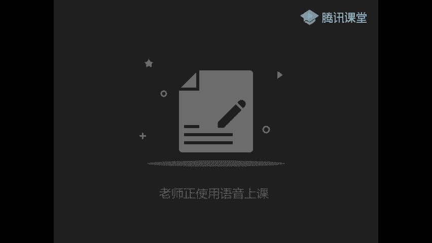

嗯。嗯。hello hello hello hello，大家能得到我说话吗？😊，我一直忘记把这个给打开了，然后我以为你们能听得到，就是音乐，结果发现就我一个人在这里听。好吧。嗯，今天为什么就只有。

4个人呢嗯。其中一个人还包括了我。然后今天的话就是我们查查一课程的最后一节课，你们开不开心学不兴奋？我开玩笑了。Yeah。嗯。你们打一是有延迟吗？不是后天不是明天还有吗？对，明天就就是那个课程嘛嗯。嗯。

对，明天是课程。考核。嗯，课程考核的话就是在。那个靶场同样是这个地方。

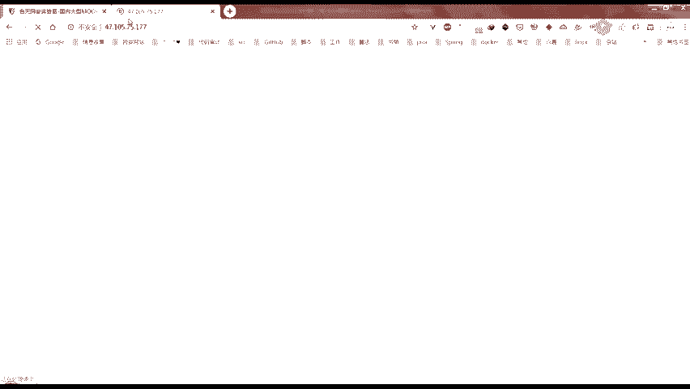

在这个传染一传染一暴动。这两个的话其实还挺简单的，我上课都有讲过，然后你只要能登录进去，它登录进去的话会有一个什么什么locking success就可以了。

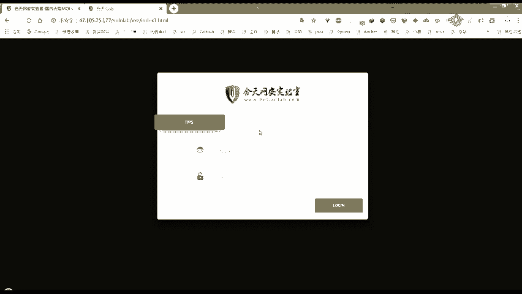

然后今天的话就是将继续将我们叉叉一的一个利用。一个dva中上传excel导致叉加一漏洞。前几天有1个CPF比赛，大家不知道大家有没有就是去看一下，或者是去了解一下。

其中一道题的话就是考的这个就是考的这个专二中上传这个excel导致拆拆一漏洞，然后来进行一个读取文件。那我就开始从现在开始今天的一个讲课吧。云。嗯。这里是说如果我们的网站上面它存在一个上传的功能。

而且是支持上传我们这个excel格式，就是这个必须是这个XLSX格式。的那么就可能存在叉叉一漏洞。它是怎么它的过程是怎样呢？就是我们首先新建一个excel，就是这个表格把它。就是重命名。

它的后缀为ZIP，你就可以看到，其实它就是有比较多个的叉ML文件组成的。那在这儿的话，我们是通过更改这个就是你变成GIP之后的这个叉M mail。

就是这个content types点叉M mail把这个里面的内容改成。这种形式。这个的话大家应该都明白什么意思了吧，就是这儿就。这就是1个DTD的一个声明。然后里面有一个test外部实体的一个声明。

最终在我们这个文档。内容里面进行了一个引用。所以在这儿的话，如果我们进行监听监听这个9999端口的话。就是我这就是用这个python起了一个简单的HCB服务，然后它的端口是9999，所以在这的话。

它就会有一个请求发送过来。就是那边你上传之后。啊，这个当然你要把它改为这个XLSX格式，就是你更改之后，我们把它变成CIP格式，就是变成这种压缩报的格式。是为了把它的这个叉ML文件读语出来嘛。

然后把里面的内容给改了嘛，改了之后保存之后，你要把它改回去，改回去。然后回到我们一个上传的地方，把我们这个文件上传上去，上传上去之后，如果它后台进行了解析。就会来请求我们这边起的这个服务。

9999起的这个服务。嗯，这里也有说，如果服务器成功解析后，公积机则会接收到服务器的请求。嗯。

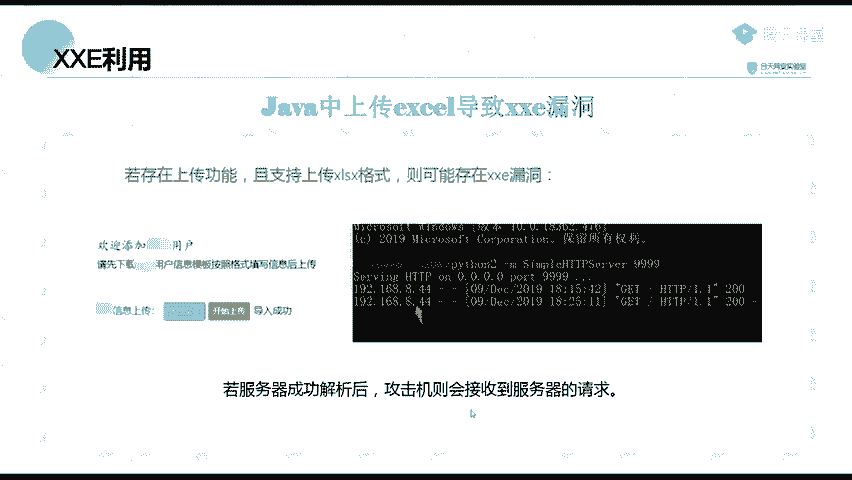

然后我们实验室的话有一个这样的实验，我就带着大家来看一下那个实验。

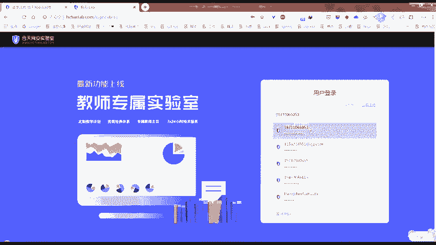

这个大家有什么问题吗？嗯，我就只是给大家简单的走一遍这个流程，然后它里面的这些。典理的话我就不过多介绍了。首先他这个任务一的话是出现在在这个。阿帕奇POI这个组件里面。然后任务二的话是出现在。这个。

这个包装。嗯。总而言之，言而总之就是因为他们。的包里面进行了一些解析。然后。没有过滤掉我们的实体，所以从而能够导致。解析我们的类代码。

那我们来看一下。就是给大家。演示一下。

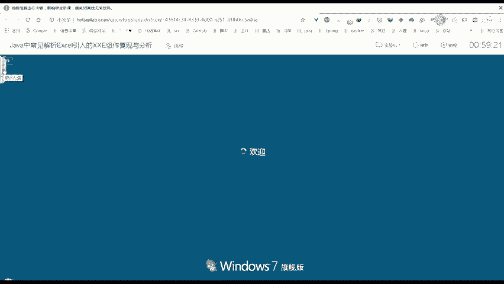

嗯，把一个lip把它起起来。你没有去做这个实验吗？就是这个。drava中常见解析excel引入的查查一组件促现分析这个实验。应该没有去做。

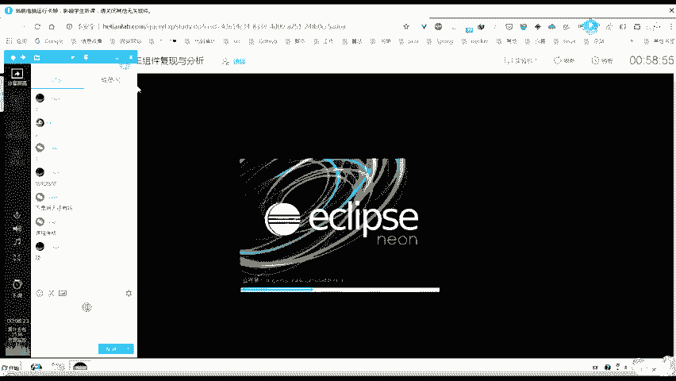

那我就拿这个阿帕奇POI这个。来演示。嗯，这里的话它是他因为这没有一个上传，它只是在这个程序里面，所以它就写死了，写死传入的是我们这个C盘下的t一这个。这个。

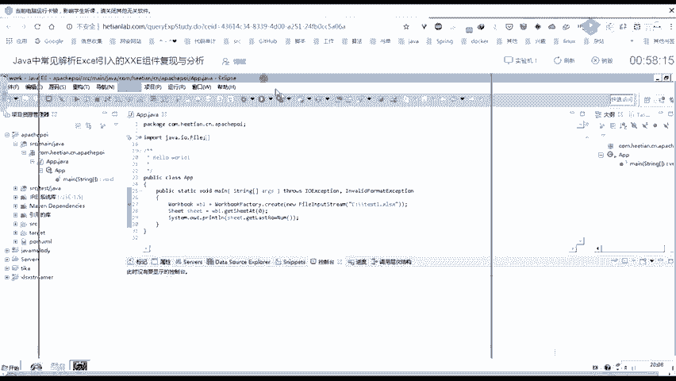

excel文件我们来打开，把开看一下嗯。嗯，我们看一下这个。文件。你可以看到他在这个里面。他默认的话，我在这先。我在我自己本地创建一个。听el。然后再。哦。你可以看一下他默认的是怎样的。

他默认就是这个样子的，然后这是他的一个声明嘛，拆也没有文档的一个声明，它是。就是实验中，我们这个实验中这一块是我们自己加进去的，加到这里。然后这个的话它就是直接去。访问了我们本地的880端口。

然后带的参带的那个UL路径是叉叉1杠test，那我们本地来进行。先听。这个就是一个监听的一个命令。我们现在把它集起来。嗯，他说我刚才没有把他。改回来。😔，把它改回来。然后再运行一下。你可以看到。

在这里的话，它就有我们这个请求。的包都给我们了，就是他带的参数是这个。查查一刚t这样子。嗯。所以说如果我们。就是如果碰到一个有上传的。地方，然后他他又允许这种格式的话。

我们就可以尝试把它改为一个压缩包文件，把里面的那个contents。typescont types那个ch文件。里面改成。刚才的那个内容看一下它是不是能进行一个访问。那如果是要访问外网的话。

就是我们也可以通过我上次给大家延示那个这个嘛。

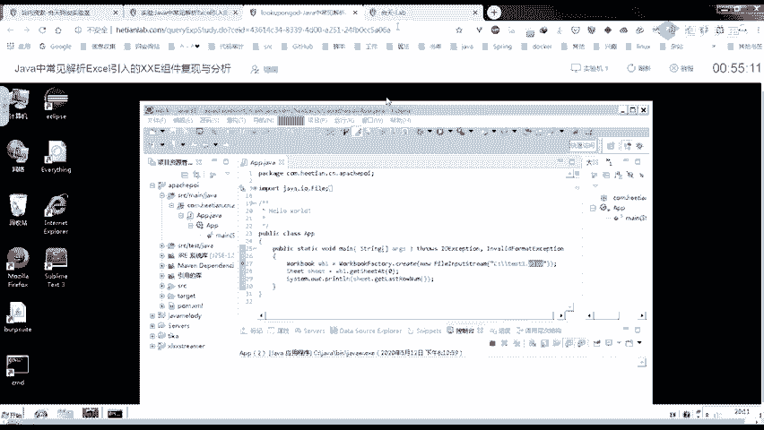

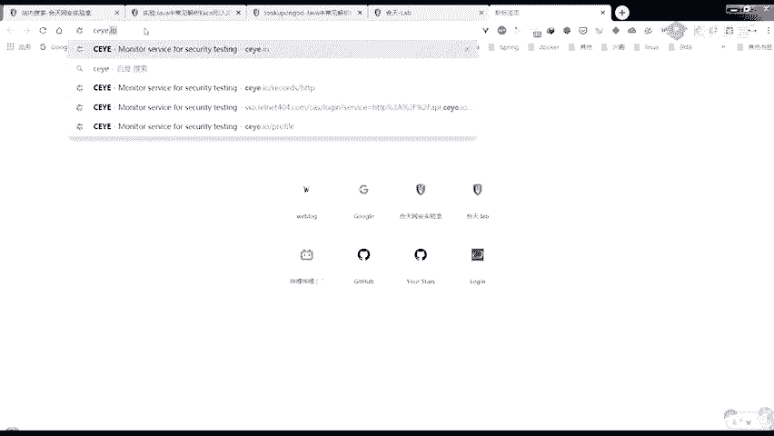

把他的那个UL改为我们自己的一个域名就好了，我这就不登录了。

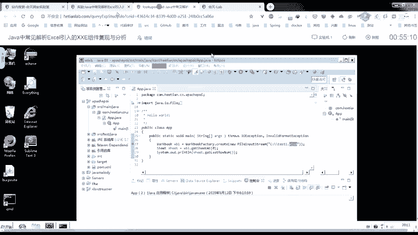

然后。大家这个有什么疑问吗？应该没有吧。如果有疑问的话，就扣个一。如果没有疑问的话。今天之后。然后再什么攻击。嗯。比如说他都。

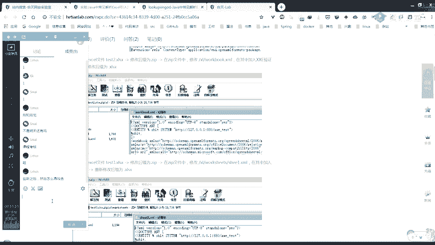

他都能他都能把他的一个。都能来主动请求我们自己我们自己这边的服务器了的话。

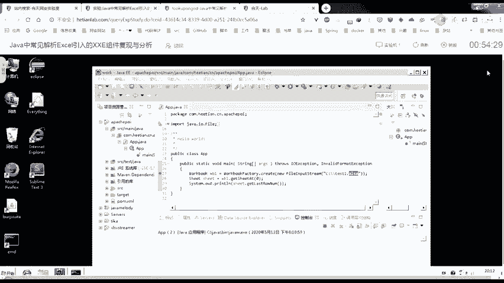

那是不是把他的数据灌带出来，就是像前面就其实和。前面那样。读取数据是不是就其实是一样的？对吧就是这个样子，只是你把这一个部分。嗯，那个。这种形式只是你把你把它放大。

只是你把这一个部分就是这个DDDTD声明这一部分放到了我们这那个。excel文件的那个叉ML里面去了。然后你这个。这个DTD文件的话。

就是你自己可能他那边就是服务器那边能够访问到你的一个网址的1个DTD文件。的一个地方存放的一个地方，然后。位置就是这样子的，就是。这个。都和大家说过了，其实。嗯。😊。

所以这样的话也可以进行一个本地文件读取啊。都是可以的，像就是说的那个。那个CTF题目的话，它其实也是就是你上传这个文件之后，你要把它的那个它的flag不是在一个文件里面吗？

我们要把那个文件里面的数据带出来，然后你在这个。对然后中就可以把它读出来，然后提交就OK了。Oh。嗯，自己创建的上传不了。好吧。😔，哦，对了，给大家分享一下那个。我们不是无回想的时候。要把数据带出来吗？

那如果是真实的环境的话，可能需要一个。能够外网能访问到的一个。域名，但是如果我们只有一个内网，当然你们有服务器的话，就当我没说。然后。有一个。有一个叫做NG。嗯，就是这个东西的话。

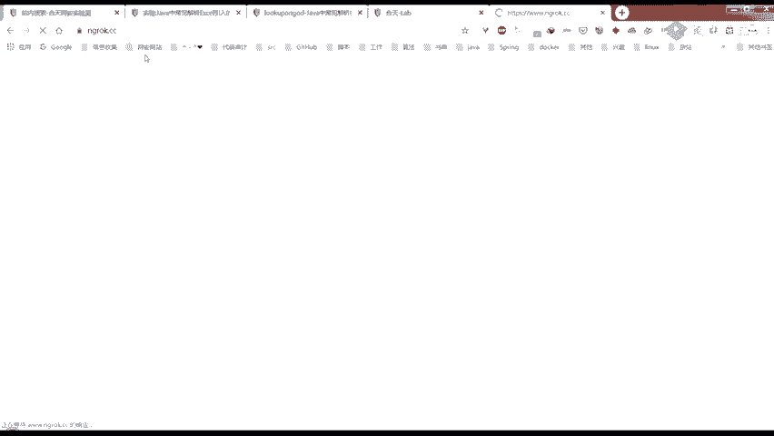

他是有一个。想这么一。

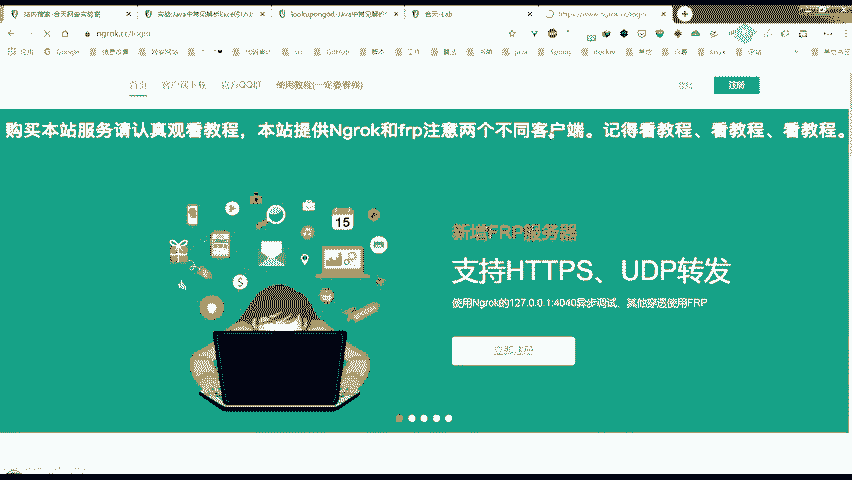

有一个免费的。这里隧道管理开通隧道。在这里立即购买，这个是个免费的吗？然后协议写到名称，算名称，你可以。嗯，随便填。然后这个前置域名的话，就是到时候你生成的那个域名的最后一集。然后这个本地端口的话。

比如说我的就是。这个嗯然后你这个本地端口这里可能需要注意一下，就是你要把这个端口设置为不和你其他的一些。端口冲突的一个端口。比如说80端口的话，可能就和你本来的一些服务的端口相冲突。

所以说你就把它改成一个，你平常不会就是你没有服务绑定到的一个端口，然后确认添加。然后确认开通就好了。开通之后，它在这里的话，它会分配给我们一个这个域名。然后它是映射到哪了？映射到我们本地的那个我们刚才。

绑的那个本地端口就是。这个本地端口这儿。然后这个时候的话可能要起一个time cat blue或者是。提一个。其多服务。你就去官网，其实我有写啊，我直接把那个。打开给你们看就好了。嗯。嗯，你们看得清吗？

我好像不能把他。哦，可以。😔，嗯，首先就是注册页这个我现在我现在在说什么，大家知道吗？我现在在说就是如果你没有买服务器，没有自己的一个服务器，然后你又想可能这种无会险的叉一怎么办？

就是能让外网能够访问到的一个地址，然后又能存存自己的一个。文件。就可以用这个这个的话，首先去注册一个账号，然后这里开通开通之后，你要选这个HTP，然后它的域名，然后它的前置域名，它的本地端口。

这个本地端口是跟你。就是之后你如果是用tom cat的话，就是跟。那个是进行一个绑定的。然后隧道管理这里有一个ID，就是这个地方它会给你1个ID，然后它有一个赠送的域名，就是这个地方。

接下来你可以把这个客户端下载下来，下载下来的话就是。里面你解压之后，就是这两个文件。

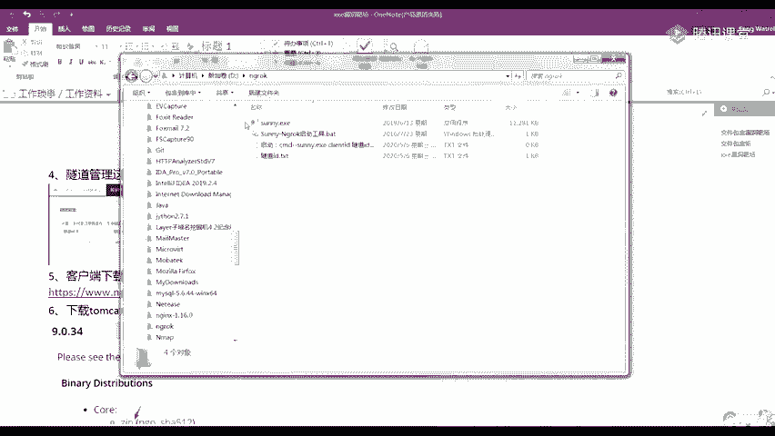

嗯，你就可以把它。

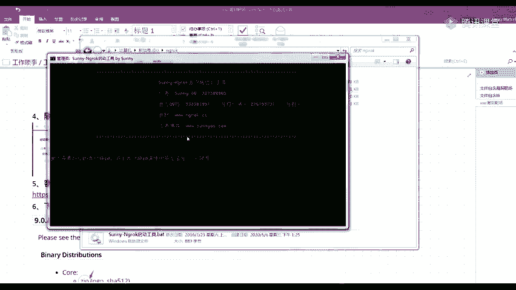

就直接运行这个BAT文件，在这儿输入你的那个这个客户端ID的话，就是你的隧道ID。

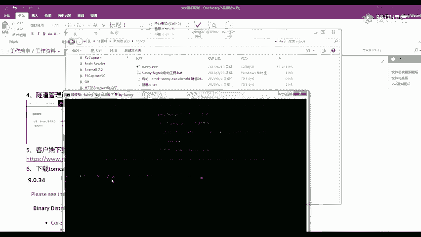

嗯，接下来的话可能就要下一个timeca服务。那链接就是这个。你上一个，然后ZIP的，然后把它解压修改里面的这个。修改里面的confi。server点叉 mail。😔，嗯。你就是把这个加上。

这个的话主要是为了能够记录你的一个。日志就是你的那个访问别人访问过来，你不是要外带数据吗？所以你到时候它外带出来的一个数据就是在。这个loglogs目录下。这个目录下。的这个文件也可以去看一下。

后面跟的是你具体的一个日期。第二个，你要把你的1个HGB端口，就是这个地方改为你在那时候。这里绑定的这个端口就是比如说我这设置是8998的话，你就要把这个端口。这个po pro。

proto我不知道读就是这个HDB这。的对应的这个端口改为8998。那我这儿就是选的8181，所以我就不用改了。嗯，然后再把它启动起来，启动起来的话就是在be目乳下。的这个。😔，这个文件把它齐起来。

起起来之后，你看到这个就是这个start server starting多少多少毫秒的时候，就说明你已经把它启动起来了。然后你把你要先把它启动起来，然后再运行它的这个启动工具。嗯。

填入生成的一个隧道ID，然后浏览器进行一个访问。这个访问这个域名的话，就是它分配给你的那个。域名，然后我这里是404，是因为我把那个。就是阿巴鸡汤开团。这个里面的文件都给删了，只剩下这一个。

所以它找不到index啊，它不是默认去会去访问那个index嘛，我把它都给删了，所以就。他这里就是有一个找不到404，如果没删的话，默认会出现他们开的一个主页。接下来的话就。在我这里是9。0。

20这个版本。就是在这里这个地方，因为它运行的话是直接它去访问。的1个UIL的个目录是是是在这儿，就相当于于我们的3W目录下。是这个地方，所以把这我们的那个DDD文件。放到这个地方。

然后我们拍lo的发发送之后。就可以去我们那个logs。这个里面去查看一下他的日志。嗯。这样的话就把他的一个数据给带出来了。嗯，这样是如果大家没有。不起来。我今我今天是不是讲的太快了，然后。然后你们都。

不理我。😔，也不是就。我是不是讲的太快了，就是你们不知道我在说什么。这是什么？老陈子，你发的是什么？嗯，对。对，就是将这个换成那个域名。对。我刚才讲的那个主要就是为了外网能够访问嘛。

那大家还有什么问题吗？就。关于刚才的那个。这个。这个周二中上传excel以及我刚才说的。这个。这个文档到时候明天会发给大家，因为我上面写的是。嗯，写的是那个靶场的。那个什么，所以现在还不能发给你们。嗯。

我其实也可以发，我到时候直接把它复制出来就好了，这有什么呢？哎，大家还有什么问题吗？应该没有了吧。如果有问题的话，就扣个一。如果没有问题的话，就大个2。想知道一下想上传。会审格杀。什么意思？嗯。

他的内容肯定会审核，还有其他的吗？没有啊，我们普通人。把它上传上去，肯定不会像我们那样去把它改为1个GIP，然后。然后然后再看里面是不是有个什么，它把它下载下来的话，那就只是一个excel文档呀。

就只是一个excel文档而已啊。嗯。感觉大家应该没有什么问题吧。讲的还蛮简单的，今天。然后最后一个部分的话，就我们就继续往下推进了。最后一个部分就是开拉衣的修复，以及我们的一个练习。叉叉一修复的话。

方案一就是过滤我们用户输入的一个叉ML数据。比如说监括号，然后那个连接符号一些关键词这种。这个DTD的一个声命。一个关键词，还有这个NTD声明的一个关键词。或者是这种外部尸体。

这个stem和public这种形式。但是这种的话。嗯，不是很推荐，它有防22能够很好的解决。在rava里面的话，你只要加这三行代码。把它的这个dialydiy joke type这个东西设置为true。

然后外部普通实体设置为false，以及外部参数实体设置为foralse。java是这样的，然后在PHP里面的话。就是这个把它设置为住。不允许加载实体吗？它这么翻译过来的话，对吧？把它设置为主。

然后在python里面的话就是这个样子的，就是把这个resve entities等于for。

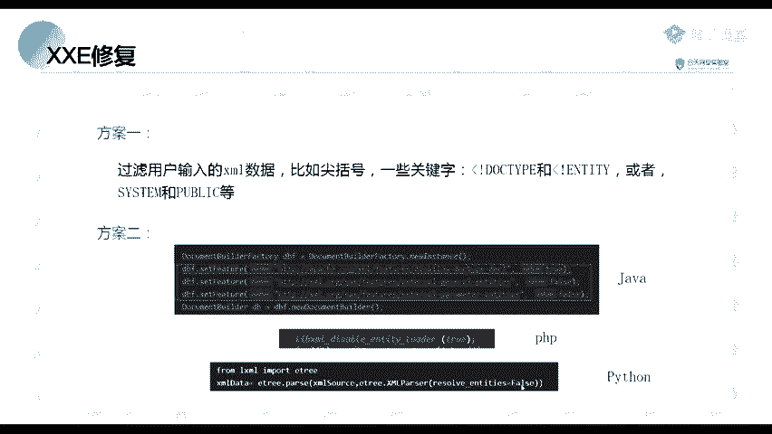

我们可以来演示一下。嗯，这个代码的话就是已经。修复好的。

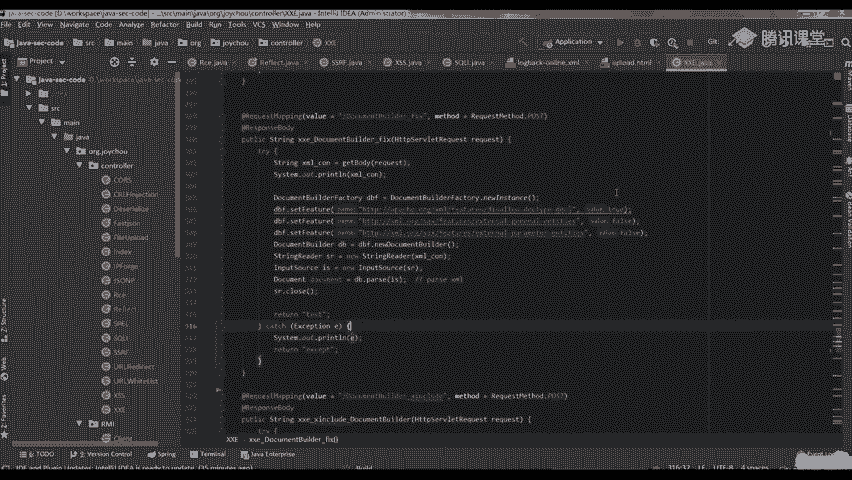

然后我现在在这边加上。我们前面。等那些拍漏的试试，我就直接复制过来。

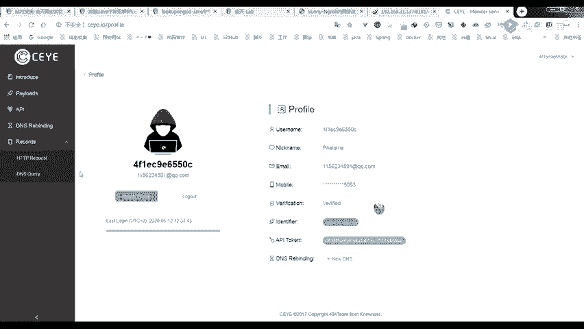

然后再做我个。这里的话它会有一个except，我们看。学市里面他会说文件提前结束。就他不会允许进到。对。他就已经结束了，就不会进行解析。嗯，可以看一下，这边也是没有的。

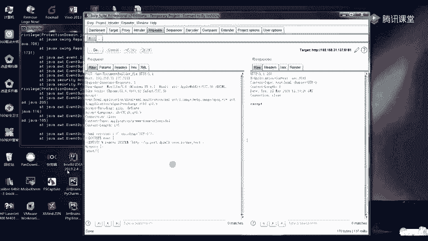

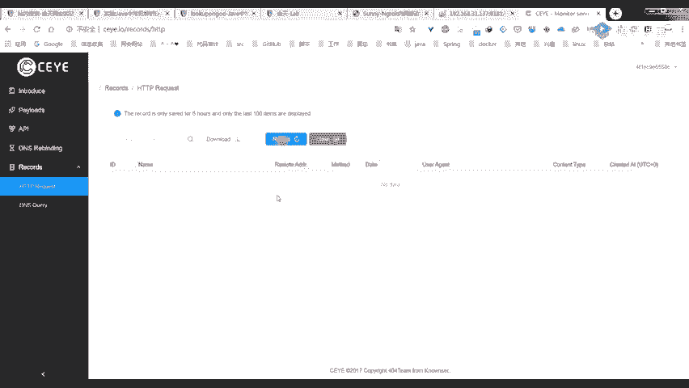

你在PHP里面的话。

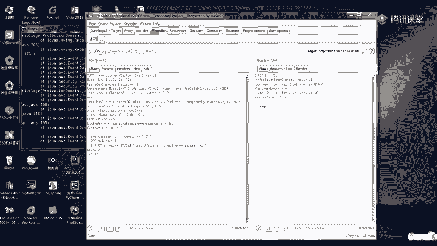

我们前面演示的是。这个。😔，然后是当它给于fors的时候。我是不是打错了。😔。

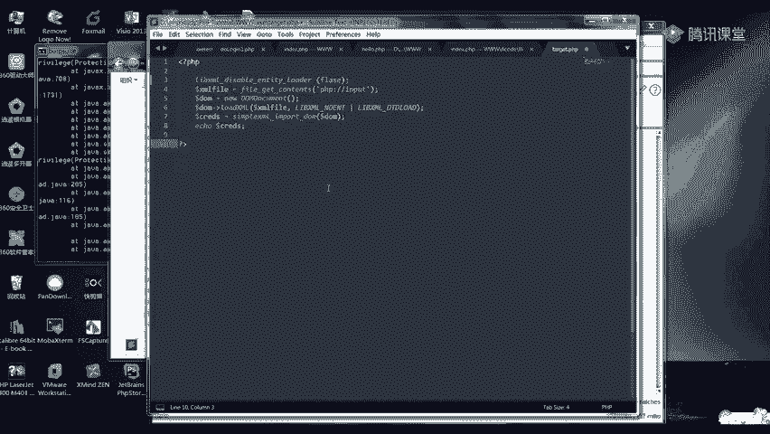

你可以来看一下。哦，我刚才好像都没有。😔，我这不给他嗨。你重新看一下他的报错信息吧。嗯。设置为真实才能有那个。不好意思。因为在这儿的话，我就直接把这个。不就过来。过一下。你们看一下我们的。😔。

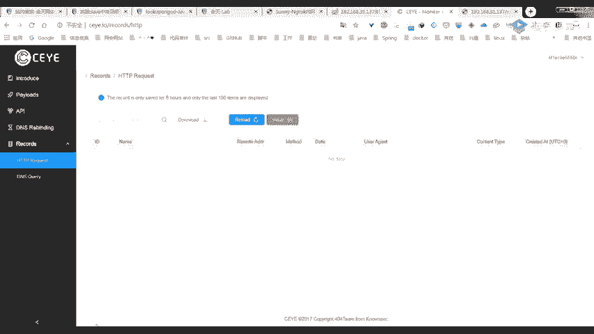

嗯。我这个单词。哦，是这样子打的。是没有爸爸。

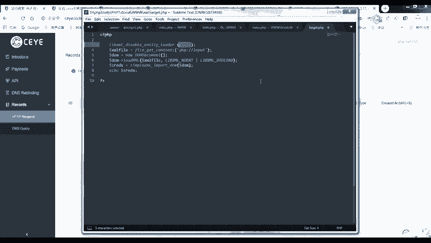

嗯，是这样的。不号。Hi。

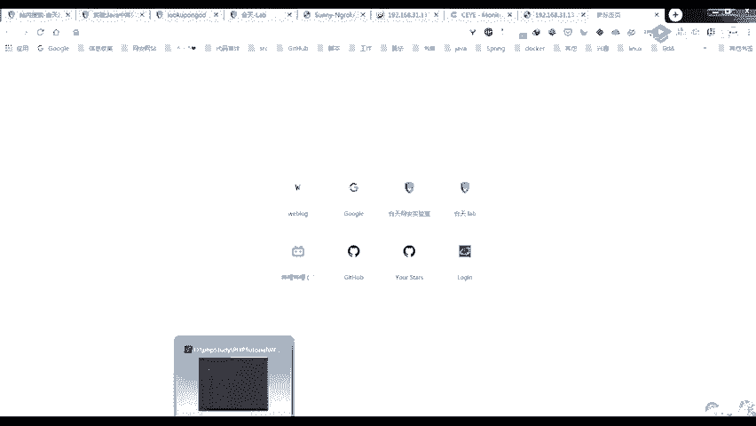

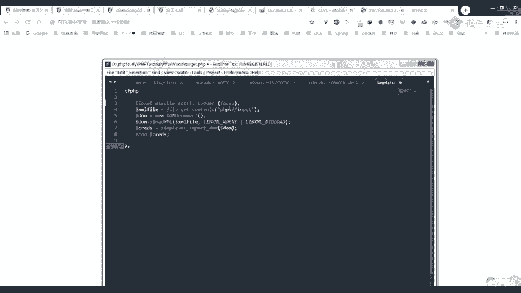

那就是这样子打的吧。嗯。

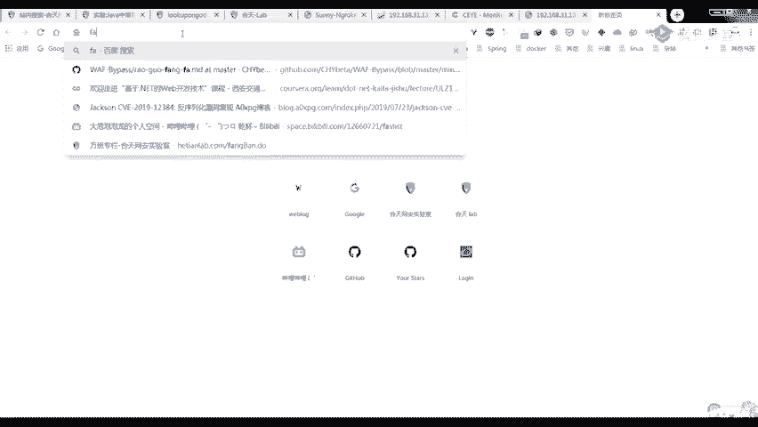

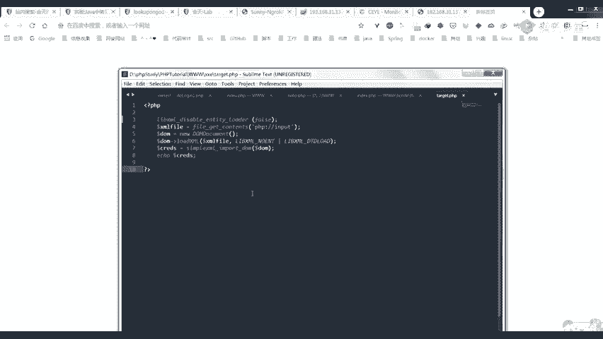

嗯，我们现在去看一下。嗯，这里就有了，那现在我把它改为to。

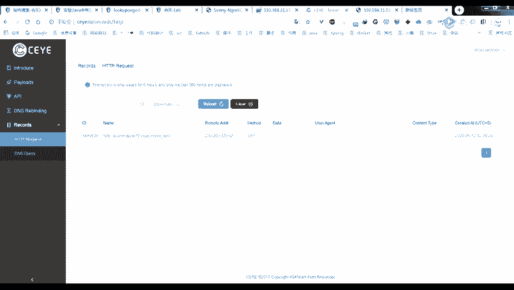

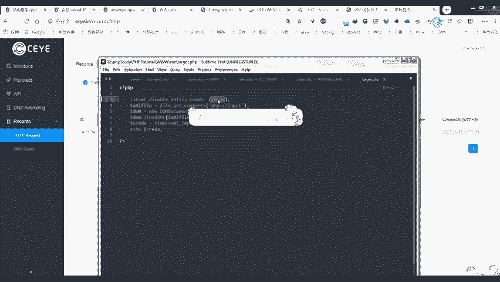

现保存。先把它颗粒。再发送一次。可以看到它其实报错也是不一样的。这里的话它报错是。不能加载外部实体。对吧How to load the external entity。

在这里的话就直接是将这个设置为帧的时候。不允许使使用我们的DDD，就是它到这里。就已经结束了。他后面的都没有判断，因为我们在这这边使用了1个DPD嘛。嗯，就是这两种，那排损的话就。因为没有。一个环境。

所以就不给大家演示了。都差不多。嗯。大家今天的内容还有什么疑问吗？观者会按什么来判定他是一个。像方案一的有绕过的看法。像方案一的话，如果你防御的好，比如说它其实就是不允许加载外部实体等等这种东西嘛。

如果它防范的好，就是这这种的话是把它。列为黑名单吗？如果他收集的齐全的话，那肯定也是要看的呀。如果他收集的不齐全的话，那肯定就会有。照顾的方法。嗯。嗯。好吧。😔，我还想给大家看一下。

就是前几天那个CTF比赛。有一个大佬写的rap up，但是嗯他现在删了，其实就和。就是这这一样的。就和这个是一样的，差不多。只不过他在这里的话，把数据带出来，把数据带出来的话，其实就是我们这边。

这种无回线的这种形式嘛，照着写就好就行了。对了，大家昨天的一个作业。昨天那个叉叉1来。这个。😔，大家有什么问题吗？嗯，到最后的话，他是。有一个就是要把它。把这个地方你不是要保存保存吗？保存文件嘛？

你要把它的格式保存为哦，不是格式，是U那个编码。设置为那个UTF杠8。嗯，就好了。过滤用户输入的代码是怎么样的？就和你之前写那种叉SS的。那种防护是一样的呀，就是把他们。

如果是出现了这种它的输入里面出现了这些。这些符号，这些监括号这种东西的话，以及这种字符串的话，你就直接。嗯，一个提示说不能。不能不允许使用。嗯，这个或者是不用允许使用。嗯，entity等等这种提示。

然后直接退出就好了呀。嗯，几天课其实还蛮轻松的，那大家剩下的时间的话，就可以去做一下。嗯今天的一个作业，作业的话就是这个。

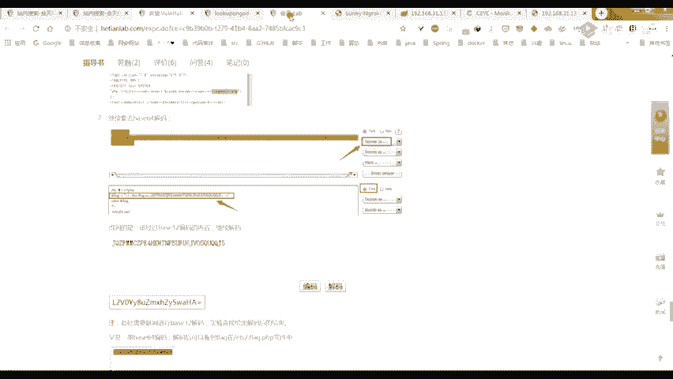

这个吗这个47。005。75。177。然后这两个都要做，就是有回险和无回险的。

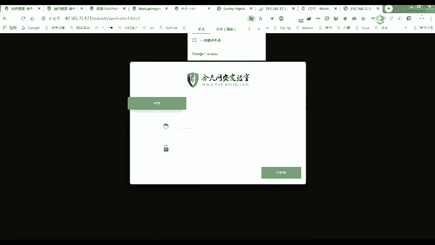

都要做。

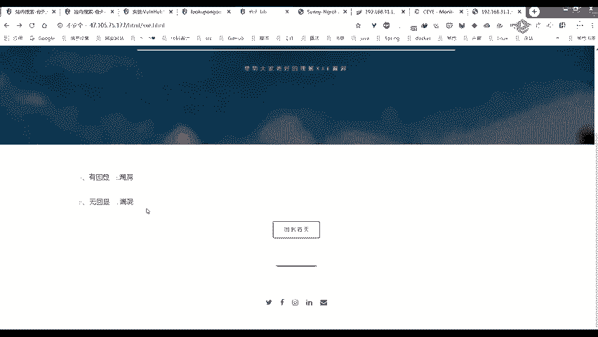

然后。最终判断的话，就只要是说你能登录成功，登录成功的话，它也不会跳到登录成功的一个页面。它只是在这里有一个弹窗，说你登录成功了就好了。嗯，对。那大家剩下的时间就可以去做这个。八成或者是去做。

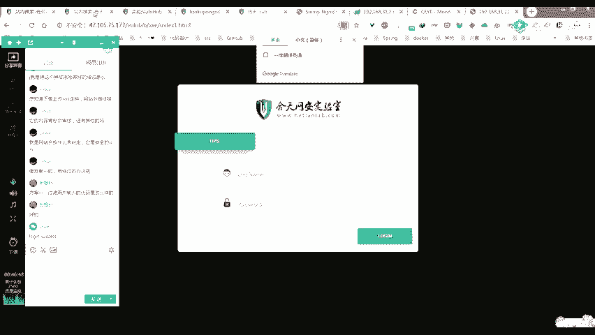

昨天没有可能没有来得及做完的这个。排场。

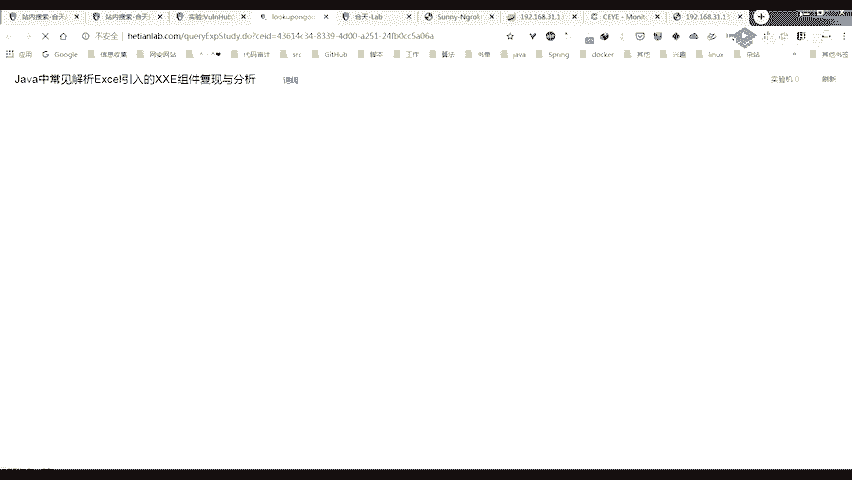

然后我的话就没有什么问题了，就没有要讲的东西了。嗯，大家可以去做。你没有卡，就就是嗯今天的课程结束了，然后。我也没有。😔，有想要说的东西了。所以就说如果大家。

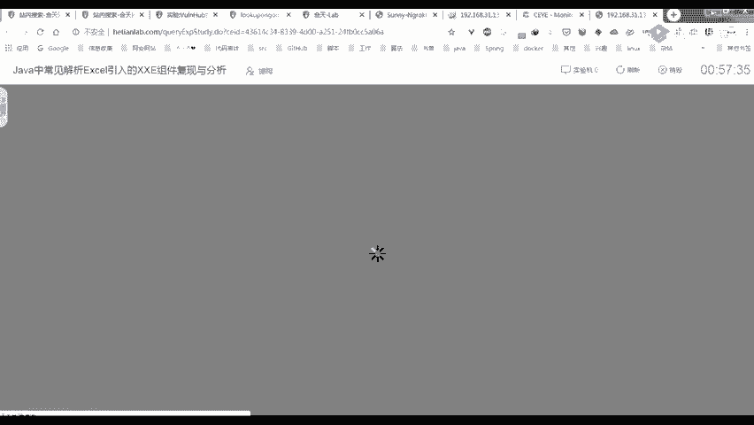

剩下的时间花，大家就可以去做一下这个靶场。

或者是前天给大家布置的这个实验。如果没有做完的话。嗯。

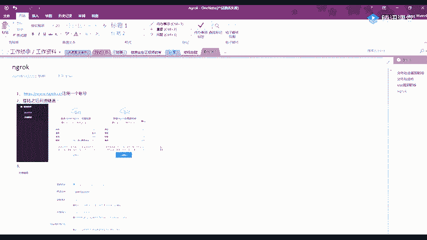

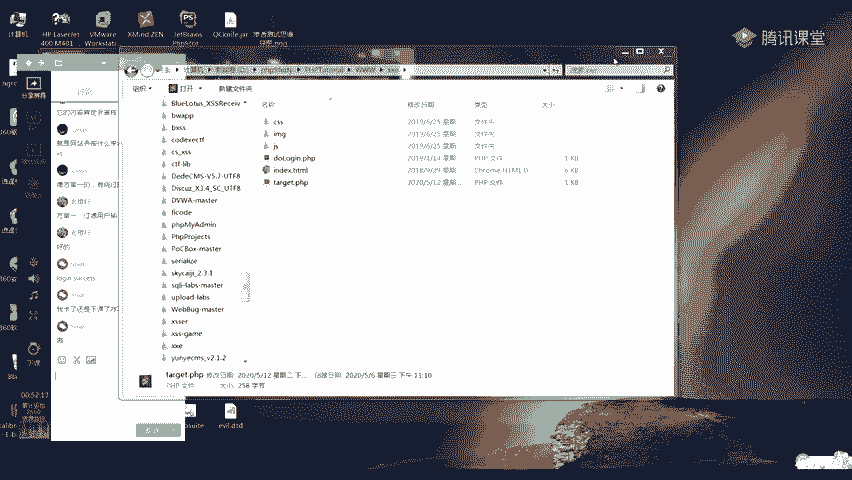

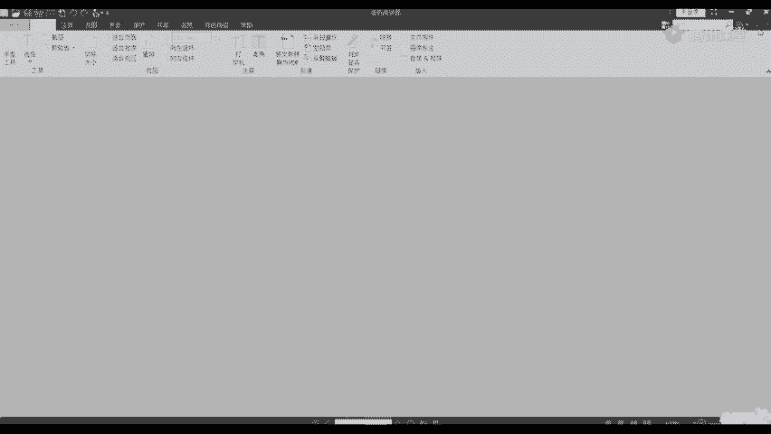

No。Yeah。Oh。你不去你不去。😔，嗯，不确认。嗯，十年。做了，那你发作业了吗？我，作业都没没有看。班主任有给我发。两个。今天为上么不交啊？梦法吗？还是这个就是我记得这个。要听我头像呗。保安吃是。

哦，你把拔长的给做了是吧？嗯。那你很棒哟。嗯，那把长的有什么问题吗？没有什么问题呀。明天我问你。你问谁个？这什么？😔，哦。哦哦哦。我已经嗯我没有对账号，不好意思。那既然你就已经。是微信号啊。

那既然你都做了，那明天分享的话，就是说嗯不是最后一天的话，就大家一起来讲嘛，那明天就你来讲哟。嗯哼。😊，可以吗？SSF是哪个老师？且SFF好像是刘老师嗯，不对，他不叫。交。明老师。嗯，那个。对。明天。

留一个你的位置。电。这样。那个。白嫖客口红。嗯。怎们还注视了。Yeah。哦。就是那个。干嘛还出是。嗯，对我好把。我来给改了。

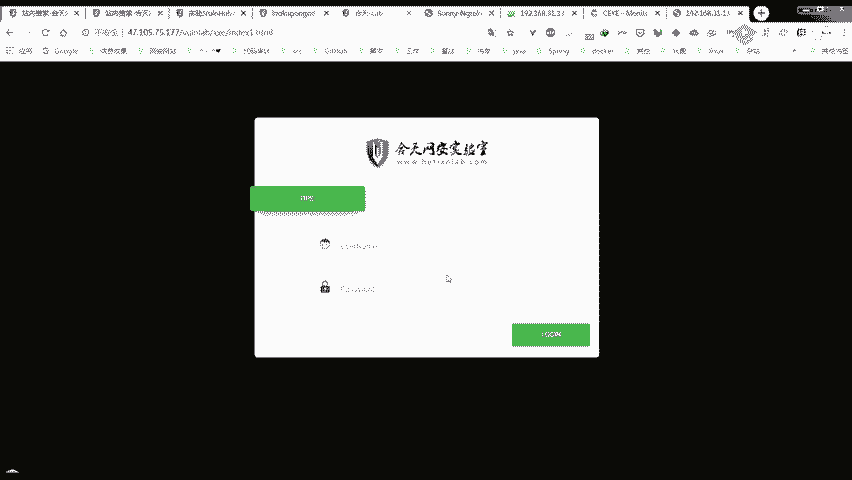

就是这里查看文页源代码的时候，它里面有一个说管理员这个二货把口令存在那个人个目录下嘛，我把它删了，我就直接其实都是一样的，所以就直接给大家。

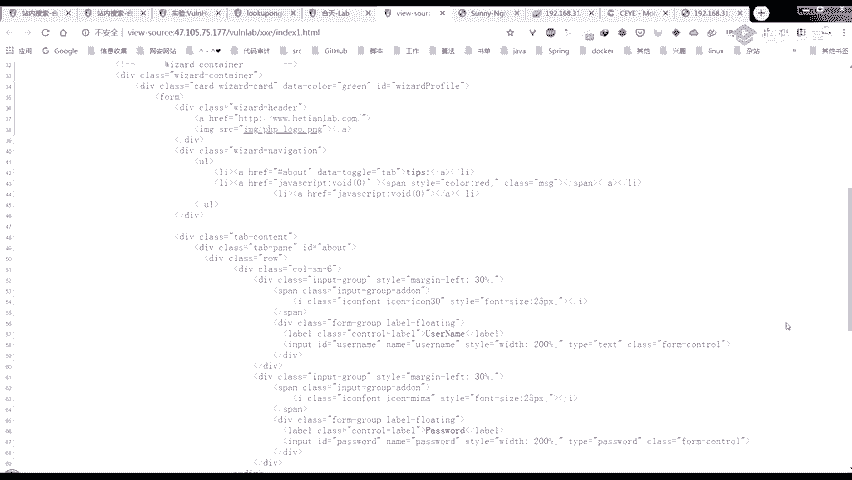

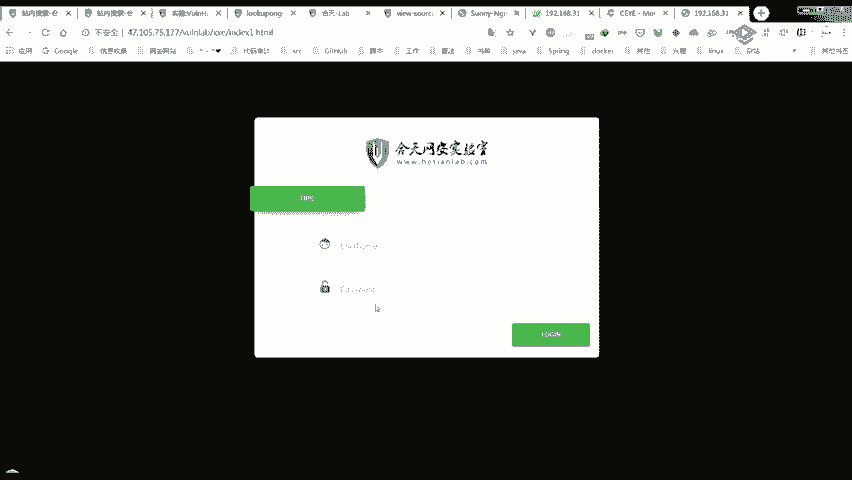

嗯，登录就好了啊，登录成功就好了。为什么还有这个？为什么还有5个人呢？😊，你们都是从哪里知道嗯？如果你在学校里面的话，可能学校老师会通知大家或者是社团里面。都会有通知大家。嗯要么就是去一些。

CBF的一些平台，或者是怎样他会有一些公告显示给我们。Yeah。现在在火现在在火车上。嗯。你们都是学生吗？啊，不是。班主任，你有做过？我仅是社会的啊。没关系，你们也会就是你们也会变成社会人了。

变成我们这种社会的家。你们也会到这一步的。对。我可以下课啦，不和你们瞎聊了。嗯。9点0技术。那你问我呀。所以你太难了。好的，都央查资料才能定。那你问我呀。嗯，还是不样啊，没没关系，你就问我呗。

就问各位就是任课老师呗。刚来是因为有好多，现在还好。嗯。现在还好了，就是。这不会。太可怕了。😔，好吧。啊，是是可以退。😊，心配い。盆栽音不会，他说的原话吗？原话就是插加一不会，就是盆栽一盘。😊，哦。

好吧。行妈。嗯，确实啊确实如果我没有给你们讲讲会的话，嗯，确实可以。找我说你这你怎么想成这个样子，什么什么的。嗯，然后我就会改进嘛，你们跟我说了之后，我就会。接受你们的建议，然后改进。嗯。好啦。

今天就到这儿啦，我就不和你们下聊了。然后你们如果有什么问题的话，就QQ找我呗。那今天就下先下课了。Goodbye。

