# B站最系统的护网行动红蓝攻防教程，掌握护网必备技能：应急响应／web安全／渗透测试／网络安全／信息安全 - P48：web安全-24.课程考核讲解 - 跟小鱼学安全 - BV1SF411174M

🎼是。🎼我的失望。🎼可是心的失败。😔，🎼梦初的。🎼的沉默。🎼We。🎼肮走。🎼我的人。🎼留下青春。🎼在黑暗间。😔，🎼红口。🎼去。🎼是否？🎼我村。🎼自私的。🎼会飞几散。🎼在光。以ほ？🎼不是。ああ。🎼不下。

🎼，🎼一起。🎼是。🎼人回。🎼一不。🎼呼吸。🎼说。🎼自己。🎼坚是。🎼就是。🎼有情。嗯。🎼，🎼就是。🎼母情的。🎼不知。🎼的拘速。🎼高声全雪。🎼你的是。🎼边几层。🎼在恋人中闪过枕的。😔，🎼那是。🎼看着。

🎼撒傻，一杯如酒的谈心烈火，你满中重新回到圣地。从现在无尽的轮回里游力，只是那些若即落地鬼把醒辰。😡，🎼是。🎼，🎼我，我比你拥有那么多未知美好，却还不能满足自己，存虚伪，总哭泣。

总是把忧伤变成最坚不枷锁困。😡，な？🎼而下。🎼，🎼为什么？🎼也只。

🎼到这。🎼我什么。🎼这样。🎼天空越微。あ。🎼的天一。🎼整月。🎼沙。🎼的世界。🎼有人却自。🎼，🎼我总是。🎼过着孤单的日子。🎼我喜欢的。🎼出现。🎼出现。🎼不是。🎼不是。🎼在想。🎼在这里。🎼，🎼想过。

🎼当出一见。🎼大声唱出歌。🎼是。🎼知了。🎼或着哭。🎼是。🎼天上。🎼有习欢。🎼爱去想。🎼就算幸。🎼就算。🎼知道。🎼探说。🎼我知。🎼独自的。🎼界上。🎼的天空下。

🎼已经歌唱。🎼习惯。🎼爱之上。🎼就算心。

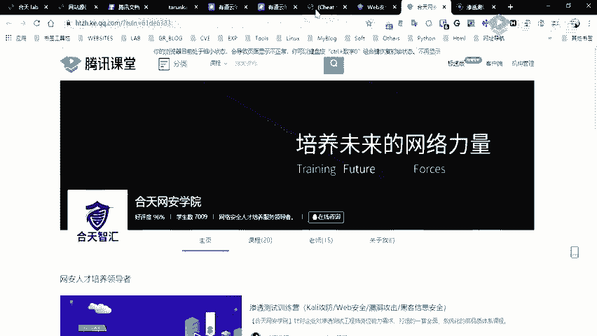

🎼我之间。

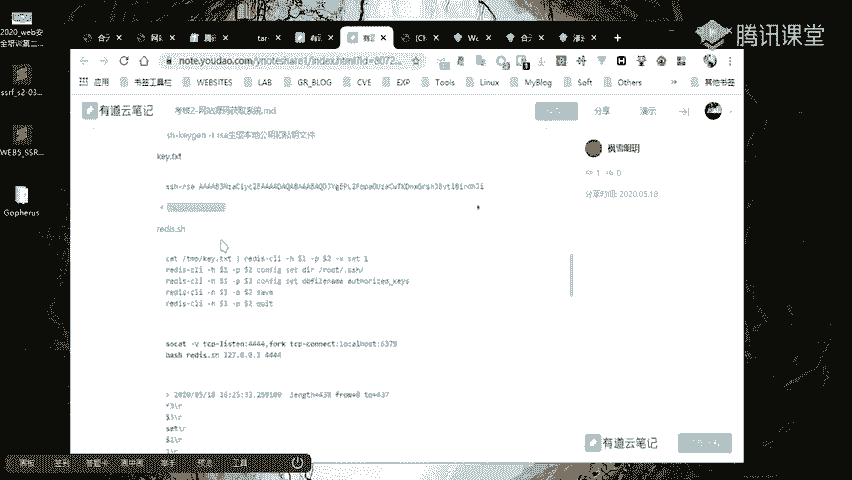

🎼不会。

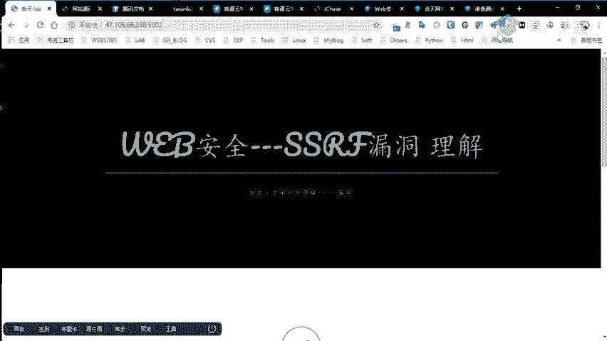

🎼坚影。🎼这。🎼在着惜上。🎼惹多了时间。🎼就远行。🎼过着孤单。🎼我想。🎼感ち。

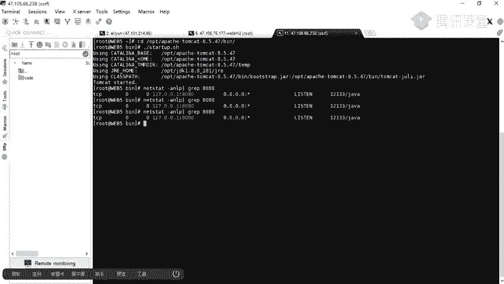

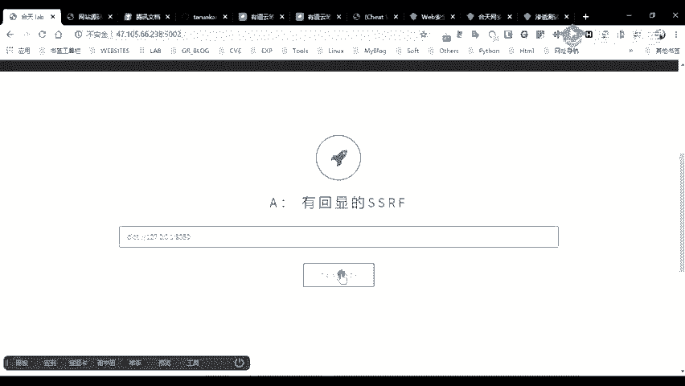

🎼1984年。🎼窗前还没收割完。🎼女儿躺在我怀里。🎼谁的那？

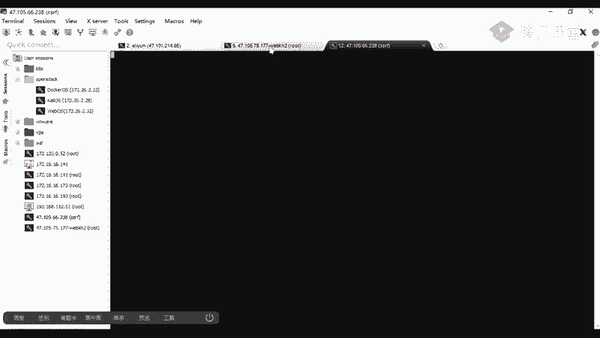

🎼今晚的露天，电影没时间。

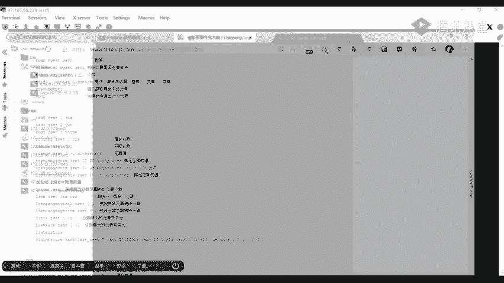

🎼去看。🎼妻得提醒我。🎼手手风起。🎼明天为。🎼不是黎明之间再见。🎼眼前。🎼孩子哭了一整天。🎼早之又迟。🎼蓝色的地开。

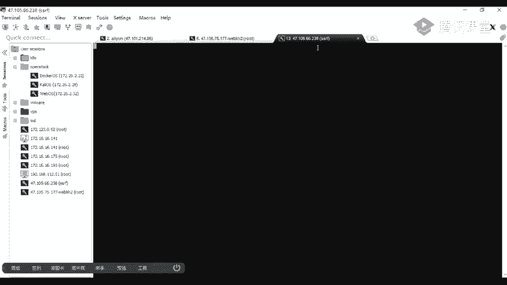

🎼那上一。🎼从往昔。🎼站在石塘边上。🎼给。🎼的爱。🎼我要去。🎼只是我付气日久一。

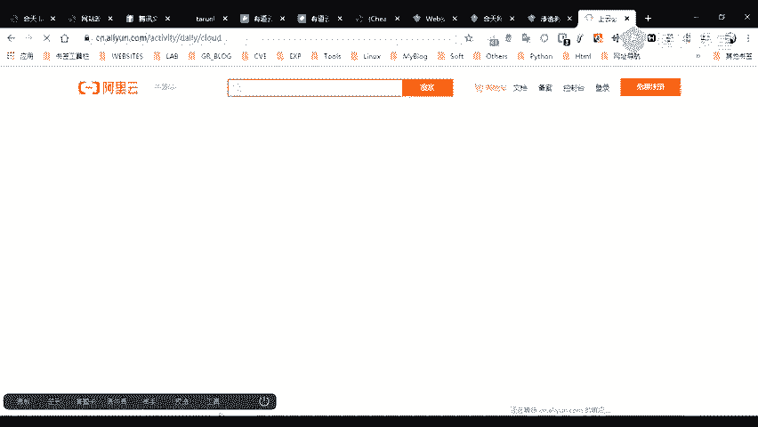

🎼这是他的青春留下。🎼丢下来的。

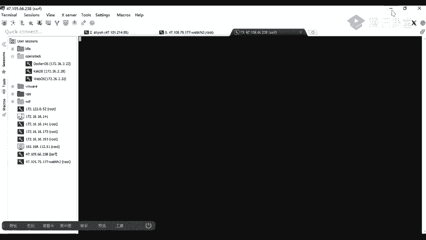

🎼几十年后。🎼我看着你流。🎼不是。🎼我的父亲已经了。🎼相一。🎼一次。🎼一灼少思念。🎼双稼早已。🎼首割完。🎼我的老母亲失年。

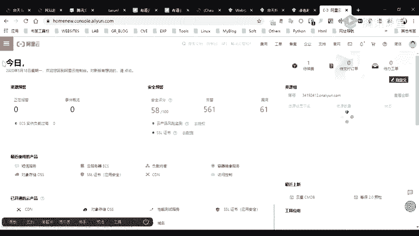

🎼深情。🎼你又差什么？🎼靠进来。🎼笑你。🎼可是他最近。🎼受累一。🎼想一想未来。🎼我老生了一醉。

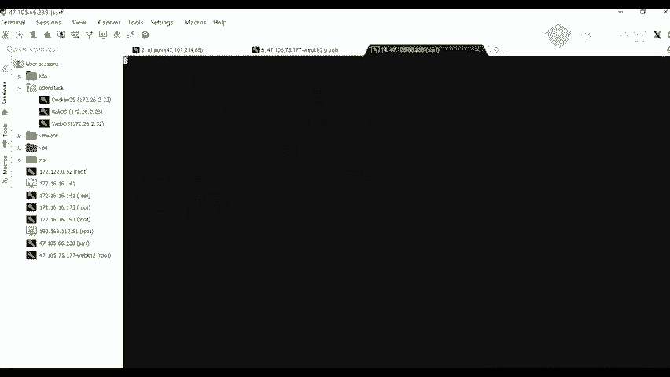

🎼就之前。

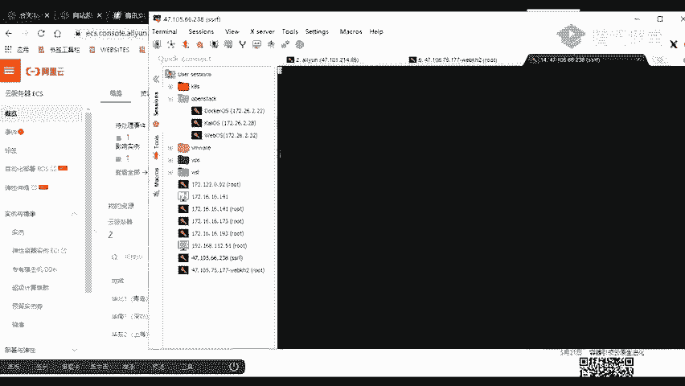

🎼那时的女儿一定会明。🎼今年。🎼有个爱。🎼人要去猜。🎼回家。🎼可笑的这些，我却不。🎼等在。🎼一眼。🎼只是我不。欲し？🎼只是他的宿命。🎼留下。🎼爱护。🎼，🎼我的不。🎼你切。🎼一生。🎼就保持。

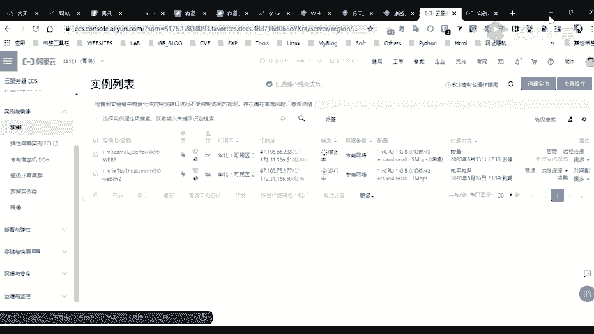

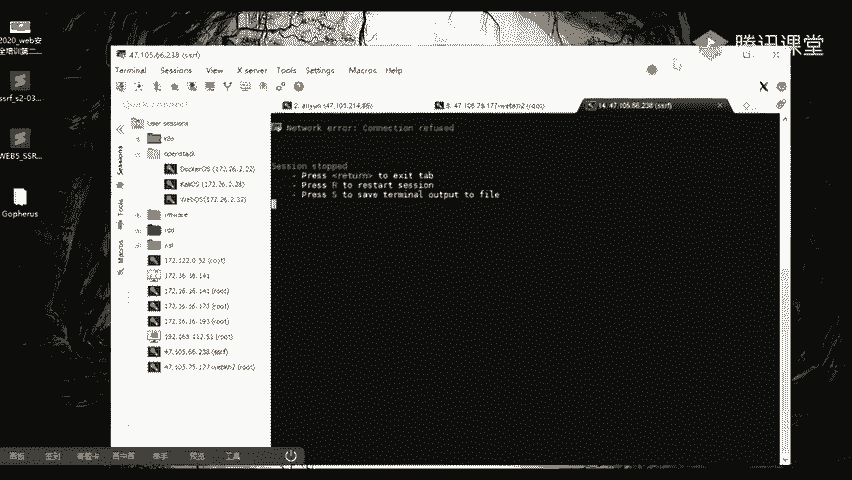

🎼就保持。🎼上命的。啊。たん。大家晚上好。呃，本节课的话应该算是我们就是。我们这一期的一个外部安全培训的。

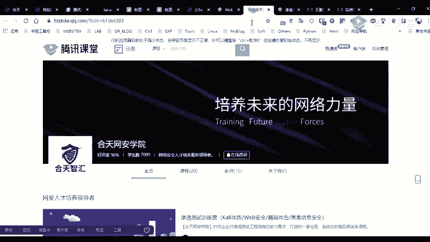

啊，就是课程内容的最后一课了，应该是。然后后面的话就呃我这节课讲完之后的话，后面的话就是呃。两节就是把我们前面的一些内容的，就是关于这些wordb安全相关的一些知识点给他给大家做一个就串联，对吧？

就是针对这样子的一些wordb。安全漏洞啊，我们如何去发现，如何去利用的一些思路。然后的话就是最后的一个呃就业的一个培训，就是这。啊。解决大家就是在去进行一个就业的时候，一些简历制作啊。

还有就是就业的一些选择等等的。还有的话就是呃有相关的一些呃企业的一个内推的一个资格。然后本节课的话就是一个课程的一个考核的一个讲解。呃，讲解的话主要的话就是呃上节课给的两个题目。就这两个题目。然后呃。

大家有做出来的吗？就这两个题目大家有做出来的吗？🤧K。没有。HPVC81。那其他的呢没没有尝试吗？对。嗯。呃，这个的话是。呃，这两个题目的话是把那个fi协议给就是过滤了呀。就是你的这个fire协议。

因为如果说你能够去直接使用到一个fire协议的话，我可以直接就是file，对吧？因为我已经知道flag的位置嘛，我直接。我直接通过fi协议对吧？然后直接读取这一个flag的一个文件。

这样子的话就直接就能够出来一个flag，对吧？那这样子的话没有什么就是没有什么可考性，就是没有什么考点，对吧？所以的话这两个题目其实是有把这样这个发协议给禁用的。就是把它给过滤掉。🤧嗯。😊，呃。

其他人呢这这两位同学是啊有碰到一些问题，对吧？其他同学有没有？就是有一些思路，或者说有做出来的。🤧嗯。公钥。你说的用公钥常试是哪一个是哪一个题目啊？🤧K。嗯。嗯。就这个是吧。

这个你为什么会想到用公钥去做呢？就是你呃你用公要去做的一个，就是你前面的一个思路是怎怎么样的。啊，要不要不就是说呃。就大家有什么就是有什么想法直接说吧，这边是可以这样子举手吧。就大家可以直接举手。

然后发言。K。就大家碰到的一些问题啊，然后的话呃有有有。就是你你的一些思路。啊，你你这个。这个老臣子。你要不要说一下？你要不要说一下，就是你的你为什么要想想要去用公钥去来尝试做这一个题目呢？

就是你的一个呃。依据。Yeah。But。要不要尝试说一下？

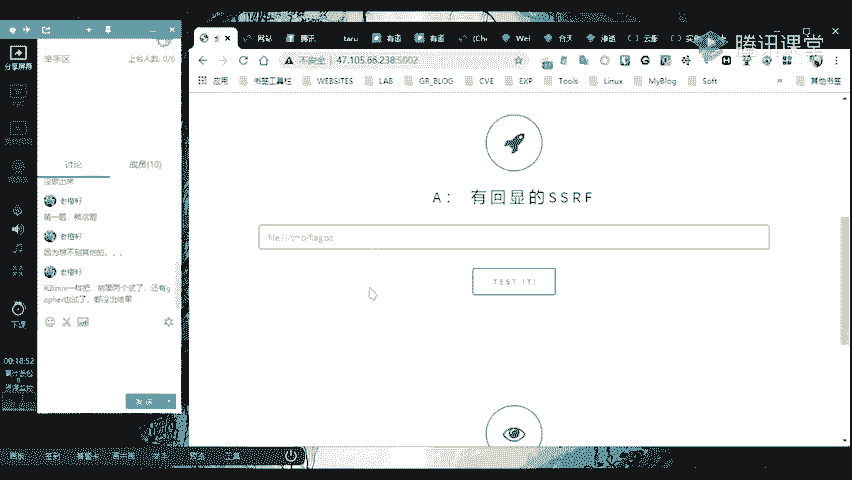

Yeah。

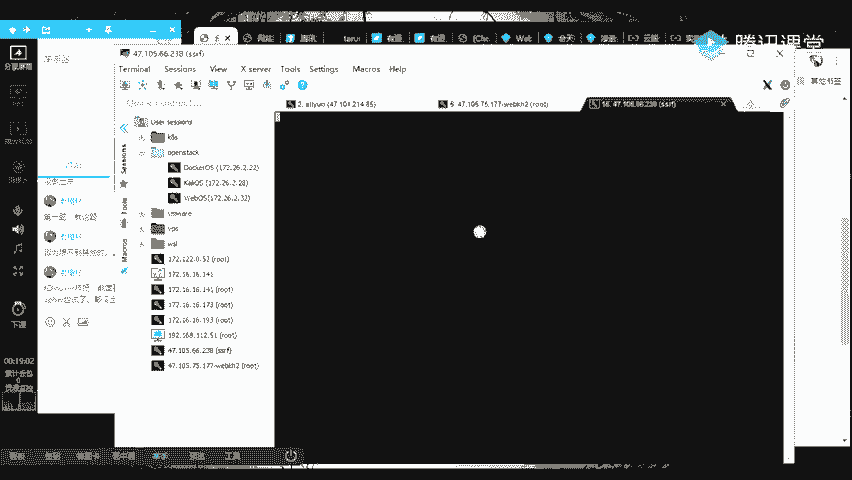

🤧Don。呃，没人想分享一下的吗？没的话，那那我来我来讲吧，就。K。首先的话这里这里的话就呃。就从明很明显就是1个SSF嘛，对吧？其实就前面的一些题目。然后的话你要做出来一个。

你要得到那个fraag的话，对吧？我们先回想一下，我们就是前面讲SSF的时候，我们要怎么去进行一个啊测试，就是说怎么去测试这样子的1个SSF漏洞呢？对吧？我们前面的话有提了，就是有通过一些URUR协议。

对吧？通过U协议来去进行一个测试。然后的话看它的一个回显，对吧？来判断呃来获取它的一些信息，来判断服务服务器的就是啊一些端口啊，服务它的一个开放的一个状态，对吧？然后的话我们。

我们知道了这样子的一些信息之后的话，我们再去针对这样子的一些端口，它的一些服务来去进行一个啊针对性的一个利用。对不对？然，前面的话有说到是吧，用呃，就是这里的话有只提示让你输入1个URL嘛，对吧？

那我输入1个URL。进行一个测试嘛，就是HTP协议嘛。比如说我输了一个百度。🤧Yeah。对吧，然后我测试一下测试一下之后的话，发现它是返回了我这一个啊链接的一个啊源代码，对吧？源码。

那么你这这里这样的话，我们要明白，就是说他。啊，就是他后台后端怎么去进行一个处理的。就说你首先你要有这样子的一个概念。我们在这里输入这样子的1个UL，对吧？输入之后的话，后端它是怎么处理的呢？

我们从结果的话能够发现它是返回了我们的一个源码，返回了我们给定的这一个链接的一个源码。那么。我们就能够大概的知道它后端它其实会向我们给的这一个链接发起一个请求，对吧？就啊请求这里的一个链接。

它的一个源代码，然后的话显示出来，维写到了这里，对吧？然后这里是HDP协议。那么我们还有呃前面有。着重说的dict协议对吧？啊，dict协议。比如说我。我随便输入1个IP对吧？

我先不输入这种呃内网的1个IP我输入一个公网的IP嘛。我为了验证他是否支持这样子的一个协议。点帮。

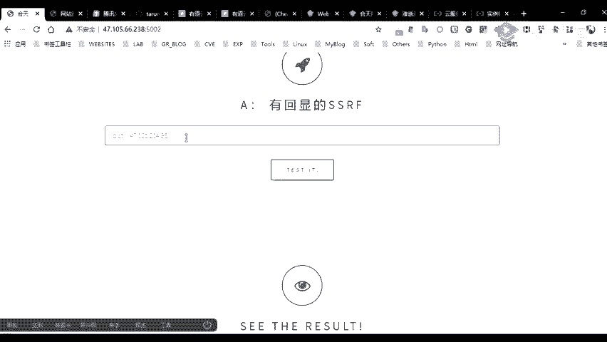

他的话呃，22号端口对吧？我这边的话，我在我自己的一个服务器上面。先做一个就是今天今天我的一个。22号端口对吧？我这里进听之后来，然后我在这里通过dX协议去啊访问我的这一个公网服务器的22号端口，对吧？

因为它会对我的这里的22号端口做一个探测。

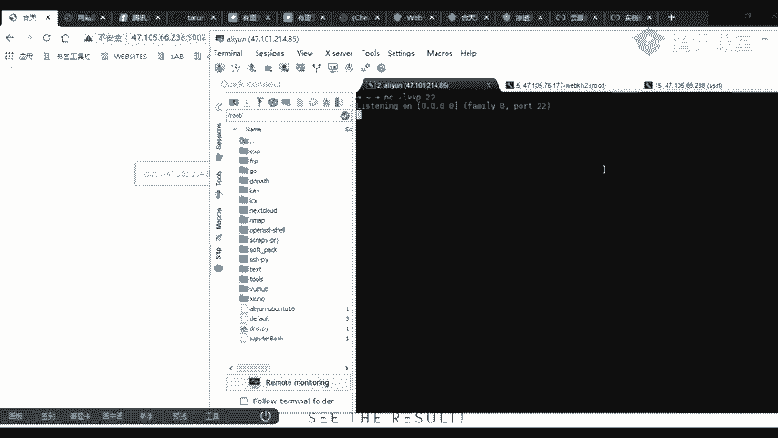

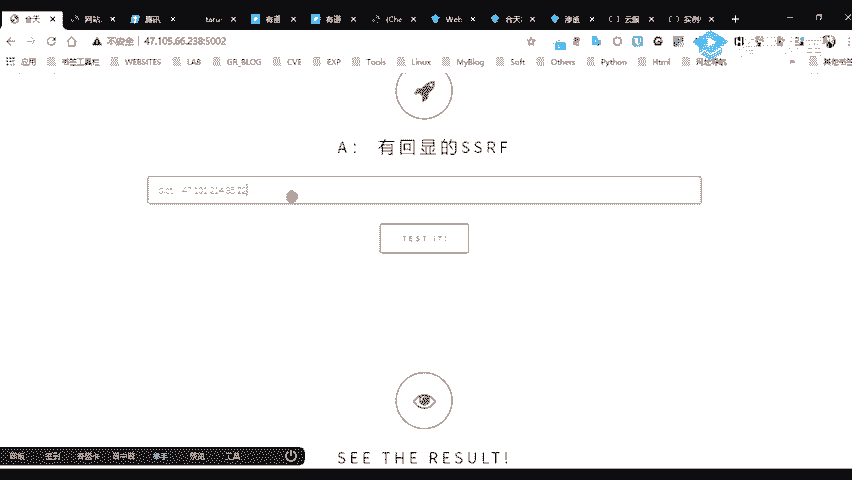

然后的话我进行一个test， testest了之后的话，我们怎么去查看。他是否有就是请求呢？有向我这里给定的这个digix协议，就是有去使用这一个digs协议去啊探测我这里的一个服务器的一个端口呢。

对吧？我从我服务器上面的一个回显就能够知道它其实是啊有去请求我这里的1个22号端口的。对吧然的话可以看到这里的话是他请求的一个客户端，它是使用的1个CRL的1个7。29的一个版本。

对吧他是从呃这1个IP呃访访问过来的。🤧对吧。然后的话其实呃其实在这里的话，其实就是建历了这样子的一个连接。我们其实可以看到在这里的话，它其实连接到了我这里服务端的1个22号端口。

然后我们如何去就是说其实。就是客户端与服务端之间进行连接了之后的话，我们其实可以去传递数据的对吧？我可以在这里随便输入这样输入这样子的一串数据。对。然，后我这里输入之后的话。

其实我们的这一个连接呃断掉之后的话，它就会把我的这里的一个数据给传到。

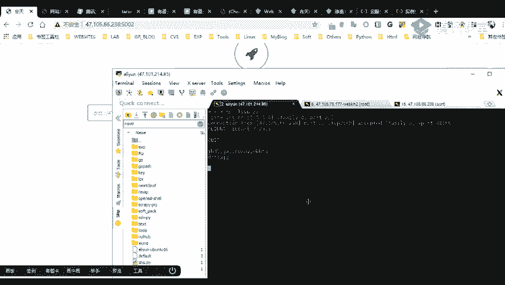

え。

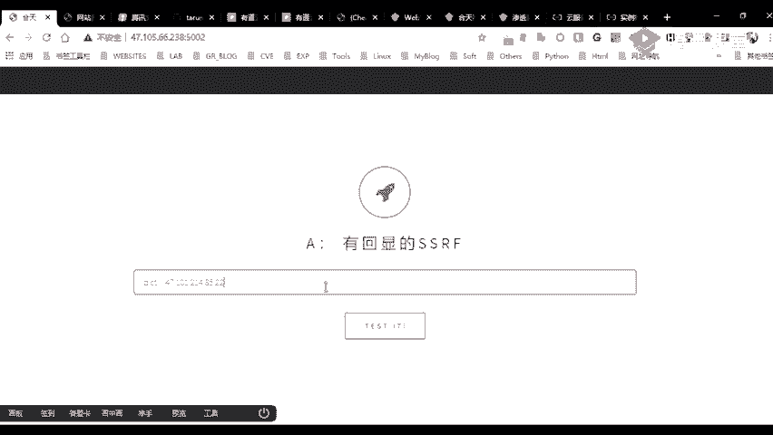

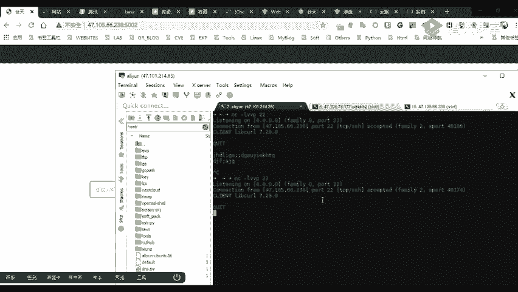

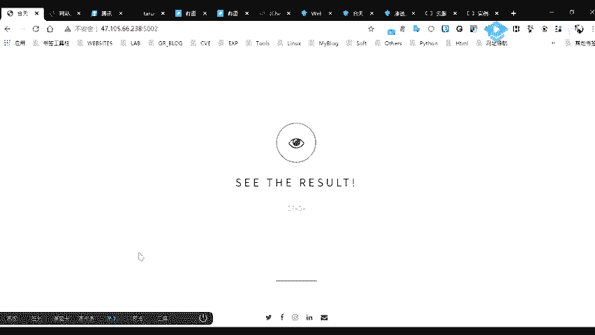

可以看到我在这里的话呃，像客户端对吧？随便呢传输了这样子的一个字符串，对吧？然后服务端的话，它请呃不客户端，他请求我们服务端的一个数据，对吧？我这样的话给了他这个数据的话，在客户端那他就回显出来了。

其实就跟我们去请求一个链接，然后服务端就是呃请求的链接的一个服务端，它返回给我们这里的一个数据。

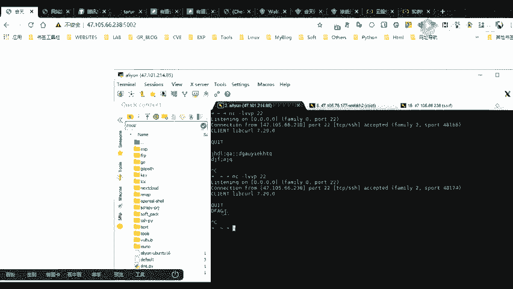

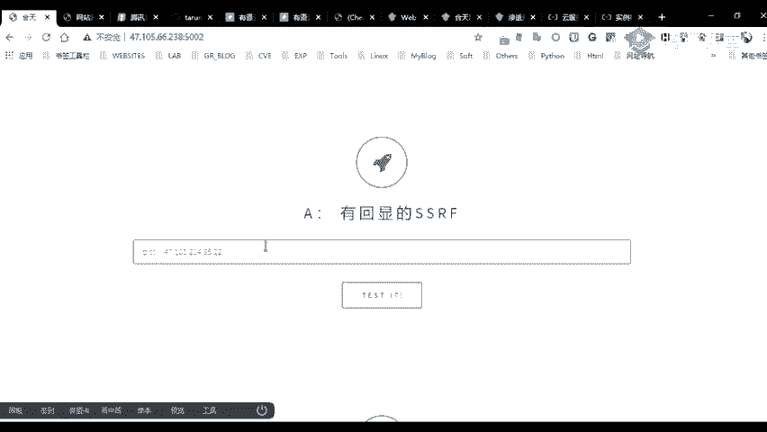

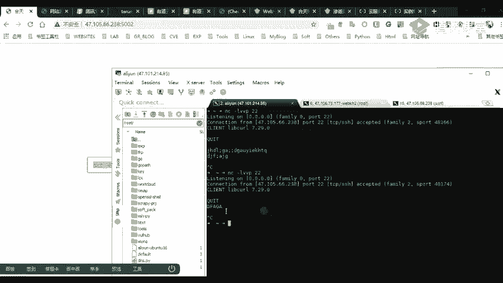

其是一样的对吧？这样子的话，我们能够判断它是能够支持这样子的一个dict协议的。也就是说我们可以使用这样子的一个dict协议来去探测内网的一个端口，对吧？那么我们尝试一下呃探测一下内网的一个端口。

就是说呃因为我们现在这里的话是在这一个服务端，对吧？在这一个呃在这一个服务器。然后的话我们在这里请求我们可以尝试。如果它没有就说它存在这样子的1个SS漏洞。

也就是它没有去限制我们在这里请求的这种URL的一种效。啊，不是E的一个协议，以及他没有限定我们的这样子的一种啊访问内网的一种IP以及特定的一些端口的话，我们可以去进行一个尝试。

然后的话我们在这里尝试一下。尝试之后的话，可以发现它这里的话返回了这样子的一个呃，我们22号端口它所运行的一个服务以及版本。它的一个服务的话是SSH版本的话是7。4的1个open SSSH的一个版本。

即话。那么我们能够去使用这样的dt协议去探测内网的一个端口。那么我们是不是能够去探测其他的一个一些端口呢？比如说3306。对吧。进行一个测试，然后发现的话它这里有回险。好，可以看到这里的话是1个5。7。

29的一个版本。按这里乱码的话，其实呃。是因为中文的。呃，它本来就是这样子的一个乱码，然后显示的话是有问题的。🤧K。然的话我们不可能是说这样子手动的去一个一个端口区进行一个探测，对吧？那么我们。H。

我们如果说你这样子手动手动的一个一个端口去探测的话，那太太麻烦了。所以的话我们可以尝试使用BP嘛。就是啊其实上节课也有用，有说到。对吧1用BP的这一个爆破爆破模块。是这吧。就这样子的一个包嗯啊。

抓抓取他这样子的一个啊请求的一个包的话，就是像这样子的一个包。然后的话我们。可以通过BP的一个爆破模块，对吧？然后对它进行一个爆破。爆破之后的话。

它的一个结果其实就是我们就是我们在这里我们的这一个服务端，对吧？这一个服务端它的一个啊它内网的就是说它本地的这一个啊开放的一个端口。我们同可以通过通过它的一个响应来去进行一个判断。呃。

这里的话会比时间啊，因为我这里的话是探测的一个全端口，就是1到65535。然后的话它它的一个呃时间的话会是比较久的。因为它需要一个一个包，一个一个端口，也就是一个端口要发送一个包。

然后的话获取它的一个响应。这样的话已经出了1个22号端口，对吧？然，最后探测之后的一个结果的话，其实就是。啊，有这样子的一些端口存活。我们可以看这里要能够得到它存活的一个端口，有这样子的一些22呀。

33065002，还有8080，还有23005这样子的几个端口。然后的话呃主要的话看这个就是它的一个状态嘛是200的嘛。其他404的话就说明这个端口的话呃没有开放的。然后这里的话呃。

我们再回过头来就是呃看一下我这里的一个文档吧。我这的话呃写了这样子的一个文档，也就是我们如何去进行这样子的一个就是去测试这样子的1个SS漏洞的一个思路。首先我们得到这样子的一个站点，对吧？

得到这样子的一个站点，我们想要去测试SSF。对，首先我们。我们要去测试它，也就是呃要能够获取到它的一个信息。大家一定要注要记住的话，就是SSF它的一个作用，对吧？它的一个作用就是去探测内网的一个信息。

因为我们要去使呃利用就是利用这样子的一个存在SF的一个这种啊web服务器，对吧？然后的话它是能够去访问。如果说它是能够去访问内网的对吧？那么我们可以利用它这样子的1个SSF漏洞去探测内网的一个信息。

也就是说以这一个呃服务器作为一个跳板去获取去直接就是穿穿越我们的一个呃防火墙来去访问内网的这样子的一些服务，以及获取它的一些端口信啊信息版本信息等等。🤧嗯。😊，然后的话我们前面的话有说了。

就是呃HTM的啊，不呃HTTP的一个协议，以及dx协议，对吧？然后的话有其他的一个一些就是。说的一些fire尔协议对吧？也是常常用的，也是常见的一些fire协议，对吧？fire尔协议的话。

因为我们能够其实通过啊这样子的一些信息的话，能够知道。它其实是一个lininux的一个服务器，对吧？它其实是一个lininux的一个服务器。然后的话因为有有像这种22号端口嘛，对吧？

如果是一个linux服务器的话，那么我们就是可以尝试使用firere协议去读取呃，lininux系统当中的一些特殊的一些文件，也是呃常见也是常用的一些文件。比如说ETC password。

对吧然后我们可以去进行一个测试。然后测试之后的话，这里的话是啊没有这样子的一个信息的一个返回，对吧？然后的话从这里的话，我们其实也能够就是呃测呃知道了解一点的话，就是说他这里的话。

不能够去使用这样子的一个fire协议，直接去读取啊，这个系统里面的一些文件。也就是这里的话有对这一个发展协议做一个禁用。然后的话还有就是其他的一些协议。比如说呃FTP。

FTP协议就我们如何去测试这这个呃测试它是否能够去使用FTP协议呢？是吧啊，我们首先要知道FTP的话呃。看一下这里的这个文档。这个文档的话就是啊列举了就是常见的，也就是一些啊我们经常。呃。

就是经常会去使用，而且碰到的这样子的一些端口，以及它的一些服务。就是说一般的一般就是约定俗成的这种，比如说22号端口，对吧？就是对应就是使用的1个SHH的一个服务。当然的话，你也可以去更改它的一个端口。

就说你可以把呃SH服务的一个端口改成其他的一个端口。比如说我的话，我把我自己的服务器的话是改成了其他的这样子的端口。因为你就是默认的使用22号端口的话，你现在公网的这种服务器的话，别人会去尝试。

就是就你去挂个入挂个那种爆破若口令的一个脚本，对吧？你直接挂挂在那里，然后的话直接对这种官网的这种服务器直接去进行一个批量的去爆破。对吧然后他批量爆破的话，它批量爆破的话。

它针针对的就是默认的去使用的这种22号端口的嘛，对吧？如果说你去使用其他的这样子的一些端口的话啊，可以比较有效的去防止它的这样子的一种爆破。

除非的话它是啊有针对性的去对你的这个服务器做这样子做这样子的一种探测，对吧？那么的话它肯定也是能够去发现到你你的服务端就是呃开放了哪些端口。然后的话这一个端口它使用的什么样的服务的话。

都是能够探测出来的。就我们使用Mapp就能够去进行一个探测。然后的话我们呃这里的话，比如说我就是大概说一些常用的一些端口。啊，这个的话大家可以不用去使记啊，就是就是之后的话大家肯定也会经常碰到。

也会经常去用到的。比如说FTPFTP的话就是20到21的一个端口。然后SH是22，tnet是23，还有像我们的一种邮件服务啊，25对吧？还有常用的DS的话，它是使用的1个53。嗯，以及呃HDP对吧？

80。还有的话像呃。呃，还有的话像我们的呃我们的一个readdius对吧？radius的话是1个6379，还有像我们的呃就my circle。等等的这样子的一些就是常见的一些端口以及。呃。

就是80808080的话有啊这的话是一个他这里写的话是HDP的一个pros，就是HP的一个代理。它默认的话是使用8080的一个端口。就比如说BP的话，BP里面的1个HP的一个代理的话。

它默认的话也是使用的1个8080端口，对吧？然后的话像t这种外b服务的话，它默认的也是使用的8080的一个端口。啊，这里的话就是对长音镜的一些端口给大家呃。做了一个基本的一个介绍吧。

就让大家有这样子的一个印象。啊后我们回回回到我们的一个题目，就说我们如何去探测它是否能够去使用这种FTP的一个协议呢？对吧？我们前面的话有说到就是FTP的话，它使用的是1个21号端口，对吧？

然我想要去探测它是否能够支持使用这种FTP。协议对吧？我这里的话，我首先。我首先我要去探测的话。

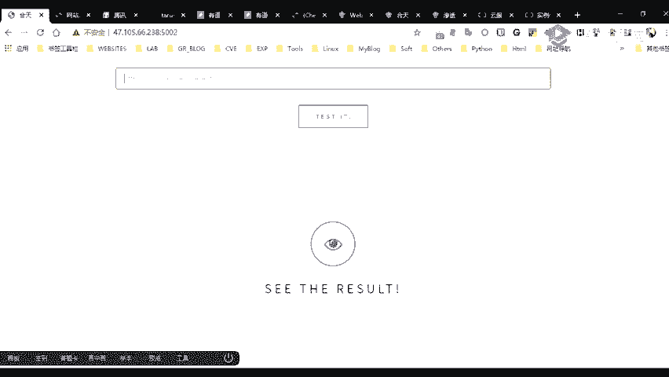

我，需要去使用到我我们的一个公网服务器，对吧？我首先在我的一个公网服务器上面今添1个21号端口，因为它默认的话，它是使用的这样子的21号端口。如果你不去特意的去指定的话，然后的话。

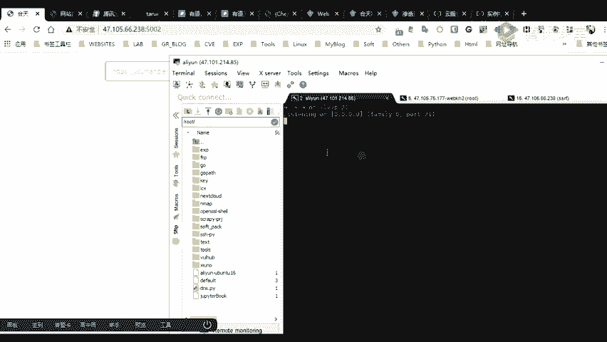

我们在这里的话。嗯。我们在这里的话，通过FTB。协议去访问我的这这样子的一个呃服务器的1个IP对吧？然后的话我去进行一个测试。

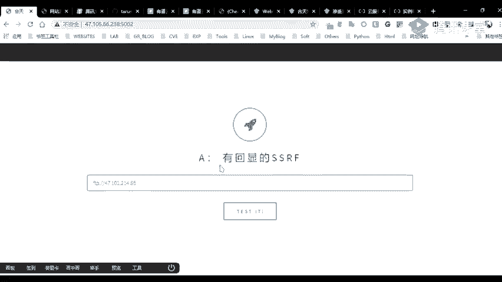

去进一个访问。访问之后的话，我们从服务端的一个回显也能够知道，对吧？可以看到这里的话是有1个IP有这样子的1个IP来连接了我的21号端口，对吧？是呃1个FTP的一个呃服务。

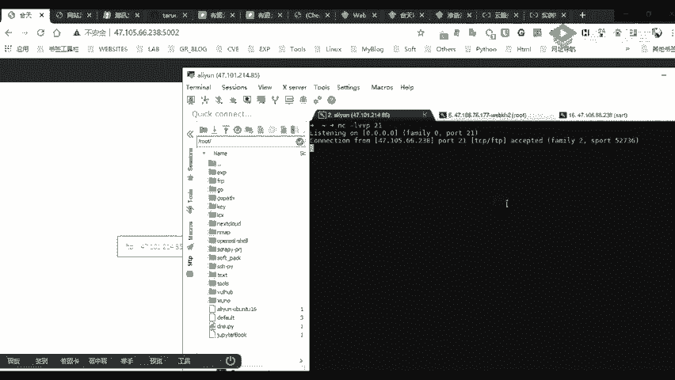

哼。然，我这里是。🤧K。K。从这里的话，我们也能就能够啊大概的知道它是啊就是这里的话它的一个服务端的话，它是能够去支持使用这种FTP协议的，以及还有其他的这样子的一些协议。比如说FTPS啊。

还有SFTP啊，还有telnet呀。然后的话有go for。嗯。关于呃go for的话，其实上节课也说到了嘛，也是就是我们在后面去进行一个利用的时候，也会经常去使用到的这样子的一个协议。

然后的话我们探测完了，就是说我们能够去使用这样子的一个药饵的这样这种协议，对吧？能够使用它去获取到特特定的一些信息。对吧。然后的话还还能够去用这样子的这种协议去发送这样子的一些payload的。

以及啊一些数据。对吧然后的话我们就需要。啊，应该是说我们可以。前面的话我们有呃就是有测试了它能够去使用这样子的一个dt协议，对吧？

那么我们就能够去使用这样子的一个dt协议去探测啊内网的一个端口以及服务信息。然后探测内网的话，我们可以通过这样子的一种爆破的一个方法去就是通过它的一个响应来去呃印证，来去发现它的一些端口的一些开放。

以及它的一个呃就是端口开放的一个情况。然后的话我们知道了它的开放了哪些端口，那么我们就能够有针对性的去利用它的这种端口的一个服务，对吧？比如说呃22对吧？

然后的话像这种数据库mycyclmycycl数据库对吧？然后呃其实SS上也是可以去使用这样子的一个go for协议，去就是去呃利用这样子的一个mycycl数据库的。当然的话，利用这个my这数据库的话。

它是就是说利用这个3306的话，是需要有一些前提条件的。就它的一个前提的话，就是说你需要去呃你需要知道你的这这个数据库它的一个用户名以及密码。

所以的话然后的话才能够去利用这个go for协议来去啊向我们的这个啊内网的这种商这种数据库服务去发送我们的一个数据。然后的话还有就是呃5002的话，就是我这里的一个外b服务嘛，外b服务的一个端口。

以及呃8080的一个端口。808年端口的话，我们前面也有，就是前面也说了，也提了，就是说808年端口的话默认的话呃。好，这样的话我们可以去进行一个访问。

就是一般的话它是使用的这种就是用于做一个web服务器。像比如说我们的就是说HDP你也可以呃，像比如说我们的eng啊，还有像这种tomcatomca的话默认是使用的8080端口。

然后的话像呃其他的这种workb服务器的话，也是也有可能会去使用到这样子的一个端口。

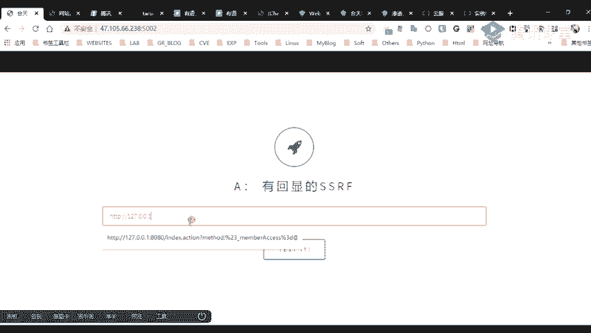

然后这里的话。

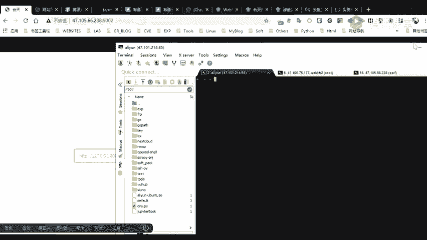

啊，这样的话这个题目其实大家没有做出来啊，这两个题目大家没有做出来的话，其实。

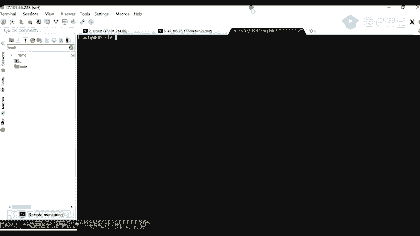

U。其实没有关系啊。就是。这两个题目的话呃，首先这一个就这一个这一个题目的话。

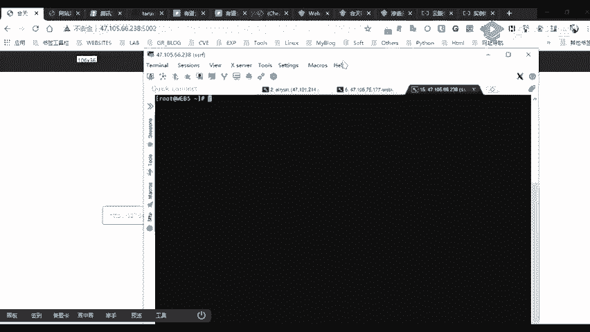

应该说这两个题目其实都有稍微有一点问题。这个问题我也不是。

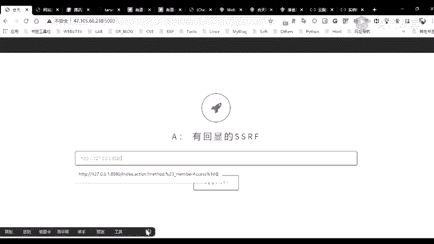

就是他这里的话有一个tomca这一个服务，然后这一个tomca服务的话总是会断掉。就是我不知道是它的一个连接数太多了还是怎么的，就它过一会就会断掉，然后起了的话，它的一个端口也会就起不来。所以的话。

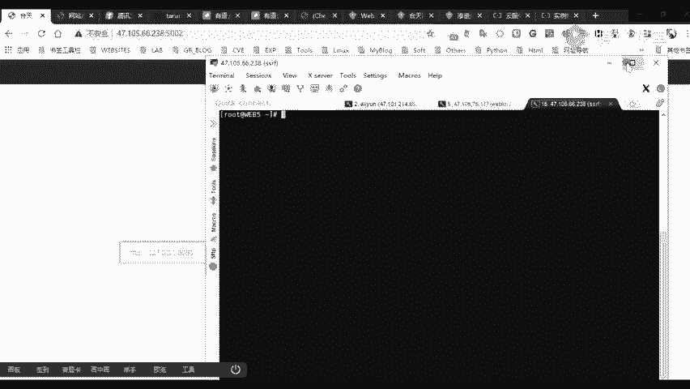

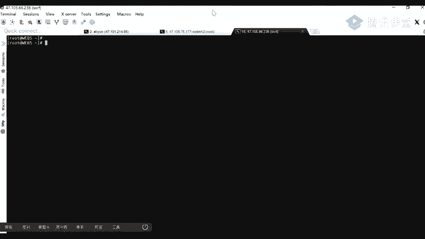

可能大家也如果有去呃，有同学去这样子去进行一个端口的一个爆破探测的话，如果没有探测到这个班联端口的话啊，这个8联关联端口的话其实。

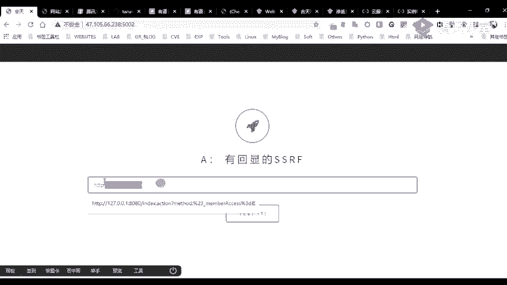

啊，可能是服务端挂掉了，就是这里的一个。呃。怎好。我刚刚起了一下这起了一下这个tom cat。服务的话，直接整个机器都卡死了呀。然后的话。直接连都连不上去了，所以说这里的话稍微有一点问题。2。

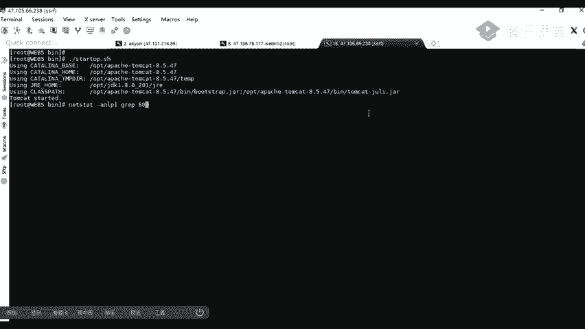

而且这个tomca的话，这一个服务的话，现在的话可以看到是已经起来了。就是他今天在8080端口。

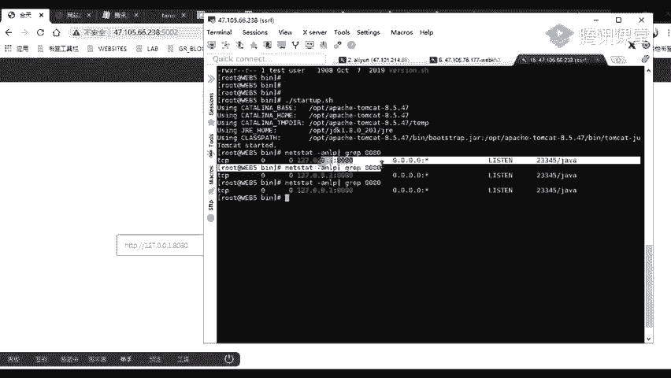

然后的话这个服的话，他要起来，其实需要需需要一段时间，就是而且他的时间的话。说不准啊。啊，可以看到我在这里的话哦，我这里起来了，对吧？起来之后的话，我这里去进行一个访问，对吧？

我们通过HTP的一个协议或者说你通过dt协议，通过dt协议的话，它会返回就是你的一个服务。你的这个服务的话，它使用的一个app帕7，对吧？那么我们知道它是app帕7的话。

那么我们就可以尝试使用HTP协议去进行一个访问它的一个页面，对吧？然后的话我们从它的一个回显，其实也能够知道。哦。不好看的话，把。从他的哎就就这样吧，其实这个的话就是那一个实验的一个题目。就是。类似的。

当然那个题目的话就是他没有去进用这样子的一个fi尔协议啊，它是能够去直接通过fire尔协议去进行一个flag的一个获取的。然后从这里的话，我们从它一个回显，其实我们也能够知道它是使用的是d to。对吧。

然后的话从它的就是啊s two的话，我们要去访问它的一个首页，从啊访回的一个信息里面也能够知道，就是访问它的一个index点action。这是structure to这个框架的一个啊特点。一个特点。

这个的话就是它的一个首页。然后这里的话就是。呃，8080端口，我们这里知道它是一个str to，对吧？知道它是一个str to，那么我们就。可以去尝试实上struct to的一些漏洞。Yeah。嗯。

我们既然知道了它是这样子的一个str to，对吧？那么我们可以尝试去使用，就是去啊查找已有的已有的这种str to的这种漏洞，它的1个POC。对啊。我这边的话呃就是查找了一部分的这种str。因为s的话。

它的一个漏洞，它其实是。很多的有一系列的一些漏洞。这样的话我只列了一一部分，就它的一些POC我们。可以直接去进行一个使用。然后的话我们通过测试的话，就通过通过在这里去啊使用我们的这种POC的话。

能够啊知道的话它是使用的一个啊不，它是存在的这样子的一个s的1个032的一个漏。然后他的1个POC的话就是像这样子。这是它的1个POC，然后它执行的一个命令的话，这里的一个命令的话就是执行的一个换卖。

也是查看当前的一个用户，我们来尝试一下。然后可以看到这里呃发送了我们的这样子的1个POC的话，可以看到它返回了它的一个结果，就是root。也就是我们当前的一个用户的话，它是一个root用户。

也是linux的一个最高的一个权限。然后其实这里的话我们就已经能够去啊通过这样子的一个就是通过这一个。呃，47。这个服务器的这样子的1个SS漏洞，然后的话来去攻击它内网的这样子的1个8080端口。

的一个structure to的一个框架。对吧然后我们通过这一个框架，它所存在的一个漏洞来。获取到就是说这一个呃就是它的一个命令执行漏洞来获取到内网的这一个str to。呃，这一个服务的一个shall。

那么我们怎么去执去获得它一个shall呢？这个的话其实上节课也也说了，就是那一个实验嘛，对吧？我们既然能够去进行一个命令执行了。

那么的话我们就能够通过啊执行我们的一个命令来反弹一个shall反谈到我们的一个服务端。好的么反弹之后的话，我们就能够呃获得内网的一个呃内网的这一个structure to服务的一个shall。

也就是我们能够直接的啊得到内网的一个需要。当然的话前提的话是这一个内网的一个服务啊，这个服务器是能够去直接的去访问到外网的。啊。这个的话就是在你的第一个题目。这里的第一个题目的话，呃。

后面的一个get share的话，我就不说了吧，就执行命令嘛。呃，就通过执前的一些命令来访他一个el。你可以通过ba学啊。🤧嗯。ううん。通过半喜来反弹这样子的一个笑。

这里的话就是第一个这一个呃有回旋的1个SSF。在一个。呃，解题的一个思路。关于这个的话，大家有没有什么疑问呢？就有没有什么问题啊？H。你啊你们现在你们现在访问一下吧。😡，因为那个的话，因为那一个的话。

我之前放上去的时候是没有问题的，就我之前放上去是没有问题的。然后后面的话大家可能在测的时候啊什么的，或者说他过了一会儿他的一个那个。

就服务端的话，它这个服务的话会断掉，断掉之后的话，这个就等于就这个服务断掉的话，它的一个端口就没有开放了嘛。所以的话你就找不到。现在的话是开放了，大家可以尝试一下。

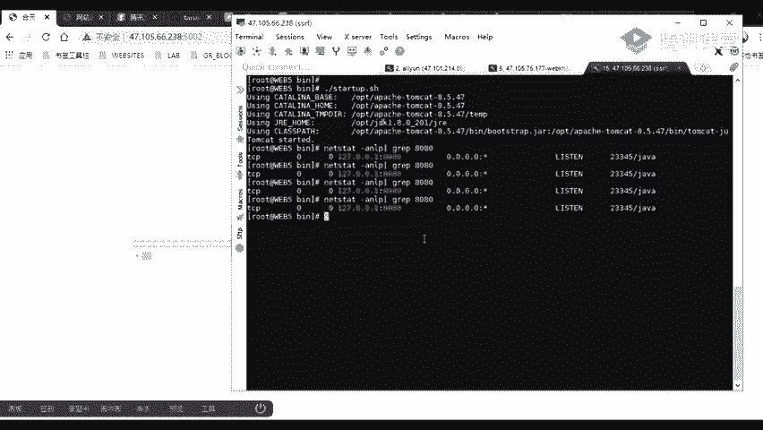

好了。下午访问没反应。呃。这个服务这个服务他有问题的。所以说这个题目呃稍微有一点问题嘛。嗯。嗯。😊，但是啊。但是不影响，因为他的就是这个题目，它的思路就是这样子嘛。

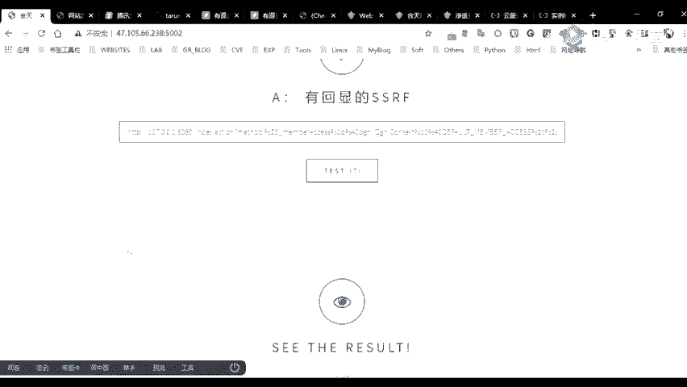

对吧然后其实我。其实我挺好奇，就是啊这个老臣载啊，不老臣子吧。就是你的你说的通过这个呃。工药来去尝试的话，其实我没有明白你为什么去想到使用工药来去呃尝试。

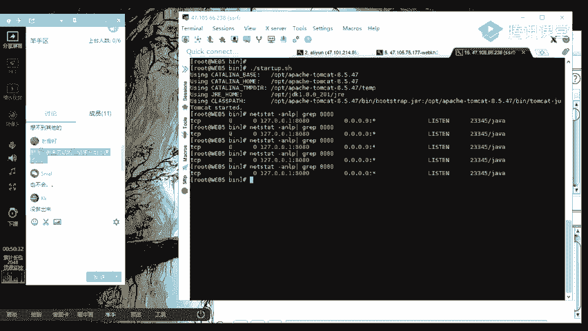

就是说这里的话呃，你通过公钥的话，你是呃你的一个思路是什么呢？啊，就是你去使用什么样子的一个方法去进一个利用的话，你首先你要有一个前提，你要能够去就是说你能够去啊去使用到这样能够去实现这样子的一个方法。

对吧？而我们其实通过前面的一个思路，对吧？前面的一个做法，我们通过这样子的一个啊。通过他的一个呃端口服务的一个信息的一个探测的话，就是你发现这样子的就说这这些端口的话。

它是没有说能够去啊写我们的1个SS取得。当然的话如果说你能够知道这样子的。就你已经知道了它的这个struct的这个框架，对吧？能够去执行命令。能够去执行命令，当然的话你就可以去写嘛。这样的话。

如果你能执行命试的话，直接弹一个需要呃。啊，其实写公钥的话更加更加稳定一点。但是的话你写公钥的话，你是无法去直接的。就说你在公网的话，你是无法直接的去访问到内网的这个服务的。明白我意思吗？

就说我们需要它就呃我因为我们我们是无法直接去从公网访问到呃这个这里的一个内网的。就比如说你一个企业，你你无法是你是无法从就说不通过一些通道来直接去访问到内网的。而我们在这里的话是因为使用了这样子的。

就是说利用了这个SF漏洞。然后的话能够去啊访问到内网的这样子的一些服务。然后的话对内网的这这些服务发起攻击。然后一般的一般的话，一个一个思路的话，不会不会是说去正向的去连接。去连接我们的这种share。

而是通过反弹需。就说通过啊内网的这种服务，它能够去访问公网的话，通过他就是说让内网的一个服务来主动的去连接我们在公网上面的一个需re。也就是反弹一个需要到我们的一个公网服务上面。🤧嗯。😊，🤧嗯。好的。

这样的话就是第一个题目。呃。我把他发群里了。好第二个题目的话就是这个网站源码获取系统。就这一个的话就是这一个页面，然后这一个题目的话。啊。我的锅就是我的问题，就这个题目的话。

我之前啊我弄上去了之后没有去测试。没有测试他他的一个就是。它的一个功能能不能能不能去使用？这个这个题目的话是我今天试了一下，是有问题的。我也我也没。我也没花太多时间去那个就我试了一下话是有问题的。

然后的话这个题目的话是大家没做它的话也没关系啊，就主要的话是理解思路呃。对。这样的话我主要就是介绍思路，介绍思路，以及就是啊介绍啊如何去利用的一些方法。在这里的话，我们同样就是。呃。

我们同样的话就是首先的话就测试它能够可以去使用的这种UL的一个协议。对吧其实跟前面的话也是类似的一个方法。这这些常见的这种题议。然后的话发现能够去使用dicctor协议，对吧？能够去使用这种d协议的话。

那么我们就去探测它一个端口嘛，存环的一个端口。然后探测完之后的话，对吧通过BP的一个爆破，爆破的话能够发现它就是嗯。开放的端开放的端口有这样子的一些端口，就是有80啊，还有3306，还有6379。

然后访问80端口之后的话，其实就是这里的一个首页啊，我们。来访问一下。808呃80端口。访问之后的话，其实它就是当前的一个就是这里的一个页面，就是它的一个源码。

然后的话就是呃33063306的话也也是一个数据库。然后我们主要的话就是看这里就是6379，6379的话就是我们常见的一个radius。然后常见的，然后这一个readd时的话。呃。就是碰到绿的时候的话。

大家首先可以去想去尝试去使用这种。去使用radius的一个未授权。然后的话因为我们前面也介绍了，对吧？就是radius的一个未授权的话，未授权访问的话，我们是能够去get shell的。哦。

get share的话，这里的一个readd，get share的话有以下的这样子的一些就是啊利用的一些方法，就是能够去反谈一个he。我这里的话主要就是介绍这一些方法吧。

因为这个题目的话是我试的话是有问题的，就是一直都写不进去。然呃大家要做的话，其实可以去那一个就是我们实验室，就是那一个mediadia。就是S25攻击内网read的那个实验。去建一个尝试。

然后这样的话我首先呃就是我们首先来看一下第一种。第一种的话就是我们通过写入这样子的SSHK。也就是我们昨天的昨天的那个呃。那个vi logic的那个SSF对吧？那个的话啊，我们通过探测的话。

通过端口探测的话，发现它内网是开放了有这样子的一个呃开放了1个6379的一个端口。然后这1个6379的一个端口的话，正好是radius。然我们可以通过呃它的1个CRF的一个注入。

对吧来去发送我们这样子的一个呃，就是像我们的一个readdius服务，发送我们的这样子的一个呃脚本，发送我们的一个payload来去写入我们的1个SS取SS取的一个key。而这一个key的话。

它的一个生成呃，其昨天也讲了，大家有没有去尝试啊？又有没有自己去尝试去生成这样子的1个SHK以及啊就通过秘密登录，对吧？这些的话是比较呃。常见的一些就是知识点啊。然后的话呃。

首先的话我们想要去利用这样子的一个写入SHP的一个方法，我们需要生成这样子的一个T。这个key的话其实就是一个公钥。这个公钥的话，我们需要把它写入到我们啊要攻击的那个服务器的一个呃。

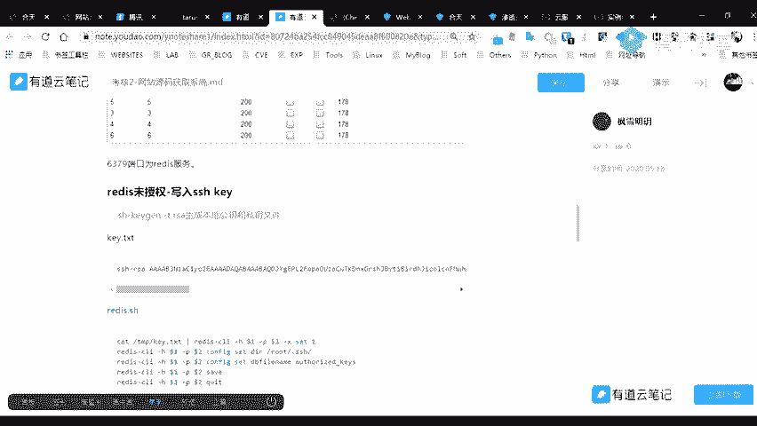

嗯。这一个目录。Yeah。有一个点SH的一个隐藏目录。然后要把它写到这个authorize的 case这样子的一个目录下面。这个目录的话里面的话就存储的我们的这样子的一个公钥。嗯。😊。

然后我们把它写进去之后的话，我们就能够在我们的就是啊含有私药。就说还有私钥的这一个公这一个服务器上面来去敏密的去登录呃，我们写入公钥的这样子的一个机器。

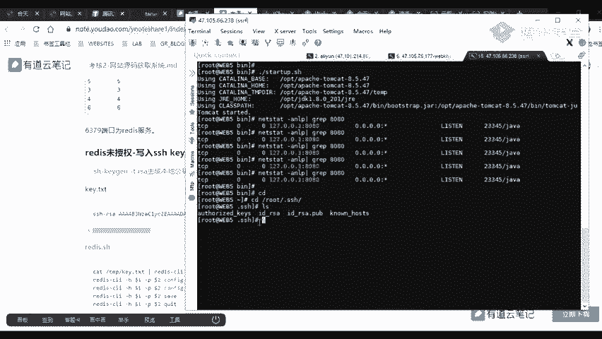

当然在这里的话也是同样的，就是说呃。也是就是说同样的，就是我们在这里写入进去的话，写入到它的一个内网之后的话，其实呃。就是我们无法去直接去进行一个访问的。然后这一个这里的一个写入SHP的话。

是针对于那些在公网上面的这种radius这种radius的一个未授权。这种漏洞对吧？我们可以通过写入这个T写入到它公网的一个服务器上面。然后的话我们再去呃再去通过我们的一个呃。

是要所在的一个服务器去连接这一个啊目标的这个服务器。也就不需要去密，不需要去使用到密码来去进行一个登录。然后后面的话呃就是。一个脚本就说我们去对这样子一个radius未授群攻击的一个脚本。

其实这个脚本的话，跟我们前面讲的那个radius未授群的这一个。呃，写入电池任务的这一个脚本其实是类似的，它的一个原它的一个原理也是一样的。就我们在这里的话，我们把这个key对吧？

把这个key把它写到这个key点tex文件，然后我们把它放到这个t目录，或者说其他的目录。我们通过catca的话就是访问就是啊就是读取这一个文件里面的一个内容嘛，对吧？

然后的话我们把这一个读取的一个文件内容作为这里的一个输入。这里的一个输入的话，就是通过readers啊，就是通过read客户端。去连接指定的一个呃瑞的一个服务器。然的话把它那个呃值。就是。

添加一个这样子的一个key唯一的。然后值为我们在这里啊写入的这1个SHT的一个值。添加这样子的一个呃key然后的话再去啊通过readdius去的一个confi的一个设置。

来把我们的这个值写入到这样你的一个root。点SH取的一个目录，下面的这个auth key的一个文件里面。🤧嗯。呃，我们知道这样子一个脚本的话，我们回想一下，就是我们上节课讲那个电写电视任务的时候。

对吧？我们需我们想要去啊像我们的这样子的一个readdius服务器发送我们的这种啊。数据的话，我们需要对这些数据做一个处理。然，这里处理的话，我们首先需要获就是获取到它的这样子的一个。发送的一个数据。

其实这个数据的话。呃。就这一个数据的话其实都比较类似啊。就比如说我在这里的话，我在这里是使用的这样子的一个。脚本对吧？使用的一个这样子的脚本去获取需，对吧？然后我通过啊这个scket。

然获取到它的一个传递的任这里的一串数据是这样子的。

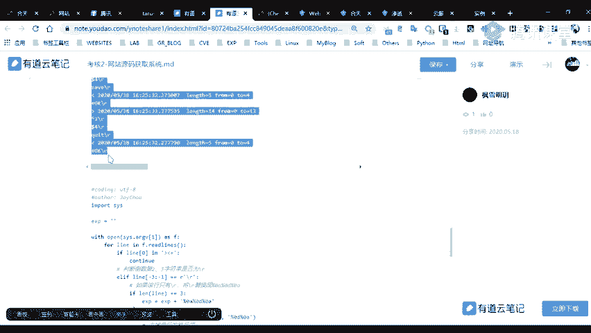

对吧。然后的话。我们可以把我们这里获取的也可以把它给扩ll下来。抠下来之后的话，其实呃。

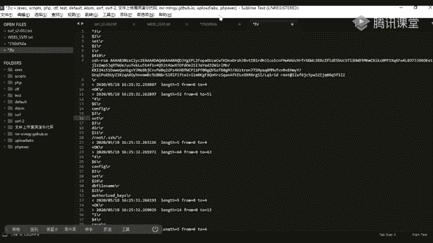

与我们前面呢做一个对比吧，前面的是。这个。呃。再一个。给我们的前面的这一个做一个对比。

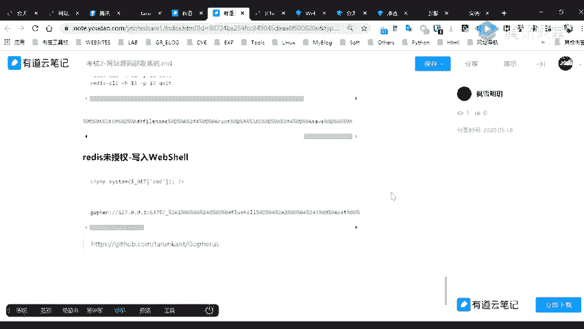

其实可以发现的话，其实前面的这样子的一些内容的话，其实啊类似的。然后主要它的一个不同的话，就是在这里的一个啊。你执行的一个命令，也就是这里的一部分。可以看到我们前面。写这个定时任务的话就是在这里嘛。

对吧？我们的一个呃定时任务的一个脚本就是在写入了这里，然后的话把它就是通过set嘛，通过setsst了，就是添加了这样子的一个呃T为一的这样子的一个呃进。然后有了这一个进的话。

我们在添加了这样子的一个值，就是一个电视任务的一个脚本，对吧？然后上面的话其实就是我们添加了这样子的一个径为一，然后值为我们的这样子的一个啊SHK的一个。呃，脚本然，他还有的一个不同的话。

就是我们这里的。我们这里config search的这样子一个目录。就电磁录它它的一个目录是这里嘛，是这样子的，就是st点DR就是sett目录嘛。然后再写SHK的话，就是这一个目录嘛。对吧其实都是。

类似的这样子的一些数据。嗯。好的话我们针对这样子的一个数据的话，我们要处理，我们要就是要把它呃进行一个处理，把它转换成我们能够直接去使用gofor协议。

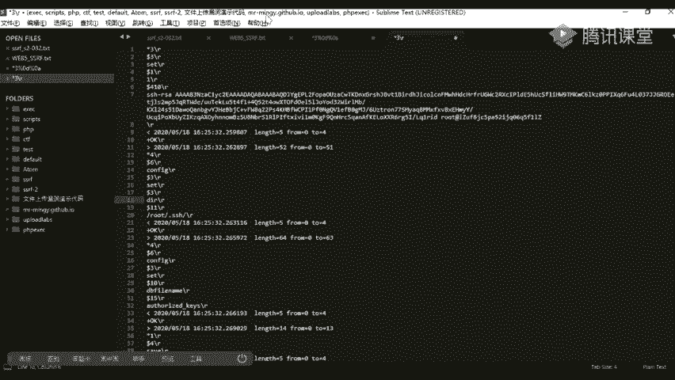

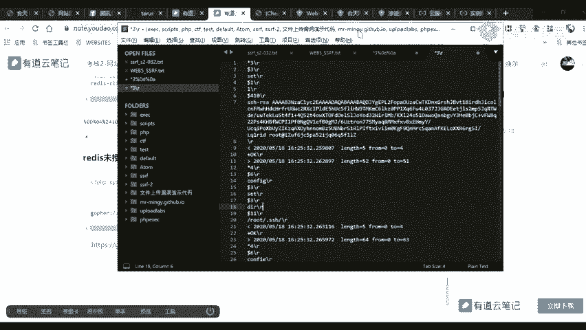

使用这样子go货协议去进行一个发送。所以的话我们需要对他做一个转换，然后转换的话其实就是呃。这里的话有一个脚本，就是不用脚本也可以啊。我们的一个它的一个转换的一个规则，其实就是我这句话给大家说一下。

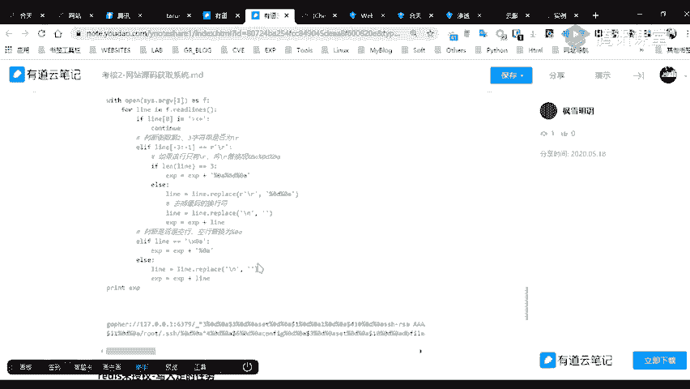

啊。就以上面的这一个为例。🤧哼。上面这里的话其实呃开头的话也是有这样子的一个就是时间嘛，对吧？就是说他的一个请求请求的一个时间。🤧K。然后的话我们。获取到的话就是这样子的一创值嘛。

我们首先第一个规则的话就是。はい。😊，把这里的有这种开头的，就是有这种方向，就大于小于开头的，把它给删掉。就是把它给去掉。Okay。然后还有的话就是像这种加OK加OK的这一行把它给去掉。就是像这种。

🤧哼。这种。多余的这种数据就没有用的一个数据，就是一些时间，还有这种返回的这种命令执行成功之后的这种这种值把它给去掉。去掉之后的话就是像这样子的一串。然后大家要注意的话，就是别就是别弄错了。

就一般的话就是呃前面的话我们也说了，就是5条命令嘛，它返回的话就有5个OK。要把这5个okK都给删掉，然后的话。呃，前面的话就是。两条转换规则。然后第三条的话就是把这个杠R这个杠R的话。

其实就是我们的一个呃换行嘛，好吧回车嘛。🤧然，我们需要把这个杠R把它给转化成，就是我们。这里是换蛤吗。好吧，这里是回车嘛，回车的话，然后我们需要把它转化成一个。啊，就是。换行回子。呃。

回车换行就杠R杠N。这种然后的话需要把它转化成我们的一个basin呃，一个UR的一个编码，也就是百分之。嗯。0%D0%A。这个的话就是我们的一个回车换行。

这1个UR编码然号我们需要把这个杠杆全都给它替换掉。也就这些。😊，全都给他替换成0D0A。诶。然，听完之后的话就是像这样子的一串数据，对吧？然后的话我们需要把就是多余的这种换行把它给。删掉。就把它给画。

换成一句话。然后这这里的话就是其实就是我们的一个payout的。然后这里的一个payout的话，我们直接可以通过我们的一个go for协议。

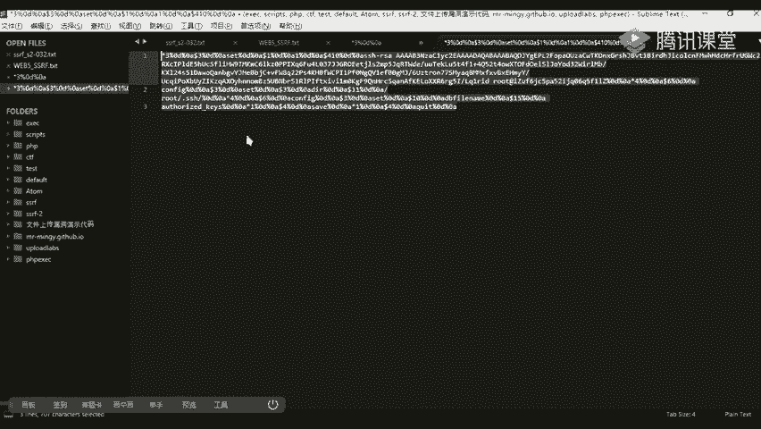

直接去进行个发送然后go for的话。啊，这样的话再提一下，就是go for的话，我们前面的话是写我们的1个IP以及端口嘛，也就是我们服务的1个IP以及端口。然后后面的话有一个竖写啊，就是下划线。

就注意是干下划线，下划线后面的话是接我们的就是要传递的这个数据，也就是我们要发送的这样子的一个这样子的一个payload，也如这些创值。

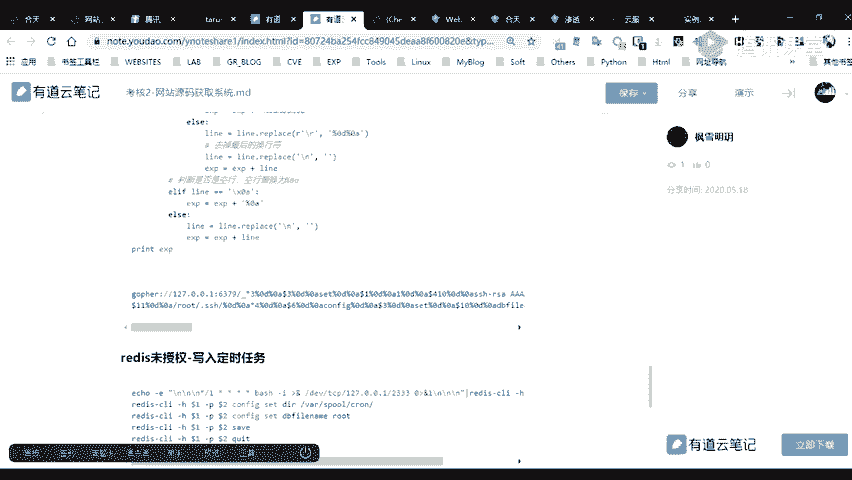

就是我们这里得到这一串值，然后的话我们直接通过go否协议去进行一个发送。

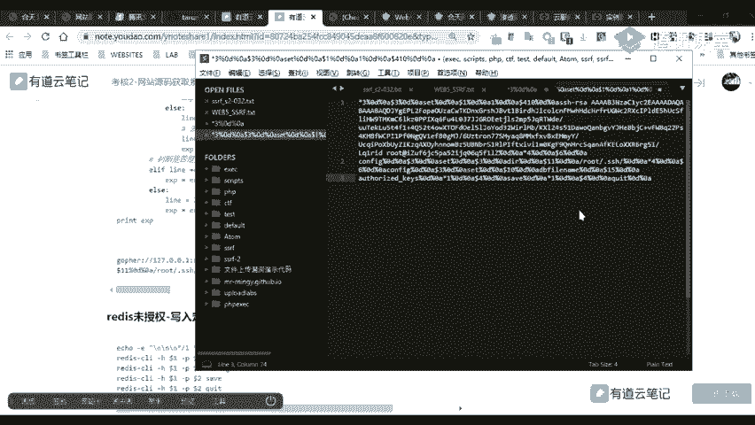

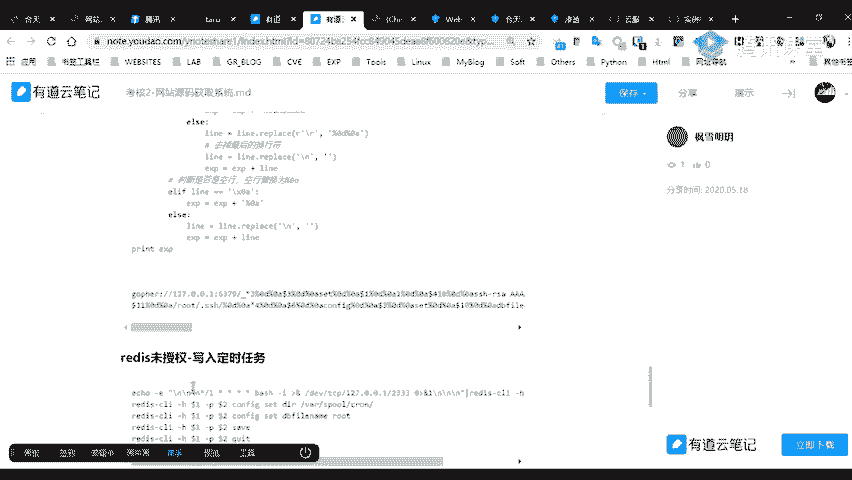

嗯。😊，Yeah。

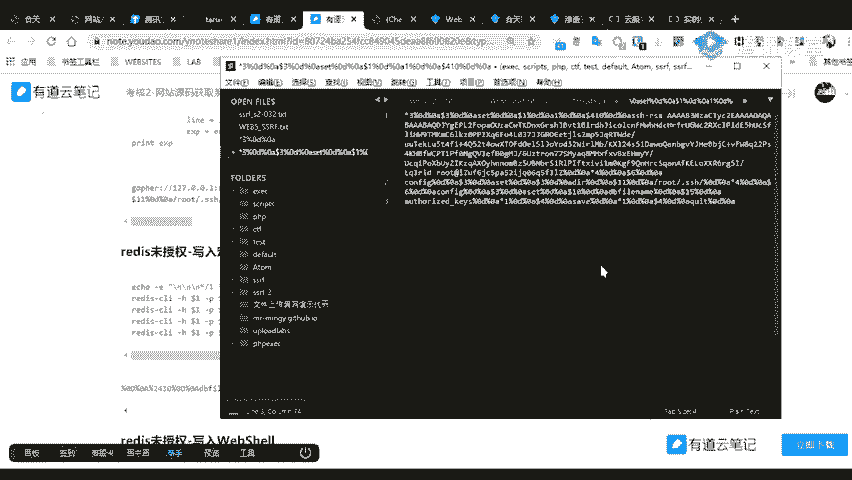

He。也是这就是我们构造的一个piload。唉，不对啊。Yeah。Ca。这样子才是一句一句话。Okay。好，那我们就可以通过这里去进行一个发送。然后其实前提的话呃。因为其实我们在去进行这一步之前。

其实我们需要对我们的这种go for协议去进行一个测试，对吧？你首先需要测试它是否能够去支持我们的这这种协议，对吧？如果他不支不支持这种go货协议的话。

那么我们我们就无法去进行一个通过go for协议去发起我们的一个攻击。所以的话我们前提的话就是你能够啊证实能够去测试出来，它是能够去支持这样一个go for协议的然后的话我们直接去进行一个发送。

那么这里的话是有问题的。

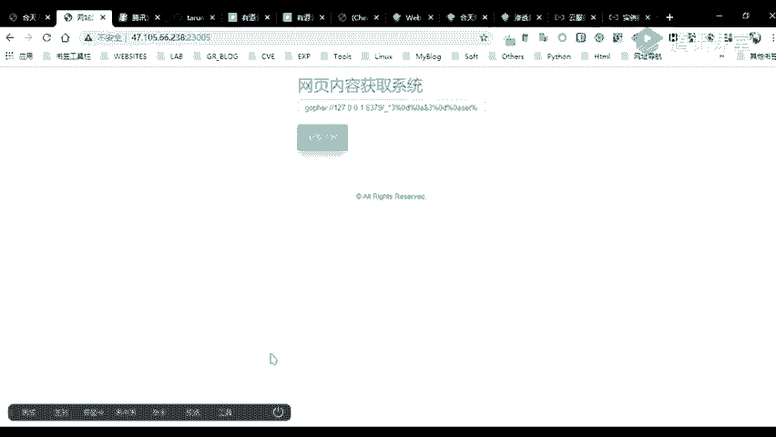

我是在一个就是。做了一个多口。呃。Okay。Okay。是有做了这样子的一个doer。🤧は。这就是它的一个源码。然后的话。呃。然后这里的话是没有写进去的。就这个题中这个题目的话有点问题。

我这里的话之前没有去进行个测试。然后其实这里的话一个key都没有写进去啊，也就是我们的这里的就发送的这个数据，没有到我们的这一个readdius服务器。

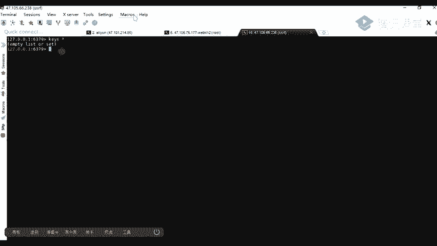

即系你我。

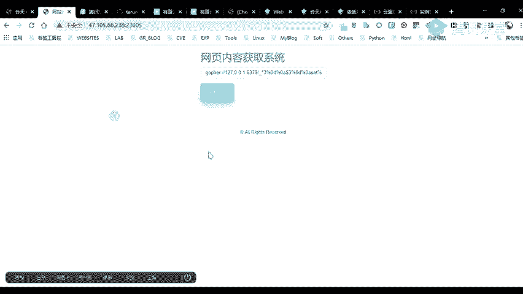

然后这个题目的话，我们主要讲思路吧。

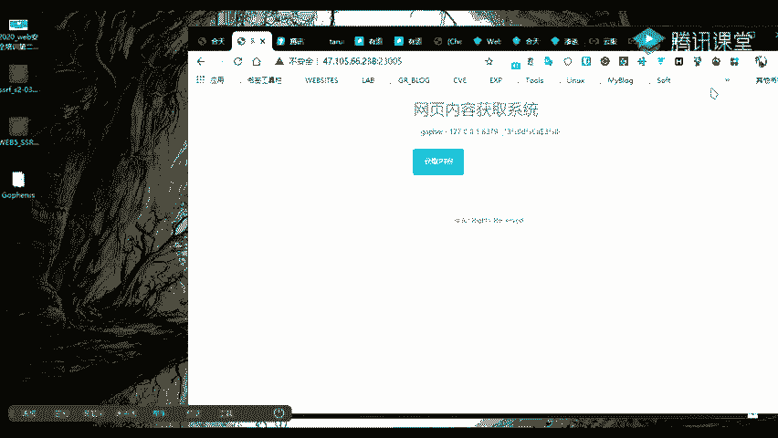

这。前面它就是通过这个radius写我们的1个SHP就是我们如何去构造这样子的一个payload。就构造构造这种通过go货协议去进行一个发送的这种配load的。然后的话就写电池任务的话。

其实也是一样的嘛，也是一样的。呃，其实这种的话讲一个其他的都类似。然后的话就是这一个嗯。readdius未授权写入web shell。就我们也可以通过readdius未授权。

就是像我们的一个web跟目录直接写入我们的这样子的一个一句话码。是。我们可以直接直接通过写入，因为它本身就能够去向我们的一个服务端，就是readds它未授权。

它本来就能够向我们的一个服务器写入一个文件嘛，对吧？那么我们也可以直接写入我们的一个一一句话木码嘛。然后他写的一个一句话木马的话，其实嗯。其实也是类似的。就写就是比如说像这样子的一个脚本。🤧嗯。

然后的话他就把他的一个就是把我们的这里的这一个内容，对吧？同样的就是呃就像在这里嘛，把它存一个文件嘛，存一个文件之后的话，我们把它就是写入到啊任意的一个进。

然后把它的一个值的话就设为我们这里的啊一个一句话码的一个内容。然后的话就是通过这样子的一个脚本，对吧？来去就是得到这样子的一个数据。其实我们也可以就是说直接直接更改它的这样子的一个数据，就把这里。

把这里的一个内容把它给。改掉改成我们的一一句话嘛。然后的话相应的这里的一个字这里的一个字符，这里的一个字符数，我们同样呢需要做一个更改。然后字符数的一个计算的话，其实就是这里的一个数值。然。

这里的话总共是有400410。🤧K。呃。最后的话再就是。给大家一个脚本吧。就这这里的一个有一个。别人写的一个脚本。就这个脚本的话就省略了就是这里的这样子的一些步骤。就前面的这种获取这种的。

然后去进行一个你手动的去生成这种配套的一个步骤。这脚本的话就直接通过呃执行这一个脚本。

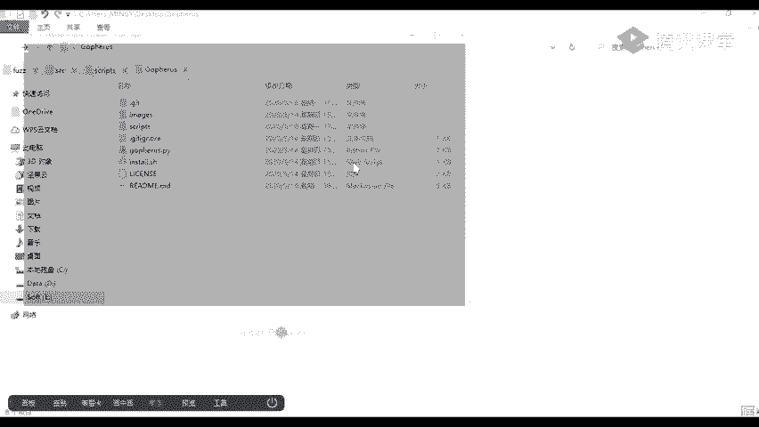

就能够生成对应的这种配漏的。和。通过这一个。exportit这一个参数。然后这样的话它是支持有这种my circle啊，还有first CGI radiussomeTP还这个jaics还有其他的这种。

呃，其他的这种服务他都能够去用这样的一个脚本去生成，这样子的就是去生成，能够使用这种好吧，能够去使用go货协议去发送的这种payload的。而后我们这里的话是使用radius嘛。

Previousious。然这里的话他会让你选这样子的一个就是呃你想要的一个需要。首第一个的话就是反弹sha尔。反弹sha尔的话，其实它就是一个呃写入一个定时任务来反弹shall。

然后还有的话就是写入1个PHP的1个we share。我们可以。然后这里的话就是输入你反弹需要的1个IP嘛，也就是我们呃就那个ba需那个ba就是DVTCP。然后后面我们要反谈的1个IP。

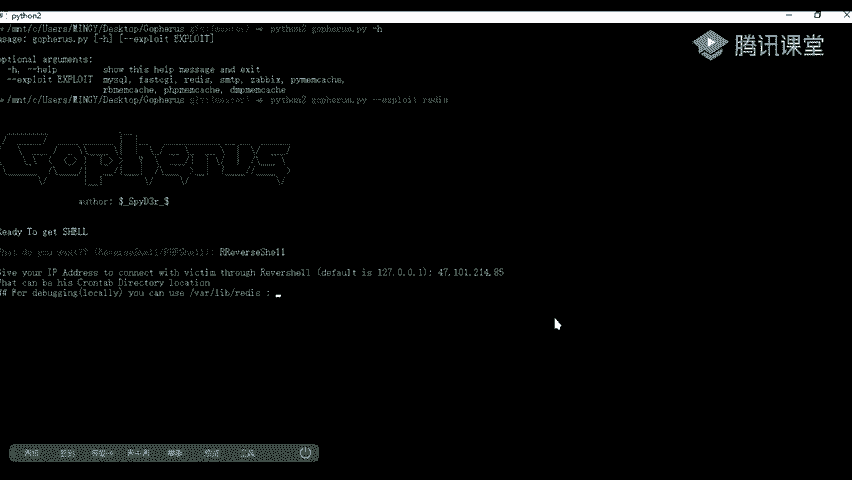

后面的话默认就行了，然后它就会生成这样子的一个呃能够去使用go for协议去。

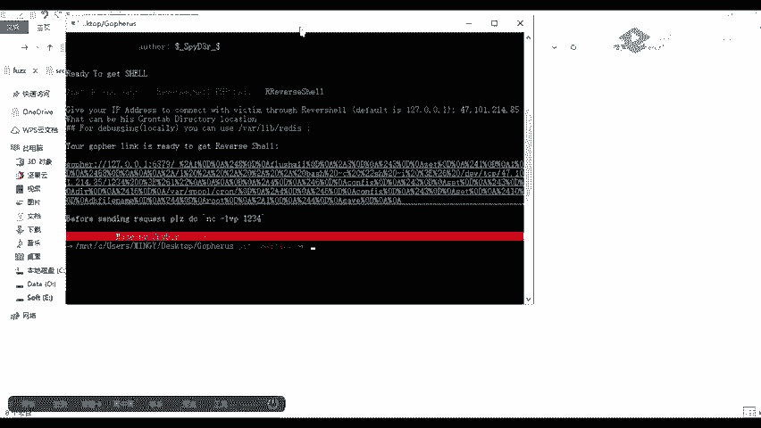

啊，发送了这样子一个payload。然我们只需要去在我们的一个我们这里输入的这个IP这个公网IP的这个服务器上面今添1个1234的一个端口。然后的话我们通过购货协议发送这里的一个支付串。好吧。

发送这样子一个配out就能够反弹一个需回来。就是从它的一个配load，其实我们也能够。就大概的能看出来，它就是啊跟我们的一个写定时任务是一样的。然后他的一个反弹的一个呃代码话就是这里嘛。

通过败学的那个DVTCP去反弹的。

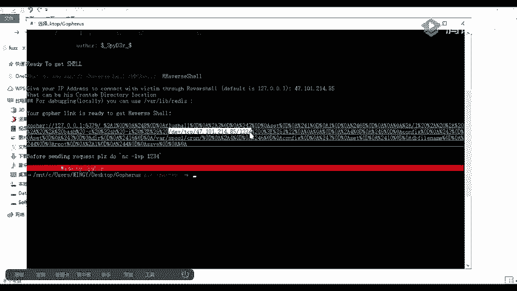

然后其实像这种的话，其实大家如果懂python的话，自己也能够去写的。我们其实可以看一下它的一个代码，就这一个生成readdius的一个代码。他的一个代码其实就是。呃，主要的话就这2块。

就这一块配load的，还有这一块 payload的这2块 payload的话，其实就是我们刚刚的那一个一个反弹sha，以及写入一个web share的一个啊payload的。啊。

其实这里的话我们能够知道啊，也能够发现，其实跟我们前面这里。

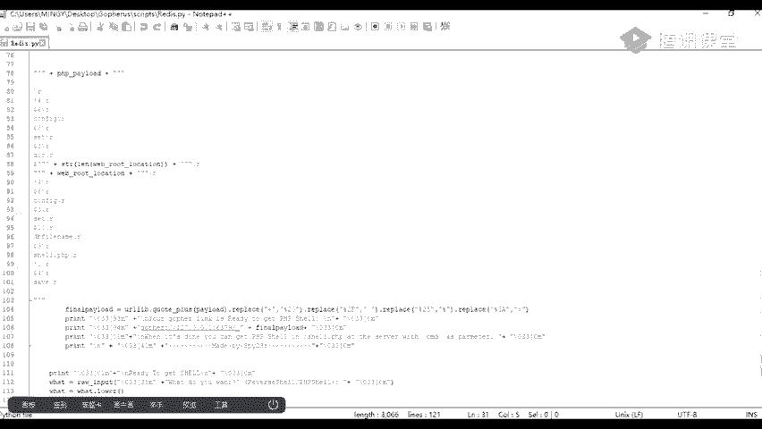

呃，跟我们前面。这样子获得的这种是一样的对吧？它也是这样子去进行一个构造的。然后这里的话它是呃。

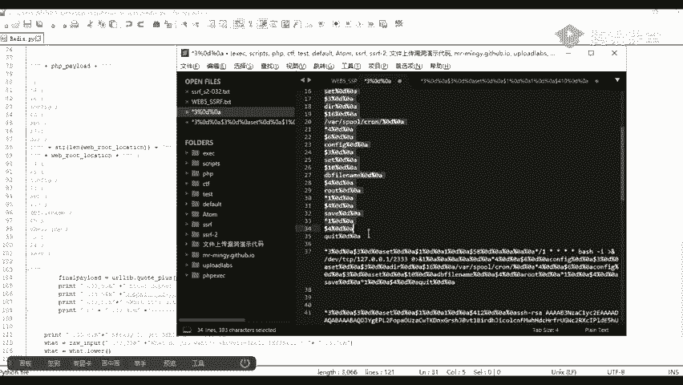

获取到了这样子，然后。把里面的这样子的一些就是可变的一些呃参数值给它。做了一些处理，就把它做成了一个变量嘛，对吧？像配load的，我们的这里的1个PHP的1一个配load的。呃。

这个是返回1个PHP的1个we share嘛。我们这里的一个 payload的话，其实我们是可以去直接去输入自己的一个payload。然后的话我们输入payload之后的话，它就会把它。拼接到这里。

就把它添加到这里来。然后这里的话就是我们这里输入的这个payload的，它的一个长度嘛。

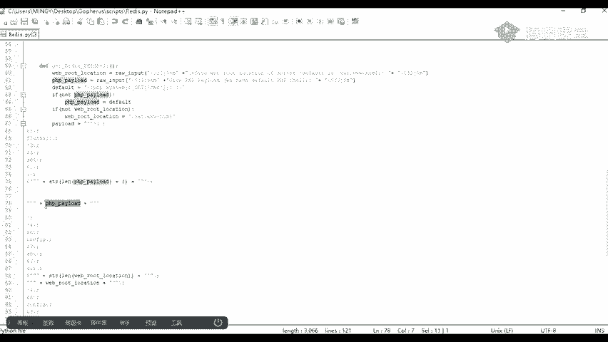

也就是我们的呃。

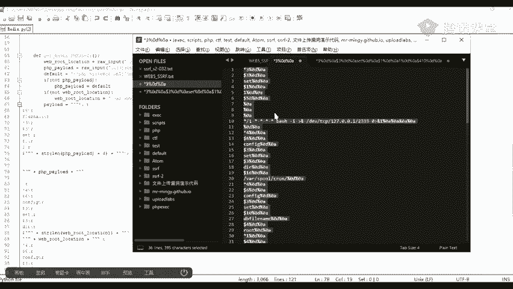

这里的一个长度，这里的话是58，也就是这一串的一个长度嘛。然后以及就是我们的一个外表的一个目录。这里的一个外表目录也是呃就是每一个外表附件它都不一样嘛，对吧？你可以去自定义。然后的话再对他做一些处理。

这里处理的话，他把他已经把那一个就是多余的这种这种。呃。时间什么的，还有这种加OK呀，这种加OK的这种都已经给删除掉了。而他剩下的只需要去进行一个处理的话，就是像这个干案。对吧这刚R的话。

我们其实也能够看到它这里杠R的话是把把它做了一个替换。嗯。他是有把它做一个替换的。Plus。在哪。😔，你大一问啊。他这句话同样的是有把这个杠二给做一个替换，替换成了我们的那个百分之。

我们从它的生成的一个代码来看。

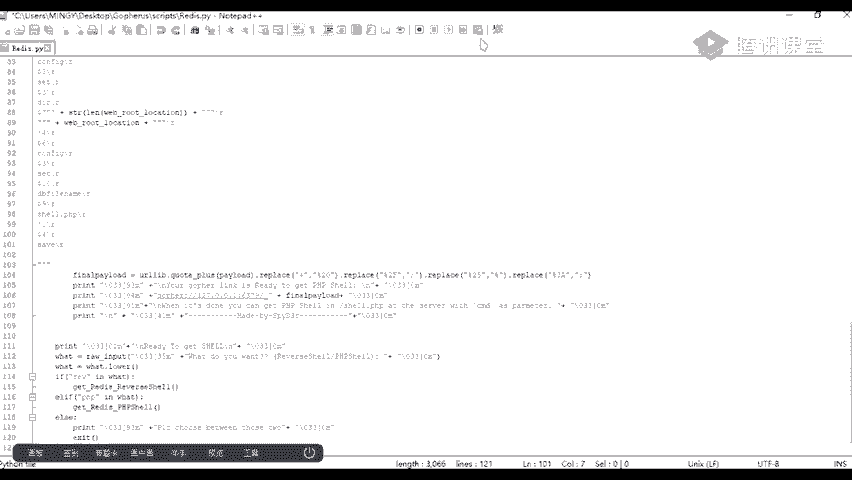

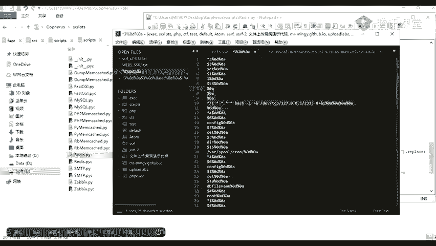

呃，这里。

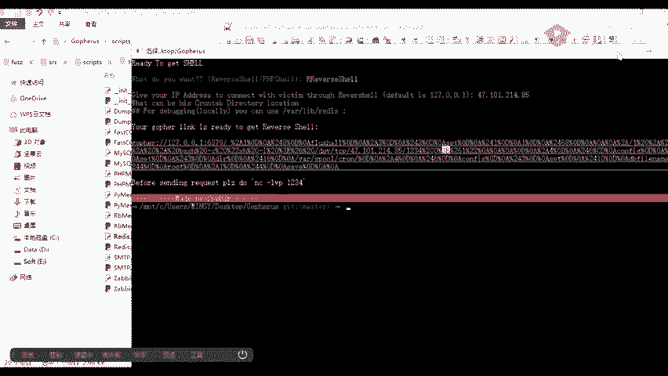

给我们可以看一下，它同样的就是可以看一下这里0D0%A对吧？然后跟我们。

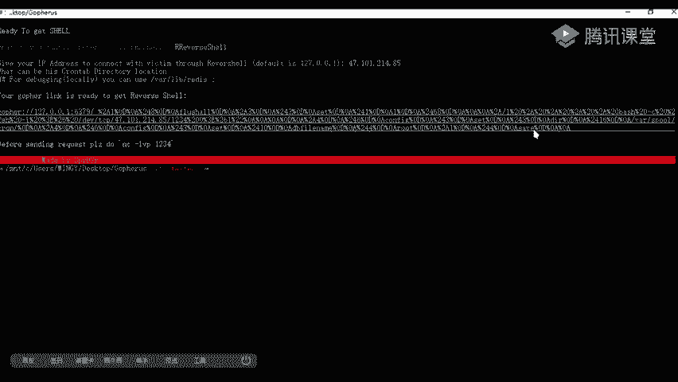

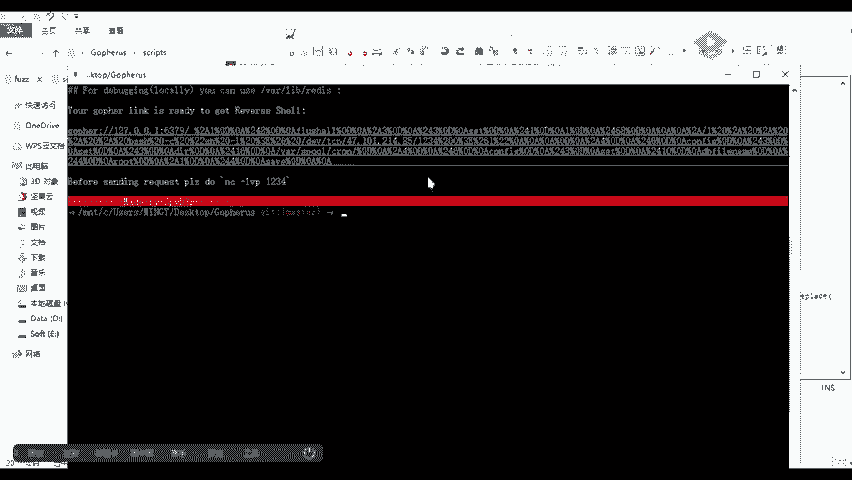

呃。这里的话其实是一样的，就0%D0A。对吧然后这里的话它是做了一个大写的一个，就全部都统一了一个大写嘛。

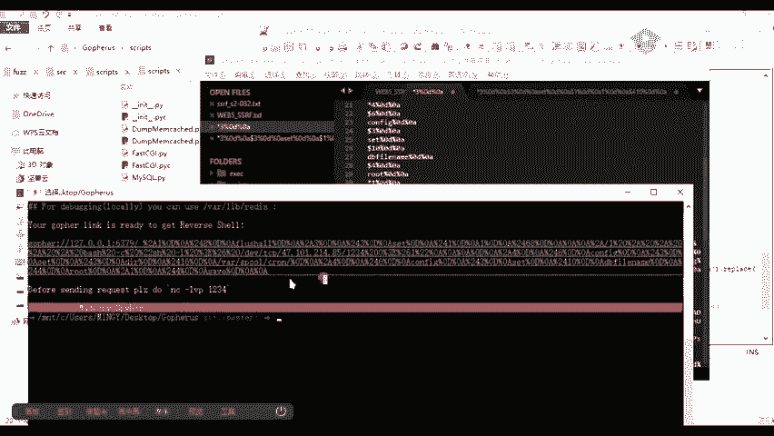

🤧嗯。啊，上面的这一个也是类似的。就写入一个电池任务嘛。然后我们这里输入的1个IP。就我们的一个服务端的1个IP。端口的话是斜持了1个1234。

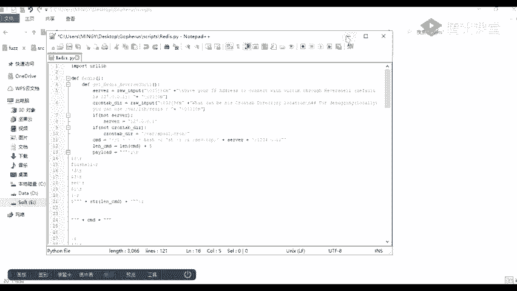

这就是他的一个脚本啊。那这种的话，大家其实呃理解了之后的话，其实也可以自己去进行一个书写。

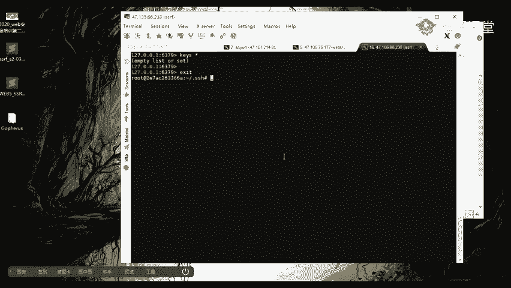

就如果懂派on的话，还是比较简单的。呃。然后的话呃本节课的一个内容的话大概就是这些啊。然后大家有没有什么疑问呢？有没有什么问题啊？大家有有没有什么疑问？或者说哪里哪里没有听懂啊，没哪里没有懂。

都可以提出来。都没有问题吗？都没都没问题话的吗？把这个发群里啊。🤧咳。这两个文档我都发群里了，大家可以去。就是。可以把它做一个笔记嘛。好，这个。再一个文档的话。我也发群里啊。嗯。😊。

然后呃本节课的个内容的话就到这里结束了。大家没有问题的话呢。呃，下面的话。呃，稍微就是。

花大家一点时间，就是打个广告吧。

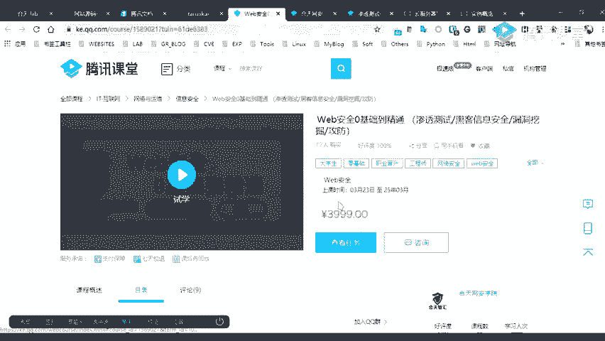

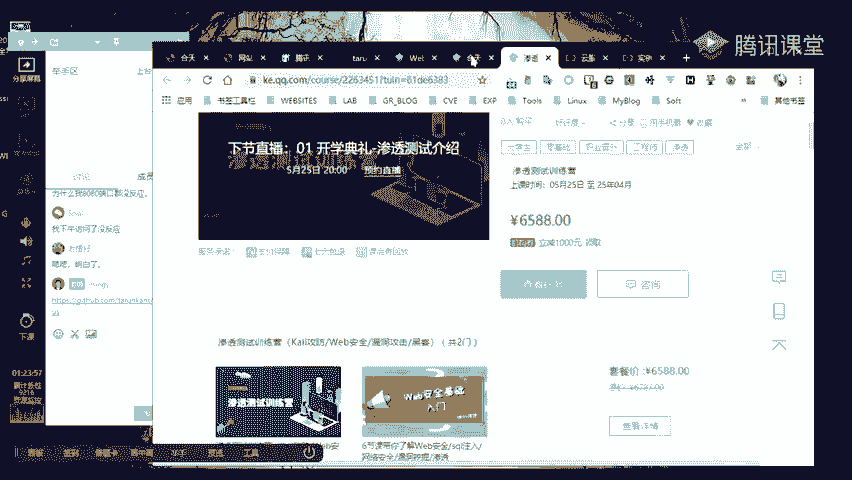

就我们的这一个wordb的一个就wordb安全连基础道精通的这一个课程的话，呃，就课程内容的话大概的话就就就结束了。就到这里的话，后面的话还有就一些还有一些内容嘛，就还有三节课。然。

我们呃和天晚安学院的话。就是最近的话又上了一节课，好吧上上了一门课程。那这门课程的话就是一个渗透测试的一个训练营。然后这门课程的话嗯。大家可以去看一下。这门课程的话呃，大家可以看一下目录啊。

现在话是已经开始在报名了，就是呃把等这一次的一个wordb的一个内容。弄完之后的话，我们下一期的话就是呃讲这一个渗透测试的一个训练营。给一个内容。

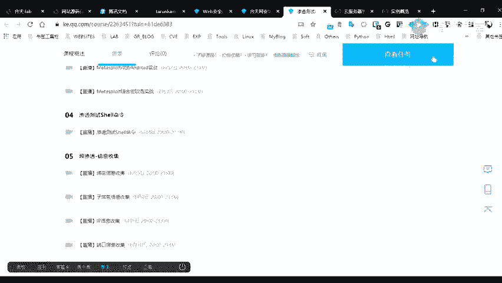

主要的一个内容的话，其实就呃大家可以看一下目录吧。

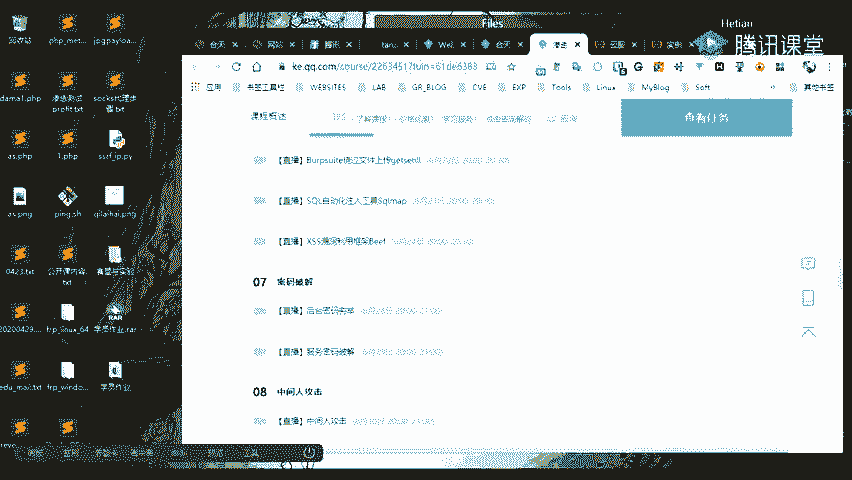

呃。大家可以看一下这个图片，这里的话就是主要的我们呃一个基本的一个大纲就是。呃，会讲的一部分的一个内容就是主要会讲的一些内容。当然它不是所有的一些内容啊。就不知道大家有没有去了解的。

就是渗透测试的一个基本的一个流程。然下节课的话那个。呃，下节课的话应该会也会给大家基本的一个介绍，就是渗透测试的一个基本的一个流程。然后的话呃我们这一个课程的话，就是呃针对这一个渗透测试的一个流程的话。

呃，专门设计的一个就中间他所涉及到的一些知识点的话。呃。给大家做一个就是讲解。然后有比如说有包括就是我们常常用的一个matportMSF。他的一些攻击的一个实战。

还有的话就是wordb漏洞利用的一些集合，就包括。啊。vi logicstruct two接bos等等的这种。还有生个PHP等等的这种漏洞的一个利用。然后其实wordb的话就是在渗透测试里面的话。

wordb的话是只是就是占了其中的一块啊。然后主要的话还有其他的一些就是像比如说我们的一个就渗透测试的一个流程。首先的第一步的话就是信息收集嘛，对吧？信息收集的话，我们呃因为我们其实现在的话就是。呃。

这种进行一个渗透测试的话，它的一些啊目标它都是从一个word博网站开始的对吧？就比如说你去YSSRCE，你也是通过这样子的一个外博网站开始。然后的话针对这样子的一个目标去进行一个信息的一个收集。

然后进行信息收集的话就有。这样子的一些信息，比如说域名子域名IP端口等等的这样的一些信息的一些收集。你在外表外表的话其实也有讲。当样的话呃在这里的话可能会就是更加全面一点。

然后的话我们再去通过相应的一些web的一些漏洞，对吧？通过这样子的一些web漏洞之后的话，得到它的一个web服务器的一个需要。得到这一个需要之后的话，我们还能够去进行。就说我们得到这样子的一个需要之话。

我们还能去干嘛呢？然后下面的话就是对针对于我们就得到这样子的一个web需之后，我们能够去进行的一些操作。也就是我们能够去进一步的一个测试。好，进一步测试的话，像嗯。在后面的话就有这样子的一些。啊，我们。

针对我们得到这一个web share，就通过这一个呃web服务器的一个web share来去进行一个内网的一个渗透。对吧。因为其实呃在就是。我们的一些业务啊一些业务的话，它会有这样子的一些就是边界区。

这些区域的话，就像比如说我们的1个DM之1的一个区域。这种区域的话啊，一般的这种公企业的这种web服务器，它都会在这个区域。这个区域的话就是啊它是能够去访问外网的。外网能够去直接访问到。

然后的话在内网的话。呃，因为有一些数据它是需要从内网去进行一个获取的。所以的话它其实也能够去访问到内网的这样子的一些资源。就比如说我们的1个SSF嘛，对吧？他同样的能就是如果他没有他存在这样子的一个。

呃，漏洞能够去允许访问内网的请求内网的一个资源的话。然后的话我们就能够去通过这样子的一个。需来进一步的去攻击内网。然后攻击内网的话，我们怎么去进行一个操作呢？就是它中间涉及到哪一些知识点。对。

就同样的进行了一个内网渗透的话，它同样也是需要去进行一个信息收集。它信息的一个收集的话，就不是说像这种我们进行一个外表渗透的时候的这种外表的一个域名的这种信息收集了。然后在内网的话。

我们进行的一个信息收集的话，主要就是主机，对吧？就在内网的话主要就是一些啊机器嘛，就服务器，还有的话像PC机等等的这种信息的一个收集。好，包括呃。主机的一些凭证，凭证的话就是我们的一些密码信息，对吧？

登录信息等等。然后我们通过这样子的一些信息的话来去。进一步的去就是扩大我们的一个攻击的一个范围。然后这一个这样子的一些操作的话，都是在内网去进行一个操作的。而进行在内网操作的话，中间的话哦。

会有涉及到这种像内网反弹需要，对吧？我们需要从内网当当中如何去反弹一个sll，反弹一个稳定的这种sll，反弹到我们的一个外网。然后的话我们直接通过外网能够去直接去啊攻击内网的一个机器。

因为你毕竟SSF像这种SSF漏洞的话，它同样的是有局限性的。就他就没有说像直接反弹一个需要来这样子去容易操作。然后的话还有的话就是像这种内网代理啊，就通过一个st代理。我们能因为企业的一个内网的话。

它不是说只有一层的。就一些复杂的一些企业的一个内网的话，它很多层就说一层一层的。而且的话内网的一些呃机器的话，它有些像比如说银行、电网等等的这种机器，它是呃就它的一个机器的话，它是不允许去访问外网的。

他是没有外玩的。所以说针对这样子的一些无法去访问外网的一些机器。然后的话它因为又是在内网，我们在外网也是无法去直接访问到的。不然的话，我们可以通过这样子的一些内网的一个代理，也就是sck的代理。

来建立这样子的一个s的一个通道。然后的话。稳定的去。进行一个内网的一个渗透的一个操作。然后还有就是权限的一个提升。权限提升的话，简单来说就是提权嘛，对吧？像我们常经常去呃得到的这种外表的一个权限的话。

它就是一个外表服务器的一个权限。那比如说阿帕奇，还有像呃IS等等的这种。它是一个普通的一个权限。然后这些普通权限的话，它的一个操作是有限的。我们需要通过一些方法来把它提提全。比如说在link个里面的话。

就把它提全提成为我们的一个root权限，对吧？因为我们的一个权限越高的话，我们能够去进行的一些操作的话就更多。然后还有的话就是我们获取到他一个权限，对吧？我们想要去持续的去。

就是说持续的去对内网的这种机器去进行控制的话，我们就需要对它做一个啊权限的一个持久化，就需要。利用一些技术，像比如说呃。我们的一些进程注入，把我们的一个呃需要把它给注入到我们的一个进程当中。

还有通过第二劫持等等的这样子的一些呃方法来维持我们的一个权限。然后最后的话我们就是大概的这样子过来这样子一个流程是吧，对吧？我们就需要收尾嘛，收尾的话就是把我们操作一些痕迹啊，对吧？

你因为你在内网去进行操作的话，它其实在这种windows机器电机器上面，你去操作的话，都会有留下这样子的一些记录的。然后的话我们需要对这些记录做一些清除。就是不让别人发现嘛。

然后呃刚刚的话我针对了我们这个看课程大纲的话，就是大概的给大家就是介绍了一下。呃，就是渗透测试它中间会去涉及到的一些呃内容。

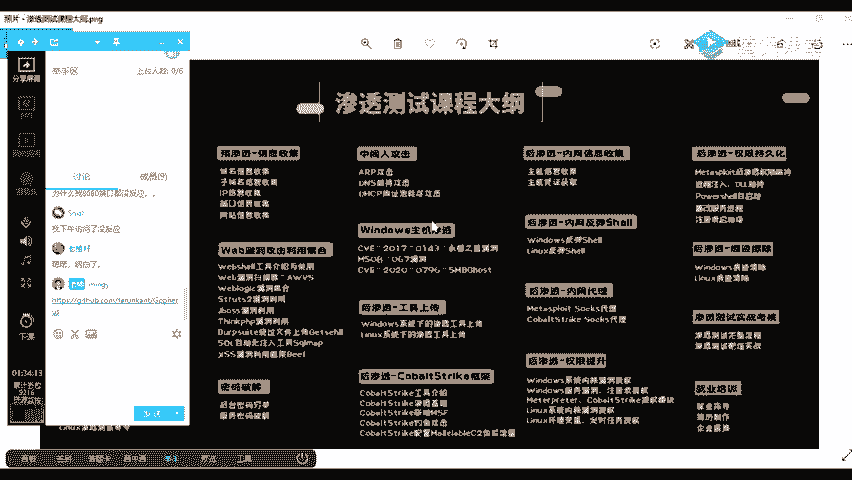

🤧嗯。就呃大家可能。就是大家可能就是接触的多的话，其实也是就是wordb相关的一些知识嘛，对吧？就可能对于这些呃内网的。这些知识的话了解的不是很多。然后可能对于整个的这种渗透测试流程。

其实呃web安全跟渗透测试的一个概念的话，其实也是比较模糊的。就其实你渗透测试里面的话，你也要去用到这样子的一个web外b漏洞的一些攻击方法。因为其实现在的话这种都是。好，在这个就web2。0嘛，2。

0时代开始嘛，就是我们的这种web应用的话都是越来越多了。就是说一些呃业务啊什么的，都是通过web运web应用去进行一个展示嘛，对吧？然后的话其实wordb的相关的一些攻击漏洞的话。

是我们去进行这个渗透测试的一个入口。就我们通过这种常见的就说。常见的这种存在外表漏洞的这种站点。来作为一个。呃，渗透测试就是说走向内网的这样子的一个入口点。啊，不知道大家有没有就是听懂过。

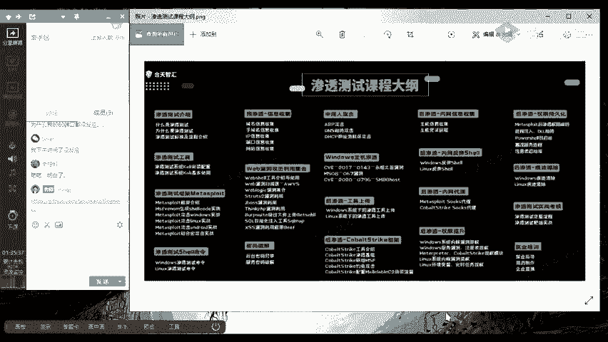

我呃就是有没有大概的有一个了解。这样的话我就是大概给大家做一个介绍吧，就详细的一个内容的话，大家可以看一下这里的一个。目录，然后呃。算你的。这里我要。就我为什么要说这个呢？就是。呃。

我们现在这一个课程的话，就是现现在的话是原价是6588嘛。然后现在的话是有1个1000元的优惠券。然后这里这个的话是呃。针对就是呃没有报我们课程的那一些同学。然后现在的话是呃。

就是因为大家都是现在就已经有报了这一个外围安全的一个课程。然后的话在这边这边的话，就我们这边商量了一下的话，呃，就是有专门给大家有这样子的一个优惠。

就可以就是在原来的1000元的一个基础上再减1000元。然后如果大家有兴趣的话。呃，可以去找班主任去进行一个了解，就是详细的一个详细的一些东西的话，到可以找班主任去进行一个咨询。

我这的话就是给大家大概的一个介绍。就是让大家有了解一下这样子的一个。呃。我们这里的一个新开的一个课程。🤧。

🤧Ha。好安静啊，大家没有什么呃问题要问的吗？好，那么呃大家没有问题的话，那么我们这节课就呃。就到这里就结束了。然后呃关于课程相关的一些问题的话，呃，大家可以去找班主任去咨询啊。好。

我们本节课的话就到这里结束，呃，大家再见。