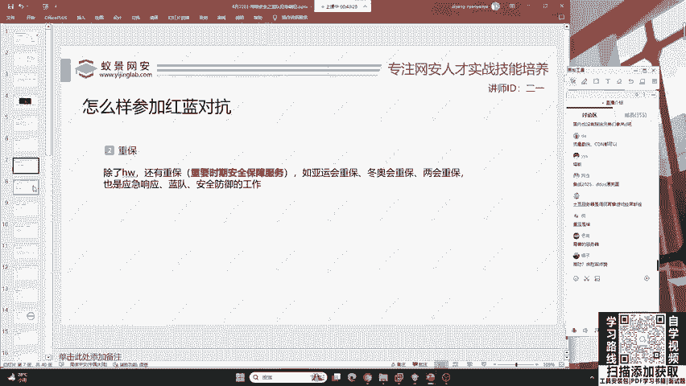
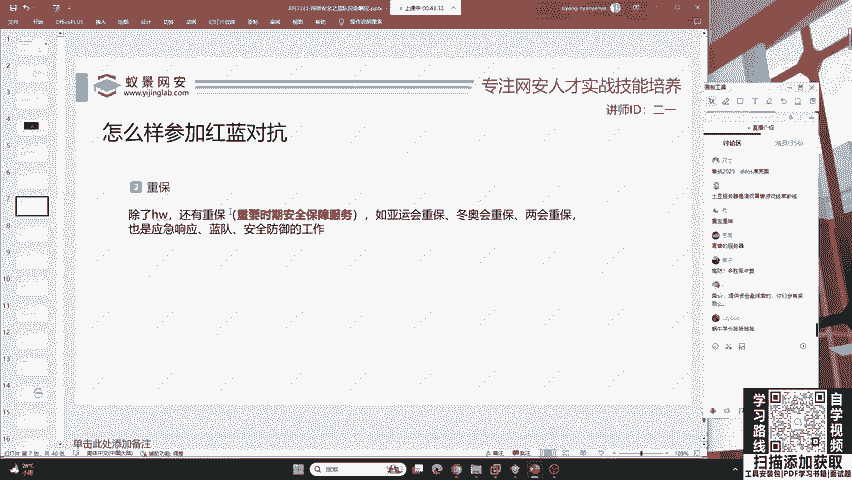
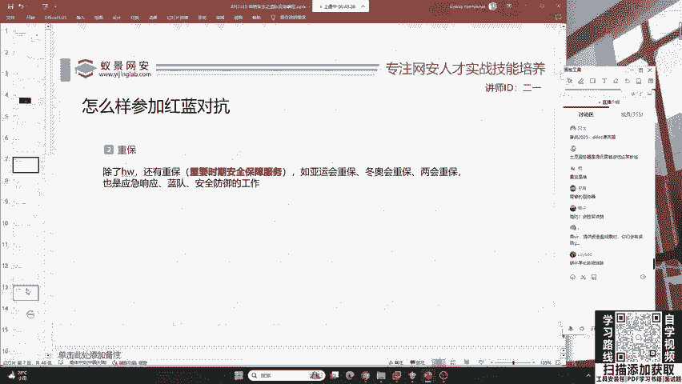

# B站最系统的护网行动红蓝攻防教程，掌握护网必备技能：应急响应／web安全／渗透测试／网络安全／信息安全 - P4：蓝队应急响应-3.网络安全 - 跟小鱼学安全 - BV1SF411174M

呃，其次呢就是网络安全。有的这个黑客啊他喜欢做一些大流量的攻击。比如说像D dosARP以及流量劫持。这里啊很多咱们安全的入门者都比较喜欢D dos攻击。哎，各位同学有听说过D dos吗？如果听说过。

你可以在讨论区扣个一，我来调整一下上课的速度。可以说很多同学都听说过，哎，我看到了一个同学啊，你可能对D dos不是特别了解。那这里呢老师来给你讲一下D dos啊，它被称为拒绝服务攻击。

也就是大流量攻击。这是啥意思呢？我们举一个简单的例子，好吧。首先先举一个比较现实中的例子，就是一个餐厅。😊，一个餐厅啊，他的一个座位数量都是受到限制的那现在啊比如说有个老大哥，他请了100号人。

把这个餐厅里面的100个位置啊都给占满了。但是啊这个老大哥他比较坏，他占着位置啊，他不吃饭，他也不点餐，这就导致啊后续正常就餐的顾客没有办法正常。😊，进入到餐厅来进行点餐和吃饭，这就是一个拒绝服务攻击。

啥意思呢？啊，就是说比如说这个网站啊，它最大只能允许1万个用户访问。那现在这个黑客啊，他用10亿个用户去访问，就会导致这个网站的服务器崩溃。卡住，也就是呃我们通常讲的一个土豆行闻行为啊。

它变成了土豆服务器，咱访问不到了。那它呢就是呃产生了一个低dos攻击。好，这时候有同学提到了很多问题啊。第一个问题就是咱们这个D dos啊要加分吗？啊，这里要告诉大家。

在正常的互网中是不允许Ddos攻击的。😊，啊，这是第一点。Ddos攻击呢一般都是一些境外的非法组织或者是违法犯罪分子来进行的Ddos在众宝中啊，尤其是国家开展重大活动时候。

比如说我们开展的冬奥会以及即将开幕的亚运会，他们啊都会被疯狂的被Ddos，就是因为有境外黑客的存在。那这时候你就该问了如何去防御。其实很简单，就是说很多的服务器啊，它是叫做抗低的高防服务器。

就是说啊我这个服务器能够去检测到低ds的流量，能够不去。被逼到死所影响。也就是说啊我现在这个呃餐厅里面的座位是属于流动性的。你现在去攻击我，你把我位子占满了，没有关系，我会把你给踢出去。

这就叫做高防叫高度高防啊抗低，就是这个意思。哎，这个风同学问到众保是什么东西啊，咱们刚刚讲过了，你可能是刚来众保呢就是重要时期安全保障，在国家开展重大活动以及啊各种会议期间啊进行的安全防御工作啊。

你刚刚应该是没来，我这里对你做了一个新的解释。

好，那我们在了解完这些攻击之后，还有就是现在呃国家非常重视的数据安全。