# B站最系统的护网行动红蓝攻防教程，掌握护网必备技能：应急响应／web安全／渗透测试／网络安全／信息安全 - P51：03_变量覆盖问题 - 跟小鱼学安全 - BV1SF411174M

啊，所以我我在这不说了。

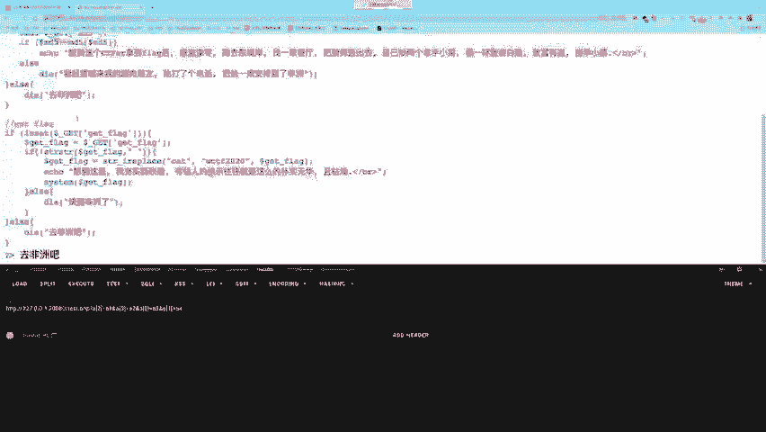

接着呢呃我们看今天的课程的最后一个内容啊。😊，变量覆盖问题。什么叫变量覆盖呢？变量覆盖就是去覆盖一个变量，变量被覆盖大概这个意思怎么样去覆盖呢？因为大家知道啊，这变量是可以被定义的，然后赋值的。

我现在现在定义一个dollerA。😊。

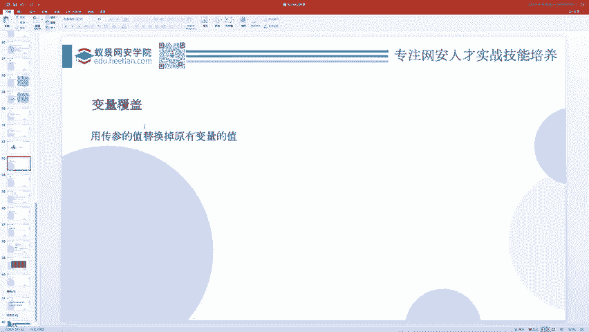

哇，的键盘是真不好使。用的太不习惯了，第一天第一天买过来。然后这个A叫ABC，然后我把这个A的值覆盖掉，覆盖成DEF。你看这个A就和ABC没有任何关系了，因为它被我改了。那么如果说在这个P1P里边。

我们可以改掉原来的值。然后原来那个变量呢，原来变量的值被我改了，可是对原来变量做一些操作，那我就可以呃造成一些比较邪恶的行为。

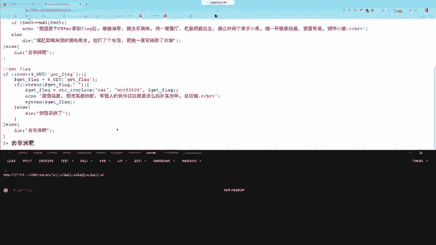

啊，变量覆盖呢一般会考这样的两两两个函数，一个是extract函数，一个是pas string函数。还有一个inport request variables。

但是这个啊大家可以看到deprecated inPP5。4。0。就是他在PP5。4。0之后，它就已经是被废弃掉了。我们不研究它了，我们就要研究上面两个两个里面呢，我们最重要的是研究这个extract。

如果你不知道extract是什么，还是刚才那句话，就你不知道啊GCDcode是什么，百度一下P2P1个ex个tract函数，马上就查出来，这是给你查好的。😊，它会干嘛呢？它会把一个数组。

因为数组是间值对的关系，对吧？它会把这个呃间值对呃用键来做变量值做这个变量的值。所以你就比如说这里边给到的这个例子。能不能放大一点可以。本来有个do了A叫orin。

然后现在有个这个数组进行了extract数组的key呢是A只是cat，B是doC是horse，然后依口do了A是什么，do了B什么，doC是什么？😊，那么他们三个的值最后是什么呢？不出意外的话。

A的值是cat，B的值是dog，C的值是horse。这是为什么？这是因为你extract操作之后，它就会对这个出组里边的值进行一个呃创建变量的东西了。你比如说B和C之前并没有doB到 C这两个变量对吧？

那么我会创建doB变量，到变量点值是到和horse。然后这个A呢之前有doA变量，有你就有呗，没关系，我就给你改掉嘛，我就给你赋值。😊，重新复制复制为cat，所以就跟你原来的纸有没有。

有没有这变量以及这变量之前有没有值，没有任何关系。你只要执行它，我就给你创建这个变量。因为正常情况下extract本身那是为开发人员做的。开发人员想写这个代码，有开发人员自己的意思。

还是最开始那句话没有任何一个代码是呃从一开始就为了创建一个漏洞而生的，他都是有他自己的用处。只不过呢这个extract啊也是啊经过这个开发人员一个不当的利用。

允许呃用户呢去呃extract一些用户可控的一个数组，然后覆盖了一些本不应该被覆覆盖的函数。😊，不对，覆盖了一些本不应该被覆覆盖的变量，或者创建了一些本不该有的变量，然后进而引发了一些安全问题。

这个啊才是extract。😊，变量覆盖的本质。并且变量覆盖这个东西啊。他本身。并不是一个什么很严重的事情。你就说我现在就就给你创建个A变量，创建B变量，创建C变量，你创建就创建呗，这有什么用啊？😊。

这没有任何的危害，危害在于它后面还有一些后续的代码，然后应用到这些变量。而你把这个变量的值改了，有可能带来一些安全风险。😊。

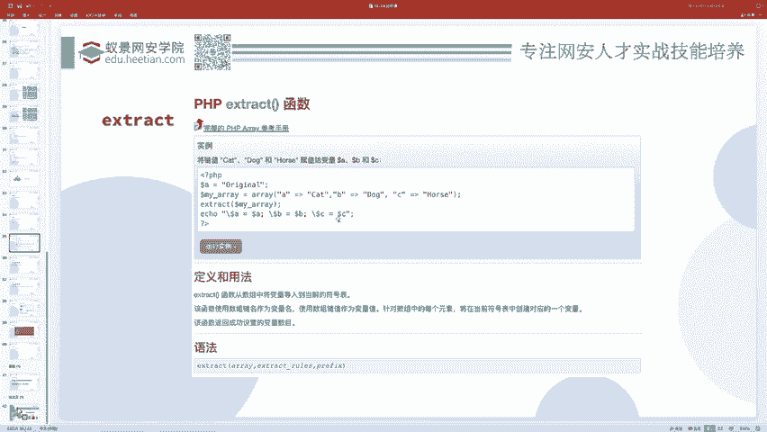

比如说我给大家写个代码。大家看现在这个代码。我需要创建一个呃对doll ARR进行一个exstruct，而doll ARR是什么呢？是用户输入的1个AR参数。然后extract之后。

我要用doer D作为函数。哦，pos A作为参数进行一个。呃。进行一个代码的调用，进行一个函数的调用。那么这个时候我就可以这么写。你现在不是1个ARRR吗？我要把这个ARR搞成一个。数组。

然后数组有一个什么key呢？有一个D，我在这里先输出一下这个where dump一下这个导er点RR吧，好吧。然后玩大uff之后呢，我我先。不执行后两句，我们先看这个AR输入什么东西，我现在写ARR。

然后哎我把这个放大一点，中括号D等于。

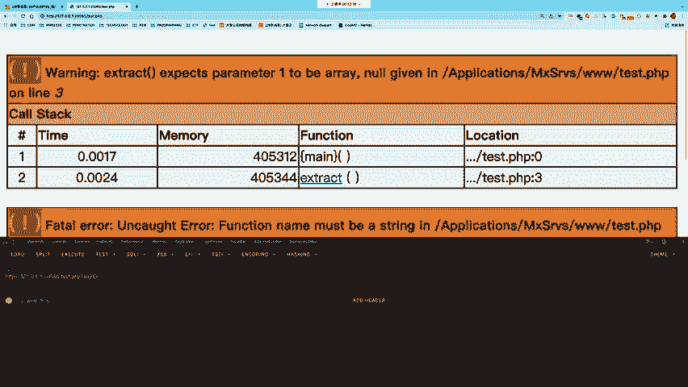

System。

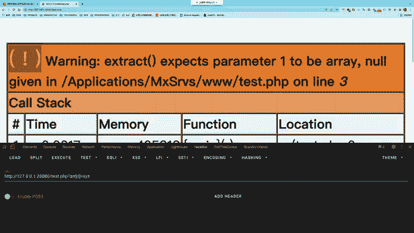

那么你看这个数组它的值是什么呀？有一个叫D的一个key，然后它的值是stem吧，对吧？那接着我对它进行extract extracttract之后呢去执行。然后啥也没有，但是呃你可以给它继续传参数。呃。

啥也没有之后呢，我们先输出一下这个dollerD。到了D的值就是system。那么。他就调用了ssM函数。C函数干嘛的？执行系统命令的吧，只不过执行什么命令呢？还没说还没有执行还没写为A等于L。哎。

你看是不是L就执行了，A等于户外。换卖就执行了。A等于LS杠A。2杠A就执行了。

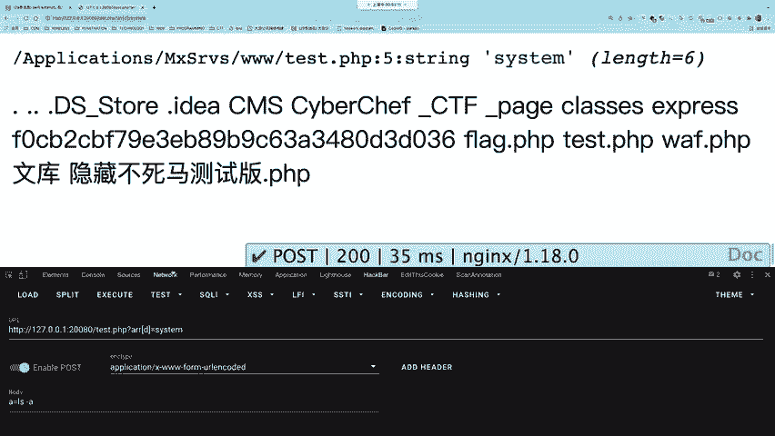

这就是一个变量覆盖导致的安全问题。我把这代码给大家发一下。所以你会发现就就这个代码来讲，本质上并没有任何问题，就extract，你爱extract什么extract什么extract不就是生成变量的嘛？

没有什么实际意义。但是呢它后面写了一个动态函数调用，这个时候就出问题了。所以说问题其实出在这了，这是extract的一个变量覆盖。😊，那么呃有了extract变量覆盖。

接着呢是pas string的变量覆盖，pas stringing和extract差不多，只不过pas string它处理的方式不一样。它是把这个一个东西等于一个什么，把这个东西搞成一个变量，等于什么。

把这个什么给到这个东西变量的值。比如说pas name等于B and age等于60，那么就创建一个dollar name等于bi dollar age等于60，就是这样的一个用处。

然后你也可以呢在第二个参数写一个 array，它会把这个键值对附到这个 array里边。所以我们对这个代码进行一个修改。

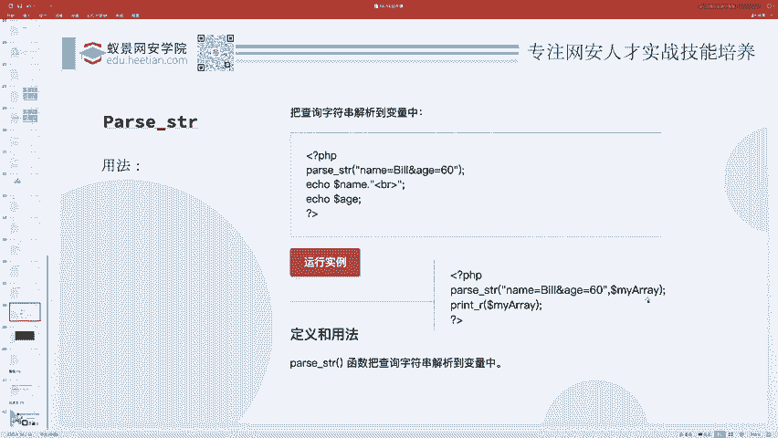

说pasir。死之影这个。dollar ARR。然后接着呢我们再输出一下这个弯 up dollarD。先不要最后一句。那我现在AR就可以等于这么一个东西。AR等于。啊，C啊，不是D等于C。

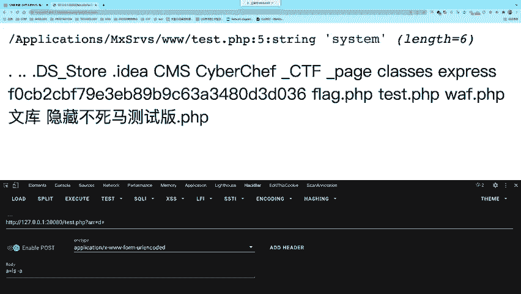

呃，这个。这个可能是PP的版本问题。我把它调一下。他说你去调用这个东西，然后呃没有给到一个呃 resultult argument是呃在这个里面是被deprecated的。

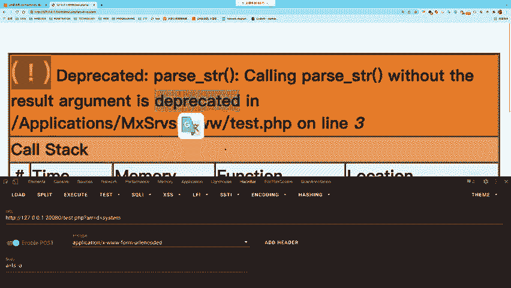

那么呃我现在给它调成了1个PP5的版本，那就可以了。这是PP版本问题，大家不用太过多的较帧。

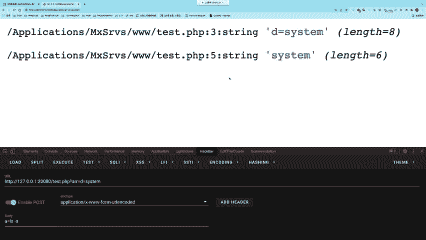

呃，你看现在呃这个ARR什么是D等于C，对吧？然后接着我输出了dollarD的值，dollerD值是不是C呀？然后接着再有一个到这个dollD，然后po a，那是不是？😊，又执行了这个命令呀。

所以这就是pas string的一个变量覆盖。那你会发现这个变量覆盖其实本质上都是一样的。不管你是用哪种形式，哪种方式，哪个函数进行变量覆盖，变量覆盖也好，创建变量也好，还是干嘛也好。

本身都没有什么实际的安全风险。但是它后续的一些操作，后续的代码的一些逻辑可能用到了这个变量。那这个这个后续的这个代码呃，它再去呃做了一些危险的操作。你这个整整体的代码就就变危险了。

电量覆盖就是这么一个东西。最后的最后呢，我们来看一个稍微稍微稍微综合一点的，有点难度的题，就前面把知识都讲完了，现在就来搞一个。综合性的一个问题。现在呢这个题就是一源码也没有那个环境，我们就来分析就好。

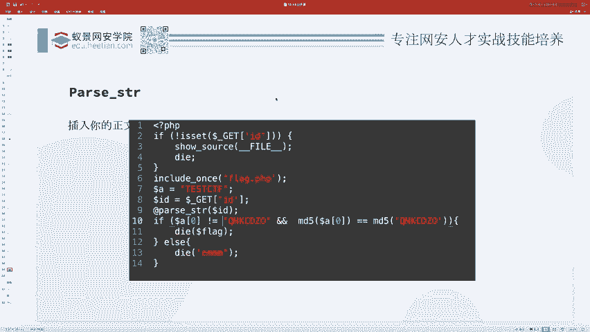

他说你现在需要给我一个doer IDD是你传的参数，对吧？然后传参数之后呢，我对doer IDD进行paser stream。等会儿打一吗？等会儿打一。然后呃dollerA0不等于QNKCDZO啊。

这是O吧，应该是然后MD5的刀A0呢还要等于这个东西，然后这样的话就会给你flag，否则的话就不行。

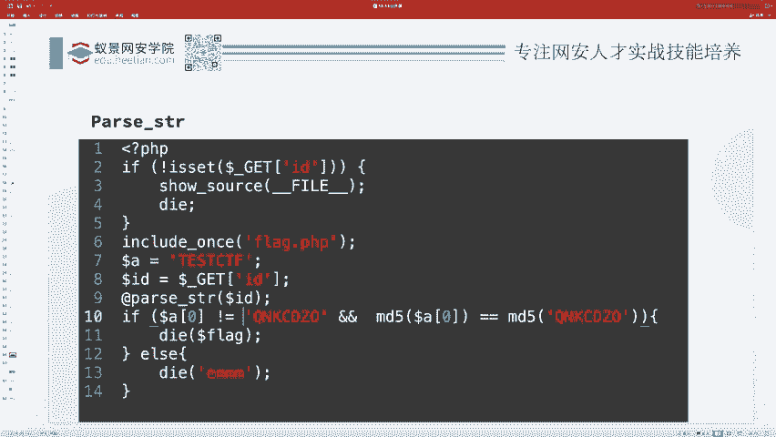

那我们分析这道题，这道题一共有这么几个流程。这能把笔画出来吗？在这。首先你这个刀了A是一个tCTF，然后你这里进行了pass使用变量覆盖，我肯定覆盖A吧，把A先覆盖成一个数组。

然后数组的零号元素不等于它，然后MD5值它和它的值要相等。那这个东西。啊，就是变量覆盖之后又又搞了一个这个MD5问题。但是我们学过了弱类型，你就很敏感。你看到这里它是一个两个等号的吧。

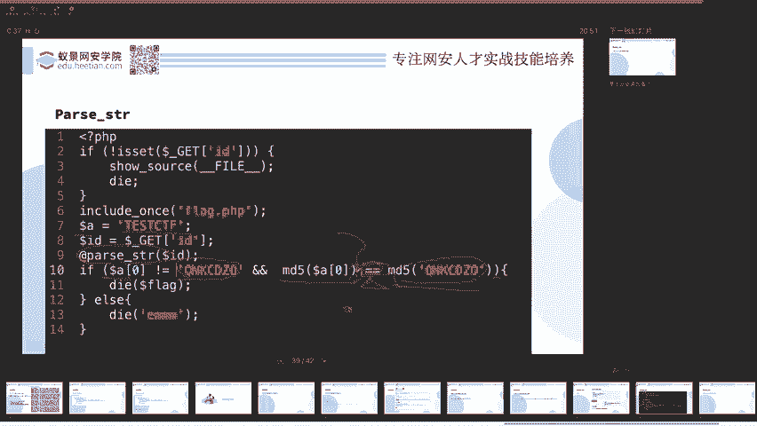

那两个等号好好啊，我不妨先看一下这个QNKCDZ0D还是DZO啊，我我先输出一下它它到底是个什么东西。啊，这个我就把PP版本调回去。啊，一口选MD5。我输出了一下这个东西。

我发现它的MD5值是1个0E后变纯数字啊，让他我就知道啊，原来你这个东西是一个这个呃可学计数法，那么。😊，一个呃你要传一个字符串，这个字符串和它不相等。MD5要和它相等，是什么呀？

是不是就是我们前面总结好的那些东西啊？

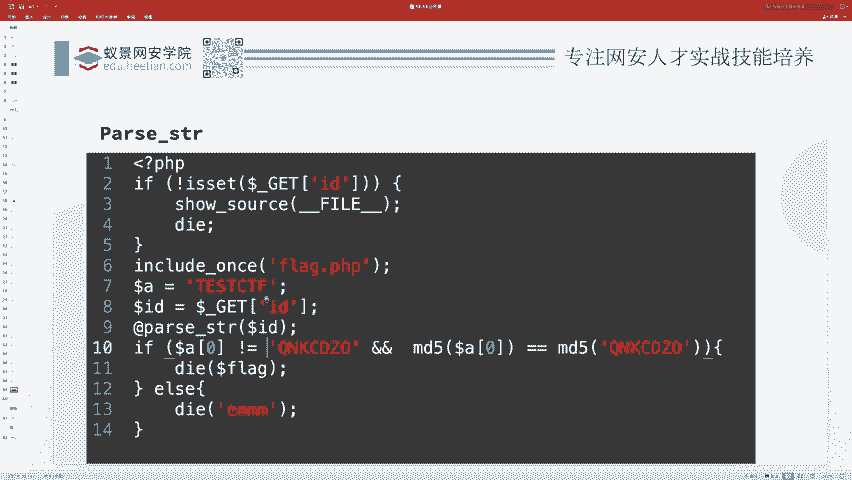

你找到原来这篇文章。呃，哪去了？这个你在里面随便挑一个是不是就行了呀？那接着一个问题就是怎么样pass string。😊。

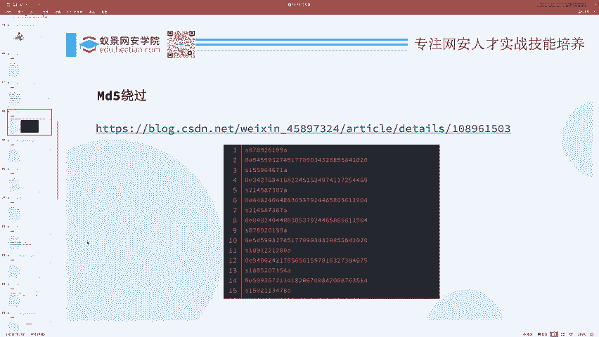

把这个A搞成一个数组呢，那你看paser呃paer string是不是就跟我们get传参一样，name等于B有H等于60，是不是就跟我们这个UL里面get传一个参数格式是一样的呀，对吧？

那既然是这个格式，那我们不就会了吗？因为你是会怎么样去传数组的。

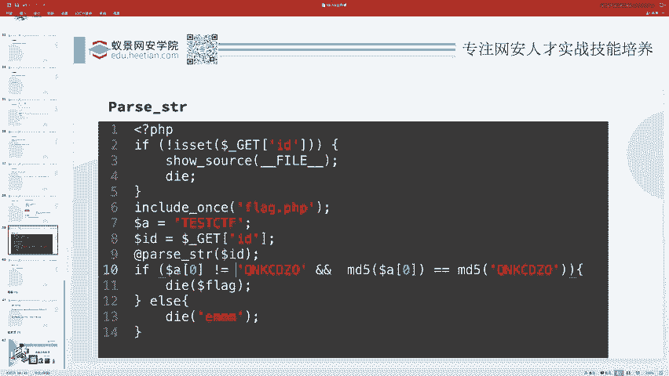

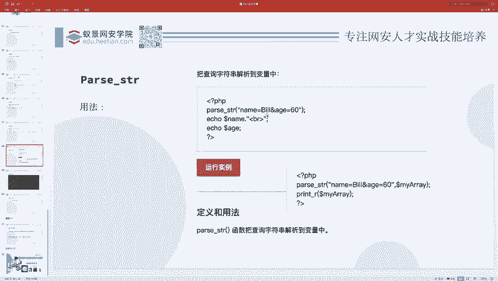

A中括号等于是不是就行了，然后等于一个呃前面。总结好的这个东西。比如说他。这是不是就行了呀？或者你在这里写个零。也可以吧，你不写零的话，它默认第一个就是零。

所以你只要把这个呃pas径让他去操作这东西就行了。那pas径是ID，所以说我们ID等于等于这个玩意儿。

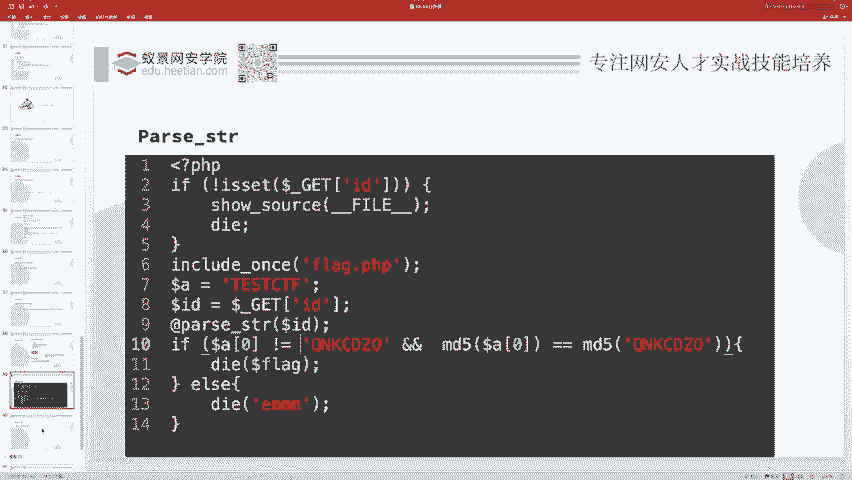

这就是你要爬他随性处理的那一部分，于是整个就完成了。那么这道题就做完了，flag就输出了，这是稍微综合一点的问题了。但是其实也很简单吧，因为我们把这些东西都学过之后，你会发现嗯难难士不可能拿的。

因为这都是一些比较基础的东西。

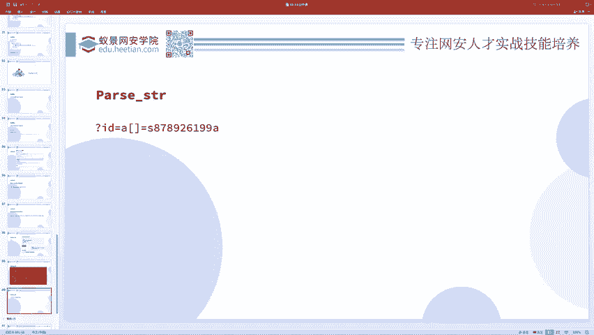

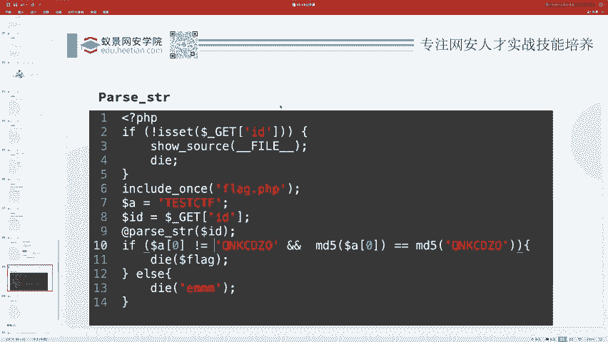