# B站最系统的护网行动红蓝攻防教程，掌握护网必备技能：应急响应／web安全／渗透测试／网络安全／信息安全 - P52：04_命令执行漏洞 - 跟小鱼学安全 - BV1SF411174M

于网络安全教学，严禁用于非法途径。啊，如果学员做出任何危害网络安全行为，请后果自负，与怡景湾学院及授课讲师无关。那我们今天这个课程呢主要是讲两个部分，一个是执行系统命令，一个是执行PP代码。

虽然标题叫做远程代码执行，但是我们要执行两种东西，一个是系统的命令，一个才是啊这个所谓的代码。首先我们先看一下命令执行，命令执行就是执行linux系统的一个命令。这个其实呃更多人可能更熟悉一些。

因为linux系统啊可能很多就是就算是你不会PP语言的啊，你应该也用过。命令执行。是一种攻击，它的目标呢是通过易售攻击的应用程序，在主机的操作系统上执行任意命令。所以。

这个漏洞本质就是在操作系统上执行操作系统的命令。那么为什么会发生这种事情呢？就是因为这个应用程序它需要去调用一些外部程序来处理呃一些呃内容的情况下呢，就会用到一些执行系统命令的函数。

你比如说我现在要写代码。我要通过写PP代码去给我创建一个目录。那我们知道呃你在linux里边，你创建目录这个东西实际上是执行一条命令就可以了。比如说啊我要创建一个什么目录，我就直接用这个MKDIR这个。

命令是不是就可以了？我创建一个叫123的目录，那我就MKDR123叫ABC就MKDRABC这是系统命令。比如说这个开发人员他对这个代码不熟悉，所以他不知道怎么样用代码来创建一个目录。

然后他指导用这个啊系统命令怎么样创建，所以他就可能去啊调用这个系统命令，用系统命令去MKDR创建一个这个目录。😊，那这个时候他就会执行系统命流。怎么样执行系统命令呢？比如说在PP里边有。

这些函数都是可以执行的。但是如果说他执行系统命令，其实本身也没有太大的问题。比如说啊我们写一个这个东西。你现在不就是mDNR吗，对吧？这什么函数。然后执行make电啊。

比如说我就要创建一个叫ABC的这个。目录这一点问题没有。因为这句话，这句系统命令它是写死了，它就叫MKDNR空格ABC它没有任何的其他的东西。你这个东西在哪里执行，它都执行这一句话。

这是用户没有办法去控制的。所以说你没有办法去控制，那就不存在什么漏洞。那漏洞是怎么样产生的呢？漏洞的产生是你用户需要控制命令执行函数中的参数，参数什么呀？参数不就是你要执行的那个命令吗？

然后那这个命令的一部分是用户可以控制的。那么这个时候就可以把一些恶意的命令注入到这个正常的命令中造成一个命令注入攻击。比如说我们就呃还是以刚才这个例子为例，这是一种不存在漏洞的东西。但是我现在这么改。

我说呃这个MKDRR一个什么东西，dollerus name。😊。

而这个doller use name是什么呢？doller use name。等于。Dollar gas。Yours her name。这个代码说啊，用户你需要先注册一个用户啊，这个用户名在哪填呢？

就username这个参数填，然后放到这个dolleruser name这个变量里。接着呢你user name是什么，我就给你创建一个叫什么的目录。这个时候你看这个llus name。

它这个命令已经不是写死的了，它这个命令里面有个变量，这个变变量嘛可变的一个量，它这个值是会变的，所以这个命令也不是一个固定的东西，它可以变了。那这个时候就可能出现问题。正常情况下。

你比如说这个用户注册一个用户名就叫ABC那我就创建一个ABC的这个目录，这没得说的。但如果说这个呃用户他比较讨厌它创建了一些比较恶意的东西。比如说它叫ABC。😊。

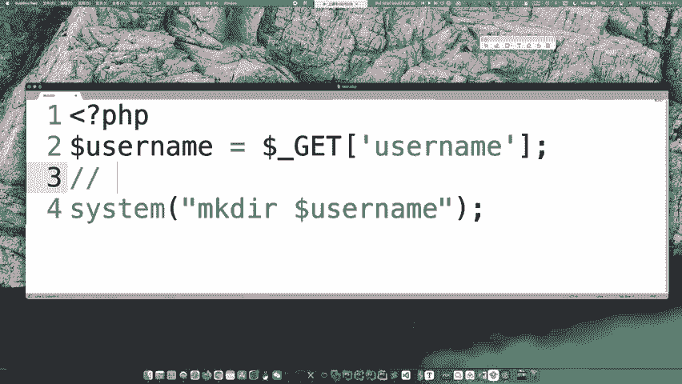

然后一个分号ca flag。那么最后他创建了这个命令，创建了不是这个命令，创建这个用户名，然后这个用户名并拼接这命令里面会变成什么MKDARABC然后分号ca flagag相当于就执行了这个。

而这是分号唉，分号是表示呃去拼接两个命令，就是把两个命令放到一行里边，但是做一个分格。所以说实际上本来我只希望你去执行1个MKDR创建目录这样的一个东西。但是它现在最后执行了两条命令，除了创建目录之外。

还执行了开 flag。😊，这就是命令中这ca flag本身不是我呃这个被期望他去执行的，但是他确实执行了。😊，然后呃输出了这个flag的值，这就是一个呃命令注入的一个。例子吧，然后下面呢还给了一个例子。

😊，他说把这个s file，然后copy到就是copy嘛CP就是复制的意思，把这个啊文件复制到这个路径。这个路径下的这个APP public没得说了。然后什么点DPG呢？这个蓝色的是用户输入的一个东西。

那么正常情况下，用户输入了一个什么ABC那就创建到一个ublic这是正常的那用户还可以输什么？输出1个ABC分号 flag之类的东西。那你看这个 flag是不是又被拼接进去了。😊。

所以这都是一些命令注入的例子。从现在呃呃不是就就就刚才我们举的这两个例子，你会发现命令注入这个漏洞，它想要发生，它实际上是有条件的。首先第一个你要执行系统命令，不是凭空无故的就可以去执行系统命令。

首先你得有执行系统命令的函数，对吧？这是第一点。第二点呢。😊，你光执行系统命令还不行，就像刚才我们这个举的例子一样，这东西如果说是写死了，那虽然执行系统命令。

但每次只都是一样的系统命令都是一个很安全的命令。😊，也没有用啊，对我们攻击者来讲，对吧？我们希望让他执行任意的命令，实行我们想让他执行的命令。那那这个执行的命令一定不是一个写死的东西。

它一定是个可控的东西，是你用户可控的，就完全可控也好，还是可控一部分也好，对至少你得可控。😊，那这里边也说了啊，命令注入攻击常用在像程序传入不安全的参数的地方。为什么是这样？

因为你这个必须得命令的一部分是用户可控的嘛，用户怎么可控啊，不就是传参吗？对吧？你用户要不然还怎么可控呢？哎，所以说这种传参的地方，最后被用来拼接命令，那就可能会这个。那，出现明了之入的漏动。

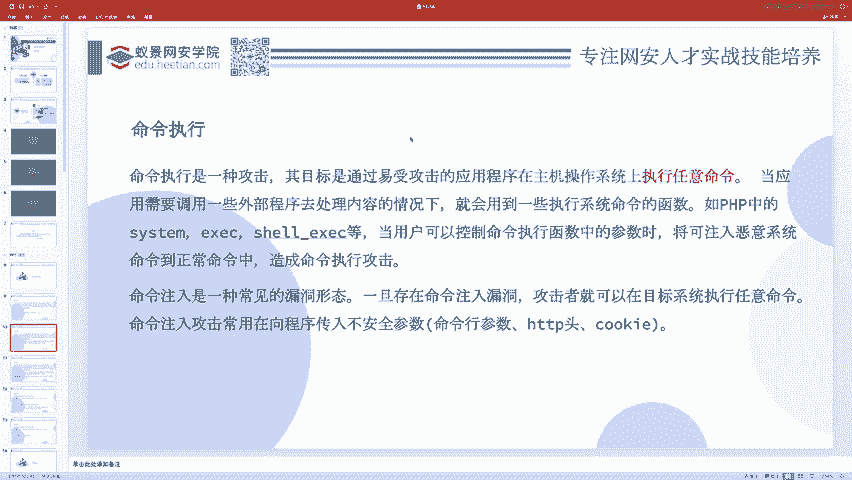

然后啊就是这个权限问题。你想啊这个命令执行。它是谁去执行的？它是P toP调用的sstem函数去执行的系统命令吧，对不对？而PHP是wep服务器去运行的吧。所以说web服务器相当于是最后执行了这个命令。

那么谁去执行这个命令？😊，那他就需要有这个人的权限。就像呃你在生活中你去呃刷这个门禁卡，你去干嘛也好，你根据你不同的人，你去做这件事情，它都是有不同的权限。

比如说你的领导就可以刷开这个保险柜的那个那个机房那个门，你你的脸就刷不开，这是因为你们是不同的身份，不同的人有着不同的权限。那么执行系统命令也是一样的。比如说我在这执行。

我在这执行MKDIR那是因为我我户外卖一下，我是这个用户，所以我可以在这执行，那我执行的命令就是以以这个用户来执行的。而我在这个PP里边执行呢，那是他会调用系统命令，他他会是外部服务器调用个系统命令。

所以说是外部服务器所在的那个权限去执行，这是不同的权限。😊，那既然权限不同，你能做的事情就也不同。首先我们知道啊linux下面最大的那个权限，最大的那个人是root吧。😊。

但是wi部服务器可不是root权限。wi服务器是一般叫做WW杠data这个权限你可以去呃执行一下看一下，你可以。就执行一下户外卖嘛，这样。

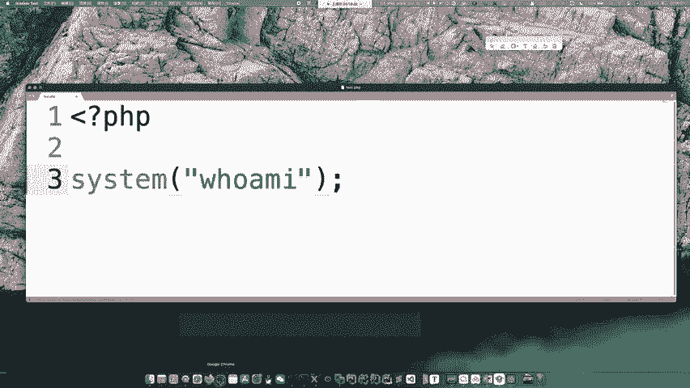

当然这里边呢呃我自己在我自己的服务器上是就执行了我当前自己的权限。然后你可以把它放到那个docker里边，自己去测试一下。你会发现一般的阿帕奇起的外部服务器，它是呃。33Ldata。

因为你这个呃题目它一般都是3Wdata。或者说啊我在这里边搞一个刀cker给大家试一下。

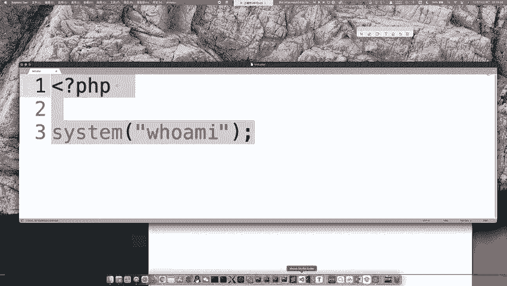

这个呃题呢哎这输错了，是这个dockerEXV。

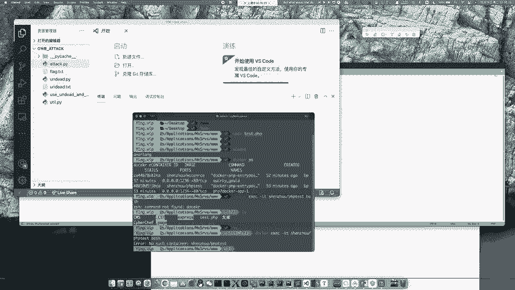

港爱奇。这个是一会儿我们需要去搞的一道题。然后在这里边我们可以执行一下这个户外麦。

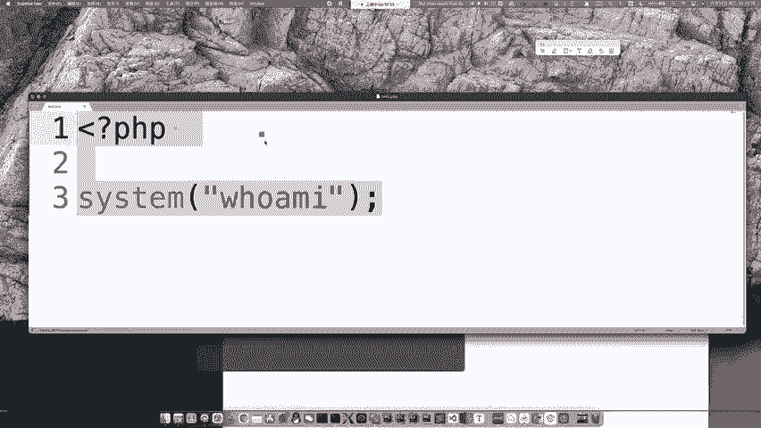

比如说叫123点皮着皮。

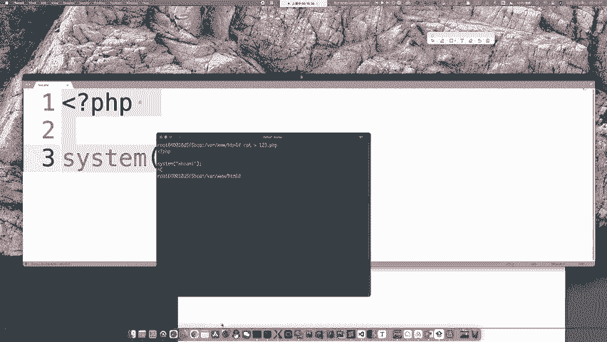

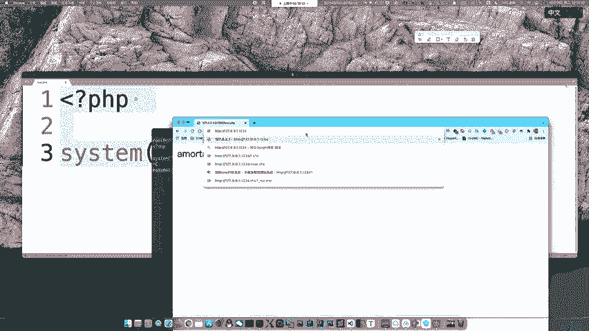

看到没？这是刀cker里边，有我本机这是mac系统的这个外部服务器和这个你平时遇到的题还是不太一样的。它就是继承了我当前的系统权限。但是呃正常情况下，你你去打CTF，那肯定不是运行在一个苹果电脑上。

它肯定是运行在一个刀cker容器里边的。😊，那它底层是linux的，所以说一般你会发现它实际上是1个3Wdata这样的一个用户权限。那么这个权限一般嗯就没有办法去做一些特别严重的危害。

你比如说关掉这个web服务器，对吧？你把这个80端口给关了，它就做不了这事，它没有这这么大权限。你说把这电脑关机，那我们想关机随便关机，但是它关不了，因为它它没有这么大权限。

还有就是呃比如说现在这里边是不是有这么多文件呀。😊，那么你可以看到这些文件在这里，它它显示了是属于哪个用户的。因为我是用root用户去创建的这些文件。所以说在这里边它显示了哪些用户。

你敲命令用的是什么东西？你是说这个这个框吗？这个框叫做iteITERM。😊。

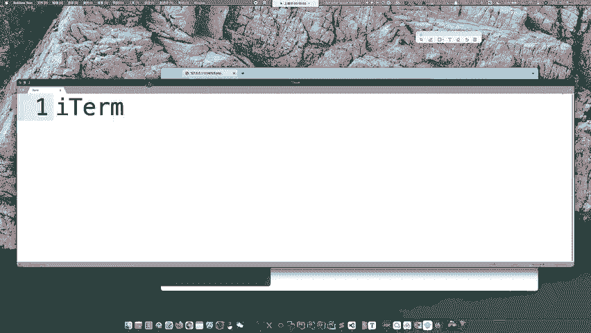

然后我一般用的是ZSH。那么这里边它其实就是有一个文件的所属用户，然后前面这个东西表示什么呢？前面这个东西表示它是一个什么权限的，这里边你可以看到有三位三位三位，对吧？首先第一位是横线，它表示什么呢？

它表示是否一个目录。你比如说我现在MKDR创建一个目录，这个目录叫做目录啊，然后我们在呃LS杠L。那么对于一个目录，它前面有个DD叫啊？就是这个DRDREC企R这个directy就是目录的意思。

它如果显示D，说明它是个目录，如果它是横线，表示它是个文件，然后每三位表示的是呃。这个当前用户。就是每三位都表示了他那个权限啊，当前用户。然后就是当前组里的其他用户，还有就是其他用户。

就是说对于呃你们这三种用户对我这个文件有哪些？可读可写可执行的权限R表示readW表示right，然后X呢就表示那个excut。有这么三种。那你比如说RW杠，那就表示可读可写不可执行。

然后R杠杠呢就表示只可读不可写不可执行。呃，然后这里边他们分别有一些这个呃数字啊。R呢就一般是4，然后X是一呃，W是2，所以一般的时候你会发现我们可以呃chan之 mode，然后什么777啊，755啊。

744啊，644啊，这些数是从哪里来的呢？它其实都是根据这个权限来加的。比如说我就写644644表示什么呀？就是一个。😊，R叉杠，然后R杠杠。还是刚刚，就是说当前用户可读可执行。然后呃下一个呃。

不是不是呃，666是1个RW。然后这个呢是止可读，这个用户只可读，他是这个意思。那么既然它是一个root用户，就比如说我这里边这些文件啊，这是它是个root用户啊，只有root用户自己它才可以写。

而你现在是3W data，所以说你用PP调用系统命令，把，你想把这些文件删了，那你就没有这个权限。😊，因为什么呀？因为你没有这个可写的权限，删除文件，改变文件什么，这都是一个他的写写行为。

你就没有这个权限，所以说这些事情你是干不了的。

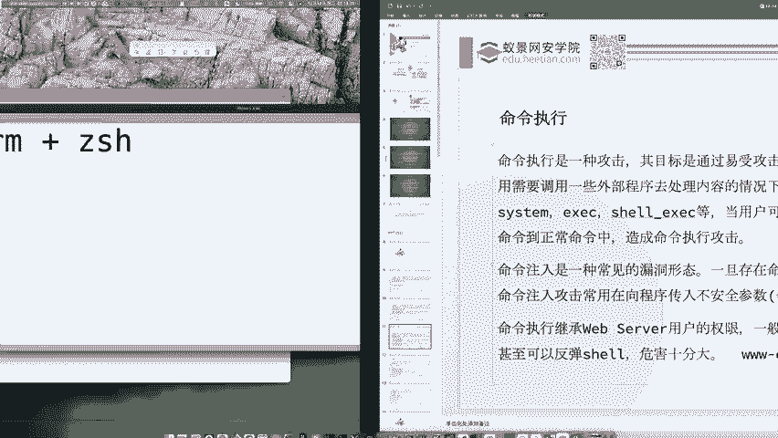

那么虽然说呃我们干不了特别多的事情，但是有了命令执行，我们可以干嘛呢？我们可以呃去查看一些文件的内容，在一些可写的目录里边写一些文件。然后呃你看窃血码，还是什么查看隐私，这都是一种读的行为。

读的行为默认都是有的，虽然你不可以改它，但是你可以读它呀。😊，然后反弹下对吧？所以它的危害还是非常大的。😊，那你比如说如果说你在这个。嗯，打AWD的比赛的时候，有时候可能会遇见这样的一种问题。

就是呃别人给你中了马，然后你发现你删不掉，因为AWD。这种比赛形式是你自己有1个SH能连到你自己的这个题目的这个把机里边去维护它的。但是一般你的这个用户是一个叫什么CTF用户啊，或者说什么te测用户。

不是说不死马，而是说这个权限问题。😊，呃，就因为别人怎么给你中的码呢？是因为它是用web服务器呃，web上面的一个漏洞给你写的码。所以说这个写码行为是web服务器做的。

那么写的这个码这个shall点P2P呢，它实际上是1个3W data的一个呃用户的一个。😊，所属，因为是外b服务器给你写进去，所以它它属于Y3W data。而你现在的用户是CTF或者什么te用户。

你和他不是一个用户，而他又是一个什么。😊，呃，644的一个权限，就你就写不了，你就删不了他。你什么RM这个shall点PP他会告诉你一个。Permission。Deided。

这个时候是这这种问题是非常常见的。😊，因为之前我呃讲过呃这个AWD的那个有一个学员，他去打比赛，就是也是零基础的学员嘛，然后。诶。经过了3天的这个呃我们公司的相关课程。

然后最后的成绩是拿了一个第三名还是很不错的。但是他赛后就就说遇到了这样的一个问题，呃，为什么就不行呢？想拿第三名很简单，因为有一些框架工具，你就找最简单的漏洞，然后啪啪啪打。没声音。没声音吗？没声音吗？

有的呀，大家都有啊，都讲了讲了好久了，讲了十多分钟了。😊，可能是你你自己设置的有问题啊，我们都能听到的。我接着说啊，就是他为什么最后呃。😊，跟我跟我讲，为什么就是就没有拿到第二第一。

最大的问题是他发现他删不了那个别人的码，然后他他说是不是别人提全了给写进去写进去这个码，然后他自己删不了，其实并不是这样的，而是。😊，你俩不属于一个用户组，你俩不是一个用户。

那你这个CTF用户就没有这个权限。那对于这种问题，我们应该怎么办呢？😊，我们的办法是你先自己给自己去写一个码，写一个码给自己，然后你用一键。连上去通过这个web shell去删。

别人的web shell，因为你通过这个web shell去删别人的web shell的时候，你相当于是通过你自己给自己写一个we shell去执行了一个对文件的写操作，与删除本质上一种写操作。

而你通过web shell去执行那web shell是被web服务器运行的那现在你就变成了一个3W data权限。3W data权限去删3W data权限的一个文件，那不是手拿拔钻的嘛，想删就删的嘛。

对吧？所以说如果你到时候打AWD的比赛啊，遇到一种问题特别常见的问题，那解决办法就是这样的。刚才有同学说不死码，那不死码呃本质跟这个不一样。不死码是他一直在不停的在内存里边运行，它是一个死循环。

然后比如说每间隔一秒就重新给你写入写入一个码。😊。

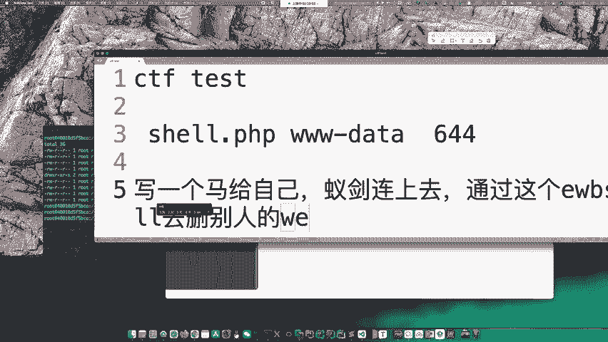

那这个时候怎么办呢？我们也是给自己写shall，然后呃写shall之后上去执行一个Q-9-1就可以了。因为Q9Q-9-1会结束掉所有当前用户的进程。而你先给自己写码，然后你用一键连上去执行。

那一键连上去执行，那你就变成3W data的用户了。😊，如果说他是用什么P1P，什么不死码点sell，还有什么P1P什么不死码点P1P。他如果说是执行，哎，不是不是不是点点SH这什么SH啊。

他如果说是调用系统命令去执行这个的那你可以PS杠EFgrape一下这个grape一下这个笑点PP找到这个进程，然后Q杠9加上那个进程ID把它给Q掉。但如果说你呃它是通过网页去触发的。😊，那就不行。

网页去出发，那那他就呃没有办法，你去找到这个具体的进程，那你就只能上3W data塔，然后把所有的进程全都Q掉就好了。😊。

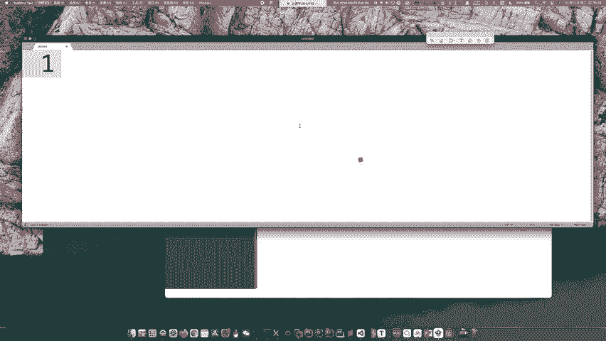

Croot怎么给自己挂码呀？非root也可以啊。因为你想啊AWD那为什么要给你SSH不就是让你去修漏洞的吗？如果你连这个文件的。😊，写权限都没有，那还怎么修这个漏洞呢？你想是不是这个问题？

如果说你都不能去改变它，你都不能给他写文件，那就不存在修的问题。而AWD就是攻击和防御，什么是防御，也不就是修复漏洞，修复漏洞你就得改代码呀，所以肯定是他给你权限。😊，啊。

前面是说了一些这种呃权限问题啊，算是一些题外话。那接着我们看一下这个所谓的命令执行和代码执行，都会遇到些什么函数呢？如果说遇到呃上面这些函数，那么可能就是会执行任意的代码。如果遇到下面这些函数。

你你看到他们呃就可能是去执行一些命令。这里边有一个叫做反引号的东西。它表示的是shallEXEC的这个呃函数的别名，是一种比较简单的写法。😊，哎，我们可以呃。直接依口，然后一个这个东西。

你看L是不是L命令就执行了呀？因为翻译号表示的是执行系统命令。他一般不会给root，因为给root，那意味着你可以干的事情太多了，主办方的运维压力就太大了。你把这个we部服务器删了。

把flag删了什么的，对吧？这就能搞得太多了。所以运维人员作为比赛的承办方不会给你root。接着啊我们来看看这个呃漏洞的利用。比如说有这么一个文件。

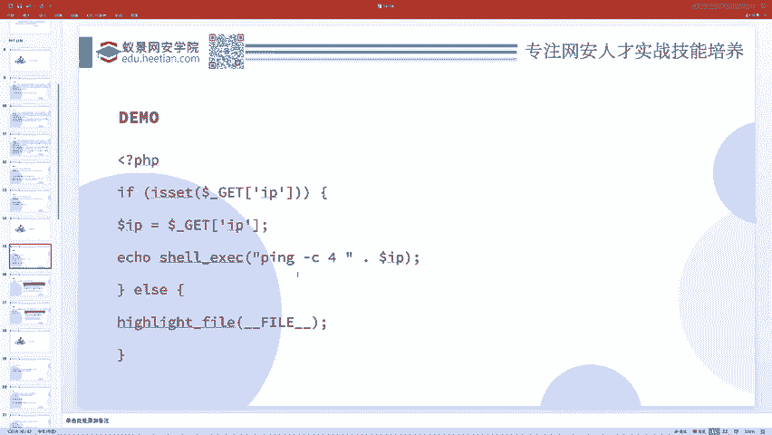

啊，我在我自己本地搭建一个吧，这是一段代码。他说什么呢？如果说我把这再小一点。如果说你传了1个IP参数，那么我就给你执行。这个PP杠C4，然后加上这个IP地址。然后否则的话呢。

就直接啊highlight file把这个代码给输出。这样的，那么正常情况下，我们要输出1个IP对吧？IP那肯定就是一个。这玩意儿呗。那么呃他就会去执行这个平行杠C4，然后接上这个IP地址。平杠C4。

然后1270。0。0。1这样的。

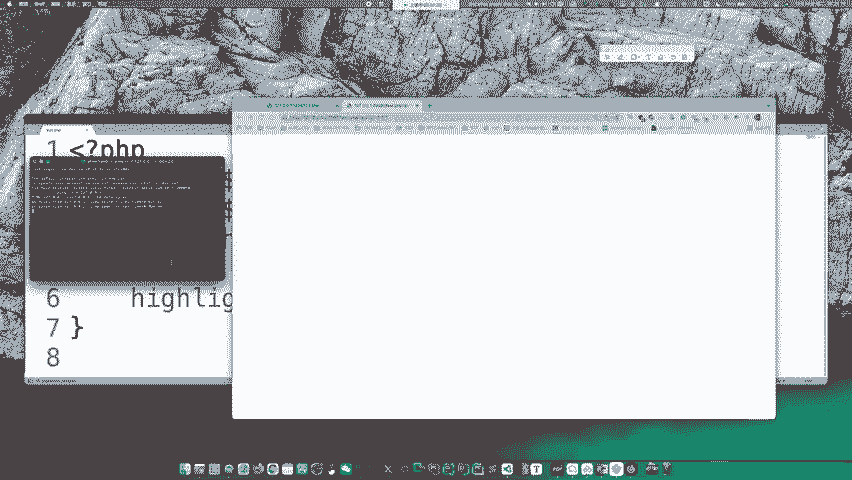

呃，那么呃你这个地方你就可以去输入一些比较非法的东西。正常情况下，你这么一输入，它肯定就是输出了相关的回线结果。这里边就是拼的一个回线结果。但是没有人对你这个IP参数进行一个安全检查，并且呢。

是用户可控的这是执行的命令，命令的一部分后一部分是用户可控的那我们就可以执行一些别的东西了。比如说我执行分号LS杠L。因为我们知道分号是用来区分不同的命令的。你想执行两个命令呃，就说我先执行个hoMI。

然后我再来个分号执行LS杠L。你看这是hoMI的结果，这是LS杠L的结果，它是不是全都有啊？联合执行的那你看这个L杠L的结果是不是就也出来了。所以说这就是命令注入。本来他期望只是去执行一个拼命令。

但是现在呢却执行了一些别的命令。

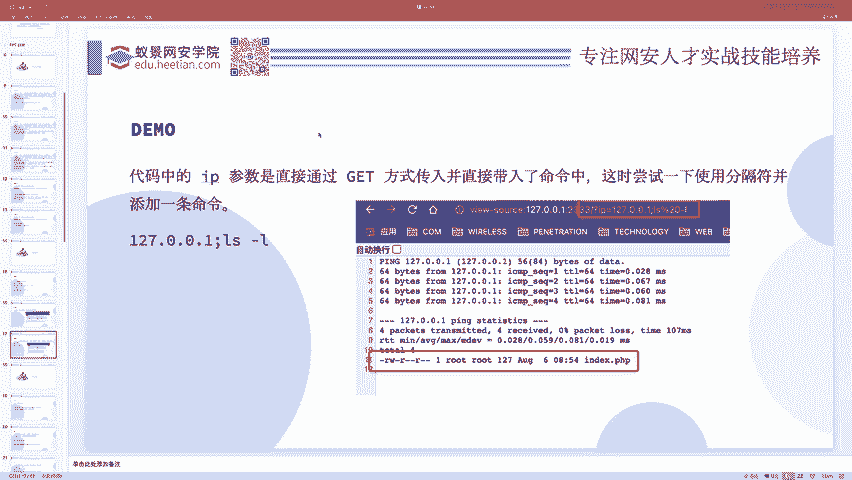