# B站最系统的护网行动红蓝攻防教程，掌握护网必备技能：应急响应／web安全／渗透测试／网络安全／信息安全 - P55：07_无字母数字RCE和create_function - 跟小鱼学安全 - BV1SF411174M

呃，那么这个漏洞啊一般就比较简单了。但是啊出题的时候不会考的这么简单，他一般会怎么考呢？

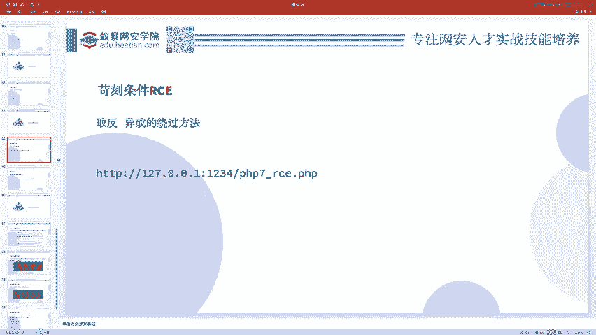

他一般。会给你搞一些绕过，就是搞一些限制。就像刚刚我们说的，你这个cat flag点PP那cat不让用，flag不让用。那这个。现在这道题呃是一个比较呃常见的题型。

这里边也是EVL1个用户可控的一个参数。但是呢对你加了一个过滤，什么过滤啊？如果说你这个。code参数里边。有字母或者数字的话，那么不行。那它其实并不是对关键字过滤，而是把所有的字母和数字全给过滤了。

所以这就是一个无字母数字的shop。那对于这种无字母数字的东西怎么样啊去解决呢？因为我们知道你要指定PP代码，那没有字母，没有数字，都乱乱七八糟符号，这肯定是不行的对吧？没有人写代码。

那一个代码里面全是符号，一个字母，一个数字，没有没有这种东西。😊，呃，代码执行是一个很很大很广的方面，就这种各种各样的变换呀，它这个限制可以出各种各样的题，但是那种东西就。呃，很难。

所以说我们这个基础课里边没有安排特别特别的过滤，给只是给大家讲了一些最简单的就是过滤的字母和数字。当然我们正式的课里边会讲很多特别特别难的题。😊，基本上目的就是当你遇到一个呃这种命令执行代码执行的题。

不管他出的多难，我们都会把这个呃难度都给覆盖掉。cat等于more cat呃more确实是可以替代ca的，但是它俩有有一个区别，就是呃多行的文件的时候，你可以就是你可以自己试一下。

你可以弄一个有好多行的一个文件。然后你用cat和more去比较一下，它俩其实有有一点点区别，但是呃反正都可以读文件，除了more以外，还有很多东西可以读文件的。😊。

你比如说用用base64是不是也可以啊，base64一个文件，对吧？😊。

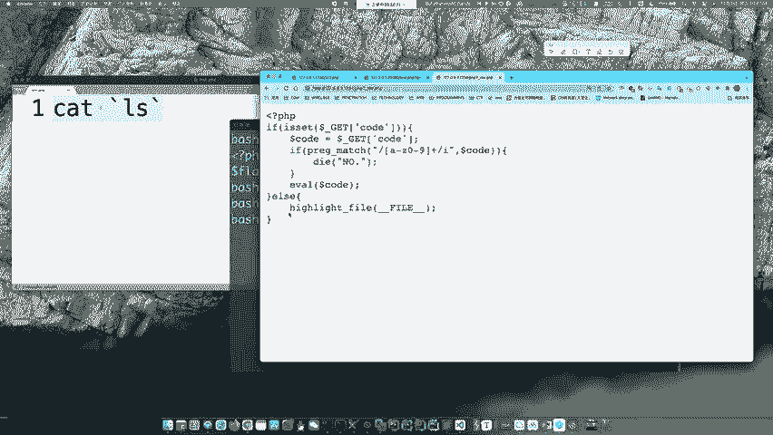

也有很多这种去替代他的方法。

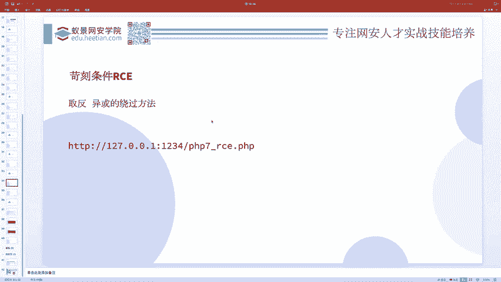

接着我们看一下这个呃，就现在举的这个例子，没有字母，没有数字怎么办呢？我们就以PP7为例，因为我现在用的是PP7的版本，5和7还是有一些区别的。😊，在PP7里边，我们想要执行一个命令。

执行只执执行一个代码，但是这个代码又没有办法包含字母和数字。那其实就是需要你使用到一种变换的思想。怎么样通过一种变换，把一个本来不属于字母和数字的东西，然后经过某种运算变成字母和数字。

那PP里边有这种运算吗？当然有就是什么就是未运算。😊，啊，那在这里边呢呃我这里边准备了两个代码，一个叫叉OR点PP它是一个专门做易货的东西。我们可以看一下open。长玩2点PP。

这个代码就是你要把什么字符抑或，你就把这字符放在这。比如说我要现在通过易惑获取1个PPin，那么我就把PPin写在这。然后P1P叉20P1P，我就得到了一个这个东西，这就是抑获得到P1P的。

在讲义惑之前呢，我呃我们需要先知道1个PP的特性。其实昨天。也提到了，就是昨天我们不是讲变量覆盖嘛？变量覆盖有例讲了这么个东西，就是变量覆盖先extract。😊，Dollar get A222。

然后我们就dollar ddollarpo0。对吧我们昨天是不是讲了这个这么个代码，讲变量覆盖的时候。😊，然后当时有个同学就问，就说这个到了D括号到了po0，他不理解是什么意思啊。

然后我说这是PP7的一种特性，叫做呃函数的动态调用。你可以先搞一个字符串PP info这个字符串，然后你把这个字符串呢加一括号。那么就相当于利用这个字符串去调用这个字符串同名的那个函数了。

所以你看是不是PP音符就执行了呀。那现在我其实只需要通过某种手段来得到一个这个PPPin的这个字符串。这PPin字符串可以是呃P是P点in这样拼接得到的对吧？你看是不是也可以啊，除了拼接以外。

还有各种运算得到的，你只要得到一个这个字符串，然后你把它扩起来，然后后面再套一括号是不是就执行了呀。😊。

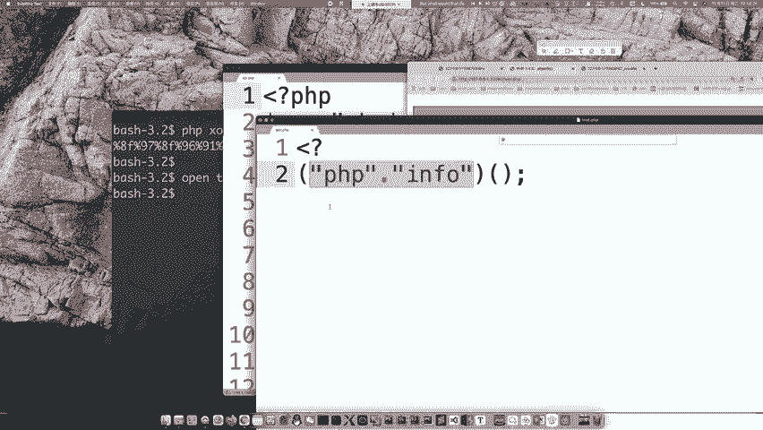

那么啊易货运算的本质呢就是。去得到这样的一个字符串。你看所以我现在得到1个PPin付字符串，然后在这里边要要执行一个code。那我就col等于。首先我要给它括起来吧，然后括起来加括号是不是就执行了？😊。

看到没有？虽然他这里边报了一些 warningning，说你这个呃呃百分号就是这个UL编码的这两个东西，它是一个没有被定义的。但是没关系，它确实能运算出来PP in，然后PPin就执行了。

那如果说我想要执行点别的呢，你比如说我想执行sstem L，那你要你就先构造一个stem呗。这就是一个stem。我把C字们放在这儿，放这括号里边。然后现在。有了system。

然后他说system expect at least one pair零 given expectpect呃，就是期望至少有一个参数。但是呢你一个参数都没给，那sstem函数至少触发了吧，你看对吧？

只不过他报错了，那你要执行什么参数呢？你参数也是相同的办法喽，我执行L。😊。

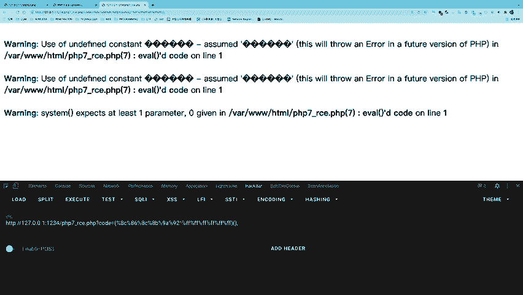

那我搞1个L的一个抑惑，然后把这个放里头。啊，你看这就是LOS的结果。在这儿呢，尽管他报了一些 warningning，但至少LOS被执行了，对吧？这是呃，在没有字母和数字的情况下。

我们是不是也把它给搞出来了？这是取反啊，不是不是取反，这是疑惑。生成PP抑惑。嗯，字不串。点PP。上。🤧除了抑惑以外，我们还可以用取反来搞啊，这里边有一个取反。

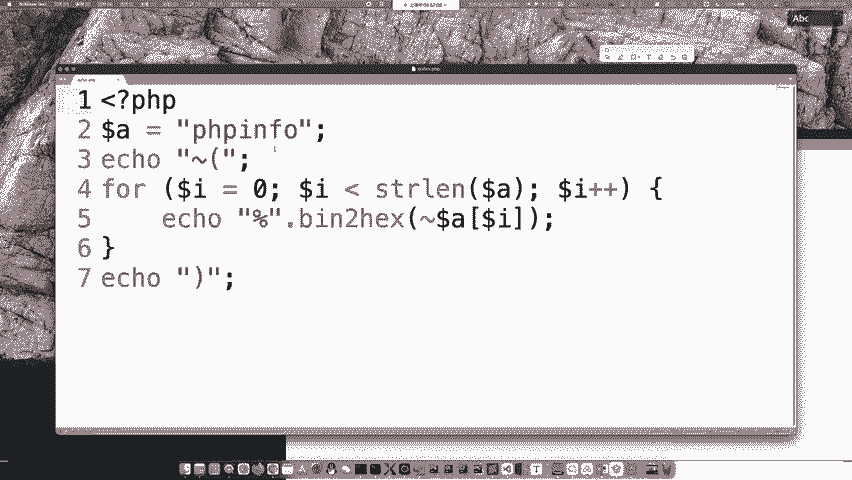

比如说把它得到一个。不生さん。那么我就P1P这个取反点P1P，我就得到了这样的一个取反。这取反呢，你这中间是有个括号，对吧？把它整体取反。那其实如果说你不加这括号没问题。把它写在这儿，然后后面还是这L。

那你看这L是不是也触发了，甚至说这个里里头的这层括号亏以没有没关系，就是这个括号没有没关系，你看它是不是也成功了呀。那你这个疑惑的，你你把这L应用区分搞一下。这是。生成P2P抑或就是取反都串。

取返和抑惑是比较常用的，绕过这个。无字母数字we shop，但是这种东西相当于是比较基础的一种绕过方式。还有一些比较难的呃。就我们就不在这个基础课里边嗯给大家再灌输特别难的知识了。

大家因为毕竟还是呃刚入门吧，对吧？所以我们先讲一些简单的东西。

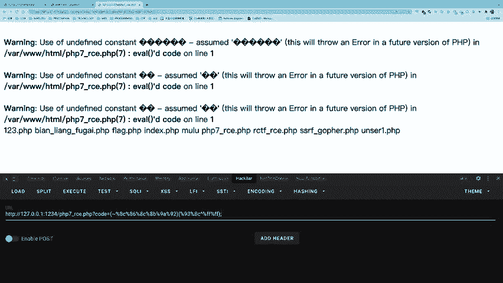

那CTF里边它会呃简单题会出一些这种。那难的题呢可能比这个要复杂，一些，你要构造好久好久才可以构造出来。

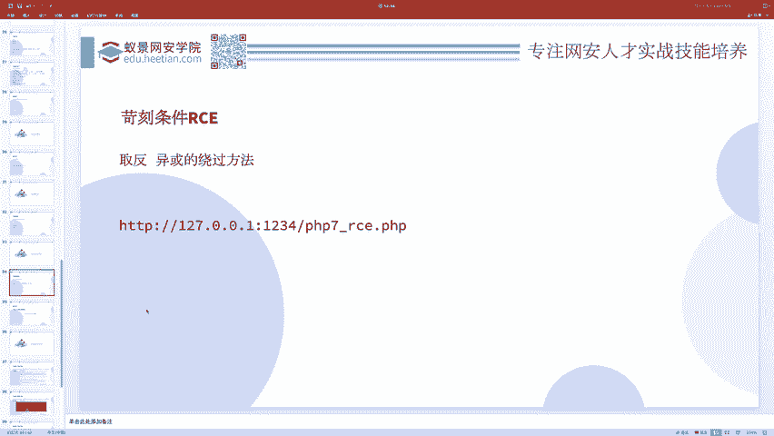

接着我们看一个这个题，啊这个这个这个打不开呀，我我还得那个什么，还得把它这个解析成那个。呃，解析成IP地址。本来之前都可以打开的，本来之前是阿里云的服务器，你只要不是80端口。

8080端口中常用端口不不不备案没关系。其实我这域名备案过了，Y音这点VIP。😊，但是他很讨厌，所以现在子域名也得备案A点什么B点什么。😊，C点什么，这些都得子域名都要接着备案，就特别的恶心。

之前就是一个备案，然后他的子域名都可以随便用，然后现在是子域名得备案，但是呢子域名备案，但是你不是什么80端口之类的，这种2005端口还随便用，现在又恶心人了，就从这两天开始，从昨天开始吧，就你。😊。

这种端口都不行了，都都都不能用域名了，就就是恶心人。所以只能输输这个IP地址了。本来搞了域名，希望访问的方便一点。那这个题目的话呃看上去难啊，因为它过滤了好多好多符号，好多好多的东西。

首先长度不能大于18。他说you are really long，but I don't like more than18，然后杠W是表示什么呢？杠W表示是字母数字下划线不能有。然后接着这些and或呀。

E或呀取反，呃，取飞这些符号stop calculating就是不能做这种微运算，然后括号不能用说call function is not there不能用括号。呃，这里又多写了一遍，这是没用的。

然后大括号中括号就是呃bracks是那个括号的意思吗？不能用，还有dollar啊。艾特点儿不能用，说这些都不能用的情况下。还不能大于18个字符，我就给你译为AL就这么个题，就这么这么。呃，苛刻的一道题。

做起来竟然是如此的简单啊，你只需要。

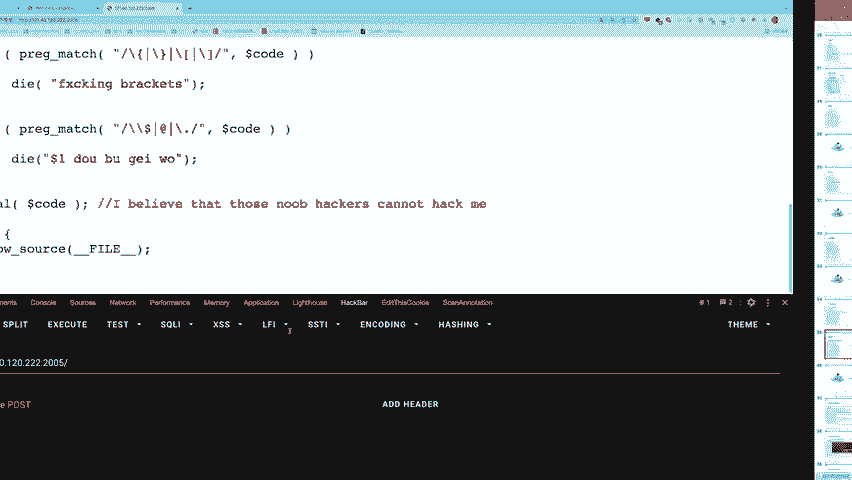

执行这么一个东西就好了。

但他会执行好慢好慢好慢。太多了。Flaag。大括号。这都找不到了。在这。这是一个flag，这是就取到了，大家看到了吧，就有太多了太卡了，我把它给关了啊。那么为什么会发生这样一件事情呢？

就为什么我输入一个这个就可以把这道题做出来呢？😊。

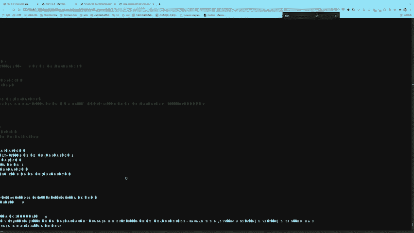

首先这个东西表示先把你这个PP结束，这，然后后1个PP70，然后这是1个PP的短标签。这PVP标签一般不是这个吗？然后我们可以不写这PVP，这就叫short tag短标签，不写这个PVP这三个字。

然后在这短标识系统上加一个等号，它表示了什么呢？😊，表示的是。依口。这个东西是方便开发者写代码的。所以比如说你这个呃问号等于1个ABC，那就相当于是一口1个ABC就会输出。那我现在等号一口输出啥呢？

输是反引号，反引号我们刚才讲过了吧，反引号表示什么呀？表示shallEXDC吧，是不是执行系统命令啊？😊，而执行什么系统命令啊，执行的是里头这个系统命令吧。😊，这里边摆放20是空格。他就执行了这个。

而星号是什么？星号表示任意吧，星表示任意，然后问号表示单个长度的任意。所以这个东西其实就表示什么东西呢？并开。行，所以他最后相当于是执行了bin cat的星。当然因为它太太匹配太平常。

它还可以匹配好多其他的东西。所以说啊在结果里面我们看到的太多太多的结果，因为它能匹配到的东西太多了，但是最后它确实匹配到bin cat的星。然后这个星呢也可以表示flag点PP吧。

所以说就宾 cat flagag点PP就发生了。那我们就拿到了flag点PP的结果。😊。

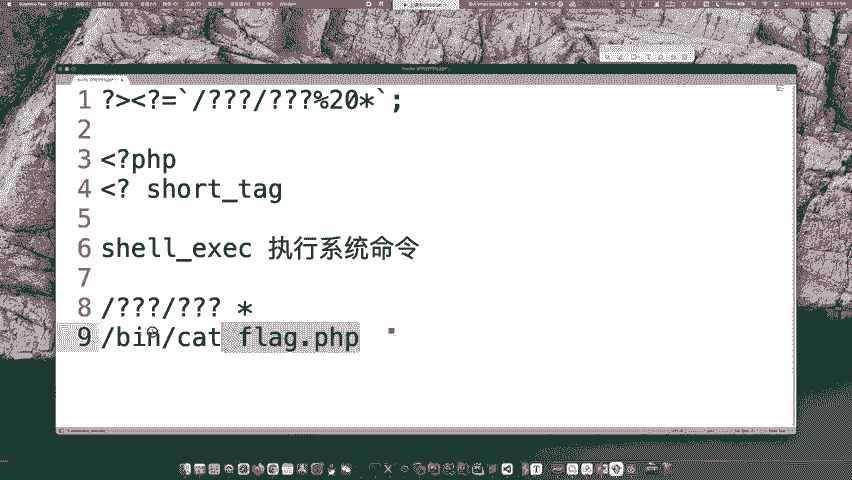

这个就是呃。这个题的解法。因为我们要执行并输出嘛，所以说你你要输出的话，你就只能用什么eco之类的东西去输出。但是那个还不行。如果说你去调别的函数，这里边也没有办法去呃进行一种未运算的。

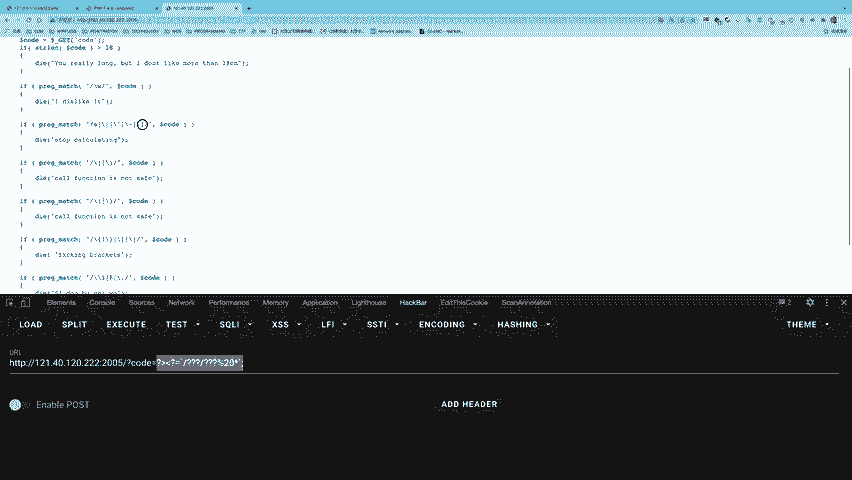

构造。所以说我们只能调用这个反引号这个函数，它是shaEXEC的别名，但是它不需要字母数字下划线，它就可以执行。那么这个东西又不能输出，怎么输出呢？啊，依口什么又太长了也不能用。所以我们用短标签输出。

但是你想要用短标签的时候，那一个标签开始必须要先把一个标签结束。所以说我要先把它结束了，然后再起始。所以这个东西其实本质上并不是我去找什么闭合。因为你这里前面也没有东西，就是一个doer code。

你直接执行就好了。😊。

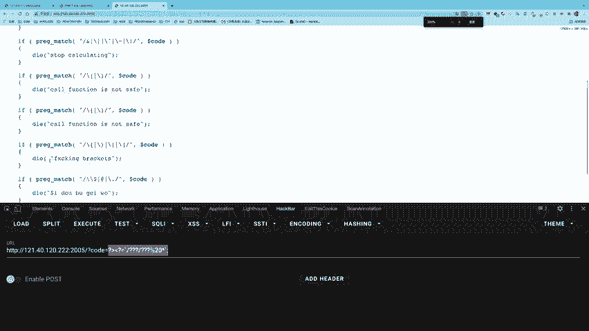

就本质上你就算直接这么写也没问题，它也可以执行，但是没有输出呀。为了输出啊，我们给他加了一个这东西。😊，所以说大概呃思路是这样的。那这个是一个呃。比较看起来难，但实际上不难得提。接着呢我再讲一个知识点。

叫做create function。create function有时候会考。它是去创建一个函数的，比如说你给一个doer A dollarB值参数下一个函数体，然后就会创建一个函数。

但是这个创建函数的过程中呢，它存在着一个呃代码的注入啊，就是你可以在里边先用一个大括号，把这个函数闭合了。闭合之后，后面你就可以去注入你自己的代码了。但是它后面还有个大括号啊，然后你就用这个注释符。

把这个给注释掉。这个其实相当于是先闭合，然后然后再注入东西，然后再把这个闭合给注释掉，这些和CQ注入差不多。这就是create function的一个呃利用方式。但是这种东西呃考的不多了。

因为create function已经渐渐被淘汰了。

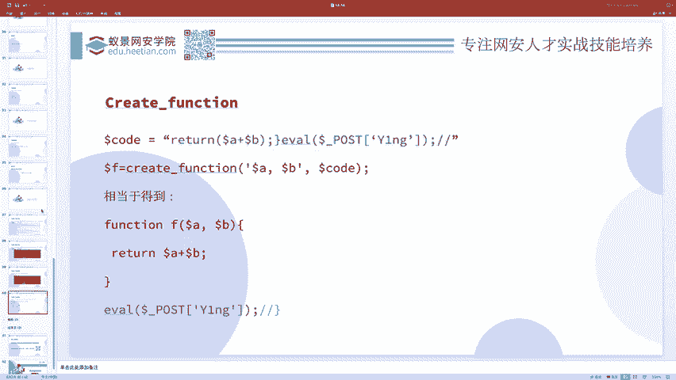

好，那讲到这里呢。😊。