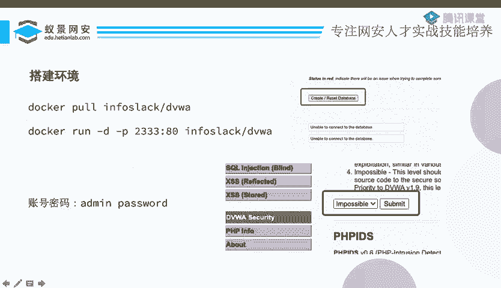
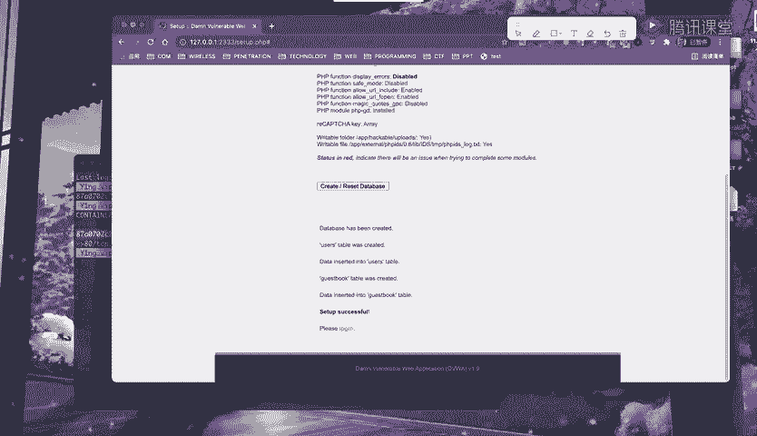
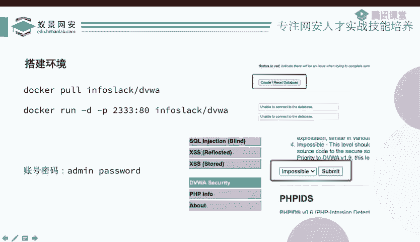

# B站最系统的护网行动红蓝攻防教程，掌握护网必备技能：应急响应／web安全／渗透测试／网络安全／信息安全 - P58：10_DVWA靶场搭建 - 跟小鱼学安全 - BV1SF411174M

啊，前面讲的是一些比较泛泛的介绍性的东西，没有什么太大的意思。接下来我们还是来实地操作一点东西。首先呢我们需要准备一个靶场，这个靶场叫DVWA它也比较好办，你直接把这个镜像拉起来。其实你你可以不用拉它。

你就直接输入第二条命令，你用用docker就可以起。当然你也可以直接去呃搭建用它的这个源代码，如果说你有什么PP study的话也很好办的。但如果说你没有这种环境的话。

这这其实有一些集成的这个docker镜像，你直接把这个呃镜像拉下来，然后起一个容器就好了。😊，啊，docker run，然后run的是什么e run run是这个 imageage。

然后杠D的意思是说啊去后台运行。然后杠P呢是一个呃映射的一个端口，把里边的8硬端口映射到外边的2333端口。

那我们不妨来试一下。然后当你把这个 run起来之后啊，你你肯定没有没有我这么快啊。因为如果说你没有这定向的话，他要先拉镜像，拉镜像要一段时间。当你把它转起来之后。

你可以用dockerPS看一下现在你的docker容器，这是我现在就起了一个容器，对吧？然后它是映射到2343端口。你是2333端口之后呢，我们就可以启动本机的这个2333号端口。

然后你会发现是这样的一个页面。这个页面之后你要干嘛呢？首先你需要对它进行一个初始化，点这个create reset database。因为是现在是刚打起来的，它其实还没有数据库的。

啊，你看你看现在你点了之后，他说数据库被创建什么什么，然后它会跳转到一个登录。那这个登录页面呢有一个默认的账号密码，这里面也写了啊，账号所的密密码是pas说的。

所以我们填输addmin password。那就成功进来了，这是一个靶场，你可以看到左边有不同的一个类型。比如说啊bte force就是爆破吧，C3F啊，然后文件上传啊，文件包含啊s啊叉S等等，对吧？

这是不同的一个呃漏洞的类型。这是一个靶场。但你想用这个靶场之前啊，我们需要在这个DVW security里边。你可以看到这里边有个security level，它默认的应该是一个impposible的。

这里边它给到了4种啊就是security level，就是四种安全等级。默认的 impossibleposible impossiblepo不可能的嘛，对吧？不可能的意思就是说它是安全。

它不可能被攻击的那如果说你选了impposible的话，那你去做这些漏洞，那就没意义了。因为它是绝对安全的。所以我们需要先把它的这个安全等级给改成不是imposible。比如说我现在还还比较菜，对吧？

那我就先改一个low就好了。啊，至此呢，你现在这个靶场啊总算是搞定了。搞定了之后啊，我们接下来就可以来进行。

