# B站最系统的护网行动红蓝攻防教程，掌握护网必备技能：应急响应／web安全／渗透测试／网络安全／信息安全 - P59：11_报错注入 - 跟小鱼学安全 - BV1SF411174M

嗯，简单的来看一看报错组，报错数其实有好多好多种，有一些奇奇怪怪的那些图形啊，数学啊运算的都可以报错。但是用的不多，本来报错助这东西考的就就也简单，太他和他怎么说呢？它不比联合注难到哪去。

所以说在题目里面，这都属于那种入门级的题，入门级题就没必要嗯特别那个特别去深深究它。因为这种题本来考的就也不会在什么正式的比赛里边出的。那我们来看一下什么是报错注入，报错注入也是有危险注入的一种。

它是在没有办法用uni联合查询的时候去用的。其实这句话呀说的就有点不准确。就算是你有联合查询的时候，你也可以去用。本来我就就就像我现在要去一个地方，本来我坐呃一个公交两站就到了，但是我非要先坐一个地铁。

然后再倒另一个地铁，再倒另一个地铁，再倒一个公交，再倒个地铁再过去，就是你你明明有呃这个捷径。但是你非要绕弯路。那这种情况下，反正我也没法拦着你，但是。😊，呃，就我们说按照正常人的脑子。

报错珠是在你这个捷径没有办法直达的情况下，我才要去换乘的。啊，就有你不能用的时候，我考虑使用报错住条件呢是不能关键一些关键的函，不能报，不能过滤一些关键的函数。并且呢你需要有回险，这个回险是啥呢？

这是报错的一个回险。比如说啊我们来一个报错吧。就以刚才那个limit01为例吧。你比如说我limit零逗号没了，后边应该还写个数字，对不对？是不是这个语法是不对的，他就说了啊，这是一个错误。

这个错误说你有一个CQ的一个语法的错误在哪里呢？在这个地方。这是不是就是一个报错呀？😡，那么报错住的意思就是说我就想要构造这样的一个报错。而这个报错呢。还不是一般的报错。你就比如说现在我们构造这个报错。

说你有一个语法错误，请检查你的语法，这没有任何用，对我们来说没有任何意义。我们要的报错是有意义的报错。这个报错呢必须要给我们。😡，一些信息，我想要一些。呃，查询出来一些东西，然后这个查询的结果呀。

你如果能在这个报错的信息里边给我输出出来，那就太好了。哎，所以说报错注入就是我们人为的去构造一个错误。然后呢，他给我们回选这个报错的这个错误的log。然后在这个错误的logg里边呢。

有我们想要查询的一个东西。然后是不是你看这个错误的日志，就可以看到具体一个内容了，这就是包守。呃，关于叉L是啥，我们这里就呃不不说了。😊，但是呢在这个呃myq里边有这么一个函数，它是去操作叉ML的。啊。

这是一个小图片啊，不知道大家能不能看清啊。它的作用是改变插描文档中符合条件的节点的值，就用叉pa去对你这个叉mel文档去寻址。寻址之后找到匹配相应的东西。

然后把它update update成一个新的valueue。呃，这里边我们没有展开去说叉秒啊。反正你只要知道叉pa是对叉L进行寻址的一种东西就好了。

所以啊这个update channelL这个函数它的第二个。参数应该给到一个叉pa，对不对？但是如果说我给你的upate叉L的第二个参数不是一个叉 pass怎么办呢？这时候他就会报错了。

比如说我们可以试一下这个。select星 from这个东西，然后呢呃来个and。where就 where什么一等于1吧，and and一个啥呢？and一个upate插秒。我在这里写。

where username等于admin。这个语句，然后。and and一个up个叉ML。你看现在就是说这个条件是啥，条件要满足一个这个条件，并且一个这个条件。而这个条件它会干嘛呢？

它会呃执行一个up拆L，并且。😊，第二个参数应该是个叉pa吧，而我现在是啥呢？是一个波浪线，加上一个select结果，加上一个波浪线。这这个零叉器它是一个字符串字符串嗯的一个1六进制的表达形式。

就是在mysql里边用零叉加上16进制，就是表示它对应的字符串。那这样的话，本来这是应该是一个叉pa，而它不是一个叉pa。于是呢他就报诉了，他说叉pas语法错误。啥错了？你这个东西是不符合的。

你看是不是我们想要的东西就有了呀，我是不是就想要slect user呀？那你这个s user的结果是不是就在里边给我展示出来了，这就是报错注入。我通过构造这样的一个报错。

然后看你这个报错里面报错了什么东西，这就是我select结果。那我把这个slect user换一下。你比如说我想查 database，好吧，slect database。😊。

那你看这dase是不是就有了？你比如说我想查usnamere。Group。Concaact。username password吧，username没啥意思。From。Users。

你看这password的123123是不是就有了，所以说这就是报错主，就这么简单。还有一个extract value和up叉L基本上差不多，只不过它缺了第三个参数。啊。

所以你把这个up叉l换成exstruct value，把第三个参数给删掉就OK了。然后为什么要加上一个零差7亿呢？其实就是。呃，为了满足它一定能报错，因为波浪线波浪线这东西一定不是叉 pass的语法。

那你不管你中间拼接了什么东西，它都会报错的。这是为了让我们百分百能报错，百分百能看到结果。然后我们给它拼接上了一个波浪线，就是大概是这个目的。好，那现在呢这个。😊，呃，基本上别的呢我们就也不说了，因为。

关于这个upate叉L extract value是最常见的，还有一些其他的报s错注入的方法，但是不常用。本来报s错注入就也不常考的东西。接下来我们不妨来做一道题。

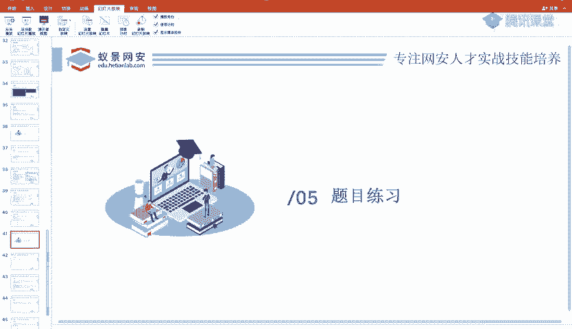

还有一点时间啊，现在是还有还有6分钟的时间，我们可以呃来一道题，真正的体会一下。我先起一下这个刀口。呃，然后这个题呢其实就是一个学生信息的一个查询系统。

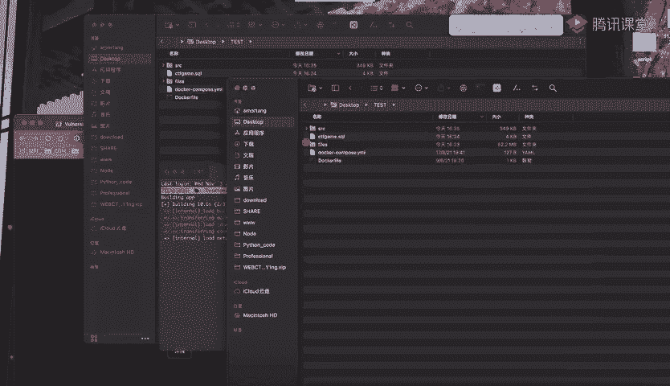

然后你输入一个学生的学号，他会把这个学生的一些具体的信息给你查询出来。这里边啊我要重新把它build一下，大家稍等一分钟就好了。很快的。这题呢其实基本就是一个属于呃最最基础的那种题了。

因为我没有在这道题里边做任何的过滤，就一九的题它可能过滤暗的呀，过滤二啊、过滤空格等等，对吧？这是很常见，要不然这题简直就。太简单了，但是我们现在不就是在入门嘛，就是从最简单上开始。没有任何问题。

大家也不要不要说瞧不起这种这种简单题，每个人都是从零基础开始的。好，我们看一下，这是一个学生信息查询啊，他为了呃防止我们不知道这学号是啥，还给我写了1个2019122001，对吧？2019122001。

😊。

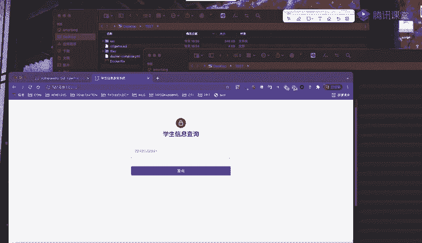

啊，你应该一查就查出了，这是他的学号，这他的姓名，这是他的一个专业，是信息安全。那我们现在就来看一下这道题怎么做。首先很明显，这是一个查询，用户输入了一个东西，然后他根据这个东西查询。

就我现在不说这是一个讲CQ注入的时候用的题，就是一个比赛，你这样遇到这个东西，大家是不是也可以很清楚，就是很直接的就能。知道啊，这是一个CQ注入的题。因为你输入了一个学号。

我是从里边给你查询出来相关的数据。这个除了数据库的操作以外，这还能是啥呢？好像没别的东西了。所以我可以很很明确的知道，这就是一个C注的题嘛。那现在我们就看吧。你这有一个非常非常明显的一个参数。

还是get型的，哎，太太好了。sID等于2019122001。

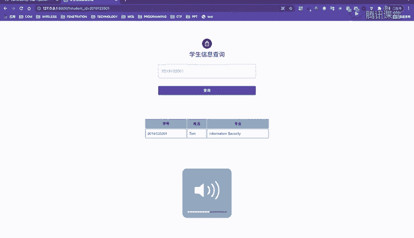

那接下来我们就来试一试你这地方能不能存在注入呢？首先我先给你来个代引号，如果说。你这个单引号报错了，那么他说查询失败什么的呃，好像我们还没有办法说明什么。但是这道题很简单。

它会给我们输出一个呃给我们输出一个这个错误的日志。这个插件是什么？这个插件是hack bar。HACKBAR你去google应用商店可以搜到。你看这道题啊，我们输入一个单引号。

他就直接给我说了一个错误的信息。他说你有一个呃sqQ的一个语法的错误在哪呢？20191201单引号单引号的出现，让他的语法出错了，这说明什么？这说明我加进去的单引号。成为了他语法的一部分吧。

如果我家的代引号不成为他的语法的一部分，我又怎么能影响他这个语法的错误呢，对不对？😡，呃，为什么为啥双击打不开，没没明白你这句话的意思啊。就是这个插件这呃你等一下我下课了，我我我给你单独的再说，好吧。

然后就假如说这道题我来一个单引号，他不给我这么明确的信息，他就说查询失败也没关系。我们可以用我们自己的那个方法。啊，刚才我们怎么弄的and。二。等于。一对不对啊？你看是不是查询成功了，查询成功还还是。

😊，呃，基本上就可以说明这个案的一等于一成为了一个语法的一部分了。或者说我来个二一等于一，也基本上没问题。基本上就说明它是一个注入点，并且呢这是一个字符型的注入，对不对？你看我再加一个单元行呢。

那很很明显就不行了。或者我也可以一等于，然后来个井号。但是你要注意呢，在URL里边的井号呃，是可以是必须要被进行UL编码的。因为如果说你不编码，直接写井号的话是不行的。不行的，看到没有？

因为井号呃是URL格式的一部分，它表示的一个分片。这个井号如果说你不编码的话，它会被浏览器吃掉，不会传给myxiql的mysql收不到这个井号。所以说我们要把它编码。你看这样的话。

是不是我现在已经测出来哦，原来你这个地方存在一个存在一个注入点吧。有了数点接下来干嘛呀？😊，奥特y对不对啊？奥特 by一。😊，OK吗？OK的。奥特曼2OK吗？ok的奥特y3O吗？ok的。😊。

autoY4OK吗？不期。所以说明什么？说明一共有三列，对不对啊？因为四的时候不OK了，所以就有三列。那好。接下来我们来看一下。你的回线结果在哪？因为有3列，所以我用你select123。然后等你。

没东西，怎么会事？没东西。你至少123应该有点东西回显出来吧。我们刚才是不是这么说的，为什么没有东西啊？😡，刚才我其实我们有提到了，不知道大家还有没有记得。就是因为uni它这个结果是。

先来个slag放上面，后来s放下面，对不对呀？你这个suni select，我们这123是不是后面的s呀？而它这201912001这topm informationform security这是啥？

这是不是它前面的slalect，对不对？前面的一它只会选一行，而前一行就是前面这个查询，把我们这个123也覆盖掉了，我们看不见了，是不是刚才说了，那怎么办啊？我们可以直接来个按1等1是不是行啊？😊，哎。

不是不是不是按的一等按照一等于2是不是行啊？因为一等于2是甲，对不对？你看现在是不是就没有了。如果说你不写按照一等于2，我直接让这个学号查不出来东西，我随便写点学号，123123肯定没有这这学号吧。😊。

你那是不是也查不出来东西，你看这个123是不是就OK了，让前面查询不到。对，没错，你看现在是不是我就知道了，原来三列都可以回线。啊，都可以回家那点真得是太好了。😊，接下来我们就开始查表查列查字段。

查数据，对不对啊？那个什么select什么东西from information sma点什么什么东西，那个很长的。我们没必要自己来搞，我们用chrome的这个hack bar。

看到没有一个cyclly点点一下myxiq Mexicoxiqco有啥呢？dump tables from database这里边你想查这个数据库名也行吧。我们从从从这个表就是数据库面开始查吧。这里边。

要让你输两个数。第一个说的是the number of columns，就是说有几个列呢？现在我们用outder by测出来有三个列，对不对啊？然后他说output的 position。

就是输出的一个地方，哪一列输出呢？因为我现在123这三列全都可以输出，我现在能看到，所以说无所谓的。那如果说你这123只有一叔叔，那我就写一只有二叔叔，那我就写2三叔就写三就好了。他现在我是无所谓的。

所以我就写一共有三列，第一列。哎，你看他直接给我写出来一个。等你。你看这就是所有的数据库全都给我拿下了，这是查所有的数据库。当然我也可以查什么，我也查我当前的数据库，我直接用daaseb这个函数。

那我知我当是个靠例。可以吧。有了数据库，接着干嘛呢？查表吧。啊，还是用这个dump table from this，从数据库里边d不出来啥呢？d不出来表。然后依然是一共有三列，我在第一列输出完了。

你看直接就把这一句话给我们打过来了，我自己都不用写的。然后一执行，哎，他就有student有teacher。然后有了sdent和 teachereacher之后。

我接着是不是就查这两个表下面还有什么列呀，然后dump columns from database还是有三里查一个。

然后他就给我一个select column name from informationchema name columns where table schema等于 this。😊，然后我执行哎。

你看是不是就把这两个表下面所有的列都查出来了。但是这好像还不太行，因为你不知道啊这到底是哪个列的，对不对？为什么会这样呢？因为它查列它的条件是啥？它的条件是table sma等于dabbase。

意思是说，数据库名等于当前数据库。也就是我现在查的是数据库下所有的列，而我根本不知道那这个列对应哪个表怎么办呢？我可以指定一下。啊，table name等于等于啥呢？比如说我只查teacher了。

我就写个andtable name等于teacher，是不是我又给他加一个条件，不仅要这个数据库下面的，还要这个表下面的。你看现在是不是就明朗了？这些东西。而我有了数据库，有了表，接下来干嘛？对。

有了有了表，有了列，这还是说查字段，select列 from表就行了，对不对呀？你比如说来1个ID，然后groupcon。一个name和age啊，我觉得name age没什么太大用啊，我最想要的是啥呢？

我最想要的是这个password啊，这个card passwordword，我把这个card password单写一个啊，card password。我查哎，你看是不是就查出来了？flag就有了吧。

这就是一个最最简单的联合查询著的题，它的一个方法。用我们这个呃插件，然后自动帮我们生成，你都不用去写就完事了。

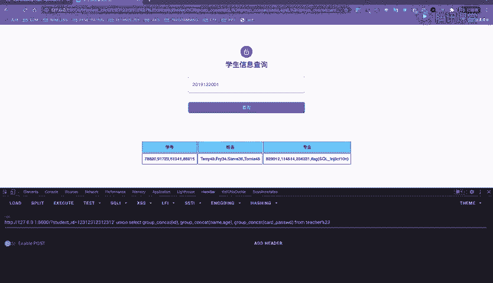

这是使用联合查询的方法。接着呢我们可以尝试用bos珠and extract value，然后select a card password from teacher，我们来试一下。

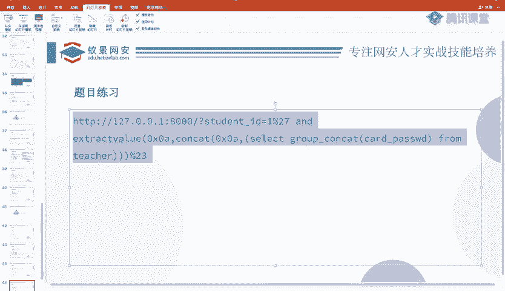

这是我们说的extract value的报错输。第一个参数呢随便给点东西，比说给个一吧，没问题。第二个参数呢是呃一个查询的结果，对不对？他是不是会把这个结果给我们报错出来吧，你看是不是报错了。😊，哎。

但是你看发现突然现在就有问题了。😡，有什么问题呢？就是太长了。😊，而这个报错你你总不能这里有1万个字符，我把这一万字符全都给你这个报错出来吧。😊，所以这个时候啊好像遇到一个我们不会的东西，怎么办呢？

所我现在他只能报错一部分，我们想要后面的这些东西不够长了，他只能。他只能给我们写这么长，那怎么办呀？其实这里边很简单，我们只需要对它进行一个截取就行了。我用了一个sub stream，对它进行截取。

意思是说，从第20位开始输出到后面。

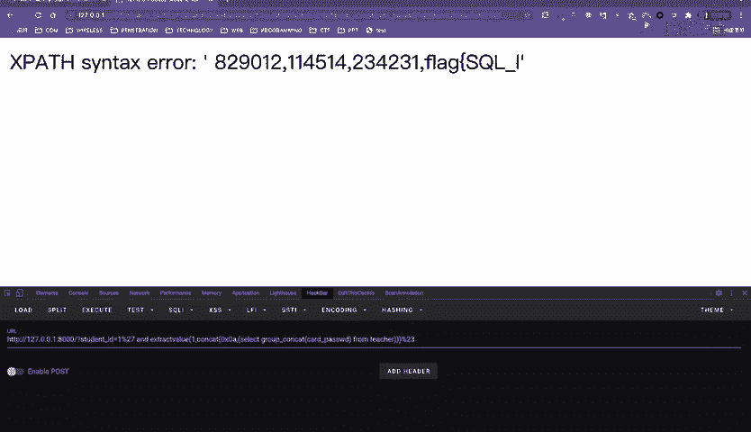

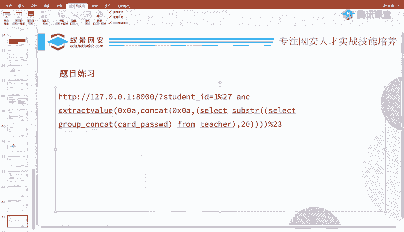

你看现在我对你进行一次截取，从第20位开始输出。你看是不是就可以了，这个flag就有了吧，我也可以不从20位，我从第15位输出。从第1位开始截，前十五都不要了，然后我一截。

你看是不是照样也可以把它给拿到呀？这是啊在这个长度不OK的情况下，你用sing什么的截取一下就完事了。

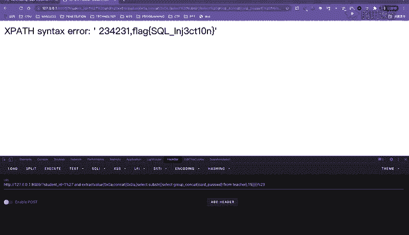

啊，这就是一个呃爆错猪。那基本上我们今天讲的就讲完了。那接下来啊那就刚才有个同学说啊，熟了这接CQ map没问题啊，CQ map照样这里也给你准备好了。😊。

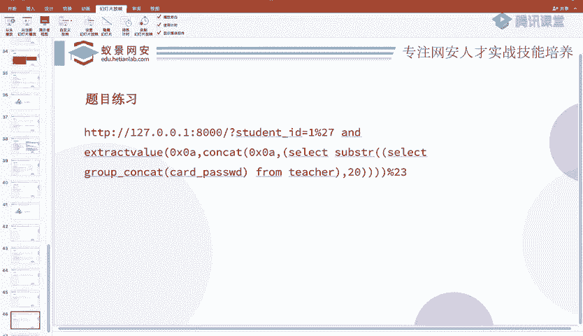

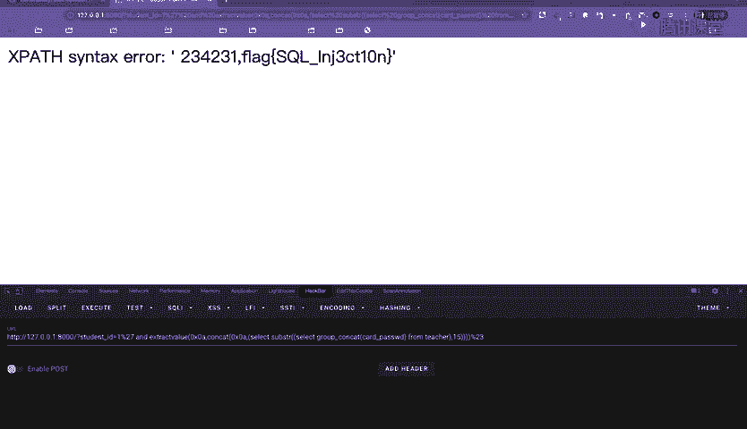

我就随便跑一个吧。这个杠杠DBS呢是跑它有哪些数据库的，然后杠currentDB说我现在使用哪些currentDB，然后呃杠D指定我现在的currentDB是一个college。

然后呃这个杠杠tables就可以把所有的tables都可以查出来。然后有个table，我杠T指定这个tables，然后我可以杠杠collumns就可以把它列都查出来。

但是呢有了表有了数据库就可以没必要查列了，我就可以直接。把你这表里面所有的东西全都给你打不出来。所以我就指定是college这个数据库teacher这个表，然后把里面所有的东西都给你搞出来。

你看所有东西都搞出来，就在这里。是不是呃就直接能看到里边存的fllaag了呀，对不对？好，这是。呃，这个。

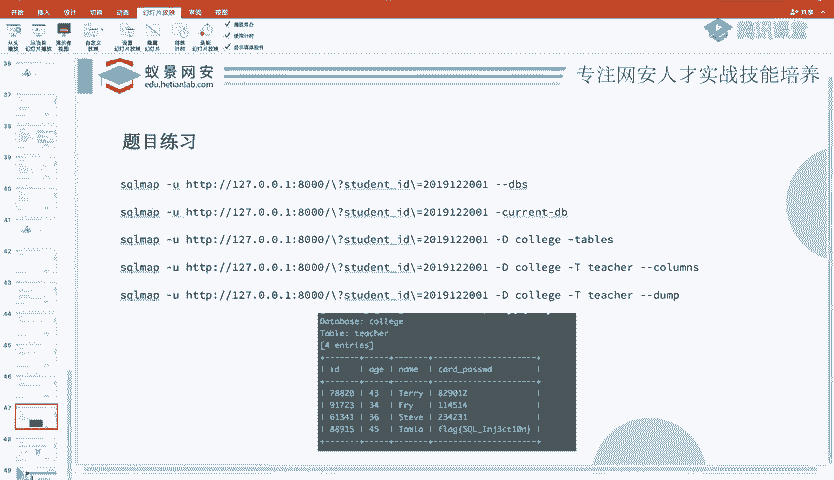

用s map的方法。那么到此为止啊，今天我们的内容就。