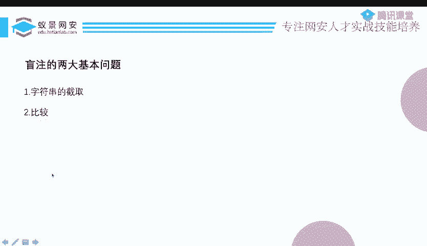
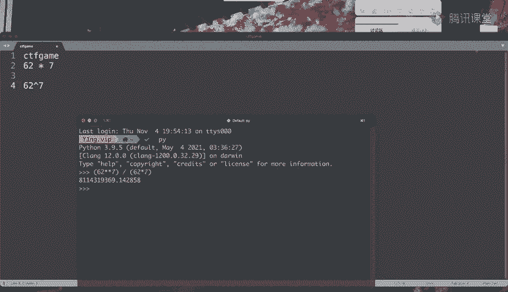
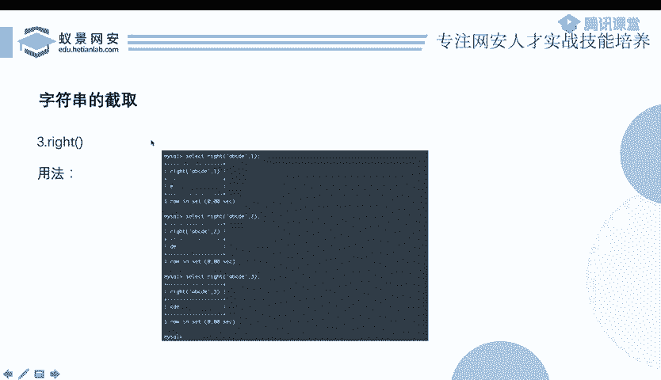
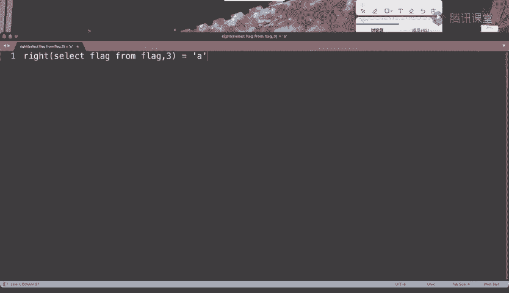
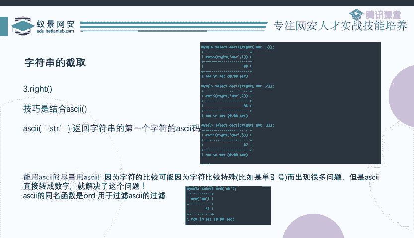
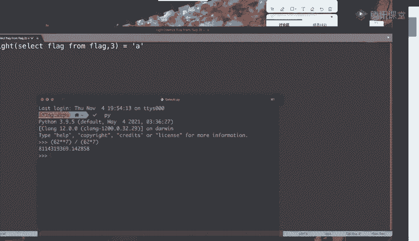
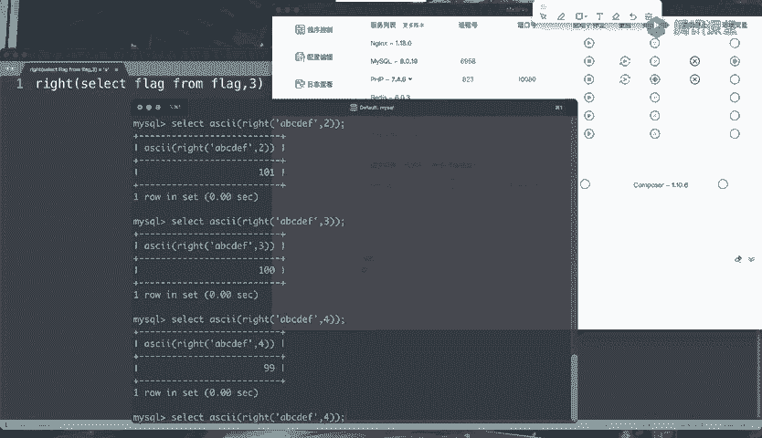

# B站最系统的护网行动红蓝攻防教程，掌握护网必备技能：应急响应／web安全／渗透测试／网络安全／信息安全 - P60：12_布尔盲注1 - 跟小鱼学安全 - BV1SF411174M

那么首先我们先来看基于布尔型的盲助。这张PPT啊是昨天的课程。我们讲CQ注入的分类的时候啊，说我们可以把它用回显的方式做划分，对吧？如果无回险呢，就是盲助啊。

忙助有的波尔行啊时间显是通过某种手段来爆破这个结果的。那么啊既然是这样的，我们就展开来看一看帮助这两大分类。虽然我们的这个标题啊写了3个，但其实基本上啊就只有两个分支，一个是布尔型的，一个是时间型的。

布尔型的呢就是它回显是不同的。比如说啊还是以昨天晚上我们有一个学生信息查询系统那个题目啊，这是一个简单的入门题。我们以那个为例。你输入一个学号，他会把这个学生的姓名、专业，还有年龄吧。

好像是给你打印出来，对不对？那么当你输入一个学号，他打印一个年龄。如果说你这个学号输的不对，或者说数据库里边没有这个叫这个学号的这个同学的信息的话，那么他是不是就不能给你打印出来相关的东西。

你本来都没有这个人，我怎么能告诉你他叫什么呢？对不对？那其实呃如果我们不细看他具体的信息，就泛泛的来讲。这其实就是两种不同的回显。一种回显呢是他能给我打印出来具体的同学的信息。

另一种回显是他不能给我打印出来具体的同学的信息。所以这就是鬼险的不同。如果说有着不同的回险，那么布尔嘛，布尔不就是真假嘛，就是两种不同的东西嘛，两然后我现在说了两两个不同的回险。

是不是就和这个布尔其实是差不多的呀？所以说呃这里边呢我们管这种不同的两种回险，也叫两种布尔状态。啊，PPT上这里呢给大家列出了4种不同的b状态。第一个呢就是刚才说的啊内容的不同。

第二个呢可能是这个HTP的状态码的不同。比如说呃我登录成功，那么他给我来1个什么301重定向。如果说不成功，那就是200，然后回回回我一个这个登录失败，是不是两种不同的结果，对不对？虽然我不能告诉你呃。

具体的数据是什么内容，但是这一个登录框是不是可以给我回显两种不同的状态。还有就是如果说状态码也可以一样，但是想用头不投，还是这个状态框，这个状态框就登录你输入用户名和密码。如果说登录成功了。

我给你来一个location这个头给你进行重定向，或者说呃set cookie加上一个什么新的session。如果说登录失败，那么就没有这些头。那登录成功和登录失败是什么意思呢？本质就是CQ注入。

不是不是q注入，就是这个CQ语句的查询查询的成功和失败的与否？所以说如果说我们把这一串连起来，那么你就会发现你这边能看到的，你作为一个用户从浏览器看到的这些想用淘的变化呀，状态码的变化内容的变化。

它实际是反映的数据库执行了一个CQ语句进行了一次CQ查询这个查询的成功与失败，实际上是在这个word状态来体现的。😊，然后第四个呢是呃基于错误的b注入。其实这个呃就是我们第三个部分要讲的东西。

所以现在我我在这里先不说它。啊，那么很多同学如果说你是呃刚入门这个CTF的话，可能并不太了解这个盲助这个东西。而且忙助呢呃它没有上节课那么清晰了，因为已经不再是特别直观的东西了。如果我们要做的话。

也不能呃直接把它做出来，还需要跑脚本怎么怎么样的。所以呃现在我们。还是就假说自己完全不会这个东西，然后怎么样来把它学习学好。首先我们还是看PPT上给出这两个例子。这个按一等于一一等于2。

我们实际上是不陌生的。因为昨天的课程里边就有呃去用过它，我们是不是用它来测试注入点2一等一按的一等于1，然后一等于2看它的那个回显结果是不是变化。然后我们说这里是不是有个注入点。

然后它是字符型啊还是数字型。这是我们昨天用这个一等于一一等于2来干的一件事儿。那么现在。呃，就还是以这个PPT上这两个语句为例。比如说这个这个ID它等于一，确实是能查出来东西的。

但是呢我在这个ID等于一后面加上了一个条件，就是end的一等于一和end的一等于2。那么这个end一等于一一等于2。就会影响他的一个查询的结果。因为呃你这个案嘛是运算。

所以说本来这个where尔 IDD等于一，这是好好的能查询出来东西。你现在突然给我加上一个按一等于一等于2。那么是不是这个查询的成功的与否，就由这个一等于一和一等于2来决定的，对不对？

因为前面这个呃ID等于一这个条件它已经是OK的这条件是没问题的。那么一个真与上一个真才为真，与上一个假就为假。所以说这整个语运算的式子，它的真和假完全都是由这个一等于一和一等于2来决定的。

虽然这里本来就是一个特别简单的东西，我们在这里来回来去的说了好几遍，但是。😊，啊，为什么要说这么多遍呢？就是因为在盲助里边，这个一等于一等于2真的是特别的重要。

我们找到了这个特别看着普普通通的一个一等于一等于2。但是它呢影响着整个语句的结果，那么是不是我们就可以把这个东西换成别的？你就想吧。一等于一表示什么？一是不是等于一，它是这个意思。

一等于二呢表示一是不是等于2，就是一种是不是的这种表达式，它只有两个结果，是还是不是在计算机里边就是真和假。所以说它是一种不文表达式。😊，而这个部文表达式的值，也就是这个真或者假。

影响着整个语句的查询结果，就整个语句就已经完全被它影响了。那我是不是只要换成一个起呃，只要不管是一个什么部文表达式，只要这个部文表达式，它最后的结果是真还是假。

那么这个真假是不是就会影响着这个查询的结果？所以啊当我们能理解到这一层的时候，就可以把一个简单的一是不是等于一，是不是等于二这种式子换成比较复杂的一个别的东西了。反正大家都是不是表达式。

大家最后都返回真或者假，所以没没有任何的区别的。而当我们把它换成下面这个黄色的这一段话的时候，这个变成了什么意思呢？我们来看一下。条件是ID等于一，并且并且什么呢？

并且我要把这个select database，就是数据库当前使用的数据库的名字，从第一个。字符开始截取一位，就sub string，就是这个意思啊，这个这个一逗号一就是从第一位开始截取一位。

那什么意思呢？不就是这个数据库名的。首字母吗？然后等于A表示什么呢？表示说这个数据库名的首字母是不是等于A，然后下面是数据库的首字母，是不是等于C，用一个一个是不是的一个表达式，那它最后就要么是是。

要么就不是。如果说它的首字母是等于A的话，那么就可以查询成功。如果说它不是等于A，就不可以查询成功，是不是啊？因为不就是一个真或者假的问题吗。所以既然如此的话，我是不是就可以1。1点的试。

你我问你这个首字母是不是等于A，是不是等于B，是不是等于C，是不是等于B，我一个一个的把你给跑一遍。你总得有一个正确结果吧，你这正确结果也跑不出去，这26个字母，还有那那几个数字，对不对啊？

一共就这么几种可能性，我把它全跑一遍，几十种可能性。你比如说26个字母大小写呢就是52，然后还有10个数字，那就是一共62种可能性，意味着我最多把它跑62遍，是不是我就能知道你这个首字母是啥了。

因为这个步骤表达式它影响着结果，啊，你比如说它呃。😊，他的这个布尔的回显就是查询成功和查询失败。我判我判断它是不是等于A，是不是等于B，是不是等于C，全都是查询失败。然后突然我判断它是不是等于F的时候。

他给我回显查询成功。那我不就知道啊，原来你这个第一个字母就是F。😊，忙住实际上就是这么一回事。就是通过这种类似爆破的手段，一个一个去试，一个一个去试，最好把他的这个正确结果试出来。但现在还不够啊。

因为现在我们只是知道了他的一个首字母。你光有首字母，那有什么用呢？那接下来怎么办呢？😊，接下来我们去修改这个sub streaming里边的。呃，第二个参数就是你现在不是一逗号一吗？

然后我现在把它改成2逗号一，这个是什么意思呢？2逗号一的意思就是说我从第二位开始截取一个字符的长度。那么现在这个s string整个表达式返回的就已经是它第二位的那个值了。

然后我我判断它第二位是不是等于A是不是等于B，是不是等于C，最后我是不是把第二位也跑出来了。然后接着我就把二改成3倍。😊，然后跑第三位，跑第四位，跑第五位，是不是你这不管一共有多少位。

只要我一位一位的给你往出猜。总能把你给猜出来吧，就一点点猜一点点猜一点点猜。虽然没有昨天我们说联合查询那样，直接一查完所有的东西都给我们查出来，但是忙住呃，虽然不能那么简单，但是也不难吧。

只要我不停的去试不停的试，我总能把你试出来的。就是一个所谓的功夫不负有心人的过程。那么。这个其实就是布尔盲族，就这么简单，没有什么别的东西了。那么。大家认识了忙助之后啊，我们现在来看一下这个CQ语句。

其实最重要的部分就是我们这个按的后面的那个东西。中文表明可以猜吗？这个我还真不知道啊，因为好像没有人写写代码，写程序会会把数据库写成中文吧。确实没见过啊，你可以自己试一试。

我我都不确定数据库是不是支持中文。如果说是可以的话，那如果说它支持的话，你就可以用相同的办法跑。不行的话，那就是不行。但是呃好像从来没有人这么做。你像比如说有人写代码会用拼音做变量，这种就是完全是。

很低级的行为。在正常情况下，你是不会遇到。然后我们接着说。这个盲柱最核心的部分就是按后面那个一等于一等于2这个波尔表达式。这个波表达式的值，它是真和假，影响着整个的结果。

进而影响着整个页面回显的内容的结果。然后我们仔细来观察它我们仔细来观察它，其实这个案的后面。😊，从一等于级变成了这个sing。他实际上有两部分。就是我这里有两个蓝框框。

第一个蓝框框呢是说sing一个什么东西。第二个蓝框框呢是等于啥等于啥？那这是啥呢？第一个蓝框框表示的是sub string，s string是一种字符串的截取。而第二个蓝框框等于啥等于啥。

这个等于是判断是否相等，所以说它是一种比较，对不对啊？那么啊由此呢。我们其实可以引申出来呃比较泛泛的两个东西，就是在做盲碌的时候，两个最基本的问题。字符善节学和字符善比较。啊，当然这个两大基本问题。

这个是这个是我说的，不是什么大家公认的东西。可能你问别人说忙住的基本问题是什么，他他都不知道你在问什么。因为这个东西确实就是我自己提出来的。如果说你去看一些相关的rite up啊，或者是什么课程啊等等。

其实你会看到好多好多不同的那种注入类型，比如什么like注入in注入，bet注入什么正则注入，乱七八糟的，各种各样的注入，什么抑或注入乱七八糟的。但是呢。反正在我看来，我对这些东西有一些比较不同的理解。

我认为他们。没有太大的必要去细化的这么细。因为不管说是什么like注入还是什么正则注入，各种各样的注入，最后它都跑不了。我们现在说这两大基本问题，就是刚刚的两个蓝框框框起来的两部分，一个是字符串的截取。

一个是字符串的比较。那么为什么我会这样理解呢？我简单给大家解释一下。😊，首先，字符上的截取，为什么它是一个基本问题？因为我们在做盲处是在干嘛呢？不就是在试嘛？试这个东西。

它是是不是这个是不是这个是不是这个第一位啊，是不是A，是不是B，是不是C，或者说用阿斯克玛试，或者说什么别的试的方法，反正都是一点点试，对不对啊？那，我们可以举一个例子啊。

就正确的结果就是CTF game，这就是我的正确结果。😊。

那么CTFga一共是几位呢？一共是7位，对不对？然后我们知道现在这个正确结果啊包含大小写字母和数字，也就是每一位有62种可能性。然后一共有7位。你跑每一位最多跑62次都可以把它跑出来。

这是你最运气最不好的情况呀，对不对？那一位62种可能性，然后7位呢就是62乘7，对不对呀？那如果说我不对他截取，一位一位的跑，一位一个跑，我不截取了，我就直接整个气味一点点湿一点点湿。

那这就不是62乘7的问题了。因为你不截取它，你就直接测试，那你就从。呃，你就把所有的这种排列组合的可能性都要试一遍。而每一位有62种可能，那你所有的排列组合跑一遍，它是多少，那就是变成了62的7次方了。

然后你算一算62的7次方，我们可以算一下啊。62的7次方除上1个62乘7。你看看这相差了多少倍。81亿多倍。也就是说，如果说你不把它截取的话，你需要跑。那你就要多跑81亿多次。

你才可以把这个精确的结果跑出来。等你跑出来的时候，那比赛早结束了，或者说你还没能跑出来，你你把人家服务器都跑炸了，或者你自己的电脑都跑炸了。

所以啊从这个啊这么大的一个数据的差这个倍数我们就可以看到字符串的截取的重要性了吧。如果说你不截取的话，那很明显是不行的。

所以说截取是一个基本问题。那第二个基本问题是比较，为什么比较也是一个基本问题呢？😊，因为我们现在在做盲助，盲助就是爆破，就是去测试，就是去猜。我问你B位是不是A，是不是B，是不是C，是不是D。

这是就就是我现在刚刚说这句话里面的这个是不是这三个字，它是不是一种比较啊？如果说你没有这个比较的话。你怎么能知道这是正确结果呢？😡，你怎么能让他给你返回一个呃真和假。

然后这个布尔的状态反映的是一个表达式的真与假的，你是怎么能获取这件事情呢？你就没有办法知道了。你如果说想这样的话，你一定是有一种比较的，要不然的话，那那就就没没得做了，做不下去了。

所以说我认为盲助呢就是在干这两件事情，先把它截取成一小块一小块，比如说是一个字符，或者说是两个字符，或者说怎么样，然后对这一小块进行比较，完了比较出来他是啥，然后再比较下一小块，然后再比较下一小块。

最后把整个的结果都比较出来。就以说盲住是在干这件事情。那么既然如此啊。是不是我们如果能够把所有的字符串截取的方法和所有的字符串比较的方法？都能给他研究一遍。那这样的情况下，所有的题是不是全都可以解决了？

好像是这样的吧，因为不管是别人分的那些什么like注入，bet注入什么正则注入，它通通的他跑不了这两件事去。😡，你不管你再分分成什么乱七八糟的注入，他都跑不了这两个基本问题。

只要我们把这两个基本问题下来，所有的小分支全都可以给它列出来。那么。所有的题只不过都是在这分支里边取小分支作为考点罢了。那么接下来我们不妨就来总结一些字符串的截取和比较的方法。

首先第一个也是最最最最常见的。就是sub three。sub stringing呢有这么两种写法，一个是sub SR，还有一个sub string，还有那个什么sub stringing index。

那个没没太大的用了，反正就是sub string。然后这s string呢又有两种写法，但是呃我们做忙助的时候。呃，只有只能用下面这个解法。因为第一种写法就是接触两个参数，两个参数呢没有第三个参数。

第三数是长度。你没有这个长度了，那么意味着它是一个不精确截取，它只能截取呃后面的多少位，不能精确的截取到中间的某一位，这个就没太大意义了。我们一般呢就是从某一位开始，然后截取一个字符。

因为你截取字符越少，意味着你测试的时候跑它的那个可能性就越少。因为它是呃实际上是1个62乘以不是62的1次方。然后第一个参数呢就是一个字符串，字符串，你可以把它写成一个select字句。

就像我们上面这样，我把sub确应的第一个参数写成了一个select database，那select database，或者说我select一个别的东西。不管我想select什么。

这就是我要注入的那个结果，然后我把它进行截取就完事了。这就是啊第一个sub stream。呃，明天有绕wauff的吗？明天没课了啊，就就只有今天和昨天两节课。

然后呢呃substring还有一种其他的写法，就是如果说它被过滤了逗号呃，怎么办？过滤的逗号呢，你可以用from和for去代替两个逗号。你比如说一个字符串从哪一位开始截取多长。

你可以写成啊这个字符串from哪一位for多长，这是一样的。然后第二个呢，第二个是me。me和sub string基本一样，所以我们就不说了，刚刚在PPT上写了一点点小区别，但是呃我不建议大家记啊。

因为这个东西呃和不不同的mysql的版本还不太一样，所以说也没有什么可说的。反正你只要知道me和sub string基本上是一个可以进行互相替代的东西就好了。😊。

有了sub stringing就首选sub stringing。如果说sub stringing不能用的话，这个时候你可以选择用me去替代一下。只要mi也不能用的话呢，接下来我们还有一些别的替代的方法。

只不过就没有sub string呃me那么好用了。因为sub string和mi它都是可以精确的截取其中的一位的。那现在我们要接触到的就已经不再能精确的接取了。比如说就是这个rightite。

right的意思呢是从右边开始截取多少位啊，它一共接收到两个这个参数。第一个参数呢就是你要截取那个字符数，第二个参数是一个长度，表示从右边开始截取多长。比如说ABCDE从右边开始截取一位。

那么就会得到最右边的E截取两位呢就会得到后两位，也就是DE。前三位呢，你就可以获取后三位CDE。那么现在你会发现它其实已经不再是一个呃精确的截取某一位的东西了。那我们在测试的时候应该怎么测试呢？

啊，也是有办法的。最开始我们不是这么写的吗？我们是sub stream一个东西。😊，然后是不是等于A是不是等于B，是不是等于C这样去试它，对不对？但是呢是sub stream一位一位的截取。

现在我们的rightite已经不能一位一位的截取了。我们就就假设正确的结果啊，就是ABCDEF。然后我先截一位，然后判断你是不是A，是不是B，是不是C，是不是D，是不是E，是不是F。然后到F的时候。

我知道啊，原来后一位是F，接下来怎么办呢？接下来很简单，你就从右边截两位。然后截两位怎么写呢？是不是AF是不是BF是不是CF是不是DF是不是EF。😊，然后是EF的时候啊，然后它返回一个正确的结果好。

然后你就知道啊，原来这是。😊，倒数第二位是E，然后你接着写呗，你把这个二再写成3，然后是不是AEF是不是BEF是不是CEF是不是DEF是不是1。1。1点的。啊，虽然我并不能精确的截取某一位。

但是我测试的时候也1块1块的跟你去比，你截三位，我用三位跟你比，你截四位，我用4位跟你比，是不是能达到相同的效果呀？啊，这是rightite。但是啊。我不推荐大家这么用，虽然说这是ok的。😡，哎。

你也可以用这个去解决好多的问题。但是他有一个问题就在于你比如说这个正确的结果，它肯定是一个select啥东西，对不对？select。什么flag from flag，比如说这就是那个你想要的那个结果。

我测测测。这个flag里边可不一定就是这么规范的字母数字呀。你比如说他突然有一位他的正确结果是啥呢？是个是个单引号。然后你测试的时候怎么测试，你你问他这一位是不是呃这个括号是不是这个括号是不是这个横线。

是不是这个单引号的，你是不是用刚才的这种旧方法去这么搞这么搞。当你试到单引号的时候，你能试出来吗？虽然我就知道这一位就是单引号，但是。你把一代引号写在这，你看看这个语句还通顺吗？他就已经不通审了。

什么意思呢？😡，就是你要试的这个结果，它可能并不是标准的字母数字，它有一些乱七八糟的符号，而这个符号啊恰恰可以影响着这个CQ语句的一个语法，就把你这个语法就打乱了。本来你可以试出来的东西试不出来了。

本来应该返回真的东西返回假了或者报错了。这是会影响你的，你还要对它进行特殊的处理。你比如说遇到单引号的时候，我还要手工的给它先转译一下，这简直是太麻烦了。

所以我不推荐大家这种直接去用字符一个个测试的呃11个一个的这样测试。那么怎么办呢？

有一个非常非常好的解决办法。就是使用阿克玛。阿斯克玛和rightite可以说是简直是太配了啊，当然阿斯克玛和什么东西都很配。比如说sub mid我们也可以用。

嗯，阿特玛我们来看一下。

啊，打开一个mysq。比如说现在有1个ABC，那么我把这个ABC传进这个阿斯卡函数，阿斯卡函数就是转它的阿斯克马的呀。这时候呃你觉得他会返回一个什么东西呢？反正如果说我往这个阿克函数里边传个A。

那肯定就是返回A的阿码就是97。没问题。传个B呢，那就返回B的阿码98，这也没得没得说了，这都但是我现在要给他的是一个。😊，字符串不再是一个单独的字符了。难道他会把97、98、99全给我返回回来吗？

实际上不是这样的。你可以看到它依然返回的是97，为什么呢？就是因为97对应的A是首字符。也就是说，阿斯卡这个函数它会返回你传进去的字符串的首字符的阿斯克玛。这是它的一个特点。

然后接着我们回来看这个rightite函数。ABCDEF然后从右截一位，从右截两位，从右截三位。你看他这是从右往左依次增加，对不对？FEFDEF。那这个结果变化的是啥呢？是不是首字母正好是在变呀？

你看这个首字母是F，这个首字母是E，然后这个首字母是D。刚好首字母是不一样的，然后我把它现在套进ask卡函数里面去。然后从右结一位，从右结两位，从右结三位，从右结4位。你看。102101199。

这样的话，是不是就把r一个本来不能精确的截取某一位呃，某一位字符的一个函数，变成了能够精确截取某一位哪一位呢？你这输的是几，也就是倒数第几位，这简直是太完美了。

所以说啊正确的一个使用方法应该是阿克玛套上right。那么呃刚才说了，为什么要用阿斯克玛呢？啊，有这么几个好处啊，第一个是它可以免除这些乱七八糟的符号，对你这个语法的干扰。

第二个呢呃它可以让这个right这种函数本来不是精确的截取，变成精确的截取。除此之外。他还有一个好处，也是非常非常重要的好处。之前我们一直在测试的时候怎么测试呢？我说这个第一位是不是等于A。

是不是等于B，是不是等于C，这个是不是等于。也就是等号的一个判断。他是不是好像。多少有点太麻烦了呀，因为那是字符的，我只能用等号判正没没别办法。但现在不一样了，现在我有了阿斯克玛。

我已经把一个字符转换成了数字了。数字可就不单单是能做等号了，那可是一个能做加减乘除运算的东西。所以有了阿斯柯玛把这个正确的结果转换成数字之后，我们就可以使用大于号小于号。比如说这个正确的结果4啊这个。

