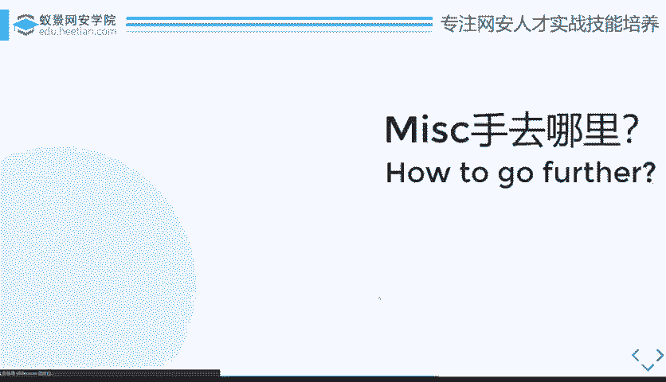
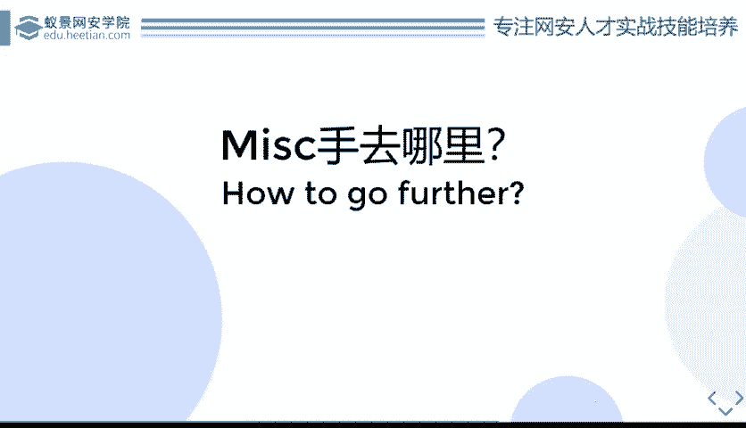
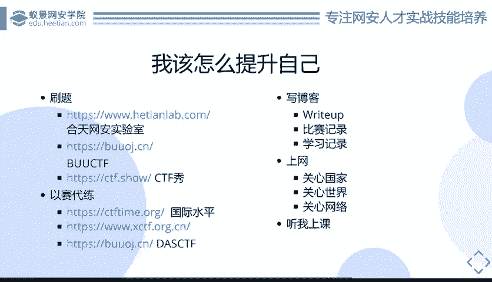
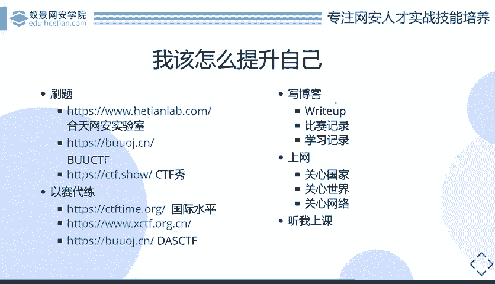

# B站最系统的护网行动红蓝攻防教程，掌握护网必备技能：应急响应／web安全／渗透测试／网络安全／信息安全 - P64：16_MISC该怎么去学习 - 跟小鱼学安全 - BV1SF411174M

就是没出手要去哪里？去哪里？这个问题其实说近和说远都可都有两种说法吧。近的话就是说我现在我能干什么，我能去如何提升自己。我想做一个好的m时候，我该如何努力？远的话就是。我我现在miss已经很牛逼了。

我该如何走下一步，或者说我已经我我我CTF已经毕业了。我现在我想去找一些实际的工作，我之前的比赛经历，我能干什么用？所以说这种go further是它是一个双重意义的。那么其首先近的来看。

对于学me来说，我们该往往哪个方向走，或者说是我们怎么去。

进步怎么去学习？

首先就是刷题。有不管什么方向，你不管去问谁也好，你都是要刷题，对吧？你要去找一个网上找一个好点的平台。因为你想CTF打这么多年了，国内外国内国内国外出现的更早，国内也打了好几年了，这么多题目，对吧？

你如果说真的能把从CTF开始到现在为止，所有出现的miss题目全部做一遍。那我相信。你也你就是我相信你的水平可能顶了他了10个我了，对吧？这个是这个是毋庸置疑的，所以说刷题肯定是很有用的。

它不光可以给你增加思路。因为其因为其实我们都说过，我们刚刚都说过嘛，mask其实就是拼了一个脑洞思路，或者说拼你的知识面积累。如果说你当时正好哎遇到一个新的题目，正好和你某天某年某月做的题目，哎，类似。

那么恭喜你你就可以借鉴一下，对吧？就是说刷题是个比较好的。比较好的练习方式。呃，下面就是几个好的刷题网站嘛，比如说和天的。他们的和田lab你可以去看一看。

然后还有就是1个BUUBUU这的话是我们的小赵赵金同学啊，呃，他现在在隔壁对吧？然后的话他亲自组建了1个CTF平台，然后的话永久免费啊，大家可以去试试。然后还有就是CTF秀，但是CTF秀现在。要钱啦。

你没钱的话，做不了题目，对吧？然后。当然以上就是我个人观点而已，就是我就是。😊，不针对不针对不针对不针对CTF秀啊，就是其实上面的外部题目，有一些题目质量还是不是很好吧，就是可能是偏向套娃那种。

就是大家做的时候，可能是大家尽量去找一些可能是一些实际的比赛的题目。实际的赛题。比如说是那种什么王顶杯的呀，或者说是一些抢网杯的呀，就是一些国内大型赛事的历年的赛事题目做做，会比较参考价值。😊。

就举个很简单的例子。就是有一道题目叫做随便住。这道题目是C口注入，这当然这是外部方向的，就是我们只是拿过来借用一下。这道题目是外部方向里面C口注入最经典最经典的题目。😊。

就是我们之前队伍招新人的时候要面试。如果说他是外部方向的，我们进来第一个问题就是随便住你有几种姿势，你会几种姿势，大概列一列。所以说可见这些题目是有多经典。当然这些日刷题，你也可以去以赛代练。

比如说如果说你想要接轨国际。对吧作为一个国际高水平人才，那你可以去CTFtime上面看CTFtime上面，几乎每个每个礼拜都有比赛，你可以每天打每天打，每天打打不出样的，一直有比赛可以打。

当然你的精力肯定是够不上的对吧？😊，而且国外的比赛和国内比赛其实方向就是研究方向，就是因为他们本身安全研究方向就是有差别的。所以说他们比赛的专注方向也是有也是不一样的。

所以说呃可能国际赛的话呃可以用来给你拓宽思路。对miss同学来说很好，因为。因为拓宽思路。因为拓宽思路的话，就是本身就是对me有很大的帮助嘛，可能以后甚至会有一些出现了什么情况。

就是你做着做着发现某一场比赛的某个题目是国外某个比赛的原题。然后出题的人原封不动给他搬过来了。对吧这种情况呃，我们不能批判出题什么东西，对吧？呃，毕竟大家都是要吃饭的。

然后的话但是我们还是可以心里默默默念一下好业，然后去把国外那道题目的异差批搬过来。😊，然后还有就是大CTF吧。呃，反正今年就是他因为就是找一些可能是像叉哦还有叉CTF叉CTF的话也是跟大s一样。

它是一个月赛的形式，就是或者说是每个月或者是每隔一段时间都会有一个固定的比赛。而且这些比赛的话，其实呃叉CTF和大CTF难度可能还是较高的。就是可能大家以入门的水平可能是不大好做的。

建议大家就是学完之后，可能是把呃刷了可能要半年题目的样子，可能才能去稍微做一做这种比赛真题。但是其实你做不出来的话，也没什么关系，对吧？😡，首先你可以去。就当见一见，就是不管你做的出来，做不出来。

你首先必须要去做。就是你至少至少你要看过这个题目，你把这个题目从头尾分析过一遍，然后不会做。那没关系，我们可以赛后等别的大佬的rite up，对吧？rite up的话就是呃刚相当于赛题总结嘛。

你可以对着rightite up去学习，你也可以说是去。😊，自己写一些rite up，这就是我们下面说的一个点，就是要去写博客。写博客是为了什么？就是写rite up。当然不仅是写rite up了。

还有一些你的比赛的一些心得感悟记录，就是一些比如说工具记录啊之类的，还有就是一些学习记录。😊，这个点其实对于miss特手来说非常重要。就是因为我们知道就是还是那句话，还有很多就是知识点的积累。

但是miss特手的知识点是很散的，你不可能会说有一个系统性的框架，给你把所有的点全部塞在里面。所以说你只能去一点点给自己罗列下来，积累下来。那么这个时候你不可能拿个小本本给它记下来，对吧？

而且现在互联网这么发吧，大家我相信大家都一定是会用电脑的对吧？大家一定都会建个网站的这个你去随便去拿个阿里云也好，那个叫腾讯云也好，买个120年的学生主机。😊，然后随便在网上搭个word price。

或者说你没钱的话，你直接去用gitub，然后去用那个hexel也可以，都可以写个搭个博客，然后把所有的日志，或者说是把所有的比赛的做题记录right up抛上去。给自己一个参考，当然也是给别人个参考。

对吧？造福自己，造福大家。😊，所以说这个也是很重要的一点，就是。不光是打比赛的时候要写right up做题的时候也要写right up。做不出来没关系，你可以去看前辈的rap up。

但是看完right up之后一定要注意一点，就是别人写的rap up永远是别人的，而不是你自己的。看完之后把它rap up扔掉，你自己再去做一遍，然后再写一遍你自己的rap up。😊。

然后把它拖到你自己的博客上，这才是消化了。这个东西其实我相信大家。呃，从小学开始到初中高中大学，这种大家肯定都听了不知道多少遍了，我这里也就不念叨了，对吧？学习方法这种大家大家心里都有数，对吧？

还有就是最后一点，可能是mix手， mix对mix手来说比较重要的原因就是上网。我们要关心国家，关心世界，关心网络，关心各种大事。比如说。之前王晓云院士王晓云院士MD5碰撞，对吧？你碰撞出来之后。

你他有那种技术之后，没过多久就马上出来了m的碰撞的题。比如说之前阿帕奇。呃，点49和点50有两个漏洞，那马上啪就有人出了阿帕奇的题。然后包括是所以说这种提这种这种网上的一些大新闻。

包括是一些安全界的要文，大家都可以去关注一下。就是很可能就是最近出现的题目会有相关的类似的考点出现，对吧？所以说你也是也是相当于是一种你学习的途径嘛。因为你很多时候可能光靠刷题，光靠去比赛。

是这种被动性的消化就是。拿到知识之后，出题人消化了一遍，把它转化成了题目。然后你再对着题目再重新消化一遍。这种其实不是一种很有效的学习途径，最有效的学习途径就是你直直接自己去找到这个知识，然后去学习。

😡，所以说这是其实比较重要的一点就是你自己都要去学会去搜集一些信息，然后去。学习。然后还有最后一点，当然最重要点就是你可以来参加我们的这个课程，对吧？听我上课我们会当然不光我还有我们的赵老师。

小赵同学啊，另外一个小另外一个赵老师，另外一个小赵同学。😊，呃，你也可以听他，对吧？听我们去讲一讲一些可能是呃m里面比较基础的，或者说是一些套路性的东西。当然这些东西就是虽然说可能。

可能并没并并不是说能够你听完之后完全可以就直接可以去一人独打叉CTF了，而不也不是说是你就AKm了，但是肯定是对你对你的整个整体水平整体水平的提升有很大帮助。

