# B站最系统的护网行动红蓝攻防教程，掌握护网必备技能：应急响应／web安全／渗透测试／网络安全／信息安全 - P66：18_基础之需要的工具 - 跟小鱼学安全 - BV1SF411174M

呃，对于流量分析，你需要去掌握的一些基础知识。呃，因为并不是说是流量分析，你拿来就要可以做的，可能会需要你有一定的计算机网络基础。比如说或者说是有一些通信协议的基础。这些基础的话，呃。

我们这边会稍微讲一讲。当然如果说你要深入学习的话。计算机网络一本书好后的对吧？呃，你要学的话，其实学起来也挺挺挺久的，所以说要靠你自己去，可能要去课后去做一做。呃，然后我们就继续。就是首先你需要的话。

你需要什么东西，就是这个课程，你可能需要准备一些东西嘛。呃，但是因为这个课程是量量分析，它相对来说是呃对于平台的一个。对于平台的一个依赖不是很高吧。因为我们的工具，其实比如说我们最主要的工具玩 sha。

或者说是我们用的一些。呃，用的一些比如说脚本工具啊，Tsha或者说是PIsha之类的，它可能在全面大家都通用。所以说嗯最好是用windows或者是linux。

最好的话是配置一个windows加1个WSL的环境，对吧？呃，这个环境配置的话，我们我们这边就不细讲了，对吧？呃，这个大家可以自己回去课后，或者说是自己回去呃，当虚拟机也好，都可以。

就是反正只要你是最好是基础是windows环境，然后有个lininux虚拟机，或者说你mac的话装有虚拟机也可以，对吧？都是可以的。

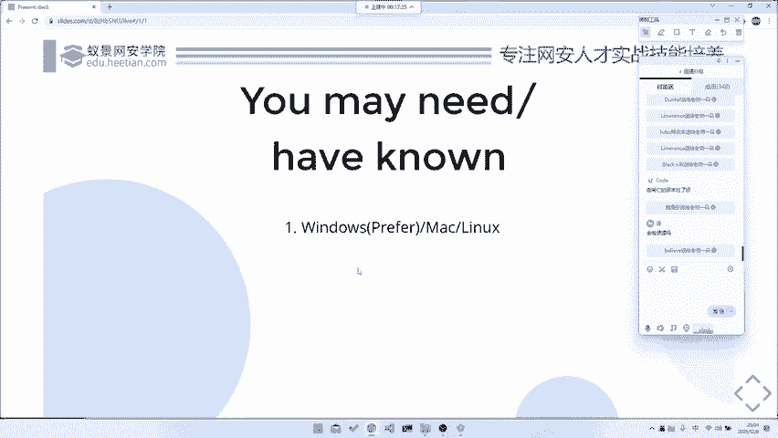

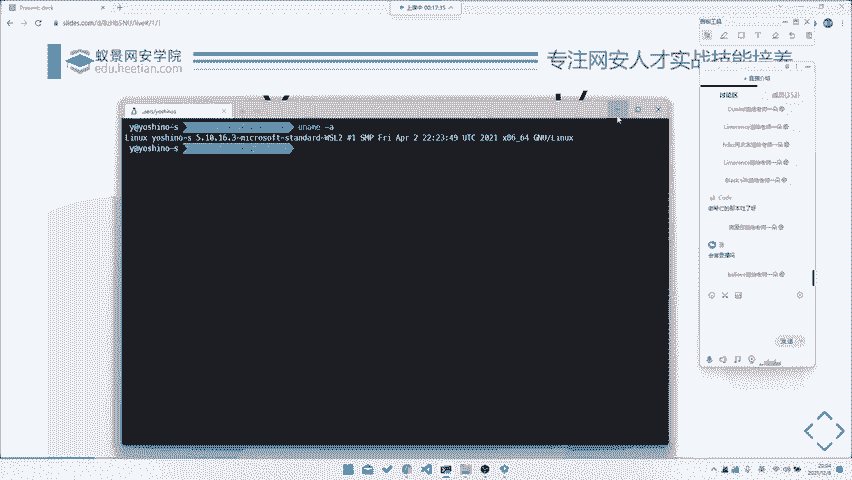

然后话呢就是。流量分析就是。就主要讲一讲流量分析。因为我们这个课程本身是CTFm。但其实的话呃到最后我们其实还是要上升到一个最终的一个安网络安全的部分。所以说我们会我们在这里稍微提一提。

就是这个CTFm中这一块流量分析，它最终会上升到或者说它最终的一个发展方向是什么，对吧？就是呃其实流量分析在国内，就是我们跟其实我们之前如果说大家有听过第一节课的话，其实就是最开始那节课。

就是一个m入门介绍的话，其实大家都听过，就是。国内的misask分类是很散的，或者说它是一个很乱的，就是很多种类都会放在mask里面。所以它叫杂项嘛。但是国外的话嗯在就是对于这个流量分析的话。

一般来就是放在两个上面，一个就是一个取证，对吧？你对于流量的一个取证，或者说是你对于流量的一个分析，一般来是这两个方向。然后的话就是未来的话，如果说对流量分析，你可以去做什么什么样的进阶发展的。

首先你可以去做这种EDR或者说是这种流量统计流量技数。比如说是呃这道题目就是如果说。之前大家有看过，就是这个比赛的话，就是之前哔哩哔哩 one的1024的那个就是它最后一道题目。但是这个题目。呃。

不做评价，好吧，no comment就是这个题目没有没有正确答案。就是因为他最后答案少给了一个是16个正确答，他其实就15个。然后的话所有能刷到100分的，其实都是通过bug找出来的。这个我们就不谈了。

你看像他这种，他给了大概是当时给了几万条数据吧。然后的话他的目标是让你从几万条数据里面去找到。呃，一些异常的请求。那么其实最后你到了工作中，或者说你去到了流量流量流量分析，到了最终的一个实践中的运用。

其实有有部分就是这样子的，就是。用来做这种。啊，就是异常流量检测，比如说去就是看这种攻击流量啊，或者说是看爬虫啊，对吧？都是有可能的。所以说这个是它的一种利用，就是你去看大量的流量。

然后去做这种大快大规模的流量6式分析。是流量取证的，可能是一个方向。第二个方向的话就是取证。取证的话就是。比如说像中间人攻击，或者说是比如说协助警察室办案这种，或者说是这种对吧？就是。

就是你去抓取一些犯罪嫌疑人的一些访问记录，或者说是一些。有网络记录，然后通过他去对犯罪嫌疑人的一些行为举动进行分析，对吧？这也是有可能的。当然最后一种的话就是。逆向协逆向啊，不是。

就是流量分析在其他部分的一个利用，就是一个逆向逆向协议逆向。因为协议的话，当然我们能从直接从。就是应用本身去静态分析它的协议包构成。那当然我们也可以通过中间去抓包，抓完包之后，通过包的辅助。

就是现有包的辅助对它进行一个分析。然后来协助我们对于一个协议的逆向，对吧？这是一个当然也是个最后的方案，然后的话这就是我们m中流量取证这一部分最终的一个发展方向。所以说大家可能暂时现阶段我们是去专注于。

做一个流量，就是对于某一个流量特定的一个分析，特定在某一个文件包里面。对吧但是的话其实到最后的话，我们是要针对大规模大规模流量，甚至是实时的流量，就是每一秒几十个G的那种做那种分析。

所以说我们现在只是学它的一些技巧，最后的话才有可能上升到一个我们说做所所谓的批量。当然，批量的这种利用的话，在有些题目中也是可以出现的。比如说我们之前的那个叫最近的1个NECTF。

它里面就是有一个测心道，就是他给了一个他给了一个胖极的所有流量。然后让你从这个流量里面，它其实相当于是个盲助一样的，它里面有很多的ci code，然后呢要你去批量去把sh code提取出来，然后去跑。

然后去str获者它的一个最终的flag，对吧？那个题目相对来说比较难。但是的话其实也是印证了就是。我们最终可能流量分析的发展方向就是去做种大规模的数据分析。大数据大数据嘛。

其实对我们流量分析和大数据还是有一定关系的。这个就是一个流量分析的基础。好吧，那我们就开始我们的正经的部分，就是一个第一部分就是一个工具，对吧？工具的话，我们首先需要讲一讲我们的流量分析神器玩要。

就刚刚有有听到了嘛，就是Yl check一把书，对你大部分题目都是可以用Ylsh做出来的。看左边就是Yl check的介绍。呃。

什么is the world foremost and widely used network protocol analyze，对吧？它非常牛逼。😊，他举世闻名，就是他可以分析很多很多种协议。

比如说正常的HKDPTCPIPOSI网络系测模型都可以分析。那再高级一点，比如说它可以分析公共协议，它都可以。比如说是那种model bus啊，SCcom啊，或者说它甚至是做一些iphone C的操作。

它也是可以的。还有包括是可能蓝牙呀，802。11协议书上都可以做分析，包括甚至是有一些。你装了插件之后，它可以装，它可以去监测，它可以去解分析一些USB的协议都是可以的。所以它非常强大呃。

它可以用来动态抓包。呃，比如说我们直接这个东西下载的话，其实都。呃，大家直接去百度百度或者是谷歌搜就可以了。就很简单，就在这里。然后安装的话，你去。找你要的版本，然后去装就行了。

这个安装这部分我们就不讲了，对吧？然后我们就直接讲它这样一个应用。应用的话，其实你还可以去做这些流量包的分析，你也可以去做这种实时的捕货。比如说我这边连的是wifi，那我们直接去抓这个包。

他可以让他所有的所有的协议，你看OSCQOSCQ是什么？OSCQ就是QQ我们看一下我的QQ还挂着吗？😊，哦，我的QQ不挂着，它是那个好像是那个叫那个腾讯课堂的协议，也是做的YCQ协议，对吧？

包括是这种TCP的，包括是这种，他都可以抓到。所以说它是非常全的。😊，呃，包括我们还可能还能抓到一些。对，都是可以的。比如说MMDSMDDNS这种都是可以的。

如果说你去抓了那个叫你去用那个叫修探网卡的话，他甚至可以直接去抓我们局就是。onL的就是所有的空中的信息，你可以去FTPdataFTP也可以。对。哦。

我们之后可能会就是之后可能会有甚至会有FTP的这种例题。可以的。甚至你以后装的那种数探网卡，它可以直接去抓一个那个叫以太网，就是去抓那个叫WPA2就是。所有的无线网的包抓了无线网的包之后。

你可以去拿来做本地的一些密码包破，对吧？这些都是如果说大家就是如果说大家学校里面会有那种就是。无线网络安全课的话，一般来这都是很入门很基础的。第一节课给老师给大家展示的就如何去用。

我要 sha去做一些这种流量招包。然后对跑字典这种。那这种我们关掉了，不补货了。

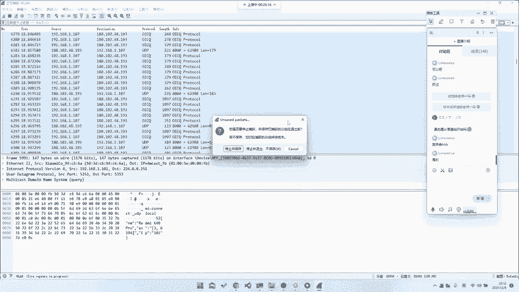

然后话呢，当然我们去。呃，这个Y只是一个最基础的工具了，你可它会有一个图形界面，所以说它可能比较我们的它可能比较好用。然后的话对于初学者来说也比较友好。如果说你可能需要去做一些后续的一些分析。

比如说你要去给它导入pyython啊，或者说是去做一些嗯。或者说去对他进行后续的分析。那可能Y下果就不是很。因为它毕竟是重新界面，它没法直接进行一个数据导出，或者说数据导出很麻烦嘛。

所以说我们后面可能会用到一些T sharkT shark的话，它就是一个。直接如果说你是deb或者是那个叫。那个叫什么呃，物邦图的话，你就可以直接问APPinstore shop就可以了。

对吧这个我们就不演示了，这边应该是装好了的。

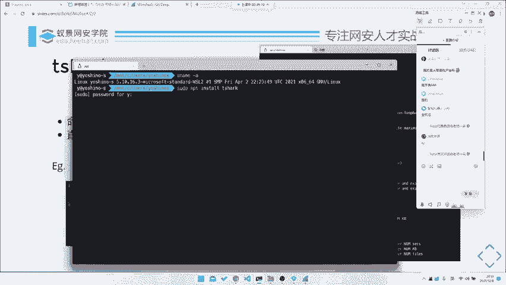

嗯嗯哎老。对吧装好了的Tsha是什么呢？它就是一个命令行版的w要sha，它也可以在命令行里面抓包，对吧？它也可以在命令行里面通过我们的一些呃一些。

比如说是这种呃指一些这种条件去给它控制它抓出来的是一个什么包，然后做些过滤。比如说我们这边有一个最最最最简单的一个例题。就在这儿。呃，这个例题就是非常简单了，就是。😊。

他的目标是要你去找到一个就找就是找到一个请，就是登录包，登录包的密码，就是flag是第一步。那我们最开始我们可以怎么做，就是手翻手动翻，一打开Y下课，你直接打开。

这儿就有user action log in。do log in追踪流这个操作的话，大家可以自己去熟悉一下嘛。比如说就是有这种。右急去追踪流，去可以去把这个TCP流HTP追踪出来。对，开裂是自带的。呃。

比如说你也可以直接去在这里去导出对象，去导出个HTTP对象。这些实际操作的话，我们后面用到的话都会都会直接带着讲的。就是基本上你只要操作一遍，跟着我操作一遍，你基本上就可以记住这些操作。

所以说也没有什么嗯，不需要特别提什么。或者说你这边还有一些做分析工具，比如说是去分析一个。😊，我可以去做补货，然后去做统啊统计。比如说。就是你他可以去看这种所有统计的数据，这种都是可以看的。

其实蛙下还是很强大。比如说这个包我们去右击追踪流HTTP流。

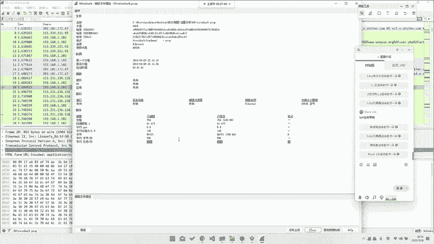

哎，看到看这里它就会有。email等于flag， passwordsword等于这个东西。那么这个东西就是我们的flag，对吧？那么这里就很这里就很简单，就你只需要去右击追踪流就可以了。

当然这是玩要sha的用法，我们也可以直接在这边导出也可以啊，这边我们就不演示了。当然你我们也可以去用T sharp去做，那我们T sha怎么做呢？我们先给它切换到那个目录去。😊。

比如说我们这个文件是00Y1下。PC这个包对吧？然后PC capture。那我们直接去用T shockrk打开它杠N2。呃，00档。这个东西过滤过滤是这个这东西就是什么？这东西就是过滤。

这东西过滤呢更在我们。😡，这个叫做呃YR check里面在这里。😊，其实你刚刚看到我们在这个追踪包的时候。追踪流HTTP流，它已经自动给我们填入了一个过滤，是TCP电stream。等于EQ2就是什么呢？

就是。TCP第二个流是就是我们这个包。那当然我们也可以用其他的过滤了。比如说HTTP它这边是会自动提示的。你看HTTP点它就可以出现它所有的字段。比如说我们这里要过滤的是所有的有请求URL的字段。😊。

就是像这种有get user，或者说是这种post user这种对吧？那我们直接去request for uRI这一条。他就把所有的请求过滤过滤出来了。那我们再根据题目的意思，我们要去找登录。

那我们在这里看有登录action log in do log in。你把它导入导出出来就可以了。那命令行里面也是一样的，你就在这边去填，这个是用来选择文件。呃。

HTTP content flags也可以，但是有的时候flag，比如说它不是铭文。或者说是嗯。或者说是flag或是它被C6色，对吧？或者所以说这种东西。我们之后会讲到一些解题技巧。

可能就会提到如何去快速的找到flag。到是我们这里就只是先演示一下，在命令行里面的话，就是杠Y是去给它apply一个。我们的一个过滤器，比如说这也就是HTTP的request点 forUI。

然后啊后面就是用来导出我们的一个包。比如说我们这里去给它导出一个字段。哎，稍等一下。比如说我们这里去导出的字段叫做杠。杠什么来着？杠T。Field。F IE， L DS， S。

然后的话他他要他告诉你要指定一个杠E。杠E的话呢就是我们的一个。比如说我们这己就杠E，然后去给他。其实我们这边直接杠jason就可以了。这杠锥层，你会发现他就把整个请求体全部打出来了，对吧？

那我们请求体其实我们不需要这么多，对吧？我们只需要一个这个东西就是。在这里有1个HTTP杠Tfields。field的话，它就是会指定去导出你的一个指定字段。

比如说我们这里去导出1个HTTP点fielda。看还有直接把我们的所有的一个再一个在这句话的命令是什么意思？

就是在所有拥有一个叫做HTTB的request点 for uRI就是所有的请求字段中去提取出我们的一个fiel data，就是在post请求里面就是我们的post，这这个body，对吧？

所以说就把这条机导出来了。那我们这条就是正好是我们的密码，所以说你可以用这条命令一键导出也是可以的。

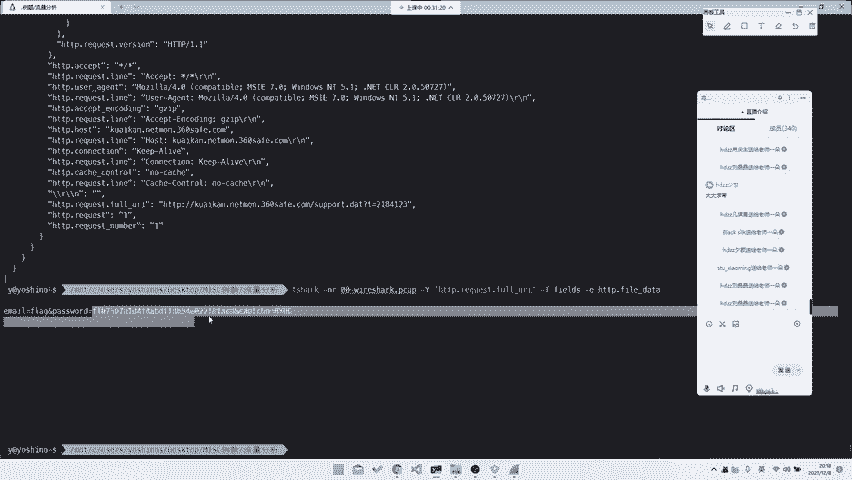

那当然了，我们也可以像我们刚刚那样去给它一条一条追踪。如果说一条条最踪的话，我们可以去用什么？我们可以去换一个命，就是去用这个东西。

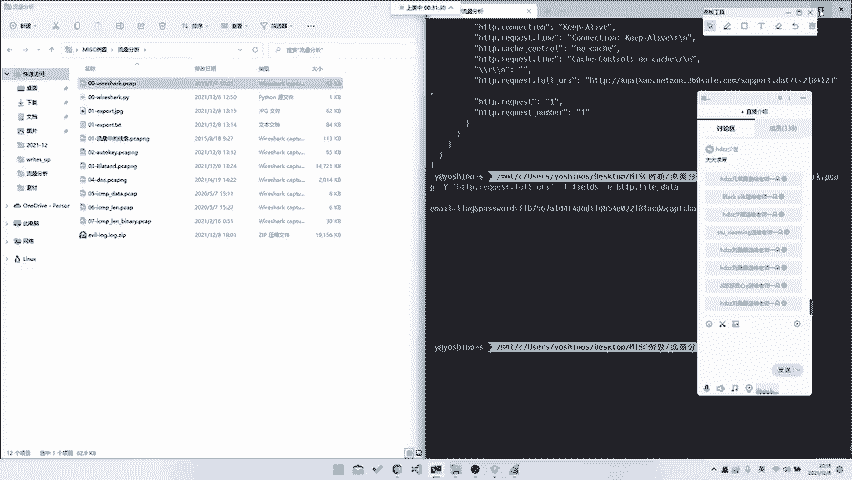

前面过滤也是一样的对吧？我们就用这个。杠Q是用来给它把原来的输出去掉，杠子也就是去使用某一个流的过滤。比如说我们这边就是过。呃，去follow某个流，然后是HDDP用HTP就是在这我们这边有一个。

像我们这边的就是追踪流HTTP流ask就是输出模式为ask模式，然后后面就是流就是那个叫stream，就是编号。比如说这是第一个包。这是第二个包。这是第三个包，对吧？

那也是可以一个个导出来的那我们去可以去找在导出来的包里面一个个去找有没有我们的一个登录。对，都是可以的。比如说这是第一个包，没有。这是第二个包，我们看一眼。第二包有点大，因为它在一次TCP连接中。

他去发起了好几次请求，在这边有就有了，对吧？也是一样的。所以说这东西其实都是一个嗯。所以这东西其实就是你去不管去用UI也好，UR就是GURZ也好，你去用这种命令行列也好，都是可以去导出来的。

只不过就是看你哪种方式顺手或者说。之后我们就会之后我们后面两天会看到一些例题，就是它不得不用这种方式去导出。然后因为我们要对它进行后续操作嘛。当然这是一种T shark的模式。

就是你去用这种命令行模式去导出。那么再往后的话，我们也可以用第三种方式就是。P完下。Q下的话就是一个python的包。呃，这东西因为我们m选m选手嘛。

其实我觉得大家应该都对至少需要对pyython有一定的基础。呃，PYENVE嗯global我们去换个版本。system。比如说我们这边去import PY sha。

但是PY shock它的1个API写的不是很好看，所以说它有一些东西你可能操作起来没那么直观，可能你还是需要去用T shock配合python去做一些处理。比如还有PY sha，他就告诉你他就是一个包。

它这个包里面有很多东西。比如说我们还是对针对刚刚那个题，导出这个题目，我们去写一个这样的脚本，这要本我已经提前写好了。啊，不在这儿，稍等一下。就是你去用PYsha包去写这样一个脚本。在这里。

对吧那我们就可以直他去。那我们pyython的话，我相信在python基础我们这边就不多赘述了。因为如果说还要这讲python基础的话，这边就时间太久了，浪费时间了。

那我们这边python就是他直前去用py里面的fi capture去打开了这个文件，然后去displayflatters HTP点file data。然后对于每个包里面直接输出这东西，那我们直接跑一下。

他就可以直接把所有东西都输出了，人就会看到这样能传东西，对吧？那这东西其实嗯。就是python基很基础的很基础的一串python而已。呃，这东西的话就是当然你后面不可能会说是直接这么简单了。

就是直接输出来就可以。你可能还是需要去做一些后续的处理分析。所以说python这一块的话，我觉得大家可能还是需要去稍微加强一下。因为。啊，我们这一整个课程系列其实m课程嘛。

所以说这就是所以说大家可能后面会用到更多的python，也可能后面去做一些嗯。很多东题都会用到pyython，就是很多脚本，包括是同样处理。对，比如说后面会做到一些图片相关的题目，你可能需要。

大量大量大量的去使用python写一些我们的处理脚本。呃，在流量里面，python的处理其实相对来说比较简单的还是。呃，所以说这就是一个拍下，当然拍下海还有很多API，你直接去help。

或者说你去用这种可以再自动补全的都可以。嗯，但是它自动股权写的不是很好，你看packet它是可以识别出来，然后反HTP发data就识别不了了就是。它的类型写的不是很全。

所以说因为本来python的类型就是盘了pyython的类型的这种lining，它也是一个后续知持的，所以它做的也不是很好，对吧？所以这部分的话我们就呃也只能这样子就是。

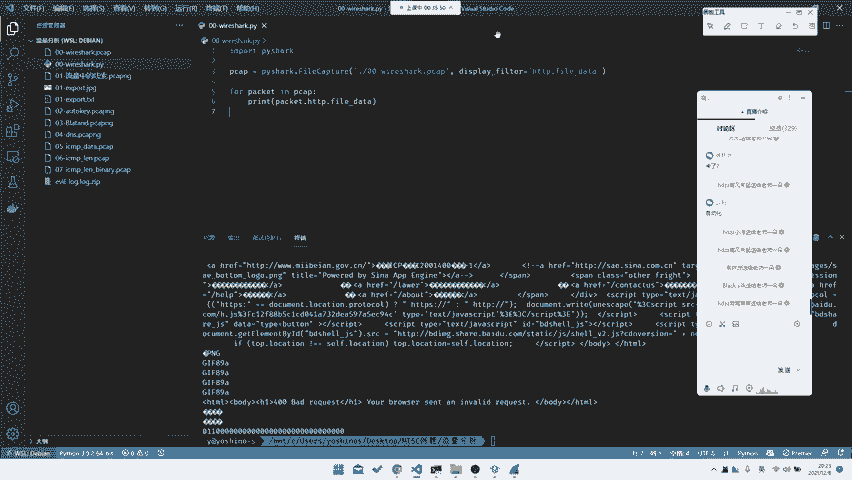

一般来的话，我们推荐就是开局，就是使用pifiY sha，你去看一些大体分析。然后后面的话你再去给它落地到一个T sha，或者说是做一些拍 sha的分析，对吧？是这样子的。

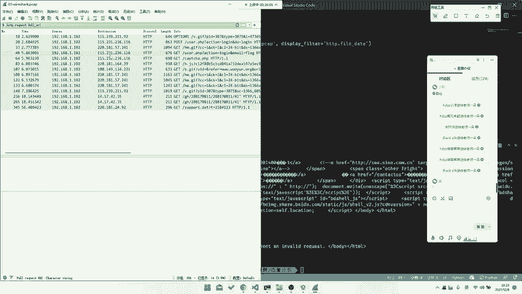

然后的话当然这个是一个工具啊，就是我们的。那个叫Y sha系列。当然除了YR sha，我们还是有其他工具的。比如说我们国产的柯莱网络分析系统，但是的话它其实。

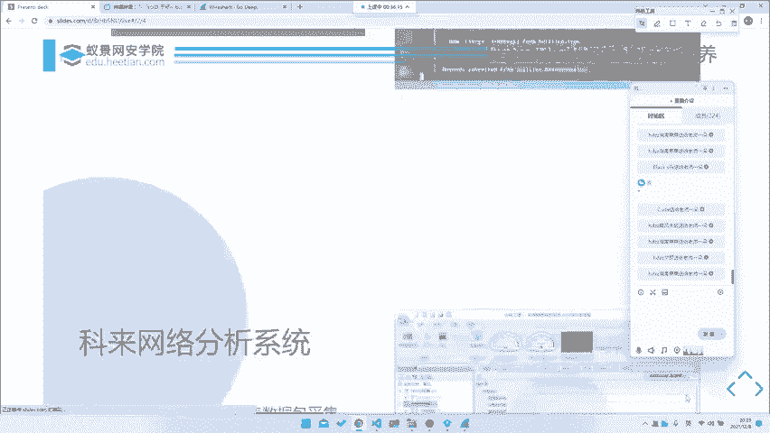

主要还是专注于一种像我们刚刚说的这种。🎼就是。他其实也是跟那他也是也是可以抓的嘛。但是的话它其实主要是趋向于我们前面这种做流量统计。

就是之前就是比如说有道题目是那什么大数据还是什么的，那道题目就是需要你分析出请求次数最多的1个IP地址。那你用那个叫我们的一个，或者说是你去找，他要你找一些异常包。你熊猫下可其实也是可以做的。

但是就是你可能需要去手动做一些处理啊，或者说过滤啊，看来的话它是可以去一键帮你去给它做出这种。就是所有的这种统计都是可以做的。呃，这块的话我们就。呃，就随便看一看吧，就是我们也不做一个。

因为主要其实我们大部分题目可能还是主要趋向于。呃，你看他就这边就可以做出，他可以看到所有的一个。统计流量，包括是所有的都可以，对吧？它它可以实时更新，当然你也可以去用这种回放的，也可以。

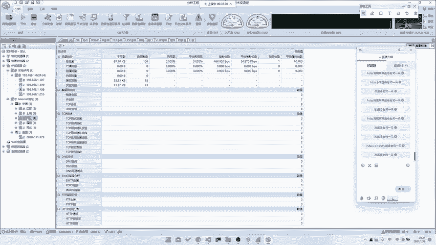

包括是所有的绘画呀，包括都可以。所以说这个是。呃，克莱的话其实它也是挺好用的，就是在某些情况下，但是我们大部分做题可能还是主要是靠一个。主要是靠一个那个叫什么，主要是靠我们的一个Y下，Y用的比较多。

所以说我们最近可就是这两天可能还是主要专注于Y下。然后的话我们再往后走。