# B站最系统的护网行动红蓝攻防教程，掌握护网必备技能：应急响应／web安全／渗透测试／网络安全／信息安全 - P6：蓝队应急响应-5.准备阶段 - 跟小鱼学安全 - BV1SF411174M

停啊，它被称为PDCERF模型。这个PDCERF呢，它就是我们这边几个英语的首字母缩写，它分别是准备检测抑制根除恢复和总结。我们要把这几个事情去做好，就能够做到在红队攻击之前进行未雨绸缪。

然后在红队攻破我们之后做到及时的应急，做到及时的溯源。好的，那我们来看一下这个。这个同学张同学说的哈，咱们挖洞和红蓝对抗是不是两个方向？其实挖洞啊呃它比较偏向于红红啊就是攻击。那攻击啊肯肯定要去挖漏洞。

不过这个红队啊站在咱们2023年来去说，其实你再去使用一些像搜狗入入啊，像去文件上传这些漏洞去攻击的话，其实效率不是特别高。所以说挖洞和红蓝对抗。😊，有区别又有关联啊，大家要有这样一个清晰的认识。

你才知道自己学啥。你如果学了一个东西啊，不能去应用它。总的来说呢，在今天一个非常需要高效率的社会呃，显显得起来你就没有这么呃高效率了，就这么说嘛。

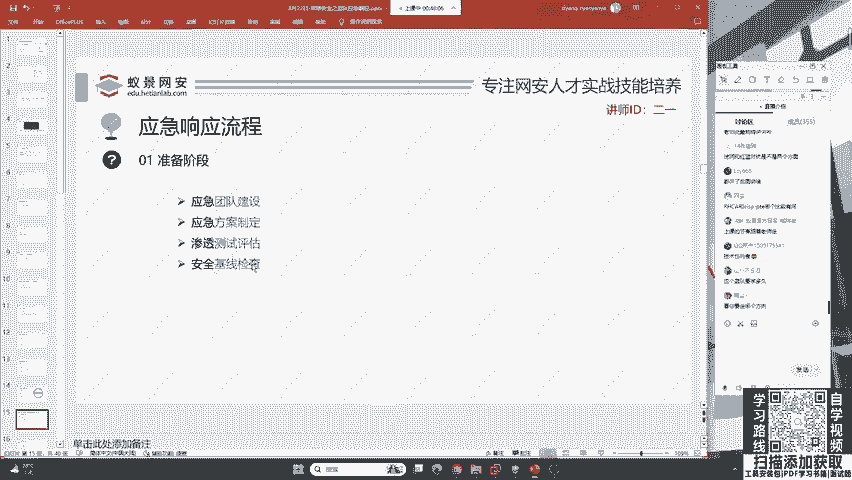

好，下面我们一起快速来看一下这个蓝队的整体流程。

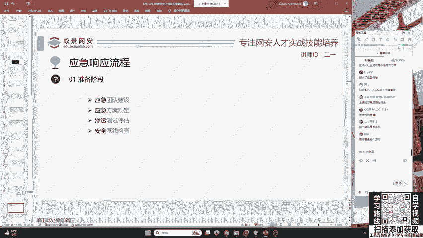

蓝队的整体流程呢，首先有这个应急的团队建设以及应急的方案制定渗透测试评估与安全基限检查。那这是一个完整的应急相应流程。那在我们这样一个准备阶段，首先团队建设呃，这一部分同学啊可能接触不到。

比如说你是大学生，那不可能将这个团队建设交给你去做吧。啊，咱们啊可能可以把它定为一个长期的目标啊，把它作为啊自己在以后达到一个蓝队高级之后应该做的团队建设的事情。不过你也有必要去学习团队建设。

因为啊这一个模型和流程的学习，是面试。

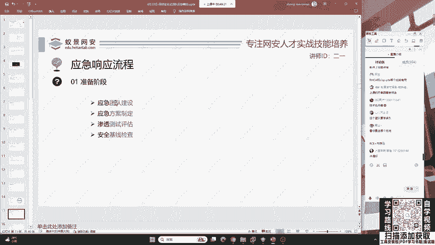

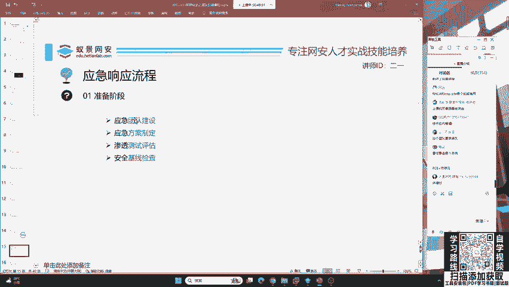

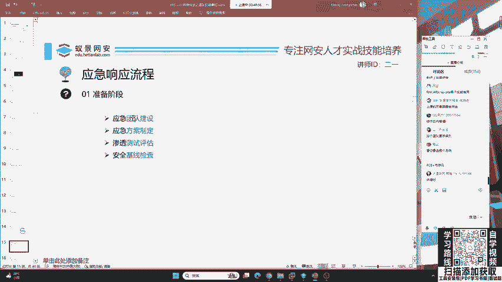

必须要问到的。其次呢就是方案制定啊，咱们不可能说呃这个红队打过来了，咱们手足无策无措。或者是啊有同学说红队打过来了，我把网线，我关电源。哎，大家想象一下，如果你作为一个防守防。

再发现自己的机器被入侵之后啪一下呃把别人企业的这个总电源给它关掉了，大家觉得呃这会有什么风险啊，这个东西是可靠的防御手段吗？

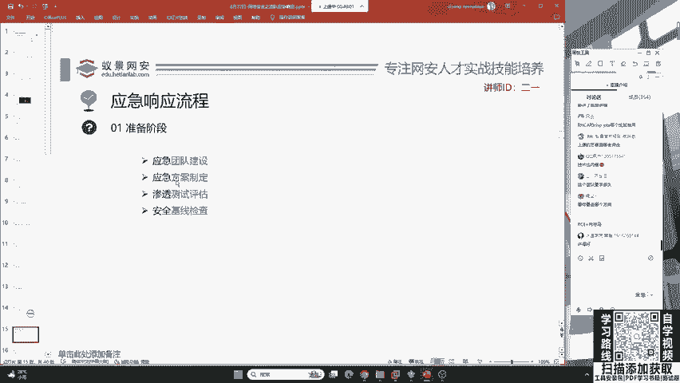

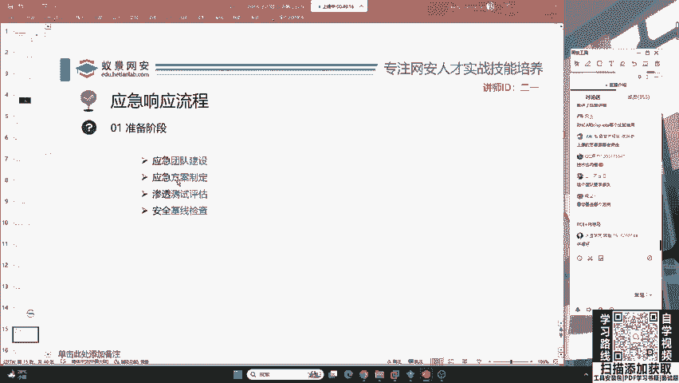

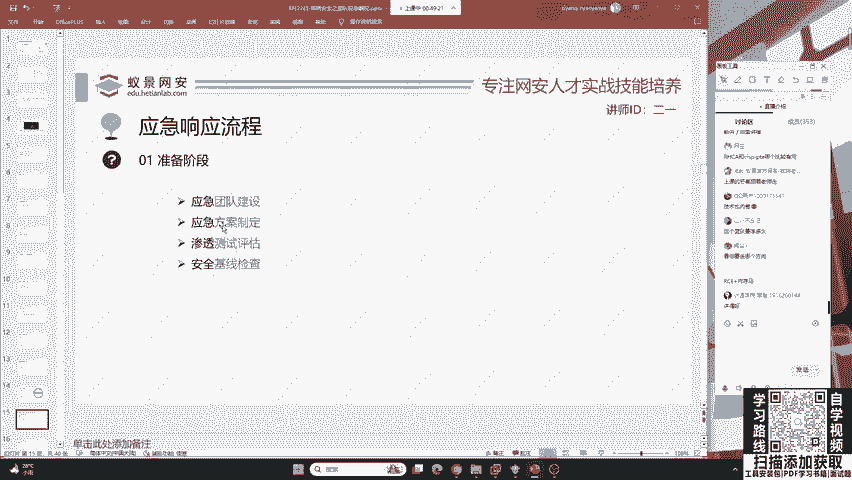

很明显不是，如果你真的这样做了，那恭喜你，你会很有可能会获得银手铐一副。就是说啊咱们在进行断电和进行封IP之前，一定要进行合理合规的去判断，你不能说上来你就去封别人的IP，万一别人是正常的用户呢。

万一别人就是故故意啊，让你去封这个IP去钓鱼你呢，是吧？大家一定要有一个方案的制定。其次呢就是说在渗透测试评估以及呢咱们的等保测评，一直都是企业安全建设必不可少的一件事情，就是说咱们在互网之前。

我先去请这些渗透测试工程师，我先打一遍，我先内部做一遍，就比如说咱们今年的国家级互网，在今年的国家级互网之前啊，其实像运营商，还有银行啊，他们。😊。

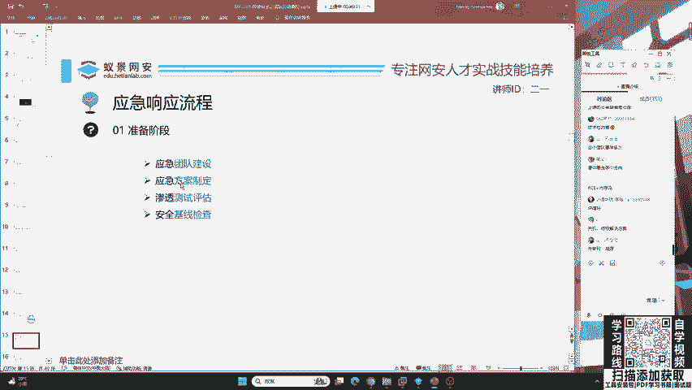

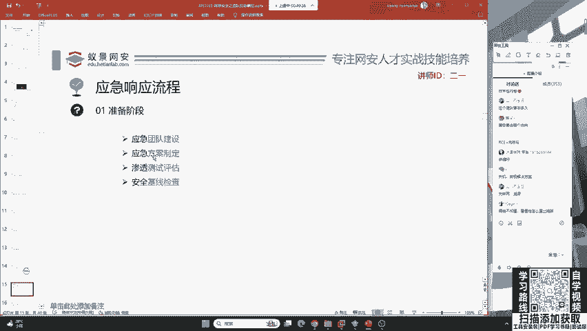

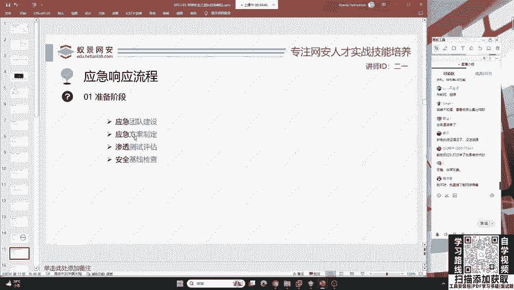

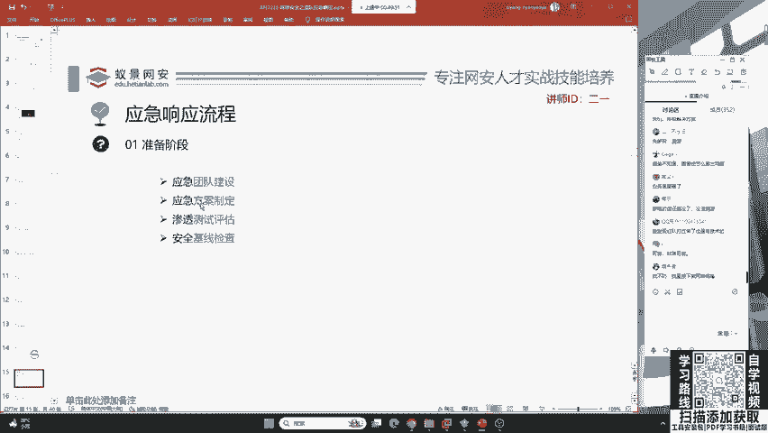

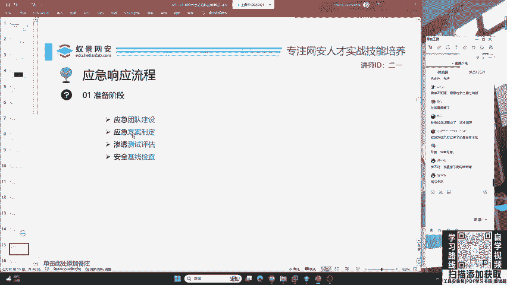

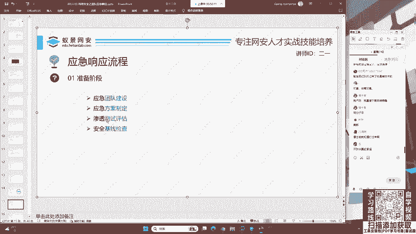

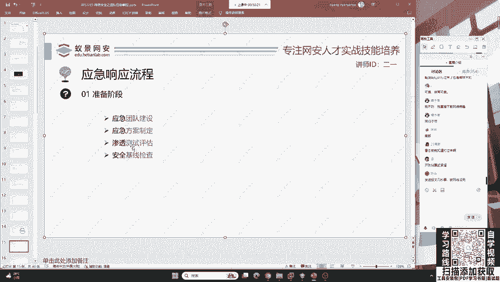

自己都做了很多遍的排查，已经非常安全了。但是你会发现，依然有企业被打穿，这是为啥呢？还是老规矩啊对抗的过程。其次呢就是安全基械检查，安全基械检查啊，就是防止我举一个简单的例子啊。

带领大家快速了解一下基线检查。就是说咱们这个比如说公司里面我有100台服务器，我要去检检查这100台服务器啊，有没有人用这个弱口令，就是有没有人用这个简单的密码。我们都怕啊。

就是说你们这个员工有的人的电脑密码，那就是123456，就123456。😊。

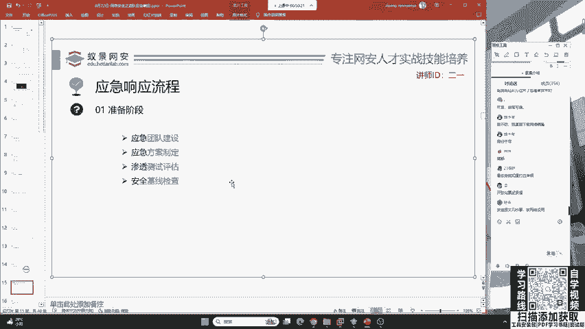

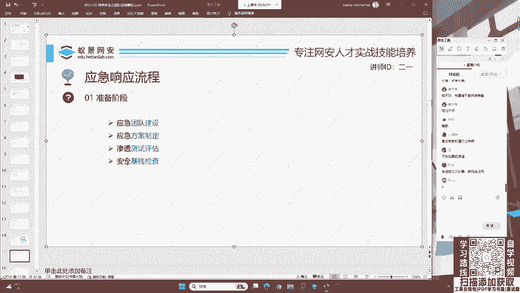

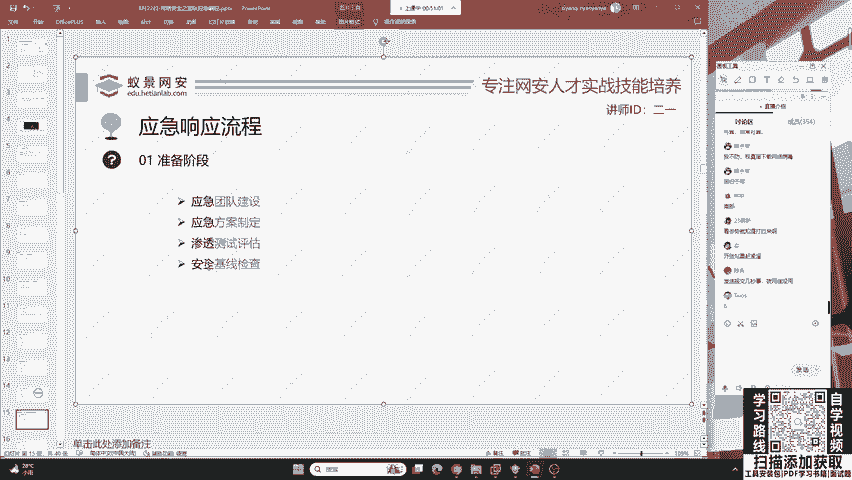

那这样的话，你一个老鼠就会坏一锅汤，这个黑客哈就会找到你这样一个软柿子，然后去捏爆你。😊。

你的123456就会导致你整个所在的局域网被黑客攻陷。所以说。

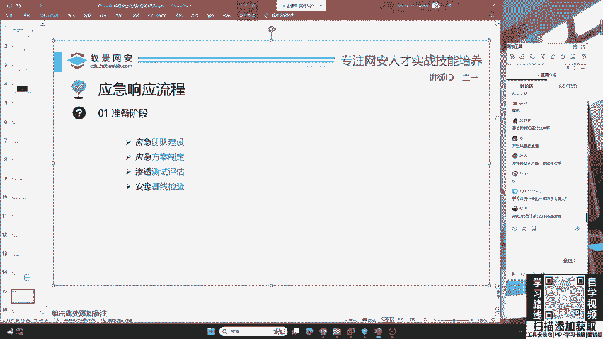

基线检查非常重要，你再去给。

用户你再去给咱们企业内部人培训。你说啊大家注意了，不要用123456，结果还是有人会用123456，那怎么办？就是我要亲自检查一遍，确保你没有用。

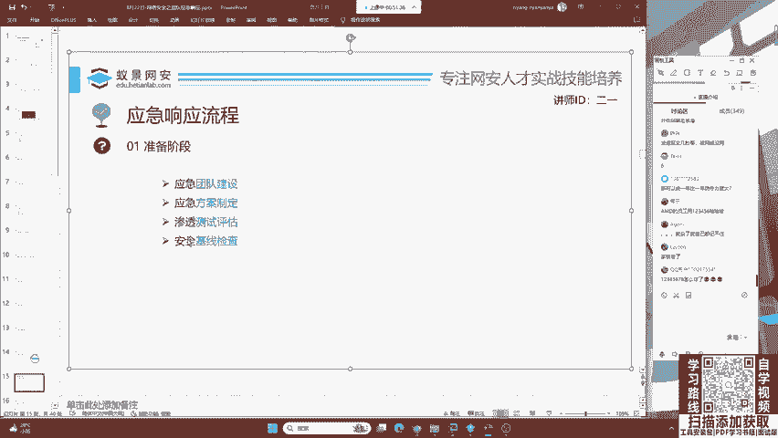

好，那这个同学说一年比一年防守力度大是这样的，因为安全的建设是一年比一年完善。那其次呢就是红队的攻击也是一年比一年猛。你不可能蓝队的进步去偷了红队的饭碗，也不可能说红队太强了，让你蓝队无法生存。

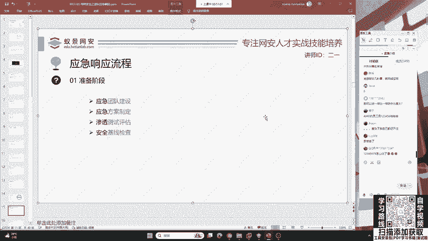

这些都不存在。好的。

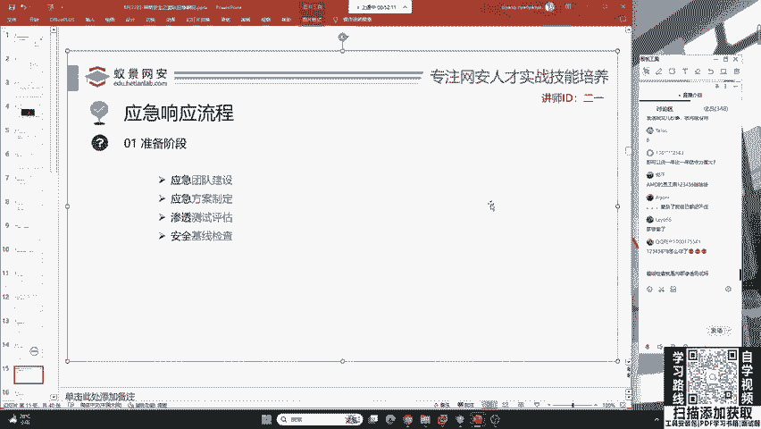

基线检查是内部渗透测试吗？并不是哈，内部渗透测试是挖漏洞。基线检查的话就是咱们登到服务器上面进行相应的密码排查啊，包括呢对服务器的一些安全配置的逐一的排查，逐一的排查。😊。

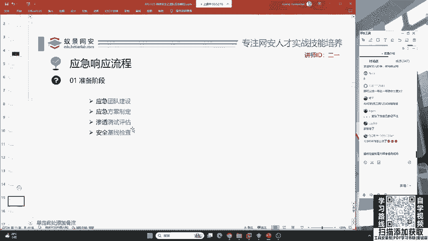

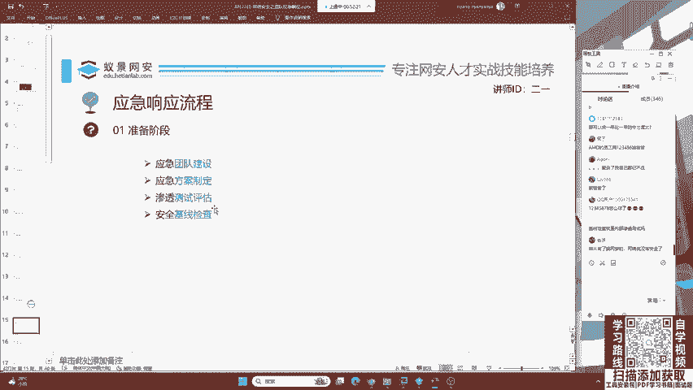

