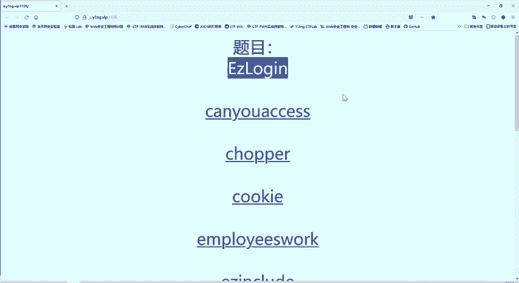
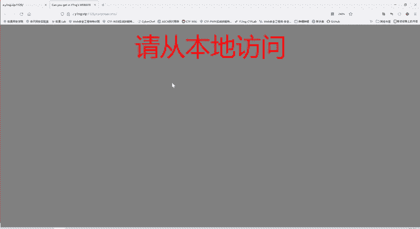
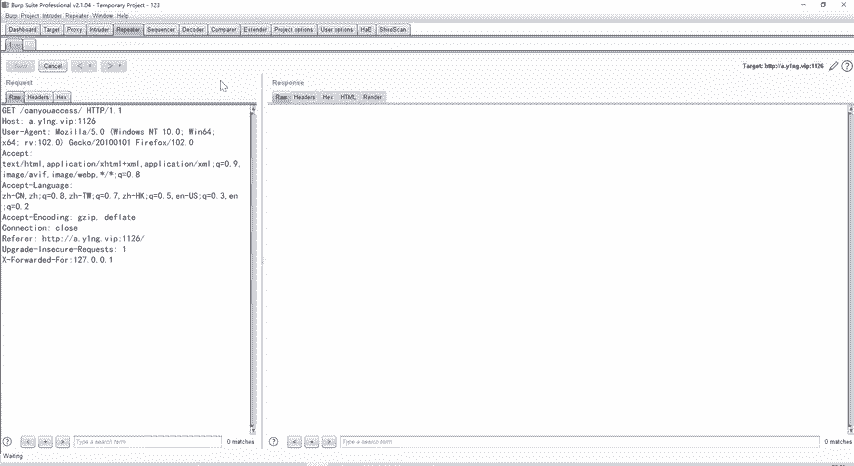
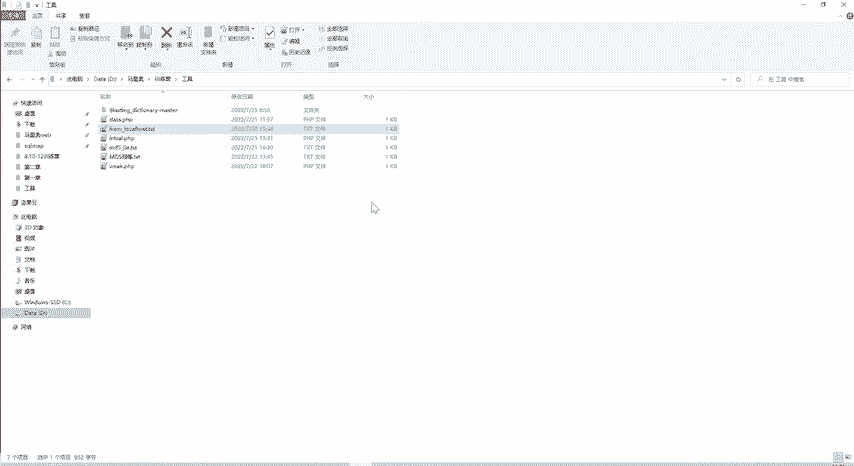

# B站最系统的护网行动红蓝攻防教程，掌握护网必备技能：应急响应／web安全／渗透测试／网络安全／信息安全 - P75：27_指定参数访问 - 跟小鱼学安全 - BV1SF411174M

然后我们再看第二天。我们把这些啊。没无关的东西关掉。我们看一下第二题。

第二题他告诉我们，请从本地访问。这个服务器。啊，那是主办方的服务器，那不是我的服务器。那我如何从本地访问呢？我现在是1个CTF web的一个参赛者。😊，CTF参赛者专门做外部体验。如果从本地访问。

这时候呢，我们就还是需要用到我们的perp suit。

好，我们把这个爆破魔块就关了。同样的在我们代理模块呢也能看到。刚才的这个请求。是不是我们这时候呢不用把它发送到包括模块，可以发送到这个repeer重放的一个模块。😊，在这个模块里面呢，我们点击和发送。

就相当于进行了一次网络请求。他告诉我们呢，是要请从一个本地进行一个访问。那么我们如何从本地访问呢？那么有一之前了解过ACTP协议的，可能就找。啊，这些。U在 agent进的host啊。

这都是协议的字段accept。呃，能够解这些。那么哪个是本地访问的鞋字端呢？那么们可以再给他添加一个字，就是X forward的 for。127。0。1就是本地。那我们看这样的一个。

发送符不符合他的要求呢？

那我们啊这里重新刷新一下。

请从本地访问。我们加上。X。我们把刚才的X forwarded的。f给加上。这就只是我们这个请求是从哪里来的。😊，就是从本地访问，本地就是117。1嘛。那么这个时候大家看响应是不是跟之前的有所不一样了。

他说你以为不知道X four的 four。那说明用这个方法是不行的。但是他又要求我们从本地进行一个访问。这个时候怎么办呢？就是说。从本地访问，它不一定要使用X four four，它有非常多的字段。

都可以实现同样的一个效果。比如说我们打开我们的一个手集的一个工具，那么我们看一下这里面有这样一个。啊，文件。这里面给大家列出来的都是。只是我是从本地访问的一些字段。可能IP啊fored for I啊。

这些都可以。那他现在过滤的是X four里的 four。啊，过于的是这个。那玫过的是哪个呢？现在我不知道不知道怎么办，我把它啊全部复制过来。😊，因为我这么多，我不可能一个个去试，是不是？吧，粘贴上。哎。

现在就不会。报刚才的，你以为我不知道X four。 four是不是？那说明我们对它的改变已经生效了。现在也要求我们从谷歌访问。至于这里面附制这么多是哪个生效的？😊，其实大家不用管。

大家把这个全部粘上就行了。那他现在要求我们从谷歌访问。那么这个refer字段呢，就是说我们是从哪个网站过来的，或者是哪个网页过来的。那么现在这里是什么？是我们就是从我们这个题目过来的。

现在他要求我们从谷歌访问，我们就把这里啊进行一个。😊，更改更改成谷歌，然后再发送。哎，那这个验证又过了，现在还有什么使用ABCber。使用这个浏览器，浏览器是由哪个指定呢？

是U在Aent这一项进行指定的。现在这个这里是指是我们用火狐，是用火狐进行访问的。现在要求我们用ABCbrow进行一个访问。那么我们就把这个。😊，给替换成ABpri按题目的要求。哎。

这个时候是不是flag就已经出现了？那我们满足了他的从本地访问呢，还有要从这个谷歌这里跳转过来，要使用ABCbb这些要求。那么同时满足之后呢，这个flag就出来了。那么这道题呢就做完了。

获取flag就可以提交，在比赛中就可以得分了。😊。

