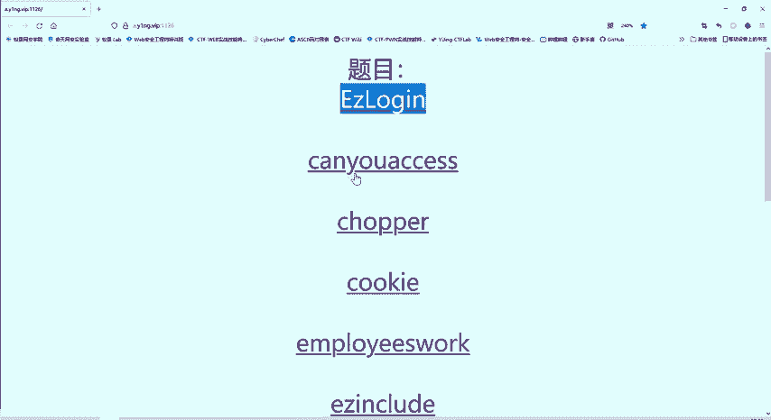
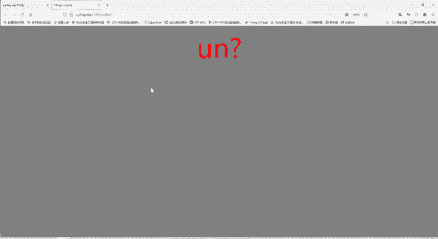
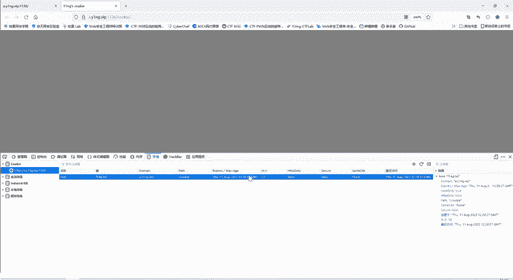
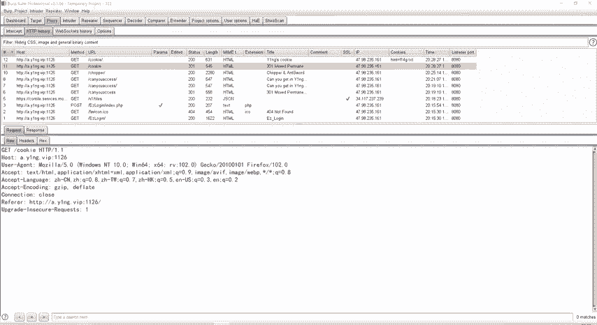
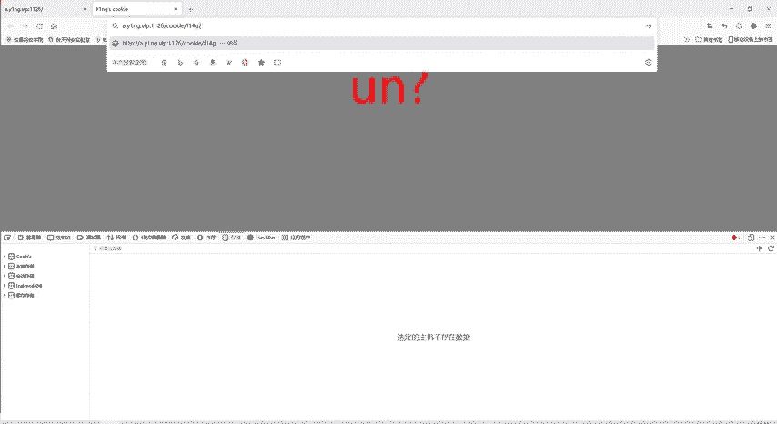
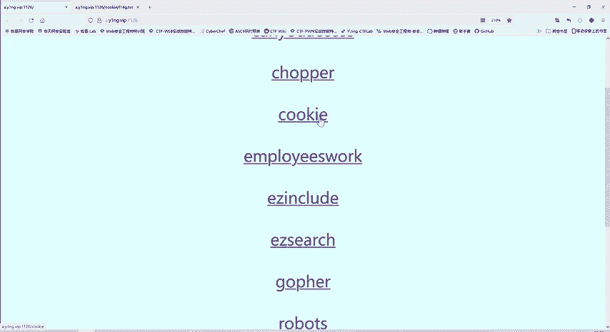

# B站最系统的护网行动红蓝攻防教程，掌握护网必备技能：应急响应／web安全／渗透测试／网络安全／信息安全 - P77：29_cookie - 跟小鱼学安全 - BV1SF411174M

好，这第三题我们看一下第四题cook。哎，第四题这题目就c，那是不是？啊，跟c相关呢。那么们如何查看cookie呢？其实有多种方法，我们直接在浏览器上点击右键。

有个检查。检查存储里面有一个cookie，是不是？那么这网站的cer。名称ht值F14G点TXT都。路警等等，有这些信息。

我们用boop suit呢，刚才我们一直用boop suit抓着包的，所以说我们也能看到cook这个反应这个。😊，响应。然后我们再刷新一下。

你看在我们的bar速度当呢，也能看到这个信息cookie信息。他告什么恨F14G点TX。是不是F14G是不是很像？很像flag。这实际上就是一个flag的变形。因为我们夺奇赛就是要找flag嘛，它会。

啊，给你提示一些F14G啊等等，就类似于flag。他居然提到F14G点TXG，那么是不是？我们就可以反问一下嘛。因为这道题的名称就叫cookie。那么。这个F14G是c当中的内容。那很可能就是有用的。

进行一个访问。啊，这样就获取了这个要题的flag。你就成长了，这你的。那个这段学院价值就发挥出来了，是不是？以前不会没关系，现在会了就行了。谁还管你是什么时候会的，你只要会了就行。你后找工作的时候。

反正你会。😊，就可以了。那还管你是今天学会的，还是去年学会的。😊。

那么这是我们的cook这道题。