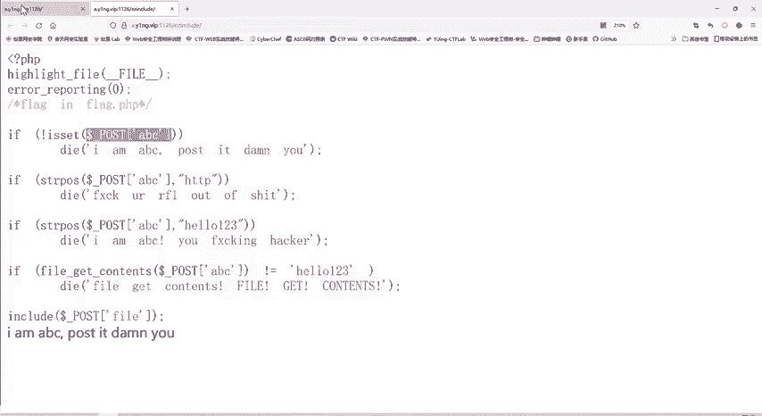
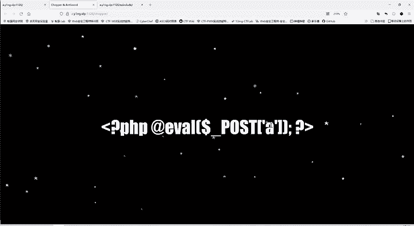
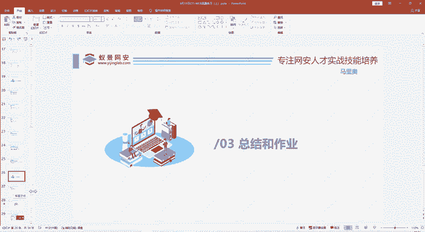

# B站最系统的护网行动红蓝攻防教程，掌握护网必备技能：应急响应／web安全／渗透测试／网络安全／信息安全 - P79：31_多重验证和data协议、filter协议 - 跟小鱼学安全 - BV1SF411174M

这是第五个贴。啊，下面给大家看最后一个题，我们今天的。哎，这个题我们一打开呢。据我们关注了，它有个提示，flag就在flag点PP当中。那么这个题我们的目标。还是很明确的。就是。看这个flag点PP。

当然他肯定不会直接让我们看他会他这个题是什么？用donnerpost ABC。这个方法刚开始大家不明白这是什么意思。😊，现在是不是明白了，跟我们之前讲的这个。😊。

一句话木马是不是dopost A和don post ABC实际上是一样的。如果你传递这个变量名叫A，这里呢这个题。😊。

把变量名加到ABC。那实际上都是。用法都是一样的，都是用pos的方法传递一个参数。他和你传递过来参数是什么？如果说不存在呢，它就输入IMABC。啊，这是这段那容。因为我们现在没有pos的方法传递参数。

那。那我们既然这样的话，那肯定不行的那我们就传递一个怎么传递，还是右键检查，然后使用我们的黑ick bar。我们昨天装的这个插件。然后导入这URL，然后传递参数。那么上一个题传递参数是问号啊。

work等于什么？那这个题是不是就是问号ABC呢？等于。啊，随便1234。随便说一段。你看他现在这里没变，说明他现在po ABC还是没有。读到是不是就多呢poABC这是没有内容的。为什么会出现这样呢？

因为我们刚才那个题这里是get work，是get方法。get方法就是问号参数名参数值。😊，这种格式那现在pos的方法呢就不能使用这种格式。怎么传递pos？参数呢这里有一个post date，我们点击。

在post data里面进行一个参数的传递，那就ABC等于。123456。那我们再看现在是不是变了，好不再输出MABC这一段内容，说明这一关的检测是通过了。它后面输出什么faget contents。

它现在哎到这里了。😊，那我们再看一下它到底又是进行了一个怎样的过滤呢？第一步，检查是否存在ABC。这个参数啊，现在有了，所以这一关就过了。第二步呢。啊，这里是寻找我们传递过来这个字符上。

我现在传递的字符上是什么？123456。😊，中是否存在HTTP。stright drop POS就position。他本来的意思就是说寻找我这个HTP在你这传过来字符当中是处在什么位置？😊，这里呢？

他找到了就返回真，没找到就返回假。😊，就看有没有，如果是只要找到了，不管它在哪个位置，它都会输出这个字符来。那我我们还是这样去看到带，那么我们这个题呢还是失败了。😊，说明我们传输的字符串ABC等于多少。

它不能包含HTP这个字符串。H。啊，我喝口水。那么我们再看下一个验证。这你验证的是。要求我们。看跟上面这个函数是不是完全一样？hello123，那说明呢我们传递ABC等于多少中不能有hello123。

😊，这个字段。如果有了，他就会报下面的MABC是不是？那我们这里可以试一试。如果说我就输入hello123，我甚至可以输多456hello。这些随便说。ABC等于。ABC等于这个。H一。那么这里就是。

还是啊就没有通过他的验证。那么第四关他一看，它总是显示这个。F， guess contents。它总是显示这个。这你是这一个验证是什么意思呢？它就是说我们传递过来的ABC这个值。

它作为一个文件名进行打开。fire尔 gass content什么就。获取这个文件名的它的内容，打开这个文件内容，它这个内容呢要不等于。如果说他是不等于这个。hello123的那就会报这个错误。

那说明就是。我们要选需要这个理解，就是需要寻找服务器上的某一个文件。它的文件打开之后呢，内容就是等于hello123，那才能通过它的验证。那最后呢才能包含我们的fi。这个范额呢，我们就可以。啊。

规定为这个flag点PP那它进行包含，我们就看到了flag内容。所以这个题的目的呢就是要通过这四关的验证。那么我们这里也给大家写了。怎如何通过验证呢？关键是。第关键是第四步的验证。

第四步页呢就是说我找到这个文件，它的内容是hello123。但是我们现在不知道服务器上有哪些文件。😊，不知道文件内容，这个时候怎么办呢？我们fi get content除了传入一个文件名一样。

这种方法以外，还可以给它传入一个数据流。什么数据零，这里给大家写出来了。就是对。啊，就是这个data协议。这个订单协议是什么意思呢？它传输一个数据流。那么这个时候。这个时候传输数据流。

它就是不是说打开一个文件查看文件内容，这个得到的就是我这个数据流的内容。😊，那数据流本来是要它等等于helo123。但是如果说你直接在后面写hello123呢是不可以的。

因为第三步呢是要求它不不能出现hello123。因此呢我们就可以将hello123进行一个base news的编码。你看这里也可以看到有个等号，它就是一个base news的编码。使用编码呢。

我们可以直接使用这个黑黑豹这个工具进行一个编码。这里有个encoding basease6 in的就是。编码那编码的内容什么？hello。123。看编码之后呢，就给我们显示就是这么多内容，这个结果。

所以说这个黑霸插件虽然小，但是作用很大。那么前面再加上base news进行一个解码，这样最终传递过去的内容就是hello123，但是不会出现hello123这个字符串。

HTTP那一行就是你不能出现HTP啊，它就是这个这样一个限制的作用。我们现在啊这个题。这个题目的做法呢就是这样。后面是传输的f尔协议。份协议其实这个题。那大家一些理不理解也是正常的。

因为这道题呢说实话有一点点超纲，主要是大家认识一下我们两个协议，一个是这个data协议，一个是这个PHP的fil协议。😊，他就是在进行文件包含的时候呢，我读这个flag点PPP。😊。

因为它这个PHP文件，它不会显示文件的内容，它是把它文件里面代码执行的。为了显示它的内容呢，就要使用这个PHP filter。😊，然后把它就像我们这个。课件当中写的。把它转化成一个base64的编码。

就是把里面的原来的命令。不当独命令来执行的，直接进行一个b6编码来进行一个输出。这样你才能看到这个flag点PHP的一个源代码。那么们今天主要就是给大家讲的这个六道题目。那我们可以总结一下。

