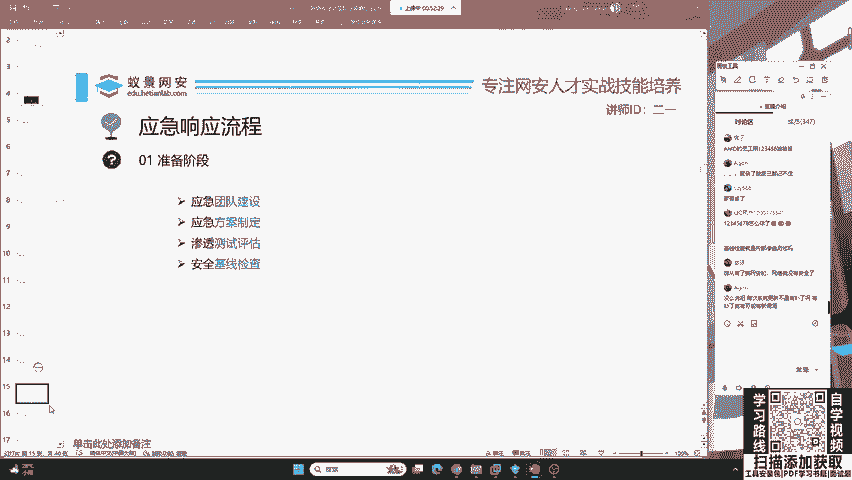
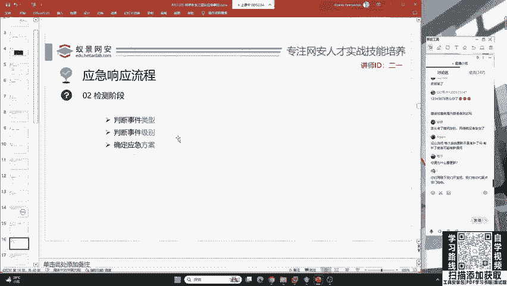
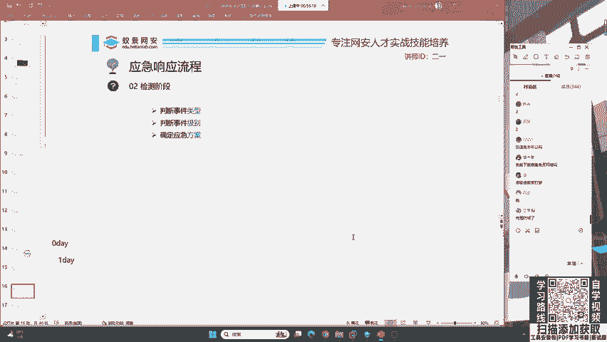
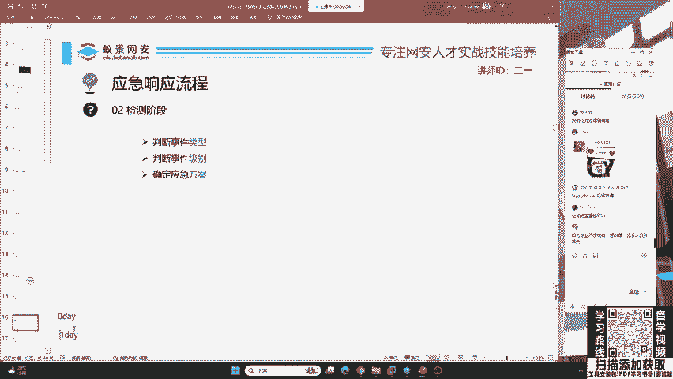
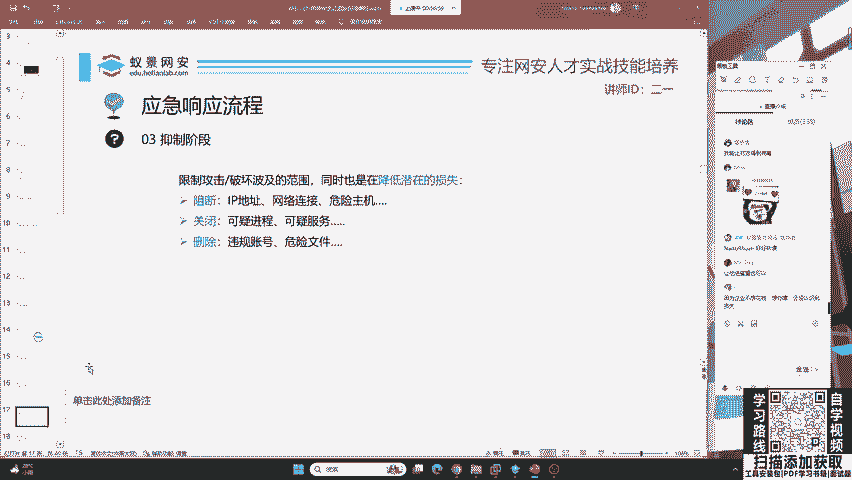

# B站最系统的护网行动红蓝攻防教程，掌握护网必备技能：应急响应／web安全／渗透测试／网络安全／信息安全 - P7：蓝队应急响应-6.检测阶段 - 跟小鱼学安全 - BV1SF411174M

嗯，其次呢就是检测阶段。这个检测阶段呢就是说在被攻击之后，你不可能说你10%能防御呃，防防御吧。这个就像这个同学说的一样。这个系统即使有补定。即使有不定，或者是说你即使你把这个网站防的非常好。

那这时候啊这个红队就会拿出来很多的零带去攻击。

包括一代去攻击。一代就攻击。哎，大家知道什么是零带，什么是一代吗？有没有同学知道知道的话，你可以在讨论区扣个一给二一老师讲一下。如果你不知道的话，我会调节上课的速度来给大家做相应的科普。

以及啊做相应的安全意识培训。😊，有一半同学啊知道一半同学不知道。那这里我简单科普一下吧，零带就是说没有人知道的漏洞，没有被公开的漏洞，被称为零带。一代呢就是说现在只有一部分人知道，但是哈。

企业还没有做相应修复，以及呢没有公开给大众的漏洞，这些啊都被称为一代。我们会发现啊，这个零代和一代在互网中，它是非常常见的。也就是说啊咱们想当红队，你基本上都是要用零带和一代去搭进去。我举个例子好吧。

比如说嗯你这个同学说哎，我非常安全，我这个电脑上啊系统是最新的。我浏览器也是最新的，我什么网站都没有。结果啊一个红队大佬，他找到了windows11最新版的漏洞。那你想一象一下，你还能去防御吗？哎。

大家觉得如果一个红队大佬，他发现了windows的最新漏洞，或者是QQ的最新漏洞漏洞。QQ的最新漏洞，你觉得你还有办法去防御吗？大家觉得有没有办法去防御零带？如果你觉得能防御零带，你可以扣1。

就是能防御可以扣1。😊，不能可以扣2。就是这个东西我能不能发在咱们一个标准的。😊，一个应急响应，安全建设做的非常好。咱们能不能防领带和一带？😊，大部分同学觉得都不行啊。有没有同学觉得行的？

有没有同学觉得可以防御的？好，王虫同学说了能。

其实啊如果你这个企业的安全建设非常好，这里要告诉大家，零带啊也是可以被防御的。为什么要这样去说呢？就是现在有很多的安全设备，他会做什么事情啊，它会在降低你被攻击的影响程度。这是什么意思啊？

就是说你现在有这个漏洞是吧？你打我可以，你打了之后，你什么都得不到，这就是叫做终端安全。或者是我们把它叫做啊就是说你这个安全是映射到了。最底层的一个呃级别，咱们每一个员工，每一个设备。

包括EDR各种安全建设。我们买的这些设备啊综合利用，把这个零带危险程度降到最低，甚至是零。这就是零带的防御，它完全可以防。但是你会发现为什么这么多企业还被零带去打穿了呢？这还是要告诉大家。

企业安全建设啊，它不是一蹴而就的，它是一个漫长漫长的过程。就是说比如说你企业里面有500个人，你这500个人都必须要做到足够的足够高的安全意识水平才行。如果你有一个人不行，有一个人混水摸鱼。

那这整个企业就会被攻破，还是这句话。对企业它有的不在意。所以说你这些设备看着卖的多，但是实际上没有起到应有的防御效果。

