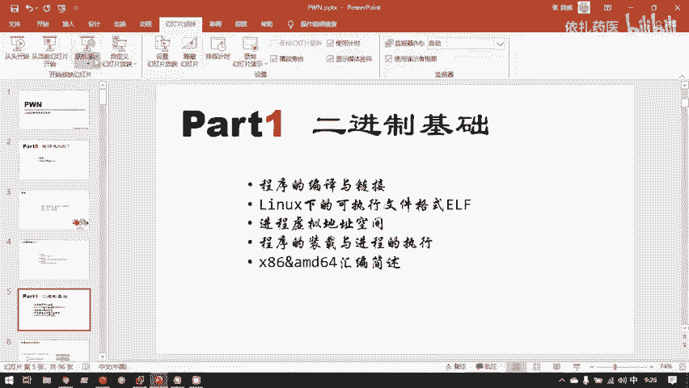
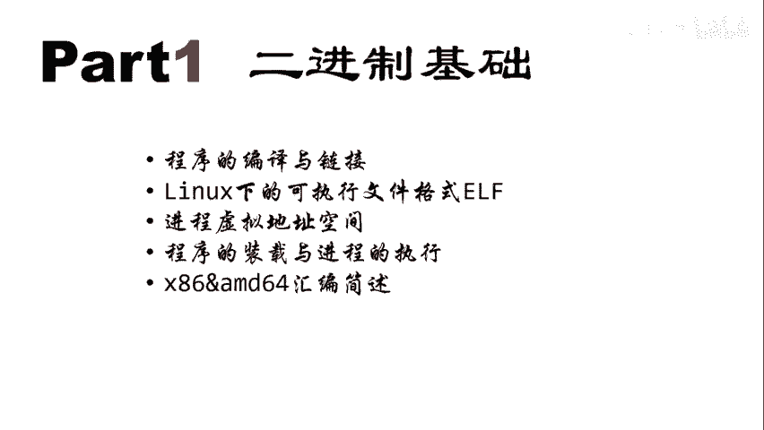
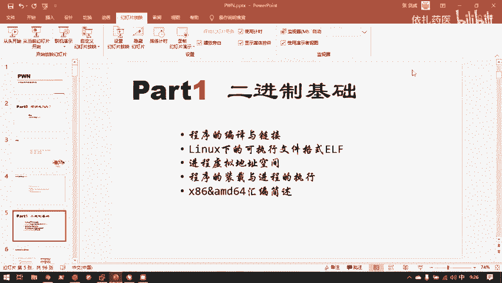
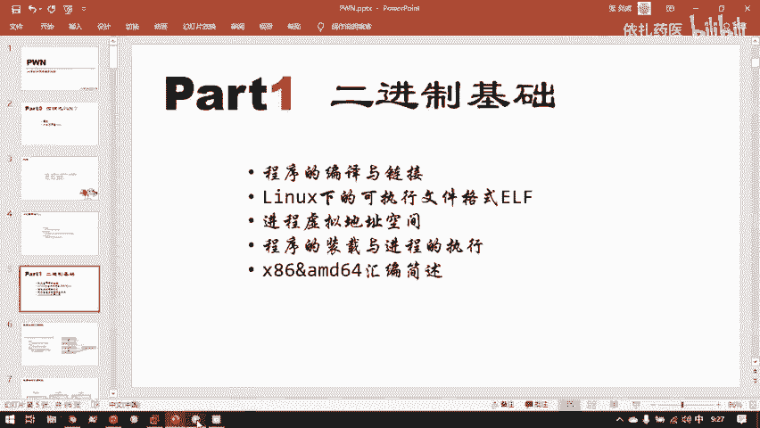
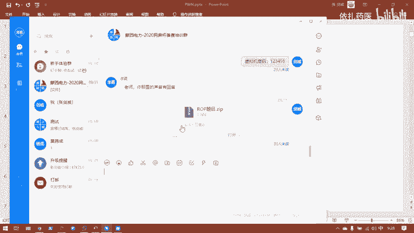
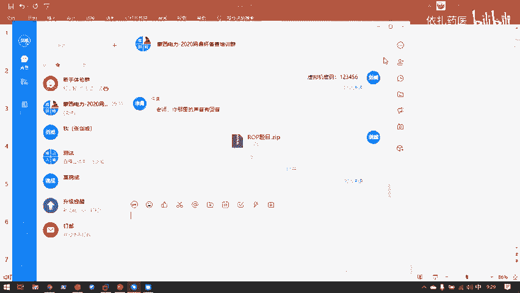
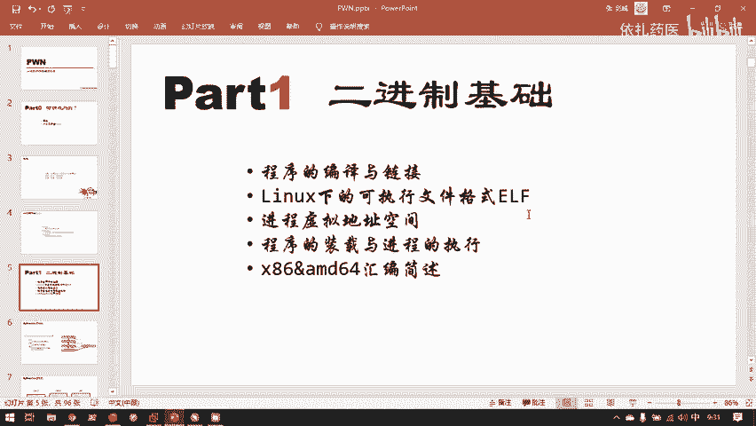
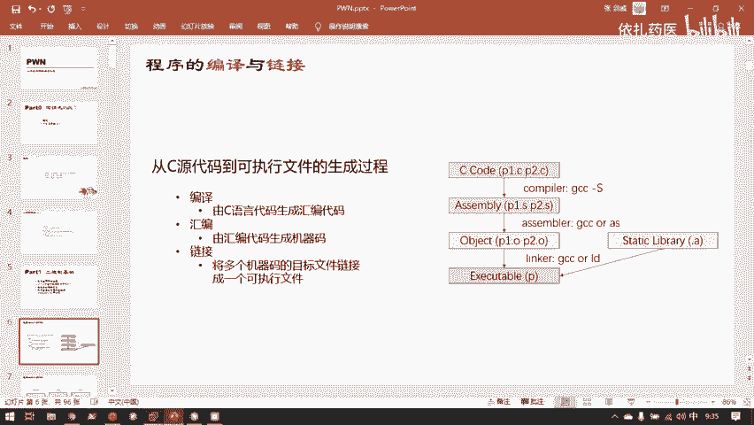
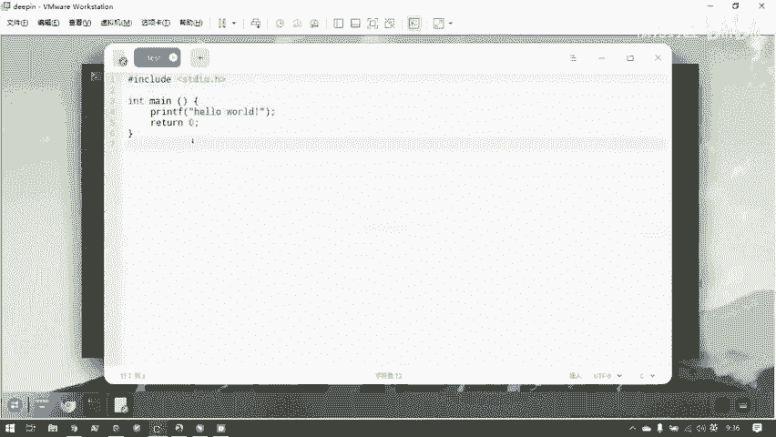
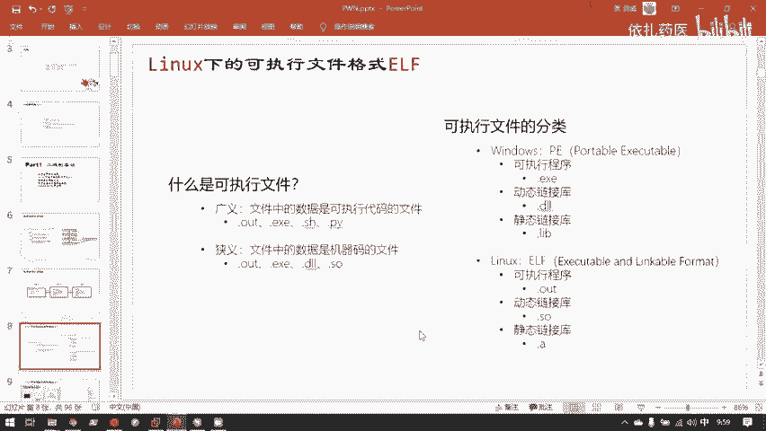

# B站最系统的护网行动红蓝攻防教程，掌握护网必备技能：应急响应／web安全／渗透测试／网络安全／信息安全 - P85：2.程序的编译与链接 - 跟小鱼学安全 - BV1SF411174M

嗯，接下来往下看。

嗯，演示完了一次简单的。嗨我们就可以开始相关的二进制基础知识的准备了。

这里要说到一点，就是二进制。

胖这个方向在CTF中一直是被大家认为是最难的一个方向。它是以蓝入门和蓝提升作为著称。为什么呢？就是因为胖这个本身二性制漏洞挖掘，它离操作系统底层是非常近的，所以它需要大量的。编程还有操作系统、汇编原理。

然后计算机体系结构这样的知识来补全。如果你单纯研究漏洞的话，其实很多地方如果你单独的把漏洞背下来，漏洞挖掘是可以做到题目是也是可以做到。但是只是之前并没有这些所以然。你要完全理解一个漏洞阅子原理。

并且要作为安全研究员。继续去挖掘更深的lo洞的话，就需要补足大量的计算机科学技术相关的底层知识。嗯，其实我有个比较疑惑的一点是。

你们在最开始给我的反馈之中。嗯，就是自己的C语言编程基础，还有linux基础。这个提到的人并不是很多，但是这两点是二进制非常就是特别特别重要的基础知识。

可以说这两点如果没有掌握好的话，其实就是学二进制的话，可能会比较困难。尤其是C语言编程。因为我们分析的最最后我们竭尽全力用这各种方法，也就是要把基线把它转换成C语言嘛。所以如果读不懂C语言代码的话。

问题就会很大。C语言这个语言比较古老，已经几十年的历史了，统治了编程件很久。其实它的基础语法很少。然后它的酷函数关键的酷函数也做了几个，大概了解一下应该会很快。并且有其他高级语言编程基础的话。

C语言学起来，其实。困难应该还是会尤其是C加加，如果C加加都会的话，自己人应该是完全没有问题。😊。

嗯，我现在想咨询一下大家，大家觉得这个速度还有这个节奏可以吗？如果觉得有问题的话，可以说一下。嗯，并且大家之前也说反馈的是。

需要讲慢一点，讲细一点。嗯，好的。可以就好，需要讲慢一点，讲细一点。如果讲快了，其实我感觉就是我这边的嗓子和声音也会有点失紧。所以。就是尽量的会放慢速度，然后尽量的因为这个这块知识。我举个例子。

等一下要讲的站的工作原理。你可能每一步听的你都觉得听懂了。但是如果你没有把这整个流程背的滚瓜烂熟的话，你做题还是会有困难。所以一个看起来很简单的知识，其实需要。一个很看起来很简单的一个基础知识。

其实需要大家背的很熟练，然后才有。才有实力去做题目嘛。所以。可能就是比较关键的点，我会用不同的方式向大家多展示几点。因为自己在学习呃胖的时候也是有这样的体会。就是最开始在入门的时候。看那些材料。

各种知识全部都看懂，但是题目拿过来，我就是不会做，为什么呢？因为我对这个二进制，它的底层的调用原理不是很熟悉，你让我说它的原理，我去想，然后想半天，我能说出来，但是我没法立马反应过来。

所以至于我去想这个程序是怎样运作的，就花费了大量的时间，然后把上一个运作方式想出来，下一个再去想下一个运作方式，想完之后就上一个就忘了，然后我就忘记了这个程序是怎样执行的。

然后就在碰一个程序的时候就感觉非常困难。真正的什么时候解单了？就是反复的做题。熟练之后，比如说我等一下要讲到很重要的函数调用站。函数调用站的工作原理已经滚弯烂的时候，在我的脑海里就成放动放动画一样。

然后在脑海中可以自动的工作起来。此时。我再去做一些站一出的题目，就会看完题目，我就能立马在我脑海中模拟出站的一个工作方式。然后他在我脑海里一个动画的方式呈现出来，我就知道这个动画里哪个地方会出错。

然后我应该怎样去利用这个位置。

至少说到了一点。

嗯，那么接下来就是正题。首先是程序的编语链接，我们要攻击的是二进制程序。那我们就首先要知道我们要攻击的，我们要知己知彼，百战百胜嘛，我们要完全的了解我们攻击的这个东西，它是一个什么样的东西。

二次制程序本身。一切的编译型语言都可以审成二进制程序。但是我们主要研究的还是C语言。和C加加C加加还比较少，比较蓝的胖题目中才会出现C加加的漏洞利用。我们主要研究的还是C语言的。变译成的可执性文件。

你们的漏洞。为什么C我们主要是研究C语言的呢？因为C语言这个语言实在是太古老。他直接开启了，他可以说是高级元的一个开上鼻祖。所以在他最初设计的时候，有各种各样没考虑到的，然后没有完善的问题。

然后但是因于C语言的市场占有量实在是太广了，然后后面一直发展迭代了几十年，有一些很多历史我遗留问题没有解决。所以C语言这个古老的又强大的。语言它其实里面是有各种各样的设计缺陷的。

说PHP就说PHP到处都是洞，为什么呢？其实就是一个很重要原因就是因为PHP是基于C语言的PHP里面的一些漏洞是直接是因为C语言导致的。就比如说嗯它的字符串截段那个问题。

就是因为PHP是用C语言写成了一个更高级的外面应用语言，然后导致了PHP里的字符阶段漏洞。当然这个漏洞也是在C语言里存在。呃，其他的变译型语言其实。目前漏洞是要比C言少很多的。

但是并不妨碍我们研究资源的漏洞，就能攻献很多服务器。因为目前还有大量的。呃，二性制程序是用C语言和C加加写成的，只要这两个语言还在用，他们的安全问题就一直存在。当然。

C加加现在还在很努力的去发展和解决自身的一些安全问题，类似安全问题。但是C语言这边古老的语言。目前就是还是比较无解。呃，为什么C加加和C语言的市场占有率一直下不去呢？就是因为很多变异性语言，它是有。

GC也就是垃圾收集器的，导致他在执行GC的时候，它会直接整个程序阻塞在这里，导致程序的执行效率和及时性会大大降低。比如说购语言，购语言也可以编译成二建制程序。但是它因为它有GC的问题。

所以购语言不可能用在那种要求及时性很强的一微秒一毫秒都不能出差错的这样的服务中，比如说金融市场的股票交易系统，还有。12306的抢票系统，那大家我比你先来了0。1秒，那就应该票到我手里。

那如果你用够语言去写一个二进制程序来跑这个服务的话，我买票的时候正好够触发了垃圾收集器。然后他的服务阻塞在那里了。然后我们在这傻等了，傻等了购员的垃圾收集器几秒。好，那谁先来谁后来那就完全不一样了。

这样程序的及时性就被破坏了。所以只要有这种对执行效率和时间极其敏感的领域存在。C和C加加这种。嗯，直接编译成没有垃圾收集器的二进制程序机械码，这样的语言就不会绝迹。当然目前C和C加I也有它的挑战者。

比如说rest语。rat的语言就是这个语言从设计之初就很强调安全性。可以说你碰掉一个rast的程序是很困难的。但是目前它是新兴语言，rat2015年才出生，所以它目前的市业场占有率还很低。

所以呢我们研究C和C加加的二进制漏洞还大有市场。嗯。那我们先从C元开始。

一个C语言程序。它是这样的嗯，这里先说到一点，我我这里会用win这样一个编辑器，这个编辑器也是有几十年历史的一个古老编辑器。然后它是纯命令行的，就是会用的同学可以直接用这个不会用的话。

可以在de拼你拼拼也是号称国产操纵系统嘛。当然它现在已经发展成了UOS统一操作系统，然后得到了国家的大力复制。de拼提供了国人，就是对国人很友好的一系列的工具。对于此时我要编辑这个文件。

如果大家不会用winm的话，可以用de拼艾。然后输入一部分自动按t按自动补全就可以。然后就可以出现熟悉的这样一个编辑器的界面。然后大家可以在这里写。

并且这个d拼 editorit也有代码高亮这样一个功能。

我这里是直接用费。这是一个C语言源代码，这个源代码它是怎样存储的呢？它本身是一个文本文件。就是你们存放的都是字符串。这里先讲一个lininux系统和相关的基础知识。linux和windows有些不一样。

linux里面的程序，它的格式都是借助于程序头来分辨的。而不像windows windows直接是后缀名。所以windows这一点其实我觉得设计是没有linux好的。

我可以完全用一个后置名我去欺骗这个操作系统。比如说这个题目文件，这个文件，此时它是个TXT，对吧？我如果。我把它改成后缀明改成Z己。他又警告我一下，然后我点一个试，它就变成个压缩文件。

但它实际上并不是一个压缩文件。我仅仅通过改括证明，我就。欺骗的操作系统，它是一个什么文件？文件内容并没有变，但是操作系统我会把它认错。这一点是windows用hold缀名来标识文件的方法。

linux不一样，linux。嗯，它是用文件头来识别的，它会有特殊的工具。呃，比如说我fi这个工具，fill就是用来识别linux，你的文件是什么可式的。我fill一下这个test。

它会告诉你它是一个C语言源代码，并且是阿玛编码的文本文档。当然我此时把test点C，我改成test。讲这。我依然骗不过lininux。我fill一下，他好像告诉我是C人源代码ask文码编码的文本文档。

我当时我把他的或制名删除。他也是依然是这样一个结果。先问一下te，他和为他点C是没有任何区别的。嗯。那，我们可以现在看一下，就是这些文件在底层直接磁盘上存储是一个怎样的格式。嗯。

我们要知道就是一个程序与你交互的程序，你能在屏幕上直接操纵它的程序，它都是被计算机载入内存的。比如说此时的vem well。嗨我的谷歌Cl。这都是在内存中的程序，被载入内存之后，这才能与用户进行交互。

一个程序在磁盘上，它是不能发挥任何作用的。比如，此时我们有运行的这个Tam。这个team对应的二建制程序老老实实的保存在我磁盘上，但是我没有运行，它没有把它载务内存。他就无法与我交互。我双击team。

挺好，那么此时这个赚钱圈在干什么呢？主要就是在把team的程序载入内存，然后启动它的一些初始化代码。可以看到他出现了个窗体，那么team此时就在。

嗯，在已经是在内型中可以给我们交互了。嗯，接下来看一下。就是这些文件存在磁盘上的文件，在磁盘上存储个格式。我们都知道那嗯计算机底层。计算机指认是什么？它指认识零和一两个东西。我们看到这些图片啊、文本啊。

他都是不认识的。因为这一切的一切全都是在底层是用零和一编码。比如说我们字符A，它就有零和一编码成了0叉41这样一个二进制的值。他实际上在计算机里保存的就是0。001。不对，是0100，然后0001。

这就是A这个字符在计算机底层保存的样子。那么此时这个源代码t点C，它的计计算机底层它是怎样保存的呢？它是一个文本文档。我们现可以用bam打开一下它。这是他呈现给用户的样子。

他已经把底层的零和一转码成了这样一个字符串，然后用户可以看到它是怎么样的。那我们来现看一下它二进制的样子。我们在这是为m的一个特殊的命令。这就是他二进制的样子。当然此时他二进制呃前几天web讲miss。

昨天讲miss的时候已经用过二进制编辑器了。呃，大家应该知道就是二进制转16进制，1六进制可以直接做二进制的一种表示法。对应的它在计算机里存储的零和一串，就是这一堆16进制所保存的样子。

当然你可以看到此时这些所有的。二进制值。它全都是在阿玛范围内的，为什么呢？因为它是文本文件。我们文件所有的字符它都是一个阿玛值。比如说大写的A，它就是0叉41这样的一个值。换行幅就是0叉0A。

也就是10。特航符在底层的值就是杠恩在底层的值，它就是十。这左边是偏移。就是从距文件头有多少个字节的距离。好，我们先编译一下它。这里先讲一下编译的过程。哦，先演示一下一步编译到位。

这是linux下默认的GN协会的开源的编译器。再点C。不小心篡改了一下文件。我没有我没有保存它。因为他此时把它转成二进制的显示法，他其实已经把这个文件保存这样以这样数字形式的一个文字文档。

我们先要把它还原才可以。保存一下，我在7CC。然后编译成功。这就是一个最简单hello world。变行。就得到一个hello的输出。当然嗯编译就是一步就搞定了嘛。

其实并不是编译这个过程本身是没有这么简单的，不然编译原理也不会成为计算机专业课中最难的一门了。编译其实有很多很多很多中间过程。但是我们目前对于做胖这样一个题目，我们只关心中间的两个中间过程。

一个是汇编和链接。链接这一步比较重要，因为到时候涉及到有两种程序，一个静态连接的程序和动态连接的程序攻击这两种程序的思路其实是不一样的。我们目前只研究它大量步骤，繁琐步骤中的这四步。

就是从源代码到汇编代码到目标文件，到可执性文件这样。步骤。我现在删掉这个，我已经编译出来。我们现在并不一步到位的把这个C语言原文件编译成。可行性文件。啊，编译成特编文件。GC杠S加个杠S。

它的时候它会变成汇编，然后它默认输出一个test点C用test点点S。我们可以看一下你的内容。可以看到这就是我刚刚写的C源代码。对应的汇编代码。可以看到目前这个汇编代码，它还是一个文本文件。

他验然是个我弄文件，他并没有变成机械码。CCCC一下它把它变成一个可持性文件。因为此时。嗯，我并没有写第二个C语言文件，所以并不需要连接用户自己的，我自己写的。第二个目标文件，所以其实实可以一步到位。

直接得到。那么此时这个可视性文件是AR。可以看。winux下执行一个可执行文件，就是点杠，然后当前目录。下的内容或者你输入一个绝对路径。比如说对于这题，对于这个此时的位置就是。呃。

波浪线加一个杠表示加目录加目录下的t文件里面有个A点O，也可以这样运行。嗯，这个shall还是希望大家下去之后能熟练掌握。因为这些知识shall还有linuxC语言，这些都不是这几天培训的重点内容。

这些培训还是核心在二进制漏洞本身上。所以这些基础如果大家觉得有困难的话，还是希望大家自己下去尽量的补足一下。呃，那么这是C语言源代码，这是C语言对应到的汇编代码。这是汇编代码，汇编之后得到的可执性程序。

我们刚刚用vim打开了test点 c test点S，他们都是文本文件。我们再fi一下这个A点。可以看到他此时告诉我就不是文本文件，它是1个64位的linux下的可执行性文件格式ERF。那我们。

看一下这个A点outt，它在计算机底层磁盘上存储的二进制格式是怎样的？好问妹下。这是什么？到到处都是乱七八糟的乱漫。然后里面偶尔出现几个这样字符串可识别字符，剩下的全部都是乱码。为什么是乱码呢？

就是因为。因为在计算机底层编码中，只有特定的一些范围的值是可以表示成字符的。比如说阿格玛就是。嗯，阿森玛的可见范围是10到127。也就是说一个。巴比特一拜一字节。

一字节能表示的整数的范围不是0到256嘛，然后其中的10到127，它是可见自负。就是你如果一个比特。一个一个by，一个字节，这个字节的巴比特，它对应的整数值是10到127的话。

那么它就是个阿斯格玛对应的字符，再就可以是一个英文字母或者一些常用的符号，英文英文范围的符号。当然此时因为机械码嘛，机械码当然用到了这些编码之外的大量的值。所以这些看起来这里看起来都是乱码。

那么我们就不不看他试图把它转换成。可见字符的样子了，我们直接看它的二进制。内容还是用刚刚的那个。可以看到这边依然是偏移，然后这这些就是这个可行性文件里的内容。嗯。

这前面的部分还有大量的零和有一有一些可见字符的是这个文件里，其实它有一些说明信息，这些说明信息本身不是机性嘛。就不是CPU直接能识别的可执行代码。

它是给操作系统认辨识来获取这个可实性文件相关信息的一些内容。然后到很下面真正的可实行段，这个等一下再讲。然后他才是大量的机械版。然后CPU呢就直接获取这些机械嘛，然后执行来获取对应的输出。

CPU认识什么？CPU除了零和一，他啥都不认识。所以你给CPU执行的代码，也不能是直接是C语源代码或者是。类似你的PHP啊，pyython代码。

那样的人看得懂字符串机械绝对看不懂机械看得懂的零和一亿人绝对看不懂。所以连接人看的代码和机械看的代码，这样的角色就是编译器和解释器，对应的就是编译型语言和解释性语言。pyython就是一门解释性语言。

我的拍送代码。是直接被python警示器。这些代码是直接被python显示器一行一行的翻译，然后交给CPU它翻译成一行一行，他把一行一行的翻译成要该如何执行，然后交给CPU对应的机械码执行之后才会结果。

所以我直接运行个pyython并不需要编译出一个可视性文件。大家从来没有一个python，然后compil去编译一个pyython脚本。就一个python是解释性一样。但是C语言就不一样。

C语言得到可视性文件是直接是。并不需要显示器，我只用直接运行它就行。这是变异词语言。这就是我对于我们刚刚这样一个过程，这个最后的A点out就是我们所研究的要从中找出漏洞的。程序的格式。对。

linux下就是ELF。当然windows下windows下的也并不是没有。但对CTF屏题目的话，windows的胖非常少见，并且windows本身是微软的自己的知识产权。windows是个必源。

所以有很必然的操作系统。它的源代码不会对大众公开。所以你在研究windows的一些安全问题的时候，很多你在研究它的操系统内容的时候会遇到各种各样的困难。因为微软根本就不打算告诉你。

这是他们辛辛苦苦写出来的东西是要卖钱的。但linux不一样。linux是这个世界上最大的开源软界，没有之一。所以。lininux它整个操作系统的源代码，你可以直接在gitthub仓库上看。

所以对于研究linux下的各种漏洞攻防啊，其实都是要比windows那样的闭源平台要方便很多的，可行性也是要高很多的。嗯。看这张图。这张图就是说明了整个程序的编译流程。从C语言源代码，然后通过编译起。

把它翻译成汇编代码，然后通过汇编器。GC既可以充到变译器，可以充到灰编器。然后把汇编代码翻译成目标文件。然后把目标文件连接成可执性文件。为什么这里还有个目标文件？其实我们直接编译出来的程序。

我这里刚刚是因为只写了一个代码，所以省略了这一步。我举个最简单的例子。C源代码。intermail returnturning，这些都是s语言类建的关键字，最后可以直接用编译器。

可以直接把这些关键字组成的代码翻译成汇编代码，就而翻译成机械码。但是pre这不一样。pre并不是C语言编译器直接认识的关键字之一，它是一个函数。那么print F这样一个函数是我自己实现的吗？并不是。

creenF这样一个函数，它的实现是GNU协会，你的大神程序员，他们写好了，然后。编译到linux里面的一个动态连接库叫lib city。他们编译进去之后啊，我就可以所有人都可以直接用了。

并不用把这样的preF这样一个函数的实现重新再写一遍。所以我在编译我直接编译成编译的时候，如果我。省略掉链接这一步，我就是先指示汇编之后，我不连不链接它。不用链接去去链接它。那么这个。

对应的呃得到的E2F文件中，它其实是缺选了printF这个代码的。那么你此时直接运行目标文件，目标文件一般是以点O结尾。比如说这里应该就是A点O。它的确是一个机械代码的文件。

但是因为这个代码中缺失了某一部分。在其他位置的库的代码，所以导致我直接运行这个目标文件，它无法运行的。最后还要进行一个链接的过程，不管是动态链接还是静态链接，反正我要通过链接取得。

这一份库中的代码就是刚刚的print点F，然后才能让它最后成为一个可执行文件A点 of。就是A点O变成A点奥t，就是。A点O并不知道printS代码实现在了哪里。

但是A点out他知道printF这个代码在哪里，要两种情况，动态链接的话，这个代码就还是在动态链接库lea city里静态链接的话，那pre F的代码就直接已经写到这个文件本身。

它就可以自从自己的玻找到printF的代码。然后最后就可以得到可视性文件。这里可以看到一个对照。C源代码。嗯，有这样一个说法，叫C语言代码，就是换了一种方式写的汇编代码。

因为C语言代码实在它因为比较古老。C语言代码当时是。C源之前有个B语言，B语言之前的程序员。都是拿汇编写。拿汇编写程序的。然后汇编程序员之前都是大家都直接写机械嘛，也就是最开始计算机发明的时候。

大家写程序都是直接去写零和一的。然后写名和一这还是发展后的。最开始大家写名和一是怎么写的？想必大家都听说过最早计算机，大家都是打纸袋。就是摆个纸袋上打孔。打了，比如打了孔就是代表是零。

没打孔的地方就是一，然后把打一条打了各种各样的孔的纸带送到计算机里，然后计算机就执行。那那时候其实就是计算机的雏形了。那时候是嗯。屠灵机。就是一条纸袋，然后通过这个纸袋有牛读写头。

在这个纸袋上不停的转移状态，这是由计算机最开始的形态。然后到后来有了冯洛伊曼吉，也就是我们目前沿用的都是冯洛伊曼吉。再到现在，其实也有新的架构出现。比如说他们有后来提出的哈佛架构啊。之类的类型。

这不是我们所关心的。但是机械码。这个从计算机最开始发明就存在的概念是一直沿用到现在你手上的电脑，你手上的手机都是依然在沿用这一套工作方式。只是最开始打纸袋的人嘛。变成了现在编写。字个串。

最开始程序员是打纸代的程序员，然后到现在程序员是编写字符串，然后通过计算机的各种软件，把这些字符串转化成为电信号的高位、高频电信高位电信号和低位电信号，然后去表示零和一。但本质上没有变的。

最最早计算机零和一是用纸外的打孔和不打孔表示。现在计算机零和一就是用高电频和低电频表示，但是总体原理是没有变的。C源代码可以直接映射到后边代码。C语言代码可以说直接翻译到后编代码。

因为C语言代码实际里面很古老的语言，它不像现在新诞神的，比如说ras这样的高级语言，它与后编代码其实。差距还是挺大的，因为你叫反向翻译，你可以从后面代码很容易的翻译到新语言代码。

但是你想从后面代码翻译回ras这样的语言代码，其实很难。那么汇编代码和机械代码就更更轻，它的关系就更轻了。汇编代码是可以直接映射到机械码。比如说pushEBP这样一个汇编指令。

它在它的计算机底层就是0叉55。好，你现在回到计算机底层，你看到了1个0叉55。那么它就是pushEBP这样一个指令。但你得看他环境，这是一个可执行文件中的，然后偏移是在。它是字节对齐的1个0叉55。

这些具体等一下展开再讲。然后你就可以知道这里对应的汇编指令就是pushEBP。所以其实反汇编是比较好做的，蓝的是反编译，反汇编其实就是查表嘛。这个比如说下面这一行哦，查了一下表哦，他给对应的是这个指令。

那么们反回编记录直接把它翻译翻译回来就行了。这个整体是比较简单的。但是反变译就比较烂了，因为汇编代码和C源代码并不是直接一个能双向映射的一个东西。所以反编译其实目前做的比较好的，也就是挨da。

就是此时给你们用的大家用的这个泄老版的软件。当然现在有一个开源，开元呢用java写的也是一个反编译器做的也不错。就是如果。如果大家说盗版的这个挨打还是。你想用一个正版的，正儿八经的。

用一个正版的ca源软件，其实也有其他选择的。但目前还是艾da，是目前是业界最强。艾可以把汇编代码反反编译出很好看的C语言代码。

