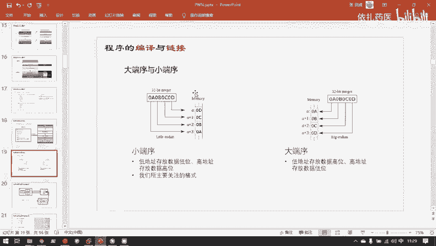
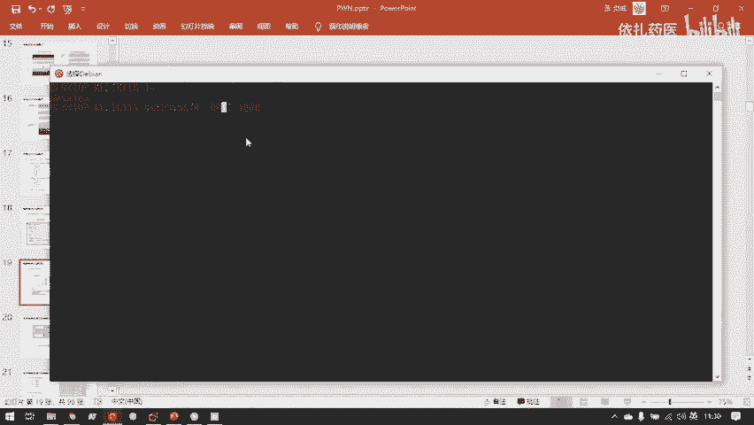
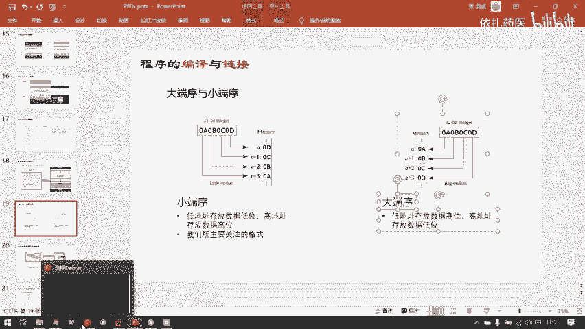
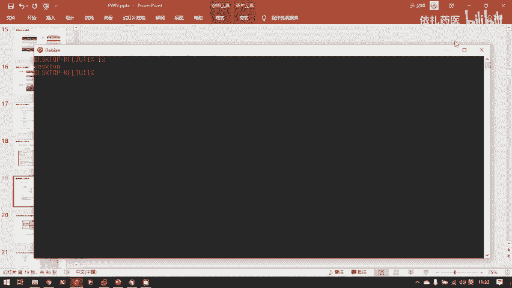
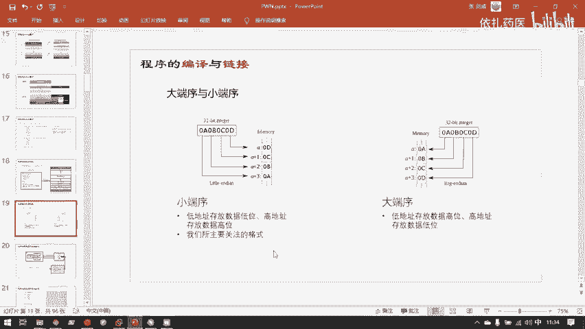
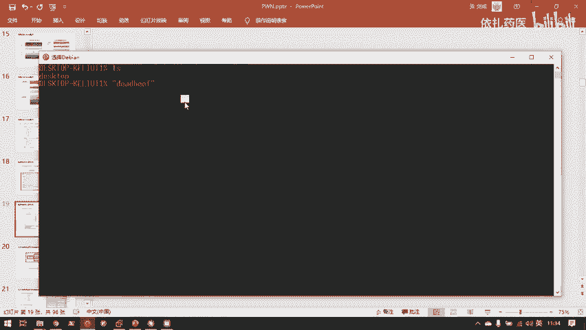
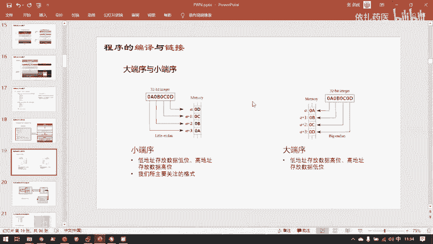

# B站最系统的护网行动红蓝攻防教程，掌握护网必备技能：应急响应／web安全／渗透测试／网络安全／信息安全 - P87：4.进程虚拟地址空间 - 跟小鱼学安全 - BV1SF411174M

然后这里还有一个比较详细的图。这个图里涉及到一些操作系统知识我们不用关心，你可以仔细观察，就是我刚刚说到的知识点。就是在磁板上的文件。载入内存。的时候他会把磁盘上的这个ELF的各个section。

也就是节。在加入内存的时候变成段。然后内存就只能断就行了，在内存中操作系统就只管断就行了。这些节都是不需要的。对一个进止来说。然后载入内存之后。

OS就是操作系统会完把这EF根据EF headerEF头里面的各种控制信息，然后把它以正确的方式在虚拟内存中把它分布下来。这个VMA是训内层的一个控制结构。嗯，这就要讲到虚拟内存了，就是。

我看看什么时候讲，嗯，差不多下一张PPT要说了，那就在这里说吧。嗯，早期的计算机它都是运行在实模式的。就是你在程序中用的内存，内存那个值，直接就是你电脑里的物理内存条上面的内存值了。

但是这种实模式运行有个很大的问题。就是。你计算机会特别容易受攻击，也特别容易崩溃。为什么呢？因为你这个类你这个程序一号程序操纵的是物理内存，2号程序也是直接操作物理内存。然后你如果程序没写好。

或者有恶意个攻击者去攻击你。那很容易，我一号程序，我甚至能读写操作系统的代码，对吧？为什么呢？因为操作系统的代码，它的地址就老老实实的放在内物理内存里。然后我此时访问的也是物理内存。

那么可以那我可以很轻松的去通过编写个程序，然后去篡改物理内存的任何地方的物理内存的内容。那我是不是可以就很容易的去篡改了操作系统，甚至篡改了操作系统内核里面的数据，那就导致计算机变得很容易崩溃。

也很容易受攻击。喝一点水。其实也不能讲太快，因为讲太快的话，我现在嗓子有点受不了。然后后来呢。人们为了应对这种石墨式的缺陷，就发明了保护模式。

保护模式就是让你用户所用到的地址全都不是你物理内存墙上的物理地址。就是你没法直接用你一个用户编写的程序去访问物理内存了。你想要去访问内存怎么办呢？你只能去访问操作系统给你的虚拟内存。

然后操作系统再用这个虚拟内存。做一层转换，然后去访问到你所用到的实际存放在物理内存上的内容。因为不管怎么样，归根结底，数据总是要放在内存条上的，只要是放在内存条上，它就一定有物理算地址。

但只是从虚实模式到保护模式，它发生了一个什么改变呢？之前这个物理内存条上的地址，你的用户是可以直接拿到的。但是到现代计算机进入了S386。架构之后。这个物理内存你没法直接拿到，是操作系统帮你。

他已经帮你把这个内存管理起来了，然后你想要你想要去访问内存的时候，他给你一个转换过的虚拟内存地址。然后你只能去操控这个虚拟层地址，而不能直接去访问内存条了。这也是后来的操作系统才补足的一个很重要的特性。

就是你计算机的硬件，它都是应该用操作系统管理起来的，而不能直接由用户所有编写的程序去访问。因为如果用户编写的程序能直接访问硬件的话，会发生各种各样很严重的问题。就比如说刚刚说到的呃。

如果我此时能绕过我的windows，我编写一段代码，我能绕过我电脑上的windows，我直接去访问我的摄像头的话，那会发生什么？那我把这个程序发给你，你不知道这个程序你写了什么，你只要运行这个程序。

那这个程序就可以不经过任何人的允许，然后直接调入摄像头，然后给你给你来一张自拍，然后就变成你的黑照，我就拿到了一张黑照，这是不行的。所以呢现在操作系统设计都是。操作系统。替代程序员管理了所有的硬件。

然后程序员想操控硬件怎么办？操作系统就提供给了程序员各种编程接口，也就是后面会讲到系统调用。你要操控硬件，你就只能通过系统调用，然后去操控。系统调用就是操作系统已经抽象好的一个接口。

你要怎么操控这个硬件，只能经经过操作系统已经制定好的这个系统调用规定的规则来操控硬件，而不能直接去访问它。当然内存条也是这样。嗯。😊，这里所以说到了虚拟内存。每一个程序它都有一个虚拟内存空间。

比如说我现在一台电脑。我一台32位的电脑，好，我有台电脑比较老，它的CPU还是32位的。然后我装了一根4G的内存条。这里还有一个小屁，就是32位的CPU，它最多只能支持4G的存条。所以那些上古电脑。

你给他安8G内存实际上是PO没有，因为它CPU根本就没法寻直让它的空间。但是现在就是四位，他的虚求空间已经达到了。哦，几百万TB，你可以算算22的64次方是多少F。然后就是64维电脑的虚拟中心。

当然这个空间目前已经远远超过了我们硬件的需求。所以之前32维电脑那种4GB的限制是没有。担忧的了。嗯，这里还提到一点，就是为什么有一些文件系统它不能放单个超过4G大小的文件呢？就比如说face32。

这也是因为2的32次方。二的32次方字节等于4GB。因为它的寻址中间只有32比特，那么它的能。能表示出来的地址的个数，也就是色及个，也就是4。嗯，46个0，也就是。400万没错。嗯，在学胖的时候。

我们也都是由32位开始的。因为64位是向下兼容32位的，所以我们从32位比较简单的情况来学，胖是完全没有问题。因为是32位，我们刚刚讲过，那么我们最开始研究胖的时候都在4GB的空间里来研究了。

对应32位的。呃，32位的情况也是每一个进程，它都有1个4GB的训拟性空间。我这里可以画一下，但向大家表示一下这样是一个怎样的情况。嗯，我电脑此时装了我32位的上图电脑，装了一根4GB的内存条。

这是我的问理内存。但是我这4GB的内存条出现了个问题。我现在每运行一个程序，我操作系统就会给这个程序分配4GB的虚拟内存。那我运行两个程序，那还得了，那两个程序是不是就要8GB的？实际上不是这样的。

虽然程序员看到的就是程序员在编程，他编写个程序，这个程序最后变成进程嘛，这个进程就会拿到4GB的虚拟内存了。他编程的时候他就知道我有4GB的空间可以使用。然后他在编程的时候，他可以任意的使用这4GB。

但实际上在运行的时候，这4GB是虚拟性空间。我此时有两我内存条。内存条只有这4GB的物理内存，但是我有两我比如说我此时开的两个进程，这两个进程每个进程都有4GB的虚拟内存空间。

当然这个4GB只是提供给程序员用的一个，它只是仅仅是一个呃地址空间而已。它并不是实际的内存。内存空间。所以程序员为什么要这样的4GB的虚拟内存呢？就是给程序员，他在编程的时候。

他就可以仿佛他拥有了整个4GB的物理内存。他不用考虑物理内存分配的问题，分配的问题全都交给操作系统来管理。然后就解放了程序员的双手，同时也保证了物理内存的安全性。呃，那为什么这2个4GB能塞进。

加起来等于8GB却能塞进这1个4GB的物理内存条里呢？就是因为你的程序实际上并没有把4GB用完啊。比如说我此时你看一下。我先退出啊，我此时这个simple点EIF。这个可执行文件对吧？

你运行它它也会获得一整个4GB的虚拟币的空间。但它实际它只有多大，它只有17KB。1个17KB的程序却又获得了4GB的虚拟存空间。我们当然不需要把这4GB的虚拟内存。

大量那那么这4GB绝大多数地方都是000000全都是空的，只有这1期K以有一些内容。当然还有一些其他战段文，那也也有一些内容，不过不多。大部分都是0000。所以呢那这4GB我只是这个程序看到的是4GB。

它实际上4GB只有很小的一部分，它真正有数据。这个。不自动对齐。那那就大概这样看吧，他只有这一部分17K。那我就目前我就先按17K来讲。4GB的去年分空间，它只有17KB，实际是占用了的。

那么实际上那就。供年层中就只用划分17KB来保存我这第一个进程的内容就行了。所以呢我不管开多少个进程，我只要这个进程所占用的实际空间没有把这4GB占用完。

那么我就可以每一个进程都给他4GB的虚拟运戏空间。这是完全没有问题的。因为它实际占用多少，它才会在物理内存中分配多少。所以呢我们所看到的每一个程序，你包括刚刚在记B中，你也可以看到。你看到他的这个空间。

1个17K的程序，你看它的地址空间从哪到呢？它是从0叉400到0叉7月份这应该这大概有几个算算。真应该有好多TB了这已经。好像有上千提笔这个空间。但是实际上这个程序只有17K。就是因为这上千T。

你看到的这好像它占用了整个空间，从这儿开始，到时候结果有上千T，但实际上并没有这么多。这个上千T只是给你程序看到的。实际上在我内存条中占用的就是这小小的17K而已。

所以我们在GDP中看到的这全都是虚拟内存，它全部都不是你物理内存条上的实际内存。嗯，再者就是还有一个知识点。我们也以看到。从开头unused一直到tack这里。上面还有for kernel。

这部分是操作系统代码。那么我们有必要为每一个进程都拷贝一份操作系统代码吗？没有必要啊，操系统代码在物理的程中再入一份就行了。所以实际上物内存是这样做的。对于32位的程序。

他有他4GB的虚拟内存虚拟地址空间。他留了对于lininux来说，它是留了3GB。给用户空间使用，就是用来存放用户的相关的数据。然后它又有E级B。是在用来存放操作系统的代码。但是这就有问题，操系统代码。

我问你内存实际上装装一份就行了。并且仓系统内核的代码是不会由于用户代码而改变的。所以我操系统代码，虽然你看我每个进程都是4GB，我的4GB是这样构成的。但是因为我操作系统代码只有一份。所以我其实大量的。

进城的虚拟地址空间。他每一个虚拟每一个健全的虚拟技术空间，这三GB是他自己的，每个人都不一样。但是这最上面的一级B大家是共享的。他长得漂。内核的这部分是共享的。剩下的3G币是每人一份。

然后这是你在操作系统看到的操作系统给你抽象出来的虚拟内存。这就是虚拟内存的形态。然后物理内存是什么呢？就是你的这根4G内存条。嗯。嗯，这里还有几个比较重要的知识点。其实胖的这些知识点。

要是要完整的了解的话，其实需要非常久。所以其实这里目前讲的只是最重要的，但即使是最重要的核心知识也是比较多的。胖学胖的时候跟web就是web webb，我最开始早期我也搞过一一两年的web。

然后我目前的体会就是webweb在CF中的web攻房，就是它比较求一个广度，就是你要见多识广，你什么样的动作都要看过。然后漏洞了解数量是要越多越好，这是web的晋升的方向。但是胖它不一样。胖。

比如说C语言的内存漏洞，它总共也就是那几种。但是这几种你要把它透彻的了解，熟练的利用，它涉及的知识是非常多的。所以胖它主要是。向深处学。嗯，外边漏洞主要是求一个广度，然后二进制漏洞就是求一个深度。

二进制漏洞的种类远远不如外边漏洞更多。但是你要钻深的话，你一个漏洞你会学好久。这也是说我觉得是二进制漏洞，说就是入门要比呃外部漏洞难的一个原因。就是外b漏洞，你学会一两个漏洞很简单。

但是你重点是要学会更多的漏洞。但是二进制漏洞，你就是它漏洞不多。但是你要把这几个漏洞学透彻，需要很大量的时间和很厚实的基础才行。嗯，在健成的虚拟地址空间中，其实物理内存也是一样的。

它地址编码单位是自己的。我们知道计算机数据存储的最小单位是比特，一个比特它只有两种值，就是零和一。每8个比特组成了一个字节。为什么叫字节呢？因为早期的计算机它是是用8个比特来表示一个字符的。

为什么8个比特表示字符呢？8个字比特总共只能表表示。256斤。情况为什么8个比特用来表示字符，那汉字啊那些怎么办呢？最开始谁最开始这些没人管的，因为最开始计算机发明在美国。

美国人只要管着他们能把他们26个字母和他们几个常用字符表示出来就行了。所以他们就说8个比特已经把我们的ABCDE和G啊百分号什么全表示完了，那就行了。😊，所以巴比特成为了最开始的用来表示文本文件。

的基本单位，也就是一字节一拜。当然，现在的计算机因为计算机发展起来之后，最开始发明计算机的那群人真的只是想拿计算机，就是真的只是想拿它算个数而已。谁都没想到，后来计算机会发发挥了这么大功效。

所以后来呢计算机需要表示各种各样的多元化的数据。😊，自然自然而然的各个国家计算机发展起来了，也要也要要求计算机有表示各种不同语言字符的能力。所以后来就。表示字符的基本单位就不再是以b了。

也就不再是一字节了。现在比较普遍适用的是叫unicode。然后unicode的最常用的一个标准是UTS8。UTF8呃最长是16个字节，比如说汉字。他就会用16汉字范围，好像最多是16个字节表示一个汉字。

然后UTS8还有unicode的是向下兼容阿斯柯玛的。这个具体大家有兴趣可以了解一下，这个中间的过程也还有些复杂，这里也与客人关系不大，就不展开讲了。就是讲一下这个e拜，它是来历是哪里。

所以呢因为bete就成为最开始的数据内容表示的基本单位，那么就一直沿用至今嘛。那么自然而然的地址的它的编码用比特实在是。比特的话，那地址空间就要缩小8倍，因为巴比特才是一半。

并且实际你在数据操作中用到的比特情况是不多的。比如说你写一篇文章，你就英英文用阿特玛写一篇文章，比特的意义也是不大的，而是每巴比特组成的一个bit，它表示一个字符才有实际的意义。

所以编码的基本单位就变成了be。点错了。信息这里可以看到，其实这些十六进制的地址值。他的后面如果要标个单位的话，那就是拜。那比如说这个文件头与数据段，他们俩之间的距离也是1000个字节，1000百。嗯。

再者就是石6禁制。计算机的底层都是数码。因为计算机因为物理计算机都物理特性，所以计算机对二进制的执行效率是最高的。所以计算你的CPU你的磁盘，你的内存都只认识零和一。

然后他们以非常复杂的方式去组织这些零合一，让他呈现了我们看到的各种各样的内容。零和一才是计算机中表示内容的基本单位。但是人看零和一是不是特别费力，我要去解码一段零和一的数据，给人看的眼花缭乱。

所以呢您和一往往会编编码成在屏幕上编码成人能认识的样子。比如说这些字符，还有一段视频，一个图片，它都是一长串零和一。然后经过特定的程序软件解码之后，在屏幕上以像素点的形式呈现给你。嗯，对于二建制程序。

那就有问题了。二建制程序怎么肉眼呈现给你。二建制程序是用来给CPU用的，是用来执行的。所以那我们要研究日建制前序的时候，那我们只能去研究最本身的本最本质的零和一。但是零和一我们看起来又太麻烦了。所以呢。

我们一般在二进制里面会把零和一写成16进制样子。嗯，我们都知道就是。0000这样这是一段二级的数。最低位就是一。这是2。这是4。就是8。就每个一我没有往前进一位。它就是二的N次方，然后N加乙。

所以一我再加个一的话，它表示的值就是16。所以十六进制。能表示16种情况，我四位二进制是不是也能表示16种情况，我我改变成四位二进制的某中某四位二进制中的某一位，让后它变成零或者变成一。

它能表示成16种情况。十六进制呢就自然了。既然是16进制，那它的基本单位就是16种情况嘛，从0到9，然后ABCDEF总共16种情况。所以直接的1个16进制的数字。它直接对应的四维二进制数字。

比如说0000它对应的16进制就是0。然后1111它对应的16进制数字就是F或者16进制标准写法应该写成零叉L，或者你还可能看到是FHH就代表是16进制值。所以二进制翻译成十6进制或者16进制。

翻译成二进制的话，你就以4个4个二进制为单位就行。那么此时0叉3C，我要翻译成二进制的值，怎么翻译呢？那就是把它转换成。你叉3。然后后面接着。唔叉 c。那0差30叉C分别值是多少呢？0差3是0011。

一加2，因为这位就是二的2的1次方，一这就二的0次方，所以0011就是0差3。然后C呢就是C是12，12是8加4，所以是1010。我看我都弄对了。第一08加4哦，这里写错了，是2第10名。

所以就把一个0叉3C转换成了二进制，在计算机存储器上存储的样子是00111100。这就是16性质转让性质的一个过程。相反的就可以得到二进制转16进制的过程。嗯，又一个小时了，我们再休息几分钟。嗯。

时间差不多了，那我回答正题。刚刚说到哦刚刚说完那十六进制的转换。Yeah。然后刚刚在讲。去内存部分的时候，已经说过了应用空间和内核空间。所有进程共享的。在物理层中的实际分布。这里还要提到一点。

就是动态连接库，其实在物理群中也只是装载了一份的。大家先在这里先留一个印象，到后面会讲到。然后刚刚说到了，因为二的32次方等于。232次方字节等于4G字节，也就是4G比。

所以3热位的进程虚拟空间也只能寻指4G比。所以刚刚的分布已经说过了，linux下高于GB是。高于GB是内核空间，然后低3GB是用户空间。windows windowsows策略是不同的。

windows是2比2。windows给了2GB给内核空间，然后2GB给用空间。什么是内核空间和用户空间呢？用户空间就是用户所写的代码。还有相关的数据存放在用户空间，还有控制用户程序执行的相关控制结构。

比如说站。这样的结构都是在用户空间，然后这1GB的内核空间放了什么？就是放了内核操作系统内核代码。这些内核代码刚刚讲到了，因为操作系统要代替用户管理所有的硬件。所以这里面代码其实大部分内容都是在。

进行硬件管理，还有用户进程的分配调度。然后后来经过计算机的发展，然后大家觉得4GB怎么够用呢？硬件的飞速发展，然后就直接扩展成了64位。的。空间。嗯，这里32位和64位。是什么呢？就是你可以理解成。呃。

它的专专有名词是叫机器自成，就是它的计算机CPU的它的总线的宽度，数据总线、地址总线这样的宽度，就是它一次性能从内存中向。CPU中传送的数据的量。你可以理解成。内存到CPU有一条大路，有条马路。

这个马路越宽，是不是能同时通行的数据就越多？那么这个马路的宽度是32，那它就是1个32位，那它就可以说是32位的。它的宽度就是32位，然后6是4位级那跟马路的宽度就是64位。那为什么呃35和64位。

它寻址空间差这么远呢？就是因为。你宽度是64位的话，你同时传输一次2的64次方。他能表示的就是264次方就是。成千上万TB种情况，然后每一种情况代表一个地址化。

那么就是使得地址总线能传送成千上万TB总地址值。所以地址总线能表示的情况变得非常多，所以直接导致了64位它的地址空间这么多。但是30位它的地址总线地址总线也是是CPU与内存的其中一个连接。

30位的地址总件只有2的32，它只能表示二的32。四方这种情况，所以他的地址空他能寻址到的空间，也就是对应的大小4激比。因为64位实在是太大太大。

所以你可以看到这里有一个跟32位不一样的32位的4GB全部用到，就是全部每一块区域，它都可以说它是在哪。但64位这有一个unfin region，就是未定义的区域，因为实在是太大太大了。

我们目前128TB就够用，所以呢给了128TB的curspace和128TB的user space。这也是最开始自机设计者。大家不仅没有想到计算机之后会发发展成为有这么强大功能的一个日常工具。

并且也没有想到是计算机的硬件进化会这么快。就开始制定了4GB类型。大家都在想，天哪，4GB这怎么用的完，然后计算机的发展速度分分钟打你，4GB很快就不够用了，所以才扩展了64GB的基础空间。

我们现在机器都普遍的是64位的，目前32位的机器基本绝迹了。然后可以看这张图，就是比较详细的解析了一下这64GB中不同区域对应的功能。这等一下每一块的功能也是会展开说在这里大家先了解一个整体架构。

t动态存储区，也就是动态存储区，它就是并不会写死在存储在你磁盘上生成这个进程的那个ELF文件。匿名它是在载入内存之后，它动态生成的数据。写死在程序里的数据，就是下面的静态存储句。

也就是对应的你EF文件里的。数据区和代码区，还有相关的控制区。动态存储区主要是tep和t。 stack是进行函数调用控制流控制的。tep就是提供给用户进行动态内存分配的。然后剩下的这一点。

刚刚这边讲过了，然后这些等一下展开讲，大家可以先看一下。留印象就行。段宇杰。刚说过了断视图和解视图的作用。断是用来给进程，就已经载入内存的程序。是成为了竞全印象。

用来给竞程印象的不同部分来标识它的可读科学、可执行权限的。视图结是用于。在EF文件在磁盘上，还有它生成它磁盘上最终文件的时候，编译链接和存储的时候，结视图用来组织它的文件结构。

断视图用来标识它执行时候呃，该如何执行。斜视图规定了它该如何生成和如何存储，可以这样理解。所以它存储和生成的时候，就只关心它的结是怎样保存的。然后到它执行的时候，就是相同权限的结就合成一个段就行了。

然后在执行的时候，这些段，然后有相同的权限就可以。然后呢，代码段数据段这样是一个大的概念。在代码段中和数据当中有各种各样的企业。他们实际在进程中，虽然对于CPU来说，他们只有读写执行权限。

他们是一样的那CPU看起来他们就是一样的。但是实际上这个程序它的设计逻辑。在他工作的时候，其实这些不同区域的节他在内群中工作的时候，他还是起到不同作用的。比如即使我刚刚说到t的节就是用户代码和PRT节。

他们对于CPU来说，CPU看他们都是啊你们是一段不可不可写，然后只能执行的代码。但是实际这个程序逻辑不一样啊，就是程序员还有我们反复编的人看到执行的时候，你会发现他们虽然同样都是代码。

但他这两段代码执行的作用其实是不一样的。这次节刚刚说的就是用实现用户所定义的功能。PRT节就是解析动态连接函数的实习地址。可以看到这有各种各样的节。然后我们目前关心的主要是我标红的这几个节ts节。

它PRT节这两个功能你经说过了，数据端也有两个比较重要的节，一个是gst点PRT。这个节是用来保存。用来保存PRT解你的代码解析到的实际地址的，解析到的实际的动态链接的函数的地址。它解析了。

它不能解析了，就告诉你一次就扔了。他解析了之后，它就保存下来，就保存在这里。然后BSS级。这个节比较特殊，它在ER文件中并不占有空间，它只占用类型空间。也就是说它只在类型中占有空间，不在磁盘中占有空间。

至于为什么，现在的等一下下场PPT马上就讲不到。就是。一个程序。我在里面申明了各种各样的变量函数。那么这个程序它是怎样？它在编译链接执行，并且载入内存之后，它的各个部分的数据是怎样存放在这个内存中的？

这个地方非常重要。因为这基本是你要研究一个程序的有什么漏洞。那你肯定要十分清楚的知道这个程序是如何在内存上工作的。所以这部分得非常清楚的了解。那我这有一个举个简单的例子，这有一片C源代码。

首先一个全局变量。这个有C加加基础的同学可能都没有问题。这里定义了一个全序变量，你就印。然后一个全区变量，一个指针，指针指向了一块数据。这个一个这个指认指向一个字符串hello word。

然后这里说明那个函数。函数两个行参，然后函数对应的执行的一些内容。接下来就我们主函数了。主函数这里动态申请了100。零差100个字节内存，然后向它读入了数据。

我假设我这里写的就是我假设它运行的时候输入了一个ddbit。然后主还是返回，就是这样的一个C语言代码。我把它编译链接执行，然后进入内存之后。

那么这些信源代码的各个部分它都存放在这样的一个去内层空间中哪个位置呢？呃，首先。我们从按按按EF文件的数据来看吧。首先代码段和数据段还有BSS这三部分都是EF文件里本来就有的。

只不过BSS它没有实际占用空间，它只是占用了一个符号就是。嗯，在这个EF文件中的控制部分，他告诉你，我这里BSS这里有一个全区变量，到时候要用。所以这个BSS实际上也是记录在ELF里。只是他没有占用。

实际在代码数据段之上没有占用这部分空间而已。首先我们的代码段。代码当顾名思义放代码哈，我们sam函数的实现，它具体实现的机械码，面函数具体实现的机械码都放在pa字段。当然还有一就得放在太。

就是刚刚你可以看到这里。RO data就是这个就是read only data只读数据代码端它目的是什么呢？它能用来标识可执行或者是不可执行，也不可写的数据。redoming data顾名思义。

它不可写。那么他就放在不可写的代码那一起。现在他是数据。但它不可写，所以它依然放在text段。所以我也更倾向于把这个段翻译成text的，而不是code。你要翻译成，他们有时候会写成code段。

我就觉得这个code端里面并不全是code，它有一些不可 write的t。所以我觉得tex段。比较合适。然后接下来就是data端。data端会存放已初始化的全局变量。

就比如说这里这个STR这个指针它是已初始化的全局变量，所以就直接放在了data端。然后BSS段就会放未初始化的全局变量global，然后简写的是GLB。它就存放在BSS段。

为什么我这就解释刚刚为什么说BSS段的代码是不需要占用实际的内存空间的。他会说始化，他在E2F中他就没有值，他只有运行起来，他才会有一个值，对吧？既然运行起来，它才会有一个值态会占用空间。

那就没有必要在EF文件里部它预留一个空间，然后把这段空间都显示零，这样浪费了EF文件中的空间，也浪费了磁盘存储。所以未初始化的全序变量就会放在BSS里。然后等到它初始化之后。

再在BSS段的内存中开辟开辟内存。然后就m look到的这0差100的内存。m look因为动态申请的，我只有在代码执行之后，我的操作系统才会知道啊你这个进程原来你要1000差100的内存啊。

那么此时他执前的他才知道他要1000差100的内存。那这个内存当然就不能放在这些静态存储区了。因为这些静态存储区是持续载入内存的时候就已经确定的大小。所以那只有用hiap这样一个结构。

来这样一个动态存储区来给他提供。存放提供用户申请内存。呃，那么自然而然的我要是往。这个hip里。读取一个字符串的话，那自然而然的这个dbe我输入的字符串也就存放在这个t空间。然后接下来就是比较重要的。

马上就要讲到函数调用站的两个关键结构。第一是你看到为什么这个T。和PTL这两个变量它都不在这下面，他们在站着。这就是叫局部变量，全部存放在站里。因为一个函数的局部变量，当这个函数执行完之后。

局部变量是不是就跟着函数一起释放了？这的作用是什么？这的作用就是。来保存一个进程中函数的执行状态。那么一个函数被丢弃了，那它自然它的函数对应函数对应的栈里面的战争也会被丢弃。那么它的局部变量再也没有了。

所以也要跟着一起丢弃，所以局部变量就放在站里，放在这个函数对应的战争也是很合适的。它会随着函数的释放一起被丢弃。呃。我不知道有没有同学现在有疑问，为什么我此时这个图里。保证里面所有的函数和变量。

函数和变量就统称为符号。这个程序中的符号表记录的符号就是这个程序中的函数和变量。你看所有符号都有，唯独除了X和Y。但是我们有这个疑问，为什么XOY没有写到这个内存分布图里呢？就是因为X和Y它比较特殊。

它是型参。它并不是一个它是一个形式参数，它仅仅在复函数调用子函数的时候进行一个值得传递的作用。就是ma函数调用sm函数。然后他要告诉sm函数，你执行的时候，你要用那两个参数的值是多少，是一和2。

它仅仅在ma函数调用sm函数，这这一一下子它会用到XOY。这样个知。那么XY它就仅仅作为参数传递的时候，内下使用。XOY它具体存放在哪里，这就跟架构有关。呃，32位架构XOY这两个行参。

它也是存放在站里的。当内函数去调用sam函数的时候，它会在创建sam函数的战争之前，先把X和Y的值压占，也就是把一和2先放进站。但64位就不一样了，64位它计算器它扩展的很多。所以64位的话。

XOY此时不出现在。这个去内存空间里的，也就是XY此时根本就不会往内存里放，它会往计算器里放。也就是那个离CPU最近最近，速度最快最快的存储器，它会直接放到那个存储器，然后提高程序的执行效率。

会把直接XOY传到RSSI和RDI两个计存器里。然后s函数就直接从这两个计存器取这两个参数的值就可以了。嗯。稍等一下。一分钟后回来。嗯，大家可以仔细回想一下，刚刚这部分这一张PPT还是比较重要的。

因为的这一部分这就这张PPT上刚刚讲到这个知识点会贯穿所有胖的题目，不会有任何一个题目会避开这个知识点。就是哪一部分哪一部分数据是存放在去年存中的哪个位置的？嗯，刚刚讲到的谁存放在哪儿？现在接下来就讲。

每一个谁他是怎样存放的？这里就涉及到了两种情况。叫大端序与小端序。

这是自然机设计时候一个问题。我比如说此时有一个数字，您叉12345678。这是1个16性制数字，对吧？这个数字当然我们人人看是没有问题的。这0叉12这是比较高的。二周。比较高的位，然后七八是低位。

你可以说80个位，然后这是就相当于十进制的千千万位和个位的关系。那么人看是没有问题，从右往左，然后。依次升高，但是计算机它就会有问题了。我们刚刚说了这每一个呃1间数字，它都是。比如说这个0叉1。

那就是00010叉2，紧接0叉2就是000，不0010。他这样紧接一个一个个一个每思位一个存放在计算机上的。但计算机它的地址空间是有一个顺序的。那么我这个零差最高位的0差1，它。二进制表是001。

然后最低位的8是10000。这是有个问题。我00001它是放在高地址还是放在低地址呢？这就涉及到大单序和小程序的问题。

大端序就是把高位放在低地置，低位放在高地置，小端序就是把。高位放在高地址，低位放在低地址。你可以看到这个图纸展现的。这个0A0B0C0D也是二进制数，16进制数嘛。你可以看到最低位的大然去的话。

最低位的零地就是放在内存的最低的位置，最小内存就是A这个地址，然后最高位的。哦，这小程序说反了。最高位的0A。这个数字就放在了最大的地址，也就是A加3这个地址，然后再来去要正好相反。其实大段序和小端序。

这个本身对于我们漏洞利用的影响是非常大的，为什么呢？最后举个最简单的例子，C语言它不是会有C语言不是会有呃零音阶段嘛。😊。

0查00。明叉明明这样一个值在C语言中是字符串的结束符，对吧？然后这里会有个问题，小段序的话，其实小段序的程序更容易被利用。为什么呢？因为一般地址它是填不满整个地址空间的。比如说我32位。

我总共是00000000。这么长的地址宽度，然后我现在有一个地址是4，随便打一个数字，2445。那么这个45就在低地址，23在高地址。我如果从他的更低地址，我溢出溢出数据。

然后我试图覆盖这个2345这个位置的话，那么我就直接从因为数据总是低地址往高地址写了嘛，我从后往前就直接把4五给覆盖，然后2三给覆盖了，覆盖成了我想要的。并且如果我利用这个漏洞，是因为。呃。

程序把这段连续的内存FF还有后面这段低地址的内存全部都识别成字符串的话，我就可以从它识别的位置开始，一直溢出溢出，一直溢出到他0明，他看到了一个高位的00。然后他说这后面更高的地址都不是字符串。

因为他已经遇到了00，代表这个字符串结束了。这小弯序，我可以直接从一个字符串往上一出就行。我从低地址往高地址一出就行。但如果大单序的话，那就不一样了。大单序它的2345，它是反着存的，它是45。

然后23，然后1000。那么我再从低地人往高地置溢出，并且因为是一个字符串漏洞，它溢出溢出溢出溢出到遇到第1个00。好，他就无法继续溢出了。因为这第1个00就告诉他字符串结束了。

我就没法碰到这个4523，我就没法篡改这里的数据。所以小端序其实要比大端序。更容易利用。

呃，谢幸的是我们目前的。大部分遇到的几乎我很少遇到大程序的题目，几乎没有遇到过，所有题目都是小程序的。所以你们主要是记住这个图。一个二进制数据，它是以怎样的形式在内存中存放的？高位放在高内存。

低位放在低内存。对于字符串和整数都是这样。

字符串有一个道理，比如说此时有字符串DABBEBS。然后呢，那F如果小单序的话，那F就存在最低的内存最低处，然后一存在第二D，然后依次加一内存加一内存加一内存加一，内存加一内存加一这样。

