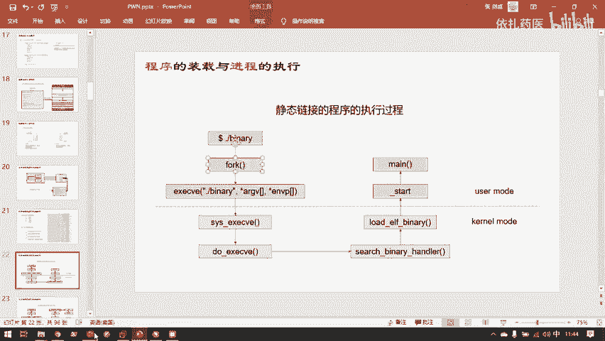
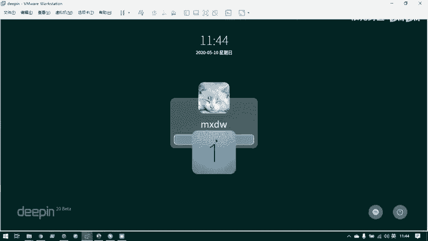
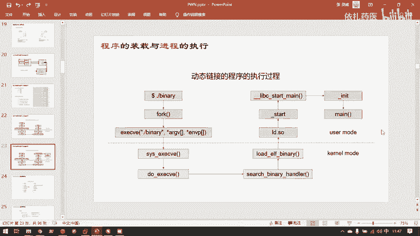

# B站最系统的护网行动红蓝攻防教程，掌握护网必备技能：应急响应／web安全／渗透测试／网络安全／信息安全 - P88：5.程序的装载与进程的执行 - 跟小鱼学安全 - BV1SF411174M

嗯，讲完了存放的方法，接下来就是程序是怎样与。整个电脑的硬件进行交互执行的。其实1个CPU加一个内存，它就能完成计算机的基本功能了。剩下的都是可以说是一些外设。

比如说显卡它并不是很需要CPU其实就能完成显卡的一系列工作。只是显卡计图形计算能力要比CPU强很多而已。显示器也是一个可选的外设，为什么要显示器呢？我只是让它算一个数字，然后打成质带给我也可以啊。😊。

还有键盘鼠标，这都是可选的一些输入外设。计算机的最核心的本体只有内存和CPU而已。然后内存和CPU呢就通过地址总线、数据总线和指令总线。进行数据传递。地址总线就是CPU要告诉。

内存我现在要取理哪块地址的内容，然后内存就通过数据总线，把这块地址内容给他送回去。然后还有控制总线，就是传送指定。然后然后具体的执行就是内存中保存的实际的代码数据。

就是这里的codecode展开之后就是这个样子。比如说他此时在执行这段汇编代码，其实他执行的是机器码，但是机器码就是汇编代码换一种写法嘛，所以这里写汇编方便我们人认就行。然后同时CPU里有一个计存器。

PC计存器PC计算器是一个代号，它实际的名字对于不同的。指令级的CPU不一样。比如说叉6就是呃。EIP然后叉64就是RIP。PC智能器总是存放它叫process counter。

它总是存放当前指令当前执行指令的地址。就是他指向了此时代码执行执行到哪个位置了？然后这个计算器在哪呢？刚刚已经说计算器是离CPU最近的，也是速度最快的驱属器。计算器就在CPU里面。烫死了。

在CPN里面一个固定的位置。然后有好多个计算器，其中一个就是指令计数器。这个PC实际是存放在这里的reister。然后不断的通过这三个总线交互传递数据，同时指令计算器不断的加1加1加1。

然后一条一条指令的执行执行执行。最后完成嗯code段所规定的功能。所以内存记录了你要干什么和CPU要干什么，和CPU要干这些东西所需要哪些数据。然后CPU就是把它规定的任务给完成这样一个组件。

那我们来看一下这块计算器展开的详细结构。呃，目前是大家通用的是大家电脑其实都是MD64的，没有基本不会有其他的架构。就是你此时你的电脑，包括我给的那个d拼的虚拟机，它那个系统的架构也是MD64。

M64向下兼容叉86，但是我们学胖入门的时候学习的都是叉86，也就是32位的。32位的英特尔最开始发明的一个指令机，然后后来呢不够用了。M是MD公司。首先。把32位扩展成64位。

然后这个架构所称为AMD64。但是因英特尔它肯定不能显着，它紧随其上。然后他把自己的64位成为叉8664，也就是扩展成64位的叉86架构。但是64位架构，不管是叉8664还是MD64。

都是向下兼容叉86的。64位的继存器，他有为那张图。它的第32位都直接就是32位的计算器了。你要问32位的计算器长什么样？其实就是这些就是右边的这第32位的那种。但是有一些是不一样的。比如说。

对于叉86这些比如说R9R10这些带数字的计算器，它第三二位对应的3二位计算器，其实叉86是没有的。但这些什么RAXRBX对应的EAXEBX这样通用计算器就直接是32位的计算器就行。

不过其他的我们用到也不多，其实主要研究的最重要的研究的，我们只有只研究几个计存器。RI我们这里就按64位来讲。一个是RARA就是刚刚说到程序技术器，也就是个PC。啊。

64AMD64架构的PC就是RIP它总是只存放当前执行指令的地址。2SP。存放当前战争的战比地址，然后像EB啤酒站争占底的地址。战争是什么？这个马上也会讲到。

2X这里挑的通用计算器里面一个最常用的通用计算器来讲。像RARAXRBXRRCX这样的计算器，它都是通用计算器。就说你拿它干什么都行，你来其实他想存放成什么数据就存放什么数据。但是这些脱文题能器的。

它有一些约定约定俗成的应用场景，就是这编译器上约定俗成的，会用这个计算器干什么事。比如说RAX就是编译器会默认的用这个计算器来保存函数的返回值。比如说你写了一个内函数，然后你return到了一个名。

那这个零就最后是在内函数return的时候，然后我们也把它放到IX，然后反馈给调路mate的内函数。这里就又要说到刚刚说调用类的函数。学C语言和CI加的时候，不都是说ma是程序的入口吗？

但实际上并不是这样，maage只是以用户自定义代码的入口。在执行你规定的功能之前，程序还是需要做一系列措施来初始化内存啊，然后创建程序执行的环境呀这样的大量的。

编译器和仓作系统那些库房里面做的代码都会在ma函数之行执行。当然这部分比较复杂，我们先来简单的了解一下，在媚函数执行之前和媚函数执行完之后，整个程序它还干了什么事？一个静态连接的程序。

它是不需要动态连接库的。他所有的内容都他所有要实现的功能和内容都直接写死在了他这个程序对应的EF文件中。比如说我此时这个EF文件finary。它叫bannerary这个EF文件。他你们有什么他就。

这是什么？😊，计态连接的程序可以独立工作，但动态连接不行。进来链接就是。他在深成自己的时候，他把他所需要的东西都已经拿到了，并且存储在自己。的本体里了，但是动态连接程序是什么呢？这也简单解释一下。

后面要展开讲，大家先有一个印象，动态连接程序就是。他在变译的时候，他需要一些别人的代码。那他就先在这空着，他标记着。他说比如说我刚跟printF，他标记着我这里用到了preF，并且我到时候要去要找谁要。

他说到时候去找谁要，就是到时候执行的时候再去要，而不是编译的时候就把它要过来。然后执行的时候直接用自己的这份就行。这就是动态连接。所以动态连接的时候，他就会先标识着，我到时候我要缺什么，我去找谁要。

然后到他自己真正执行的时候，并且执行到他要用那个函数的时候，他才会去操作系统的文件系统里面找到对应的动态连接库，然后把他要用的代码要过来。然后。放到自己的环境里执行，这是动态的因个。

所以动态连接的程序是不能独立执行的，他必须要求他链接的那些库文件总是存在，它能随时找到，随时把它代码要过来。一个键态连接程序。嗯，是这样的。先解释一下这个user mode和car mode。

胖里有两种胖。curlmod的胖其实就已经比较高级了胖了我们这次培训不会讲到。就是内核漏洞user mode就是用户程序所用户写的ERF所出现的漏洞。cle胖呢就是。nix内核本身也可能出现一些漏洞。

并且往内核上挂载的别人写的第三方的模块也会有一些漏漏洞。然后这就是kidle它。kindel代码就是操作系统自己的代码user。代码就是用户编写的代码，这两个代码对于操纵系统来说是隔开的。

就是他们叫一个叫瑞明，一个叫瑞3，这是他的一个权限的划分。就是用户他的代码都是以低权限运行的，他不能直接访问。硬件啊之类的，这也是之前讲过的操作系统要。担当起管理所有硬件的任务。

然后只有运行在curl mode的内核代码，才能去访问硬件。所以呢你想想一个程序它要执行，它是不是一定要获得内存呢？它一定要得到内物理内存的支持。那是不是就是一一这也是一种访问的物理硬件。

所以呢我执行一个用户他的程序，我必定还是要去找操作系统。因为物理内存是操作系统管起来了。所以。我执行我一个用户下的程序banary，他首先会fok一份。这属于for呢，实际上sha for。

fk这个函数干什么的呢？他就是拷贝当前的。

当前进程的虚拟内存空间。也就是这玩意儿。我先把这个仪器给删掉。我先来解释一下这个第一步是在干什么fork，我此时shall它本身也是一个程序嘛。

我此时就是在我这个shall里头运行了这个simple点EIF。那这个simple点EF是怎么运行起来的呢？是shall这个程序本身，他fok了一下，他把自己的33GB拷贝了一份。拷贝了一份。

然后这3GB是跟他自己的3GB一模一样的。然后这3GB马上不要要被重写，写成我的simple感EFE2F对应的内容。然后复制了3GBfor调用完之后就会申请一个。函数。

会调用一个函数exaive这个函数是动态连接库的一个函数，它是对应系统调用函数的sem exc的一个包装。然后它会调用这个系统调用，也就是cl mode。

就是这两步就是相当于用户它的程序开始向操作系统申请。你你把你管理的物理硬件，你要给我用一遍，这必须经过操作系统同意嘛，这就是相当于在办程序再申请。

然后操作系统就在后台把这个他申请的手续经过这四步处理之后，然后把这个。把这三G笔，然后变成。不再是hell的内容，然后变成我simple点ELF的内容，然后把这3GB就告诉你这3GB准备好了。

你可以去执行了。然后就进入了。我 simpleple点E2F的star。😊，这一段代码star这段代码其实它不是C言代码，它是叫汇编。因为这样的程序数始化呢，比较底层的功能都只用汇编实现。

star这个符号其实才是真正的程序入口。然后在star调用了，然后还有inli函数，那些数始化函数准备好了环境之后，然后才会给ma函数。真正的执行在面函数之前执行的star。

它是会它的主要作用是来准备程序执行执行的环境。然后断连接就比较多了，断连接因为还要准备，就是到时候像。其他动态连接库拿要拿代码，所以它会多一个链接器。就是这个玩意儿是干啥的呢？

这个ID点so它就是用来管理，就是第三方。第三方库代码。的借还的。就比如说我需要向第三方扩代码，我此时要借一段代码，我要来执行。就得通过他来实现。它相当于一个中介，他把libb C的代码。

然后传给此时的进程使用。然后还有一个就是因为动态连接的程序，所以他准备工作要更多。所以在12之后，它会执行内b C中的另外两个函数。当libb C star，然后执行in。等所有的环境准备完。

然后能放能借代码给你的link个C页准备好之后才会再执行媚函数，然后才真正的开始执行你程序所实现的功能。

