# B站最系统的护网行动红蓝攻防教程，掌握护网必备技能：应急响应／web安全／渗透测试／网络安全／信息安全 - P8：蓝队应急响应-7.抑制、根除、恢复阶段 - 跟小鱼学安全 - BV1SF411174M

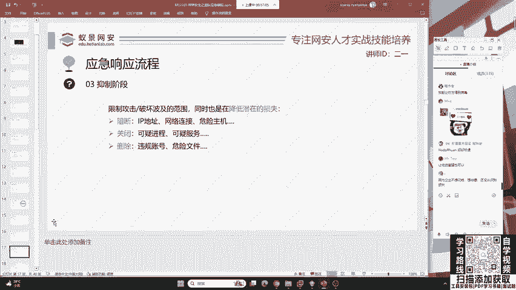

第三阶段是抑制阶段。抑制阶段呢就是说咱们红队在攻破之后，他是需要花时间再去攻破内网的。在这个时间段呢，我们就可以去阻断。比如说它的IP地址，它的网络连接，去关闭它的可疑进程可疑服务。

去删除它所创建的危险文件以及违规账号。那去做这件事情，就要求我们要去排查到。

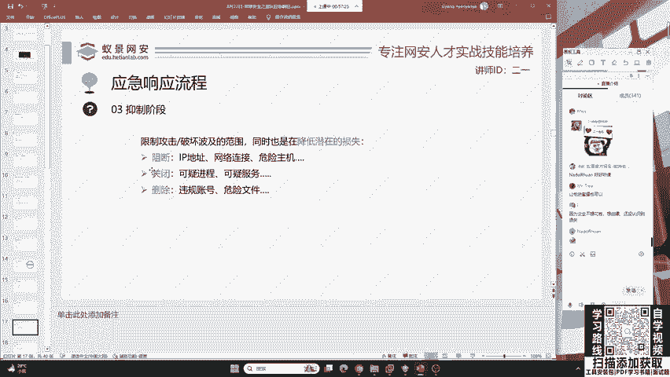

黑客或者是红队，他会把木马病毒放到哪里？那这些怎么去排查？我们今天啊在都会给大家举一个简单的事例，一会儿啊我们一起来分析一下。

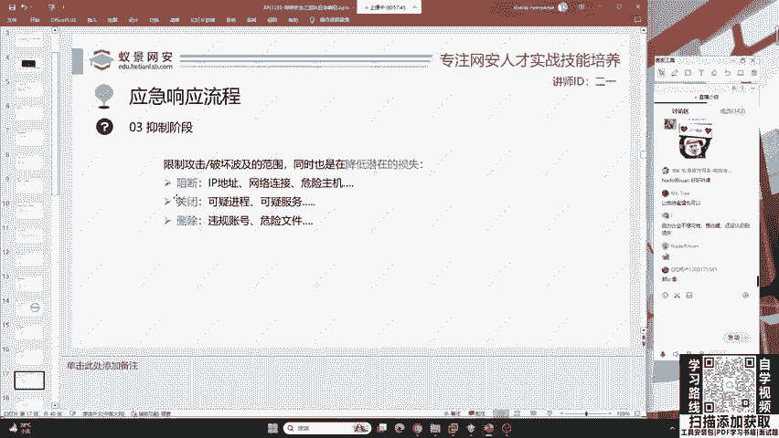

好，那其次呢就是说我们在防御之后。

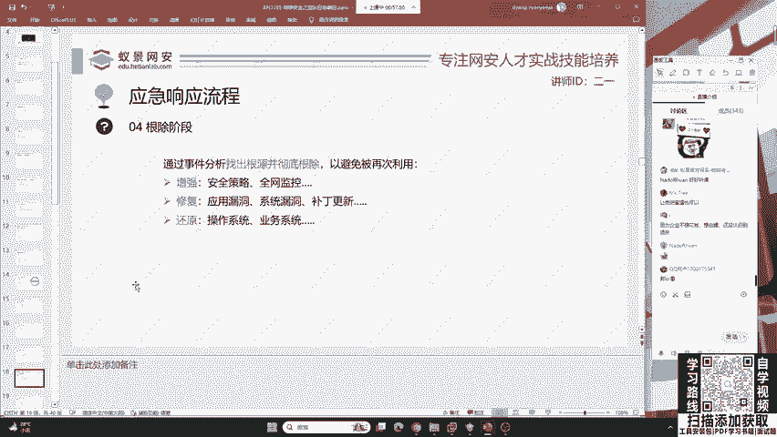

红盾呀，他通过这个漏洞，通过这个漏洞之后干什么呀？他通过这个漏洞打进去，如果你现在把它传入的木麻删掉了，结果呢你不去找根源，你不去溯源，你还会伟大。

，你被你删了他立即搭进去。所以说呢我们必须要去分析这个事件。你要是啪你把电源一关，那完了，那别人的东西都没了，链接都断开了。那你想去溯源都没法去诉，所以说呢要找到问题的根源，并且去增强修复和还原它。

这是非常重要的。就像中了勒索病毒一样，你不用担心一般的企业他都有多个备份，就是说我在中了勒索病毒之后，第一件事情就是想办法去恢复备份。但是就如同刚刚有讨论区的同学说的一样，有的企业他不在意。

他觉得我就不备份，你现在让我一年花这几十万几百万去做这样一个业务的备份有什么用呢？我觉得我不会被打，结果被打了。😊。

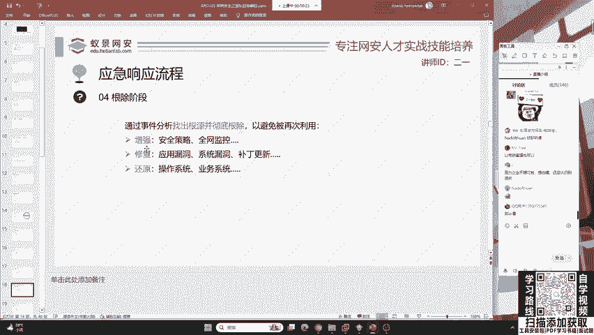

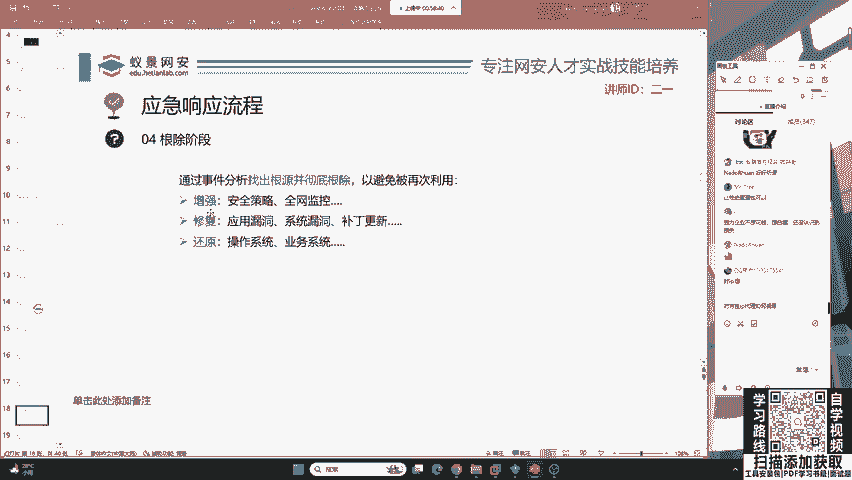

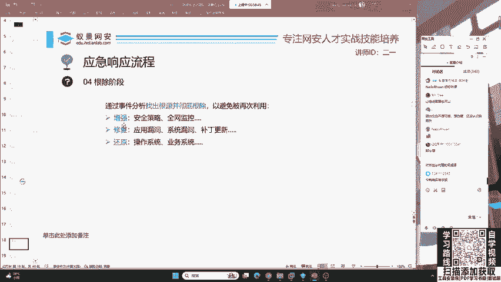

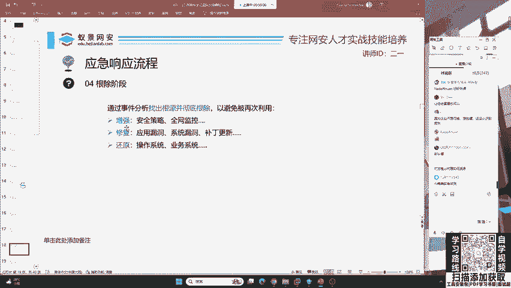

不就凉了是吧？所以说啊咱们这个应急响应是一个从攻击前到攻击时到攻击后的一个整体的流程，是非常繁琐的。你涉及到的技术面很多。你现在在说现在键盘上撒打米鸡都能做。那我觉得这完全就是一个调侃的行为。

我们是需要学习一些知识的。除非就是说你做一个非常初级的蓝队啊，这是大家都不希望看到的。😊。

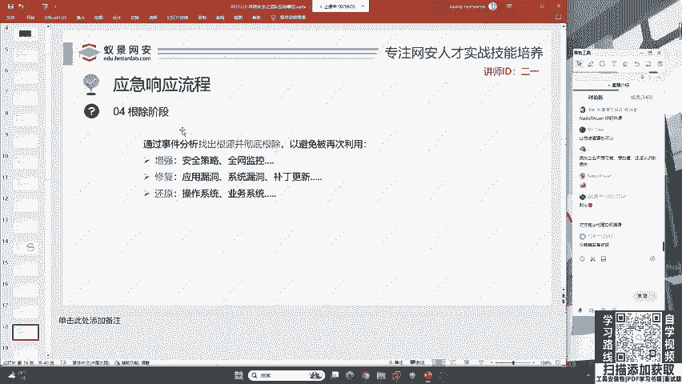

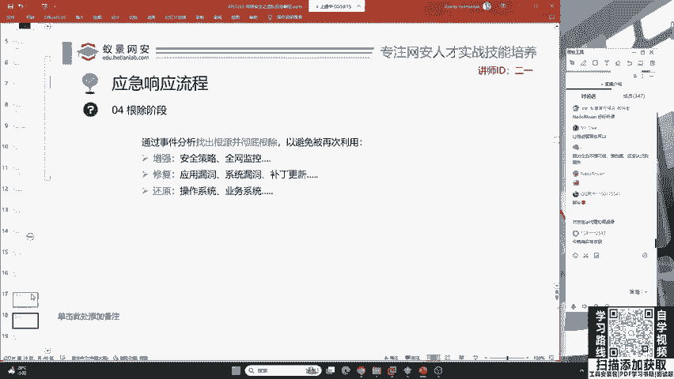

那其次呢就是说我们要把这样一个业务恢复到正常运作的状态。比如说恢复业务系统，把删除的数据恢复，把断掉的网络通信也得以恢复，这是最后的一个恢复阶段。

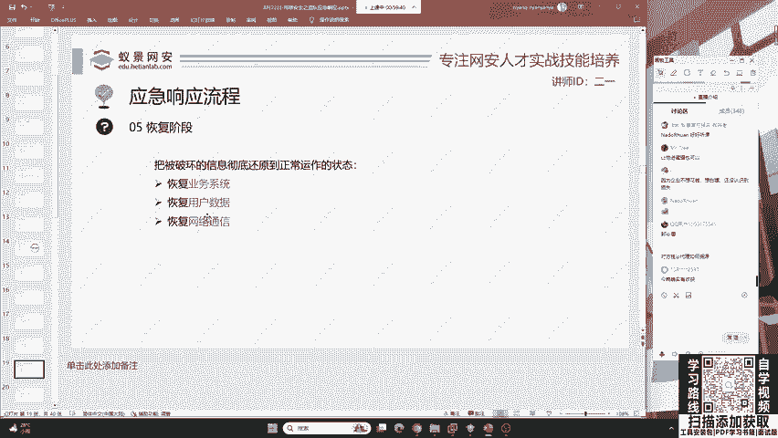

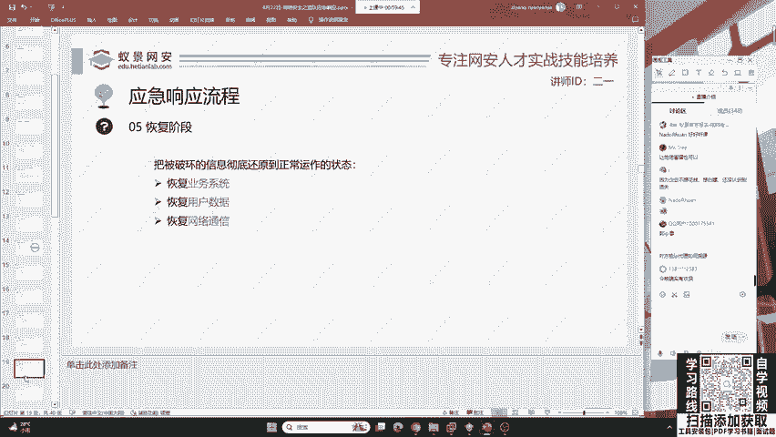