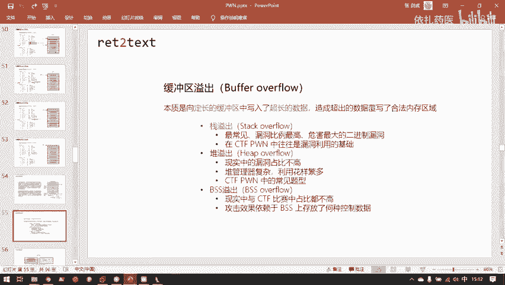
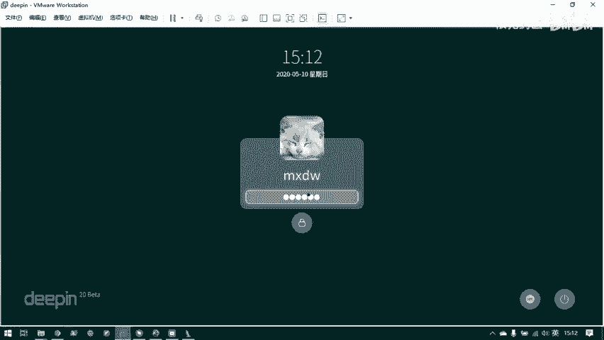
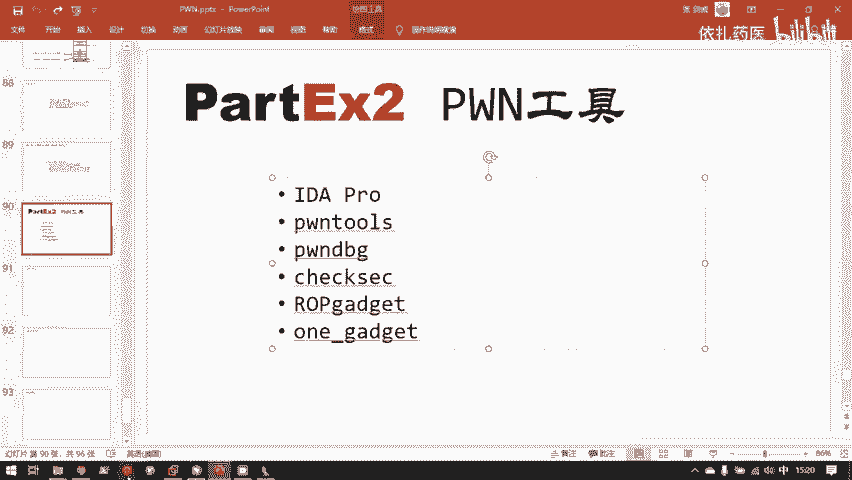
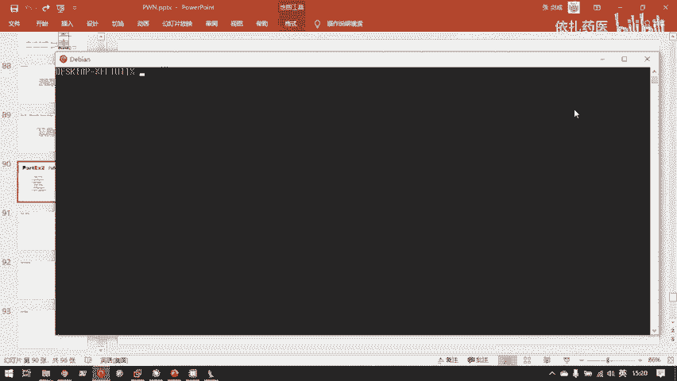
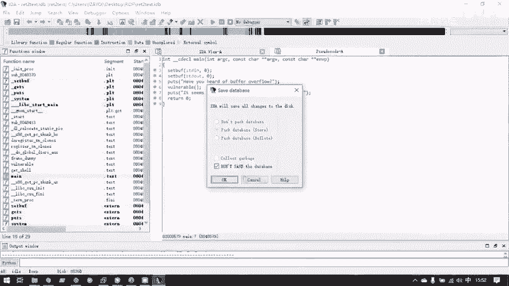
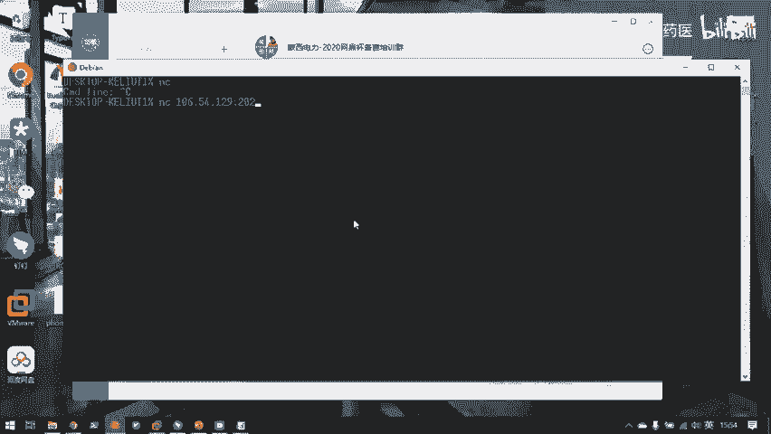
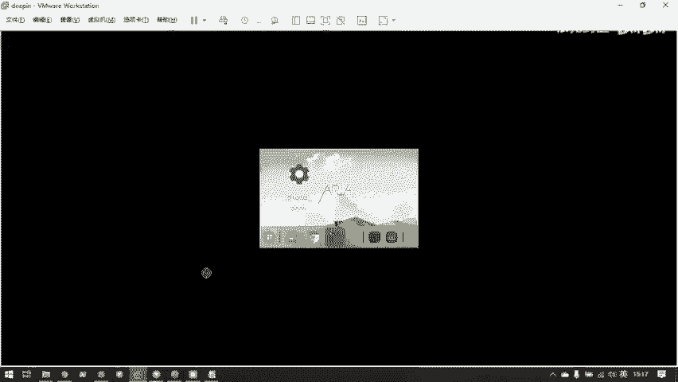
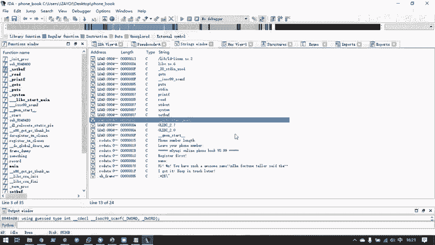
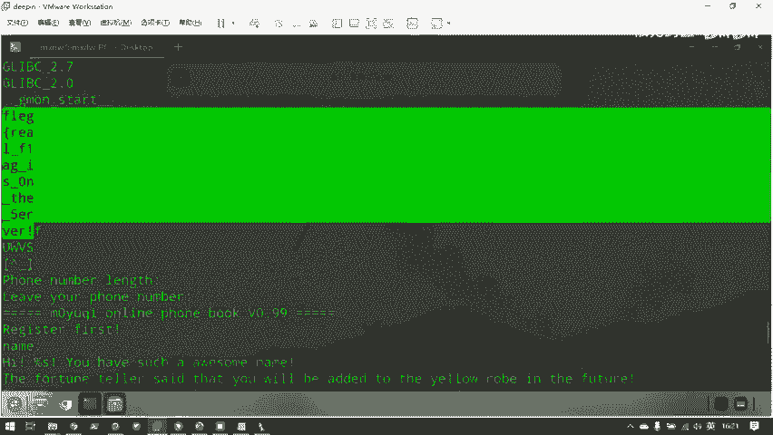
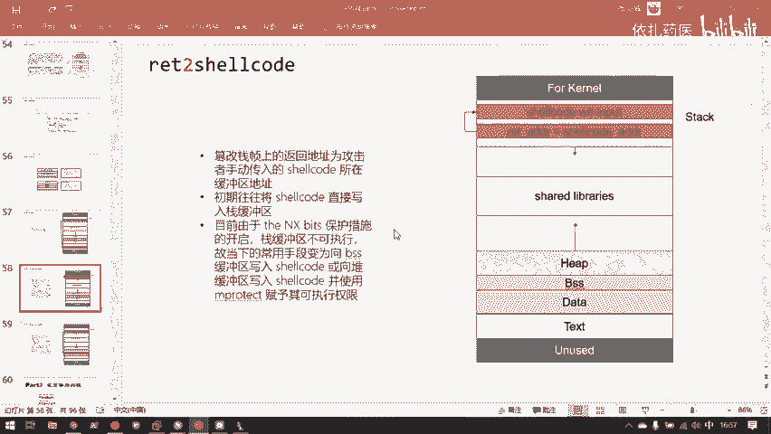

# B站最系统的护网行动红蓝攻防教程，掌握护网必备技能：应急响应／web安全／渗透测试／网络安全／信息安全 - P91：2.ret2text - 跟小鱼学安全 - BV1SF411174M

嗯，然后呢，这就是站的简单的工作流程。其实站还有很多其他的一些。就是额外的一些工作的规则。嗯，目前就是只是最基本的战役出，我们还暂时没有讲到。到后面提升的时候也可能会说到。那我们就仅仅看这最简单的情况。

回到我们战役初的攻击的主题。就是在这样一种这的这样一种工作模式下，我们怎样利用它的漏洞，然后对程序进行截持呢？嗯，首先要想一下，我们攻击一个程序的最终目的是什么？最终目的是获取一个shall。

这是一般我们攻击的最终的目标，就是获取shall。因为只要有shall。我们就有操纵呃我们攻击的服务器的一个控制台。有了这个控制台，我们就可以对它为所欲为了。所以我们要获得一个shall。

我们怎样获得一个shall呢？我们反而把这个流程推一点。既然要获得一个shall，我们就需要控制程序的执行流。就是这个程序本来老老实实的按自己所编码的指令在执行。但是因为我们一些恶意数据。

我们让他偏离他原来执行的方向，然后去执行了我们想让他执行的一些代码。嗯，既然要控制程序的执行流，那我们需要做到什么样呢？我们要控制程序的执行流。程序执行流是由什么决定呢？是由PC寄存器。

也就是32位的EIP和64位的RIP寄存器决定的。那我们要控制程序值里面，我们就要控制PC计算器。那我们那我们就要控制PC计算器。那我们要怎样控制PC计存器呢？这是一层一层的往上回溯。

我们要控制PC计算器，我们就要控制一些能为PC计算器赋值的数据区域。那对于战，你仔细想想，刚刚这整个一个战争的结构。

他有哪一个数据是可以去控控制一最后对于叉86的就是EIP有哪一块的数据是可以最后写入到EIP里的。在整个战争里，好像就是这个return dress。就是在子函数返回到负函数的时候。

会把return dress这个内存中的值给它写入到EIP计存器。只要EIP自算器里的值写入了我们想要的目标的。代码的地址，那么程序控制流就会给我们解持。

所以战一出来控制程序执行流的核心就是去控制这个返回地址，比他是dress。嗯，所以我们目标是让EIP指向我们的攻击者令。

并且来占领能让能把它的值传给EIP的只有returnrent stress这个区域。所以我们的战一出就是干什么呢？就是通过一些特殊的程序缺陷来复写return stress这一个区域。

进而控制程序执行流。这里就说到缓冲区溢出了，站溢出是缓冲区域中的溢缓冲区溢出的一种。缓冲区一株是二进二进制漏洞中最为常见的漏洞。他的数量。嗯，要大于一般的逻辑漏洞啊。

那些其他类型的漏洞缓冲区溢出的本质是定程，本质是向定程的缓冲期写入了超长的数据。造成超出的数据复写了合法的内存区域。什么是定常的缓中据和超长的数据呢？

我这里现场用C语言编码一下。

什么样的代码会发生缓冲区域出？我们的。感C这个文件。好，我如果这样子。我这样写这个函数。这个会议。你看会出现什么问题。我开第一个大小为。20的。no就开比为8吧。发的。自节先。😊，然后我向其中。瑞。呃。

从标准输入read到这个输入组中，并且我们read。24。24字节的数据。那么这这两行在哪干的啥？这两个行代码就是。像一个八字节的缓冲区中写试图写入二十四字节的数据。那么这就是个很致命的漏洞。嗯。

我们其实可以现场演示一下，我程序就直接这样写了，它会发生什么？并且我就用GCD的默认。你看可以看到他给我抛着抛了一个警告。嗯，不过这个警告。哦，这并不是这个程序本身紧张，我忘记包括了一个头文件。

然后他自己帮我加上并没有很大的关系。此时得到A点2。那么运行这个程序。好。你可以看到运行这个程序，它就开始等待我们输等待我们输入了。当然我们此时可以输入24个字节。

但是他用来这个程序中用来保存我们这24个字节的缓冲区区域只有8个字节。好。的数据会发生什么？随便输入就行。Second4。sed就是断错误，就是可以理解为程序在运行的时候出现了一些致命错误。

导致程序崩溃。对于这里说会为什么会发生这种情况呢？就是因为打的PPT。我刚刚在向嗯这个局部变量，你八它只有空间只有八字节的局部变量里我写入24字节数据，导致它多余的数据意印向了这些关键的控制结构。

就像嗯。复函数的EVP和返馈地址。然后在程序试图处理这些关键结构里的数据的时候，因为这这里的数据已经变成垃圾数据，导致程序出作了，所以变成sement for。当然我当时输入些垃圾数据。

所以会直接造成程序崩溃。那么如果输入一些精心构造的数据的话，那就会达到截止程序控制的目的。那么所谓缓冲区。刚刚的这里的。8。八字节的数组，自符性数组就是一个站中区。这个八字节它的存放区域是占，为什么呢？

因为它是me函数的局部变量。那么这里刚刚发生的就是一个战役处。这役出是目前就是二进制安全。安全事件中最为常见，也是漏洞比例最高，它同时也是危害性最大的二级质漏洞。从世界上第一个战役出漏洞是莫里斯蠕虫。

大家有兴趣可以搜一下这个莫斯蠕虫开始，然后战一出漏洞就从来没有停歇过。你往往挖掘到的你最容易挖掘到的一出漏洞就是战一出漏洞了。你也可以看一下一些CBE普遍的战一出漏洞出现频率是最高的。当然除了占缓冲区。

还有其他缓冲区，只要用保只要是可以保存用户数据的地方，就会有缓冲区。优缓冲区就很容易发现溢出。堆呢它自然也是会发生溢出的，但是堆溢出因为堆管理器的实现要比站复杂很多。

所以堆溢出其实在现实中的漏洞比例并不高。嗯，但在CTF比赛中，对利用的相关题目还是比较多的。但是对利用中对应出的题目。也比例也算高。所以对于初其实在CTF中也是一个重点。还有就是BSS一出BSS一出。

这个就更少见了。BSS一出要依赖于。你BSS段究竟放了什么全局变量，如果你放了一个很重要的带有控制信息的全局变量，然后你被你放到另一个全局变量，你的数据溢出，造成了你这个很重要的全局变量。

你的数据被覆盖，你就会发生可以落后果。但如果我全局变量都是一些无关紧要的全局变量。那BSS一出就很难达到什么攻击的效果。所以BSS一出极其依赖于程序的本身的编码的不进。而不像战役出战役出一旦发生。

就会导致一些通用通用的攻击。因为站上总是会放。返回地址，但是BSS上不一定会放不一定会放一些控制数据。所以战这也是战役出的危害比。剩下来就大很多人。很多的一个原因。堆译出呢也是相同的道理。

堆堆上面存放的控制信息不会很关键，堆上面并不会存放一些能很直接的控制程序呃指令指针的计存器，也就是EIP的数据。所以堆译出往往需要通过一些间接的手段来控制程序执行表。为什么战役出租太阶大？

就是因为站上直接存放了一个returndress，这个可以直接控制EIP的一个值。所以它上面发生了溢出，就往往能一步到位控制程序支是没有。这个图就显示了战役出具体发生的。具体发生的。存姐。

这里和我刚刚写的那个仿像。呃，在站上开辟了一个。八字节的缓冲区。但是我们八字节的缓冲区里写入了十六字节的数据。然后你可以看到此时占里的数据就变成什么样了。他从八字节的数据。从低往从低地址往高地址写。

他把这粉红色的八字节的空间占完了之后，他写不下的CCCCCC和DDDD还又E出到了。前前一个函数战争的占比和返后地址上，然后这两个值就可以用我们操纵了。嗯。好了，这就是战役出相关的一些基础知识。

在进行第一个战役出漏洞之利用之前，我们先需要熟练一下我们的漏洞利用工具。现在是把原理修完了。然后呢，我们去做实际的攻击，需要大量的相关工具来辅助我们的攻击。我们很难自己手动的去构造一些攻击数据。

然后直接就发送给远程服务器，就把远程服务器干掉。而需要相关的。比如说刚刚艾da的这样的反馈编反编译工具来寻找漏洞，还需要python的pts这样模块来帮助我们编写攻击脚本。

所以我们需要先熟悉一下这样几个工具。我们先。所以我们现在先来到工具部分来讲解一下。主要用到的这几天呃主要会用到的工具是这样子个东西。首先是艾 pro，这个刚刚已经接触过，它是一个反汇编反编译器。

它可以把程序机械码和一个程序反馈编程汇编代码。同时它有F5插件，可以把它变成C源代，然后方便我们的。检查漏洞。pers是什么呢？pttos是一个python模块。python大家应该用的都不少。

我看大家最开始说的。他0多了。contours，所以它既然是python模块，那么获得它其实就是pa install contours，然后就搞定了。然后在使用它的时候。

就是在python里面from point on。

然后就能获得po里面已经写好的大的函数。帮你爸这个是干什么的？这个是我们动态调试时候所用到的东西。它是1个GDB插件。嗯，这要说到它的Ida pro的区别，idda pro它是一个静态分析的工具。

你可以看到我此时把一个程序拖进艾da里来，它就是给我展示了这个程序里们。的写好的机器码对应的反汇编和反编译的结果。这个程序此时并没有运行起来。所以这叫静态分析。

我就是仅仅的在看他这些代码是写了一些什么代码而已。但是有时候静态分析并不足以让我们。掌握程序完全的。一些相关的信息，最简单的例子。一个程序它放到硬盘的时候，它不在内存里，它是没有占和堆这样结构的。

所以如果我们想比如说想进行战役初利用。我就并不知道站当时的工作情况。我们现在需要把这个程序再入到内存中再来查看。那再入到内存中，那这个程序就变成了一个进程了。进程艾da他这里分析的是程序文件本身。

他分析的并不是进程。其实艾ad也是有动态调试功能的，但是我们目前还是用。GDB这样一个动态调试的工具。刚刚说到了艾da是静态分析。那与静态分析程序文件相对应的就是动态调试程序文件生成的进程。嗯。

用的工具是GDBGDB也是呃GNU协会提供的一个免费的，而且是调试工具。但是原生的GDB它的功能就是对胖并不是很友好。它这个工具最开始是被设计出来，就是为了给程序员去调试资语源代码的。但是。

我们得到了胖的文件。往往是直接得到的是一个二进制。就是像这个simple，还有这个A点 out这样的二进制文件，我们是没有这个二进制文件对应的t点C这个源代码。对以GDB它。

设计初中去调这个test点C就被违背了。因为我们没有test点C，我们只有A点out。他的初衷是什么呢？它是GDB。奥。同时，我拥有A点outt对应的云代码test点C。

然后在GDB中就可以直接对着这个test点C。源代码去运行A的out，然后一行一行的查看，此时是执行到了C语言代码的那个位置。但是胖的题目它是不会给你们代码的的，就是你没有这个文件，你只有这个文件。

所以我们能在GDB中能看的就没有C语言代码，就只有。汇编代码。那么只是汇编代码的话，原生的GB它的功能其实是不完善的。所以我们就要为GTB安装一些增强插件。比较有名的是拍。还有基眼。

还有就是我们的汤比发，目前是这三个用目比较多。其实做CTF提的话，用哪些都是一样的。但是你看康tybug，他的名字都带有胖，那么可以说明他就是为胖而生的。所以目前还是最推荐的是pty bug产品。

此时这个信息里装的也是。how你bug我们在装完了这个插件之后，直接运行GDB。你就可以发现他的其实不变成了p你 bug。part bag就是。呃，在GDB运行的时候。

它会在GDB运行的同时执行自己的代码，然后做一些增强的功能。这是用来动态调试的1个GDB插件。还有就是check set。这个che set它是随着p tours这个模块一起安装的一个秘令行工具。

就是你在安装完pts之后，这个che set你就已经拥有了。这里就会讲到程序的一些，等一下会讲到程序的一些保护措施。下个赛要来干什么呢？这里先可以给他家看一下。现在给区开奖啊。

这就会输出这个程序一系列相关的保护措施。因为现代仓系统。呃，那些服务器的拥有者，他都不想老老实实的就把一些漏洞暴露给你，然后让你攻击他服务器嘛。

所以程序界就是想各种各样的方法去缓解C语言带来的一些内存安全问题。然后这里其实这每一项都是一个保护措施。呃，这保护措施等一下会细一下，遇到遇到一个我们就讲一个。checkse是这样的一个功能。

所以你其实chese你看就已经输出了一个二进制程序对应的价格了，你就不用再用fi去二进制程序了。checkse一般是我们做胖题的第一步，我们拿到了一个二进制的程序。

我们第一步就是先对它check set，就是检查一下它的安全保护措施。然后了解到程序相关信息，再进行下一步的攻击。嗯，还有就是roge。这个工这个是用来。就是查找程序中用来ro的一些代码片段的。

这个讲到ro的时候再展开one就比较厉害。它你可以理解为它可以直接帮你找到直接的获取shall的一系列的代码片段，然后把它组合在一起，直接告诉你，你从程序的这个地址进去。

然后它的一系列的代码流就会自动帮你获取到一个shall。这都是在讲了这样就是讲了ro之后才会用到东西。嗯，那我们时间差不多，那我们先休息几分钟，等一下再回来，接着讲。

有什么问题可以直接提在钉钉的直播间里。时间差不多了，我们继续吧。嗯，刚刚说到。哦，刚刚讲了一下几个工具，大家是来干什么？嗯，那我们接下来就。先把马上需要用到的两个最重要的工具，一个是艾a。

还有一个是port，先看一下它的简单使用。首先呢艾达。这样的一个反馈编辑和反编译器，这个你们都下载了里。这个是胖的，也就是说并不不可或缺的一个工具。嗯，你在解压之后。

你会得到1个IDI点1XE和ADI64。1XE。然后如果是32位的程序，你就用这个打开，64位就用这个6带有64的打开，这应该很简单。嗯。那我们现在来简单的介绍一下这个工具，随便找一个题目的文件。

这些题目到时候都是直接挂在服务器上大家可以做的题。我们选中一项。然后将拖到A打，用A打打开这个我刚刚已经看过了，是32位的，然后它会提示你。是什么文件，他会他一般默认识别的，他文件格式就不会有错。

他说是ELF，然后是叉86加个的ELF，他给你另个选项是二进制文件。第二个你不要选就行。第二个二进制数据文件。所以按第一个程序文件来选。直接OK进入就行，然后他会。问你一些是否载入一些debug信息。

这里不管它直接yes。然后就得到一个这样结论。嗯，我建议大家是跟我一起看一下。这个程序大家也应该有提前下载。还有还有没下载的同学吗？我想问一下。如果没有的话，我现在可以在这里再发一次。嗯。

如果有没下载的同学，等一下回复，然后我发一次就程。嗯，在打开了一个二进制程序之后，艾达就给我们展示了这样一个界面。嗯，这里主要有两个窗体。一个是左边的方式windows。会顾名思义。

那就是展示这个程序中。阐述的。然后右边呢。这个大方。他有很多项目栏。不同的项目栏是不同的功能。我们一般用到的其实。这个不用。这个不用这个也不用。默认用了。他的第一个项目了。

因为艾da他他他的设计初衷是为了。呃，立项工程设计的，而不是为了胖设计的。但是立项简单的立项技术是胖的一个基础。你如果不能立项一个程序去研究它执行流，那就那要碰掉它了，就无从谈起嘛。好。

他默认显示的是我没进来，他默认显示的。是就是此时这个程序的反汇编窗口，我们可以看到这里是媚函数。他默认停在了媚函数。然后我们现在介绍一下最重要的功能。你看你此时选中了这个魅函数之后。

你任意点这个魅函数的。任意一项代码。只要你的鼠标是停留在内函数里面，然后你按一下F5就会打开艾da的反汇编反反编译功能，然后把对应的这段汇编代码给它反编译成C语言代码。这样的可读性。

这个此时C语言代码的可读性是要比。会面代码高很多的对吧？我们找漏洞也是在这样的汇编代码里找。当然我们得到了这样的C源代码里找。我们得到了C源代码之后。这就是幂函数。但是内函数里面有漏洞，那怎么办呢？

你可以看到魅函数调用了一系列的函数。那在这些函数里面肯定有一个有漏洞。对于这里就是一个不能A保，他都告诉你了，这是一个受害者陈数。然后呢，我们可以直接在就是C源代码里双击制函数。

它就会自动的进入这个函数的。反编译后的C语言的建立。然后同时我们也可以在这个界面按ESC，也就是返回，然后回到内函数。对应的界面。双击进入。然后我们其实可以看到这里是有一个战役出漏洞。

这里跟刚刚的情形很相似，这里开辟了一个。八字节的。缓冲区占缓冲区，但是它用get这样一个函数向其中读入数据。guess这个函数比较经典。我们现在可以来。他只是在漏洞记的比较经典。

因为这个函数现在是你只要是一个程序员，都建议你千万不要用。这个函数本身是有极大的缺陷。Gets SR。这ss这个函数他是做什么？我们可以在lininux这着用linux开发者手册。

就是manual的缩写。然后它的第三章是展示就是C语言库函数。标准库函数的那一个章节。然后我们manual第三章，然后输入我们要查询的函数。明，然后回撤。他居然没有，我没有安装权。

因为manuure它有个dabbase，这里因为是新装的底拼，我没有安装那个dabbase，所以默认那里面是没有gues的这个航目的。那我就直接这里简单的讲一下guess这个函数，它的作用是。

像所传入的。像所传入的这个参数所指向的位置里写入一个字符串。但是他这个函数的设计有个很致命的问题。就是他并没有规定这个字符串的大小，他并没有限制写入字符串的大小，他只是写入一个字符串就行了。

然后C语言的字符串是怎样构成的呢？C语言字符串。就是一个一个字节对应的字符，比如说hello。B。这样一字不串来。他的C语言里存储。是怎样存储的呢？他就是先把这海lo world存储进来。

但是C语言存储字符串，它是会在最后加上1个00。这样一字节就是一个权为零的字节，然后来表示这个字不上结束了。然后C语言在处理这个字符串的时候，读取一个字符串的时候就会一直往后读。直到读到1个00为止。

他就表明自己读到了字助串末尾，然后就把这个00之前的所有内容作为字助串的本体。所以这就是一个问题。我只要。我此是编一。我编一下他。让我运行。你看到我不管输多长，我只要。不停。

我我不在这个输入的内容里面添加一个0名，然后我输入进去，它全部会给我读进去。gess函数，它是你给的字符串有多长，它就会读多长。这个设计即使在最开始我觉得也是很愚蠢的。

可能那时候并没有去这么多需要考虑的安全问题。并且你可以观察到在我编译的时候。但会警告我。ge the guess function is dangerous and should be not be used。

他说ges这个函数非常危险，并且你不应该再使用它了。所以guess的函数应该是被废弃的函数。你当你在CTF题目中，你反面义看到了gess函数你就较流心了，这个地方肯定会有益处的。

因为它你你对着这一行函数，你就是相当于想起想象程序的话中集中写多长，那就写多长。这是最简单，也是最经典的战役出的情形。好。呃，同时我们可以看到这里开了两个窗口。第一个是支持反复编的结果。

就是从机械码到扩编代码。然后第二个窗口就是从这边的汇编代码到C语源代码这样一个过程。嗯，与此同时，我们在左边的方式window，我们就会看到这个程序中所有的程序中用到的所有函数。但是你可能比较奇怪。

为什么就是其实这个题目在写的时候。他总共只写了三个函数。就是这个程序的编写者，就比如说我此时在这里写这个。test C它其实在这个test C的原文件里，它只写了这样三个函数，一个是ma。

一个是get chill，它有个reable，它总共只写了三个函数。但是你看编译编译出来之后，这个程序里有这么这么多。为什么呢？就是因为之前说到的。你的函数的核心逻辑的代码是理写。

但是这些核心逻辑会用到一些很很多其他的代码是。呃，链接库和操务系统已经帮你实现好了。所以呢在变异的时候。呃，编译器就会把一些要用到的其他的代码。

首先就帮你已经有一部分代码就已经帮你写入到这个程序的ELF文件里了。还有部分代码呢就会标记着说我此时这个位置我会用到这个函数，然后到时候在执行的时候，你再去动态联系库里找。对应的在这个界面。

白色的函数就是已经编译进去，写死在这个程序文件里的函数。你可以看到我们自己书写的maget shell overable也都是白色的。那这些粉丝的函数是什么呢？就是我刚刚说到的是这些函数的代码我要用。

但是我现在先不把它写到函数里，等我这个程序执行的时候，我再去操作系统的某个位置去找这些函数。那么此时这些粉色的函数就仅仅的留在这个EF文件里的，就仅仅就只有一个表象。然后这个表里面就记录了。

到时候需要哪些函数，我需要额外的去找哪些函数，就是这些动态连接的函数，它是用粉色背景标识出来的。嗯。举个最简单的例子。我们说除了我们自己实现的三个实现我们实际功能的函数之外。啊。

编译器还是我们添加了一些必要的。代码并且帮我们编译进了程序中。最简单的就是刚刚说到的。这是说到的ma函数并不是我们二线程序的入口函数。好，我们就是静态编译的函数，也需要一个start这样一个函数来。

首先为我们的程序初始化它的执行环境。所以你可以看到此时star。这些代码这些会面代码不是我们自己写的，但是编译器会自动的加上。并且star这个函数，你可以看到它是没有，它是无法F5的。他会说反编译失败。

他这些的汇编代码并没有对应的C语言代码。因为star函数这个函数在编译器里面写写在编译器里面的时候，它就是已经是用汇编代码写的，并不是用C语言代码写的。所以他并不遵循C语言代码的一些规则。

所以这段代码是无法把它变成C语言代码的。但是一般情况下就是题目中，只要出题人，他的函数是用C语言写的，他反编译得到这样一个C语言的界面就是完全没有问题。嗯，然后还有一些。首先再讲一下几个ts。嗯。

这个艾da默认它是不展示机械码的，但是我们刚刚一直在讲机械码，到后汇编码到C源代码这样一整个过程，这里汇编代码也给我看了，C源代码也给我看了。那我想看到对应的机械码怎么办呢？

可以在option journal，然后显示机械码数量宽度。这里我给它添加一个。最长长度是10。好，你可以看到在汇编界面，那就把每一行汇编代码对应的机械码显示在了这个位置。

这就可以形成一个汇编代码与机械码的对照。先把这个关掉。因为我们还要做另一个对照。嗯，有时候我在分析一个C语言代码的时候，我就比较迷惑，他这个C语言代码，它这里究竟是具体是怎么实现的呀？

因为C语言代码它只是一行这样的语句，它并不能完全展示它的数据传输。就是真正的它的在二级制层面上的数据传递，还是得看汇编。比如pos这行pos，你在C里眼里就看到put了一个字符串。

但实际上它怎么实现的呢？这个pos对应的汇编它有一个传参，然后调用这样的各种各样的在二进制层面上的数据传递过程。你在C语言就是看不到的。所以有时候我需要带。

我需要我刚刚刚刚这里是对照了一下就是机械码和汇编代码，实际上艾da也是可以将汇编代码与C语言代码对照起来的。你只用一个contrlA，将这所有的C语言代码全选然后右键。

然后这里有一个选项是copy to assembly，就是拷贝到汇编代码中。然后你就可以看到。这是一行C语源代码，然后它对应的后面代码是什么呢？就直接显示在它的旁边了。

一号C语言代码下方是它对应的汇编代码，然后你就很可以很清楚的看到，这其实也是学习汇编的种方式。就是这套C语言代码，它是用怎样的汇编逻辑实现的？嗯，这是挨打。然后呢，还有就是我们可能做一个题目。

就是做到一半。然后就是今天睡觉了，明天接着做。那我们就可以其实是可以可能是S保存。せ。嗯，你在退出的时候，他也给提供的有一个默认的保存的通道，叫pack database。然后你点OK的话，它就会。在。

你看这是我们刚刚分析那个二次禁止程序，然后它下方有跟他同名的，只是扩展名不同的。嗯，一个文件是就是I艾da database文件，你可以直接用idda打开这个文件。然后就可以接着我们上次分析的地方。

接着分析。嗯，艾达先讲这么多，大概够用。嗯，还讲一个。就是有时候这个程序呢，它的逻辑比较复杂。我有时候程序去除了符号表，把符号名去除了，我都不知道他的程序入口是在哪里。

就是这里已经没有一个写的明明白白的MAIN妹，然后给你找他的入口了。那我怎么找他的入口呢？因为一般的程序它总是会有交互IO的。你在持续运行这个程序的时候，你会看到它输出了一些字符串。

那么那这个字符串肯定是程序的主逻辑输出的，而不是一些扩函数输出的扩函数只是辅辅助这个程序创建环境和保证它正常执行的。这个程序真正的输入输出什么都是。程序员自己写上去了。所以呢有就是这个功能很有用。

你可以按ship加F12。嗯，有时候你的电脑就像我此是这样，它的F12和就是它的功能键是重的那需要MN加加102，然后打开一个字符串的界面。他要把这个程序中所有的。嗯，在阿玛范围内的可见字符。

就是它识别的是字符串的内容，全部显示在这里。比如说我假如我这题他又把符号表去除了，我不知道man函数在哪里，那么呢我就可以这样找面函数。首先我运行这个程序。文全这个程序。哎呀。我因为这个程序。

你可以看到这一行这不可能是动态连接库给你输出的，就是啊。基温协会一的群老爷子，他写了一段代码，这行绝对不可能是他们的代码输出的这肯定是就是写这道题目的程序员自己写的。

然后就可以通过这一行这个字符串去找程序的主函数在哪里。比如我刚刚shift加1个12，我来到了这样的一个自符串场景，然后我双击它。就可以找到这个字符串在程序中的位置。它在哪个位置呢？

最开始讲到了read only data这样一个位置。因为它是一个被写死的字符串，它不可更改，所以它被保存到了read only data这样一个节中。然后呢，我们成功找到他。可是我要我我此时要找的是。

主函数的代码呀，他把我引到了一个数据端，数据节并没有什么用。但是这里可以看到艾达会自动的在每一段的数据后面加上一个data。就是。这个。表示是引用了这段数据的引代码代码位置。他会说在未函数的偏移为49。

的地方引用了这段数据。那么其实可以直接双击这里双击好，你就可以找到。是哪个位置的代码引用了这个数据。那那么这个数据肯定是陈序自己写的那这段代码就很大的嫌疑是主函数了。那我们此时反编译一下，我们可以看到。

他的逻辑很清晰的呈现在了这里，那他就是主合数没跑。这是个资产。呃，这是艾ad。关闭。如果选择这个不保存dabbase的话，它就不会保存相关的数据文件。但是我刚刚已经保存了一次，这是第一次保存的数据。

我给它删掉。

艾64的和艾达32其实用法都是一样的，它只是面向不同。数据宽度的可执性文件。他们的用法是通用的。这里就不再赘述。然后接下来是pours。嗯，现在总共介绍先把三个工具。

前三个工具介绍了艾da艾dapts和tt bug这三个工具学完之后，我们就可以静态分析动态分析，并且编写攻击脚本。我们就可以先来做我们的第一题漏洞应用了。嗯。Uncourse。我们现在先来看一个题目。

就是这一题。嗯，你们可以，我现在把这段文本直接粘到钉钉里吧。你没看到这个tos这一题。访问一下这个地址。呃，你们呃web web已经培训了几天，目前对网络这块应该很熟悉。

你们可以这个IP对应的这个端口就挂上了这个题目对应的服务。你们可以NC一下。NC啊，这里是。

这就是这个题目的本体了。其实这个题目并不是就是这个端口上挂的并不是一个胖体。他。严格说他是一个m。就是一个杂象题。呃，题目就是这样，我就是NC一下，他给我输出了一串自由串，但其实flag就藏在这里面。

我现在先简单的讲解一下ps的用法，然后。大家试着做一下这题，然后等一下给答案。汤托s呢。是python托toptos此前一直是在python2下生存的。因为这个工具比较早。

到后来才慢慢的pyython三的版本被被慢慢完善出来。目前呢。有pa三版本，我们尽量用pa三的版本，毕竟py2正在慢慢被淘汰。但是还有一个问题。

就是pto可能有一些当时跟着pinntto一起写了一些用做胖的工具，他还是也是因为当时py2，所以他也面向2平台写了。所以呢真正打CTF的时候，建议把py2和python3的pt都安上。

就是分别用type2。和pa3都执行一下install on。然后把两个喷er都装上。然后比如说遇到需要我举个例子，lea a search。这样一个工具。因为它是依附于胖，它是依附于python2的。

你要把它与胖的脚本写在同一个攻击脚本里，那就只能用python2的conts。所以pa森2的pots建议大家最好也装上。啊，这里还有个问题就是。因为众所周知的原因，嗯，其实这样的，比如说giarub啊。

还有pa啊APT啊这样的包管理器。如果在国内你没有能找到镜像的话，其实。用它下载的某些东西是非常慢的。因为内容分发网络，国内的很多内容分发网络CDN是像这样的国外的内容。

很多都是谷歌呀、亚马逊呀这样被强在外面的公司所部署的，所以可能会非常慢。pontos它他types安装的时候，它有个超时机制。ponors可能你经常安装的时候，最开始我就是。安了好几天安不上。

当时不知道是为什么。然后后来才发现的。你要挂上代理的话，如果你觉得太慢，然后总是超时失败，你就挂上代理，用pa加上一个proxy。然后加上你的代理代理地址，然后安装就能很轻易的安装上。好了。

接下来就看一下派森三的poto的使用。嗯，首先一切的一切的开端，我们攻击的一切的开端就是from point import all。导入poners中的所有模块工具。然后呢。

第二步就是打开一个本地或者远程的连接。这里要说到一点。我们在获得一个二进，获得我们在做一道胖题的时候，我们一般不是从比赛方那里拿到一个二进制程序嘛。一般的情况下，我我们是不会直接去打服务器的。

我们会在本地先把这个二进制程序攻破，然后调取我们一个本地的视要成功之后，我们再去攻击服务器。这样有几个原因，第一是本地调试就方便很多。因为本地你这个程序直接启动在自己内存里了。你想你想对它怎么样都可以。

但是远程就不一样，远程你与远程的连接只有1个IO接口。其次就是很多比赛中，你要是打远程服务器，你打一次失败了，它可能会扣分的。就你失败次太多，它可能会反而会导致扣分。所以是一般情况下。

大家做胖题都是先把这个程序在本地运行。然后用。航托尔斯。攻击这个本地运行的这个程序，攻击成功之后，再把s的IO接口从本地切换为远程脚本不用动，因为都是同一个二进制程序嘛。

然后直接把本地的与本地的IO切换成远程IO，然后同一个脚本就能直接把远程服务器打通。嗯。这里先看一下。喷さ。如果是打开一个本地L接口的话，你可以创建一个变量。我一般这个变量名字叫L叫什么都无所谓。

你可以process。然后一个本地程序。比如这里就是return to text。然后就创建了一个本地本地程序序的连接，它创建了在了linux这个系统里的19059这样一个进程号里。

当然我们可以创建远一个与远程的连接。那就是remote，然后输入IPIP要以字符串的形式输入。嗯，因为没有，所以随便输个lo host。然后本地端口好像啥都没打开。123随便来这个，然后他又说连不上。

因为这个本机端口根本就没有打开。这是连接，一个是process和一个remote。首先连接上。马后回到process。然后呢。此时这个IO就变成了一个，我们先回车看一下。

看一下pyython告诉我们他是一个什么样的对象，他是一个。亨烹立。然后一个管道进程管道，它是一个管道里面的进程的这样的一个实例。然后这个实例呢拥有一大堆的方法，其中最重要的方法我会用到就是。

因为我们我我其实我这已经知道这个return to text它的执行逻辑。所以此时这个return to text实际上是像我首先输出了一个字符串，那我们怎么办呢？我就首先reive掉。

我首先他输入了一行输出一行字母串来，那我就先resceive line。如果他输出了很多行，我要一口气收掉的话，那就receive。那我现在先receive light看一下。好的，我收到了一行内容。

他是以阿斯克玛编码的一一行。字符串是have you heard of part of buffer flow，你听说过缓冲机一出吗？然后呢，这个return to text的下一行下一个逻辑。

其实就是让我输入对他输入。一串字符了，那怎么输入呢？对于使用这个工具的话，那就是IO。使用这样的对象，然后我就sin。赠呢就可以直接s的任何想要的数。比如顺着这样的一个字节流。或者剩的一个整数。

当然把这个整数打包成64比特宽度的一个。自节流数据这个send里面的数据类型必须是一个自节流，它不能是对象，因为对象它并不是一个直接用二进制表示的一串编码，它对象它是有实际含义的。

这在面向对象里面一个内容。你必须发送一个弱的数据，也就是直接是一比特一比特的，直接能写死单拉的数据。对于整数呢，我们怎么转换？就是P64。如果364位程序就是P64，然后把整数包裹起来。

如果32位程序就是P32啊包裹起来。然后呢，字符串呢我们要发送字符串，那也不能发送直接python的STRpython默认用两个双引号单引号括起来的这样字符串它是一个STR对象。

它并不是一个字节流的字符串。所以我们需要在字符串前加个B，表示它是一个be对象。它是b类型的数据，然后这样发过去的就是一个一个字节了。当然我们可以发送这样可见字符的字节，也可以发送一些不可见字符的字节。

比如说叉名叉。😊，零飞。这个叉0A其实一个换行符，它就是它它的值就是十六进制的这个您叉。你可以说是十进制的十。这里等效于这个东西。他实际上是画王幅。然后我们可以只要你send的是字节字节数据。

你想send任何内容都可以。然后还有一个就是sunderline，就比如说是像guess这样的函数，它会一直读取一直读取。直到读取到一个换行符或者是。您或者是字符串结束符，它才会停止。

那么就需要一个sendline，然后发送我们的一个字符看。现德代会自动在这个字符串后面加上一个换行符。他等效于圣的。杠分打错了杠温。他等效于这个。然后我们此时就用这个发送过去吧。

实际上这个发送过去远程已经接收到了，然后远程已经执行好了，并且已经向我们返还回来了一段数据。我们现在就receive一下，看看他向我们返回了什。

然后他说it seems that you know nothing about it。似乎你对此毫无了解。就是说明这个程序正常退出了，并且我们没有攻击没有攻击他。

这是目前首先掌握的几个函数remote打开一个远程连接。process打开一个本地连接，然后。send输出向远向连接中输出一段数据，然后send line就是加一个换行符。

同理receive和resem line。就这样一个过程。好，那我们先看一下。NC刚刚的地址是。他会出现这样一段。然没有了。但是实际上flag就藏在这里面。我们先用ptours来。试探一下。错了。

是派3派32这个派32，我并没有装。好了，那我现在打开与远程的。链接。😊，就是这样。一个操作，就首先是IP。然后第二个参数是。就中文字。し。然后第二个参数是端口。然后就于远程的。链接就开启了。

那么此时嗯我刚刚已经说了，其实flag就藏在这里面。大家想想。嗯，对于这一题应该怎样获得flag，先给大家几分钟思考一下实践一下。其实我觉得这个应该会啦，应该做出来的同学会很多。然后如果得到了flag。

就可以直接发在钉钉群里看一下。然后几分钟之后我会揭晓答案。如果在虚拟机里一直到启动pourpython3里的pours库。这中间过程有什么问题的话，其实现在可以问一下。如果没有问题的话。

到这里其实应该已经不难了。就是用到我刚刚已经讲过的几个函数，总共也就是此时这个地方已经remote了，那就是候选的，也就是那四个函数了。嗯。很厉害，有的同学已经解出来了。😊，嗯，那差不多。

那我们就开始揭晓答案，这个是怎么做的呢？我们也看到。😊，嗯，我们再仔细看一下这道题目NC然后访问这个端口给了我一段输出，然后就没有了。可是我刚刚说了flag就藏在这里面，为什么flag就会藏在这里面呢？

我们用pts看一下会发生什么。用pontours的receive函数接收一下，看会发生什么。然后打开远程的连接。然后IO three。回出。你可以看到。刚刚除了我刚刚收到的那一段字符串之外，哎。

这里还多了一个刚刚并没有看到的东西。但是想想刚刚为什么没有看到这段东西？可以看到这段。这貌似是被464编码，对吧？它的末尾有一个杠R，杠R这个是一个特殊的文本控制字符。

它会把当前行输它是一直输出完当前行之后，如果遇到杠R，它会一直把当前行给清空。也就是这个杠R这个特殊控制符的作用，把这前面的贝64的内容全部给它清空了。所以他把数据给你发了过来，但是在显示的时候。

由于杠R的存在。它显示时候并没有给你显示。但是呢你看tts的I will receive，他就把这个原本发送过来的数据老老实实的全部给你输出，包括这些控制输控制词符，它就用转移的斜杠给你输出。

所以我们此时就得到了这里的贝64。然后我们解码一下贝思优4。可以用那个自带的配464这样一个工具。这是eal输出这一段字符串，然后用管道符作为后一个命令的输入，这是贝64杠D杠D代表decode。

然后就是解码前面的贝斯64数据回车就可以得到s。这就是p tos的一些简单的使用。其实有了这个函数，我们就可以基本就可以开始做最简单的战役出了。但是还是要讲一下count bug。

就是我们要学会动态调试一个程序。嗯，我们这次用来演示的题啊，就是刚才。我们马上就在我们可以边看这道题，然后边学习GDB的使用。嗯，对于。对于马上要学的最简单的战役出的情形。

也就是所谓的return to text。return to test这个to是英语的一个比较简便的写法嘛。二的英文和toTO它是同样的翻译。所以其实一般都是这样写，这样的攻击手法都写作这样的样子。

reter test顾名思义就是返回到texest。段的某个位置。为什么返回到ts段的某个位置能达到黑掉这个程序的目的呢？就是因为t断。留了一个后门程序。这个后门程序可能是程序员自己编码的时候。

比如说有些程序员在公司工作，他想给自己留一些筹码，留一些厚度，他就会在自己编写的程序中留一些后门。然后如果我们知道这有后门的话，我们就可以对他编写了这个服务。如果我们能控制这个服务的直行流。的话。

那我们就只要控制他程序执行流到这个程序员自己留的这个后门函数这就可以了，我们就可以得到exel。这是最简单的战役出的情形，就是直接程序中就有一个现成的地址，你返回过去就能黑掉这个程序。

我们先演示一下。这里有一个已经写好的explit，怎么运行。可以看到我就获得这个sll。这就通过这个程序里的漏洞，我拿到了我本机的。是要控制权，虽然是没有什么用。

但是你也可以把这个脚本你的攻击目标改一下，改成远程的服务器。那么这个故事就变成了我成功的黑道这个。嗯，那我们从头开始分析这一个程序吧。刚刚艾达哦，的确刚艾达打开的就是已经是这个程序。

那这里就又要回到adada的使用了。在正式使用艾da之前，还是先做一个小测验。我此时在这里传一个文件上来，你们下载一下，然后。试图从这个文件里找到。一个flag就是个假flag，所以它叫flag。

然后找到flag的值。然后同样的再给几分钟，然后待会儿我会演示一下整个艾da的使用过程。这个刚也也是完全很多。刚刚在讲艾的时候已经讲过了如何获得这样一个东西的值。提示一下快捷键吧。

可能刚刚有大家有没有记住的是shift加F12。

嗯，暂停一下，抱歉，我好像拿错了，我好像拿错了二进制文件。我好像是把这个字符扇写到另一个文件中。我刚刚查看了一下，好像并没有是个字助串，可能是我记错了。哎，并没有的确有这个。并没有记错，的确是在。

这个文件。嗯，时间差不多了，还没有人。弄出来。那就现场演示一下吧。嗯，同样的，先看一下这个文件是。32。32位的12呀，那么就是用。32位的艾打开。不认识。然后。其实找到他有两种方法。第一。

我们来查看程序的执行流。因为这样的一个乱七八糟的一个字符上，一个假flag不可能是别人写的，只有可能是程序的出题人写。所以肯定你顺着这个程序执行你，我觉得肯定能找到他。嗯，你可以找媚函数。

然后魅函数你看哪一些不是空函数，是嗯就是题目变写的自己函数。这个recordrecord并面有这样一个空函数，双击进去，你可以找到这个字符串。这个加fag也就是fag。还有一个更简单的方法。

就是刚刚说过的ship加12。这个快捷键。他就会显示这个程序中所有。柯打印的。这就是原因了。他并没有把它识别成一个。啊，这应该就是你们刚没有找到的原因。此时艾da并没有把它识别成为一个自助算整体。哦。

这是这个题目编写的时候会导致这样原因。因为他此时是拷贝进的一个占变量。

所以他在程序中存放的时候，他其实是这样的。他存放的时候，他把这一个字符串拆分成了几行。我刚刚查看的时候这样查看的。他在这里。如果这就是真的flag的话，那其实这就是一道立项题了。

由于刚这个这一段字符串声明位置的原因，所以他并没有作为一个完整的一串存放起来。所以呢查找的方式还依然是用刚刚讲到第一种跟随程序的执行流，然后找到。用户用户代码根用户代码一定会找到用户代码所使用它的地方。

所以就是在这里。好的，那我们现在回到我们刚刚准备动手的第一个题目。是return to text。嗯，不对，不能直接拖，为什么呢？因为我直接拖是因为我知道这些的程序保。当然，实际的赛题中，一个程序拿到。

我是不知道这个程序的任何信息的。所以我们正儿八经的来把它当1个CPM屏幕来对待。我们拿到了这样的一个。首先check下，看他有哪些保护措施。它是1个叉6架构的小端序的可执行ELF。

然后所有的保护都关闭了。不对，除了。并不是所有保护关闭了，站不可执行打开了。然后。Return。动态连接相关结构只读打开了一半。就相当于它的保护关闭了一块。好的，现在了解了相关信息。

那我们就可以开始做这一题了。因为我已经知道他3二位的，所以。很便异。得到它的魅函数，当然我们不会看汇编，看会编太致力了，我们就直接来到C语R函数。然后C个函数是我现在逐行解释一下。

sit above这个是用来关闭缓冲区的。这里这里解啊这个只是对出题人，一般是对出题人有用。其实对做题人是没有什么用的。这个关闭缓冲区是为什么呢？因为默认的这样的输入IO函数，它会开辟一个缓冲区。

然后呢，在缓冲区满了之后，再一次性的写入目标位置，比如说输出到你的屏幕上，然后再输出到磁盘里，这样它用setb，然后stand instand out，把它变成零之后，缓冲区就关闭了。

比如说stand out里面有东西它会立刻输入出来。就比如说这个pospo就是像你屏幕上打印这行自由串码，它就会先输入stand out缓冲区里。但是因为缓冲区被关闭了。

所以它立马就输入输入到你的屏幕上，就没有任何延迟。来看这一题，它关闭了标准输入输出的缓冲区，然后。向你输出了一行。疑问之后呢，又输处理好就返回了。除了这个volable。

这个明摆着是让我们攻击它的这个函数以外，内函数就没有其他漏洞了。那我们就跟进这个函数。这个函数里就是开辟了一个八字节的站。缓冲区，然后呢，向这个占缓冲区中读入数学。就结束了。哦。

那么我此时这这里应该漏洞很明显嘛，这就是一个站一出。我因为读像这个缓冲区中读入的数据程度是不受限制的，完全可以超过8个字节，对吧？那么我超出的数据就可以向上溢出。然后覆盖到哪里呢？我们来看一下这个图。

看刚刚的这个图。这是local variables，然后它的上面。是嗯前一个站的站体指针，再上面就是返回地址。呃，这里其实。个local variable和这个t frame pointer。

其实中间大部分情况下还会有一些其他的东西。比如说如果开启了占保护金丝雀保护的话，calorry保护这里中间就会放一个随机值。但是我们现在研究最简单的占一出情况，就直接此时这个占的情况就是这样。

你看此时和我这个PPT里其实写的这个五代码的情况很像了。已经。就是一个八字元的缓冲区，然后像其中读入超长的数据，然后就溢出了。当然这是最简单的情况，实际程序它二进制层面的机器码长什么样。

是编译器有很大的关系的。所以呢我可以说这八字节紧明的就是。一前一个函数的EP吗？不一定。这里艾da其实已经帮你很亲切的标识出来了。EBP。这个8分的位置是EBP减16。这10H就是16进制的1。

所以对应十进制的16。他与EVP的距离是16。因为P是他的。EVP总是指向上一个占的占比。在类存中的位置，CBP此时就是指向这块蓝色的区域。所以呢。这个buffer此时与这个蓝色的区域距离就是16世G。

所以你可以发现他其实并不是紧邻的，他自己只开辟了八字写。但是呢他与EP的距离有16次。所以具体是什么情况，其实并不是一个规定死的。你要看这个变译器，最后把它变译成什么样子。电视什么样子？

其实艾da功能比较强大，它可以直接给你标识它在站里面的位置。嗯，因为绝大多数情况下占你的参数群址。都是使用的是EBP。所以呢你可以一般情况下要做战一出，就可以直接看挨大米后面这个注释这一行。

还有EP的距离，然后来决定自己溢出是多少个字节。但是有时候他也是不可靠的，因为有些出题人他会比较刁钻的，他就是故意的把这题他的寻址他用成ESP。那你如果此时再看。艾大你这里与EBP的距离。

然后来决定自己溢出的数据填充长度的话，那这题就做不出来。所以呢这种情况下，我们实际上还是最后绝对可靠的。然后来观察自己要溢出多少字节的方式，还是经过动态调试，就是去调这个程序已经进入内存，它的进程空间。

进程空间直接呈现到我们面前，那就是绝对不会错的。所以呢就是要进入到我们动态调试。来接着对这个程序的利用进行研究。嗯。又一个小时了，然后我们再休息几分钟，过一会儿接着讲。好了，我们继续。嗯。

那么此时我们就可以现在动态调试这一个程序。GDB嗯，并且p bug插件已经被装好。先GTB，然后输入后面参数就直接是这个程序的名字就行。然后就会进入到一个调试的界面。啊，对于这里。

因为pdebu到时它调试的过程中会输出大量的数据。呃，建议是如果虚拟机的话调成全屏，然后用ctrol加减号，把字体调小一点。好查先字。因为此时用的这台电脑配置也不高，所以因为迪拼此时开了创口特效的话。

它是比较耗现资源的。再加上他本来这个UI就比较重了级。所以虚拟机卡的话，刚刚已经卡好几次了，比较正常。嗯，此时进入了py bug。然后呢，首先如果我们要开始动态调试这个程序。

首先运行的几个GDB的指令是什么呢？首先我们要运行，我当然run，那就直接run起来了。然后随便说点啥没了。这好像就不行了，因为我直接跑起来，他给我交付完了之后，我直接在外面运行是没有任何区别的。

所以我们运行run肯定要在运行run之前，把这个二进程序跑起来之前，我们要做点什么。这个调试大家也很熟悉断点嘛，其实GDB它调二进制程序也是一样，先打断点再软。他断点可以直接B。

orbreakre point，然后简写的就是B嘛。直接B，然后后面跟你要打断点的位置，你可以用一个新号，后面跟一个地址值，8048000这样地址值。你也可以直接B一个函数B妹。好了。

我这里就直接把断点切单内函数。刚才可以可以看到。嗯，我在。呃，ma函数，这就是ma函数的起始地址。这个位置下了一个断点，然后此时再run，你可以不用输入完整的run。在GDB中。

绝大多数的一个单词对应的指令，你输入它首字母就可以。比如说breakpoint，你输个B，然后run，你就输个R，然后stepep in附近，你就可以输入Snex，然不过就输入个N。就行了。

所我此时R一下。然后就运行起来了。然后我们现在可以看一下。pybug给我们呈现的一个动态调试的界面。从这个R的开始。来逐步看一下他给我们呈现了什么内容。嗯，首先这一栏。这里已经写了是registers。

就是计算器。这一栏显示了此时执行到的这一行指令。的位置所处的寄存器的所有的值，每个计存器都保存着什么值。我们也看到此时EIP。就是me函数加26，me函数偏移20位置为26字节的指令。

就是当前你可以看到这个当前指针也是指在这里。然后ESP和EBP你可以看到它它对应的值是一个很大的值，为什么呢？这个值是占的地址。站是在呃用户空间的最高地址嘛，所以你可以看到他的。

ESP和APBP相邻很近，并且都是一个很大的值。然后再下面就是。diasse symbol就是diasse symbolly就是返回编窗口。

他就把我们当前正在运行指令周围的一一个区域的指令的反馈编结果把我们显示在这里。让我们知道可以知道我们此时运直在哪一行了。我们此时刚进入main的开头。然后再往下tack。tack也也是顾名思义嘛？

他都说了，这里显示的站。这里就是站顶，这里是站顶。因为站点在低地址，站点在高地址。所以你看到。他这个站我刚之前也是上午说过GDB里的站它是反着显示的，就是因为它的数据总是你从第一行往第二行写。

所以GDB此时它的站它是与我们PPT里的那个站，它是反着来的，它是上面是。低地址下面是高地。然后数据从上往下一行行的写。然后再往下就是back trace，就是函数调用占的关系。

我们可以看到是libbacy star main这个函数调用了我们的ma函数，也是之前说过的ma函数，并不是我们程序入口，是有一系列函数的代码执行完之后，然后由他们调用了我们的魅函数。

然后我们一行一行的执行下去，然后找到我们的logo点。next不过因为这些布件的话，这些sbuff这些空函数我们并不需要看，里面不会有lo洞的。不过不过，然后。一直不过到reable。

咱们一直到这个位置。然后按S，也就是stepep in呼进，然后就进入了ve这个函数。好，我们此时已经在这喊述了。这个函数呢。执行。😊，他会先get，然后你可以看到按N之后此时就等待我们输入。

然后我们输入此时输入8个A，我们老老实实的。不溢除，先看一下站里面什么情况，是不是8个A。然后我们看一下。这个我们输入tack，然后输入要看的tack的，要看多少项stack，我们这里输入24。

然后这里就显示了长度24项，然后占你的值。可以看到ESP和EBP之间。也刚刚也已经讲过了，ESP和EB比之间就是当前。执行的函数的战争。然后EBP就是占比ESP就是占比。EBP指向的是前一个函数的。

EBP的值。被保存在占里的EP的值。然后呢，EBP再往高一个字长，就是返回地址。我们目标就是攻击这个返馈地址。然后你可以看到我们此时可以控制的区域是哪里呢？看在ESP和EBP之间的一个位置。

这个位置呢是我们的buffer这个变量，它的长度是8。我们可以往这个变量里写内容，但是比较。近幸的是这个变我们像这个缓冲区里写的长度并没有受到限制。我们这里是老老实实的写入了8个字节的大A。

但是因为它用的get函数，其实我们想写多长就写多长，那么我们写的超过8个字节。那么这行消耗掉了，它就会继续向下写，继续向下写，一直向下写，向下写，向下一直覆盖到这个返回地址。然后我们只要一直向下写。

这个我此是高量的绿色区域，在这个绿色区域的最后部分这个位置。我们只要把这个位置覆盖成我们想要的地址，那么就可以达到攻击的效果。对应此时。呃，这个地址此时内容我们看一下是什么，是0叉8048A5。

也就魅函数加93，就是able函数，等一下要返回到的妹函数的地址。但是我们把这个零叉8045AE，因为我们可以从这儿开始写数据嘛，我一直写把它给覆盖了，覆盖成我们想要的很想要的目能达到攻击目的的地址。

然后我们的目的就达到了。对应的这个地址是什么呢？回到挨打，我们可以找找程序里有这样的一个后门函数。这个后面函数它是干的什么呢？是system，就是执行一个系统命令。然后系统命令是什么呢？是BSH。

看到这一行就应该学胖的时候，看到这一行就应该心里更噔一下。找到了不得了的东西，为什么呢？sstem你直接system，然后传一个字符串。它的效果和你在。是要留在他还是是要。

和你在shall里直接执行这个自助串是一模一样的效果。所以刚刚sBSH和我此时输入BSH得到效果一样的。我此时输入BSH会得到什么？那运行了B目录下的SH这个shall程序，那我们就得到一个shall。

我们就可以控制控制目标计算机了。所以我们攻击的一般最终目的就是执行远程机器上的1个BSH就行。那这这挺很方便，这里已经有一个get share函数。为我们提供了CBSH这样一个。后门代码。

那我们只用控制。Bable。他在返回的时候return的时候，他本来应该return到内。但是因为我们篡改了他的。return地址。让他return到了get shell这个函数。

我们就可以得到一个he。对应的我们看一下。其实刚刚艾da已经其实已经告诉我们了，就是我们能写数据的缓冲区。与最终的EBP的距离是0叉10，也就是16。然后我们可以看一下，因为这题很老实嘛。

这题是最简单的题目。10叉18减0叉08就是16。所以实际上动态调试和静态调试A大显示的距离其实一样的。那么我们此时就是写16个A。就能溢出到EBP这里。

把EBPpreEBP就是复函数的APBP给覆盖掉。然后我们写了16个A之后，我们再继续写四个字节会发生什么呢？就会把返回地址给覆盖掉。所以呢我们的payload应该是。6个A。1234。

5678910111213141516。16个A加上我们的get share的地址。这个地址具体是0叉8048。我们配load的应该长这个样子。然后我们现在很清楚我们该如何攻击这个程序了。

我们可以退出我们的动态调整环境，我们就可以在拍on里攻击它。嗯。哦，我我这里运行了，我为什么要运行呢？我应该现在在交互终端里演示攻击一次。呃，我现在直接是一行一行的代码，我不用一个公击脚本。

我一行一行的代码去写，然后完成这次攻击。首先依然是from point in，然后打开与本地的交互。Process。然后本地的文件是return to text。然后他就打开了胶互。然后呢。

刚刚程序是首先。像我输出这一行内容，那我就IIO receive line。我先把这行内容给它接了。然后我在IO点s。他因为是getno to say line，他最后的那。

为了让它get函数读完整整个字符串，ges linesline，我需要输。嗯，刚刚已经说了，我们的配load应该是怎样的了？我们先应该先构造pay料 payload。

然后等一下直接把这个配load的给他设置过。helload的刚刚已经说了，我们首先因为。因为此时。这个buffer与EBP的距离是。16。所以我们首先需要把这段距离给它填充掉。啊，刚刚有个地方讲错了。

应该是16加4。因为EBP它本身还有4个字节，所以应该先填充20字节的垃圾数据。这个buffer与EBP的距离是16，所以我们首先需要16个。自节的垃圾数据。嗯，也是这里必须加一个B来表示字节型的数据。

然后乘以。乘以16，首先把我们的缓冲区与。呃，preverse eBP还有returned address这两个控制信息，中间这段空白的区域就用垃圾数据给它填充掉。然后这段空白的区域的长度是16。

然后我们加上再加上四个字节的垃圾数据。这四个自己垃圾数据是用来填啥的呢？你往上翻一下。😊，这段距离是16，就是我们能写的这段数据到EVP的距离。然后呢，我们再需要四个字，节接把EVP盖上。

EBP我们也盖成垃圾数据。因为我们控制结实程序流的话，程序就往我们要执行的地方去发展了，而不用再返真正的返回标妹。所以我们也在用垃圾数据把这个EBP填掉。所以再加四个字节的垃圾数据，那就是4个B。

然后再加上什么呢？再加上那还往下四个字节，大家看一下，继续往下四个字节，那就是返回地址了。我们填了16个字节，垃圾数据，把空白区域填掉，又填了4个字节。然后把preCP也覆盖掉，再填四个字节。

接下来这个四四个字节就是关键的四个字节了。我们只用把这四个字节填写成。我们所要控制到的目的地址就可以。但是之前也讲过哦，那我们先来看一下我们要目的地址是哪。我们的目的函数是get shell函数，对吧？

然后我们在艾大里在左边双击一下get shell，它就会在ada viewA中来跳转到它的汇编窗体。然后我们就可以在这里看到。他的gesh函说起始地址是8048522。那么我在这里就应该写80。485。

这样估具能成功吗？其实不行的，因为我这前面都是字节性数据，但我这直接加上了整数，字节性数据怎样和整数运算的？这样是这两个类型是不匹配的。所以我要把这样的一个整数打包成自节性数据对应的。

提供了P32和P64，就是pack，它实际上P是pack的缩写。他就是把一个整数给打包成32比特的字节数据。字节型数据32比克就是四个字形嘛。然后这就是我们的最终的payload，回撤一下。然后呢。

IO点ense。森德兰和森德此时达到效果全是一样的。然后我们把配套的给他发送过去。然后我们在IO点inter act。keep interactive就是交互的意思嘛。

此时再打开interact就可以进入交互模式。你可以看到我们此时已经获得shall，我执行了类似命令，他向我展示这个目录的内容。我执行PWD他就向我展示了我此时所在的路径。

这就是成功的获得了一个shall，也就是控制了获取了本机的控制权。😊，呃，那么。那么最终我要打远程的话，熊用怎么办呢？我只用把。这里的process。本地process改成remmoote。

然后填上远程服务器的地址，就能把远程服务器的控制权限拉下来。嗯，这里给可以给大家复现一下。给几分钟的时间，大家复现一下这整个过程。因为这是第一次进行漏洞利用，所以呢。我会在这里和大家一起写。

但是这个过程大家手写一遍，就是心里的印象会是不一样的。return to test的地址是10005端口。嗯，我这边已经完成了，大家没有喜欢的，可以看一下我整个整个过程。Yeah。呃。

这样我们就完成了一次最简单的战一出的漏洞利用。可以ctrl加D，然后推出python交互环境。那么此时同时我们也可以，我们真正在攻击的时候，其实像这样简单的提升很少的。

一般的漏洞利用的流程都是比较复杂的。我们像这样一行一行的在python的交互终端里写是比较不现实的。所以我们一般是将整个攻击流程写入一个。写入一个python脚本里，然后呢直接用python一次性运行。

它也能达到相同的效果。可以看到我这个东西叫本后，刚刚实现的那个是。逻辑是一样的。好，我们接着往下看。这是最简单的return to text。但是你想想它的适用范围。他的要求是什么？他必须要求。呃。

程序中已经存在一个后门函数，然后咱们就返回到这个后门函数了。但是实际情况中会有多少情况，程序专门为你预留个后门函数，哪有这么好的事情呢？所以这种最简单的战役出的情况其实并不常见。稍微间接一点。

就是后门函数并不是。陈就是调用一个sstem BSH这样的函数并不是以后门函数的形式存在于程序中，然后可以让我们老老实老老实实让我们调用就行了的。而这一般的情况下。

这样的调用sstem并SH这样的一段代码是要我们自己向程序中输入。

