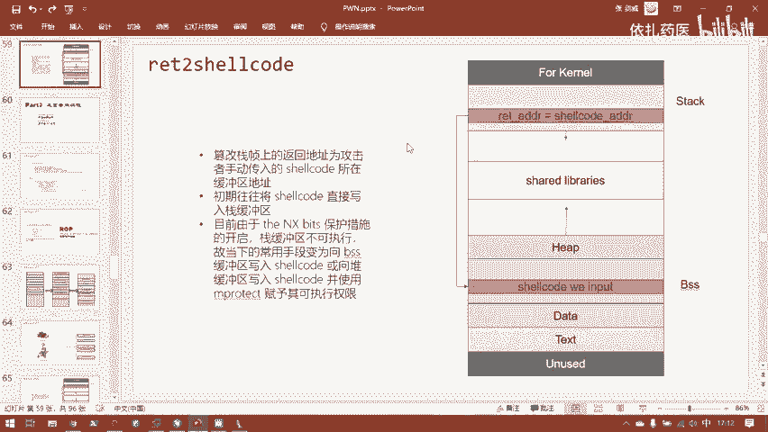
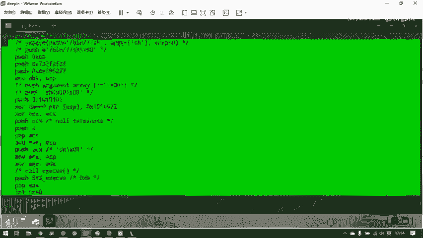
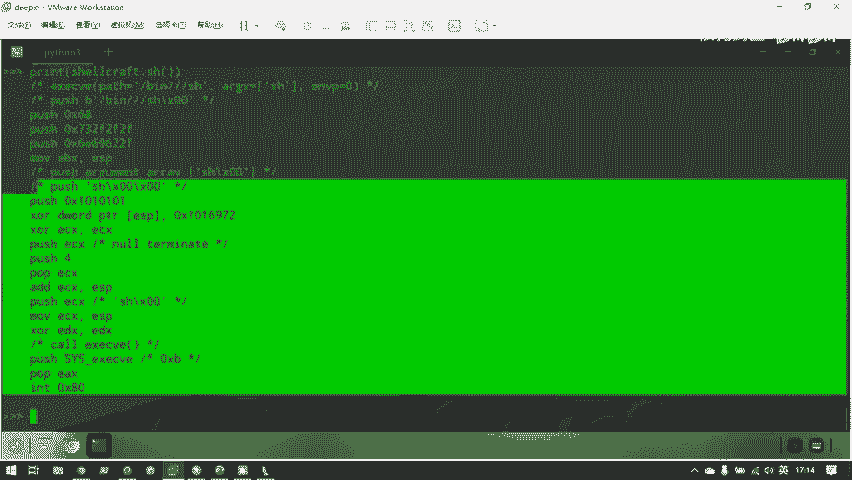
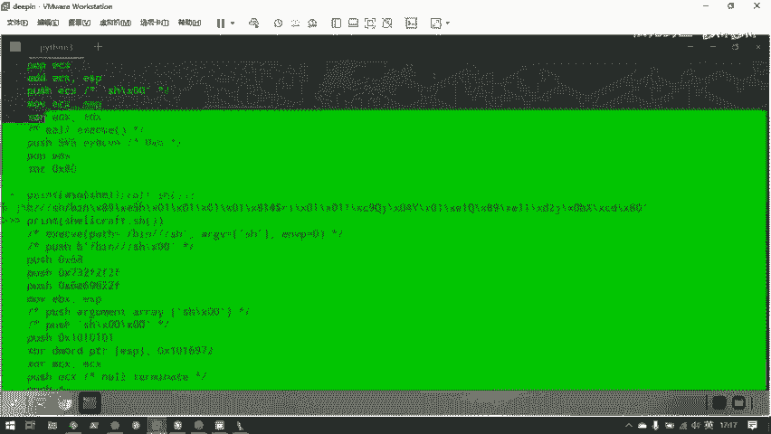
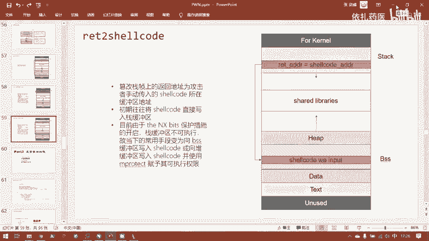

# B站最系统的护网行动红蓝攻防教程，掌握护网必备技能：应急响应／web安全／渗透测试／网络安全／信息安全 - P92：3.ret2shellcode - 跟小鱼学安全 - BV1SF411174M

呃，这种攻击说法称为return to shell。小口的顾名思义就是。嗯，调用shall一段机器码。需要return to share codesha code既然是我们自己输入的。

那么它就一定要存在于程序的缓冲区中。那么要么就是存在站缓冲区或者堆缓冲区或者BSS缓冲区了。但是堆缓中区默认mlock到，它是没有可执行权限的。所以你如果要用堆款中去去存放你的shall code。

其实这种情况是不多见的。因为你还需要ro调用，想办法调用move protect这样的一个系统调用去把堆堆区给它赋予一个可执行权限。但是你既然都能控制程序去调用这个函数了。那什么不直接控制程序ro到。

动态连接库去调用一个是要。所以这种到堆把shcut写入堆区里面的，其实最不常见的，更多的是写入战区和BSS区。BSX它默认是有可执行权限的。战呢他本来有他在计算机早期战段都是可以执行的。

但是后来也就发现不对啊，这站可以执行，战一出一旦发生。那么就可以轻易的被攻击者控制了程序预留。所以呢后来就添加了个保护损失，叫the。no excable bits就是把站这个段的可性原件给禁掉。

你先来看一下这种保护措施。the X bit我们可以看一下。我们的。程序。就是我们刚刚做的最简单的这题，我们再che set一下。可以看到NX保护是被打开了的，是enable的。

所以说就是我们这些最简单的returning text，其实战不可执行，就已经是一个默认被打开的保护手段了。呃，编译时你可以，这是属于这个它是程序与操作系统，编辑操作系统配合起来的一个保护措施。

这里应面加上这里不准确。那是由操作。Okay。但是你可以在编译的时候，其实就可以把这个保护关掉。但是这个保护默认是打开的。所以目前你想找到一个暂可执行的胖题目，除非出题人故意在考这个考点。

否则这样的情况很少见。为什么？首先大家想首先就想办法让战不可执行，把这个保护措施先做到位再说呢。因为既然是站一出，那我肯定我战区可以写入我的自己的数据。并且我由于我此时能达到溢出的效果。

我能控制程序的执行流，并且我既然能控制执行流，我就必定能向站上写入shall code。这两者是共存的。我能控制执行流，我就能写入shall code，我能写入sha要 code。

我大概率就能控制执行流。所以最开始在站没有这个。the lowest suitable bit这个保护的时候，站一出最方便的供求手法，就是return to share code。

并且是return到站上sha code。这是最常见，也是最初的站役出的公司手段。这个ret to test这是最简单战役出攻击手段，但是它不常见，因为没事，在程序里留个 home文的人还是少。

所以呢现在一般比较常见的用来演示的还是。嗯，这里还有个难点，就是目前攻击把把sle写入站，然后用来攻击程序。还有个蓝点，就是目前的操作系统都是默认打开了ASLR地址随机化这样一个保护的。嗯。

那也可以先把这个保护讲一下，因为我们是遇到哪个就讲哪个是这个ASL啊。这个保护是干什么呢？它全名是addressface layout randomizer randomization就是意为是地址空间分布随机化。

它是一个操作系统所实现的防护措施，就是这个保护是否打开，并不是在编译器编译的时候决定是否打开，而是是直接在操作系统里的一个全区变量。你把这个全区变量不是全它的操作系能有个文件，你把它的值设为零。

那么它就是关闭随机化，设为一，它就是部分随机化，设为二，就是完全随机化。我们先可以看一下我们虚拟机理的这个值是多少。我们直接输出一下。2。说明呢我们此时这个虚拟机它的ASLR它是全开的。我们看部分打开。

它随机化了哪些。部分它随机化的共享库站，还有MMMM对，还有VDSO这个不用了解，这个比较高级了。完全的随机化就是在一的基础上，通过BRK分配的堆内存也将被随机化。我们回到有呃地址空间的这个图。

就是随机化开成一的话，我们目前关心的是这个。这是动态连接库短，我也是先讲的，然后我们到时候遇到的时候会详细展开。目前你们先可以听着，然后有一个印象就行。这里存放的动态连接库。如果开成一的话。

那么动态连接库的加载地址就是会一个随机值。就是你每次运行同一个程序，它地址是不一样的。同样的站段它也是会被加入到一个随机值，加入到一个随机地址。它是怎样一个加载随机地址呢？

它本来站是老老实实的贴在用户空间的最高地址的位置。但是如果开了ASLR的话，它就会。不仅贴用户空间高地，它会随机的向下偏移一个。每次执行这段偏移的值都不一样。它这次可能在这里。

然后下一次在这里下一次在这里。每一次他都可以能在这个地方偏一个不一定不确定的空白区域，然后使得占每次加载地址都不一样，这样有什么好处呢？就是攻击者。呃，我们讲到了这样的直接攻击的其系也是比较少的。

一般攻击者攻击个服务器需要先泄露信息，然后再攻击。这一点打开了就会使得站的加点地址不固定。然后攻击者可能他第一次好不容易泄露了一次站的信息，然后程序停止交互了。他第二次再去攻击这个程序。

他上一次泄露的值就不管用了。或者就是还有一种更简单的情况，就是我们此时的站里的。Return to short code。因为站随机化的出现，导致了我们及时往站上输入一个sell code。

但是其实我们根本就不知道远端服务器它站的加载地址是哪里。我们即是可以在本地调试GDD。GDB。调试，然后。然后查看我们本地的占的值。可是这并没有什么用，因为远程的环境跟我们不一样。

首先本来就因为远程的环境跟我们不一样，它站的加载地址就跟我们不一样，并且他每次远程它和自己不同时机加载的这个程序。它这个值还在不停的变动。所以你其实在本地调试，你去看站。他地址是，比如说这里是这个位置。

可以你得到这个值，任何用都没有。所以你即使像站你写入了shall code也一点用处都没有。因为你根本就不知道这个shall code是写在哪里了，你只知道你写进去了。

所以目前return to share code，并且return到站。战段上的是要 code这个情况已经很少，一是因就是因为这两个保护措施存在。战不仅不可执行，而且他还被随机化了。所以可以看到站。

这个区域它在安全人员中眼中的重要性和人们。你可以看到人们解决安全问题，首先得把战这个老大来人给解决了，就是因为战断这就是施博的高发局，这漏洞发生的又频繁，并且威力又大。所以大家首先就对战下手。

先把各种保护措施在站上做起来。呃，这里还可以来对比一下。这里列出了5个保护措施，我们这次要学的5个保护措施，有3个就是直接影响不站的。这个SLR是可以为站。

就是可以影响到站的这个NSB它一大半的它一大半的功效就是是加在站上。这个canry就更厉害了。它直接就是Y为站定制的。为专门为了防护缓冲器溢出的一个防护措施。所以目前这种情况比较少了。

我们一般return to share code一般就是写到DSS段。BSS它是嗯刚刚说了BSS默认是可执行的。那么首先占的两个保护措施对比起BSS那BSS首先就少了一个保护措施。BSS可执行。

占默认就不可执行。那么还有一个保护措施呢，站它是ASLR默认打开，就默认把站随机化了。那BSS怎么办呢？BSS也可以被随机化，也可以不被随机化，这就要取决于一个叫PIE的保护措施，就是地主关代码。

是这个PE。这个保护措是用来干什么的呢？这个保护措施是用来随机化。EF文件印向的加载地址。哪部分是ELF文件加印象呢？就是存在你磁盘上的ELF这个文件它本身就有的内容，然后它再转存到内存里。

那部分就是EF文件印象。那么就是textdata和BSS这三个段是ELF文件里就有的。而hi啊这都是进入了进程之后操作系统才创建的。所以PIE就是地址无关代码就是为了随机化tex和BS如果PIE关着。

那么tex dataS地址就是固定的。如果它打开了，那么它就是随机的。如果随机的话，如果PIE打开了，那我们连BSS的地址就不知道。那我们像这样直接返回到BSS的，这样也不可行了。

但是对一些比较简单的胖体，他默认也是关闭的。然后the low excable beat它不仅防护了战断的不可执行。它这个保护的思想是。只要我觉得你就是一个不应该成为代码的一个区域。

我都给你标记成为不可执行。所以除了站，还有很多其他地方，包括一些。写入数据的地方，它不是代码，那么就把它通过这个保护措施都给它标记为了不可执行。如果你强行执行它，它程序就会崩溃报错。

所以目前比较常见的就前去sha code还是依然是返回到BSS。嗯，我回想一下之前讲过的ESS是用来干什。ESS4是用来存放全序变量的。所以如果有一个全序变量是。开有有一个群习变量是开辟的缓东区。

并且可以让你输入任意数字化。那么这一块群变量就可以变成一个存放1要客的地方。举个例子，就是我们还是回到刚刚的。不对，是在。回到我们刚刚太测2C。如果此时这个权序变量。然后shall。就找了1小扣。

明目张胆的钻到1腰扣，然后它的大小足够大。他像这样，并且他没有被初始化，那么它就会被在变译之后，它就会被放到BSS段。那么这里就成了需要扣的温床。如果我们此时代码里有一个。像他读入数据的一条指指令的话。

那我们就可以很轻松的把我们的sll code输入到BSS段的它这里，然后再想办法从站那里控制程序直行流返回到BSS的这个位置。好，我们就可以成功的。要做的时候，先要控制我们的。程序执行流了。

这个图也展示比较形象，我们依然return circle，我们依然是在站领控制了呃程序计入器的计算器，竟然控制了程序指针。然后呢，把它持续指针截持到BSS段保存的s要 code里。

然后执行这段sh要 code，我们就可以获得程序的控制权。嗯，这里在。说一下，就是我们那我们shall code哪来呢？sll code它是机械嘛。

因为我们此时在内存中执行的代码都是给计算机CPU直接跑的代码，所以直接都是二进制层面的基线了。

我们没法自己手写机械码。手写机器玩的都是什么级别的大神？所以呢我们需要借助一些工具来获取shll code。一个是网站是shallstone，然后你可以去上面获取到各种各样有趣的shall code。

但是ponts其实已经帮我们完成很多事情。con有个模块。叫share craft。我们现直接执行一下sharecraft的。运行这个模块看一下会发生什么。Yeah aircraft。

先说出一下这个符号是什么，它就是这整个模块里的一个内，然后调用它一个方法。这个方法是直接我要什么什么样的shall code，就调什么方法就行了。比如说我现在需要调用一个shall。

也就是调用一个SH的shall code，那我就直接向shallcraft要1个SH。对应的chell code就行，就点这个SS就行了，回车。可以看到他向我输出了一段汇编代码。

他告诉我这段汇编代码就可以使得。这段后面代版的效果就是执行一个调用一个shall，你就执行一个BSH。嗯，当然这里并不好看，因为他直接这样输出，他把框行符他都没有做显示处理，他直接把以原样显示了。

我们加一个presentF，然后把它form一下。再说出。好，这你就可以得到一个很好看的后面代码。

那这道合别代码就是我们要的是要 code。但是CPU他也不认CPU也不认识汇编代码，就算连汇编代码都是给人看的。

所以就到后面代码，你还不能直接把它送过去，你还需要把它转成机械码再给它送过去。那怎么样转成机械码呢？需要一个叫也是ponours已经帮了完成了绝大部分事情。你在。进行胖的攻击的时候。

绝大多数情况下都只需要pnts这个一个库ol，然后用它提供的各种函数写一个脚本就行。ESM。就是把汇编代码直接就在这个脚本内部，在python内部把它翻译成机械码，回收一下。当然因为是机械嘛。

它要显示机械嘛，它会默认的把010101这样的二进制串直接给它作为它默认的会把它作为一个阿斯玛解码，就是作为可打印字符。然后像这样给你显示出来。然后不可打印的，它就直接原样显示。

比如说这个零这个0差04，也就是1六进制的4这个值，它就会用一个反斜杠X这样的形式给你原样的输出来。然后这就我们需要扣。这个需要code的已经是你看前面有个B，它已经是ba型的数据了。

所以我们到时候直接IO点send过去。然后sha课就进入了。远程的主机。嗯，但是你会发现。我这些直接这样的print shellllcraft的SH默认的就是shall craft默认输出的SH。

它干什么用呢？你可以看到他这些。计算器都是s2位计算器。所以没错，并且s位它最后是用一个系统调用，这个也是后面要讲的。那就是系统调用来调用一个需要。所以你可以看到这个系统调用指令。

看它的这个计算器的宽度都是32位，所以默认的share cr点SH它输出的都是。32位的机器用的是ll code。你要如果要共计个64位的机器。你需要再加一项参数AMD64，你告诉他架构是要MD64的。

然后你可以看到它输出都是AMD64的。嗯，MD64的是要扣的。但是你在真正编写脚本的时候，你为了让这整个脚本的。环境跟他相同，你在你再用这个share craft生成64位机器用的。需要扣的时候。

一定要在此之前加上一个conts。第儿。你说。写个LCH去就够，然后等于AMD64。不然你这整个脚本的环境，python以为你还是在攻击1个32位的程序。

所以它整个环境攻击环境它会它还是会以1个32位的。方式给你呈现。所以呢你不加上这行的话，你直接。

去用这个这个MD64点SH生成的sha打，它会打通的。你必须加上这一行，设置了之后，然后再。设置这个shall code，然后用ASM这个函数把它变成。机械嘛，然后再发送过去才可以。然后。

最后我们来看一下这道return to share code这道题目。他地址也是在这里有了，然后我们先来看一下他本地的内容。先关掉Ada原来打开的屏幕。同样的。我们要攻击这题，我们先要看一下。

他保护措施。他说他也是一个3二维的程序。并且他有可读可写可知行。对，那这就是我们的目标了。首先我们知道它有一个可读可这可执行这样一个区域，这是编程上一个非常致命的错误。

就是你永远都不应该给你程序里的一段内存空间，又可读又可写又可执行的区域。为什么呢？如果这个程序的调用者可以像一段区域中写入数据，并且可以执行这段区域的话，因会造成很严重的后果？这个应该很明妙了。

我像这段程序中，我可以写入任何内容，那我就自然可以写入我任何想要的代码，并且我还可以把这段代码执行。所以RWX这是一个程序在你的程序中不应该出现的东西。我们其实可以看到，其实段就是一个正常程序的段。

我们现在可以调试一下。删出小口。一个正常的程序，它永远都不应该有。既可读又可写又可执行的地方。但是这题比较特殊，你看它BSS可读可写执行，它的站，它甚至它的战斗可读可写值可执行。为什么呢？

因为那个theASB这个保护已经关掉。这个程序中只要出现了这样的东西，那就很危险。那我们来看一个安全的，不会有这种困扰的。

VM map这个指令是显示vi virtual virtual memory的 mapap，也就是虚拟内存的空间分布。你可以看到这是一个安全的程序。你看。主要出现冲突的是可写权限和可执行权限。

不应该同时出现。因为同时出现就会说出现我刚说的那种情况。程序调用者可以执行任何代码。所以你可以看到一个正常的安全措施做的充分的程序，它有X地方，它就没有W。他有W的地方，他就绝对没有X。

这才是一个合格的程序所要具有的。内存分布。我们来现在回到这个危险区。我们现在来艾大反编译一下他，然后讲一下这个漏洞在哪。程序自动就停加了面函这里用iphone5影响。来看一下他的程序逻辑。

首先也是魅函数，就是魅函数，然后它设明了一个恰。它上面那个字符变量，然后set busuff set busuff就是也是关掉了缓重区。这两个你不用关心，这两个不会有漏洞的，然后put。

post了一个自串告诉我no system for you this time，这是在说什么呢？就是上一题return to test上一题老老实实的直接在程序之中就已经写好了一个sstem BSH给你。

所以你只需要返回到那里就可以直接的进入shall了。但是这题呢它就没有提供一个ho函数。所以他说low system for you this time。

所以你需要自己想办法去调用这个stem systemtem BSH。然后这个这个程序呢就没有子程序，就是这个面函数，漏洞就在这个面函数。我们可以看到gess基本叫有get的地方就有漏洞。

这get是跑不了的。他像S这个位置。输入了一段想多长就多长的。呃，数据。并且把这段数据拷贝到了buff2这个地方。bu2是什么呢？这里可以直接双击一下，我们看一下它。

因为你我们可以看到在内函数这里并没有看到这个变量。那这个变量在哪里呢？一个函数内部用了一个不是在函数里面声明的变量，那就是只能是外部的变量，那就是全序变量。那全序变量刚刚又说了，那是在哪呢？

你看此时再给这个bu2负值。那就刚刚说到了未初始化的全序变量是保存在BSS断里了。所以这个bu2就在BSS里，我们双击它就可以看到。可以看到BSS这个节里面存放了一个buff2，它的长度是100。

这样的区域。那么这题应该怎么攻击呢？大家想想。刚刚说了有两种return share code，第一种可以吗？刚刚我们也看到了，我们在GDB里看到了他的。theNSB这个保护措施是关掉的。

也就是站段是可执行的。所以我们理论上我们把shall code写在站上，也是可以去执行这个shall code，这是完全没有问题的。但是这种方案可以吗？不可以。因为我们刚刚说到了站的第二种保护措施。

就是ASLR远端的服务器ASLR基本上不可能关闭。你做胖题的时候就几乎不用考虑远程的ASLR是关闭的措施。你就默认这个ASLR它是一定是打开的。然后站的区域是随机的，基本这点可以默认。

因为ASLR保护的存在，所以即使你看我们这里可以直接用get把s code直接就写到这个站从S开始的位置。这是没有问题的，写进去没有问题，但是我不知道他写到哪里了，我只知道我写进去了，并不知道站段地址。

因为在首先这一段在静态文件里是不存在的，它只是在进程的虚拟内存里才有。所以你在Ida里你是找不到tack的地址的。但是艾打你。tex datataBSS都是有的，为什么呢？

就是因为他们本身就是EF份文件里自己就有这些内容。所以你可以在艾da里其实获取到一个确定的BSS的地址，因为这题没有开PIE，所以BSS的地址是固定的。你在艾大里看到这里是0叉804A080。

那么你远程服务器上8分2的地址也是这个值，你在本地调试8分尔地址也是这个值。那么我就知道我等一下篡改站上的返馈地址可以篡改是什么了。

这个return address我可以把它篡改成shall code的 addressdress。如果我把shall code写在站上，我就不知道这个shall code address是多少。

因为我根本就不知道shall code写来站在哪个位置了。但是如果我把。shall code写到用这种情况，我写到BSS。

那我们就知我们就很可以很清楚的知道这个sll code的dress就是我们写进入的BSS的地址，就是82的地址，也就是艾达你的0叉80CA080。我们就可以直接。啊。

把在这里把这个returndress。的地址篡改为sh code的dress，也就是刚刚的0叉80484A080就可以了。这里填刚刚说的数字就可以。嗯，这是这题的整体思路。

嗯，其实这题跟刚刚那题。也是刚仅仅是刚刚说了几函数。呃，IO。IO等于remote，然后初始化一个接口。然后再IO点儿send。和receive，还有最后已经攻击成功了，然后远程服务器被攻陷了。

就我们提供了shall，然后我们再调用个interactive进行交互。也仅仅是用这几个函数就可以完成此次攻击。呃，今天的时间也差不多了，刚刚的思路我也讲了，所以这题大家如果下去有兴趣的话。

可以自己尝试着做一做。就刚刚我说这5个函数，其实就已经能完成此次攻击了。大家有兴趣可以下去看一下。然后明天的话我会讲一下具体的答案。然后今天就到这里，如果有问题的话，可以在钉钉群里问一下。没有的话。

我们今天就这样结束吧。