# B站最系统的护网行动红蓝攻防教程，掌握护网必备技能：应急响应／web安全／渗透测试／网络安全／信息安全 - P94：2.动态链接过程 - 跟小鱼学安全 - BV1SF411174M

接下来说。动态连接和静态连接的具体解释。呃，动态大家要注意到一个程序，一个C语言代码。这是C语言代码。这是最后的可执性文件。从它生成它，我们仅仅是用一行简单的T。银行秘密。就完成了，对用户来说。

好像就是一步到位搞定了。但实际上他是GTC帮你完成了这所有的。中间。变译的所有的中间步骤。并且这里的三步中间步骤也是经过简化，其实中间还有更复杂的内容。首先，C代码一直到最后的进程印象，也就是从。

test点C。这个文件一直到最后，我可以执行这个文件，把它载入内存。它向我输出一串字符串，就是从te2C到字符串，这整个最抽象出来的五步过程中。动态连接的代码是在装载这一步。才为用户可见的。

静态连接是在链接的时候就可以获取了。可以看到链接和装载分别是干的什么？链接是把目标文件。链接成可执行文件。就是把目标文件中所有记录的目标文件它里面会引用一些其他地方的代码。不管是其他原文件中的代码。

还是其他链接库里已经编译成二进制的代码，它都会在链接这一步将不管是生成PRT表下，还是直接把代码拷进去，都会在链接这一步完成。所以拷代码这一步静态链接，静态链接拷代码这一步就是在链接的时候就已经完成了。

然后呢，动态链接呢就是一直到程序装载进入内存。然后需要调用哪个函数的时候，他就再把这个函数的代码获取一份，然后获取到它的地址，并且直接在内存里执行。当然。

整个动态连接库都是直接就是最开始就完整的拷入了内存中的。只是我们在用动态连接库的函数的时候，我们最开始是不知道它哪个函数的地址是在哪里。还记得之前讲的ASLR吗？他是把他是把动态连。

他把把包括动态连接库在内的一些段的载入地址给随机化了。所以呢即使动态连接库载入了内存，但我并不知道它的位置是哪里。即使ASLR没有开，大家电脑大家电脑平台啊、直升集啊，各种各样的不同的环境因素。

也会使得程序没法在动态连接库。当一装载进入程序的时候，就完整的获取到自己所要使用的函数的真正地址。我们可以来看一下。我们可以此时调一下这个。这个函数。对。然后备拆在慢。我们来重点注意一下这个这个区域。

类veC2。28点so。这个区域大家看一下他是干什么的。他就是那个C这个文件，还记得上午看到这个文件吗？我们专门去。那个路径下找到了他。可以看到在。我们可以把这个路径复制一下。对。

可以看到这样的文件夹里，lib这样的文件夹里会有非常非常多的动态连接口，和你windows的DRL也是一样的。其实windows经常DLL丢失，就是这种放在这里给大家共同享用的代码。的文件找到了。

所以就会报DRL丢失。嗯。我想翻找到他的准确为止。找到了类CL8感受，这就是我们所这个程序所用到的动态连接库。它存放在这个路径下的这个位置。然后呢。它里面存放了我们刚刚所写的pos的真实实现的代码。

但是大家可以看到。他是被完整的载入了。内存之中的其实并不是我仅仅是用到了pos这函数，我就仅仅把li C中的pos放到我这个函数的序列内存空间中。而我会总是的总是将整个lib C都放进来。虽然放进来了。

po函数自然也进来了嘛？在哪呢？在可执行段的codepo函数此时就在这个地址区域内。但是我并不知道铺子的真实地。这是动态连接做。就有了一个特点。我需要在运行的时候，第一次运行到pos，然后我去程序。

这里面在我程序的EF的code端会有一个叫PP的节。然后这个节里面保存了一些代码，这些代码就是用来解析存放在lab Ccode。断你的pos函数的真实地址是多少？然后呢，解析完毕之后把它填入。

data段的名字叫got点PRT的节。然后以后我去调用pos，就直接从这个位置的got点PRT解你获取po的真实地址。然后我从这里跳转到libbC，你去执行pos函数。是这样一过程。

接下来就讲一下动态连接的相关结构。就是我们的程序中有哪些部分是用作动态连接？公用。首先就是刚才你说到的gsose点PP。嗯，先浓统的概括一下这些一些节是干什么的。首先会有这样的一些点。达敏他记录了整个。

首先这样的动态连接的相关结构，仅仅是动态连接的程序才会具有。你就是。此时我们这样的程序只有。dynamicmic test这个还这个程序有。tatic test这个程序是没有的。这样的结构要要记住。

我们接下来所有的语境仅仅发生在。第一个文件中，因为它是动态链接。dynamicnamic section提供了动态连接的一些相关信息，就是为操作系统描述了整个动态连接的所有的内容。

包括其他的表啊都放在哪里啊，是如何组织的啊？然后呢，link map其实这个不怎么重要，它保存了载入动态连接库的链表。就是我一个程序不一定只载入了一个动态连接库。libbC只是最常用最基本的链接库。

比如说我此时写的这个程序，如果它是个游戏的话，它就可能载入一些绘图库。那么这里就会有另外的一些图形库的链接文件。当然，除了类b C这个基本的动态连接库，它一定会有的，还有一个装载器。

这玩意儿为什么一定会有的？因为动态连接，那那是谁把这些东西连接出来的？进来的呢？就是1个LD。所以他也一定会进来。那么这些所有的动态连接库的可视性文件。

就会在link map这样一个结构中形成一个链表保存起来。然后DL run他resve这是一个函数。他的作用是解析。解析第一次在动态连接的程序中执行的函数的真实地址。它这个函数是被PLT所调用的。

然后调用之后，它会向gos中写入真正地址的内容。所以他是一个在工作在PT和告s之间的一个孩。等一下会展开细下。呃，点got里面保存了。全局嗯got是什么？

got GOT它的全名是global offset table。翻译过来就是全局偏移量表，顾名思义嘛，它就保存了整个程序。的虚拟内存空间。的中的各个符号的偏音量，或者你可以直接说成是地址。

点got保存的是全局的符号呃，变量地址点go点PRT是函数地址。然后接下来呢就是又是一段连续的PPT以动画的形式向大家展现整个动态连接。他最关键的过程是。怎样进行的？喝点水。Yeah。好的。

我们接下来看下一张PPT。嗯，大家首先看到。注意这样几个结构。首先pa test这个已经见过他很多次了，就是代码代码结。这是我们的用户代码，这里面才能放。

然后这里有一个ho atPRPho是我们自己写的一个自定义函数。POT。是程序中代码段你的一个。保存了解析函数真实地址的一个解。然后PRT的。最开始的量层指令是这样的量层指令，等一下他是干什么呢？

我们会讲。然后呢，告t点PRT里面保存的数据，它存放的位置是数据段。然后为了还原这个图中的状态，我们现在来写一份还原它内容的代码。嗯。当然这里也有个假设，其实真正的meC中并不存在一个叫fo函数。

我们这里假设libbC里就有一个和curF啊、put啊sst啊等效的一个过程。三十。当然这个还是。这个代码此时不能编译的。因为这个函数实际上并不存在。嗯，首先我们在。我们在编译了这个程序之后。

它会生成一个汇编代码。然后之前也说过，在汇编中调用一个用户函数，会是用cor这个程序。那么这段C语言代码最后对应的就应该会出现一个coll for。然后呢，在他的真实实现中会是怎样的呢？

因为fo是个动态连接库中的代码，所以它co它并不能直接跳转到。他自己的。代码段你的复函数，因为复函数直接在这里。在那个C的代码段，但它也不能直接跳过来。

因为他根本就不知道后函数在这茫茫地址海洋中的哪个位置。所以呢他只能去哪？扣子段里面还有一个。解叫PRT。那还不如不还原，我们直接自己写一个程序。我们用read函数或者是po函数来代替。代替呃付函数。

嗯先把这整个动画过一遍，然后我们自己来写一个程序来看它的真正过程。关。大家可以先把这个过程先看一遍，因为等一下我们还会有第二遍和第三遍，然后大家先留一个印象，这个过程也是比较长比较复杂。

所以呢要想要追求一遍就搞清楚是不现实的。首先，co。我程序代码段，我去调用fo这个存在于动态连接库中的函数的时候，刚刚已经说过了，我没法直接跳到F原因刚刚讲过就不再说一遍了。我那我怎么办呢？

我只能去代码段中一个特殊的位置叫PLRT节。PLRT节里面也是代码。然后呢，没有一个每一个动态连接库中的函数，被这个程序调用的动态连接库中的函数都会在PLT中创建一个表象。

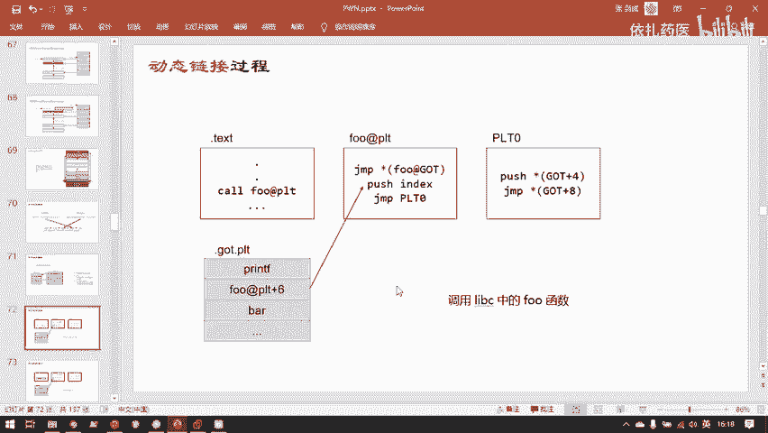

我们这里先来画一画，这是一个怎样的一个情情况。

首先。😊，我们。代码端的某个地方。不这函数。但是我们没法找到他直接的位置，我们就只能去PRT了。所以实际上是co在PRT用的表象，然后离他还算比较近的地方，因为也是程序自己的。代码断码。会有一个表。

这个表就是PRT表。那这里就是PRT表的。PT表中的每一项都保存了这个。程序所调用的一个动态连接库函数。比如说这个程序调用的动态连接库的read。他又掉了cF。还有调用了一个stem。

他还调用了我们的数。再把它填满吧，再写一个。那我在代码段的位置调用。做这个函数的时候，它就会跳转到这里。对他实际跑到这里。这个为什么这么不听话？扣负之后，它就会跳转到PLT的fo这个表象。

然后这个表象你接着会发生什么呢？我们接着来看PPT。Cool。这是进程首次调用复函数才会发生的。接下来是进程第一次调用复函数才会发生的情景。首先他来到了foPT的表象中。那此时这个方框就是。

此时我们画的这方。然后呢。PRT它是在代码段码，它自己本身保存的也是一些代码。

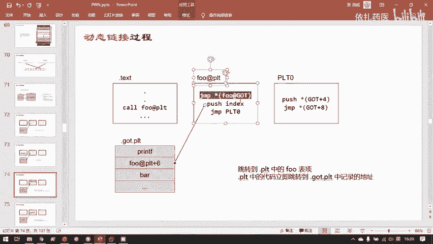

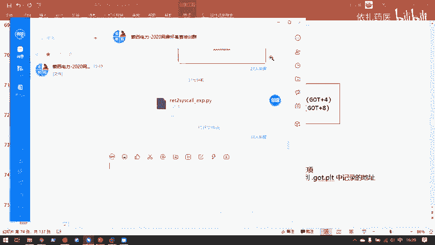

他代码的这个表象的第一行，它是干什么呢？他就说降，我直接跳到got表，你的fo。的位置为什么呢？是got表？因为got表它的作用刚刚已经说过了，got表PRT就是保存所有的。

全局的函数的真实地址的一个表。好，那我们在图中此时把个t表也画出来。那这里就是。然后这里是。PRT。这里是告。呃，PRT它这个表象的第一行就是干什么呢？就是。他直接就说你你找我啊。

那咱们就去直接去gotgo表里了哈，他的真实地址就好了。然后第一行他第一行就降回，降到了got表的地址。但是由于我们是第一次调用副函数gt表此时这个fo这个地方它并没有经过那个特殊的函数解析。

所以这个fo里面还并没有填写。复函数的真实地址。那么那他就空着嘛，那当然不能空着。那怎么办呢？他就填写。PRT表象的地址。所以很简单。我里面还没有你想要的东西，那那你就回去。

所以呢从got表又跳回了PRT表，就是第一次调用的时候。复函got表里面没有复函数的真实地址，所以它里面保存的就是PRT表象的地址。这样PLRT过去之后。就是会立马跳回来。

然后PLRT表这边的代码就知道了。原来告诉表里面什么都没有。然后PRT接下来的代码就是要要知道自己的任务变成了去寻找复函数的真实地址，然后将它填入got，并且跳转到复函数。好，那么这就是接下来的工作。

嗯，我们可以看到此时ju幅到fo got。但是这个forgo里面的内容是PPRT表象下面的代码，就是也是说我降不过去，这里的保存地址就是PRT自己的地址，所以又跳回来了。

并且跳到了刚刚这行降目的下面一行代码。所以就开始执行PRT的下面的代码。首先push index。复制ind是一个参数。然后降配到PRT0，这是几个参数，等下一次讲。在们的PRD0，然后接着。

再执行了一个p pushush，然后又执行了一个价。所以呢这里是连续执行了4条汇编代码。后ush了两个值。然后。最后降不到了一个奇怪的位置，这个位置是gt表的偏移为八字节的位置。保存的地址对应的位置。

那么在跳到了那个特殊的地址的时候，他压了两，他往站里压了两个值。我们知道此时叉86的情况是用站来传递参数的。那么此时push两个值就是当然是要为等一下调用的那个参数。第二呢那个函数传递参数了。

那么这两个参数分别是什么呢？首先这个index。index怎么理解啊？那举个简单下明的例子。我假如我整个程序就调用了这5个web函数，那么read。

它是不是在这个表中就是它的索引是0preF是1stem是2，复ush就是3了。那么此时push了这个index是什么？就是复对应的3，它push了一个3，就是说。呃，我对应的。

我此时要解析的是表象中的第几个函外部函数。然后呢，再push一个gst加4里面保存的内容。这个呢其实不用太关心，它是表示了我是要去哪个动态连接库找这个。嗯，我所要用到的函数，刚刚已经看到了一个程序。

它并不只是用到了一个动态连接库，它可能链接了好多个动态连接库，所以呢需要再传一个参数来表示我是用到了哪个动态连接库里的这个函数。然后呢，传完这两个参数之后就可以降到got加8的位置。

就进入了DLre这个函数，它就开始执行解析负函数实际地址的任务。嗯，时间差不多，我们先下课休息，然后等一下接着从这里讲。

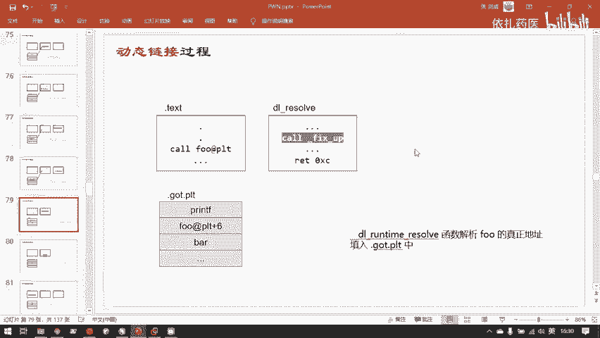

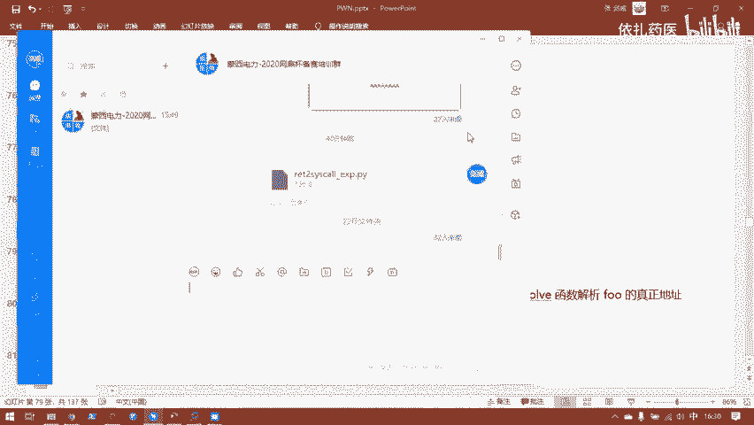

嗯。好的，我们继续。刚刚说到了，我们已经为解析用于解析复函数真实地址的那个功能函数已经传递好了参数。那么就是接下来就是通过这行降目指令跳转到目标函数了。

它是叫完整的名字是DLruntime result。然后这里写成这样，然后这个函数具体的实现过程呢也是比较复杂，并且并不是我们需要考虑的。然后经过他一系列的解析之后。

它就会把负函数的got点PRT对应的表象填入复函数的真实地址。大家观察这2个PPT的这个位置。在它执行完毕之后，这里的值就不再是PRT里的值了，而是负函数在。类veC里面代码段的真实地址。然后呢。

这是第一次调用程序第一次调用复函数的时候的流程。那如果。我调用两次的话，第二次还会进行相同的工作吗？并不会。我像这样。我连续调用两次，刚调用第一次会发生我举例这样的一个过程。

但第二次因为他已经有了第一次的解析，我到了这行服务的时候，他就并不需要再把刚刚那个过程进行一遍。来看一下，这是第二次ca for。它会同样的到了foodPRT这个位置。然后PRT呢首先就就去找got。

但是got此时已经刚刚它的这个food表象的位置已经被DLrun resolve函数填上了正确地址。那么。此时。这里的这个箭头就不再只回PRT了，因为他已经知道真正的地址了。它就会在负函数的真正地址。

它里面保存的是复函数的真正的地址，所以呢它就指向了真正的复函数代码的位置。然后第二次调用就这样过程就完成了，直接是col，然后跳到PRT表，跳到got点PRT表，然后直接就到达了for函是的真正地址。

完整的流程呢，这个图里展示展示在这里，大家可以。看一下，然后呢，这个过程也是比较复杂。嗯。哦，我看看上午PPT发到了。

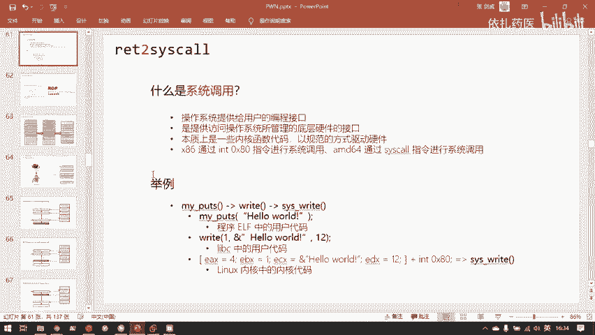

看到了呢？我检查一下，然后把这部分比较复杂的内容再发一下。

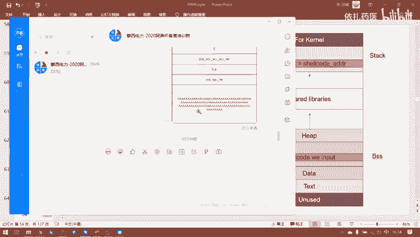

嗯，我记得上午发的PPT里面好静把这部分包含在内了，是吗？大家可以再仔细的回想一下这整个过程，整个过程比较复杂。但是这个过程也是接下来利用的一个基础。你必须对这个过程非常了解，非常熟练。

才能完成接下来的攻击。给大家几分钟消化一下。好的。嗯，上午发到了第81页吗？是刚好停在了。嗯，我这PPT我后来又改动，是停在了这个位置吗？不连接。

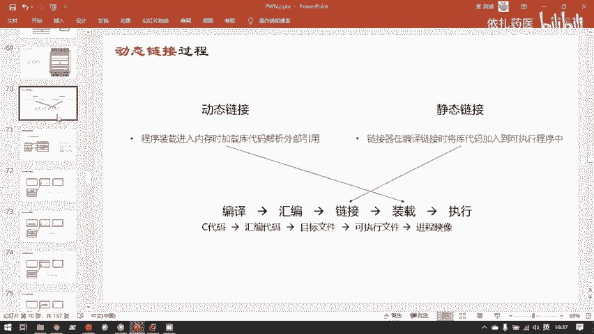

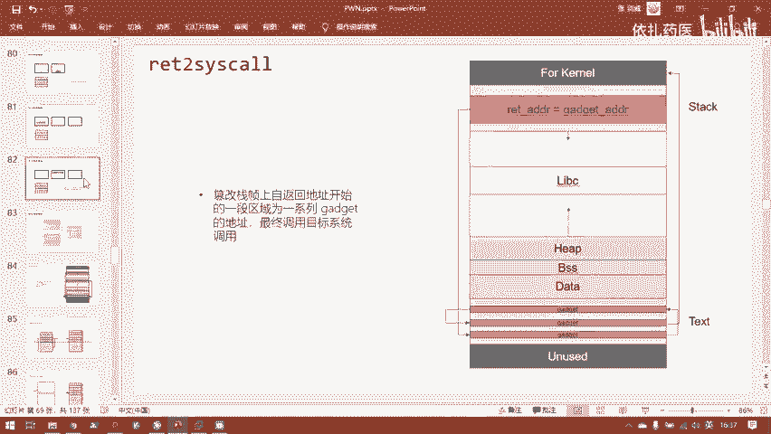

可以说一下，就是这部分你们手头是否有，因为这部分也是一个难点。这是第三个难点。第一个难点是函数站的工作方式。第二个难点是roprop链的构造。第三个难点就是这个动态连接的解析过程。

可以看到这个比较困难的地方都是用很长篇幅的PPT用动态的形式给大家展现了一下。因为。比较难理解。如果不用动画的话，大家只是文字和讲解的话，理解起来还是会比较麻烦。所以呢此时还是希望大家能看一下这一块。

反复的阅读一下，然后去理解它的实现过程。

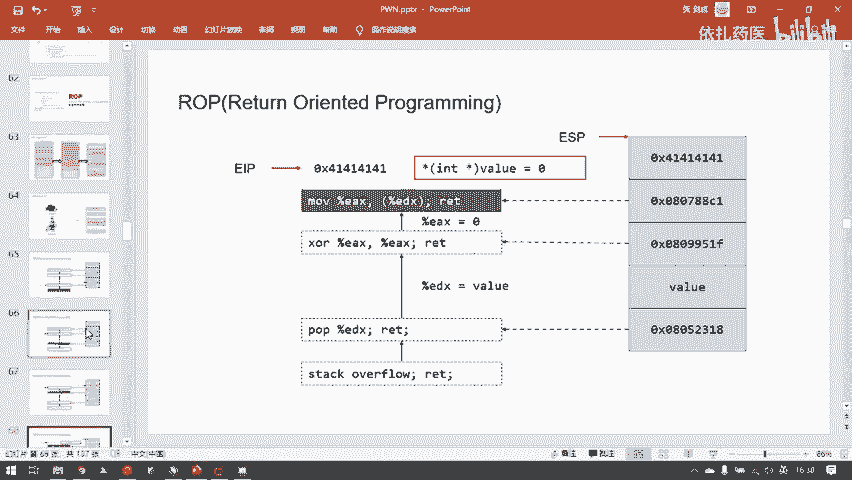

然后。除此之外，我们仅仅看PPT还不足以说明什么嘛？我们就实际的来写一个程序，并且在动态调试中观察PLTgo这些动态连接的相关结构的变化方式，是否是像我们刚刚PPT里说的一样。的工作模式。嗯。

首先调一个裤。特s函数随便打印点东西，那就是第一次调用吧。firs。这第一次掉的。随便写一个呗。😊，哎，一。等一下做一个。间隔他来看。然后第二个裤s。好了。

我们先看一下我们说的po函数是否像我们刚刚说的那一样工作。我来编译一下。GCC先把PIE关掉，不然调试会不方便。然后呢，杠G带上C语源代码，这样方便我们调试。然后再者是杠O。要加一个杠M32。

因为我刚刚讲的这个过程其实是。叉86它的解析过程叉64会有一点不一样，最简单就是它的传参方式不一样。

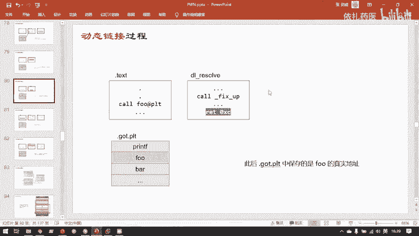

虽然影响不大，但是还是跟PPT紧密结合比较好。32吧表表示把它编译成32。为了程序。嗯，还有什么其他参数需要吗？好这。好像没有了。高，然后目标我记的名字。对。然后我们编译的。不是。没有什么问题。哦。

是M32参数的问题。我此时没有安装编译M3，就是32位目标文件的所需要的一些。裤代码。所以呢这里就无法它无法默认的为我生成32位文字，那我就编译成64位，差距其实并不大。嗯，好的，现在我们得到link。

CDB。这点下那面涵。好了，首先执行。第一行代码跟我们的cos一点关系都没有。我们来看一下。PT的内容。可以看到我们这我们这个程序非常简单，它就是调用了一个函数，就是一个pro。

所以呢我们是在po bug里，这个插件已经很方便的。我们实现了一些就是与二级制 logogo利用相关的功能。比如说这里可以输入PRT很方便的查看PRT。嗯。这里输入PRT它显示。PRRT里只有一项。

为什么呢？因为我们本来就只调用一个函数，我们也可以换种直接用二进制的形式查看。PRT的内容这样一个指令X。那顺便也讲一下这个指点。P息。复制错了X它的作用是后面你跟一个地址。

他就把这这个地址的内容就显示出来。比如说此时的0叉10。3名。他默认是显示了。他默认只往下显示毕减。但是我如果后面跟上。20的话，它就会显示。长度远大于。默认的。844比特长度，它默认你使用X。

它只会显示32万4比特。我们可以看到，那这里就是PRT表了。票率表。首先他花了16，他的一个表一个表象是。16个字节。没错。然后里面记录了pos相关所需要用到的所需要用到的解析的代码。

PR首先PRT是在代码端，这个大家不要忘记了。然后呢，co点PRT过了就是star，就是已经是这个程序的。已经是star函数的具体时间代码了。

我们可以来挨大里具体的看一下这个got表和PRT表究竟是个什么东西在哪里，然后是怎样组织的。嗯，为了更清楚的看到内容，仅仅是一项可能不方便，我会。多添加几个无关的函数。比如说我这里再多一个pre。

再来一个。在。有了inet了就不需要。因为insite这个函数的光能就是退出当天。看丢弃掉有没有问。然后再继PD次。只有wning没有。Aol有没有。确沉沉的，那我们就可以炒出来。

然后用艾塔看一下它里面究竟是一个怎样的组织方式。

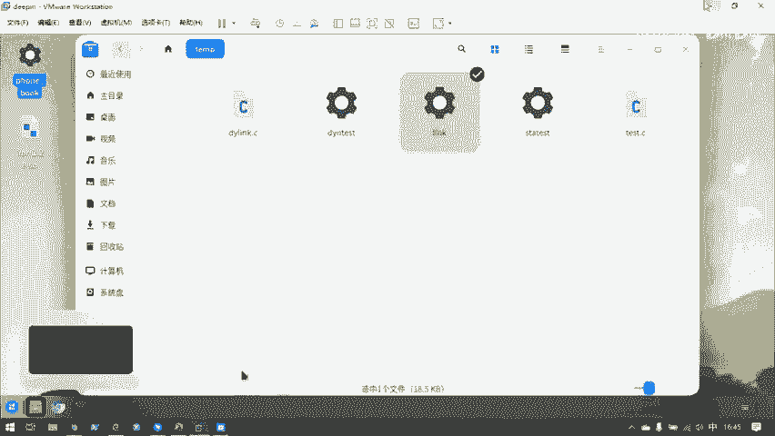

好的。

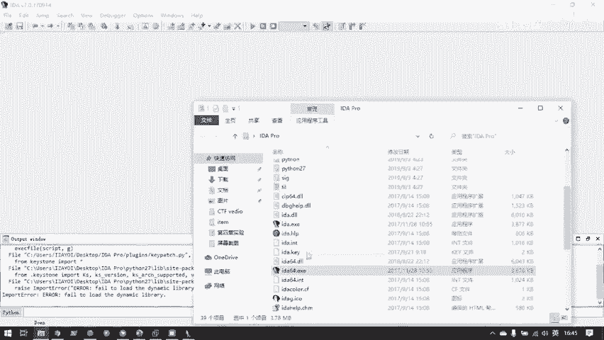

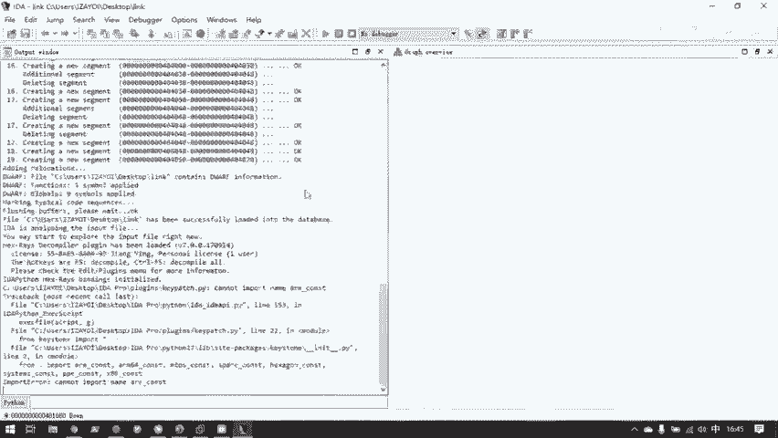

，这里可能也也是因为习惯性了，然后忘了告诉大家，你用艾默认打开一个。默认打开一个二次式文件，它首先会来到这个他能找到ma的话，它就会默认来到ma函数。然后如果他没有能找到ma的话。

它就会默认来到函数入口，就是star之类的。然后呢，它会显示这样一个窗体。这样一个窗体呢，它其实是函数调用关系窗体。就是如果我这个函数调用了一些子函数的话，它就会把这个整个的调用框图谁调用了谁。

然后在这里一个。逻辑拓扑图拓扑图的形式展现出来。但是我们如果不看程序执行流的话，我们不需要这样的一个视图。我们从这个视图来到这个汇编视图，其实用空格键，这个忘了记。添加控格键就来到了汇编代码的视。

我们来看一下。

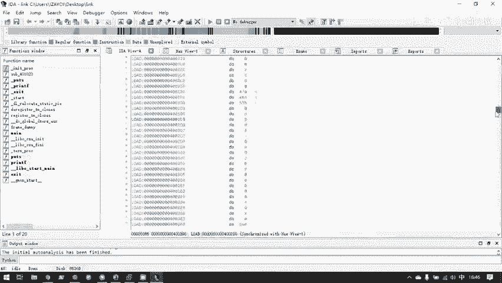

整个程序从文件头开始。他是一个什么样的内容？文件头你看他其实文件头里记录了大量的这个文件相关信息。然后这是首先是。就是之前讲到ER分0的表象，这应该是断表。这个我们目前不关心。然后。

再想这些load前面标有load的部分，就是一些用作程序装入内存的控制信息。然后那这里就顺便把这都讲了，就是看到一个就直接把这个顺带的知识都说一下。in initialal这样一个节。

它是用作初始化的一个结，它里面记录了初始化代码。之前大家可以翻到原来的PPT那个动态连接程序的执行过程。这里可以回到。讲到动画连接了，就可以回到那里再重新看一下。

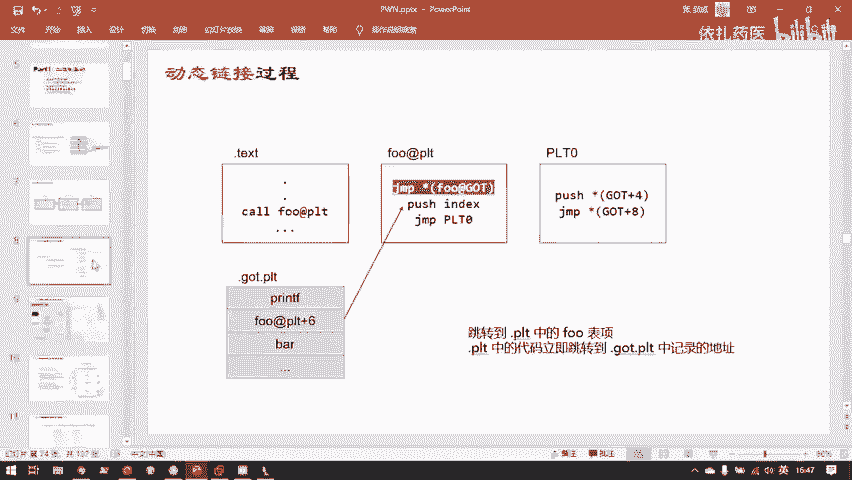

这个。他执行这是函数的入口。这是讲过的这是装载器。就是从向操作系统内核要了程序执行所需要的资源之后，首先就是装载器。他会把程序所需要的装载的一些内容全部装载到内层中，然后进入程序的入口。

star才是程序的真正入口，而不是ma，并且在star和ma之间还执行了一些其他数。

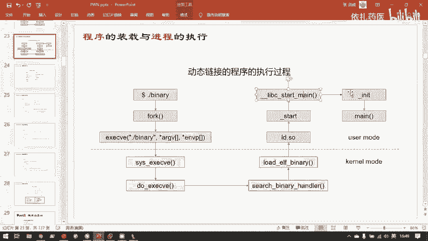

继续往下滑。好了。这是代码段。代码呢过了之后，紧接着下一个节就是PRT节PRT也是代码。我们来在这个PLRT节里找一找我们所调用到的几个函数的表象。PRT仅仅有这么小一部分。可以看到。这里。

这一项他用虚线其实已经划分开了，这一项就是我们的puts。的PRT表象，这里就是printF的表象，这就是exciite表象。每一个表象的程度是。可以看到3646。相减等于0叉10，也就是16。

每个表象的长度都是16次间。也印制了我们刚刚在GPB里看到的。

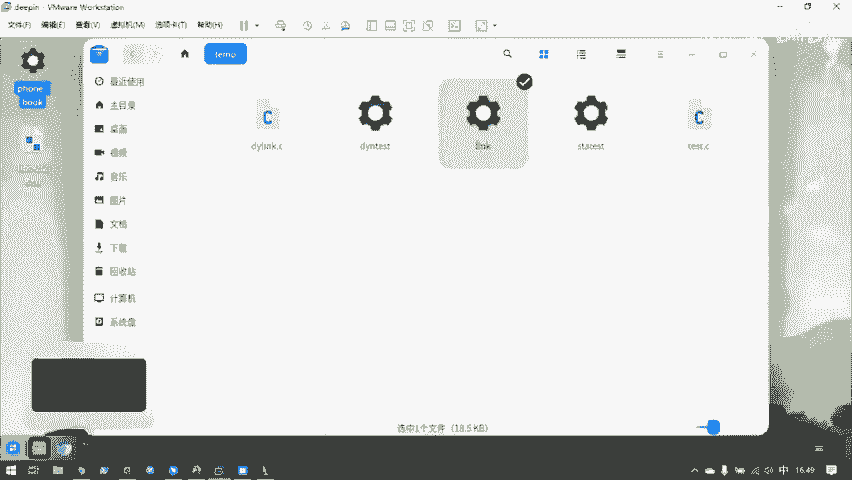

十六字节程度的。Goods at PRRT。他的表象内容。然后呢，同样的。我们可以看一下表上的内容是一个push index加一个降。各时index是我们刚刚PPT的哪一部分呢？是。可以看到就是。

PT函数的PRT表上的。第一第一条指令就是push，第二条指令就是降。

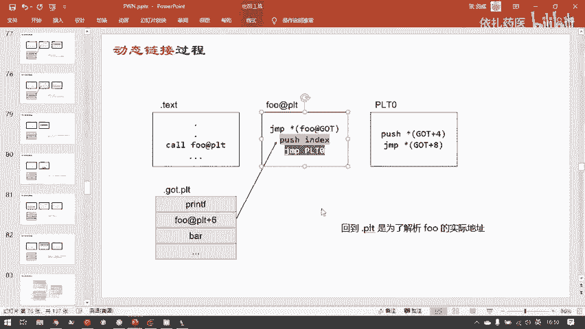

这是PRT。然后我们去看一下gotgot点PRT节里面的got表。嗯，因为PRT是代码，所以呢它和text节，还有in节这样的代码放在一起。那我们要去找作为数据存在的gos节和gost点PRT节。

那自然就要去数据段找数据段呢？数据段在哪里？我们应该往哪里画？随便找一张图。

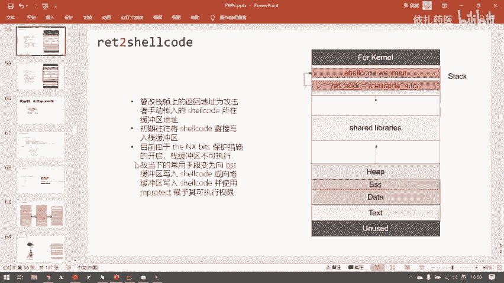

就这个你可以看到数据段data段是在text段的高地址位置。

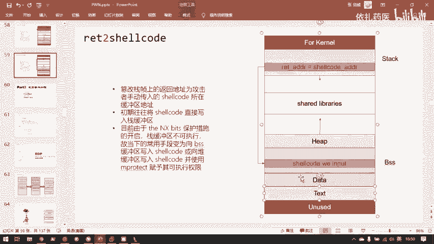

然后艾达理他也是反过来，你可以看到越往下滑。这个地址的只是越大，所以埃大领你是往往下方滑是高地。所以呢我们要去找数据段，我们就得继续往下翻。可以看到已经可以看到got节了。

然后got节更高地址位置就是got叫PRT节。我们也可以看到。我们的putsprint F和exite三个调用的库函数的。告s表象，并且这个表象它本身只是一个数据。只是一段数据，它的长度是八字节。

为什么是八字节呢？因为我们是64位，64位的程序，64位的程序，它的一个它的地址需要八字节来表示。而我们的告s表象里面记录了什么呢？就是记录了这几个函数在。

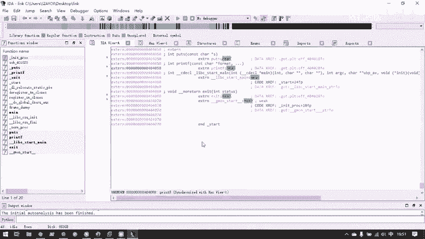

在那个C里的真实地址，所以它本质上每一个表象就只用记录一个地址就够了。所以每一个表象八字节就能搞定事情。所以呢此时这里。总共只有3项。因为我们只用了3个。嗯，外部函数好了。

我们可以接着现在静态分析看了一下具体的结构。我们接着来进行动态分析。嗯，首先我们看一下PRT。直接输入PRT3个PRT1一项一项表象是十六字节，是空的。啊，不对，不是不是叫空的，就是只是给出了指令地址。

那此时告诉们，我们这三个函数还一次都没有调用过。他告诉我们，告s里面保存的函数数量是3个。然后呢。这三个每一个是八字节，所以你看到其实这里就已经把所有内容呈现出来了。

然后这每一个八字节里面保存的数据是什？可以看到它保存的值都是0叉40什么什么什么，这个地址是什么的地址呢？V time没慢。040开始的，你可以看到是我们的EF文件对应的。代码段。

所以这个实际指回了什么吗？后面呢poundybug这个插件也经很贴心那么我们注明的出来。它其实里面保存的内容默认的就是PRT。对应的表象的地址，这有就是我们刚刚所说到的第一次调用的时候。

他不知道for函数时间在哪里，那他就只能只能告诉PLT，你回去你自己再找找。然后来PLRT去找gs，告诉说我这没有，然后他回他就回去让PLRT自己去找。所以呢在没有调用过的时候。

你可以看到gst里面保存的就是PRT的。然后呢，这里还说到一点。我们可以看到这样的表象，每一个表象它的长度都是八字节。但是这里这个数据几字节呢，一字节两字节三字节。哎，那剩下的五字节哪去了？为什么呢？

因为剩下的五字节全都是01234567890。实际上，他是长这样。但是和我们数学的习惯一样，高位全都是零的话，那就可以省略不写。其实我们在用pros写攻击脚本的时候也是一个道理。

并且他说了指回的PLT的表象的地址，对应的里面是什么代码，它都已经帮我标出来了，就是这个push index。刚刚已经看过了。好的，我们接着往下进行。我们这是第一次调用pos。好。

我们再往下进行一行调研完成。标T。他因为是代码段，他是绝对不会发生任何事情的。但是告s呢。你可以看到。这两个没有被调用过的函数，pretF和exite。它里面填的还是PRT的地址。

他还是他你他就是他此时所想的还是我这里没有东西，PRT你自己去找，但是pos已经被调用过一次了。所以呢他已经PRT经完成了寻找。post函数真实地址的工作。那么此时got表的表象里。

就仅填入了ros函数的真实地址。我们可以此时看一下这。首先直接用。陈述权。他此时填的地址是什么呢？其实是这也是一个涉及到就是函数封装的问题。它保存了pos函数的真正实现。

里面你可以看到这些都是一些机械码，很多都是不可打印字符。实际上我们可以第。This。😊，Yes。就是diassemb就是返回编，然后这个地。你可以看到。啊，他把这整个函数的反馈变出来了，显示好成。此时。

告s表里填写的这个地址就是pos函数的实际地址。我们去查看这个地址，并且把地址里面数据返回编就能得到pos函数真正的实现代码。也就是它这里直接反译成了汇编代码。而。而。嗯，比如说preF。

我们还没有调用过的函数呢，我们去反后编查会得到什么呢？那自然的我们就得到对应的PRT你的代码。可以看到是酱不是酱。后门。这里呈现的之前呈现的是一样的内容。

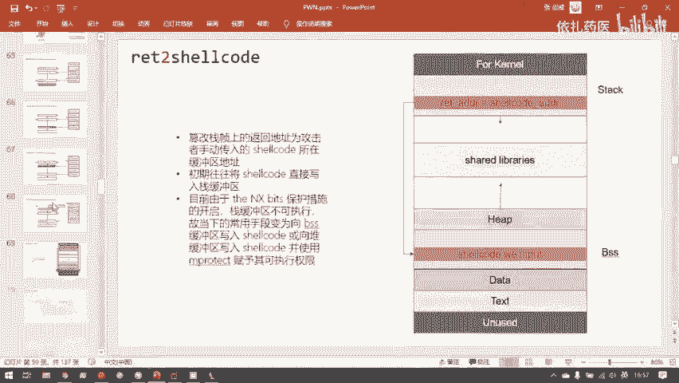

稍等，我们接着接着执行程序。又执行了第二次扣。第二次put。执行完之后，bos表并没有变，因为他已经填写过了，他再填写一次没有任何用处。那我们再执行print F呢。好的，我们再看一下gos。

可以看到print F执行过了print F的告s表里面的内容就改变了。同样的执行了excite。程序退出了，因为exccept这个函数本身的功能就是退出程序。

所以之前的excse我们就看不到这块东西了，程序此时已经停止了。大概就是这样一个过程。嗯。然后呢，我们刚刚只是看到了这个。函数一层一层调用之后，gos和PRT的变化过程。

我们现在来实际的看一下它的解析过程是怎样的。登裤子。然后这里我不再不过了，我不近进入裤子。解析过程被跳过了，路径并不能看到。他的解析过程。那此时他这里不支持了就算了，我们接着往下看。

接下来就是实际的return6C的攻击了。

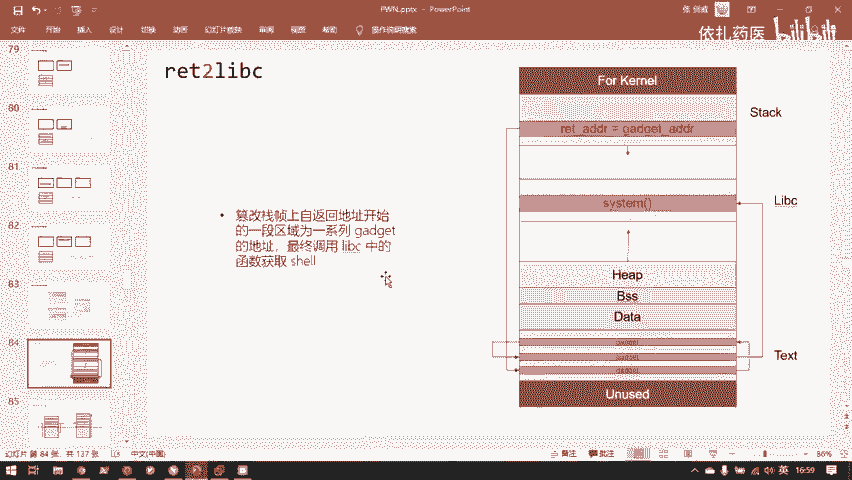

我在想在讲攻击之前，因为这个过程。应该是比较复杂。我觉得因为我当时学习的时候，我觉得这个过程我花了好久，我去自己一步一步的推导，然后研究才。把这个过程理解透，我觉得可能像这样讲一下。

虽然用动画加代码动态调试的方式演示了三遍，但是可能还是会有部分同学。你必现在必须把这个过程记得非常清楚，才能进行下一轮的攻击。

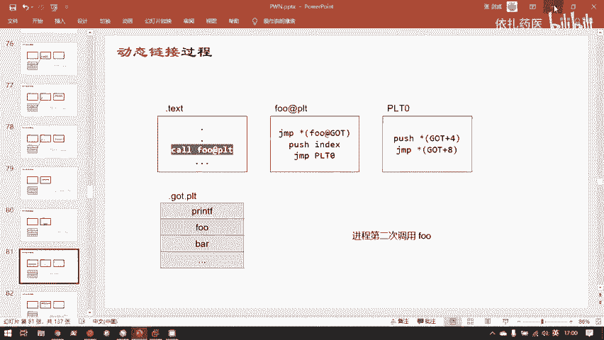

就像你必须把站的工作方式记得非常清楚，你才能进出信息战出攻击一样。嗯。我先把这个程序发给大家，大家可以按照我刚刚调试的步骤调试一下，然后看一下PPLRT和got的工作方式。

然后在调试的过程中去记忆和理解，结合PPT，然后去理解这中间究竟是个怎样的流程。嗯，照顾一下，可能就是进度跟的不是太上。然后发一下GD所用到的这个指令。返回上一步的指令。嗯，这个是程序是没法。

他在动态调试的过程中，也是他执行了下一条指令，它上一个状态就丢失了。如果你要回到上一个状态的话，你只有你呃比较方便的办法是在当前你执行位置的上一条指令处打一个断点。然后直接run起来。

然后停在了个断点处。嗯，我这里可以演示一下。比如我此时执行到了第二个cos这，然后我想看一下。执行完了第二个pos，我想看一下，唉，原来的第一个pos刚执行完是什么状态呢？

我现在并没有一个回退到上一条指令的这这样一个功能。我只能比如说。我此时对于有C语言代码的状态，我可以。然后黄浩。因为很少用这个应该是对B横号，然后在9这打一个断点，然后直接再重新run一次。

然后他他就呃因为默认的一个，我刚刚最开始为了让程序停下来会有B妹，所以呢。我就会在这个第一行的第五行，这有个本它就有个断点。我们现在可以用音走。B来看一下断点信息。那么这个ma函数开头的这个断点。

一号断点我们就不需要了。因为我们现在只想知道第一行pos执行完之后，程序是一个怎样的状态，我们就可以这样使用。D就是delete deleteele的缩写，你就写一个首字母D。

然后删再加入一个你要删除的断点的编号，这是第一回撤。然后我们再inle。就看到只剩一个断点了。好，我们再重新run，你可以看到程序就直接停在了第一个puts执行完，第二个pos还没执行在这个地方。嗯。

这是有C语言代码的情况，没有C语言代码的情况，你就不能B行号了，你就只能B一个地址。比如说此时的这里有一个反回边窗口，我们可以递到。4001162，这也是在两个po字之间，对吧？B。

但是你要输入地址的话，你就加一个新号，然后您叉40。多少？你查40。11621162。好的。😊，然后现在又打出断点，那么又那我们原来那个断点又没用了info。然后第掉第二个端点，然后重新转。

你就可以看到它直接停在了。我们规定的这个地址的地方。嗯，还有一个很常用的指令，目前还没有讲过，那也顺便说一下CC是contue的。C是continue的缩写，就是C就是继续执行程序。

对于这个此时我只有一个断点的情况，那我按C的话，那他就是一直执行完毕了，然后程序退出了。呃，如果程序在当前指令的下方还有一个断点的话，那么C就是会只一直执行执行，直到遇到下一个断点或者遇到。呃。

输入或者程序呃中断这样的情况才会停止。这是C sir。

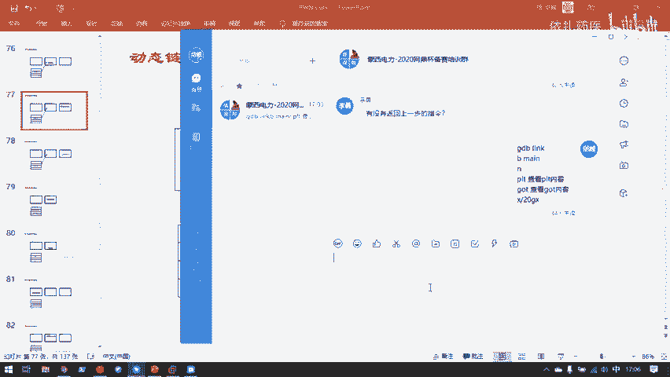

嗯。那可以把GPT还有几个功能也扩展讲一下。这里新写一个程序。呃，这里已经有一个可以用的。我们先GDB调一下这个 dynamic test。好，介绍一下另外几个还比较常用的秘密。首先。😊，没。

B妹是把断点下到内函数，然后你再用run就可以停在魅函数的入口。当然不一定非要这样才能启动程序。直接可以用star这个指令，然后程序就会回撤。程序就会停在。如果他能找到媚函数的话。

它就会停在媚函数第一行。如果没有显示标明的美函数的话，它就会停在。呃，程序的入口的第一条指令之前也说过了，程序的入口是star，而不是ma。ma在在ma之前还执行了许多指令。然后呢。SN是不过S是互径。

好，我刚刚在my put这函函数这里输入了S变成了互径。现在有两个指令，大家也可以了解一下，一个是ba。F。回车它是干什么的呢？它是显示你整个函数的。就可以说是函数调用栈这样一个状态。

my post函数是当前函数。这个函数是由什么调用的呢？是由媚函数调用的，媚函数又是由哪个函数调用的？是由。调用的呢是由li Cstarm函调用的。它把函数调用的组存关系给你呈现了出来。

然后libpsacystar妹函是又谁叫的呢？是star掉。这是back。再者就是。我有时候来到了一些特别特别长的酷寒数理。我想快点离开这个函数怎么办呢？

return就比如说我此时在my my code里，我不用不用一一行一行的去按N，然后让它一条一条代码执行，直到这个return，然后回到美函数，我可直接用retturn指名回车。

然后我们就回到了媚函数。可以看到这个。

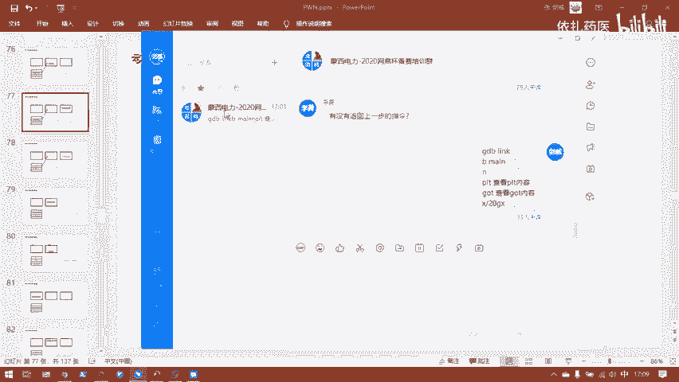

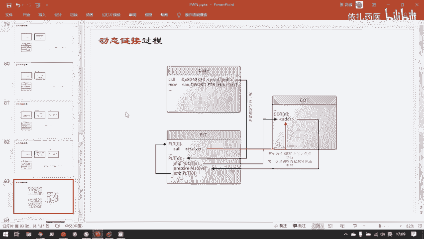

嗯。嗯，今天的时间也跟昨天进度差不多，昨天是刚好讲完return share code的原理。然后讲完了那个题目，最后呢就大家先回去有有兴趣的同学可以去看一下这个题目。然后第二天就对题目开始进行讲解。

今天也差不多，我们刚好到这里讲完了动态连接的相关知识。不过这一部分也是比较复杂。大家可以再进行消化一下。

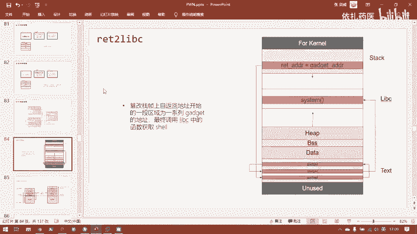

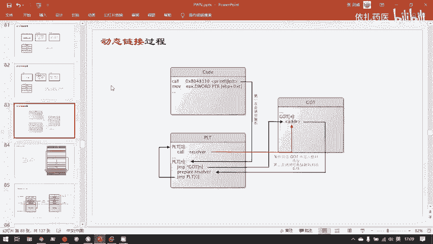

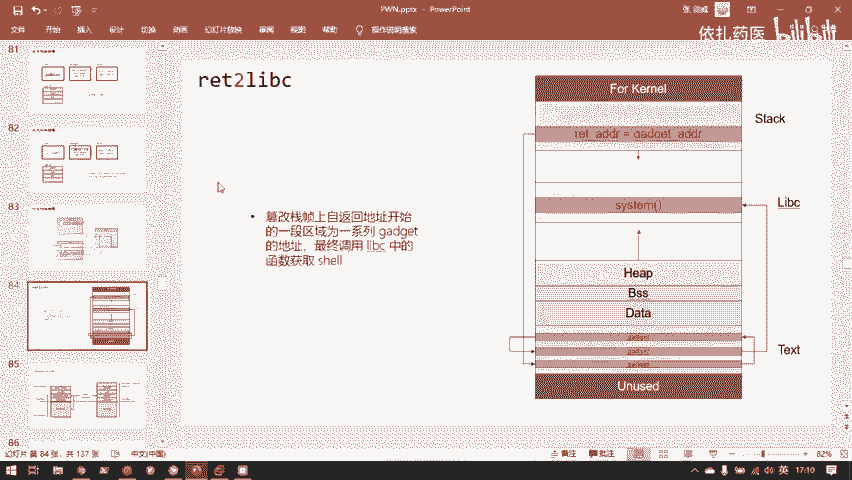

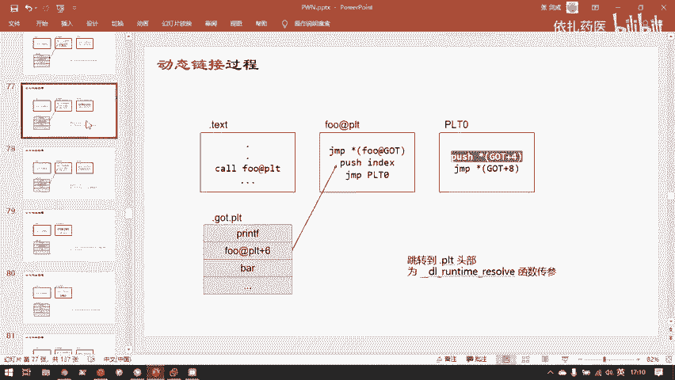

然后呢，接下来就是return to leave C。

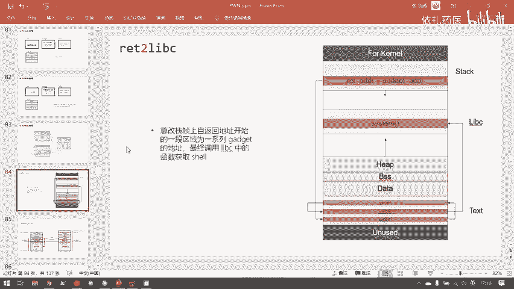