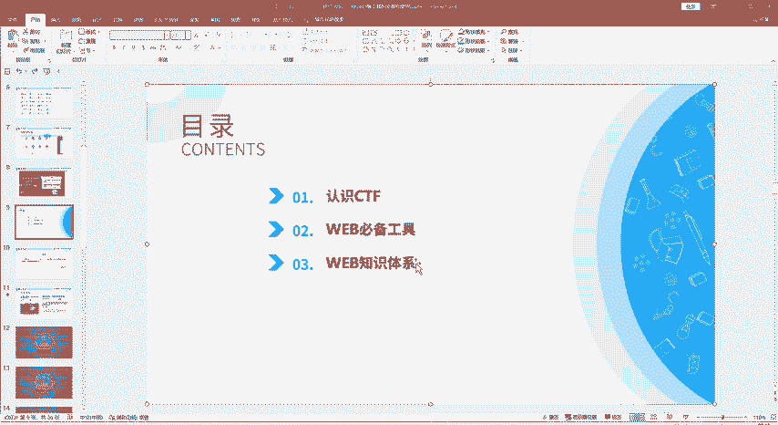
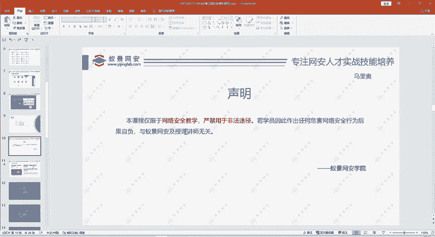
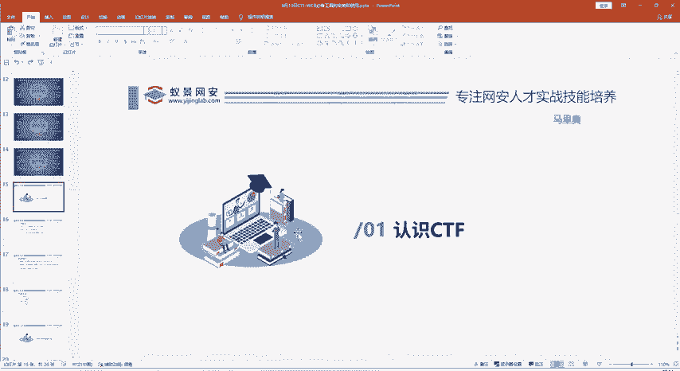
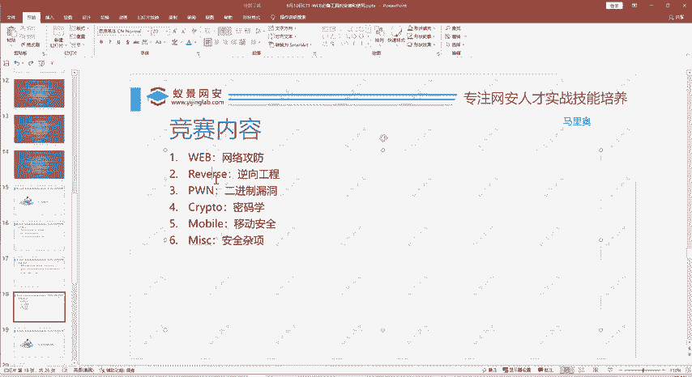
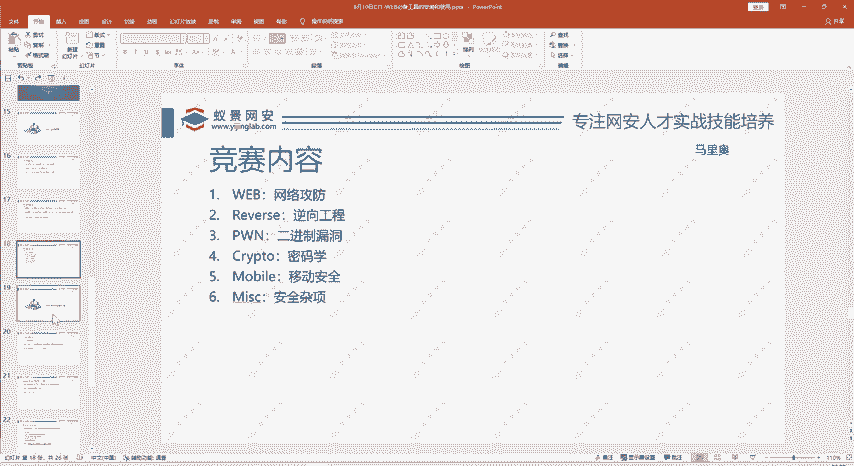
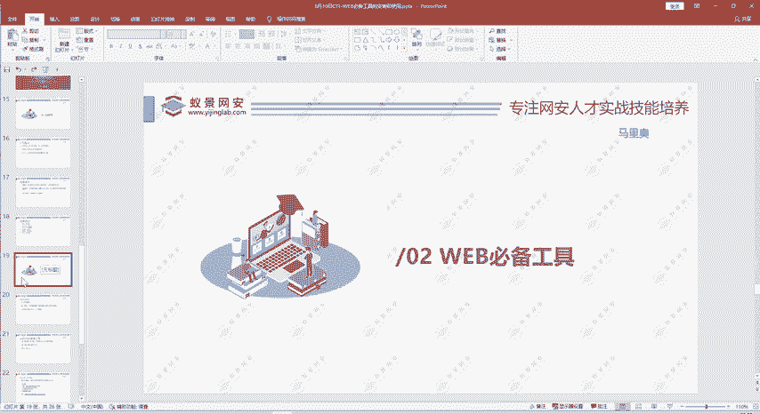
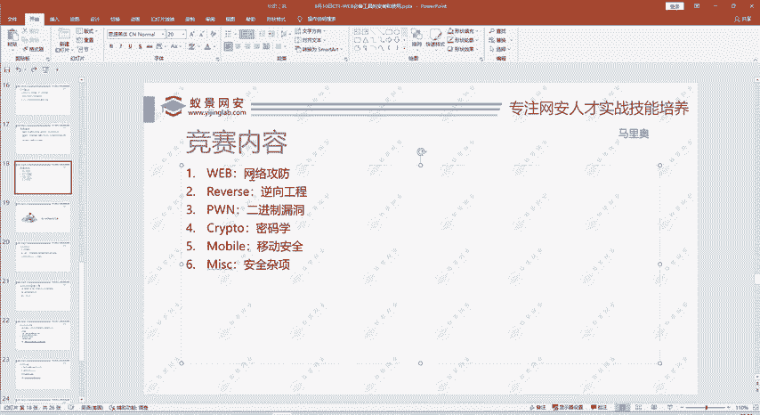
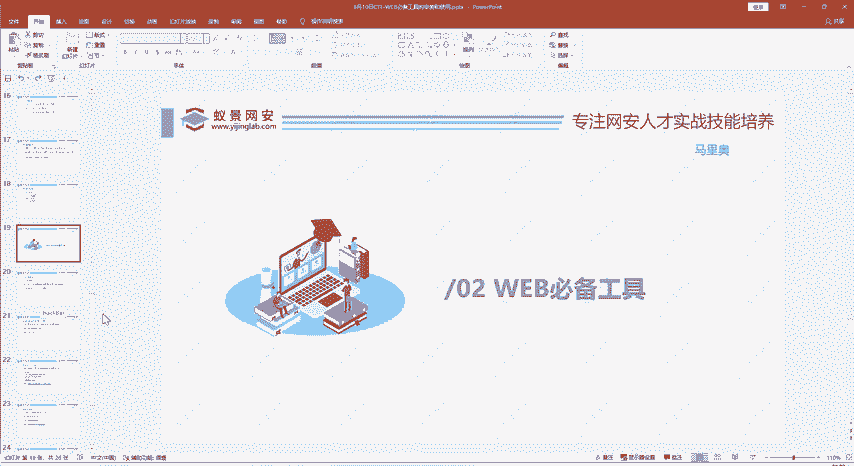
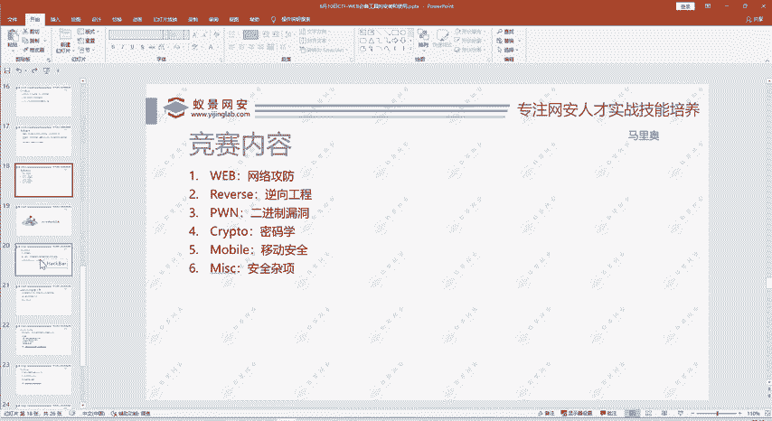

# B站最系统的护网行动红蓝攻防教程，掌握护网必备技能：应急响应／web安全／渗透测试／网络安全／信息安全 - P96：1.CTF简单介绍和攻防流程 - 跟小鱼学安全 - BV1SF411174M

那么我们现在看一下我们的一个课程的体系。今天的课程的目录主要是是分三部分。第一个部分呢是带大家。介绍一下这个CTF是什么。因为有部分同学还是不太熟悉的。😊。

然后第二部分呢就是给大家讲我们外部做CTF外部题必备的工具的安装使用啊等等。然后第三部分呢给大家介绍一下我们CTF webb的一个知识体系，主要有哪些知识内容？大家想要成为一个专业的web选手。😊。

在正式讲内容之前呢，还是要给大家讲一下我们的课程呢。😊，是仅限于网络安全教学的，严禁用于非法途径的。这里也是给大家找了这一些黑客的案例。这是为什么我们强调我们是仅用限于网拉新教学，不能用于非法途解。

大家也是一样，大家学习呢也是为了嗯获取成绩，获取高薪，也是为了自己的兴趣。肯定我相信没有谁是为了去做一些违法的事情。😊。

像现在因为网络安全越来越火热，我们生活中接触的网络的地方越来越多。所以说网络安全的风险呢也是越来越大。所以最近这些啊黑客的案例也是越来越多，像这是上个月7月20号的一个黑客案例。😊，两个黑客狱中相识。

然后出狱后呢，就相遇，因为作案5天就获你200万元。当然在。很快就被抓了。因为现在国家对这方面的。😊，那个管理也是严格的，然后技术手段也是有的。像去年的江西警方抓获的黑客就涉案1450万。所以这个是。

非常值得我们警惕的。所以我们一定要遵守我们的法律。有网络安缺法呀、刑法等等都有规定。啊，相信大家都是有志于做一个白帽子，不是做一个黑客。😊，当然我们要掌握黑客的技术，但是不要有那种黑客的攻击行为。啊。

那么现在我们进入第一部分呢，就是介绍一下CTF。

所以CTF呢就是capture the flag的缩写CTF嘛。那我们中午呢一般就要夺西赛，或者就叫CTF。这个起源于这个就是起源一种游戏。就像啊两个队一样，每个队呢有自己的棋。

那每个队的任务呢就是守护好自己的棋，同时呢还要抢办法获取对方的旗，把对方的旗抢过来，这叫夺旗嘛。😊，那么我们在我们这个比赛呢也是就是不是像我们像什么橄榄球啊，这些通过肉体的力量啊去夺起。

我们是通过我们的网络安全技术，通过我们的大脑。来。获取这个flag。那么这个CTF呢，它是起源于1996年的deevcom全球黑客大会。这现在也就20多年了，这个是怎么起源呢？

因为当计算机互联网刚开始兴起的时候。😊，就会出现一些论坛。当时有些人对互联网感兴趣了，就在论坛上发发帖啊，这在现在可能就是比较老土的行为了。当然在当时呢，他们就是世界上最潮最酷的一群年轻人。😊。

那么这群人呢，他们经常在论坛上交流了技术。那么有的人就想，因为主要是当时在美国那边嘛，他们网络比较发达，他们就想搞一个party。呃聚会把这些聚起来。所以他们就在拉斯维加斯呢举办了一个线下聚会。

在线下切磋这个。计算机技术。那后面他们觉得这种形式非常好。有助于大家提高计算机技术，也有助于检测大家的一个计算机的掌握程度。所以说他们就约定后面每年呢都会举行一个这种CTF比赛。

所以说ZTF呢就起源于96年的这个deefcon全球黑客大会。那么现在呢这decomTF呢已经成为全球的技术水平和影响力最高的CTF比赛。经过20多年的这个发展呢。

因为CTF比赛它具有这个知识性、趣味性，还有严谨性。CTF考察人的能力还是比较准确的。所以说现在CTU比赛是越难越火了。可以说现在比赛就是根本就打不完，像那种比较大型的有影响力的。

就说国内的赛事基本上每个月都有。那小心一点的，像呃各个大学自己举办的1个CTF比赛，或者说现在国家对网络安全越来越重视。我们的啊体制内的那些单位，他们也会国企啊，或者一些政府部门也会组织一些CTF比赛。

😊，像我们也会给他们做一些培训。这种比赛就更多了。所以说大家啊趁年轻。赶紧学好我们的CTF比赛以后用处是很大的。学好我们CTF知识。😊，只要选好了大家不愁没有发挥的地方，这个舞台是非常非常大的。

只要你有这个能力。这天比赛他的。😊。

比赛形式呢它有三种解题模式。至于参赛人数呢，那要看这个举办方的要求，有的是可以个人参赛的，有的是组队参赛的。就要看这个你是参加什么比赛了，是不是？其实个人赛团棋赛呢，这都可以。重要的是。

大家要把自己的水平提高，是不是你这是在一个团队里面，你也要发挥作用嘛？😊，这样你自己也会很开心，是不是？那我们CTO比赛呢，它的竞赛模式呢就有三种解题模式。第一种呢就是解题模式。😊，就是给你一道题。

然后你。找出这道题里面啊存在的系统漏洞啊。或者是程序存在的一些bug。通过这样来解决网络安全技术挑战。解决的标志呢就是找到flag。提交后呢就可以获取相应的分值。这种解题模式呢主要常见于我们的线上比赛。

😊，那现在也是越来越多了，因为大家知道现在疫情我们也有很多啊出行呢。😊，嗯，会受到一些。呃，阻碍。所以这种线上赛的阶梯模式是越来越多的那大家学好CTF比赛。在。坐在家里足不出户，就可以参加比赛。

获取名字，获取奖金。这是非常好的。第二种比赛模式呢就是攻防赛模式，最主要建议线下比赛。这攻防侧呢就是你有自己的服务器，对方也有服务器。那你需要攻击，你就要寻找对方服务系统的它的系统软件啊等等漏洞。😊。

找到了也就是找到flag。那你就得分，那对方也会攻击你，你要手勿了自己。不让对方找到你的漏洞，要及时修复，及时把对方踢出去。所以他就叫公房嘛，有公有房。然后第三种比赛呢就是一个战争。

第三种模式就是战争分享模式。他是比较新颖的模式，就是参赛队伍之间相互出题，他不是由主办方出题的。那最后要考察你的出题得分啊，解解题得分等等，这是比较新颖的模式。

那么我们下面再看一下我们CTF比赛的一个竞赛的内容，主要是有个六大板块。那么刚才有人说这个二进制和逆向啊，不是外部方向的对的，因为我们的竞赛呢是有六大板块。比如我们这期主讲的是外部板块。就是网络攻防。

主要包括一些什么cyclcle注入啊。啊，换成脚本攻击啊，文件上传漏洞啊，文件包含漏洞啊。嗯，PHP反定序列化呀等等。主要包括这些知识是外部方向。然后还有一个reverse立项工程。

大家学去C源的就知道啊，我们写个。print F hello word很简单，但是你要经过编译之后才能执行。😊，是不是？那我们逆向工程呢就是反着编译这个阶段，直接从二进制文件出发，先搞清楚它的源码呀。

它的算法特征呢。😊，等等。第三个方向呢就是胖方向。胖呢其实就是二精神痘痘，主要是一些堆溢出啊战溢出。然后第四个方面呢就是我们的密码学。密码写古典密码，现能现代密码。

要考察主要考察大家对一些密码算法的一个理解。然后第五个方向就mo板移动。就现在移动端的设备越来越多了，安卓的系统啊，IOS的系统啊。😊，所以说安卓的这些立项啊，它的安全呢。

以及安卓这些软件的安全也是越来越受到重视的。但这个移动安全主要是指安卓IOS题目分比较少，不能说绝对没有就比较少。然后第六个方面mm就是杂项，就是除这前骨部分之外的，主要是一些什么图片引写啊等等。

也是比较有意思。其实大家这些方面不一许不一定都要掌握。大家学习要有广度，又要有深度。广度之，你对每个方向要有一定的了解。毕竟我们打CTO比赛，你不能说对某个方向你听都没听说过，那一看就不专业是吧？😊。

要有广度，同样要深度。大家要根据自己的特点，选择1到2个方向来做重点的研究。就像刚才也问到有弹体赛嘛，弹起赛的话，你不是你不是说每个方向你都要会做，但是你要特别精通一两个方向。😊。

那么我做的呢就是we部和胖这两个方向，但逆向跟胖它的相似性表较达，有时候也做一些。

那我们下面来看一下我们的那个web的必备的工具。有没有别的方向讲解？啊，这个看我们训练营的安排了。

我们本期训练呢主要是给大家介绍我们外部方向的内容。😊。

那我们看一下外部的一些必备工具。

其实这每个方向都不错，不能说哪个方向好，哪个方向高端，哪个方向低端，没有这么一说，只是说你精通哪方向和不。😊，不太适合哪个方向。360行行行出状元，你这每个方不管哪个方向做好了，你都是人才。😊，到时。

大家都想抱你的大腿，都想跟你组队。你能解题能得分。这个得分就是实实在在的名次奖金。

