# B站最系统的护网行动红蓝攻防教程，掌握护网必备技能：应急响应／web安全／渗透测试／网络安全／信息安全 - P97：2.WEB攻防常用工具 - 跟小鱼学安全 - BV1SF411174M

那我们第一个看的这个工具呢，就是这个hi bar这个工具。

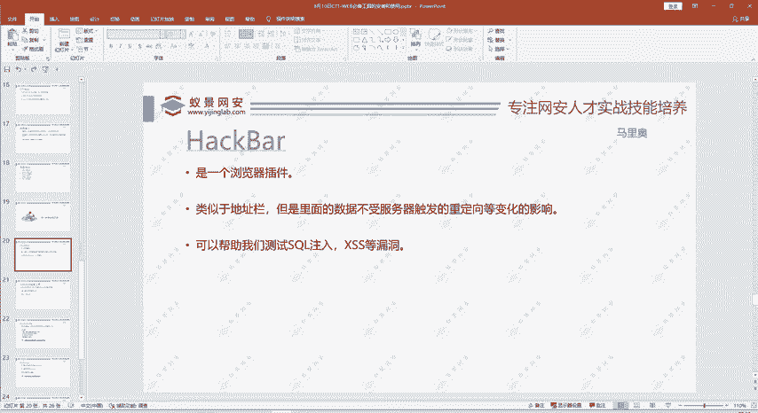

黑erb是一个浏览器的插件。啊，比如说我们这里。看一个我们移景的靶场，我们自搭到一个靶场。那我们这里可以点击一个检查，然后这里呢有个黑ick bar工具。啊，可以把这个URL可以直接导入进来。

然后在这里面进行一个操作，可以执行啊。比如说我们一般传餐的话，大家叫道船舱是。😊，用get方法传递参数的，就问号后面参数名参数值是不是？但是你怎么传递pos的数据呢？是不是不太方便？😊，不太方便呢。

那么我们用黑b这个工具呢，就可以这里直接点post date。大家可以在这里输入要pos的方式传的内容。这个工具作用很多，你看这里有假解密的这部分上MD5值啊下关值啊。😊，还有这个编码被6，你编码一下。

解码一下。1Lhix这些编码解码方式。cyclrcle一些语circle注意的一些语句啊，命令啊，叉SS啊这些都有。所以这个功能是很强很全的，而且使用起来也非常简单，它就集成在我们浏览器当中。

点击右键检查就进入到这里。然后你点到黑b这里就可以使用。😊，那么这个是如何安装呢？那有的人可能说我点击右键检查它，发现哎这里没有这个黑黑板这个插件。😊，这个插件吗？就是需要安装才能使用，那怎么装呢？

就在我们扩展和主题里面进行一个搜索。直接搜索黑客。8。嗯，现在这边网速可能有点慢，其实我们装别的插件也是同样的方法。你就在这里。点击这个扩展和主题，然后在这个搜索框进行一个搜索。

你想装别的插件也是一样的。搜索之后呢，可以显示一个搜索结果。所有结果这都是黑黑霸，他们是一个不同的版本。就上面这个版本呢啊用的比较多，它是不过它是要付费的，这个大家酌情选择。下面的这个版本也挺不错。

就黑霸V2。这个呢是一个免费的，大家点击进来之后呢，直接点击添加之前没装过的，这里就是添加添加就可以进行，它就会帮你装好。😊，那么你后面如果说你不想用这个插件了，同样的在这里点击移除就进行了删除。

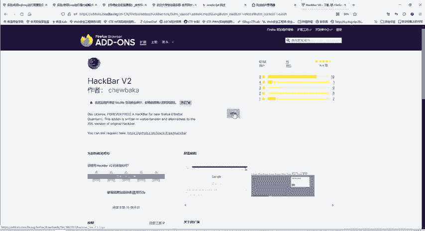

添加好了之后呢，你再点击这个右键，你不管在浏览器哪个网页当中呢。😊，你再点击右键检查之后就能够看到黑吧这个选项了。然后呢。在其他的。这些功能你都具备。你还可以添加这个cookie呀。

这些信息都是可以加的。啊，那有人说那个谷歌。谷歌也是同样的方法，在这个扩展里面进行搜索。这里为什么不给大家看谷歌的例子呢？因为谷歌它搜索需要科学上网才能搜索到。😊，就是骨骼的一个特殊情况。

那有人说360中搜索不到，360中搜索不到也是可以安装的。那么请啊想安装的同学呢，还是加一下我们的班主任。在别的浏览器里面，即使他自己的市场里面搜索不到，也是可以进行安装的。😊，加一下班主任。

后面我把安装的那个链接，就是你在浏览器扩展里面直接搜索不到怎么安装发给大家。😊，啊，加了加了就可。😊，加上的话，你把你所需要安装什么软件，你跟班主任说一下。后面班主任再把你所学的资料发给你。

这是我们黑黑板。然后它里面的数据就不受服务器重定向变化的影响。什么叫不受重定向变化的影响？就是这点。我想在这浏览器里面输入是什么内容？这个是上传图片的，还不是啊那么明显。

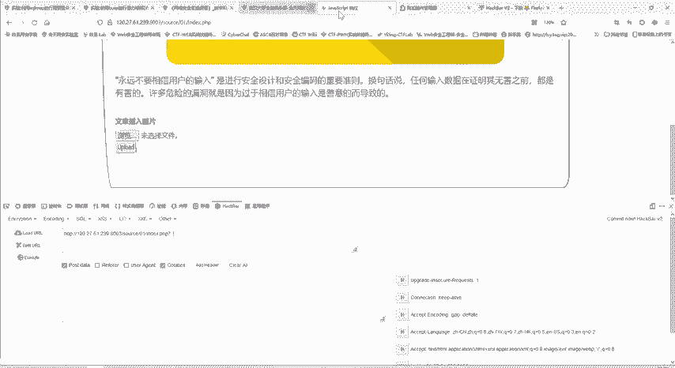

如果说大家做这种circle注入的题目。

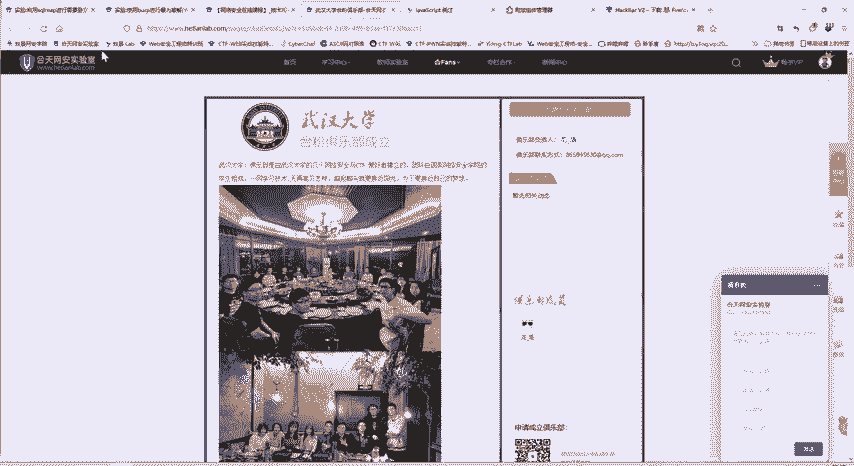

就会非常就会非常明显，它作用就会非常大。在这里面啊测试ID等于一啊，等于2啊。你看这个URL就直接变化。你如果在这上面输入，它每次重进一下，你会比较麻烦。但你在这里面输入。😊，他还是会执行。

你这操作就比较简单。如果说要。传输用pos的方法传递数据啊，你都在在这里输入非常简单。😊，非常方便。他还有集成的工具，帮我们编码解码加密呀，帮我们测试c数注入漏洞叉33漏洞等等。

所以说这个插件是我们经常使用的一个插件。啊，第二个工具呢就给大家介绍一个web shell的管理工具。什么叫外C管理工具？大家是不是都听说过啊一句话木马。😊，一句话木马，那我把木马传上去了之后。

如何进行管理呢？我怎么连接上我传的木马呢？是不是？😊，一句话木马就是。这里啊因为很简单，就直接给大家写了。是不是一句话不嘛就是要在一句话的。范围内。其实呢这就是一个一句话码，这个码你传到服务器上去。

你就可以控制它。但有人问怎么控制？我传上去之后怎么控制呢？就通过我们的一个we部效管理工具来进行控制。主要是三种，一种是一箭、冰蝎，还有哥斯拉。那之前的那种中国菜刀啊用的比较多。

但是现在呢就逐渐的淘汰了，用的比较少。而且现在中国菜刀呢好多你下载都是带有后门的版本，所以这里就不给大家介绍中国菜刀了，就给大家讲以健冰鞋哥斯拉这三种。😊，比如说我们的已键进怎么进行一个使用呢？这里。

这里可以看一下我们的一个啊文件上传漏洞中。已健呢？这是它的一个下载的资料安装包，它分为两部分，一个是loadode，这是加载器。另一个呢是它的源码，如何进行安装呢？😊，我们。

把这两个文件进行解压缩之后呢，我们进入这个loader这个文件夹，这里面有个ent word这个应用程序。😊，安装不了也。原代码。所以这里就是在教大家怎么安装呢？我们用这个加载器进行安装。

直接点击加载器当中的这个unice word。😊，啊，由于我这里已经装过了，所以说没有出现那个大家种的时候会刚开始会出现一个初始化。啊，要求大家。进行一个初始化，进行初始化的时候就选择工作目录。

选择哪儿呢？就选择我们的源码这个目录就可以了。😊，就N word这个目录。这些工具呢大家没有的都不要慌。直接找班主任进行领取就可以了。班主任呢就是大家的学习助手。大家学习当中有什么困难，有什么疑问。😊。

都请跟班主任联系。同样的啊还有冰夕啊、哥斯拉都是啊类似的。一个。工具他们当他们几个呢，为什么给大家介绍三个？就是有些有时候某种软件呢被封了，你用不了了，大家尤其参加一些。互网的一些比赛啊。

或者说有时候有些体制内内部组织比赛，它不能连接互联网的，他可能把魔中软件封了，你就要用别的。所以这。😊，这里啊给大家介绍三种。那么如何使用呢？其实使用也是很简单的。啊，只要大家跟着操作肯定行。

比如说这里是我们的一个文件上传那个漏洞的题目。那么这里面呢？我们就可以上传一个文件。比如说我们看一看we需点PHP的内容是什么？就是我们刚才写的啊一句话木马。😊，那么我们就进行一个上传。进行上传。

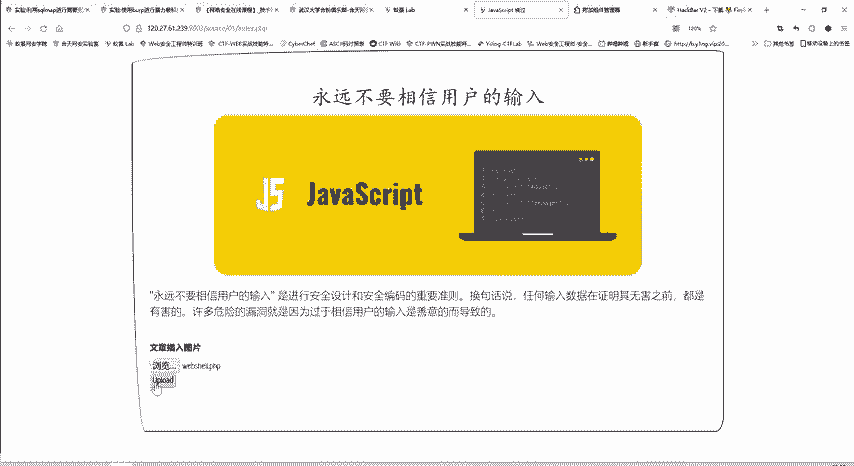

是不是我们直接上传木马了，一般都是不会允许的，它会有各种各样的限制。我这里就告诉你，只允许上传图片。😊。

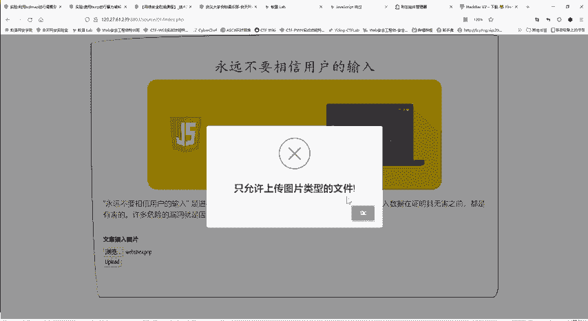

那我现在就想给他上传木马，是不是？😊，大家在比赛做题的时候，就是要上传木马的获取服务器的权限嘛。😊，我谁没谁给他上传图片呢？这个又怎么办呢？这个时候啊我们就需要绕骨它这个限制。这是文件上传漏作的题目啊。

后面给大家。😊，有先给大家讲这个文件上传的这个虚拟型的时候，再给大家讲详细的这个题的做题的原理。这里呢我们就直接进行一个做题。😊，现在就可以上传成功了。

因为我们在设置里面把这个javascript给进行了关闭。这里本来是te，现在改成force。😊，那么这时候他就以为我们上传了一个图片。实际上呢我们还是上传了一个木马。

我们现在打开我们上传的这个we c点PHP发现是不是哎什么也没有。😊，源码也看不到什么。那么上传的一句话木马是不是没有用了呢？😊，不是啊，这个时候怎么利用木马，就需要我们。这个已键这个工具。

我们这里点空白处后，点击一个右键，这里个添加数据。把刚才复制的URL呢给粘贴过来。然后这里连接密码连接密码是什么？就是你上传的这个weshop这个。这也是传递的参数，参数名也叫连接密码，不管叫什么名字。

都是一个意思。你这里和这里保持一致。你不管你取叫零啊，一啊或CMD啊，pass word啊取什么名字都可以。然后我们点击一个测试连接啊，这里出现连接成功的标志呢，就说明我们已经把木马激活了。

那我们就可以添加。这是我们刚刚添加的这条数据，我们直接双击进去呢，你看这个服务器就已经被我们所控制了。😊，条件里面他的目录啊。啊，每个文件夹有什么内容啊，我们都可以看到。😊，你像这个就是啊。

这个t里面有个。flag点PHP。flag这个文件。是吧这里面就写的flag大家做CTF题目也是这样一个过程。你获取了服务器权限，你就能看你们的文件就能知道flag是什么，然后复制出来。😊。

进行一个提交就可以了。但是他的功能远不只看文件这么简单。

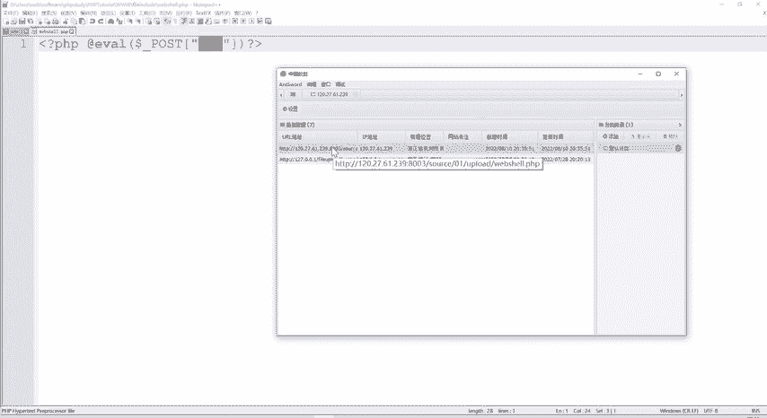

我们点击右键给你一个虚拟终端，是不是？就你还可以直接。像我们本地一样，打开这个终端执行命令。都是可以的。所以这个小小的这一句话，配合我们已建的工具就能发挥强大的作用。啊，这些。

安装包啊这些资料我们都是有的，但是都是找班主任啊，是班主任是大家这些学习这些资料的助手。😊。

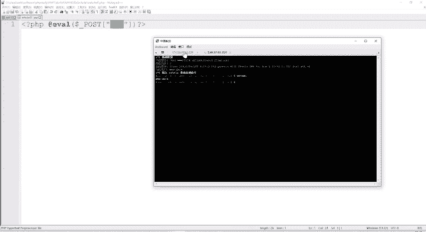

，已见这个冰线和哥斯拉呢，我们就不一一给大家详细介绍了。😊，都是类似的。因为我们后我们课程的时间呢也是安排的比较紧凑的。我们后面还有很多内容要讲。😊，现在给大家介绍一种我们在word部安全中呢。

可以说最常用的最必不可少的一个工具就是。😊，这个bp suit。速是什么呢？是java编写的一个。用于测试网络应用安全性的一个图性化的工具。它的主要功能有什么呢？就是拦截可以拦截查看呢。

或者修改网络请求和响应。然后呢。还可以自动化的扫描外部程序的安全漏洞，自动化的攻击漏洞，还有自动的解码。那么如何使用这个per suit呢？这里我们核天网安实验室也有相应的实验。嗯。

我之前啊对我之前已经。打开了打开之后呢，就可以点击创建虚拟机。😊。

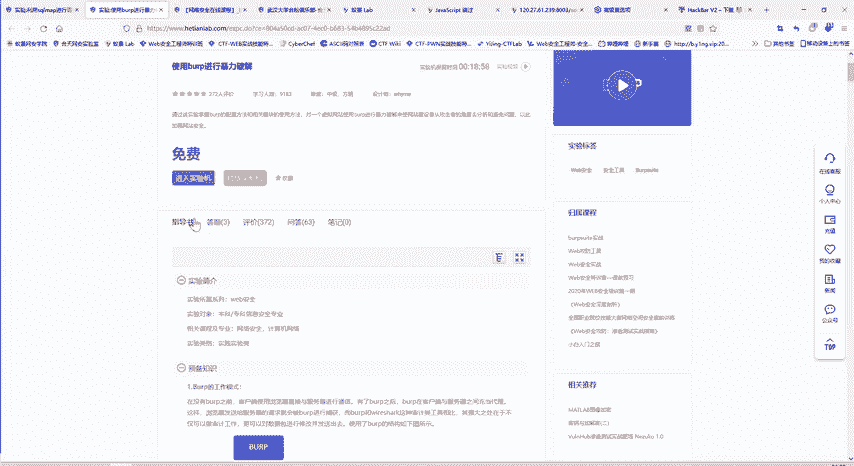

点击创新拟机了之后，这里就可以一个进入虚拟机。我们点击。哎，这个。可能刚才创建久了没有进来，现在出现问题了。

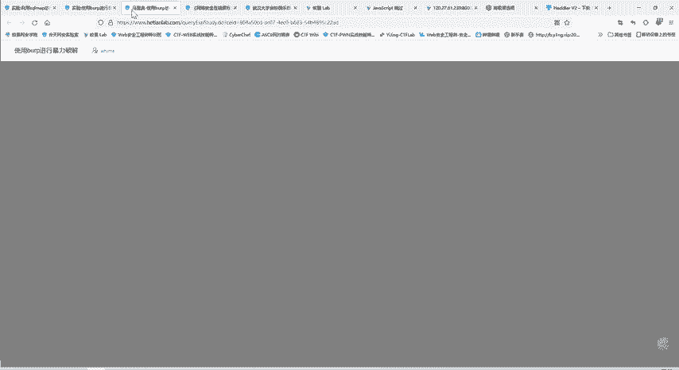

我们先把这个。实验机进行一个释放，然后再重新创建虚拟机。我们每个实验呢我们核心完善每实验都配有一个实验的解说视频。还有实验的一个指导书。相当于一个文字版，一个视频版，还有这个一个实验机和一个实操。

这是三合一的。只是既有文字，又有视频，又有实操，这样保证大家能够学懂学得透彻。而且自己也会操作。你看这里对波普的一个工作模式是怎么样进行一下介绍。其实我们本来浏览器访问服务器就直接进行一个访问连接。

然后服务器响应呢，就把这个响应包发给浏览器。😊，加入bp呢就是在他们中间加一个中介，他们俩不再直接连接了。浏览器把请求发给bp，bp再转发给。😊，服务器服务器的响应也是发给bp。

b尔p再转发给这个浏览器。😊，那么在这个过程中呢，bo表就可以进行一些拦截呀、修改呀。进行一些扫描啊、攻击啊都可以。这是b它存在的一个模式，工作模式。那外部可以进行什么呢？比如暴力破解啊。

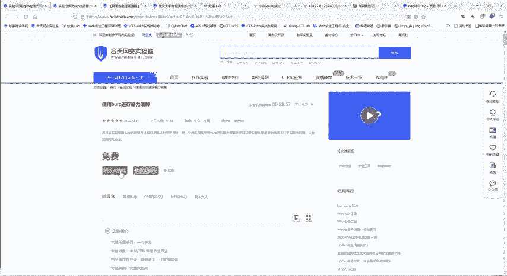

这个我们在本机上也可以进行一个暴力破解。

然后我们实验，比如说你这里他详细给你讲了这些，但是光是文字呢，有可能对于不某些初学者来说呢，就不太那么容易理解。这个时候呢大家可以点击这个播放视频。

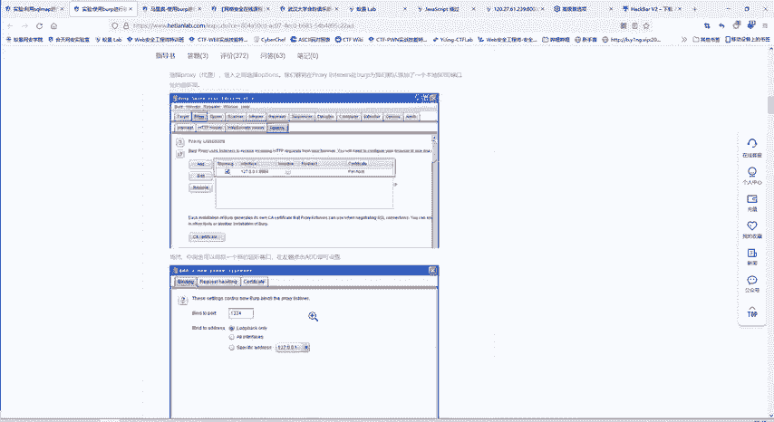

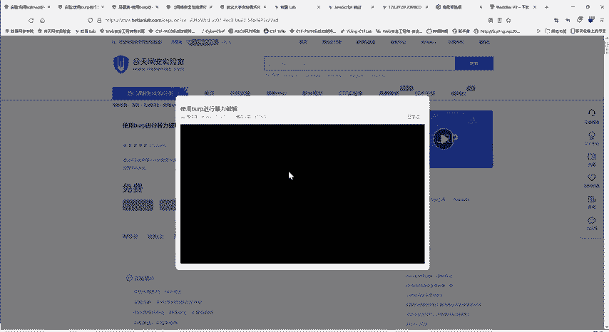

还是暴力破解嗯。大家可以点点击这上面都有详细的一个操作过程，重新刷新一下。就非常方便，给他家介绍一支双。后面是compare repeatpeat each。

那啊这个我们先把大家如果说这个指导书没看太清楚的，可以看看这个视频。😊。

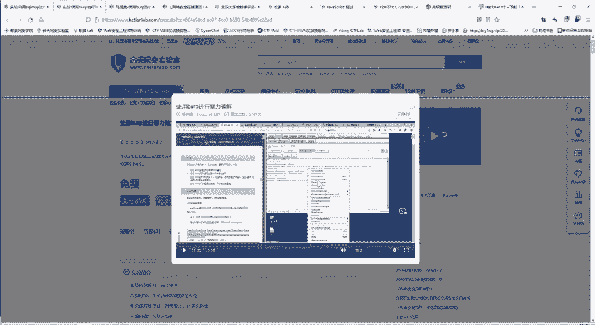

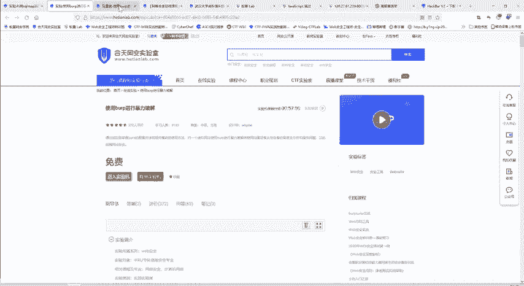

那么我们在本机呢也是装了这个we suit了。点击打开。这里点击run，为什么要通过这种方式run了之后呢打开呢？由于我们使用的是b的一个。professional专业版。然后当然是经过嗯激活的是吧？

所以要通过这种方式进行一个激活。

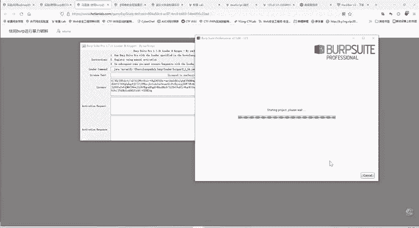

那么这就是我们的一个bbe suit。这是。它分为多个模块，比如dashboard，这是一个面板模块，主要显示它的一些主要信息。就是写他访问的。我们访问那些目标，他进行了整合，这个代代理模块啊。😊。

这个爆破模块等等。那么这个bps的如何用呢？它的功能非常强大。我们一节课呢不可能给大家讲完这里啊给大家。😊。

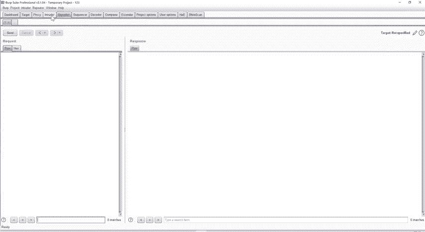

看一下我们如何进行一个。帮你破解。

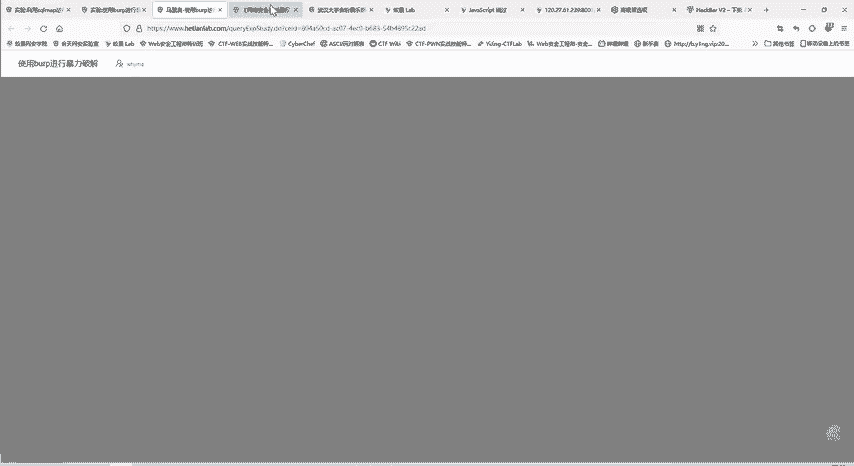

比如说我们。我们还是看一下我们自己的一个。靶场。嗯。我们自己搭建的一个靶场，在本地进行一个搭建。大家听说过1个DVWA靶场吗？😊，DVWU靶厂它是非常全的。我们。使用PHP study可以部署一个。

PHP的环境，然后就可以搭建1个PHP study的一个。DVW靶场。

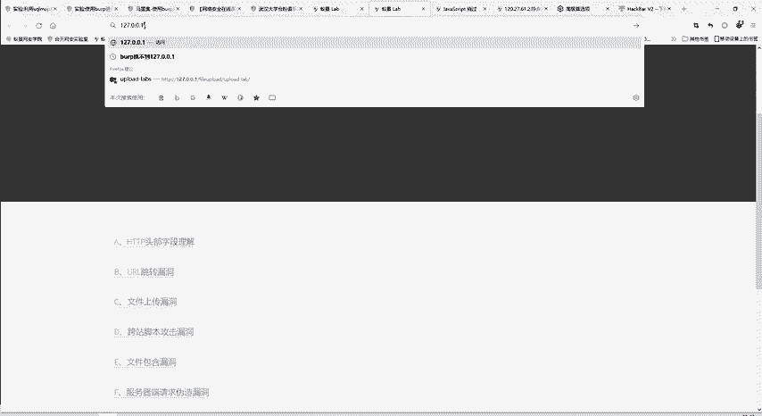

靶场呢是有难度等级的。我们先从最简单的开始。对那个报音破解模块。比说这个时候用户名是什么？我的 me密码我的 me试一试。啊，这个密码不正确。那么如何把这个用户名密码破解出来呢？

我们这时候就可以用我们b自的模块。这时我们在浏览器上开启一个代理。😊，那么。我们对浏览器的访问。是不是就进入了刚才的。这里本来是直接浏览器和服务器打交道，现在呢。😊，是被bu所拦截的。

所以刚才的这个访问直接就在我们b当中了，我们可以选择把这个包发过去，我也可以本选择进行一个修改。这里这都是可以输入的。因为这个啊网络请求是很多，他都被拦截下来了。这个拦截也可以关闭，拦截关闭之后呢。

就不会每一步都要我们点击发送才会进行。😊，他就会。自己就发送出去，但是它的过程会被我们记录下来。那么这是我们刚才进行的访问，是不是？😊。

我们输入的user namead me passwordad me。就是怎么进行包破呢？我们可以把它发送到我们的包破模块右键，然后生得出匀出的。这样呢这个目标就给我们设置好了IP端口。

然后这些位置呢就是我们要进行包破。😊，包括就是是嘛，我就试一下是不是我的面，是不是我的面，123是不是我的面456都试一下。😊，这里呢我们重点试一下这个pass word部分。

然后这里就设置pay note。这里就可以导入一些啊简单的。导入一些payload。配6的什么？就是我这里前面的设置到perition就是。😊，要变的地方就是我重复的发份请求包，就好像大家在这。😊，啊。

网页上重复的不断的输入用户名密码，进行一个尝试一下，不断的发送请求包。只是现在是用bp来进行一个发送，不用我们自己手工来发送了。😊，那变的内容是这个。变的部分，那把命改成什么呢？

这就由pay node来决定。😊，我们这时候就可以导入一个爆破的字典。这个包括字典我看一下是在。文件。我在我本机上看一下这个我字典的路径是放在哪的。谢谢大家谢谢大家送的花。那么讲了这么多。

大家如果说有什么啊不理解的地方，那请就是直接说出来啊，我们直播课嘛就是。😊，让大家能够在课堂上就听懂。进不去。这里面就是专门的字典，有非常多的字典。😊，比如说有常用密码呀什么的，这字典非常多，随便。😊。

打开试试，这就把字典导入这，这些都是可能存在的一个用户名和密码。那么你觉得这些还不够，你可以自己在加。😊，说我想加加是不是有这个pass word，有没有这个可能呢？😊，或者是有没有什么。

456789都可以啊进行一个添加。那么添加好了之后呢，可以点击一个start tag。你看他就正在帮我们进行尝试。这7000多个大家手熟的话，那肯定嗯。一天都是5万，这里就在帮我们进去尝试。你看每次。

其他的部分都是不变，只变password这部分，这时候输入的是这个阿乱玛的面。这里呢otdmin12hodmin88什么的。😊，嗯，这位同学说的。对，字典呢可以下载，也可以。自己生成都可以。

就是大家后面在做这些题目的时候。😊，或者说在在现实的工作中，有时候需要进行一些包破。但是在合法前提下。😊，如果说你没有什么额外知识的话，你就下载一些大而全的字典就行了。如果说你知道一些对方的信息。

通过一些方法，比如说他是。年龄、性别、性别、身份证啊这些。那那么你就可以根据这些信息来创造一个自自己修改一个字典，这样你包括的成功率就会高很多。啊，这些资料因为我们这个是专业的培训机构嘛。

我们这个是2014年，我们就核田文安实人时就成立了，而且跟大学一直是保持着合作。所以这些资料我们肯定都是有的，都是很全的。大家需要什么资料的，都可以找班主任要。😊，包括我们课堂上没讲的。

大家在学习过程中有什么疑问啊，有什么资料找不到，都可以找班主任。😊，所以说班主任是我们的一个全能的保库。那么ad me。再进行一个登录呢，是不是？这就是。测试成功。

你如果说不是admin和password，你随便输入一些啊，肯定。那肯定就是失败的。就是通过这种方法呢，我们就能够进行一个口径的包破。当然这个。ba速它的功能很强大，用的非常多。像他的一些其他的模块。

这个repeer模块啊这些用的也是非常多的。😊，那我们明天给大家讲题，就会再用到一些其他的模块。到时。再给大家讲讲其他的模块是怎么样使用的。报出来了。刚才不是给大家看的吗？最特殊的就是pas word。

就进行筛选嘛。因为我们尝试了7000多个密码。是不是？密码肯定只有一个，那就是最特殊的那一个。那么下面再给大家介绍另一款神器，也就是我们scle map。它主要是用于cyclcle注入的。

所以中日我不在大家。就是之前了解过没有？所主要收注就是进行一个命令的拼接嘛。通过命令拼接的方式，把我们想要执行的命令给。传输进去。那如果说有过赛后注意做题经验的人呢，就知道拼接那个命令会拼接的非常长。

尤其是忙住的时候。😊，那个。代码语句。非常多。很容易出错，这个时候呢就可以使用我们的cyclcle map。它是一款python编写的一个自circle自动化注入的工具。

可以帮助我们探测目标是否存在社会主的漏洞啊。啊，以及它的数据库的名称是什么，表的名称啊，字段名称啊，它里面的具体数据是什么，都可以帮助我们进行一个获取。😊，那么这里呢给大家看一下我们的。

Cycle map。这是啊下载的一个压缩文件，解压后呢srcle map这些它是由python编写的一个工具。所以它主要的功能就在srcle map点PY这有python文件。😊，当中。

它功能是很强大的。那么如何使用呢？

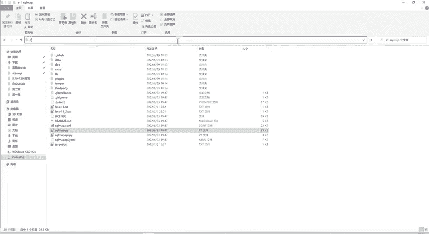

我们打开。在当前路园打开CMT。输python，但然我这里的python是python3。scle map点PY大家首次使用一个工具的时候，可能不太懂得怎么用。这时候呢一个同一种方法。

大家可以输入杠杠HELP杠杠help。我们可以查看一下帮助信息。这不仅对于cyclcle map，对其他的工具也基本上都是适用的。只要是一个基本就良好的开发者，他都会设置这个帮助信息。告诉我们怎么用。

你看输入杠H或杠 help就显示这个帮助信息。杠杠ver显示版本信息啊等等。除杠U后面接什么URL，就是我们要测试的一个。网站就我们要测试这个网站是不是存在一个scle注入的漏洞。

今天呢给大家讲的都是工具。这些工具呢就是能够大大提高我们工作的效率。大家在从事我们网络安全，应该对这些工具是不陌生。其实计算机本身也是一个工具嘛。

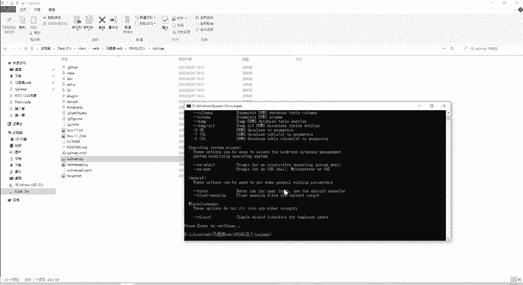

那么我们和田晚安实验室呢，也是有专门的。专门的这个实验。我们有专门的cyclcle map的一个实验教程。Yeah。其实在我们这里面也可以直接进行搜索。比方你想学什么，你想学s map的用法。😊。

直接进行搜索也是可以的。这里很多内容显示不出来，大家知道为啥？😊，因为把这里刚才给大家做题的时候，把javascript给关闭了。现在打开了这些功能就能够正常的使用了。

所以说大家做题一定要了解我们的原理，要不然做着做着很容易把自己的电脑给搞崩溃。😊，当然这是很正常的。大家学习的过程中正常的一个阶段。😊，靶场环境搭建，你是什么靶场，想要什么靶场？😊，这位同学说的很对啊。

就是尽量在虚拟机上进行一个尝试。😊，所以说我们的电脑就不会崩溃。靶场的话，我们有很多的靶场，文件上传的靶场，DVWV靶场。😊，cyclcle柱的靶场都非常多。😊，那么具体每个靶场是如何搭建呢？

就是把这个需求发给班主任。😊，那么这是你看我们的一个cyclcyclcle map的一个啊实验。他这个实验教程里面是分5个实验的，大家按照。大家打卡三天就可以用我们的实验室的会员嘛，这个实验都可以做。

按照这个顺序呢进行一个做。😊，这里呢就是你的s map进行一个需要登录的一个。注入。他也是基于我们DVWA靶场所做的一个实验。Yeah。这里面写的还是很详细的，如何使用。就是。

python circle map点PY等他这里把python选阅了。因为它这里设置的点PL文件呢，默认就是用python来打开。像杠U就是注入点，注入点呢就是网址。刚才给大家是不是看了。

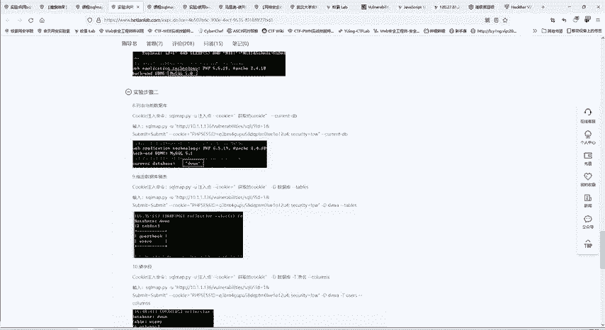

杠U后面接的是URL。网址。然后后面呢杠杠cook。

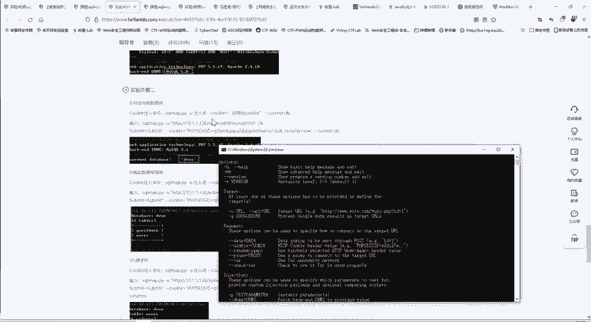

因为这里是需要登录的，所以说刚才利用bap抓包，抓到cookie把它复制下来，放在这里。然后后面接刚杠current DB就是查询。当这个网站的网站当前使用的数据库是什么？你还可以使用杠杠DBS啊。

杠杠tables啊这些查询有哪些数据库，有哪些表。只要它存在ci后注入的漏洞，我们利用这个cicle map工具呢就能把。😊，他数据库的信息都获取到。

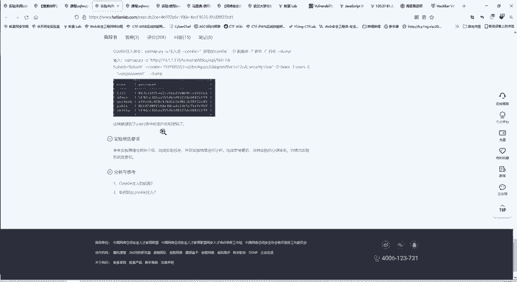

这是我们一个scle map的。一个介绍。