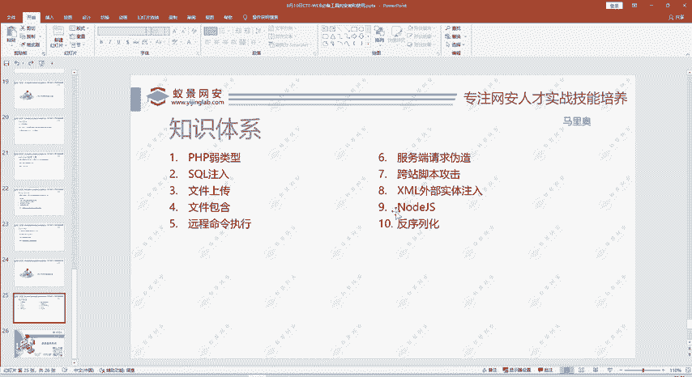
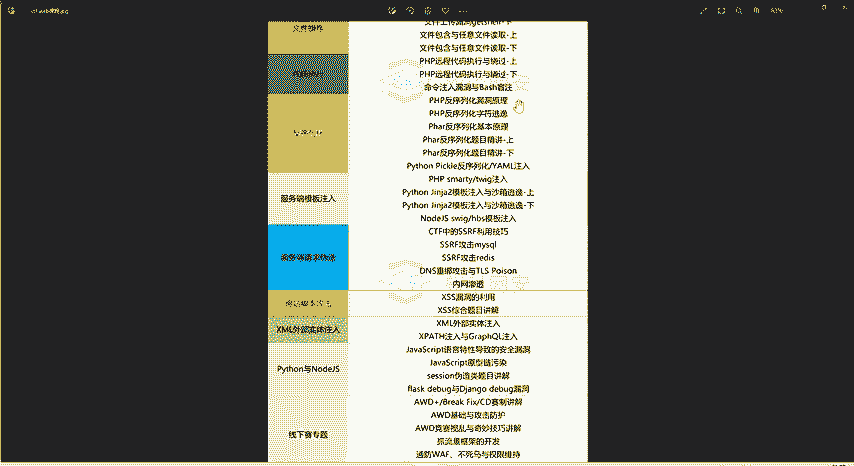
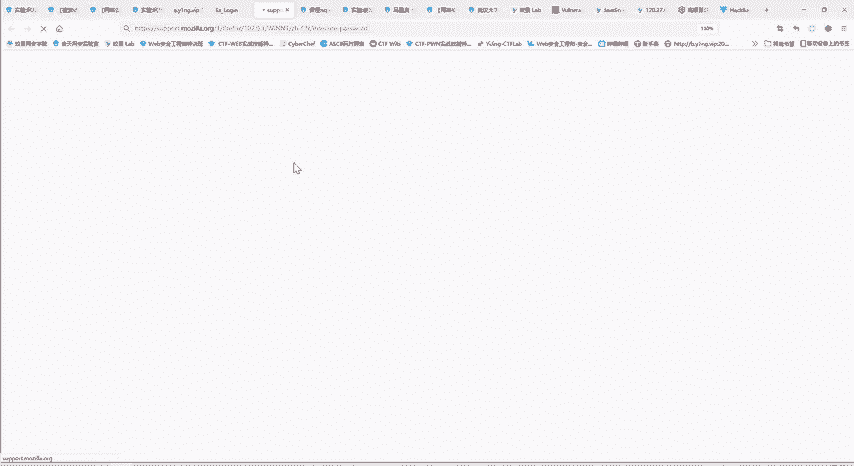
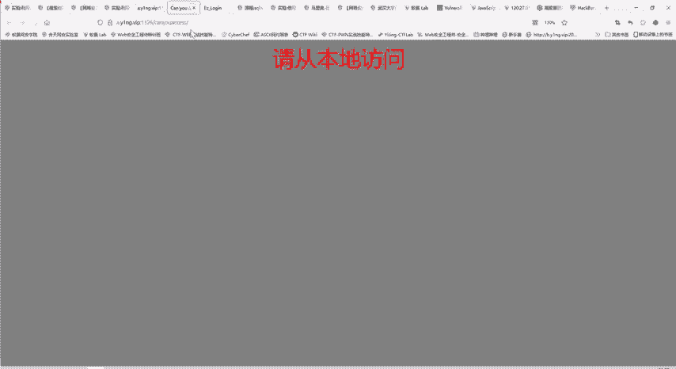
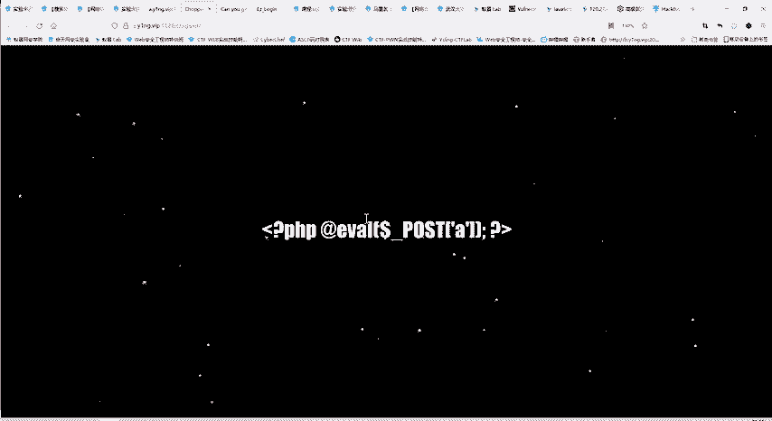
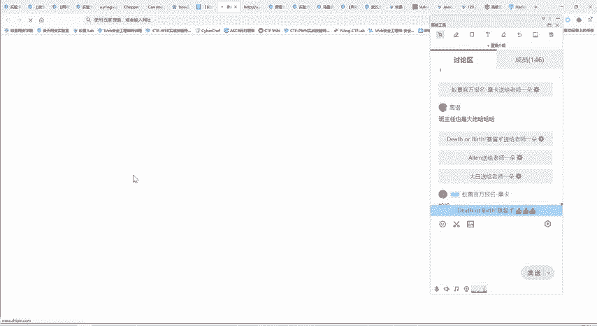
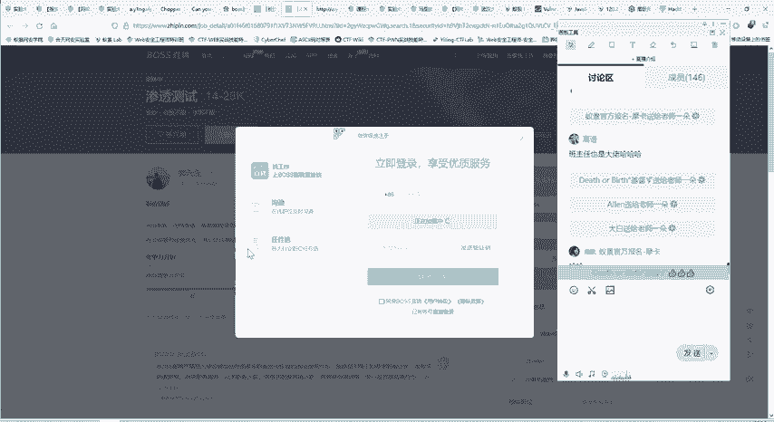
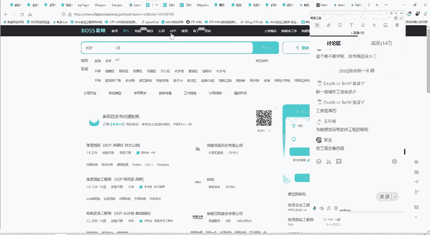
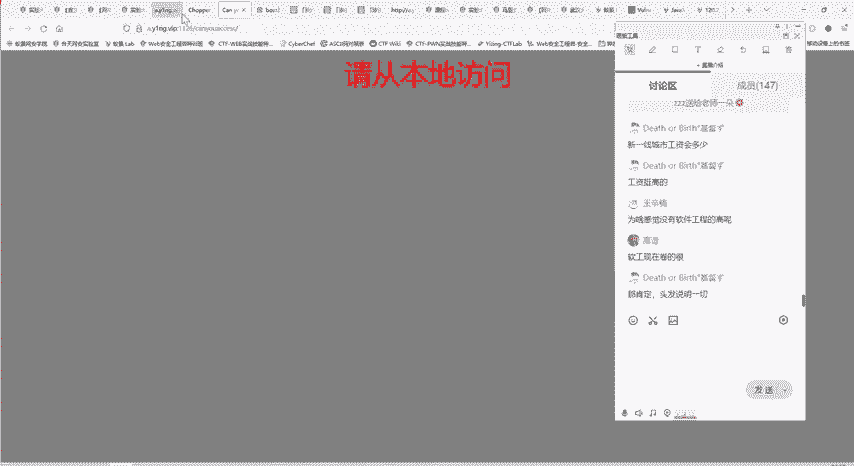
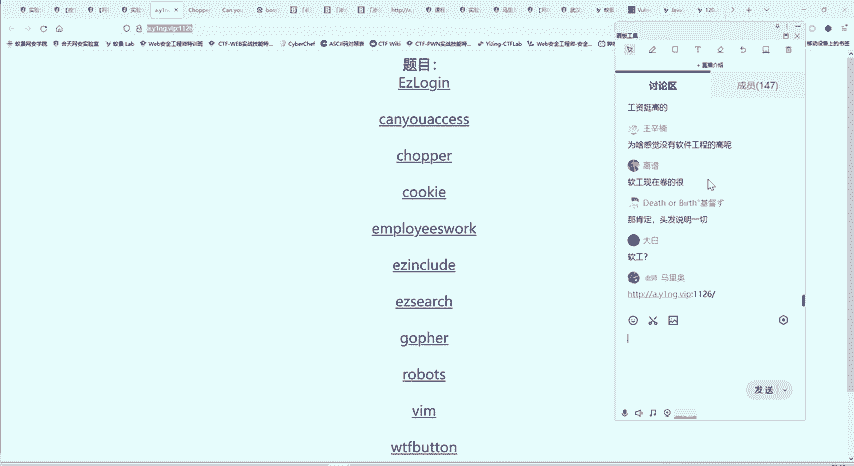

# B站最系统的护网行动红蓝攻防教程，掌握护网必备技能：应急响应／web安全／渗透测试／网络安全／信息安全 - P98：3.WEB攻防知识体系 - 跟小鱼学安全 - BV1SF411174M

那么呢最后一部分呢，我们给大家讲一讲我们的web。CTF web主要有哪些内容？其实呢主要就是十大板块。😊，啊，这里我们这里给大家列举出来，但是我有一张图是更加详细的，这里给大家。😊。

看一下我们。更加详细的一个图。主要是一些cyclcle注入啊，包括什么啊，新手村这些。😊，也会给大家讲这些一个入门的问题。必须弱类型啊MD5绕过啊。等等以及一些CTF比赛经验。

因为这天比赛它其实就是有点类似于我们的考试。就是你学的知识很重要，但是考试技巧呢它也同样重要，这是缺一不可的。然后se注入给他有什么内容呢？就是mycycl的一些利用是最主要的，题目也是最多的。

在现实当中呢，马斯克也是用的非常广泛的，有有。😊，联合查询注入啊、宽字节注入啊堆叠注入啊、盲注啊，还有mysq进行文件的读写操作啊。但其他的数据库用的少一些，但是也有可能用的。

所以也会给大家介绍cyclclenet啊，这个postographicl这些数据库的一个注入。😊，解题技巧会当然会讲啊。刚才是不是给大家说了，因为我们CTL比赛就是知识和技巧同样重要。

这个技巧有的是经验，有的是脑洞。😊，因为我们CTF是偷胎游戏性的嘛，脱胎游戏性去味性会比较强。有好多地方它是需要一些脑洞的。😊，还有比如说我们文件操作啊，文件操作呢文件上传漏洞，如何令文件上get笑。

就是获取目标的笑，获取服务器的权限。刚才给大家演示的是不是演示一个一句话木马的上传？😊，当然还有更多的一个检测方式，以及检测方式如何绕过呢？你让大家打CL比赛不可能。直接让你上传木马，是不是？

那这样谁都会做了。😊，那这个比赛的价值也就没有了，那肯定有些检测方式。那如检测方式有哪些如何绕过，我们都会讲，还有文件包含呢？😊，以及如何利用文件包含do洞读取文件任意的文件的读取。

代码执行的这些反序列化啊。😊，以服务端模板注入服务端请求伪造这些。服务端请求轨道就这里简称的SSRF。跨电脚本攻击就是叉SS。这是中文英文那个简称。他们外部实体注入啊，就他们文档。

它会调用外部的DTD文件，怎么利用这一点进行一个命令的注入。python的一些知识。这是知识点，I就。还要重点给大家讲什么呢？我们的比赛。比线下赛是怎么样一个做的？因为在线上赛的这些解题呢。

我们在这个内容讲这知识点的内容当中就已经穿插了。线下赛是B16，这是的。😊，因为我们线上赛呢好多就是初赛，一般。决赛的话好多都是线下赛。所以说决赛的话它的门槛会高一些嘛。😊，所以他讲的会更深入一些。

以及后面会专门有一个真题讲解的一个模块。这就是每节课都是带大家做真题。因为光学不练，学的很快都忘了。只有学和念相结合，才能学懂才能学好。这得学学pyon，其实。

其实我是建议大家直接学我们的CTF web，而不是说先学一门语言再学。当你有一门语言的基基础，当然是更好的知识肯定是越多越好。但是你想的大家可能出去人很少，我先把。😊，计算基础学好。

我先把啊python学好，先把C语言学好，我后这些技术都准备好了，我再学。😊，呃，这个外婆再学胖啊这些。😊，其实这个思路。效益是比较低的，学的是比较慢的。大家想学快。直接学直接学CTF web。

比如说对外部环境感兴趣，直接学CTF web。😊，然后在学的过程中做题，在做题的过程，学和做题过程中，当然呢会遇到一些啊问题，遇到一些不懂的地方。😊，没事，你不懂就问嘛，都会告诉你的。😡，不懂的用。

包括工具的使用，语，包括编程语言呢。包括环境的搭建啊，包括做题经验等等。你边学边做边学。这样你的学习效率是最高的。要不然等你把计算机基础啊，你的pyython的CI这些学好。其实就特别慢了。

而且你学到后面很容易忘记前面的。因为你没有你学这东西，你就纯粹的学没有实用。😊，不像是我们做CTF，你就说你就说要解题是吧？你学这知识是帮助你解题的。😊，所以你会觉得这些知识对你很有用，你就学得好。

要不然的话，你学这一些C语言的，你别学了，你又不去开发软件。😊，啊，你又不再做一些题。那知是对你来说。用不上，你很快就忘了。这是我们一个。我们课程体系的一个主要内容。这个客人体系呢可以说是非常全面的。

大家可能刚开始看啊，这好多概念呃，没听说过，这反虚列化怎么反？😊，或者说虚拟化是什么，没听说过，这是很正常的。😊，初学者嘛。但是你只要就是照着这个课程体系去学学明白了。学明白就是听课做作业。啊。

做一题目会的地方问，把整个这题目都做一遍。那么你的CTF就可以说是。能够直接去参加比赛的。你就是一个we部选手了。不管你是个人赛还是和别人组队，那别人可能擅长胖，可能擅长逆向m，你们组一个队也是可以的。

😊，所以别看现在这个内容也有点多，就因为它比较全面，你学会了就能参加比赛。那么实操在哪里进行呢？这个实操很重要的是可以说必不可少内一环。讲完讲这知识的同时就会讲实操。😊。

实操比如说我们啊明天给大家。讲的题目，这就是我们实操。因为我们就是专门搭建靶场的嘛，这个实验其实很多实验都是靶场，是不是1512个实验，我们的靶场。😊，搭建靶场的能力是很强的，经验是很丰富的。😊。

这啊这些每个都是题目，点进去。😊，嗯。

怎么做？大家可以嗯也可以自己先思考一下。

这怎么解？当家明天会会告诉大带家怎么做。哎，这个是不是很像我们刚才上传的一句话木马？😊，那怎么进行利用，怎么获取？flag了。嗯，大家可以先思考一下，因为我们明天后天呢都是给大家讲真题，说啊看这个题。

😊，这题怎么获取负能盖第一步怎么第二步，然后连用已键来连接啊这些。😊。

不是这么讲，我们会带着大家从一个初始这个角度来讲来讲。我刚开始遇到这个题，我肯定是不知道答案的。我不是说直接把答案。😊，12345步一操作就行了，肯定不表答，我进行尝试。😊，这个用户名是多少？我。

我随便试一试。啊，随便说什么。那我看一下它的显示一些结果。啊，或者说我看一下源代码，网站的源代码。会带大家。经历这样一个探索的过程。因为这个过程我觉得是对大家学习是最有用的。不是让大家备注这个题的答案。

那就没有什么意义了。主要是我从刚接触这个题，什么也不知道，脑袋里什么也想法都没有。从这个起点。怎么进行尝试啊，尝试第一种方案哎，发现这种方案不行。😊，不能用于这道题，那产生第二种方案，那又不行。

那第三种方案那可以。😊，是这样一个过程。这里我们啊这里可以看一下，随便。班主任也是大脑。对。白主人在我们这个网安全领域也有多年的经验嘛。大家有什么疑问的就可以发出来。😊，我们在。不s就屏价你看。

搜索1个CTF就是啊这主要是因为我们是在长沙呀，主要是长沙的一些工作。比像什么深透测试的，就14到28K。

你看都会写有CTF比赛经验的优先。

当然如果说大家在那北上广那种城市，肯定就是工作更工资更高一些呗。来后像这种。嗯，经验不限经验不限就是。其实这样就是刚毕业的，刚从事这个行业或者刚转行过来的意思。是是。就一般是10到15K14线。

这差不多是一个主流的。最少的也有13线，多的可能15线、16线。有主流的145。然后这都是啊一些刚入行的人。如果说你工作两三年经验了，一般就是20K左右。你看都会强调有这个提交漏洞经验。

或者是有大型CTF比赛夺得名次者优先。因为你这个CTF比赛你夺的名次，就代表了你在这一个方向的实力。新一县我们长沙就是新一县。你是哪里的？你也可以搜搜看看嘛。因为它这个直接就是识别到我IP是在长沙嘛。

所以就是给我显示的都是长沙的岗位。😊，你如果在别的地方的话，你们也可以自己去搜搜看看。跟我们CTF相关的。工资是挺高的。现在我们网络安全肯定是很热门的嘛。这个热度大家都应该能从。

社会行闻中感觉到这就叫出圈了，是不是不仅我们网络安全的圈子？😊，经常会引起社会行为。这个我们这里写的都是一些经验不限。你看都是初学者的意思。因为现在网络安全是一种供不应求的状态。但你有经验的人。

那你肯定就不是去面试这种经验不限的，是不是？要不然你的经验这个优势就没法发挥了。你有经验的人，你肯定是。有经验的那个。岗位是不是那工资就更高了。CTF比赛。他这个成绩权威性是很强，大家都很认可。

别人的认可是一方面，重你这方面很重要啊，就是自己能学到很多东西。😊。

就实之前就是有些大家听过明天的课就会知道给大家讲一。😊。

一些知识听了之后可能就是理解了。😊，说不懂吧，也懂了，说懂呢好像也没完全懂。😊，但是你经过做题，你把这个就是用一遍。那你就真的会了。你就不是处于这种模棱两可的这个状态了。嗯。所以说还是得念。

反正我们这个课程。一半知识，一半训练嘛。不能说哪哪一方更偏重哪方面都是很重要的。大对这些题目也可以啊，我把这个网址发在我们讨论区。大家明天的时候，明天白天也可以自己先摸一摸，先探索一下。😊，然后明天。

晚上呢同一时间会给大家讲这些题目。嗯，大家还有什么疑问吗？

