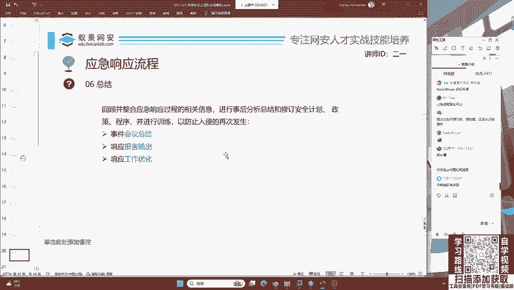
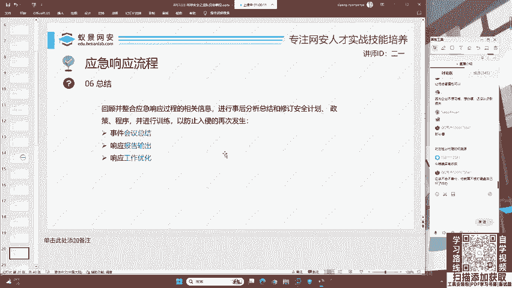
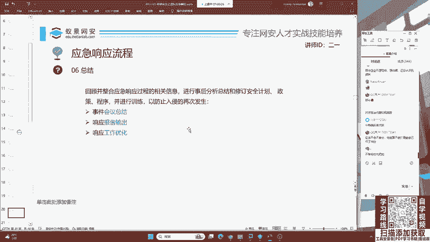
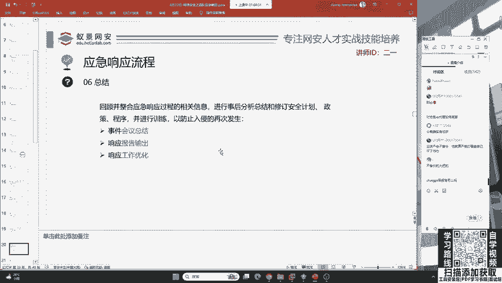
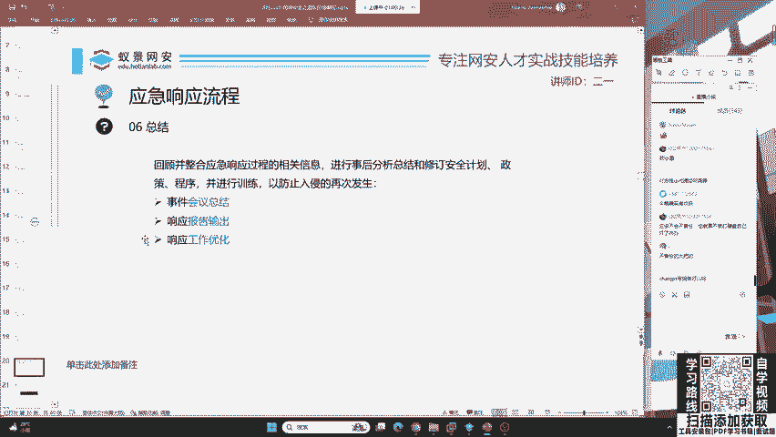
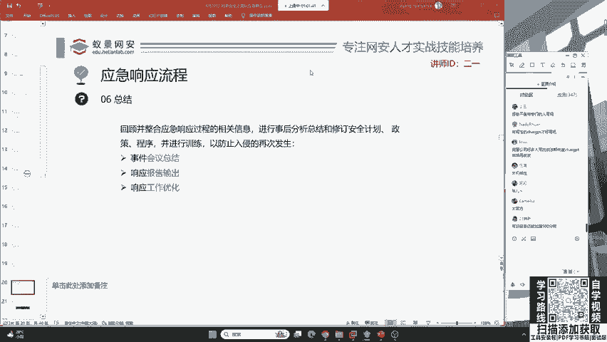

# B站最系统的护网行动红蓝攻防教程，掌握护网必备技能：应急响应／web安全／渗透测试／网络安全／信息安全 - P9：蓝队应急响应-8.总结阶段 - 跟小鱼学安全 - BV1SF411174M

其次呢就是总结每一个互网，不论你是参加国家级互网还是企业级还是行业级的互网，你都需要会写报告。就是说你自己。😊。

需要把这样一个整个的应急响应流程去总结分析起来，去给客户，给甲方说你做了什么事情在被攻击时采取了什么应急，采取了什么措施来缓解攻击产生的危害。这些东西啊，咱们都需要去有一个系统性的学习。

比如说你们都是大学的学生，有一个同学他会写报告，有一个同学他不会写报告，那谁会争得唯一的蓝队名额啊，大家心里都有数啊，我就不多讲了。

好，下面我们在叉着GBD可以写报告吗？😊。

这位同学啊chartGPT不行啊，咱们的报告都是有一定规范的。你现在啊而且是尤其现在这个chartGPT啊，它那个就是他的回答太太具有AI性了。就是说你现在拿1个chartGPT它回答的这个内容啊。😊。

你能明显看出来它有AI的那股味儿。就是说咱们正常安全工程师，你说不出来这种东西是吧？啊，所以说你要针对性的去训练一个安全相关的，或者是蓝队相关的这种IR模型才行。对，这个低调同学说的非常对，太机械性。

如果你去用啊咱们这个公开的GPT3。5或GPT4。0的话啊，他会答的别人一看就能传帮啊，就知道你是一个坏蛋啊，你再用这个叉GPT去帮你做事儿。啊，所以说咱们想去训练一个啊蓝队的AI还是非常困难的。😊。

O。我们下面啊就来走一下这个流程。走这个流程啊，我们现在今天由于时间原因，我们来讲检测。