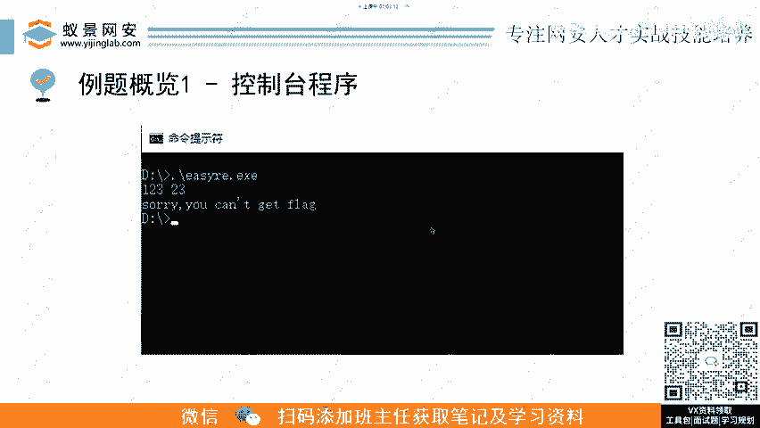
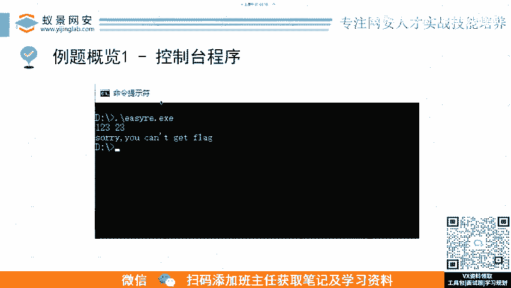

# B站最详细的CTF零基础入门教程， 国内顶尖战队大佬透彻讲解CTF夺旗赛100集，带你从入门到精通。逆向｜PWN｜WEB｜MISC及赛事真题解析。 - P2：逆向基础题-常规ctf-逆向解题流程.mp4 - 蚁景网络安全特训营 - BV1Ls421A7dP

然后我们再再接着讲这个CTF的一个。呃，立项流程常规的立项流程。就是我们拿到一道CTF赛题，主办方发过来1个EXE的文件，或者是1个ELF的文件。我们应该怎么去按一个流怎么什么样的流程去做。

首先的话就是呃用这个s stream啊 fire，大家有用过linux吗？有用过知道知道这些命令吧。有有的有的同学可以扣个一。😊，嗯，我给大家说一下这个sstrs这个呢就是去查看这个。啊。

我看有很多同学做过用过还复一。😊，又是皮是吧？ss啊，这个就是去查这个附件里面有哪些字符串，可定字符串它会给你列出来。这个这个东西真的很有用啊。有的时候他会把一些一些有有可能是直接出现非预期啊。

他把flag直接给你整出来了，可能出体人搞忘了给它删掉，在某些节里面。然后他说你个ss又打印出来了。😊，然后还有fire可以去看查看它什么架构啊，它的大小端序啊这这种这种东西可以看它是什么类型的文件啊。

还有binwork的话就像。😊，我之前说那个IOT文件。你你你要对一个就是那种附加起来的文件进行一个切分，可以用的这个Bwork，然后是Stra啊stra这个东西。😊，他是一个呃怎么说呢？

就是你可以在就说S trace后面跟跟上执行这个这个可执行文件。然后呢，他又会把这个可执行文件在执行的过程中用到哪些那个系统调用，他又会给你列出来。😊，呃。

这个在你进行正先把它把就是把它拖到工具里面之前，比如说你要开始IDA的分析之前，你先用S看一眼呃，它呃这个这个程序它可能大概是一个什么样的流程，它可能是先调用系统调用，就是先获取输入像对吧？

它会先调用这个系统调用的read这个系统调用。然后后面还还会有什么right的系统调用，然后中间可能会有还有什么M map啊去映射内存，这种是可以通过侧面去了解这个程序的行为。😊。

然后我们可以呃根据这些收集到的信息啊，这个收集信息这个环节其实很是非常重要的。就是他可以决定你后面该怎么去分析这个这个就是给你下发这个附件。😊，呃。

根据这些近的信息呢去进行google或者是get hub的搜索。呃，为什么说这个是非常重要的？因为像我们在呃打国际赛或者说呃比较好那种国国内的一些大比赛的时候呢，他的一些附现可能说呃根本没见过。

就是你不知道这个东西它是从哪里抠下来的，或者他是怎么怎么去编译构造出来的。然后你通过这个信息收集，呃去找这些里面的特征，或者是比如说文件特征啊，去google上去查。

然后你就知道哦原来这个东西可能哦是PS3的一个游戏，或者说哦这个东西它是某个开发版上的一个一个固件。然后你去收集收收集到这个信息，然后他就可以很大程度上的，并且你可能在这个收集的过程中。

你可以去呃找到之前那些会有人去做的一些呃就是这方面的一些分析嘛。就比如说你像3如何去立项一个游戏，呃PS3的游戏，如果去解包啊，这些你可以去看那些人博客，就是咱么在大在在打比赛的过程中。

就是去进行不断学习的一个过程。😊，就是我现在我现在比如说我现在在在打比赛，我也不敢说我。😊，看的看的每一个题我都之前都多做过，而相反来说，反而是没见过题会更多一些。

然呃然后就是这这种类型的比赛才是真正能够学到技术的。你比如说一天都打一天都打新生赛啊，那肯定都会啊，对吧？那学不到东西，你这样的这样的比赛你打出来其实没有什么对自己的话没有什么太大的提升。😊。

然后第二点的话就是呃这个我们先收集完收集完信息了。然后然后之后呢，我们要去研究一下这个程序，它用了什么样的保护方法。就他呃我之前也说了嘛，厂家啊或者出题人为了为难你啊，就不让你去分析这个程序。

他会去加一些反逆向的东西，混淆可反调试，然后他去加这些东西，我们需要设法去破除，或者去绕过他。😊，然后就。破破除或者绕绕过他了以后，然后我们才能获得这个真实的。

就是我们可以先把它想成就是他对这个原来的源代码进行了一个加密。然后我们现在去对它进行破除的话，就是对它进行一个解密。我们拿到他原来原本的他那个主体人或者厂家去写的一个真实的逻辑，代码逻辑是怎样的。

就是应用它的功能是怎么实现的，去拿到他的这个铭文的东西。😊，然后拿到了以后呢，这个时候我们就应该根据这个平台了，根据平台或者是语言选择去怎么样去立项呢。就是选择相应的反变译反回编器。

然后对对这个目标软件进行一个静态分析。首先是进行静态分析。然后根据一些程序特征快速定位这个关键代码分析，大家可能就是如果你有前面这些基础，可能有的有的学员他会在这一部分就是。😊，一直没有什么头绪。

就如何去快速定位到这个关关键代码分析啊，大家如果想学这个也可以去报名咱们的课程啊。这呃这个这个这个东西的话，就是我我这么多年CTF经验总结以来的所有的找关键代码经验都会在课程里面进行分析分享。😊。

然后第四点的话就是结合动态调试，就咱们。立项的话讲究论的是一个动静结合。你静态分析完了以后呃。呃，是就是你在静态分析的过程中，你可能会去进行猜。就你猜这个函数，哎，它可能是个贝数64，对吧？

它可能会是一个另外什么一个。😊，呃，什么奇怪的加密，然后你你去猜猜完了以后，呃，你再结合动态调试，你先呃输输入一个铭文，然后过这个函数，看它输出是什么，看它输出是什么。

然后哎自己再去验证一下是否是不是真真的是被数64。啊。然后如果真的是的话，你看你结合静态和动态分静态分析和动态调试，你可以很快的确定个函数它是干嘛的。而不是说。😊，呃，就呃你ID从上往下看呃。

这个这个函数调用了一个函数，然后往里走，这个函数呢又调用了几个函数，然后一个一个看一遍，这样的话太慢了。你这个打完你都可以打几场比赛了，你做一道题可以打几场比赛。😊。

然后这个动静结合呢是咱们立向的一个核心的一个观念。完了以后呃，就是验证了猜想，然后进一步熟悉这个程序的一个功能，它是怎么实现的。或者说这个flag它是呃什么样一个逻辑来验证的。

然后理清楚这个程序流程之后呢，然后我们根据这个正向的一个算法，然后去推逆向的算法。这什么什么意思？就是有可能呃咱们那个呃明文的输入呢，它被进行了一个加密。最最典型的一个情况。

就是明文输入被进行一个呃中间进行一个加密，然后之后得到一个密文。得到密文以后，他就会会和目标密文进行比较啊，两个对了。那他他就说你这个输入是正确的，就是flag。然后你根据这个正向分析出来的正向算法。

它经过哪些加密怎么样加密的，然后怎么样变换的。😊，然后你去写一个脚本去逆项给他立回去，这就是咱们这个立项的由来嘛，就给他立回去，然后去求解通过这个例文目标译文去求解这个铭文的flag。

这是一个最最最最常规的一个立项流程，就是就是这么来搞的。😊。

呃，然后我们这个接下来就看就是有几道例题，就是在CTF。

里面最经典的几类例题啊。