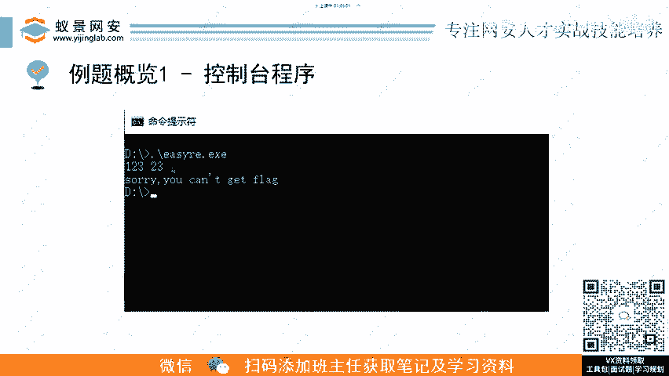
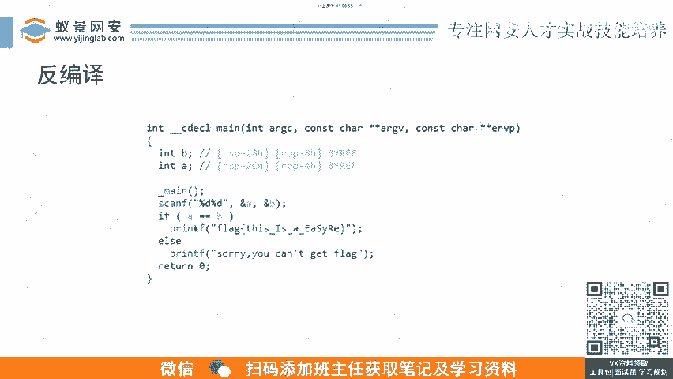
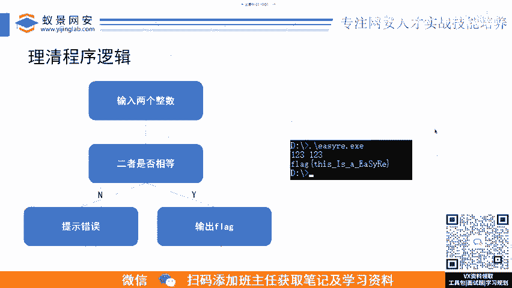
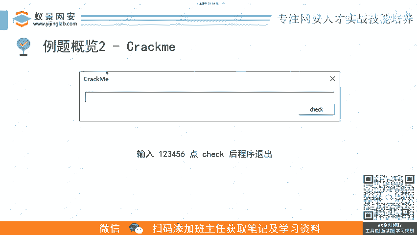

# B站最详细的CTF零基础入门教程， 国内顶尖战队大佬透彻讲解CTF夺旗赛100集，带你从入门到精通。逆向｜PWN｜WEB｜MISC及赛事真题解析。 - P3：逆向基础题-2.例题1：控制台程序-程序逆向.mp4 - 蚁景网络安全特训营 - BV1Ls421A7dP

这第一个例子的话就是控制在程序嘛，相信。😊，我看这个。😊，呃，大家有说呃什么逆项没啥能运行的题目吗？那那只能说这个是确实国内的话是比较偏向这种，就是莫名其妙的给你搞一个编译出来的东西。

然后呃没有什么没有什么运没有运行器，他给你编译一个东西出来，没有运行的东西。😊，呃，那如果这种赛题。多的话呃，只能说明这个主办方的这个筛题的这个环境没有做好。然后。😔，嗯，也也不能说咱们这个师傅没水平。

对吧？其实就是这个题目的这个分配的话，不是没没有没有分配好，只能说这个比赛办的不够好。😊，也是这个意思。然后。我们来看这个第一道例题，是最经典的一种形式的话，就是控制台程序。

就这呃他可能给给你1个EXE啊，然后你你去执行它，或者是linux上是1个ELF，你执行它，然后他会有有一些呃提示性的输输出啊，如果没有的话，他会他会要求你去输入输入输入完了以后，他会他又会去进行校验。

看你这个输入是否满足他的要求啊，不满足。你看这里像这里我输入了1个123的空格23。😊，好到这里就输入啊，不对，你这个嗯你你不能拿到flag。这是一个非常典型的一个呃CTF的赛题形式。😊。

然后呃我们结合刚才这个常规立项的流程嘛，我们怎么去立项它呢？这个首先。呃，经过这个信收收集信息的过程完了以后，我们收集信息嘛，我们看他是EX1，然后是是多少位的呃，是多少位，这个信息可在哪里收集呢？

可以在这里。😊。

或许这个可执行文件的信息，这这一步可以用一些常用的一些工具。像我这己列出来的是这个EXE啊，inPE还有什么PEID啊那些什么工具都可以来查的。你可以获得这个呃可执行文件，它是一个什么类型的。

像这里的话，就是你可以看它。😊，这个 entry point它的入口点在哪个节，再点text的这个节。😊，然后还有呃它的一个链接器的一个版本啊，2。23，还有这个呃它这个编译器是什么什么编译器多少位的。

这个64位的，然后用用的是这个明GW这个来编译的。然后呃下面的话有时候还会如如果这个程序它有壳的话，它有时候还会显显示出来。如果它检测出来的话，它它是什么类型的壳。

然后你可以根据这些信息呢去对它进行一个这这里说的就是去掉这个壳的保护，绕过它的保护，通过不同的手段嘛。然后最后就是呃把这个程序呢拖到呃工具里面，这也展示的是IDA这个工具的截图，就是你把它拖进去以后。

它会显示这个呃这个呃这附件里面啊，它存在哪些函数，然后他会把这些函数全部列出来。然后你点每个函数呢，它就会给你展示这个函数的反汇编的一个代码，这些都是汇编代码，就是大家有技术肯定都看得懂。

像这种就是呃它左左边的话就是它这个原生的机器嘛，原生机器嘛这右边就是他分析的。呃，就是给你翻译成的一个汇编代码。当然我们我们可以如果你汇编功给够的话，你完全可以去嗯就是只看汇编。但是你为了图块。

你肯定呃会会享用它的另外一个功能，就是这个反兵译这些功能。😊，很民义，你可以看这这个是汇编代码。如果你没有学过汇编。你呃你你估计搞不懂他在干什么，就一会儿又是这个push又是干嘛呀？

这是move又是干嘛，然后这边空了呃是是是到底在干嘛？然后如果你。😊，呃。这个这程序啊他能够去反变译的话，你可以看它反变译的结果是这么一个样。是不是就就跟咱们去平常去写C代码是一样的。

你看他这个逻辑就很清楚了，然后他需要呃输入两个数来。呃，如果这两个数相等，他就给你打印flag是什么？呃，你对比一下这两个反反一个是打汇编啊，这比较low level，就是比较低级的。然后哎呦。😊。

然后是反编译，这个是产生给你产生一个伪代码类类似的一种风格的代码。啊，这这两个的话就是立项里面非常呃非常关键的呃两个步骤了吧。就是有的有的题目啊它可能不能反反编译。😊，就像有的框架像呃有的架格像ps。

可能IDA他还他还不支持反编译，你可能只就只能去读汇编，那你就只能读汇编，然后或者你可以用另外的一些工具，像D爪，他可能会去支持反变译，但是可能也做的不够好。

所以这个时候呢咱们不能说一味的去摒弃这个反汇编这个东西，不能有摒弃去摒弃这个汇编然我不学啊，你既然都能给我产生伪代码了，为什么还要看这个呢？对吧？但你要相信他是个工具，它是工具。

他他你就算是人都会出错嘛，它是工具，你。😊，他他有可能给你分析的这些这些这这些数据结构啊，数据类型啊，他不是不对的，他需要你人为的去校正，所以你还是得根据这个汇编代码来来进行一个修正。所以呃。😊。

如果如果你拿到这个附件，他能变能反变异，那你就看反变异的。然后结合一点反汇边，如果他不能反变反汇边，那你啊不能反兵印，那你就直接会编摁对。就是就这么两个，这是中间两个步骤。

然后我们通过这个呃返回返回编反编译，然后去看它的内部的一个功能的实现是怎么样去实现的。然后之后呢，前面这前面就是所说的那个静态分析嘛，静态去看它这些代码。然后之后我们结合动态调试。啊。

我们去确定呃我们呃动态调试去随便输两个数，看他到这里是不是他真按他这个反反变译出来的逻辑是真是这么写的，可以看这个AA是什么值，D是什么值。

然后像这边的话，他会去展示一个这个计存器的窗口，然后下面是占的一个窗口。然后右下右下角的话是呃内存的一个查看器。啊，这些的话都是咱们以后课上会讲的，就是如何动静结合。

去更更高效的去提升自己的一个立项速度。😊，然后理清了程序逻辑以后呢，这看这个这个程序的话，就两个就是这么简单的一个逻辑基嘛，输入两个整数，两个是否相等，相等就输出flag错误就啊提示错误。

然后我们就根据这个逻辑呢就去验证验证我们呃还是执行它，然后输入两个数，输入两个数。😊，然后这里就直接呃，因为是因为他这一判断两色是傅相相当于输出flag嘛，所以这就输出输出了flag呃，这个会编。😊。

汇编的话。呃，会讲汇编肯定会讲汇编，这是基础中的基础啊，会讲汇编的这这里这个汇编打码是因为这里就直接输出这个写的是flag。我习惯在有flag的地方打一下嘛。😊。

然后呃比较经典的第二类例题的话。😊。

