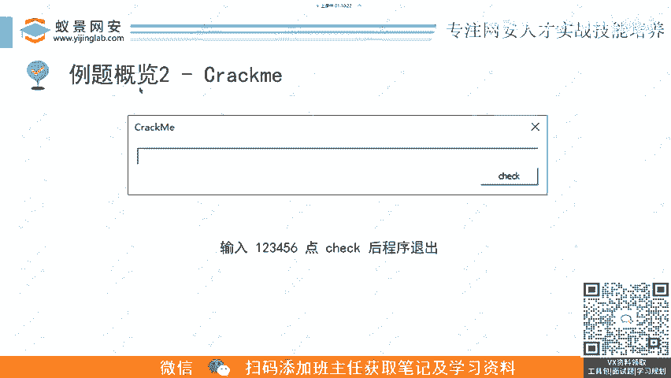
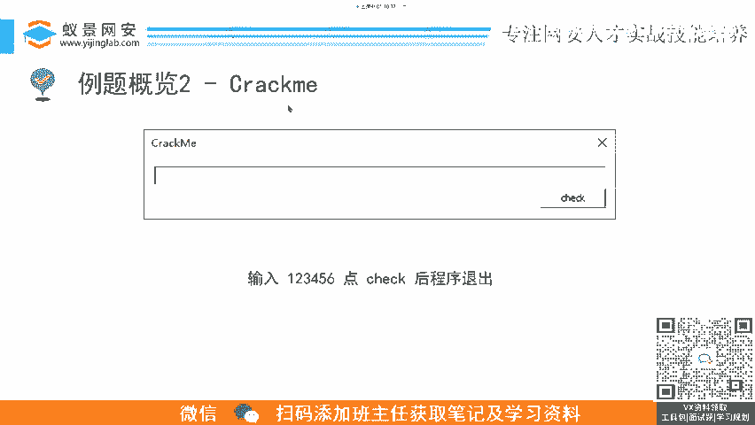
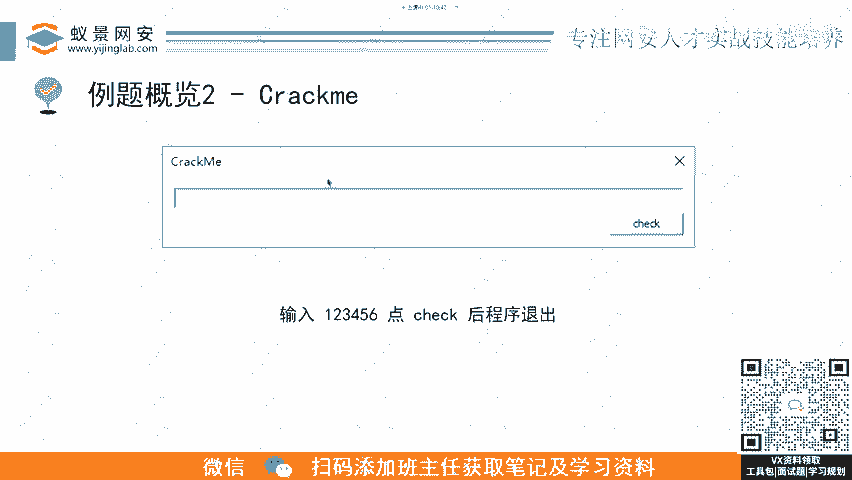
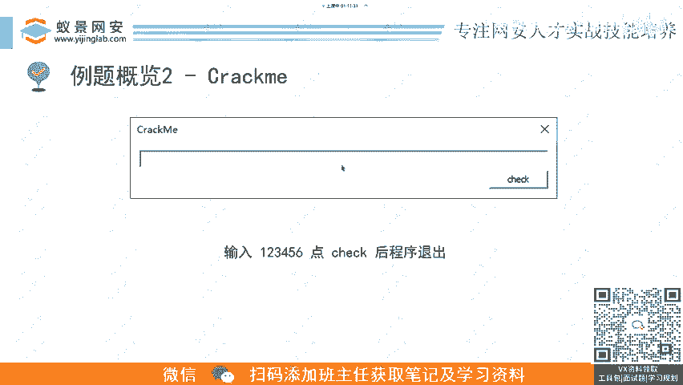
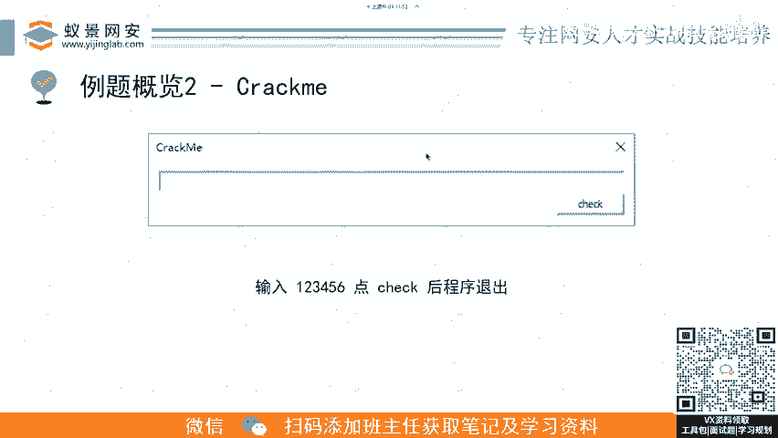
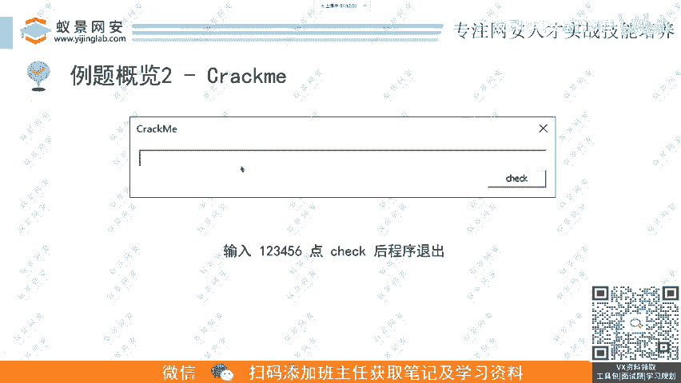
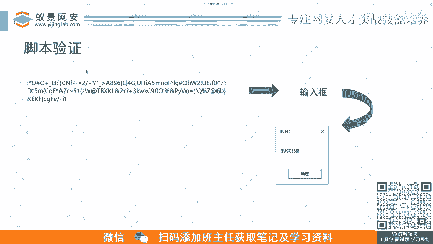
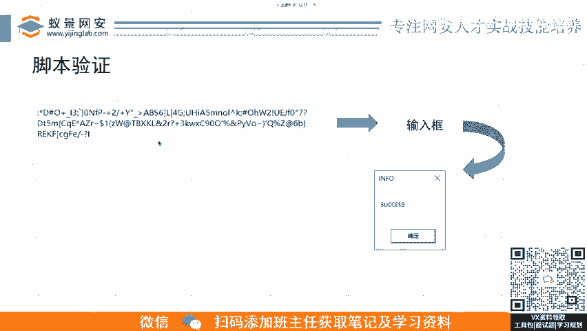
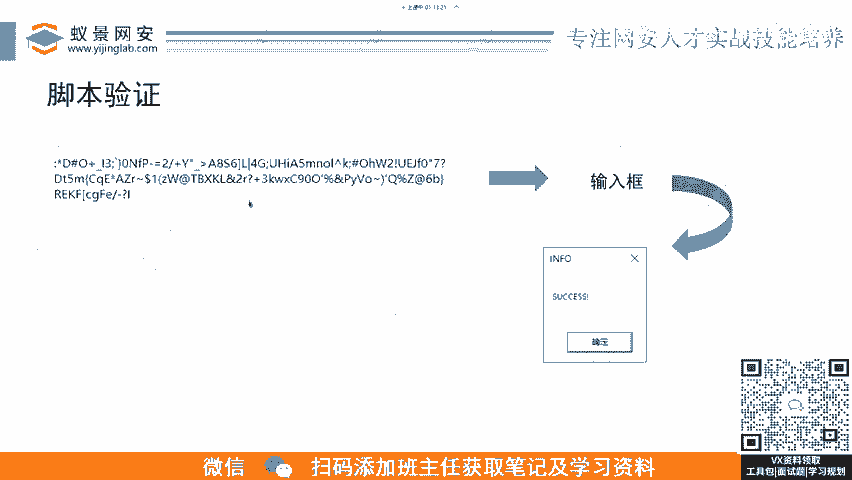
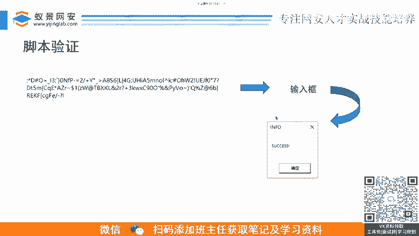

# B站最详细的CTF零基础入门教程， 国内顶尖战队大佬透彻讲解CTF夺旗赛100集，带你从入门到精通。逆向｜PWN｜WEB｜MISC及赛事真题解析。 - P4：逆向基础题-3.例题2：crackme-软件逆向.mp4 - 蚁景网络安全特训营 - BV1Ls421A7dP

啊，老师带我们回，那那肯定的，大家都不用怀疑。

然后第二这第二类的类题目的话，它就是一种叫crrack me。cck me这种题呃也是非常经典的。就是如果大家。😊，哎，在初中啊之前在初中有有玩过逆向这一块，那个时候就非非常兴盛这种crack的东西。

就是呃如果就是破解一个软件嘛，大家会去开发一个看似不可破解的一个东西，就让让你去破解这个软件，让你去输入一个注册码。😊。

あ。咱们不是还有小学生吗？你们这个说说初中怎么都这么。怎么在扣问号啊？不是还有小学生在在听他课吗？😊，对，就是这么一个c啊，他意思就是来来破坏我来来绕过我。

意思就是呃一般这种题题目类型啊就是有一个输入框，然后会有个check的按钮。然后你去输入这个软件的一个注册码，就是你要去分析他那个东西，他他的那个注册码或者是flag。如果你是CTF比赛里面。

它就是flag实战里面的话，它就是这个软件的注册码。😊，然后点check过了的话，就是呃就告诉你这个flag。像这这道题，你输123456点check的话，这个程序程序是退出的。

那就是变相去说明啊你这个输入是不对的。

然后我们还是用前面所说的那那一堆技巧分析一下，就是呃信息收集，看他有没有壳呃，有有没有什么反反反反调式反逆向的手段。这道题是有，确实是有的。然后然后呢你把它绕过呃脱壳出来。

然后你去静态分析它的那个代码，它的加密代码，或者说它产生那个序列码的代码。然后呢。

再去结合动态调试啊，然后现在我们终于搞清楚了。就是这个程序它是呃怎么去产生的注册码，然后我们就可以去书写的代码，书书写书写脚本了。因为上一道题它是没有写脚本。因为那道题比较简单，所以不需要脚本。

这道题的话呃，它其实你看我这里只写了一个函数。它这道题的话，其实是有7个加密函数的，你要去每一个都分析出来，然后去写它的一个逆向的代码，像我这里写decode five就是第五个解密函数。

你要去把decode的从1到7每一个加密函数的逆向的函数全部写出来，然后再套一遍这个密文。那然后这个的话就解密出来，就是你的铭文。😊。

这个是第二类比较经典的题目。

呃，脚步验证的话就是这个脚本运行出来会得到这么一串，你看似它它不像什么正常的字符串嘛，它其实其实就是flag。它是这个有时候这flag确实比较奇怪，你要是输入这个程序。

它给你产生一些就是比较正确性的一些提示嘛，他会给你产生yes，或者说no啊，no就告诉你，那那那那就说明你的东西不对，然后success这种说明你的东西是对的。😊。

呃，然后你输进去，你别管他形事多怪，你输进去，只要是对的，然后你就拿去平台上教，要是交了不对，那肯定就是这个这个这个题目有问题，要么是多解，要么是平台的flag设置错了就。😊，呃。

就这两种情况你不要去怀疑自己可能是什么做错了。你要只要输入这个程序，他自己给你反馈是对的那你就可以有有有底气去找那个主体的。😊。

去喷他为什么为什么这样叫来不对，对吧？他可能发现啊，原来是我这个题出来有多解。😊。

