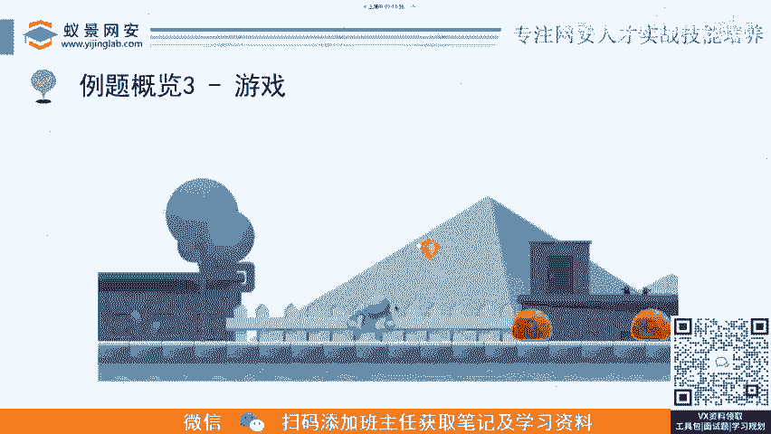
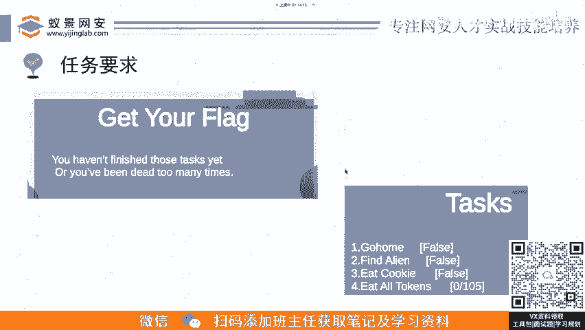
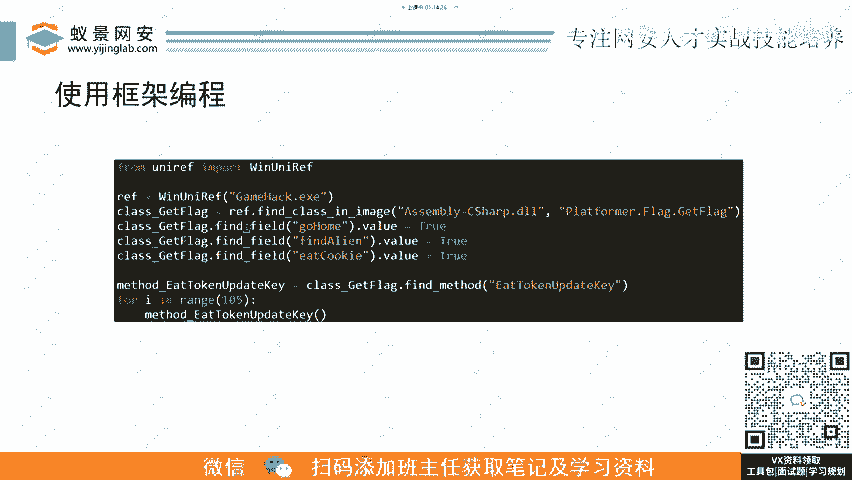
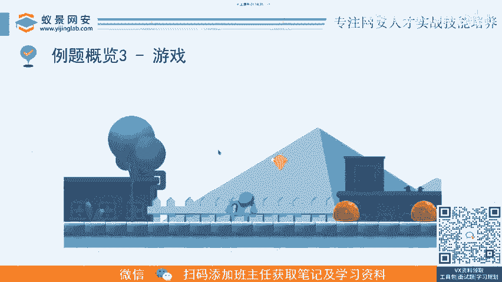
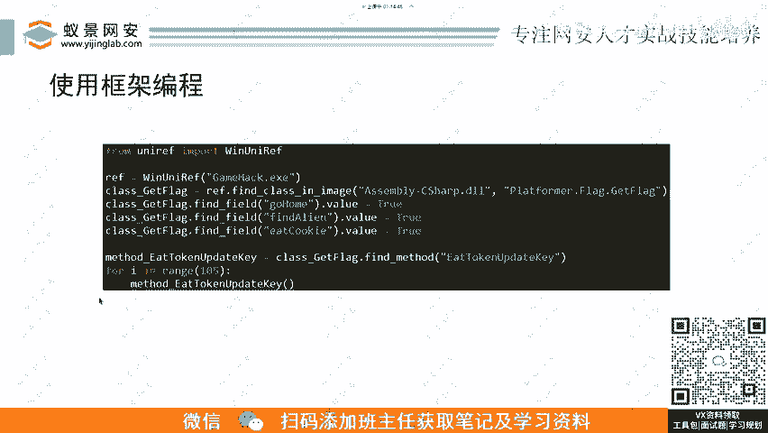
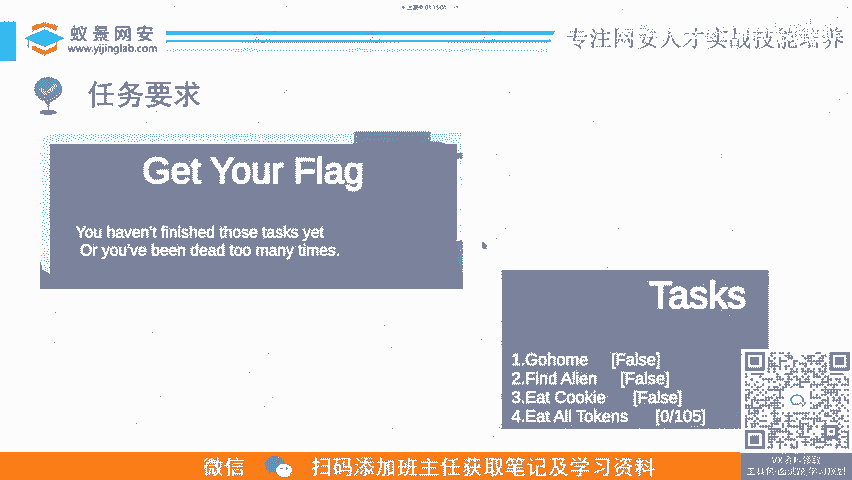
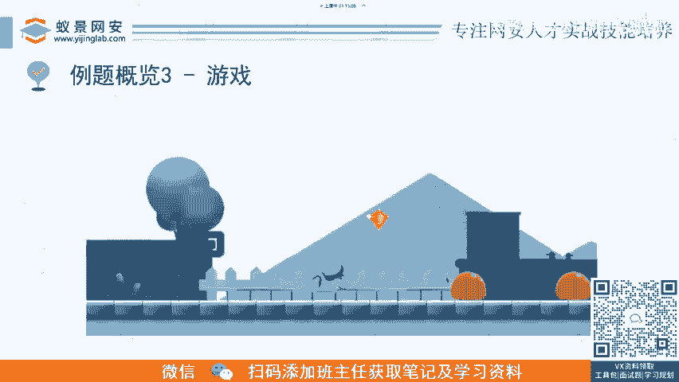
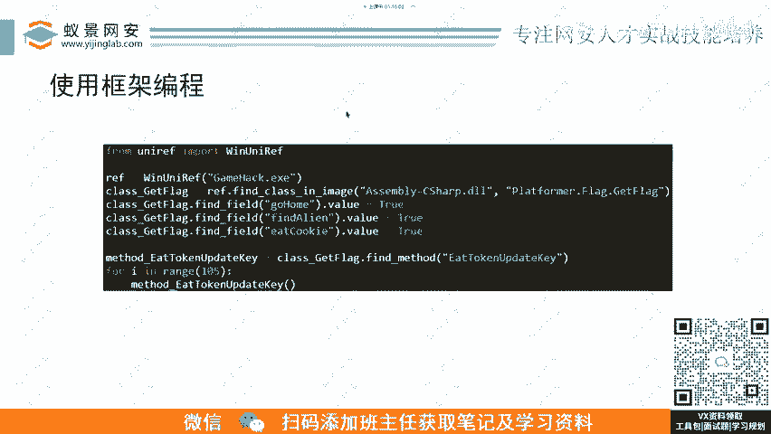

# B站最详细的CTF零基础入门教程， 国内顶尖战队大佬透彻讲解CTF夺旗赛100集，带你从入门到精通。逆向｜PWN｜WEB｜MISC及赛事真题解析。 - P5：逆向基础题-游戏-游戏逆向.mp4 - 蚁景网络安全特训营 - BV1Ls421A7dP

然后第三种的题型的话就是像那种比较常见游戏题。呃，这个是这个的话这个我们明天也会讲这道题啊，明天我们主题是uni嘛，uni游戏。这个这道题的话也是哎是19年还是20年的一道题呢。

反正他这个呃你需要去完成这个。😊，游戏里面的任务目目标嘛，像这里的话，这道题的目标就是呃你像右下的这taskks，它有几个目标，你要去呃go home回家，然后找到外星人去吃吃这个曲奇。

然后吃掉所有的这个token。😊。

然后你做完这些任务以后呢，就可以去get flag。他自己说嘛，如果你没完成任务，你就不给你flag。

然后。这里的话呃。😊。

这里我我这PPT写的这个使用框架编程啊，这个是我们明天会去讲的一个东西。如果我们正常来做这道题，那肯定是。

肯定是还是我们之前讲的那个流程嘛，呃呃动静呃信息收集，然后看有没有壳，然后静态分析动态调试。然后这按按那个流程来做的话，是也是可以做出做得出来的。呃，当然如果你去学会使用那种开源的框架，然后去呃。

结合这个题目的具体一个场景来做的话，那你会发现呃这道题如果用用常规解法，用常规解法，解脚本脚本是肯定要多余多余，肯定最少得要三四十行去去来完成这道题。然后如果你去学会使用呃开源框架来做。你看就这么几行。

就做完这道题了。

对吧你说你和别人的差距在哪？你为什么抢不到医学？往往就是有的时候别人用了框架，然后你你就是自己在在这里硬看。😊，所以说这个框架这个东西呢也是印象里面呃很常见的一个东西啊。

所以我们课程里面也对这一这一块进行一个着重的讲解。我们会学习到非常多的，就是现在CTF理想里面会用到的实用的框架，就是呃基本上囊括了。😊，呃，能用的能用的框架，咱们这个基本上都囊括了。

就包呃有有一些比较旁知的东西，嗯，就是呃可能说一个嫡系的东西。呃，那些东西的话就太细了，咱们也不会去讲到。我们就是这这个后面我就呃下面的具体我也会讲到我们会讲哪些现有的开源框架。😊。

