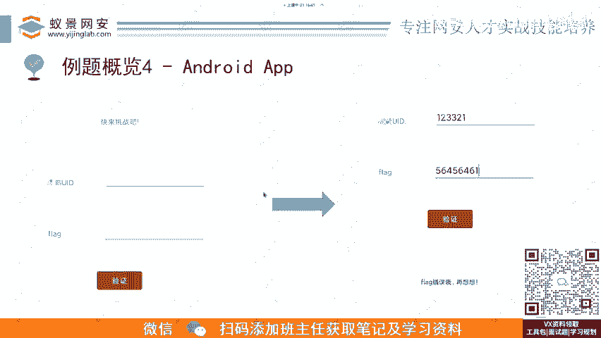
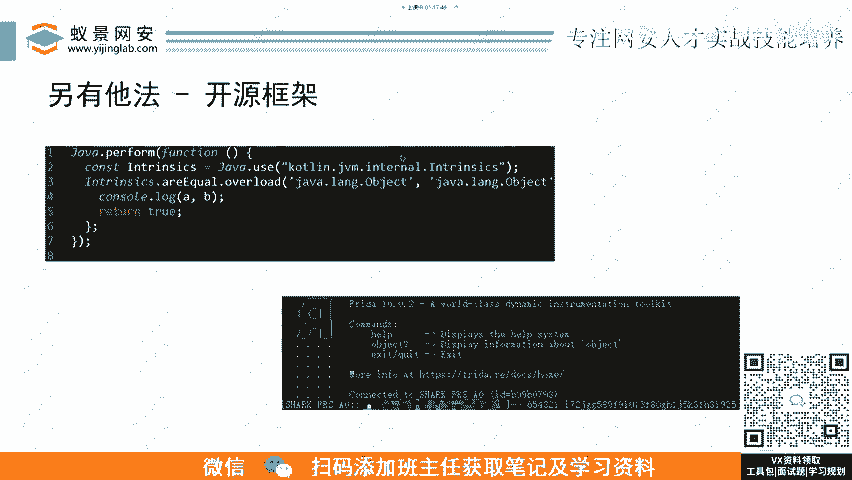

# B站最详细的CTF零基础入门教程， 国内顶尖战队大佬透彻讲解CTF夺旗赛100集，带你从入门到精通。逆向｜PWN｜WEB｜MISC及赛事真题解析。 - P6：例题4：Android APP-安卓安装包逆向.mp4 - 蚁景网络安全特训营 - BV1Ls421A7dP

然后第四比如说还有还有这种第四类的，像这呃移动安全。这个就是一个安卓的APP。啊，我这虽间打了码，大家可以也可能猜到这个这个UI他想他像啥，他就是前段时间那个我爱破解的一个新年的红包题。😊。

然后他这个就是嗯1个安卓的APK，然后非常典型的一个界面，很典型的一个界面，就是有两个输入框，一个让你输入用户名输密码，然后点验证验证到，然后他这个程序去做一些判断，看你对不对。

对了以后就输入你的flex是对的，错了就是错的。😊。

然后。呃，我们可以呃还是按这个逻流程来进行分析以后，找到他的那个加密流程，然后通过自己的。呃，这个原来。就是他原本是用java来写的，然后我们可以用python来对它进行一个加密逻辑的翻译。

翻译出来以后呃，就你可能对pyon比较熟，你也可能对C比较熟啊，你可以翻译成C。这样看起来的话自己会呃就是思路会清晰很多。我们可以用脚本模拟。😊，呃，去把这个加密逻辑，就正向加密逻辑给他给他当出来。

然后呢。呃，另外一种方法呢就是另有他法还是这个开源框架的事情。你看我这里要写这么多行啊，这上面还有还有一个，你看这里有只有incode2，对吧？上面还有一个incode一，这个少数也有几十行吧。

然后这里我们用开源框框架，你可以看这7行还还不包括这种这种括括号。😊，就短短短几行就可以直接去把这道题给做出来，这个就是flag。所以说框架这个东西在逆项里面也是很重要的。

