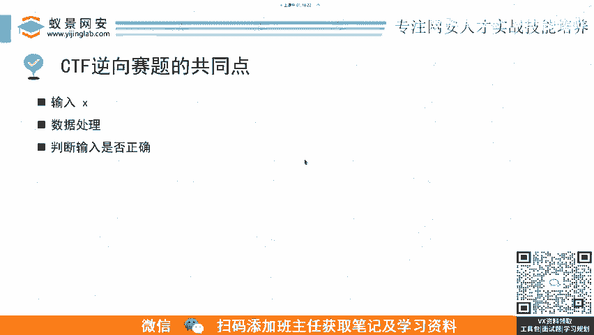
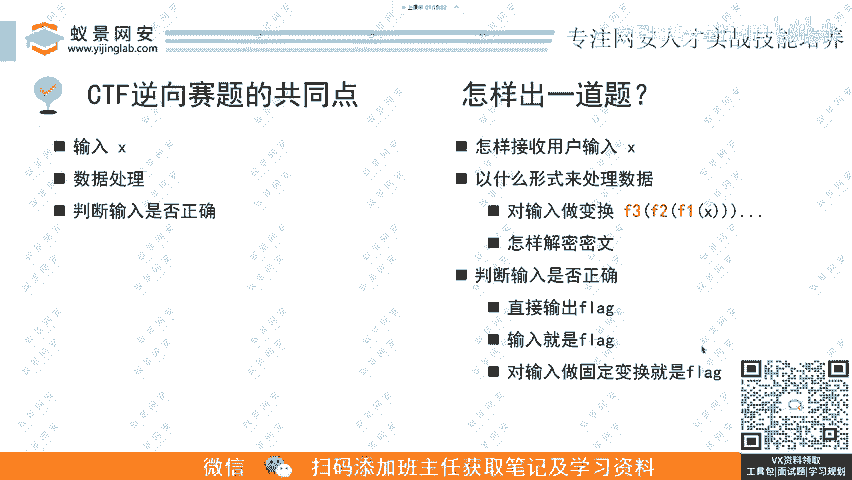
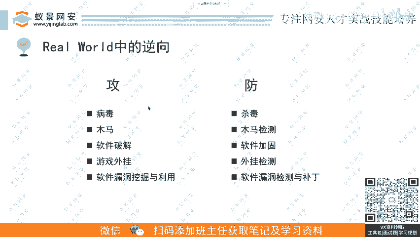

# B站最详细的CTF零基础入门教程， 国内顶尖战队大佬透彻讲解CTF夺旗赛100集，带你从入门到精通。逆向｜PWN｜WEB｜MISC及赛事真题解析。 - P7：逆向基础题-ctf逆向题的出题思路和工作中使用情况.mp4 - 蚁景网络安全特训营 - BV1Ls421A7dP

然后我们看了这四道例题啊，就可以对这个CTF的赛题进的共同点进行一个总结。大家是不是会发现就是他一个赛题最先需要的是什么？是咱们一个用户的输入，就是选手的输输入，看他是不是可能可能他就是flag。

也可能不是。然后他都都对我们这个输入X进行数数据处理之后，然后再去判断我们这个输入是否正确。正确的话就告诉你f直接给你flag，或者说告诉你这个输入就是flag，对吧？这就是逆向赛题的一个共同点。

所以说呃如果我是一个出题人，我要怎么去出一道题呢？是不是还是就是按照这个这个流程来我们怎么去出一道题，就是我们要去构思怎么去接收用户的一个输入X一什么样的形式，它有可能是游戏游戏。

你呃你比如说像刚才就是呃需要你去完成某些任务。如果是这个呃控制台的话，他就通过scanF或者其他是从标准输入里面读读你的输输入进来这个X对它进行校验。然后读进来以后呢，这个数据要用什么样的形式来处理。

可以像呃可以有两种方式嘛，一般就是正正向的就是我们对这个X进行像F1FF3这种函数加密，就是先经过F1加密，再经过F2加密再进过F3这种套娃加密加密完了以后和目标值进行比较。

或者说你对一个密文进行一层一层的就每当你这个输入。😊。

读某些条件之后，他这个密文就解密一段，然后每当秒满足一段，然后这个密文解密一段，最后输出这个铭文的flag。然后呃第三，这个判断输是否正确，这一块呢怎么做？就是呃要么就直接输入flag。

然后或者说你的输入就是flag，或者说对输入进行固定变换。像那种做哈希呀，然后这个怎么它结果就是一个你的flag。

然后在这个真实世界中啊，这个CTF的攻防它是什么样的？😊，就是。😊，呃，我们前面一直讲的是CTF，这己可以稍微拓展一下，就是在攻攻击这个层面呢，我们这个逆项应用应用面其实是很广的。

这些列列的都其实很少了，就是冰山一角，像这个病毒啊、木马啊，呃，还有软件破解啊、软件外挂啊。😊，还有这个软件漏洞挖掘与利用。呃，然后呢攻你光谈攻肯定是不行的对吧？

因为攻防本来就是一个可以可以说是互相净化的一个东西吧，因为你你攻击。呃，你这个level up了，然后你防御肯定也要随随之随机应变嘛，肯定也要把把自己的这个防御的手段往上进行一个提升。

然后这个攻击这方呢，看到你防御这这方面。哎，又又又又变得不看似不可攻击，然后他又会去研究你这个防御系统是怎么怎么搞的，然后他又可以找出漏洞来，然后又进行攻击。然后防御这边又也就是一个呃刚才也说了。

就魔高一尺刀高一丈的过程，像防御这边我们这么怎么去防，像病毒这种就是杀毒软件嘛，大家常见杀毒软件，这个杀毒软件。然后呃还有木马木马怎么去防木检测木马，对吧？还有软件破解，怎么去防。

还有软就是软件加固加壳啊，这些外挂怎么防就外挂检测。😊，然后还有这漏漏漏洞挖解怎么法？呃，那就是漏洞检测与补丁。😊，呃，这个咱们课程中其实也有部分的内容会涉及到这个实战的逆项。因为呃CTF立项逆项的话。

它毕竟是实战逆项里面的一个缩影，一个一个子集，一个子集。你通过去学习呃，CTF的逆项，你可以后面再去转向这个实战的话，其实。呃，帮助是非常大的帮助是非常大。你会发现比赛里面有很多的知识点。

你在这个现实生活中是能用到的。你你在搞一些什么研究哎，不是搞，你研究一些大厂的APP的时候，你就会发现哎哎这个知识点我在哪个比赛里面打过，对吧？😊。

