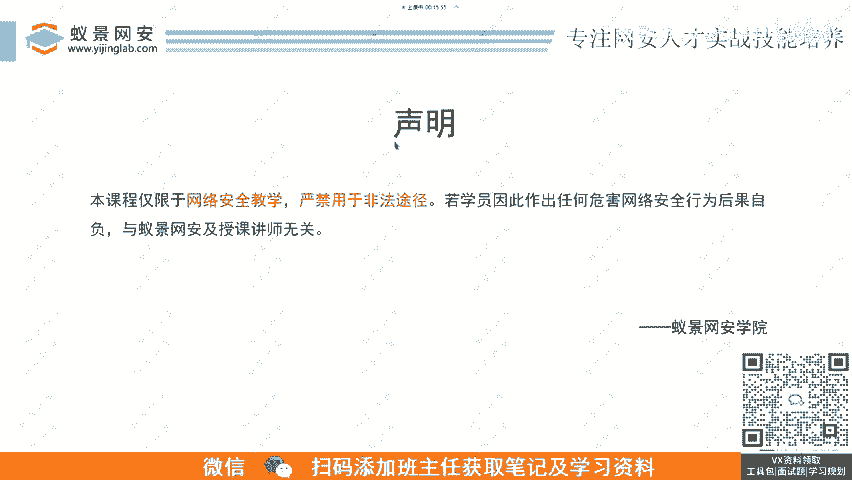
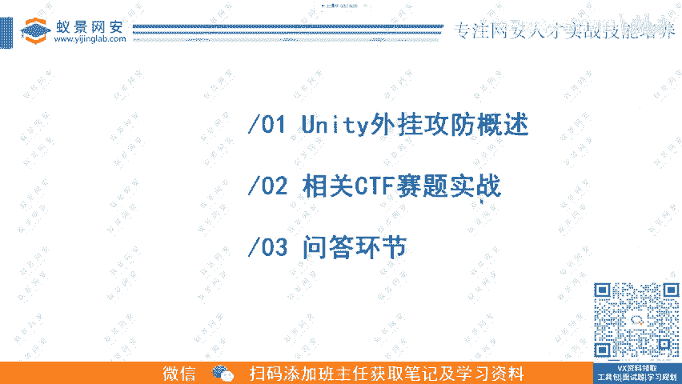
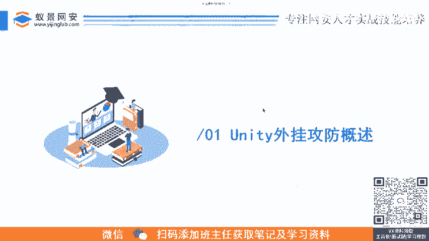
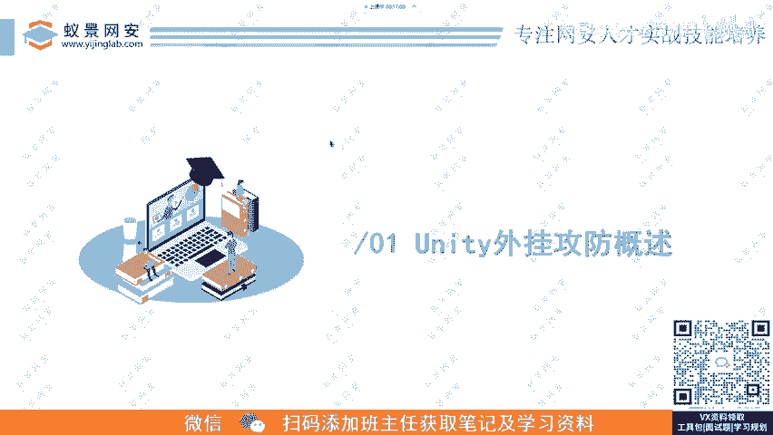
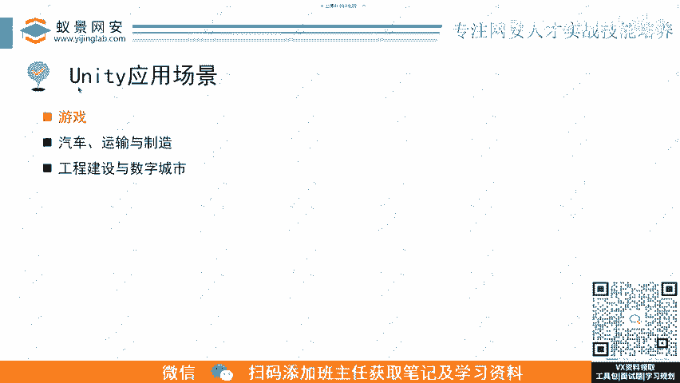

# B站最详细的CTF零基础入门教程， 国内顶尖战队大佬透彻讲解CTF夺旗赛100集，带你从入门到精通。逆向｜PWN｜WEB｜MISC及赛事真题解析。 - P8：逆向基础题-unity外挂攻防科普.mp4 - 蚁景网络安全特训营 - BV1Ls421A7dP

呃，首先还是一个声明啊，这个大家看一下，昨天也强调过了。然后是网络安全法。别呃还是还是大家记住这个学技术就用到正轨上。然后第一块第一块的话。我们会先讲一下这个大家可能都比较感兴趣啊。呃。

做做定箱这一块可能都对这两个字眼特别的呃感兴趣，就是外挂这个用体外挂的一个攻防，它攻击是怎么攻击的，防御要怎么防御。然后第二个部分就是。😊，相关的1个CTF的赛题的实战。啊。

这呃这这一块的话就是一个实操的环节，然后最后就是问答嗯以及发放优惠券。

啊，首先是。啊，直播16分钟了，没有，这个是等大家进来呢，提前开开了个15分钟，刚开始上课。看坏事。你出去别说我教的就行。

呃，第一部分是这个U为体外挂的一个公房概述。

首先是什么是这个unity引擎？啊，我相信真的大部大多数的人肯定都见过这个这个图标吧，这个三个箭头。那个unitity，你打开一个游戏的时候，它它会显先显示这么一个图标，然后再进游戏。

那就说明这个游戏是un题来做的这个引擎，然后他是呃这这个是他的一个他自己给自己的一个定义啊。他说他是一个实施的3D互动内容创作和运营的平台。他可以搞这这些方面的东西，就比如说游戏开发呃。

美术这一块建筑这一块呃，汽车设计和影视呃用的比较广泛的话，就是游戏和美术。😊，嗯。呃，比如说一些。嗯，美术的话就可以用在电影的特效上制作上面。还有呃就相同的这种引擎的话，除了un题，其实还有UE4啊。

就是unreal那个引擎去虚幻引擎。然后我我们今天讲的是运气这个。游戏开发还有美术。然后呃他这里还说他可以呃用于创作运营变和变现任何2D3D的内容，然后也。你看他支持平台，他是我之前说他是跨平台的。

他就支持这些呃手机平板、电脑PC啊，游戏主机呃增强现实。这样现实是什么？就是大家常说这个ARAR这个技术。嗯，他家可能也有可能用过这个正常现实的东西啊，就是你呃可能他有的APP让你嗯打开摄像头。

然后对准什么桌面上，然后它就会在你的屏幕上面去显示一些什么人偶之类的。这个那个算是一种正常现实。然后，然后虚拟现实的话就是VR。VR就。😔，呃。

 virtualttu reality reality那个虚拟现实就是呃我们看那种虚拟现实，就是那那种VR的设备，就是戴头上一大个的那个像护目镜一样的东西。

那个里面就是可以呃让你去沉浸在一个虚拟的一个现实环境里面，这些东西都是可以用运起来实现的。然后呢呃运行应用场景啊，这前面也说了，就是游戏，然后汽车运输制造，然后工程设计与。呃，数字城市。呃。

然后我们今天主要讲的就是游戏这个里面。因为这个游戏的话，它在CTF里面是考的比较多的，因为这用用力起来做。

然后现在就看大家。😊，呃，这边我会列举几个用运气来做的典型游戏，大家可以猜一下这个这个太好猜了。我是第一个大家可以在评论区里面发一下这是什么游戏。😊，lets go奇悦隐擎2。啊，你说的是CSQ2。

0这个事情吗？SS go2。0。这这还有人搁这插SS呢，这个李杰红抓起来。😊，植物大战僵尸好，首先首先排除他是王者荣耀，对吧？あ。自己。哎，你们真是厉害。行啊，这个相信这个大家肯定都很熟哈。

这个路这个就是王者荣耀。然后第二个这个大家知道什么吗？我挑的都是一些是就是市场占有率比较高的。😊，啊，球球大作战。😔，这个真不知道。这个是呃元神元神。新安就业怎么样？西安现在新安就业好啊。风口上的。

学啥学啥都是好，反正这一块。😔，然后呃这个是呃对，这只能版。啊，把名字打出来。好好好，然后我继续那个。😊，这个这个。网络工程。和信息安全。那还是心趣安全好。信息安全信息安全。Thisす go。真的假的？

我打我打CS狗怎么没见过这种画面？😊，嗯，还是有知道的。刘波雨说对了。这个是永劫无间。对，这个就李博宇说的，永劫无间。老师也太。对呀，咋了？不能打是吧？然后呃这个估计知道的人比较少，这是一个手游。

や butと。把宝刀手干好。原皮。哎呦，还真有人知道。对，是明日方舟啊，我不是学游戏开花的。对，这个是明日方舟。然后还有这个。看他有没有买这个游戏啊。最近的一款。啊，对对对。😔。

看大家都是挺喜欢玩游戏的。这个是森就是森林之子，这个这个森林的第二部。呃，我看这些就。非常著名的游戏，它都是用运急引擎来做的。这个呃引擎方便是方便，但是我们后面会讲他那个开启挂还是比较方便。

也是比较方便的。然后这个是它的另外的其他的一个用途，像汽车呃运输和制造。像比如说我们可能去你去看逛车展，或者说去呃体验店里面。嗯，看车他可能会给你一个平板啊，或者说直接带你去一个投影的位置。

他会有这种呃给你一个呃可视化的一个呈现吧，就呈现这个车身内部的这些东西。现在都可以用用题来做，还有这个工程师工程建设和数字城市。啊，直接你看这个这个就是因为呃VR呃AR或者是VR都可以用运气来做。

玩的真话。😔。