# B站首推！建议所有想参加CTF夺旗赛的同学，死磕这条视频，2024年字节大佬花一周时间整理的CTF入门保姆级教程！从入门到入狱（web渗透／PHP基／SQL注） - P10：10、排序函数 - CTF入门教学 - BV1JjeJeYE2p

好，那下一个就是我们PHP的一个关联数组啊，关联是什么呢？关联数组是使用你自己分配给数组的指定键的数组，什么意思啊？有点绕，对不对？那么这个地方呢提供了有两种创建关联数组的方法，第一个是这样去创建的啊。

这么去创建是我们常见的，我们就直接把这个删掉。来，这个是常见的，就以键值对的方式。

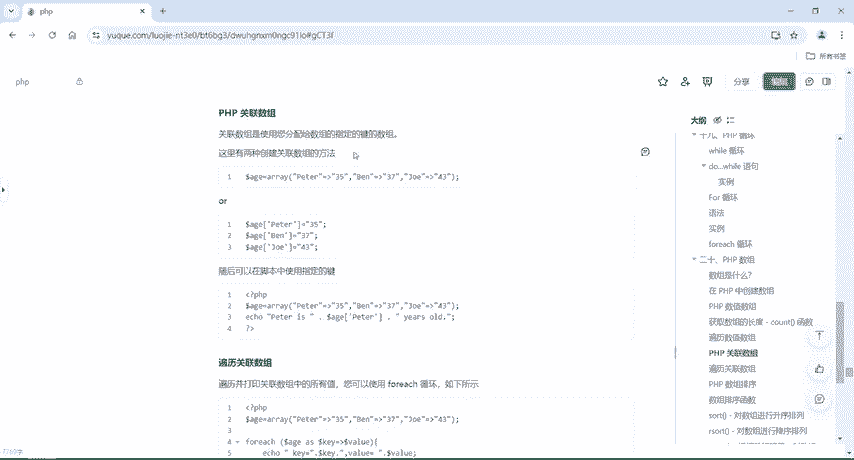

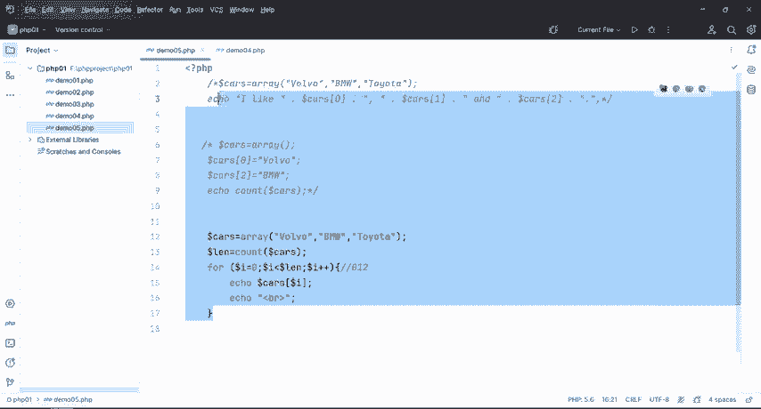

去定义我们这个数字叫关联。这是peter。35笨37jum对吧？43，这个是我们的关联数组格式，或者呢你还会见到什么呢？会见到这样子的。好，这是一种。

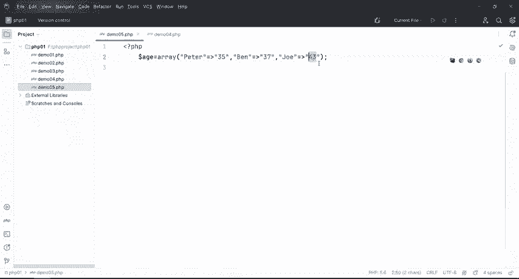

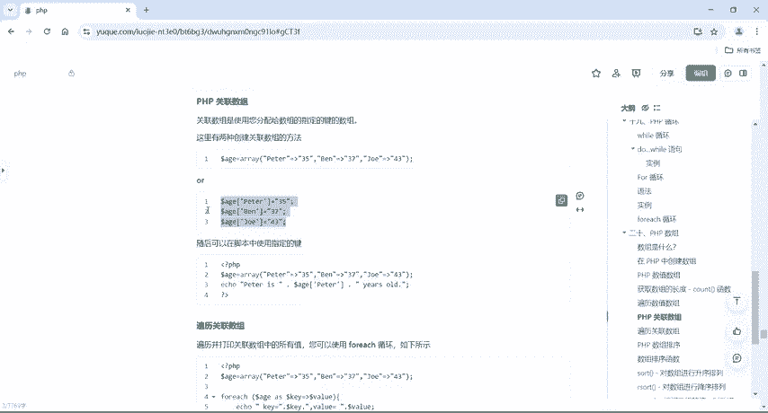

这个是第二种。好，就是peter的下标等于35，笨的下标等于37，jo的呢下标等于3043好。这两种方式都可以，但是我们一般见的最多的关联数组是这样子的。好，那么把这个关联数组定义好了之后啊。

那具体的就来看一下怎么去访问它了啊，怎么去访问它，随后呢可以在脚本中指定啊使用指定的一个键，对吧？

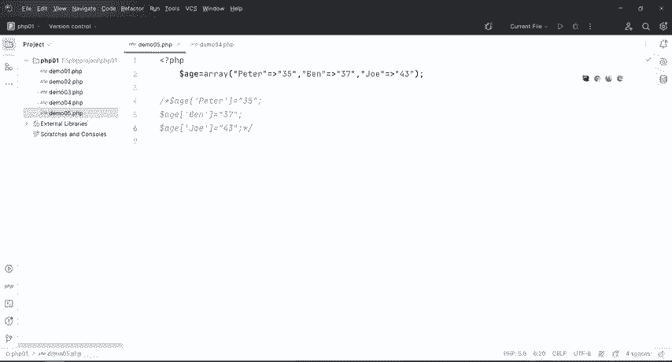

指定的键，那我如果说要打印输出我这个peter，今年35岁，我要把这个键给他打印输出，那具体怎么打啊，就这么打。

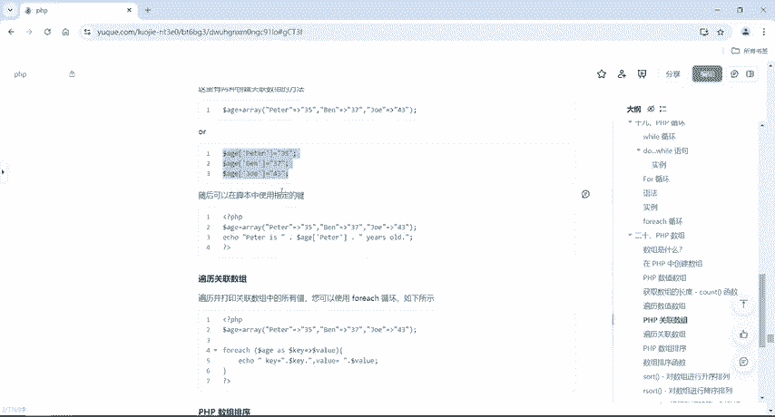

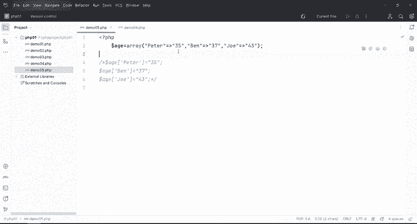

Age的peter。啊，A的pe，那我们就稍微打印一下吧。好，然后ecle一下，我们到了 edge的。

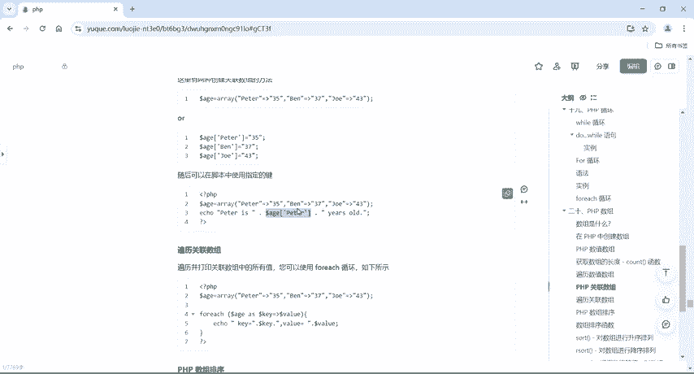

哎，peter。这你想指定你指定peter。那指定打印peter，那我就指定age的peter下标是不是35。好，那如果说你还想指定其他的，那你就在这个地方把它改成。

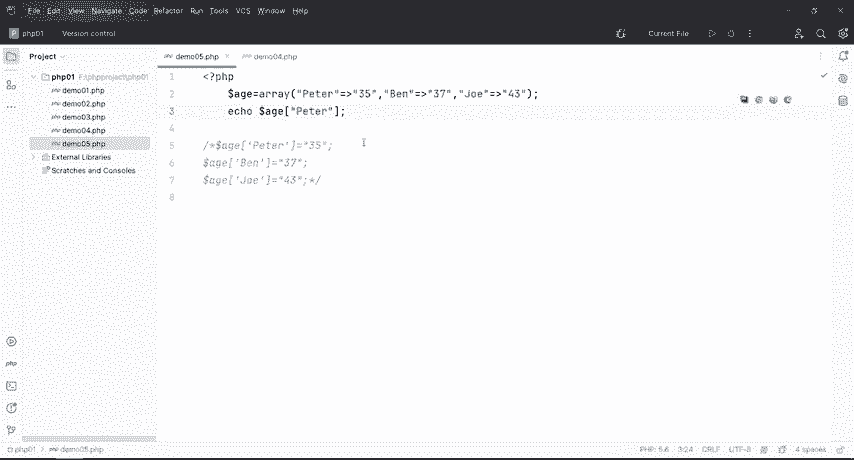

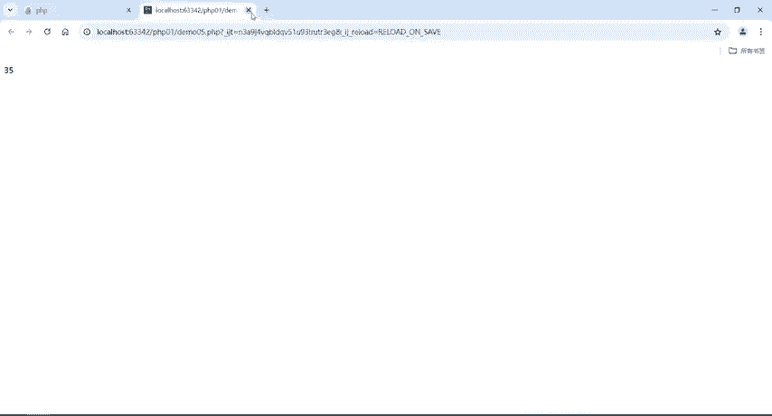

鼻N啊交易都行啊。好，那么接下来我们再来看一下关联数组怎么去便利的啊。便利的话呢就是通过我们这个for循环啊，但是在这个地方可以使用for一次循环啊。

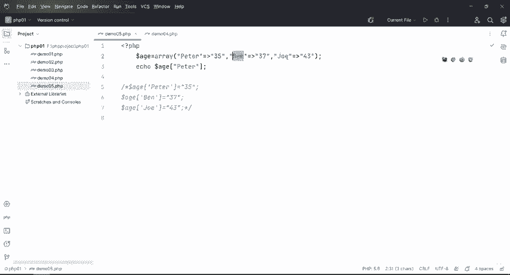

那么负E值循环就是比负循环差在哪里呢？负E值循环通常是来辨离关联的这个数组的。好，那么怎么去辨历啊？刚才是不是声明了一个这个声明了一个这个数组啊，声明了一个这个数组之后，我现在要干嘛呢？

我现在不仅仅要打印peter。😊。

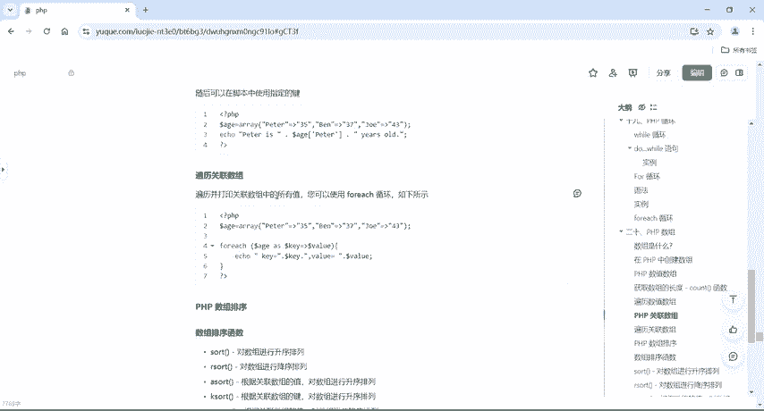

我要把他们三个都打印出来，而且还要让你一对一的打印出来。那这个就是我们所说的一个建值对的方式。

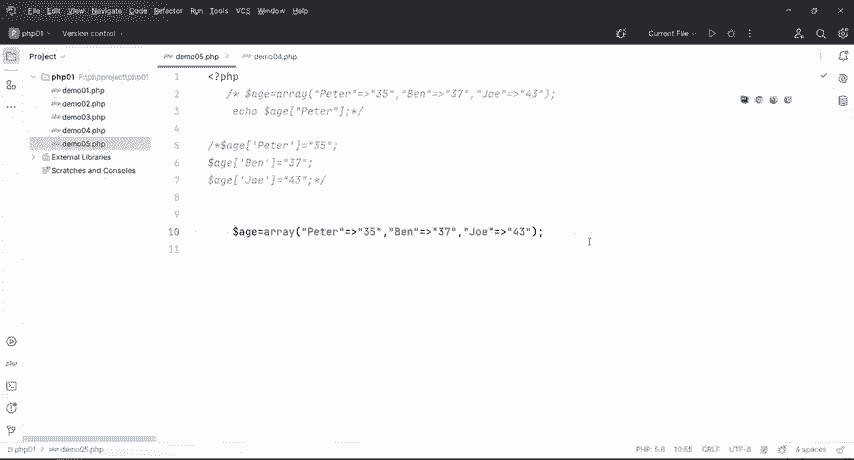

好，我如果说要打印它所有的值也是可以打打印它所有的键，它也可以打。好，怎么用负一次循环，我们把这个玩意给它抠ll一下。

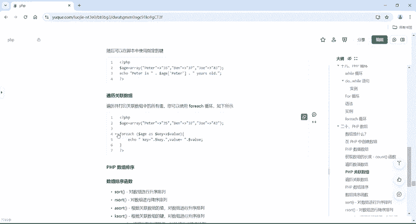

拷贝啊放到这个地方来啊，好，for each次循环。A句。的。给他取个名字啊，AAK。

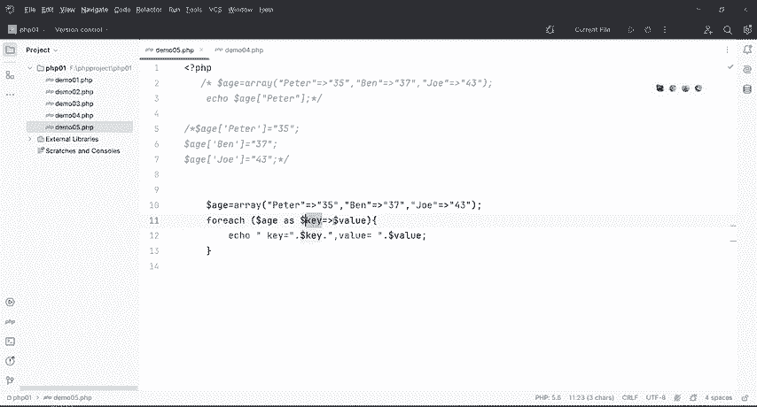

万6。好。一庭。key是petervalue是35，key是半，value37，开始juvalue是43，这个就是一个见直对的方式，把所有的内容给它便列出来，用forE式循环。

我要求谁，我是不是要求这个A值，所以说这里是写A。键K，然后呢，value是匹配这个键对应peter对应ban对应我们这个JY91就对吧？还有这个value呢是匹配35、37和43。

所以说它打印输出的这个方式啊，它的写法是这么写的，然后最终输出的，是把这个K和这个value分别给它输出出来。好，这个呢就是怎么去便历关联输组。

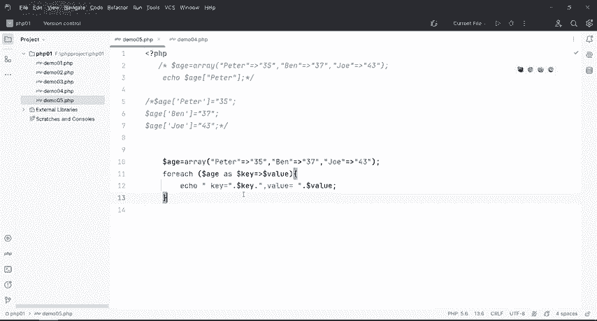

好，嗯，便历关联数组结束之后，那接下来我们来看一下我们这个数组里面的排序。呃，数组里面排序呢，我们一般的啊我们排序都知道有升序有降序，对吧？但是在数组里面呢，除了升序降序排列。

它还可以根据它的间值去升序降序。😊，那具体怎么做？我们有很多函数啊，第一个函数是st。第二个函数是as sort啊，这个是一对啊，还有什么as sort。😊。

K sort还有AR sort KR sort。好，这个是s是最普通的，就是对数组直接进行声序排列。阿alt呢是进行降序排列，所以他们两个是一对啊。那么还有呢是根据数组的值进行筛选。

根据数组的键进行筛选。然后还有根据我们数组的一个。值进行数组一个降序的一个排列，还有关联数组的一个键进行数组降序排列。所以这个啊看上去有点乱，对不对？乱七八糟的，一个是值，一个射件，一个是值一个射件。

要具体怎么做啊，我们可以先把这个我们画一下画一下。😊，怎么画呢？我们把这个给他搞一下啊。😊，这个怎么做啊怎么做？呃，打开打开这个我们来看一下，画一画啊。这个一个升序，一个降雪，这个呢是根据数组的值升序。

这个呢是根据数组的值降雪啊，一个升一个降。好，这个呢是根据数组的键，这个也是根据数组的键。呃这个升这个降，这个是一对啊，这个呢是一对啊，这个把它捋清楚，那具体怎么去操作啊，首先我们来看一下代码。

第一个对数组进行升序排列。那么具体怎么排。好嗯，在这个地方呢，同样的啊，回到这里来，我把这个东西给它先注释掉，注释掉之后呢，我把这个代码给它放到这里来。😊。

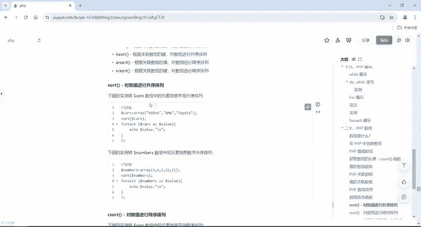

怎么放啊，直接粘过来啊，粘过来，注意啊，PHP这个地方不能删啊，这软件具体怎么装的，都跟大家说了，不能不能去它默认给你生成的PHP就不用删它了。好，这个里面是不是有三个值，那三个值的话。

我直接给它来一个s卡，它就会按照我们26个字母ABCDEFG生序去排列，还这序排列，还记得不？😊。

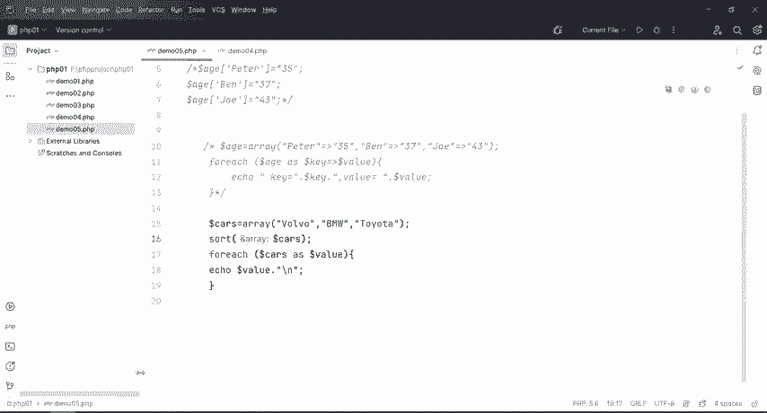

是不是升序排列啊，对吧？那么升序的话，那就是A到Z，那A到C那B可能是第一个，然后呢T，然后还有V，那具体怎么去做，先排序，排完序之后直接用for each给它打印出出，把这个value。

因为我们只需要value，这里并不是键值。对，对吧？好，那么直接S。😊。

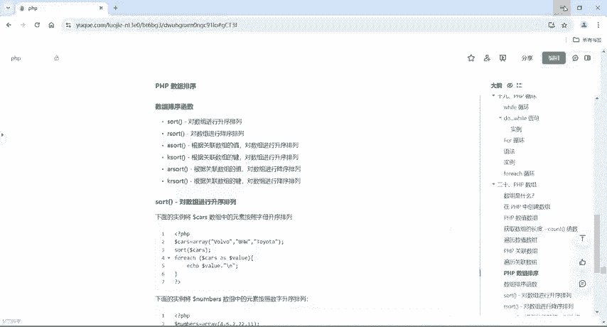

Y6。加上一个空格换行啊，运行一下是不是BTV啊，这个是升序。那么如果是要给它降序的话呢，直接给它改一个，改什么呢？

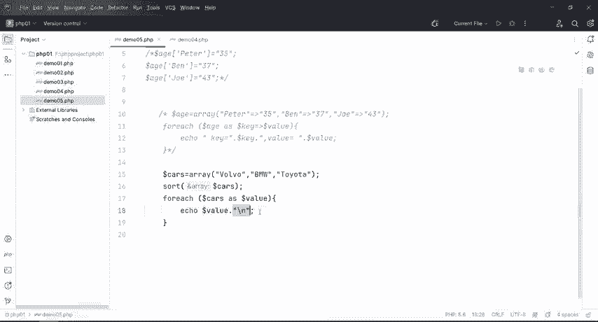

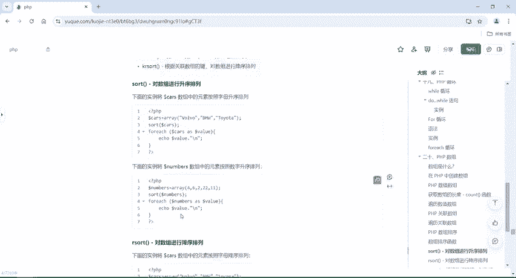

改一个R sort啊，这怎么改在这个里面给它直接加上一个R。😊，这是降雪啊，降雪怎么降的？😡，VTB吧。好，看一下是不是啊VTB对吧？好了，这个是st跟R sortt。😊。

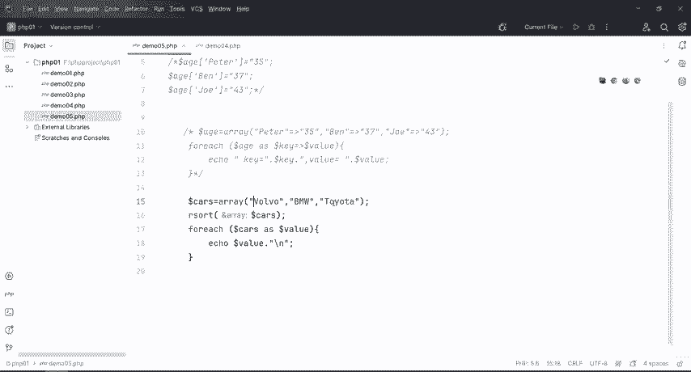

好，这个地方也给大家。又准备了一个数字的顺序排列啊，其实跟我们这个26个英文字母是一样的，而是一模一样。你们可以把这个括号里面的值变成阿拉伯数字，它也会根据我们这个从低到高从到高到低去排列。

一个是salt，一个是aresort。好，那么接下来还有一个as sortt。那么这个as sortt呢就牵扯到我们这个值和键呢。好，那么回到我们原来的步骤啊，我们先把它注释掉。好，注射掉之后呢。

把这个东西呢给它还原。😊。

还原之后把它粘在这里。间值队啊，这是针对于间值队的一个排序。as sort是根据数组的值对数组进行升序排列。那数组的值在哪里呢？数组的值是不是这个peter Ben，还有这个ju，那它怎么去排B。

然后呢？😊。

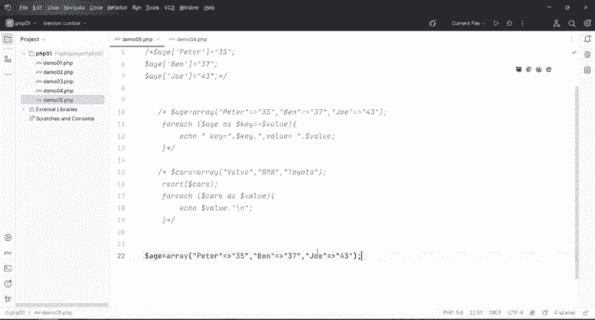

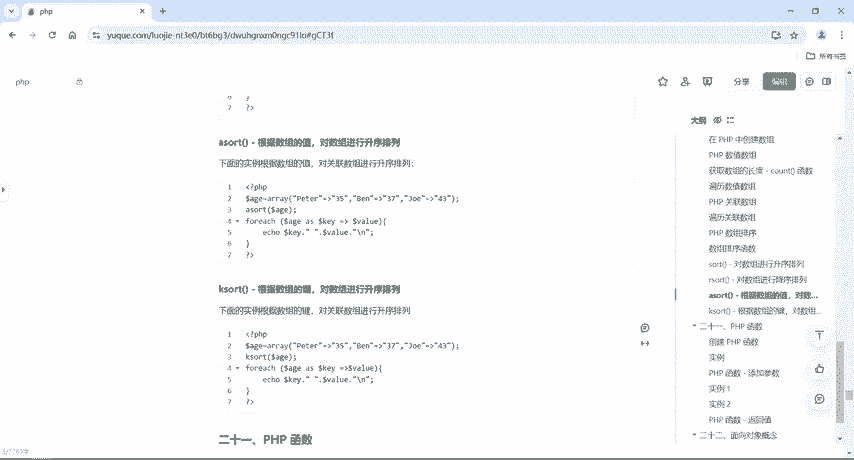

P。是吧嗯，这。哎，不是啊。是BJP啊，是不是26个字母啊，B是排第一，然后接，然后再指P好，它是会按照ABCDFG的一个声呃声序啊声序。主要是根据这个值。那那如果说你要根据键的话呢。

它就会根据这个35啊，37、43去排列了。好，那具体怎么去实现的呢？在这里啊，同样的也给你们大概大家提供了一下，给它给他直接来一个as sort啊。as sort。😊。

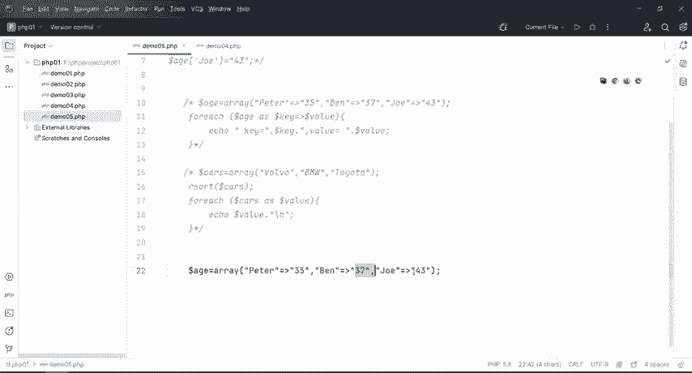

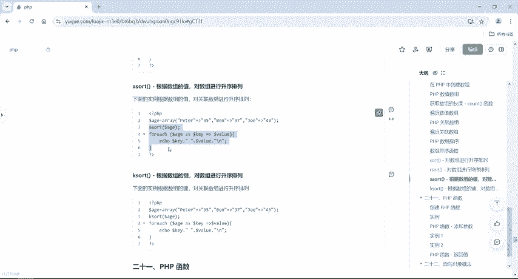

根据数组的值给它as。s一下我这个age，然后打印输出啊，用forE输出的是根据它的值去判断的。好，我们把这个key放进来，把这个value给它放进来。好，具体怎么排的，来运行一下。😊。

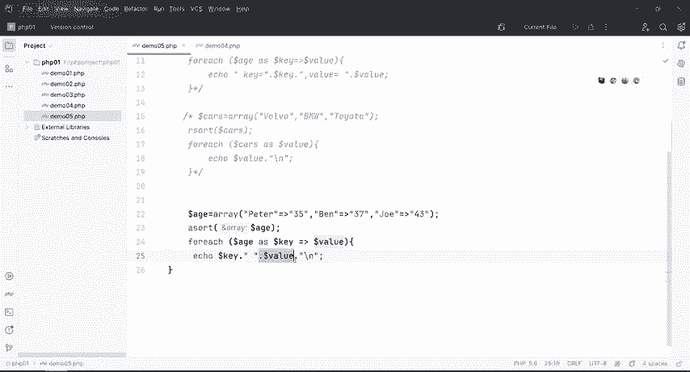

是不是peter。对吧3537还是43。

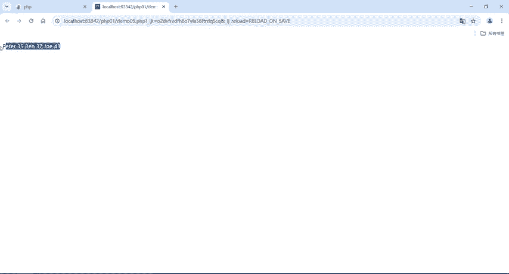

就这样子啊一个步骤。

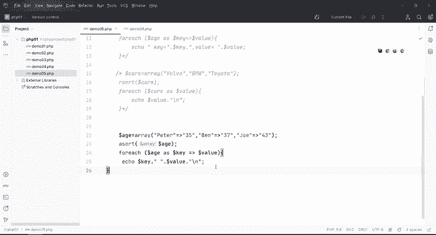

好了，继续回到这个PPT上面啊，这是根据数组的值进行去排序，去升序排序。然后还有这个K sort呢，是根据数组的键啊啊，同样的我们把它复制一份啊复制一份。

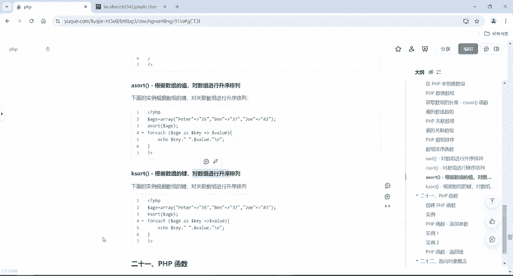

看车C。

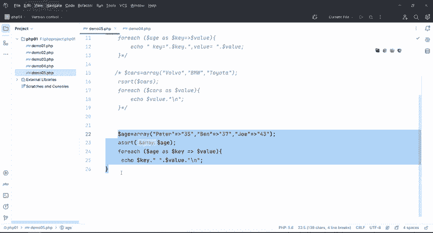

然后再来复制一份，把这个A short成呢。变成K sort，我们自己观察一下啊，观察一下我们这个。

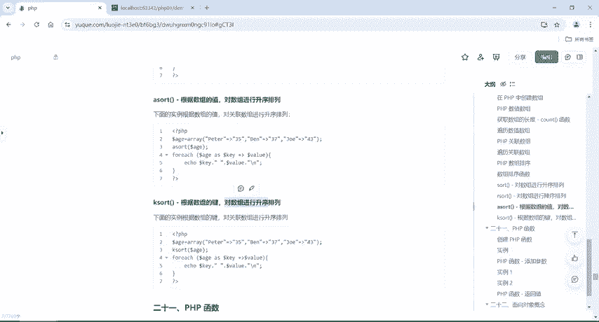

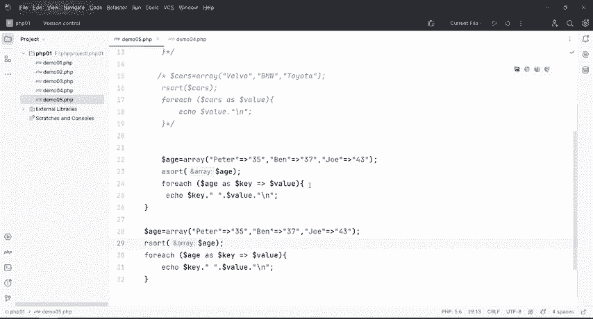

他是什么样子的，我们运行一步走。有了。012433735是不是降去啊？啊，这个就是一个K sort，根据数组的一个键进行升序排序。好，这个呢就是我们数组啊，就PHP里面的一个排序函数。

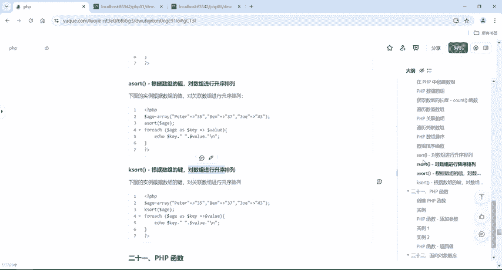