# B站首推！建议所有想参加CTF夺旗赛的同学，死磕这条视频，2024年字节大佬花一周时间整理的CTF入门保姆级教程！从入门到入狱（web渗透／PHP基／SQL注） - P11：11、php函数定义与使用 - CTF入门教学 - BV1JjeJeYE2p

好，上节课呢讲了我们的数组以及数组排序。那这节课我们接下来看一下我们这个PHP的函数嗯，具体的呃我们这里有PPT啊，然后呢上节课是用的这个语雀啊，笔记跟大家去讲解的。那么具体的一个资料。

我们可以在评论区自取，或者是直接联系我，我可以把这个呃语雀的笔记，还有我们的PPT还有我们这个工具啊，全部都给到大家。

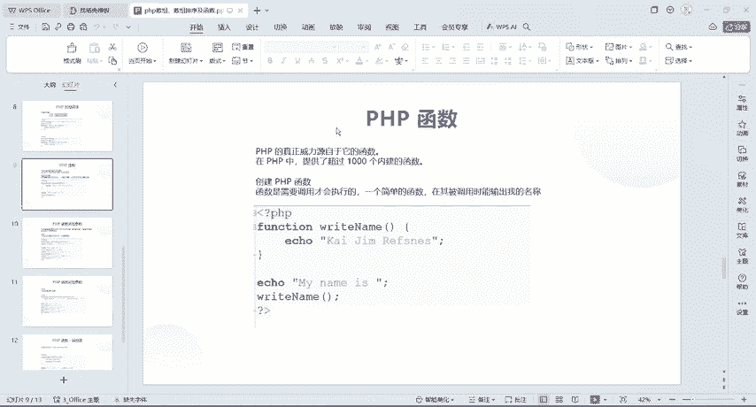

好，那我们接下来看一下什么是PHP函数。那在PHP当中啊，它真正的威力源自于它的一个函数，它提供了超过1000个啊内件函数。也就是说它这个1000个函数呢，我们在这边不会说一个一个跟大家去讲啊，呃。

我们只会跟大家去讲一些常见的函数。那具体的这个函数它是怎么去创建的那第一个创建PHP的函数，函数呢是通过调用函数来执行的。好，打个比方，这里呢有一个代码。还是一样的啊，PGP包围起来。

我们怎么去定一个函数呢？用方形。啊，方格后面呢给它写一个函数名啊，这个名字可以自己去定义。好，叫翻个器 name啊，给它括号给它括起来。好，大括号啊，这个玩意呢跟if else是一样的东西，对吧？

那么我们要执行的代码在这个大括号里面去执行。好，PHP函数的一个准则，函数的名称应该是提示出它的一个功能的。好，那也就是说刚才不是跟大家说，哎，我这个函数可以随意定义，对不对啊。

你自己在自己练习的时候可以随意的去定义。但是呢如果说要正儿八经的啊去写代码。那我们这个函数，比如说嗯我要去做一件事情啊去买个东西啊，那我们这个函数这个名字呢，就要取一个买东西的这个名字啊。好。

那后还还有一个就是函数名字以字母或者下划线开头，不能以数字开头。这个跟我们定义变量的时候是一样的啊，不能以数字开头只能是字母或者是下划线啊，所以一般来说呢，我们就直接用字母啊，那么字母的话呢。

还要讲究一下这个陀分命名法啊，就是低高低啊，那个陀分是怎么样的，就是哎上去，然后接下来对吧？哎，所以说采用一个陀分命名法啊，这个都是编码里面的一。个准则啊，说一定还要遵循这个。语法啊还有它的一个结构。

还有它的要求啊都要是。遵循的好，那我们接下来看这个函数做了一个实例啊。好这个地方呢。给大家来了一个函数，对吧？哎，方个形right name。哎，写入你的名字，好，echo一下，哎，是什么什么名字。好。

当我们在e的时候呢，这个地方啊因为是字符串，所以说我们得给它加上引号啊，双引号带引号都可以。好，其次呢在方块形这个外面啊给它e了一下my name is。好。其次。😊。

调用了这个函数名叫right name。好，那我们现在来把这个代码呢给它call到这里来啊，还是一样的。打开我们这个PHPstone啊，扭一下这个PHP表取个名字啊，demo06找回家。

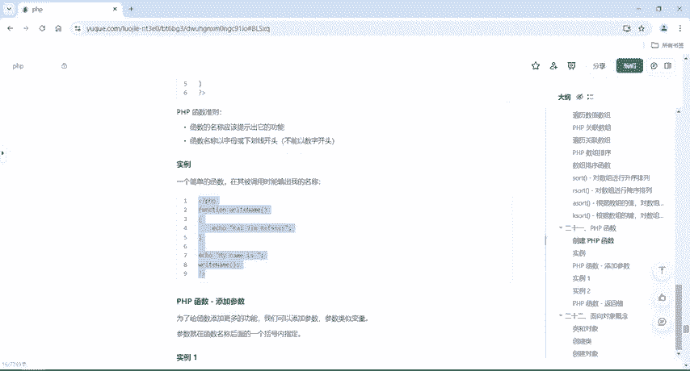

好，我把这个代码呢给它放这来啊，我们来研究一下，和代码都是从上到下执行的。但是呢我们在这边定义了一个函数之后啊。这个函数定义了，我们没有调用的话呢，这个函数这里面的一句话啊。

这句话是不会执行的那具体的这个函数怎么调用，我们写什么名字啊，我们就直接在这个里面调用。那么调用这个之后，它就会直接打印输出这里面的语句啊，你想给它输出什么哎，它就会输出什么。啊，这一定要去调用的啊。

调用的话一定要在这个函数外面去调用啊，这是函数一个内部啊，内部里面就打印输出一句话，我们在定义完了之后，在外面调用了这个re name它就会执行。如果说你这里不调用的话，这个就不会执行。好。

那么刚才也说到了。程序呢是从上到下执行的。好，我这个可以把它放一边。下一个呢我在这个地方打印了一个my name ES，所以说它先执行的是这句话。然后在下面调用了这个函数。

它会把这个给它打印输出拼接到这个后面。所以说呢我们这个结果就是my name is andja reference ok好，这个是函数的一个定义与使用。

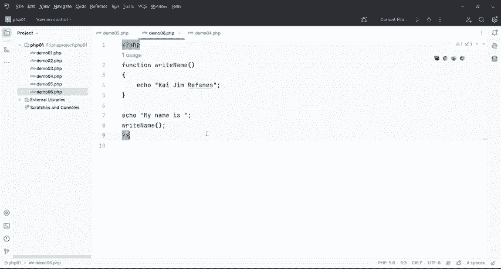

好，那接下来呢我们PHP里面啊还有一个叫添加函数啊，添加函数是什么意思呢？比如说我现在要去做一些7788的哎加减乘除的功能。那么我加做加减乘除功能的话，那肯定要知道第一个数，第二个数，对吧？哎。

那所以说呢我们在这个函数里面啊去给它添加参数。添加参数参数呢就跟我们这个前面讲的变量是一样的，参数就直接在函数后面啊括号里面去指定的。什么意思呢？刚才给大家讲的这个是没有参数的函数。

那有参的函数是什么样子的，就直接在这个括号里面随便啊给它写了来多 A对吧？然后呢逗号doB哎，我就可以同时指定一个或者是多个参数。好，那我们指定参数之后，我们在调用这个函数的时候。

这个括号里面一定要跟上它的参数。好嗯，我讲。

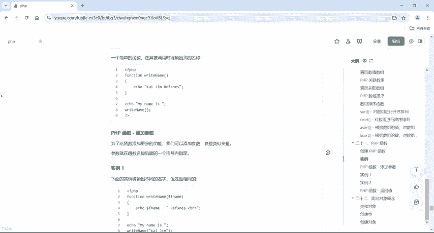

讲了那么多对吧？讲那么多，那我们接下来直接看一下这个案例啊，这里面提供了一个案例，好，把这个给他。

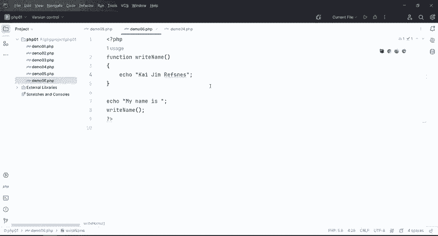

卡车C。

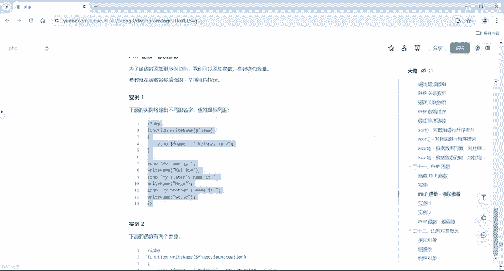

好，这里面啊我们首先先从一个函数先写啊PP然后demo07好，我们做个对比啊。我们刚才在写前面的函数的时候，right name前面是没有没有什么没有这个变量的，对不对，也就是没有这个参数啊。

那有现在没有参数跟有参数怎么去区区分啊，就是无参的函数，这个是有参的函数啊，就这么去区分啊。好，那这个函数里面打印了一个什么呢？打印了一个F name这个F name是在哪里的，是在这个参数里面的。

对不对？但是这个F name我们有没有复值呢？我们是没有复值的那什么时候复值在我们调用这个re name的时候给它去复值好，那怎么去搞的呢？就是一下my name is。

然后right name我在这个里面给这个F name给它复值那所以说打印出来就是my name is什么。😊，my sister's name is海ger对吧？

my brother name is啊，这样子的。所以说我们来运行一下就这样子的一个东西啊。好，那这样子的话呢，相对于我们这个函数的一个定义啊，它的功能就比较多。我想给他去完成什么样的功能。

我就直接在里面去添加参数啊，这个参数呢可以一个甚至多个。好，那接下去往下看，下面第二个呢是有多个参数。那么这个地方除了写到F name还写了一个第二个参数，对吧？😊。

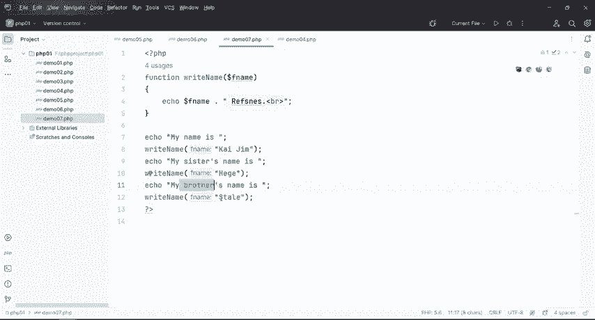

好，那这个具体的怎么去定义的呢？也是同样的，在调用这个readd name的时候，你这个括号里面有几个参数，我就要给几个值。好，那我们现在把这个。看一看啊。

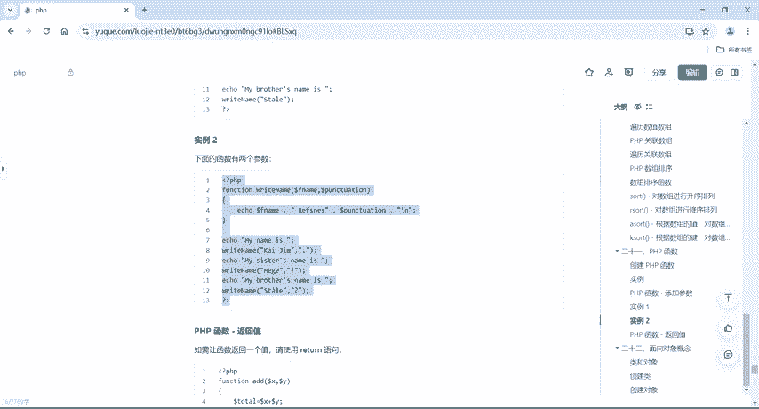

好，右键你有1个PHPfi，给它取个名字叫demo08。好。把它粘贴过来。好，放到这个地方来的话，就能看得清楚了啊。这个F name就前面有一个F name啊吧这是一个参数啊，这个呢是两个参数。好。

那这个函数啊就说明这个函数呢我们定义的时候可以给它一个或多个参数。好，我给它一个或者多个，我这里给它两个，那给它两个的话呢，我们在这个地方啊right time在调用的时候就要给它第一个参数的值。

然后第二个参数的值才可以否则的话呢就会报错。那这个案例它打印输出是什么样子的，是这样子的。😊。

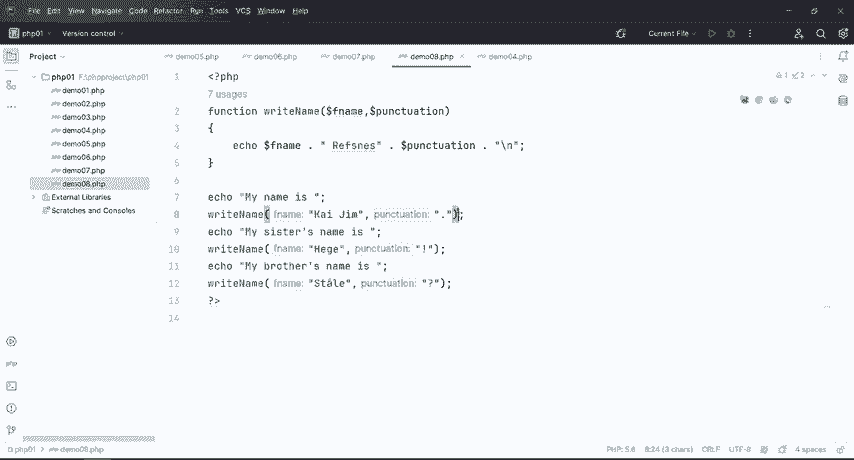

啊然后加上一个点，然后这个呢加上一个感叹号，这个呢加上了一个问号好。这个是多个参数啊。好，那我们一个参数，两个参数，还有呢是没有参数啊，这个都是常用的函数格式，就是我们PHP里面的函数经常会用得到的。

好，那再往下看啊。PHP函数它还有一个返回的值，那返回值是什么意思呢？就如需要让函数返回一个值的话呢，要使用我们这个return语句。好，那这边就牵扯到一个什么呢？牵扯到一个返回语句啊。

那具体怎么去实现的我们还是把这个取个名字啊，叫de09然后呢，我把笔记上面的代码给到大家啊，是吧？好，那么具体的代码啊还是一样的。

代码都是存在我们这个语雀笔记上面当然PPT里面啊也写了那具体的资料啊还是一样的。我们就直接呃在评论区自取或者是直接联系到我，我给大家去发过去就可以了。好，那我们接下来看一下这个返回值它到底什么意思啊。

😊。

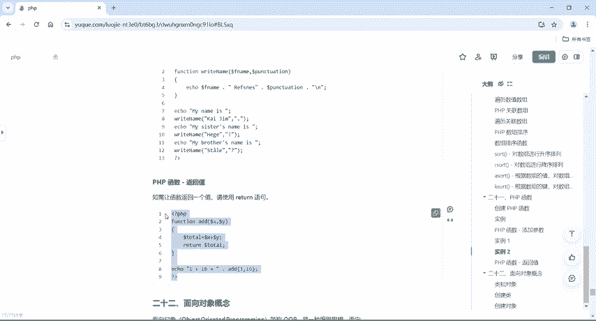

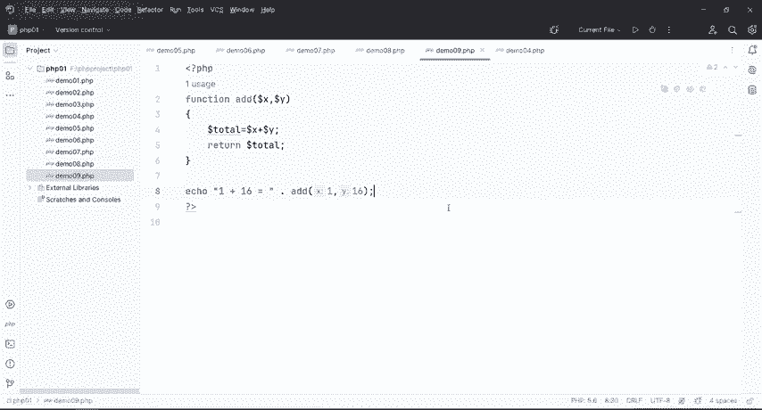

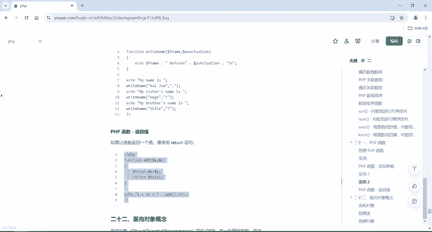

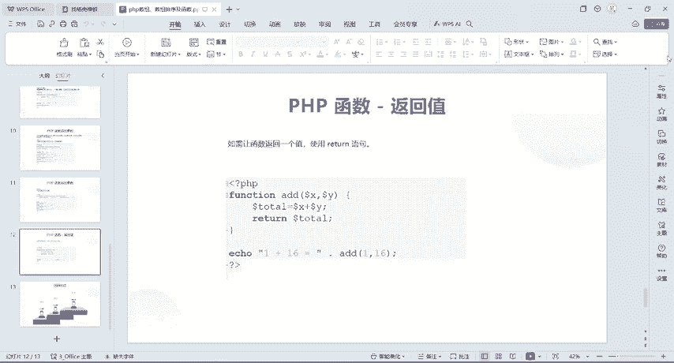

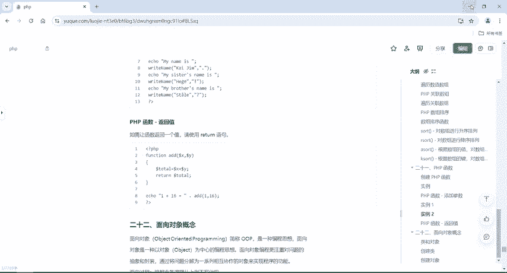

好，在这边呢写了一个function形啊ADD这个函数，我给它两个值，一个是X，一个是Y。我在这个里面呢给它计算了一个X加Y啊，但是呢我在函数里面去定义的时候啊，X和Y都没有去复值。

所以说这个total啊，它也没有指导啊，返回一个total。好，那么具体区分在哪里呢？如果说你要使用return的话啊，如果说你在这里使用return的话，那我们在打印调用它的时候，我们叫。e了好。

做个区分啊。我们当时啊在前面这个地方是不是直接调用的，对不对？啊，直接调用的，然后这个里面有个e打印输出。所以说我们在外面直接调用这个函数就可以了。但是呢回到这个第九个，我在里面有没有e是没有e的。

没有打印输出的，我只有一个return。好，那当函数里面使用这个return之后啊，我们在外面调用的时候一定要加上ec。好，那么一加16等于是吧？ad一16，这个一和16的话，就是给X和Y给它负的值。

所以说呢运形一加16等于17啊，这个就是return函数语句。

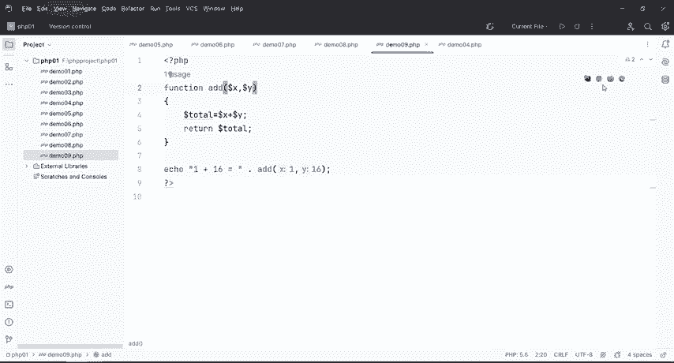

好，那么到这边，我们这个PHP函数啊就告一段落了。那么下一节课呢，我们来讲一下我们PHP里面的面向对象。

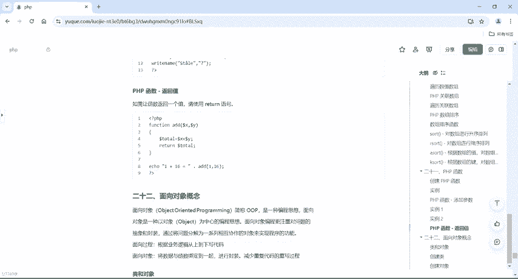