# B站首推！建议所有想参加CTF夺旗赛的同学，死磕这条视频，2024年字节大佬花一周时间整理的CTF入门保姆级教程！从入门到入狱（web渗透／PHP基／SQL注） - P12：12、php面向对象 - CTF入门教学 - BV1JjeJeYE2p

好，接下来我们来看一下我们PHP里面的这个面向对象的概念。面向对象它是一种编程思想啊，它是以一种对象为中心的编程思想。那么我们在之前没有接触过面向对象的时候啊，我们都是面向过程。那么根据业务逻辑。

从上到下写代码，那么从上到下写代码呢，就会导致我们代码冗余。就是你写了很多很多代码都是重复的。那如果说为了避免这个代码重复，我们就可以使用面向对象的这个编程思想，将数据与函数绑定到一起进行分装。

减少重复代码的重写过程啊，这个就是面向对象，那面向对象理解完了之后，我们接下来给大家讲一下，我们在PHP当中的类和对象。那么类核对象它是什么样的概念啊，类似抽象的一个概念。那么它仅仅是一个模板。

那么用来描述具有相同属性和方法的对象的集合啊。😊，这个是类，比如人是一个类，对象呢是类的实体。😊，是某一个具体的事物，比如张三则是具体的存在啊，是一个对象。啊，再打个比方，哎我们这个水果啊。

水果的话它分很多很多种啊。那么所以说在水果呢，它也是属于一个类。好，那对象有什么呢？对象在水果里面有西瓜苹果香蕉啊等等等等一系列水果。

它都是属于对象好那具体的在PHP当中怎么去创建类好这个实例呢创建了一个名字为fruit这个类啊，这个水果类啊，那么包含两个属性，一个是name，一个是color。

以及呢两个用于设置和获取name属性的方法，一个是set name，一个是get name是设置ge呢是得到啊，也可以称它为获取啊，那么在类中变量为属性函数称为方法this关键字引用当前对象。

并且只能在方法内部可用。好这个地方我们同样的把笔记上面的给它拷贝到PHPstone里面来。好，具体笔记还有我们这个资料。😊。

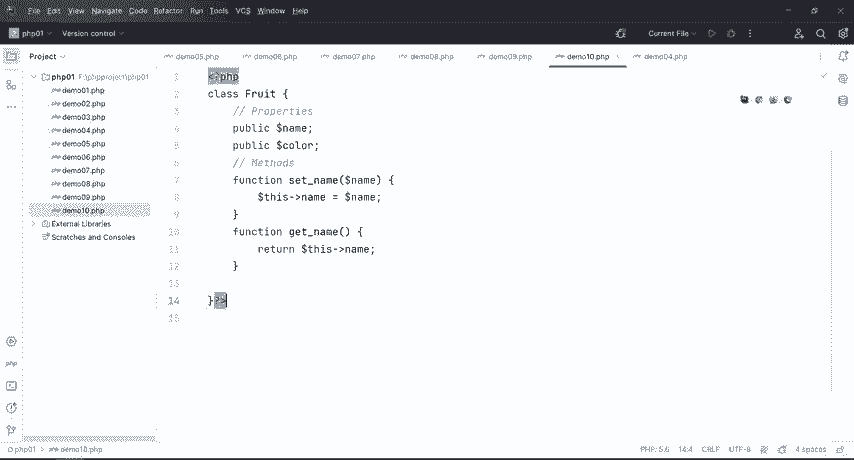

还有我们这个工具啊，视频等等啊，都会给到大家。具体的我们直接在评论区咨询，或者是嗯跟我联系啊，我会把所有的资料啊、PPT啊、视频呢啊还有我们这个工具，还有我们这个语雀笔记啊，全部都会给到大家的。😊。

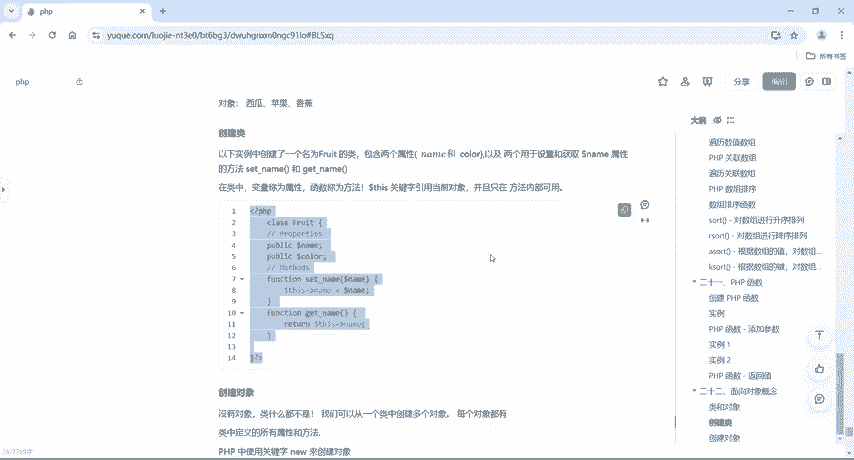

好，那接下来我们回到这里来看一下。好，这里呢定义一个类啊，定义类的话呢，用什么关键字呢？用class。😊，好，class关键字定义完了之后啊，这个名字取一个叫fruit。好。

这个fruit后面呢这个玩意儿呢跟定义变量啊定义我们这个函数是不一样的。我们定义函数一定要加上括号。定义类呢在这个类名后面啊，没有括号，直接给它画括号括起来。好，那这里面提供了两个啊。

这是我们两个变量在面向对象的一个过程里面呢，这个变量叫什么呢？叫属性啊，属性好，其次定义了两个函数啊，在这个里面呢函数又称它什么呢？称它为。😊。

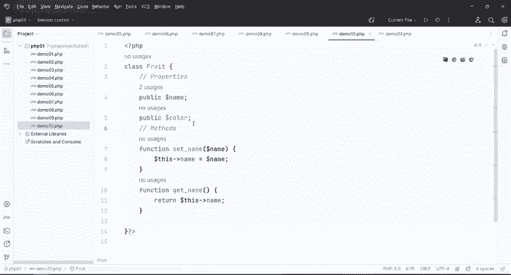

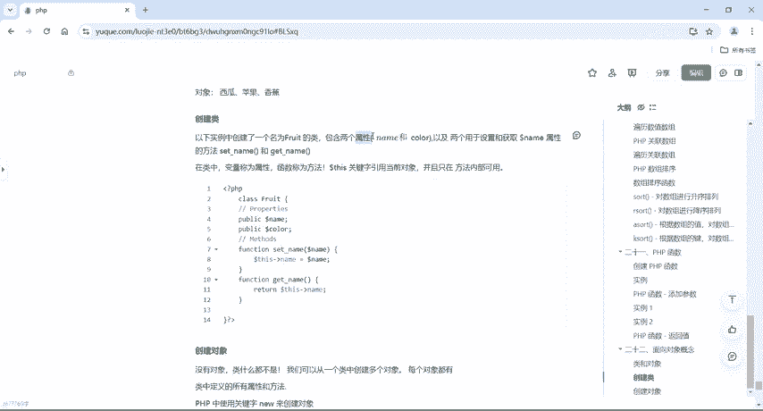

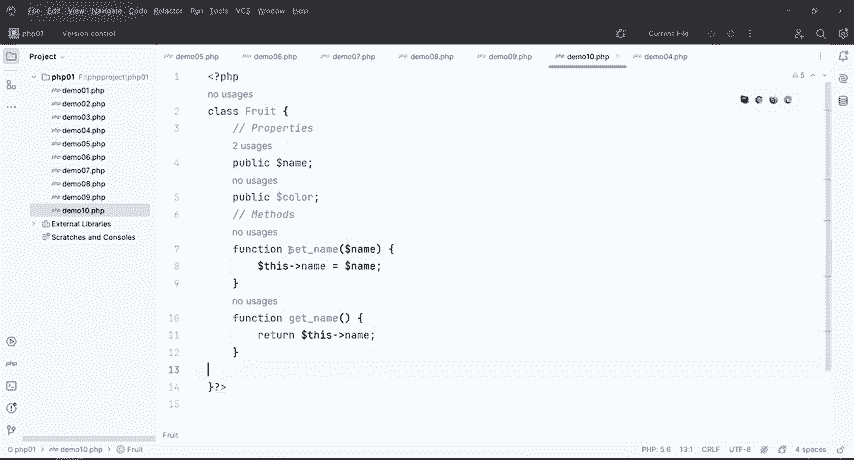

方法啊称它为方法啊属性。和方法。这是我们之前讲过的变量和函数啊，在面向对象当中，它改了个名字啊。好，那具体的怎么去实现它呢？我定义了一个类之后，那接下来是不是要使用这个类呢？好，那接下来我们再来往下走。

好，我们把类创建好了之后，我们来创建对象啊，那没有对象呢，类什么都不是啊，什么都不是，那我们可以从一个类中创建多个对象，也就是说嗯有的同学可能会听到啊有对象没对象我六几个对象就行了，对吧？

所以说呢在PHP编程里面啊，我们使用关键字new来创建对象。那具体怎么去做的呢？这个里面也给大家提供的啊，两个对象，一个是apple一个是banana啊，具体怎么去做的呢？我们把这部分给它copy一下。

😊。

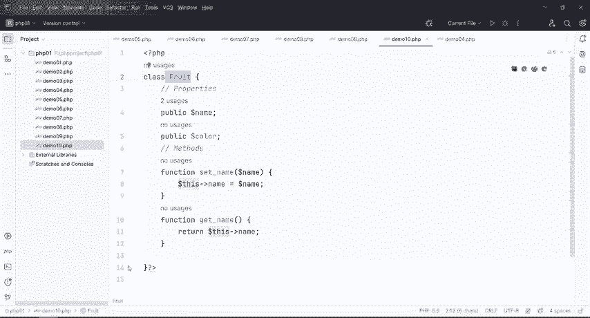

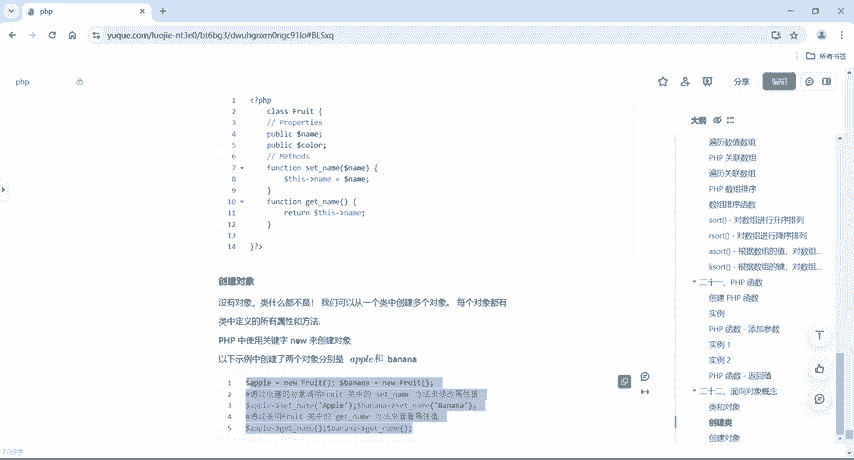

放到哪里呢？放到这个类的外面啊，哎这个类这个括号是跟这个括号是成认垂对的。我们在这个类的外部给它去6个对象，那么6个对象之后啊，这里总共是6了两个，用了两个对象。

同样的用apple或者是banana去set一下name，s一下name之后，我们再调用一下get name啊，我们调用完了之后，我们就得到了一个apple啊，一个banana总共得到了两个对象啊，好。

我们运行一下，哎，没有东西，是不是那么没有东西，那具体怎么去做呢？我们是不是还得去给它生成一个。😊。

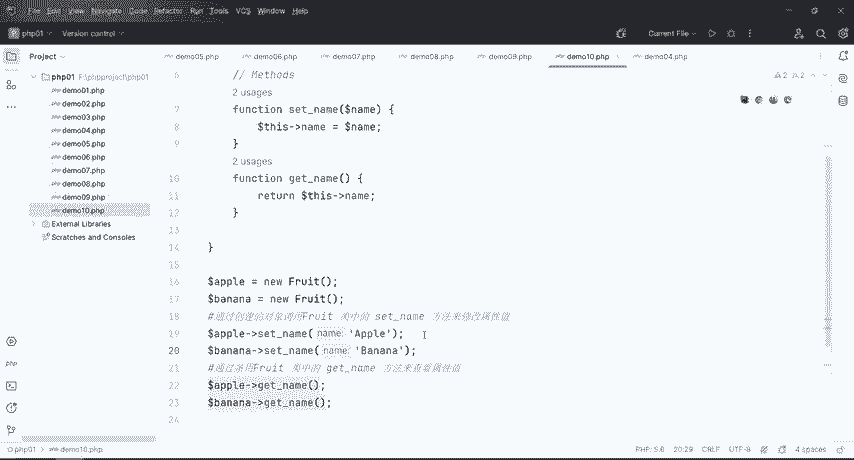

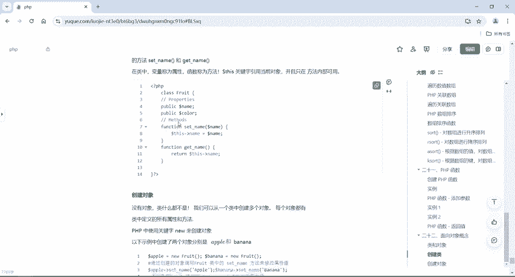

自定义的一个方法，是不是啊，那我们回到这来。我们再来哎方个形，然后SAY给他打个招呼，对不对？好，ec call一下。😊，还口嗯，我们这个。两个对象啊两个对象哎，加上。嗯，不查，我这直接写吧对象。

加上哎doller this点name还是点啊，不是点啊。这直接用一个杠大括号就可以了。这是PHP里面的语法啊。好，然后再来嗯加上这个。😊，点。是吧嗯。那注意啊，我们在这个里面我们不能用加厚了啊。

老师是之前搞过java啊，搞过java的，所以说写习惯了。在PHP里面用来连接的话呢，直接用这个点啊就可以了。然后再去点一下。到了。This。😔，啊，就直接这单吧。好了，可以了。😊，你的打印输出啊。

打印输出我这个名字。那接下来我们就直接这么玩吧。哎，到ll了 apple。点。还什么杠啊杠。Sa。好，再来嗯到了banana。减是吧，C就可以了。同样的啊去调用一下啊，调用一下我们这个自己写的方法。😊。

C那样的话就会直接把this name给它输出出来。啊，我们看一下是不是对象一是apple，对象二呢是bananaO这个是我们的面向对象的概念，以及怎么去创建类根，创建对象。

还有我们对象具体怎么去使用的。😊。

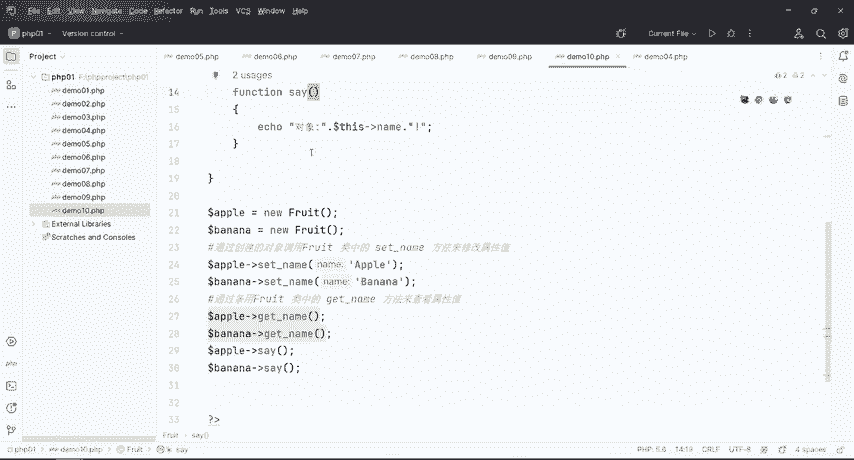

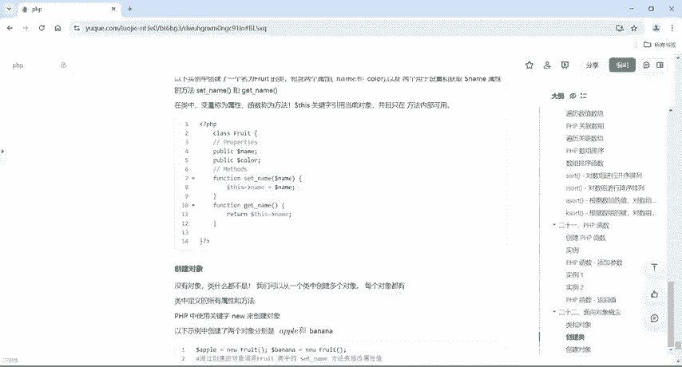