# B站首推！建议所有想参加CTF夺旗赛的同学，死磕这条视频，2024年字节大佬花一周时间整理的CTF入门保姆级教程！从入门到入狱（web渗透／PHP基／SQL注） - P13：13、php构造函数与析构函数 - CTF入门教学 - BV1JjeJeYE2p

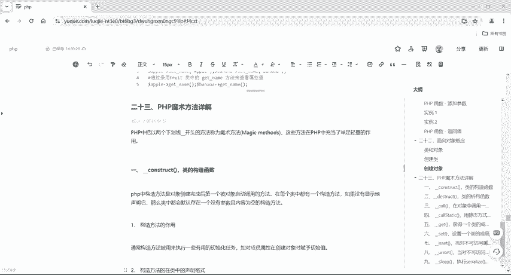

好，接下来呢给大家讲一下我们PHP编程里面的魔术方法。好，这个魔术方法呢首先牵扯到一个反序列化的基础知识。

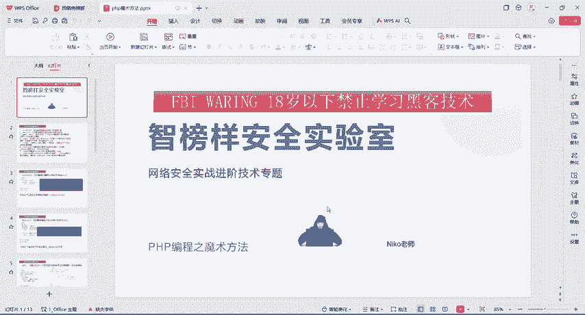

也就是说我们在网案里面有PHP反序列化编程，然后以及反序列化漏洞。所以说呢为了在反序列化漏洞那一章节学的。更好的话呢，我们还是得来了解一下我们这个反序列化的基础知识。

那么这个基础知识里面就牵扯到了我们这个魔术方法。那么什么是魔术方法呢？我们在前面章节里面看到的方法都是直接定义，加上一个括号。那么魔术方法跟普通方法。普通函数不一样的地方在哪里？

在前面这个地方有两根下划线，这个就是魔术方法。那么具体魔术方法有一constructstructget和 set跟et啊。

还有to string还有我们这个wake up我们sleep跟wake up是在序列化跟反序列化对象时会用到的。好，那具体的我们来分析一下啊，construct呢是在对象被创建时自动执行的构通方法。

那么destruct呢是在对象被销毁之前自动执行的构方法。好，那么具体我们就知道construct跟destruct是一对啊，get和 set是一对 on set是一对啊。

to string是独立的sleep跟wake up是一对。好，这个就是它的一个基础知识。那具体的怎么去做呢？我们PPT啊也给大家准备好了，这里面有代码啊好，那么同样的啊PPT呢还有我们这个语句资料。

😊。

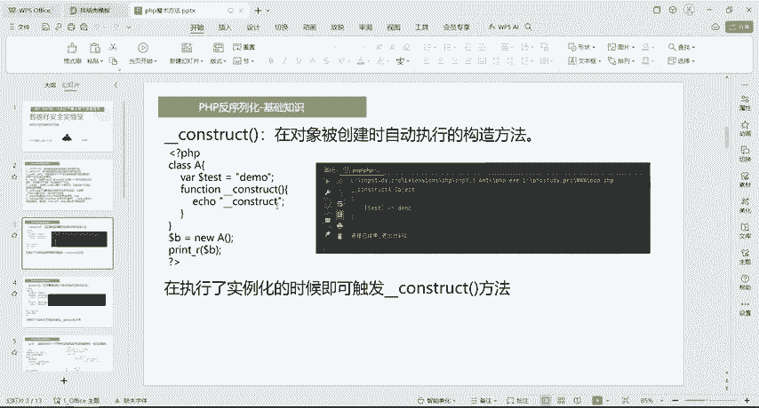

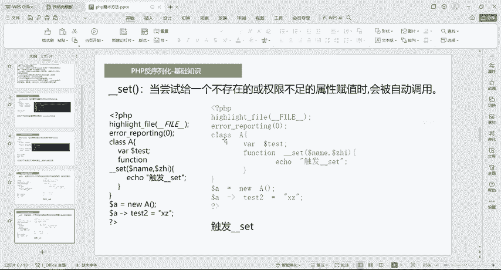

啊，都是直接在我们这个评论区自取啊，或者是联系我，我给大家去发啊。好吧。好，那么回到我们这个语雀里面啊，PPT我们放一边啊，语雀里面都给到大家准备好了啊。

那么PHP当中呢把以两个下划线开头的方法称为魔术方法啊，叫magic methods。那么这些方法呢在PHP当中充当的举足轻重的作用。

那第一个类的构造函数叫construct啊 constructstruct那么PHP当中构造方法是对象创建完成后，第一个被对象自动调用的方法。那么在每一个类当中呢都有一个构造方法。

那如果没有显示的声明它，那么类中都会默认存在一个啊，没有参数且内容为空的构造方法。好，那么啰嗦了那么多啊，那可能有的伙伴哎一脸懵逼什么意思啊，对不对？😊。

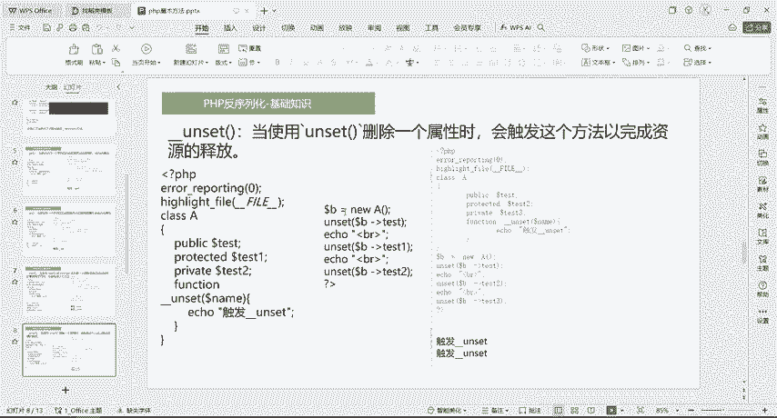

接下来呢我就给大家来讲一下这个construct构造函数的一个作用啊。那么通常构造方法呢是用来执行一些有用的初始化任务的那如果是对成员属性在创建对象的时候赋予初始值啊，我们在对象创建的时候。

就可以在construct里面赋予它初始值。那么构造方法在类中怎么去声明啊，一模一样的。跟我们前面讲的函数是一样的，它里面也可以写参数，也可以不写啊。呃就是没有参数或者是一个或者是多个啊。

这是我们的参数列表。唯一不一样的是在这个里面它多了两根下划线啊，这里面是我们的方法体，通常是用来对成员属性进行初始化的复制。好，那么在类中声明构造方法是要注意啊，一个类当中只能声明一个构造方法。

那么原因是什么呢？我们PHP它是不支持构造函数的一个重载的。第二点呢是构造方法，名称是以两个划线啊，就是下划线开始的。😊，好，下面呢是它的一个例子啊，那面次例子。

那么这个例子我们同样的来给大家写一下啊写一下。😊，好，那么直接把这个拷贝一下吧。啊，同样的啊这个代码还是一样的，都会给到大家的。好，回到我们这个PHPstone里面来。好，右键扭一下PHPfi。😊。

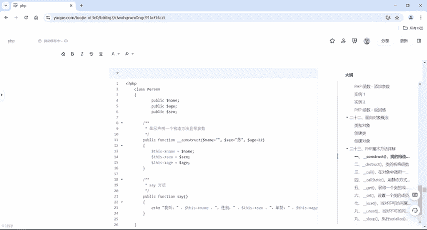

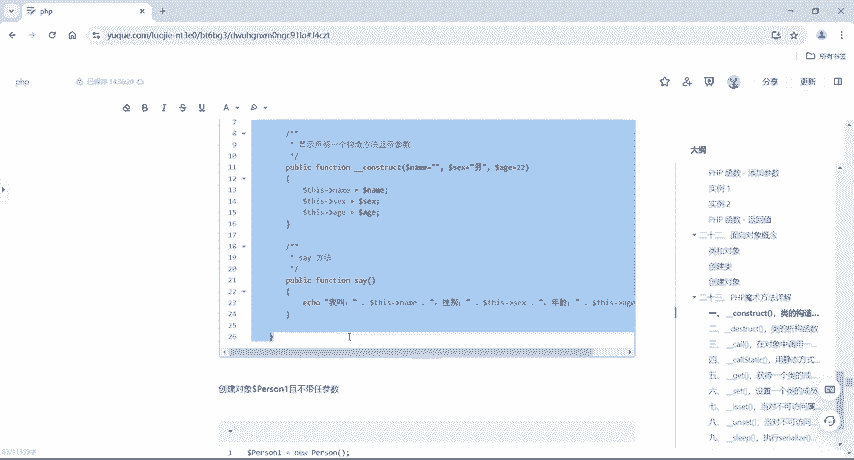

demo10。啊，11啊，好，我把它粘贴过来。好，那么粘贴过来，我们来分析一下代码啊，所以这一章节呢呃都是要跟大家来讲一下这个代码怎么去分析的啊。好，同样声明一个类class po啊。😊。

里面有name，有age，有six3个啊，三个属性，对不对？好，然后呢在这个里面啊显示声明一个构造方法且带参数。好，因为我在这个地方已经写了。我刚才在前面这个地方有没有写呢？是不是没有写构造方法。

没有写这个construct模术方法，对不对？那么我们如果没有显示的写出来的话呢，它默认我们在new对象的时候，默认也是触发了这个构造方法，只不过呢它里面是空啊。

所以说刚才在这个前面没有给它去写这个C这个方法的时候，它是打印出来是个空的啊，这个就是它的原因。好，那么我们现在在这个地方显示声明的一个构造方法，且是带参数的。我可以把这个参数初始化，在这个括号里面。

哎，name等于空six等于难H等于22。随便。啊，都可以去写。啊，这个是我们默认的。当我们六完这个poson这个对象的话呢，它就有了三个参数。只不过呢name是空啊，six呢是蓝age是22。好。

具体怎么做的呢？我们在这里面写了个C啊，方形我叫this name性别s six年龄呢this age好，当我们打印说出这个name的时候，还有six的时候，还有age这三个属性的时候呢。

它会直接把这个构造方法里面的参数给它打印出来。这它对直接对这个参数赋值了啊，明白吧？哎这是对参数赋值，这个是没有复值的。我们在construct里面给这个参数三个参数复值复值之后，具体怎么去调用。

我们在6对象的时候会自动触发。好，怎么去调用呢？我们接下来在这个里面啊，在这个后面这是属于class person的啊，看一下。😊，在这个poson外面啊，给它 new一个poson啊。

P加给它来一个new哎poson。好了，你完poson之后呢，我们就直接e一下啊，echo dollar person，然后怎么的。😊，调用这个C方法就行了。好吧。好，那接下来我们运行一下啊，来仔细看。

我们刚才说了啊，就是当调用这个C，它就会直接把name six和8打印出来。那么这个在哪里附的值，这个在construct。😊，构造方法里面修复了值，好，这是name是空啊，性别是难，A是22。

我们来看一下打印输出结果。那我叫空的对吧？性别男，年龄22。好，这个呢就是construct函数。😊。

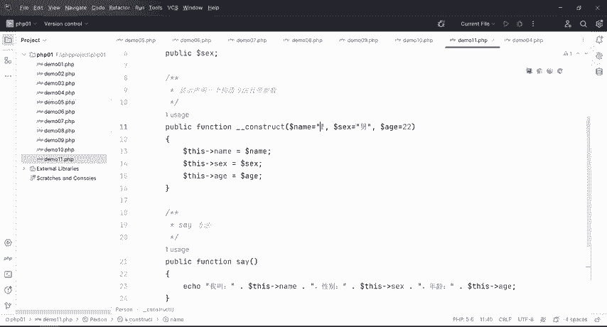

这里也有啊，那么第二个呢，我们就创建对象2啊，怎么去创呢？我们就直接在这里面创。好，我们除了在创建对象的时候啊，这个是什么呢？这个是默认会调用啊，也就是说我现在把这个给它注释掉啊，给它注释掉之后。

它默认有一个隐藏式的啊，有一个隐藏式的construct，在这个里头只是参数是空的啊，我们在这个里面所以说也能直接不复值。好，但是呢我们在这个地方啊显现的出来啊，就是显示声明的。

那么我我们如果在这个地方把它显示声明了之后啊，那我们接下来除了我们可以不给它参数，也可以给它。😊。

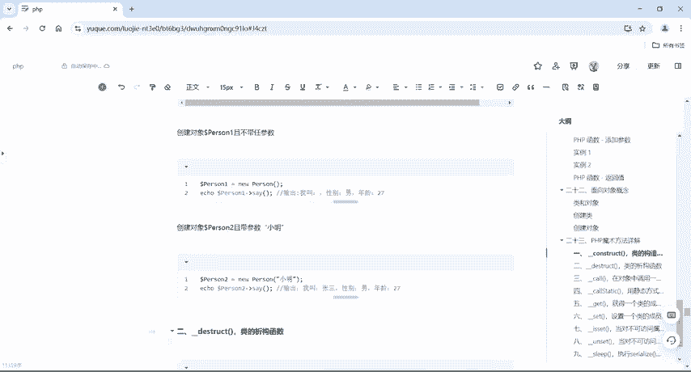

参数啊，给他来1个P21好吧。好，你就这样吧，给他来一个P21，这个要改啊，一然后二等于new person。好，我可以直接在这个里面看一下，它有提示了啊，可以在这个括号里面给它三个参数。

一个参数是name，一个six，一个是age，我现在给他来一个小明。好吧，好，那我第二个参数我就不给了。因为我们第二个参数跟第三个参数，在construct里面是给过的，对不对？好，默认的。

我们就把这个名字改成小明，再来一个dollar person2。然后。😊，费。就行了啊，就可以了。那么ac加又不加，其实都无所谓啊，在这个地方，因为它没有return啊，没有return。好，看一下。

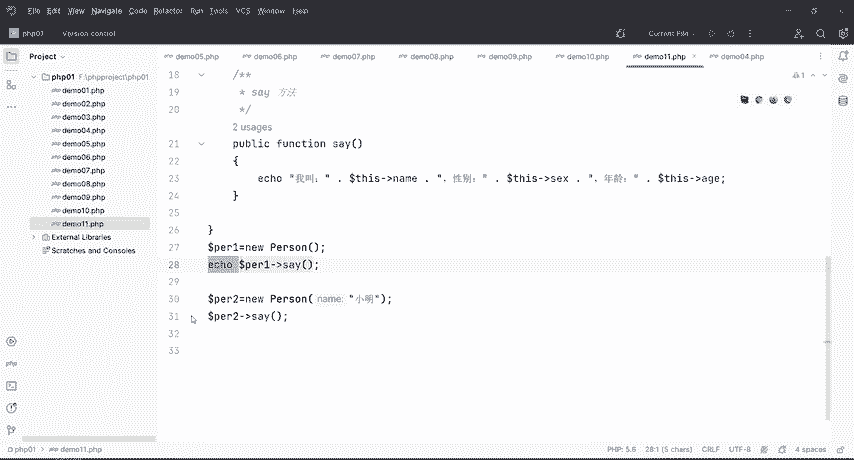

是不是我叫小明，性别，男，年龄22，对吧？好，那也就是说我们这个construct啊 constructstruct函数，我又可以无餐啊，又可以有餐，也可以什么呢？

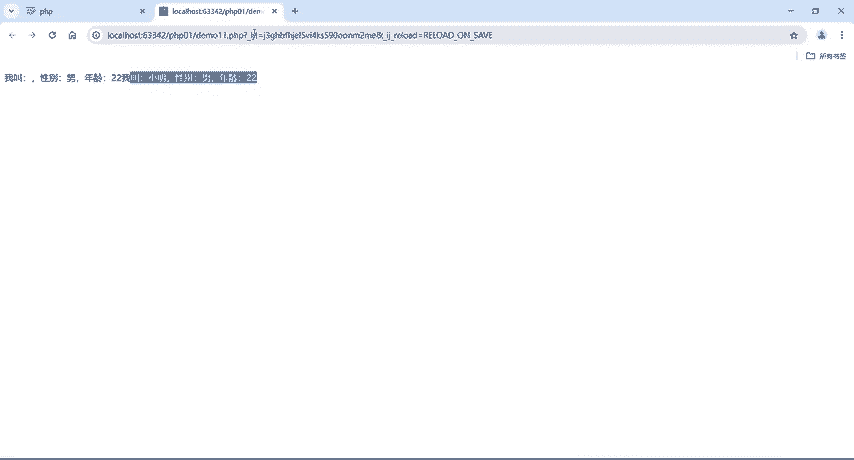

一个参数也可以，两个参数也可以，三个参数啊都是一样的。具体呢是。在于这里，你给他定义了多少个参数？我定义三个，哎，我在创建对象的守位可以给他3个。也可以不给我不给的话呢。

默认就执行construct里面的这个值。好，这个是我们的构造方法啊构造方法。那么接下来再给大家去讲一下我们的析构函数。那么虚构函数啊，我们回到笔记里面来看一下虚构函数是我们的distruct。

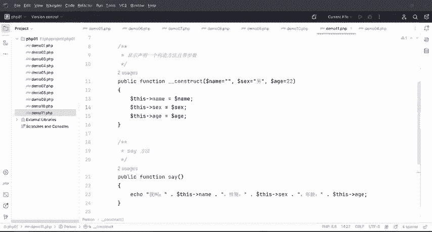

刚才是我们的构造，这个呢是我们的析构。那么通过上面的讲解呢，我们已经知道了什么叫构造方法，对吧？那我们构造方法对应的啊就是我们的析构方法，析构方法呢允许在销毁一个类之前执行的一些操作或完成一些功能。

比如说关闭文件释放结果集等等啊，虚构方法是PHP5才引进的新内容。那它与构造方法它的比较啊类似，它是以两个下划线开始。然后叫destruct好，那么虚构方法的声明格式也是一样的啊也是一样的。

所有的方法跟我们函数就是虚构方法，构造方法去声明啊，我们的魔术方法声明，就是跟我们的函数声明是一样的。😊，函数方法是一样的啊，只不过在前面多了两个杠啊，这个后面我们就不说了啊，呃，知道它怎么定义就行了。

那么具体的西构函数呢，它是不能带有任何参数的。😊，好，那怎么去做啊？啊，这里有我直接在这个后面呢给它加上一个吸构方法。

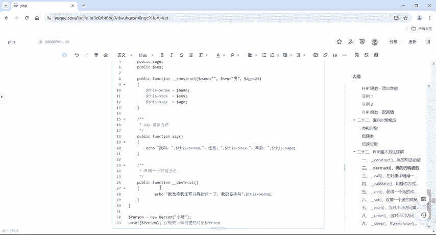

好，在哪一家呢，在这里。好，C加在这个类类里头啊，声明一个析构方法，对不对？好，那么这个析构方法刚才说了，在销毁一个类之前执行的操作啊，我这个类销毁对吧，用完之后销毁，那么销毁之后呢。

哎我觉得我还可以再抢究一下我的名字叫什么？好，那我们现在直接。😊，把这个啊给它注释掉。把这个注持掉啊，那么注释怎么注射的？😊，权重啊。controrl代写杠。这是单行注释。

那么conttrol shift加斜t，这是多行注释啊。他在前面讲过的，是不是？把他。我在这里面有个小名，是不是好C好。😊。

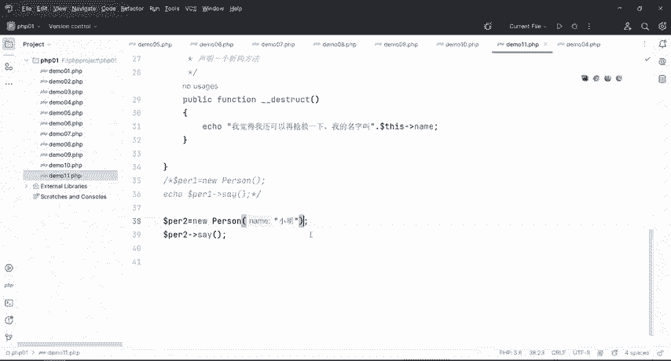

喂，小明，男，22，我觉得我还可以再抢调一下。😊，对吧我的名字叫小明。所我们在这个destruct析构方法的时候啊，就是销毁一个类之前啊，它就会自动触发这个destruct。这个是虚构方法。好。

那我们这个construct构造方法哎，构造函数，还有我们这个distruct虚构函数啊，就讲到这里。

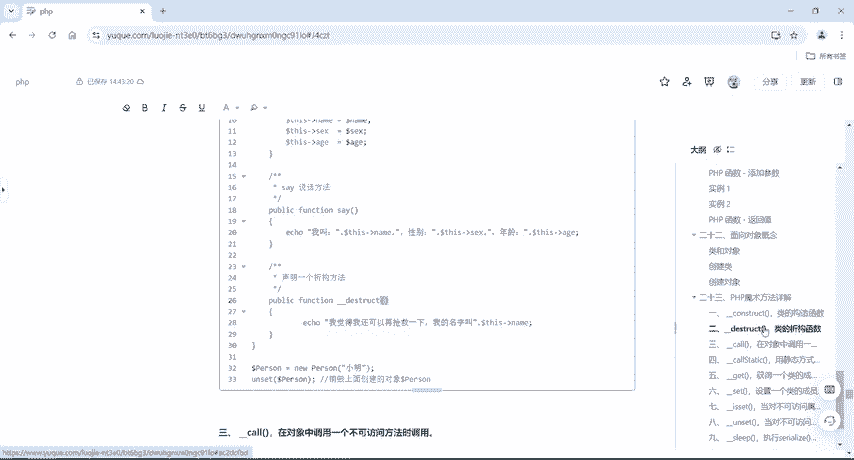