# B站首推！建议所有想参加CTF夺旗赛的同学，死磕这条视频，2024年字节大佬花一周时间整理的CTF入门保姆级教程！从入门到入狱（web渗透／PHP基／SQL注） - P14：14、魔术方法之call及callstatic - CTF入门教学 - BV1JjeJeYE2p

好，那我们接下来看一下这个core啊，co尔函数。那么co呢在我们PHP对象中调用一个不可访问方法的时候，就会调用。好，把这个简单理解一下。对象中调用一个不可访问的方法时候调用。

也就是说当我们访问这个方法是不可访问的，也就不是公开的对吧？哎它就会自动触发这个co啊但是呢一定要声明啊，如果说不声明这co的话呢，它就会报错。其实PHP当中这个魔术方法只是为了呃不让程序报错啊。

而提供出来的。而该方法呢有两个参数，第一个参数是f name会自动接受不存在的方法名。第二个呢 argumentsguments啊则以数组的方式接受不存在的方法的多个参数好，乱七八糟，对不对？😊。

我们来。看啊直接看案例。好，这里面有。😊，它的格式啊不说了，那面有方发题。那么具体它的作用就是为了避免当调用的方法不存在产生错误。那么说白了，那就是为了程序报错啊，导致。这个程序终止对不对？

但是我们又不想让这个程序终止就可以直接使用这个括方法来避免。啊，然后呢它在调用不存在的时候会调用core程序仍会继续执行下去啊，这是core的方法的作用。那么具体的怎么玩呢？

我们在这个里面把它ctrZ啊。

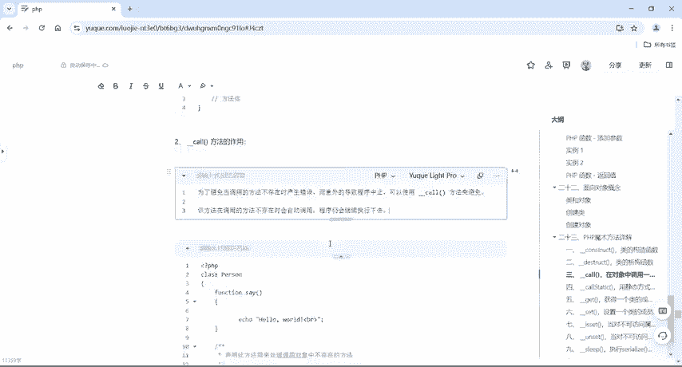

快速一点，我们右键另1个PHPPR取个名字叫demo12。好，把它粘贴到里面来。我们仔细看啊。😊，他是。调用不存在的。是吧就是不可访问的方法，也就就我这个方法没有的话，我直接调用一个莫名其妙的方法。

它就会自动触发。好，那这里有没有发个信 say啊，ic call hello what。😊，然后呢，这里面提供了一个co，对不对？好，声明词方法用来处理调用对象中不存在的方法。好，这里面就只这么写啊。

就不用管它里面写什么，就是所有的函数，它会把你的函数名给它打印出来，参数打印出来哎，不存在啊就可以了啊。我们只要仿正这个来就行了。好，关键一点啊，在它调用的时候看等于6 run teacher啥啥啥。

然后对不对？好，调用对象中不存在的方法，我这里面有没有run呢，没有吧？是不是？好，则自动调用对象对象中的一个co方法啊，对象中不存在我对象里面我这个poson这个类里面我只有一个C是不是？

但是我在这个外面我给它来一个run来个it在不在呢？不存在，是不是哎不存在的话，这个co这个方法呢就会自动的。😊，调用啊自动被调用，那具体的怎么用的呢？

运行一下你所调用的函数run不存在你所调用的函数it不存在。哎hello what因为我调用对了，调用什么呢？调用这个C对不对？那么这个C呢是真真正正存在的啊。

所以e一下hello word然后他会为了这个程序啊，就可以继续往上执行。是不是不是不报错了，对吧？哎，报错了的话，一般来说，如果说你不提供这个co方法呢，它就会直接报错啊。

所以说当年这个程序员呢在PHP里面为了让程序从上到下继续跑下去，它就提供了一个co方法。好，我们来演示一下啊，我打个比方没有co。😊。

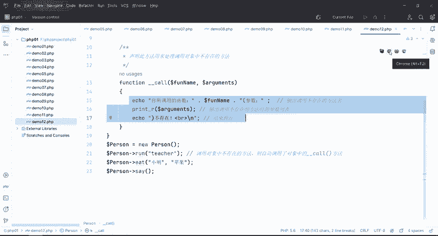

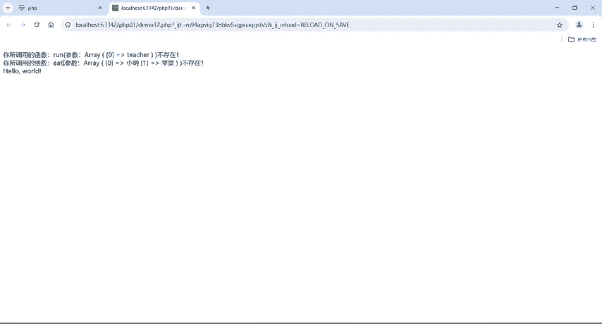

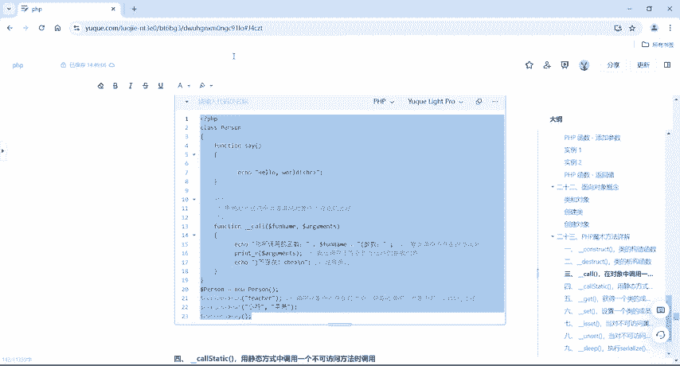

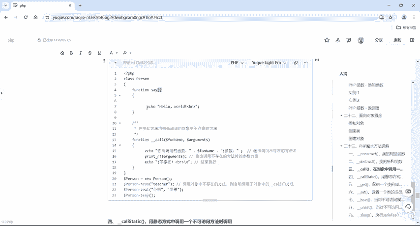

没有括的话呢，run it say好，我们来执行。

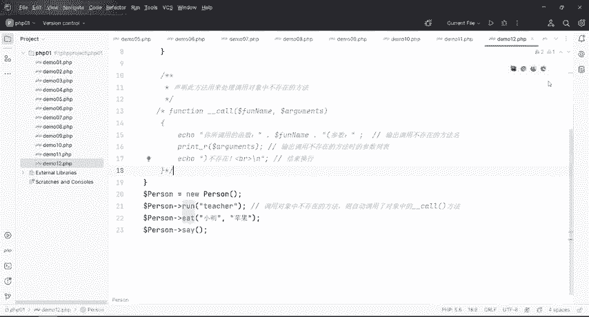

报错了吧，对不对？好core to under find method person run，它找不到这个呃方法啊，所以说呢唉。😊，为了避免报错啊，就是还是那句话，哎，为什么会有这个东西，对不对哎？😊。

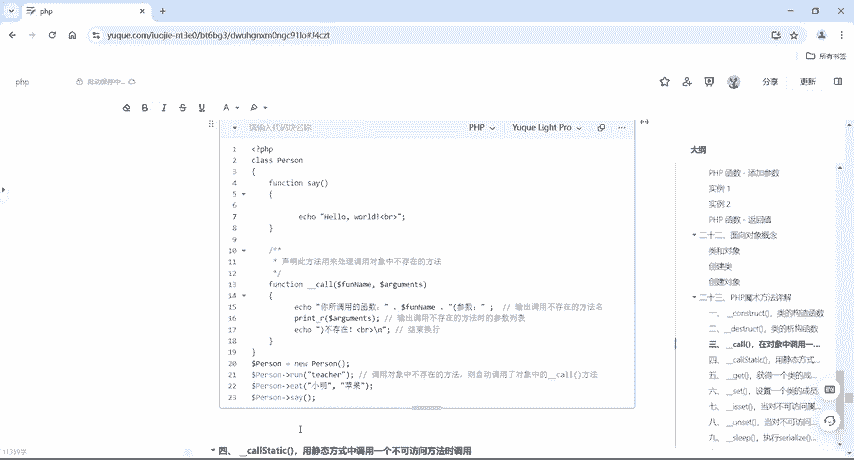

就是为了避免报错才把它提供出来的这个就是co尔在对象中调用一个不可访问的方法时调用。好，嗯，这是第三个啊，第三个魔术方法。那我们接下来回到第四个魔术方法。那么第四个模术方法呢？这叫co尔 static。

那么co static什么意思呢？就是调用静态方式中啊。

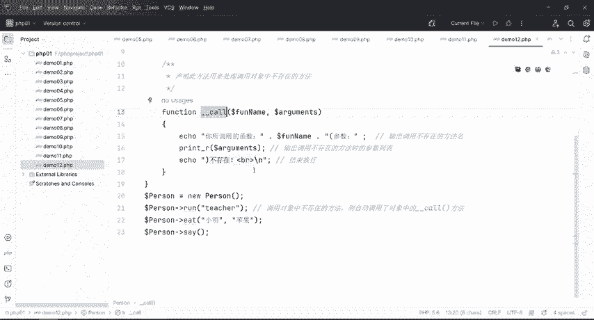

静态方式中调用不可访问的方法。那么静态方式什么意思啊？就是加上了一个t关键字嘛，对不对？好，那么括时后面它也是加了一个t关键字。那我们静态方式啊，静态方式也也是其实在静态方式中也是加了一个什么。

也也就加了一个t关键字。然后让这个从动态，对不对？从我们这个没有加take的。😊，加上一个stag，它就变成静态了啊。那具体怎么去用的？银行呢在这个里面。是不是。好，关键一点啊，我们来区分一下啊。

一定要区分啊，把这个给它拷贝一下。

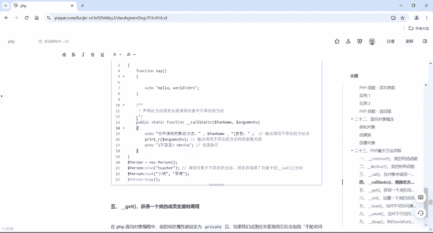

好，我们在这个里面是不是没有加静态，这个没有加静态的话，这个就不是静态方法。好吧。但是如果说你要使用这个co static的话呢，就要把这个方法变成静态的。也就是在这个方形后面加上一个t关键字。好。

那么具体怎么用？右键又1个PHP给它取个名字叫demo13。😊，好，把它拷贝过来。这里面加上一个public static啊方个性什么什么什么，对吧？把它变成了static静态的一个方法啊，静态的一个。

方法方式啊精态的一个方式。也说可以把它简称为一个静态的一个函数啊，好吧，哎这么去理解啊，直接跟大家去说静态方式或者静态方法的话呢，可能就是听不太懂，那直接就把它理解为静态的一个函数定义。好吧。

我们再定义一个静态的函数的话，就直接在这个方法里面给它加上一个t。但是呢这个地方也有变啊，要把它变成cot，同样的也是一样的啊，为了避免报错。好。😊，但是关键一点，我们在调用这个不存在的方法的话呢。

如果是用静态的，要来触发这个co static关键字的话，对吧？触发这个魔术方法的话，我们要在这个里面把它换成两个冒号啊，来对比一波，在前面的话没有静态调用，我们就直接杠大于号。

这里呢加上了一个static，这里用cot，这个里面调用的话叫两个冒号啊，两个冒号，两个冒号调用之后，这两个都是不存在的，不存在哎，它就会触发这个cos static。

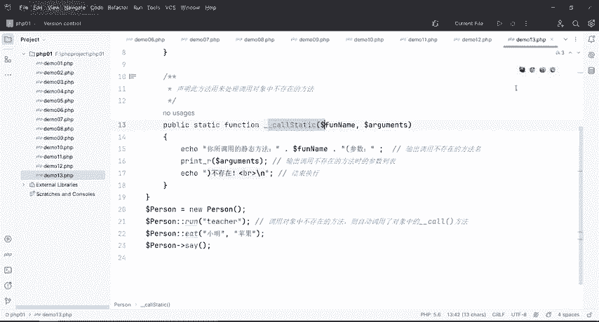

运行。可以吧？好，这个呢就是core与co static的使用方法。

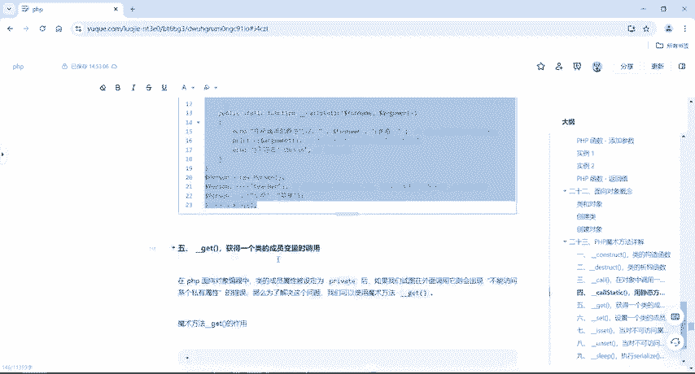