# B站首推！建议所有想参加CTF夺旗赛的同学，死磕这条视频，2024年字节大佬花一周时间整理的CTF入门保姆级教程！从入门到入狱（web渗透／PHP基／SQL注） - P15：15、魔术方法之set及get - CTF入门教学 - BV1JjeJeYE2p

好，接下来我们来看第五个魔术方法啊，第五个跟第六个魔术方法呢，一个是get，一个是set。刚才在前面我们在创建对象的时候啊，创建类和对象的时候，对不对？都见过啊，一个是st，一个是get。

但是在这个地方同样的在前面要有两个下划线，这个是它的魔术方法，那么get是获得一个类的成员变量的时候调用set呢是设置一个类的成员变量的时候调用。😊，好，在PHP面向对象编程当中。

当我这个类的成员属性被设置为private的时候，我们试图在外面调用它，则会出现不能访问某个私有属性的错误。那么为了解决这个问题，我们就可以使用魔术方法get。那么这个又来了一个啊，这是用来解决什么？

用来解决我们在外面访问这个private私有属性的时候报错。哎，我就可以说get啊，那么具体怎么做啊，同样的，我们在这里面也给大家提供了一个代码啊，我们把这个代码呢给它拷贝一下，右键new1个PHP。

😊。

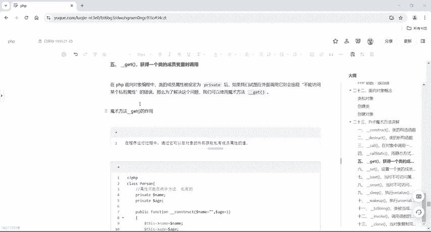

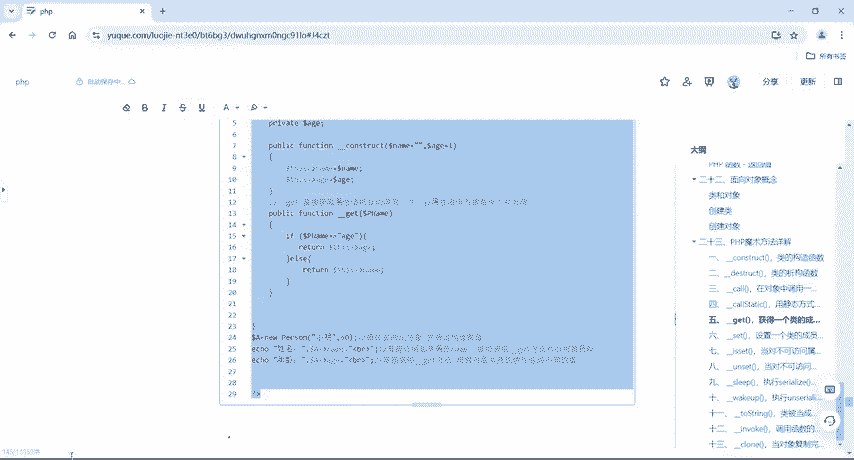

PHP14啊。好，把它ctrl V粘贴到这个里头来。😊，好，我们来分析一波啊，分析一下。好，同样的啊，我们为了避免报错，然后要写这个魔术方法。那也就是说我这个魔术方法呢一定要去声明的啊，一定要声明的。

好好，同样的啊，在这里面呢给它定义了两个属性。😊，但是呢两个属性跟前面不一样的，前面是public公共的公开的，对不对？但是变成了private呢是变成私有的了。那么私有的话呢，它只能在类的内部去调用。

那如果说我要在类外部去调用这个name或者是age的话呢，它就会报错，对不对？但是为了避免这个报错的话，我就直接在里面提供一个get。哎，这个魔术方法好。

这里面constructname等于空age等于1然后this name等于namethis age的 age是我们的构造方法。好，同样的在里面提供了一个get魔术方法。ifP name好。

得到了这个名字啊，这个参数。如果说它是年龄啊，我就返回年龄反反而之呢我就返回我们这个name啊，好，doll a等于6poson，给它来一个小明60，通过实例化对象，并通过构造去复值，对不对？然后呢。

直接去访问用A去点name a去点age，好了。😊。

我如果说不存在这个get的话啊，没有提供这个get来运行一下，报错了吧，是不是？好，为了避免它报错，我就干嘛呢？我就。

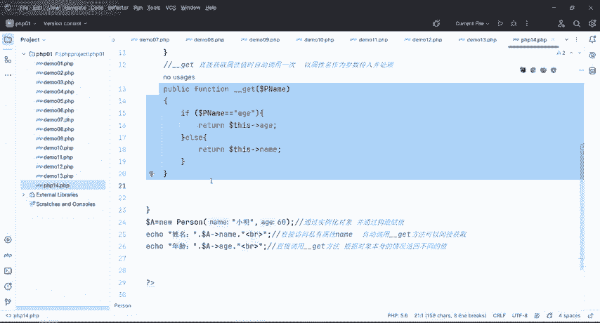

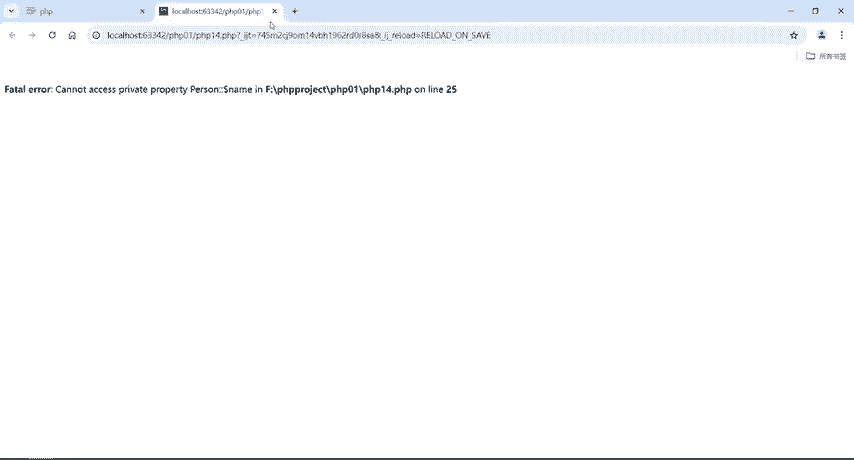

把这串啊。给他搞一下。还有所以说呢我们在调用这个。private私有的方法的时候，哎，就会触发这个get。一定要声明啊，如果说不声明get，刚才也给大家演示了啊，报错。这个是get。好。

那接下来我们再来看一下这个set啊，那么set的作用是什么呢？我们回到笔记里面来set它是设置啊，刚才是得到这个是设置，那设置一个类的成员变量的时候调用。那么set。😊。

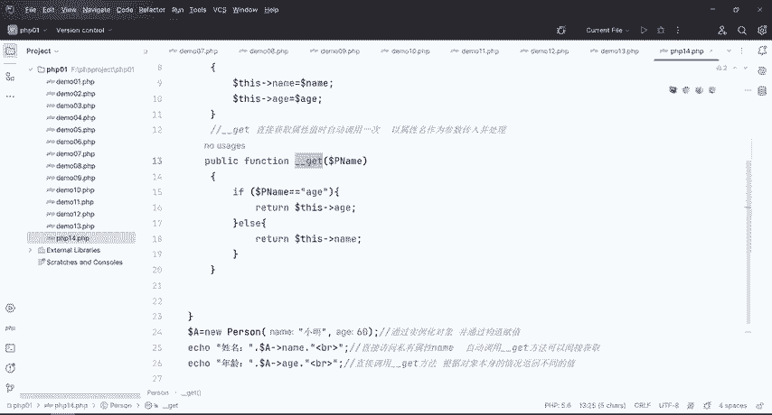

是用来设置私有属性的，当给一个未定义的属性去复制，此方法呢会被触发，传递的参数是被设置的属性名和值。好，那具体的我们同样的啊，这个里面也有啊，也有看到C然后回到里来右键右1个PHP表。

给它取个名字叫PHP152。好。

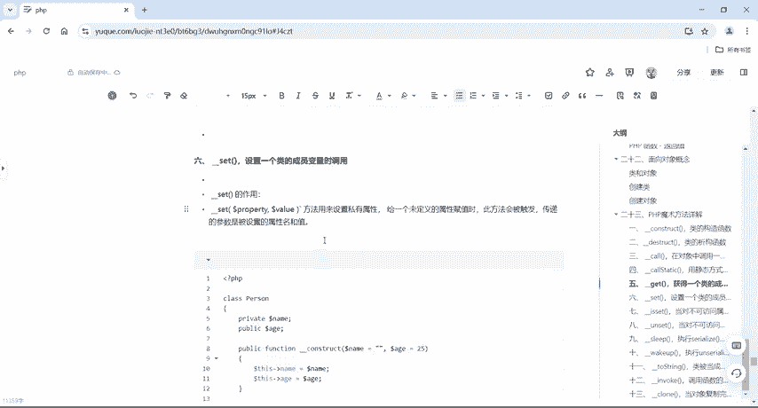

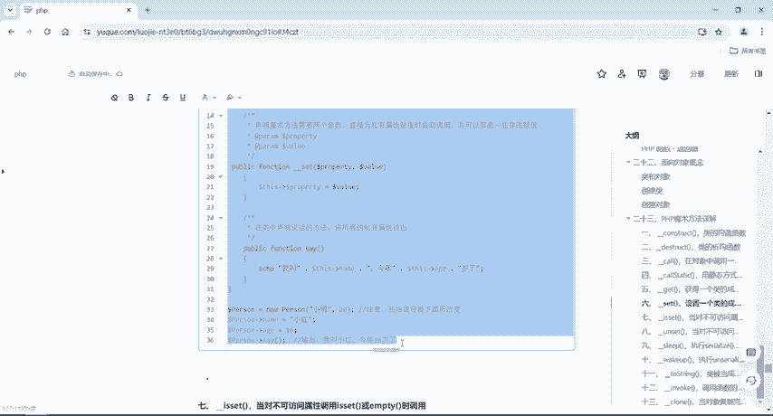

把它粘到这里来啊。好，唯一不一样的是啊我们在这个里头提供了一个set，对吧？好，这里。😊，我们的构造方法一样的啊好，一个是private，一个是public。那么这个name是私要的。好，我当在哪里呢？

在这个地方我给它。来了一个什么呢？来了个name，是不是又给它访问了一个age。好，我如果我没有这个set的情况下啊，我私自的去用对象啊，new了一个对象，对不对？

叫posonposon去调用这个name去给这个name去复值为小红啊，我们来看一下运行。

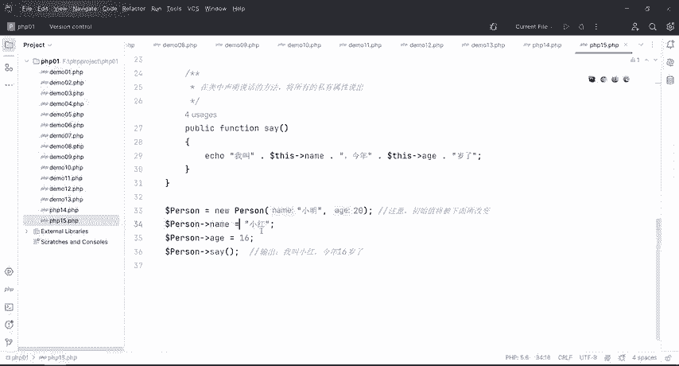

哎，报错了，是不是？他说不能去声明，哎，去调用private这个方法。哎，person name。所以说。

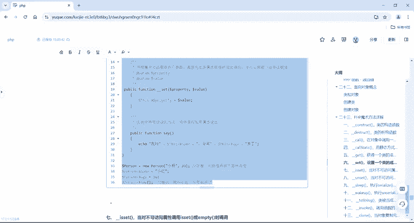

是不是就直接报错啦？但是我如果说在这个地方把它给它注释掉了，把它给它注释掉了之后再来运行一下。哎，我叫小明，今年16岁了，是不是没有报错，对不对？但具体的它是什么样的内容呢？我在这个里面。

我没有通过我们这个对象去调用私有的变量名，私有的属性名的话呢，它是不会报错的。但是我一旦去调用了私有的属性，它就会报错。但是为了避免报错呢？我就可以在这里给他提供一个etet魔术方法。好。

这个就是get和set的一个用法。

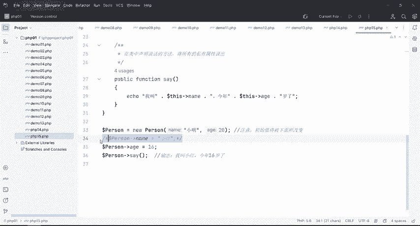

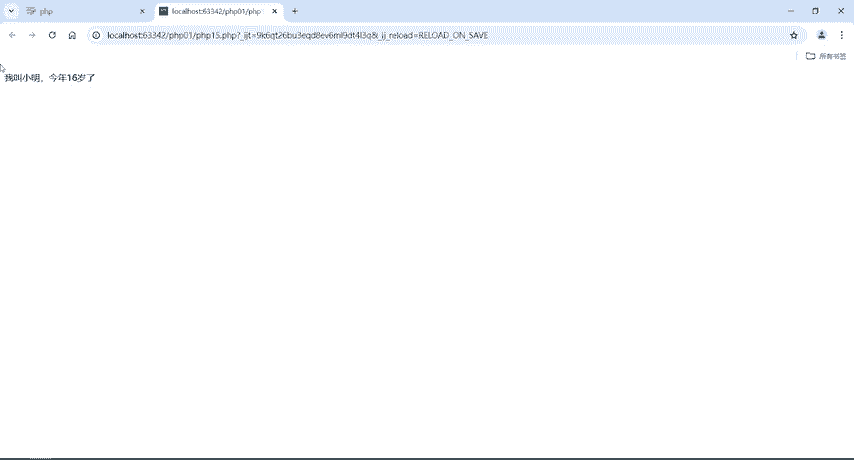

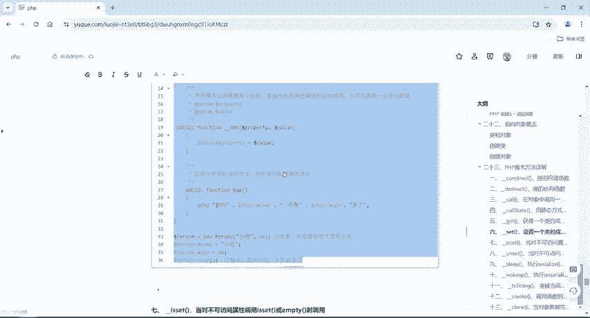

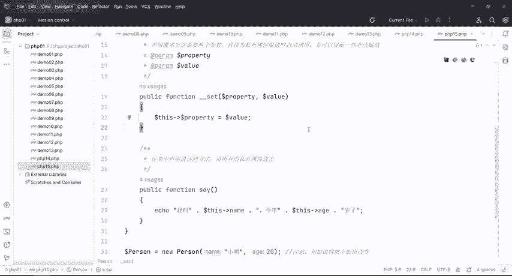