# B站首推！建议所有想参加CTF夺旗赛的同学，死磕这条视频，2024年字节大佬花一周时间整理的CTF入门保姆级教程！从入门到入狱（web渗透／PHP基／SQL注） - P16：16、魔术方法之isset()及unset() - CTF入门教学 - BV1JjeJeYE2p

好，接下来我们来到第七个啊，第七个呢是我们的eaet啊，第八个呢是我们的unet啊，这里笔记啊都是在这个地方写的都很清楚啊。好吧，还是一样的。我们如果说要拿笔记啊，拿资料啊，包括一些工具啊，对吧？

软件呢全部都可以在评论区联系我，或者是直接在评论区自取就可以了。好，eaet当对不可访问属性调用eaet跟empput的时候调用。好，这个eaet跟这个iset不一样的是这个是魔术方法。

这个呢是普通的函数，好吧，哎，普通的方法啊。好，这个是它的作用啊。啊E set啊ea set啊，这里呢可能。就写得有点那个了啊，就直接就把它嗯理解成什么呢？我们如果是在访问啊不可访问的属性。

就对不可访问的属性的时候，调用E set或者put的时候，E set会自动会被调用啊，还是一模一样的，就说白了就是一定要区分。哎，一个是不可访问，一个是可访问，对不对啊。

这个是对不可访问的属性调用es set或者是空啊，他说这个E set模式方法就会被调用啊，所以这个两个一定要区分开啊，如果不区分开的话，可能就难以理解了。啊，同样的啊，这里有代码。

这个代码呢我们来看一看啊。

卡车C。怀这了。右键。dmo16。好，把它粘到这里来啊，粘这里来。那我们简单单来分析一下啊，这个大码有点多啊有点多。😊，好。我们先这样子吧嗯。在里面是是有个public。privaate。

两个private一个public，对不对？好，那么six它是public的。我现在name跟age啊。那么跟age呢它是我们的私有的属性，对不对？好，那么刚才说了E是干嘛的？

ea就是当对不可访问的属性来调用，不可访问属性是谁，是不是这两个。那么这两个如果说我们要调用或者是的时候，哎，我们这个魔术方法就会自动调用啊，自动调用好，当在外呃类的外部时候。

E函数测定私有成员connect时候自动调用。我们可以在外部用E去测定啊，测定它的一个函数，测定它的私有成员。那么具体怎么测定的啊，我们把这个先注示掉。😊，然后把这个先展开啊先展开。好，刚才说了啊。

这个ss呢是什么？sigs是public啊，我们来看一下，先把这个先出示掉。😊，eaet啊调用的E set就测试。好，我们初始复制，我们复制一个小明，25是女，原来呢是空25男，对不对？好，运行一步啊。

看一下。😊，哎，看一下啊，看一看在哪里。我们这个使用这个吧。

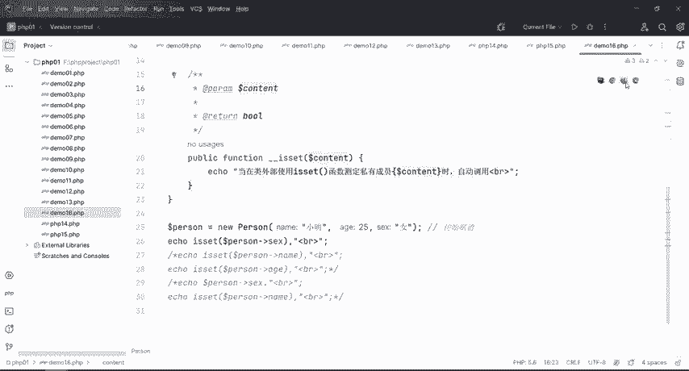

好。这个是一对不对？那么这个是一。

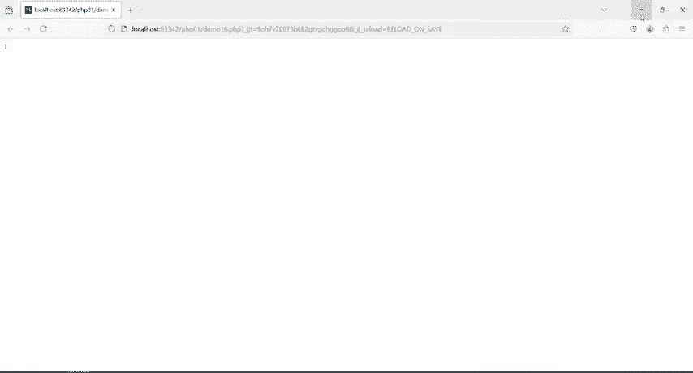

是可以的吧，没有报错吧，对不对？去测定，就是我们要使用这个E set，它主要是干嘛的呢？主要是测定对象里面的成员是否被设定可不可以用它它返回一个一，就代表我这个six，它是可以用的对吧？

但是回到这一来啊回到这里来。

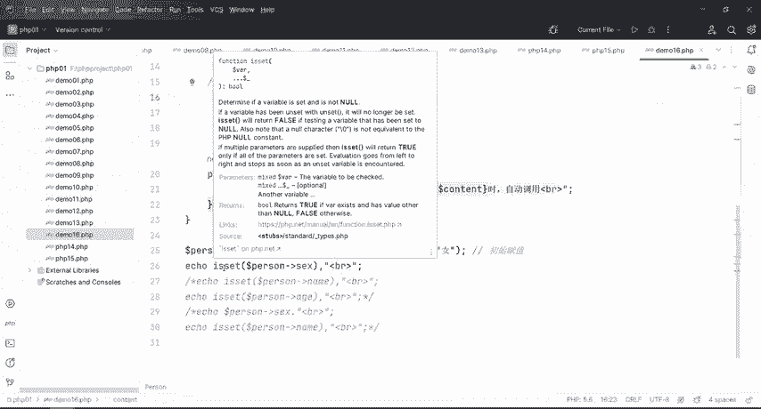

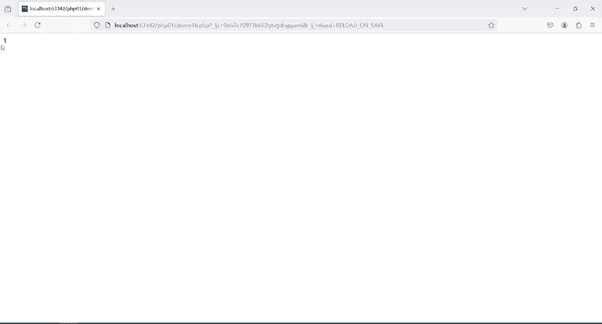

我这个再来测定这个name或者是age，它能不能用，是不是啊哎，能用吗？不知道我们来测定一步。😊，运行啊，哎呀有点慢啊。

呀呀关闭一下。好。是不是有了？当在外部使用inet测定私有成序name的时候，自动调用了什么inad吧。哎，测定了私有成序A则的时候，自动调用了吧。但如果说呢你在这里测定了之后，哎。

我这里没有提供inet，同样的啊也会报错。😊。

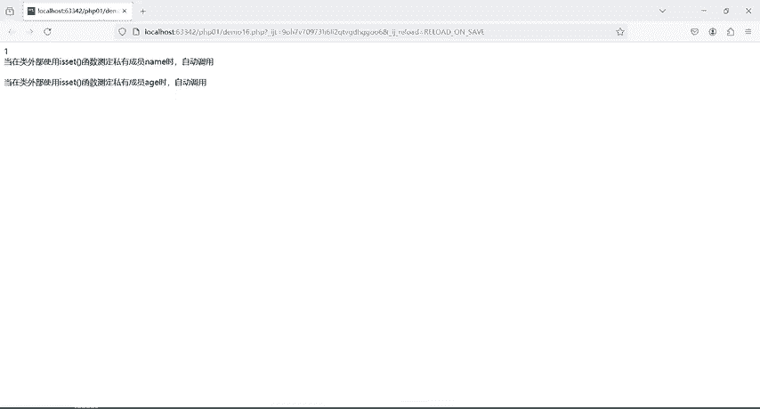

这个就是inset。好，那么嗯iset它是分两种情况啊，两种情况。一个就是如果对象里面的成员是公有的，这都是public，对吧？我们就直接使用这个函数来测定成员的一个属性。但如果是私有的啊。

这个是pri是私有的。那么这个函数它就不起作用的啊，知道吧？这个函数就不起作用的，所以说呢在外部它是不可见的，什么意思啊？priva它是私有的，我在类外部是防不到的，所以说在类的外部用 set呢。

它是检测不到的啊，检测不到，那怎么去让它检测到呢，怎么让它去不报错呢，对不对？哎，我们就在这个里面提供一个iset模式方法就可以了。好。😊。

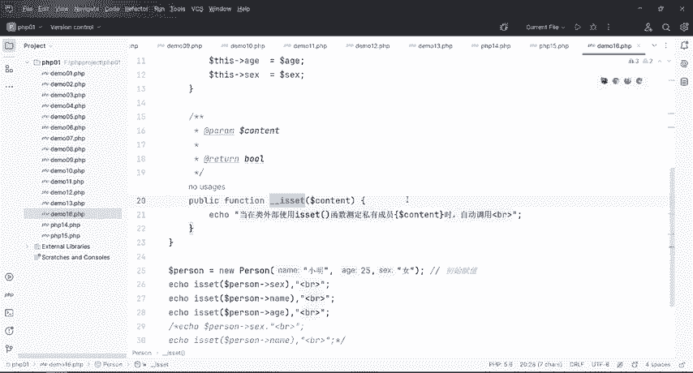

那接下来我们再来看一下这个unet啊。unet呢就是当对不可访问属性电用unet的这个作用的时候啊，直接调用unet括号的时候被电用，所以这个也是一样的，特别是在PHP里面啊。

特别是跟这个onset这两个魔术方法跟这个方法对吧？跟这个普通的函数一定要区分开啊，一个是有效划性，一个是没有下划性的，所以这个玩意呃就比较容易搞混啊。好，那么具体的也是一样的。

如果一个对象里面的成员属性是公有的，就可以使用这个函数在外面删除对象的公有属性，对吧？如果是对象成员属性是私有的那只用这个函数呢，就没有权限去删除好，那具体的怎么做啊，同样t。😊。

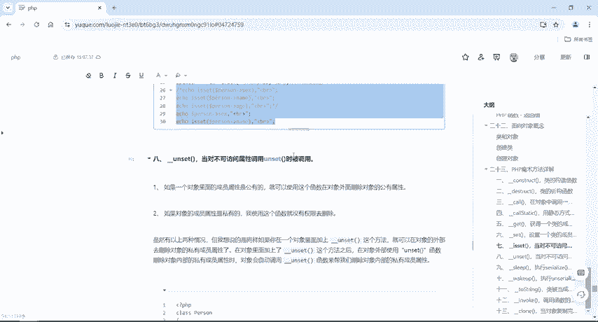

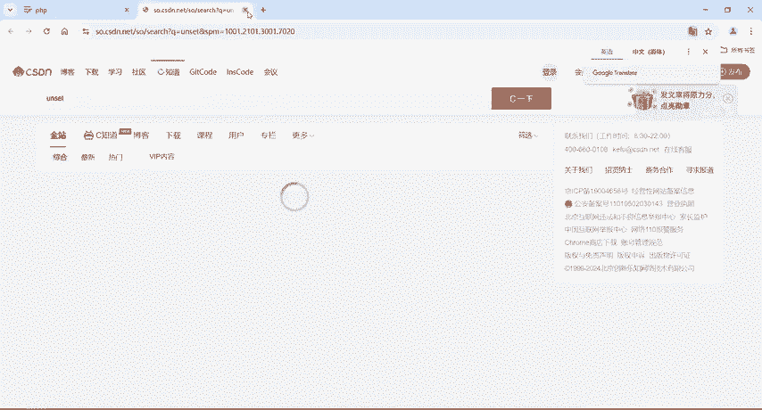

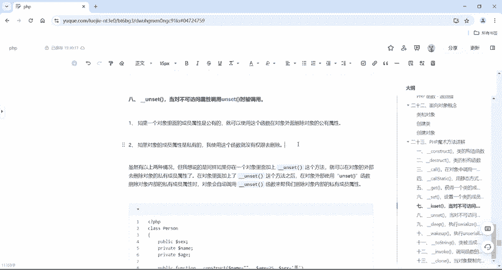

我们来分析一波啊分析一波好，右键又1个这个PHPfi给它取个名字，PHP16啊，把它粘过来。

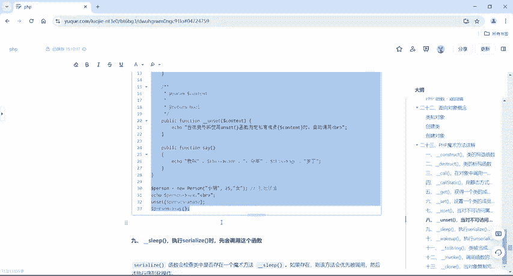

这里面有成员，一个是public，两个pri一模一样的。但是关键一点啊，这里面变成了unet，对不对？好，关键一点啊，在这里我给他初始复职小名2五女一点问题都没有。six呢six在这个地方看一下。

是public是完全没问题的。那如果如果说在这个里面，我要来用on set去把这个name给它去搞掉，什么意思啊？😊。

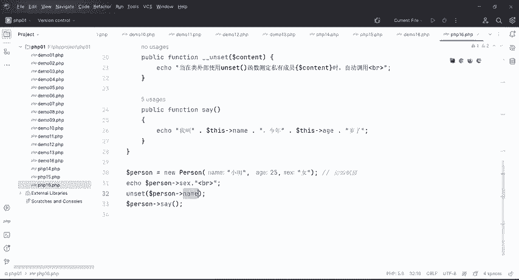

来。我在对象外面去访问这个name是不可访问的属性吧。然后呢，用这个un set的时候，哎，我使用这个函数，我想去删除对象的公有属性，我是可以去删。但是我操作的是私有的那我这个函数呢就没有权限去删除。

那没有没有这个权限去删除这个name的私有属性的话，那这个onset它就会自动被触发。好，来运行一下。

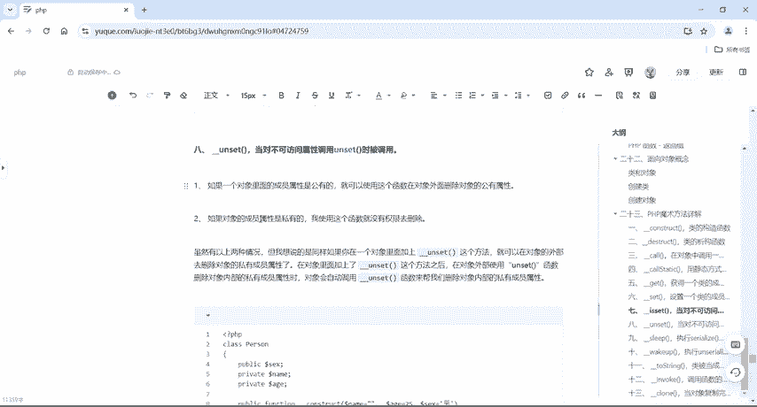

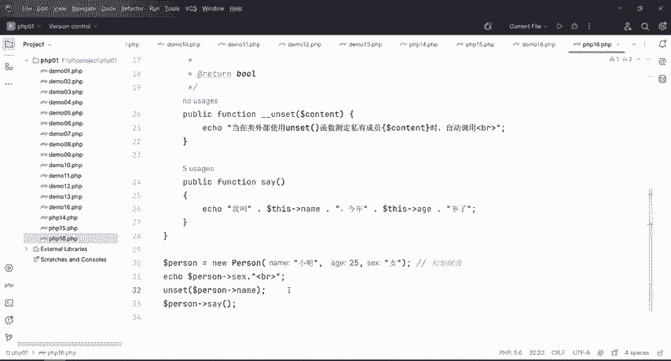

是不有啦。女对吧？当在类的外部使用unet测定私有成员name幕的时候自动调用。哎，我叫小明，今年25岁了。同样呢他打印出来是这个小明25岁，性别是女啊，识别是女的话，这个是因为是public。

这个是private，我再用onset去调用private这个属性的时候，哎，他就会自动触发。那如果说同样不提供unet啊，在这里使用onset这个方法去取消他的嗯私有属性，对吧？哎，删除他的。😊。

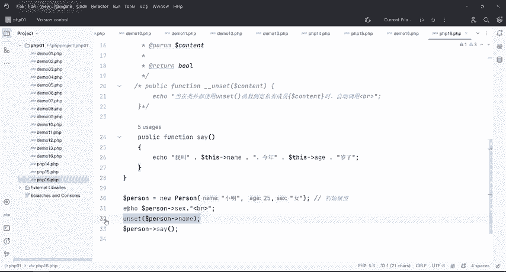

这个数形怎么怎么去删啊，一行一步刷新报错了，对不对？哎，删不掉啊，删不掉啊，这个就是unet的一个使用方法。unet跟unet那eaet呢跟eaet，这个两个是一对一的啊，一个一个要对上啊，这个就是。

😊。

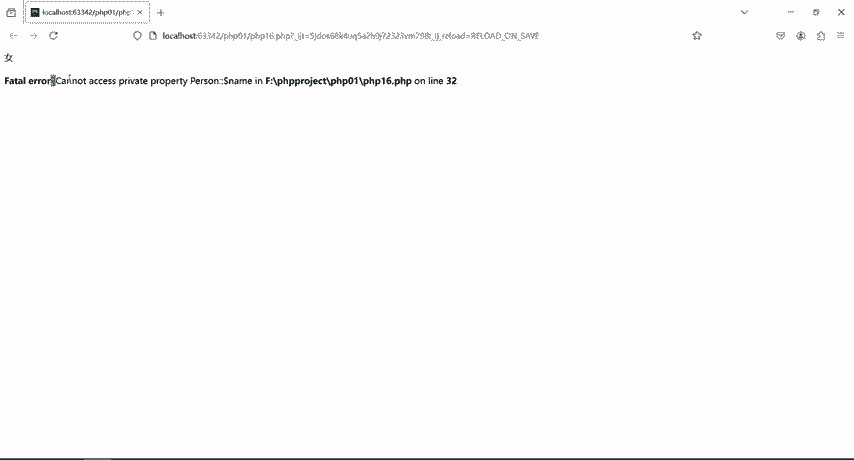

它的两个呃一个是呃isad啊，inide是不可访问属性调用isad的时候啊，这个是哎。2个16嘛，看一下啊。Yeah。一个unet对吧？一个unet这个呢是eaet。啊，不管它啊。

incept的当内外部时incept或者是这个。empput的时候啊，它就会自动触发。但是unet呢就是当外部使用unet函数测定私有成员的时候自动调用。如果说你不提供啊，它也是同样会爆错的。好，嗯。

这个就是他们两个之间的区别啊。😊。

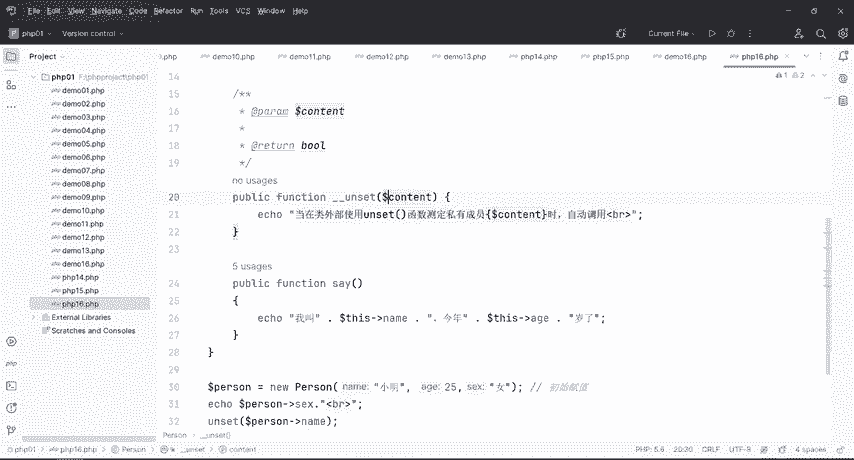