# B站首推！建议所有想参加CTF夺旗赛的同学，死磕这条视频，2024年字节大佬花一周时间整理的CTF入门保姆级教程！从入门到入狱（web渗透／PHP基／SQL注） - P17：17、魔术方法之sleep()wakeup()invke()clone() - CTF入门教学 - BV1JjeJeYE2p

啊，接下来呢就讲到这个PHP反序列化跟序列化里面的啊，一定要调用两个函数。第一个函数呢是sleep，sleep是休息的啊，就睡觉的意思，对吧？哎，那么我们在进行序列化函数的时候，就是serv。

会检查类中是否存在一个魔术方法叫sleep。如果它存在，则该方法呢会优先被调用，然后才能执行序列化操作。啊，这个是在序列化漏洞里面啊呃着重要理解的这部分。那么这个功能呢可以用于清理对象。

并返回一个包含对象中。应被序列化的变量名称的数组啊，如果说该方法没有返回内任何的内容的话啊，什么内容都没有啊，则让被序列化产生一个。这个什么eno。tick啊级别的一个错误啊，会产生一个严重的一个错误。

啊，那么sleep呢它是不能返回副类的自由成员名字的啊，这样做呢它会产生错误。所以说呢可以用这个s接口来替代啊。就是后面啊具体的呃讲序列化漏洞的时候啊，会用到这个。

但是我们首先还是得知道这个sleep它是关键是干嘛的啊。好，但是具体的一样的啊，来看一下这个代码同样的把这串代码给它拷贝啊拷贝一下。😊。

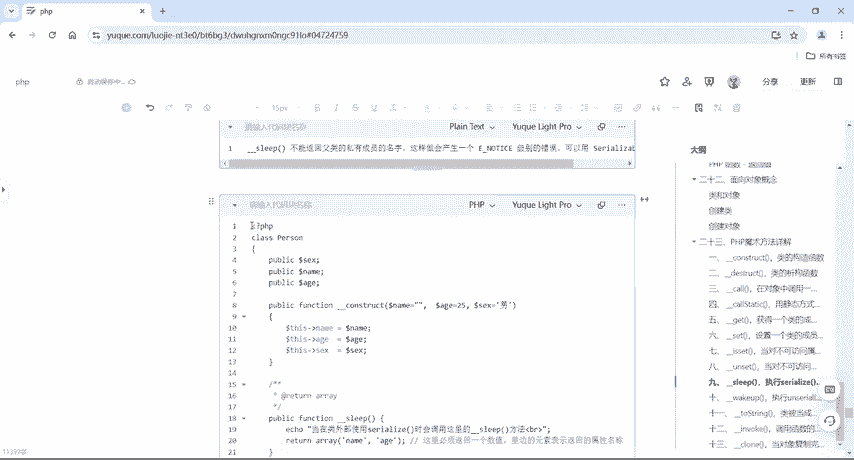

，放在这里头了。这是针对于序列化跟反序列化的啊好，这里面有一个sleep啊，那么当在内外部使用这个sve啊，序列化的时候，这里是为序列化这个对象呢啊它会去检查去检查里面有没有sleep这个方法。

如果说它里面检查到了存在这个sleep魔术方法的话呢，它优先会。😊，执行sleep里面的东西啊，然后再去执行后面的东西。好，那么具体的我们来运行一下啊。

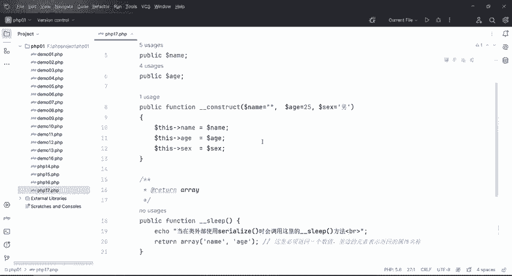

是不是有啦？😊，当类外部使用sless会调用这里方法，然后它会把我们这个poson给它实例化出来啊，给它序列化出来。序列化出来之后呢就这样结果啊，object啊poson是不是6个。

然后呢里面有两个参数，一个参数是name，一个参数是age，那么age是in类型的对吧？哎，25C，然后呢name呢是t类型的。ABC。同样是三个啊三个，这个是我们这个sleep啊，这个是sleep。

那笔记上具体怎么写的呢？就是当li外部使用slate会调用sleep方法。那如果说你没有sleep的话呢，怎么办？

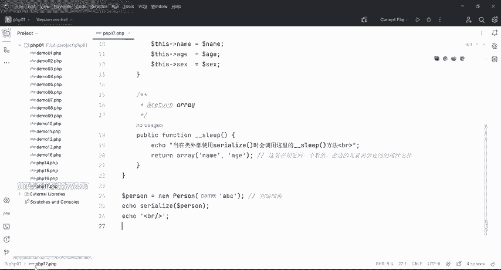

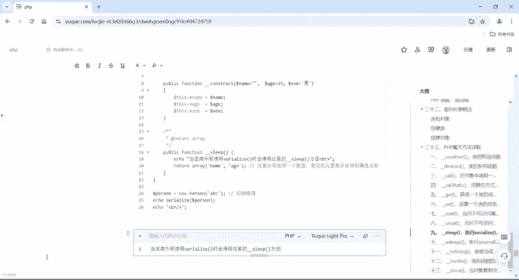

我进行一个序列化的话。

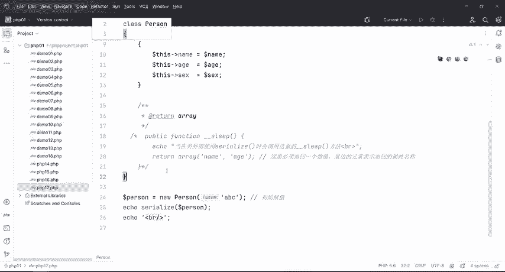

是吧哎，运行。是不是直接把这个。给我序列化出来了，就当前这个poson给他直接序列化出来了。😊，OK好。

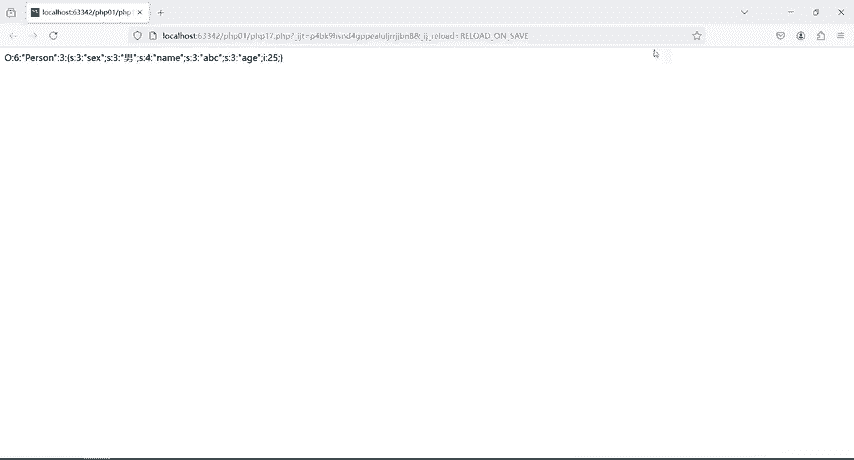

这个里面啊一般来说后面如果说学到这个序列化反序列化漏洞的话呢，一般啊代码里面去进行代码分析的话，都会有这个sleep啊。所以说它是一个先一个后啊，如果说你不存在，它就直接执行这个序列化之后的。

如果说你存在这个sleep这个这个魔术方法的话呢，它优先会打印这里面的东西，优先会执行sleep魔术方法，这里面东西哈，这是sleep。😊，然后呢再往下走啊，那sleep它是经常用于提交啊。

没有提交的一个数据啊或类似清理的一个操作。同时呢如果说有一些很大的对象不需要全部保存的话呢，这个功能就可以用啊，就可以非常的呃方便。好吧。好，那么除了sleep之外呢。

我们接下来还有这个wake up有睡觉就有起床，对不对？wake up就是起床的意思。那么这个是执行什么呢？这执行我们这个反序列化的所以说sep是白的那wake up这是黑的是不是？

那么刚才是在上面执行s这个是序列化。那么这个呢是执行un就是行反序列化了啊，反序列化的时候会优先调用wake up函数啊，与之相反，呢un会检查是否有一个wake up方法。

如果存在优先调用 wakeake up方法，预先准备对象需要的一个资源，同样的，我们来看一看。😊。

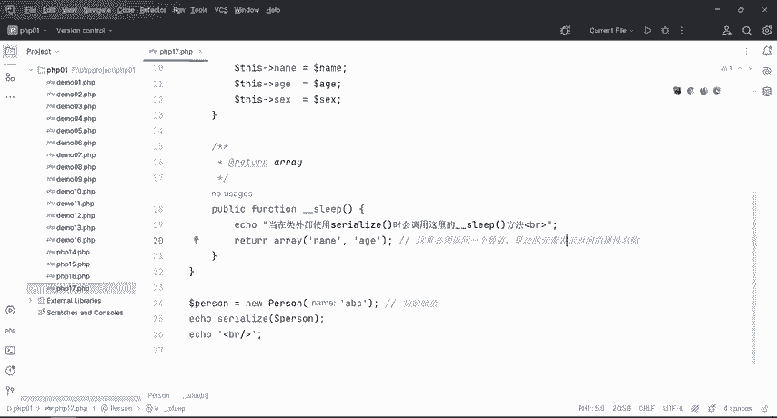

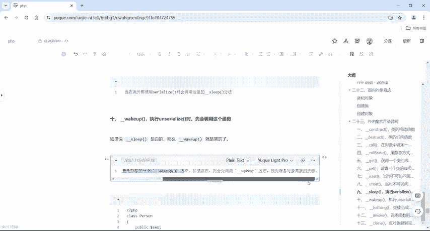

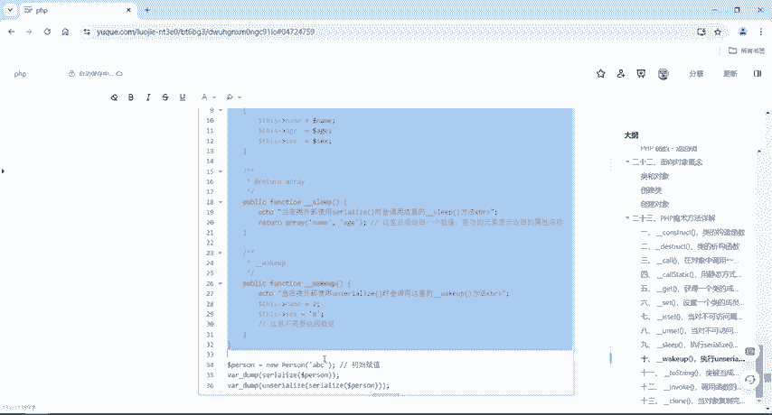

把这个东西给它看出C啊，回这里了。😊，右键你1个PHP file，给它取个名字。PHB18好，把它粘过来。啊，这里面有sleep对吧？也有weakeup啊，一般来说呢。

sleep跟 wakeake up都是基本上同时使用的啊，因为同时是会有这个序列化跟反序列化的。嗯，什么意思呢？就是说如果说我要对一个对象进行反序列化的话呢。

那之前肯定要先对它先嘛先序列化序列化之后才能反序列化，对不对？以一定要搞清楚这个逻辑啊，然在这个代码里面呢存在sep跟wake up两个魔手方法好，在这个里面是不是有一个s先给它序列化，那么序列化之后。

我们再给它进行反序列化就行了啊，这不知道能不能看得懂啊，这句话是给它进行序列化，那跟这里面是一样的。序列化之后我再给它un同样的会触发sep跟 wakeake up。😊。

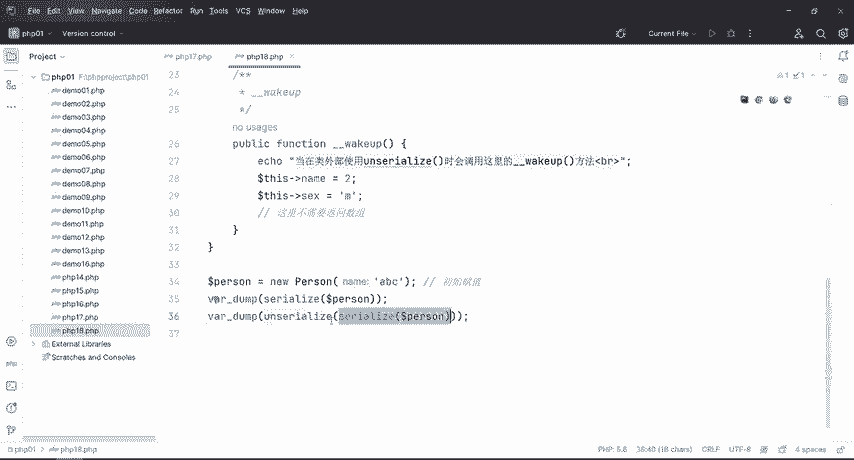

首先是对我们这个类啊对象进行一个序列化。序列化呢它会优先调用sleep方法，然后把序列化的结果返回给我们。啊，然后再来。我们在调用这个反序列化的时候，会直接执行wake up里面的方法。

然后把进行反序列化之后的结果再给我们返回出来。啊，这是反序列化之后结果，这是序列化之后的结果好，同样的它会以这个格式啊，所以说那six string啊name。😊，interH啊25是吧？就可以了。好。

这个就是sleep与wake up的。

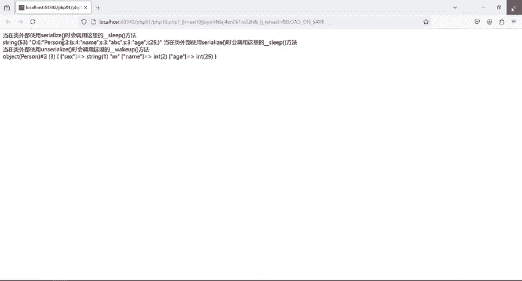

魔术方法。好，那接下来我再往下走啊。😊。

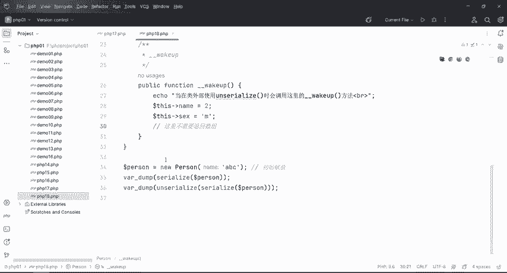

还有一个第11个呢就是我们的一个toth string啊to string呢就是我们一般来说类会被当成字符串的时候回应的方法叫toth string我们也把这个类呢把它输出为字符串那如何去把这个类变成字符串就直接调用这个to string那么t string方法呢用于某一个类啊被当成字符串的时候回应。

比如说e object应该显示什么呢？哎，不知道是那么该方法必须返回一个字符串啊，否则又是一个致命的错误。那么不能在to当中抛出一常啊，也是同样的啊，都是一样的。

就是里面的魔术方为什么有为什么存在除了construct构造函数跟构函struct那么其他的啊get set都是为了就是让程序不报错从上到下跑下去对？但是呢你可以在中间中途可以给你提一个。😊。

提示到时候等你测试完了之后呢，再回到这个错误的地方，它提出错误的地方，对吧？你再去修改啊，都是为了不报错，让程序正常运行的。好，我们同样往这里走啊，ctlC，然后右键右1个PHPfi取个名字比HP19。

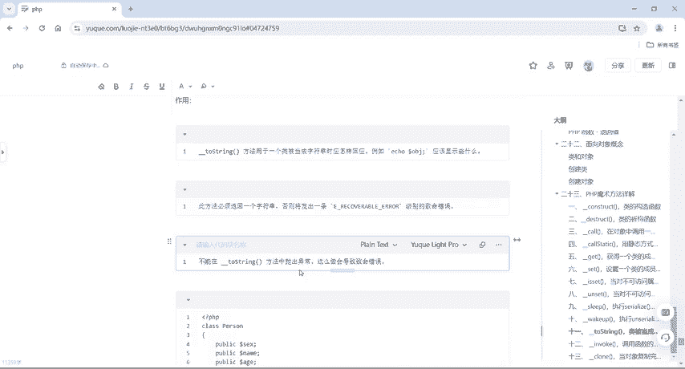

好，把它往里面站。好，粘之后呢，这里面有con好，这里面有个to string，对不对？好，那么这里面有一个to string啊，to string是什么意思呢？

to string就是说当我们要把这个对象啊转换为字符串的时候就会自动出发，是不是啊？好，那如果说我不存在这个to string啊，我这个对象是不是念完了，完之后我是不是要直接打印这个poson啊。好。

那我们接下来看一下这个poson打印出来什么东西呢？它是个这玩意是个object，对不对？哎 could not be什么to string，它说不能把这个object这个对象转换为 string。

除非干嘛呢？除非你给它提供一个to string方法，哎，也就是to string的一个魔术方法，提供完了之后，那我们接下来走是不是要go go go打印输出啊，这其实就很简单很很容易理解啊。

就是把我们这个对象变成字符串去输出。😊。

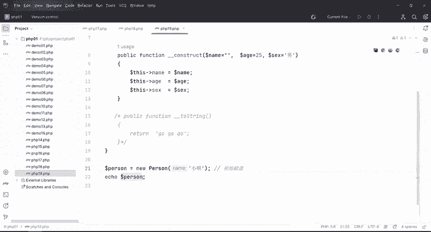

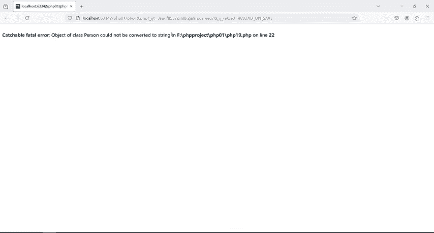

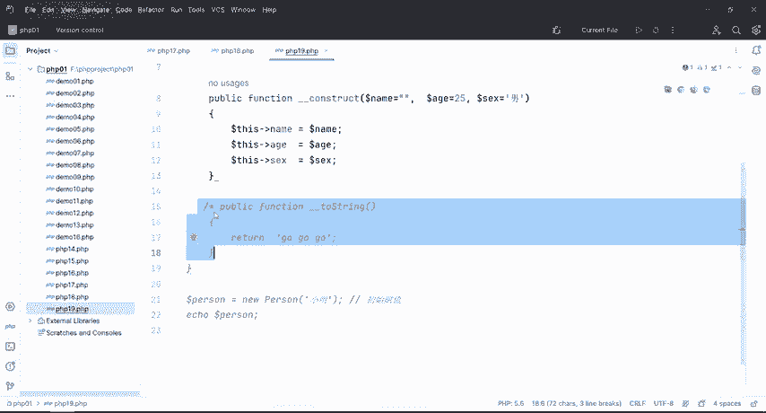

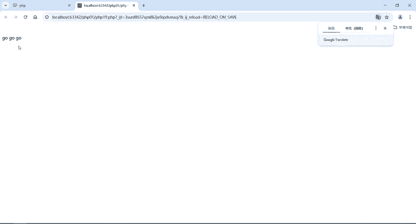

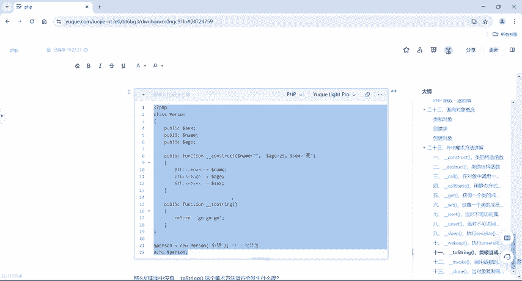

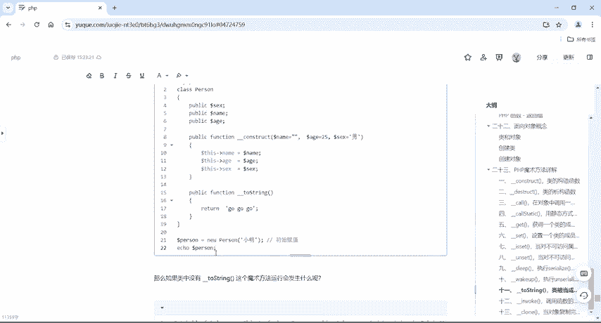

啊，我们输出的我们打印输出的是什么，是一个对象，对不对？但是对象呢又不能直接打印。所以说在这个里面给他提供一个to string的魔术方法，它就直接把它返回出来了啊，返回出来。好。

这个是to string的用法。😊。

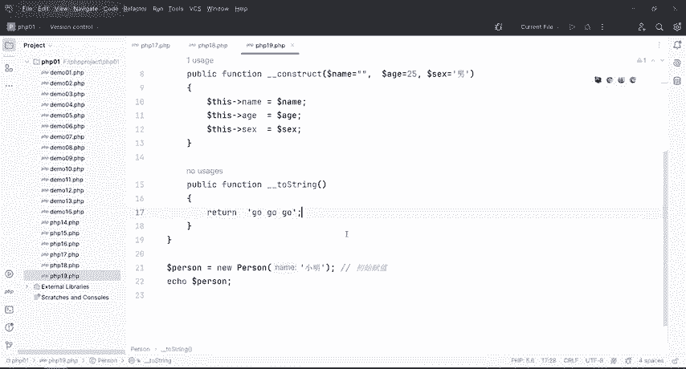

好，那接下来我们还有两个啊还有两个。这个第12个呢就是invo啊，in work呢是调用函数的方式啊，调用一个对象时回应的方法。当常是以调用函数的方式调用一个对象啊，我们调用函数是一种方式。

那么调用对象呢对吧？又是一种方式。但是我以调用函数的方式去调用一个对象。那inwork就会被自动调用，那么它的特性啊在5。3版本以上有效，这个一定要注意它的PHP版本啊。好。

那么具体的同样还是我们来看一下这个。😊。

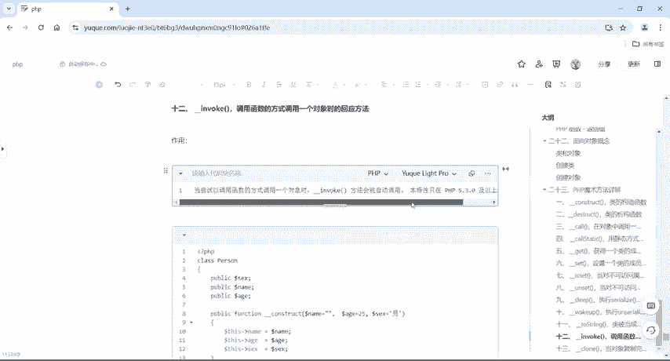

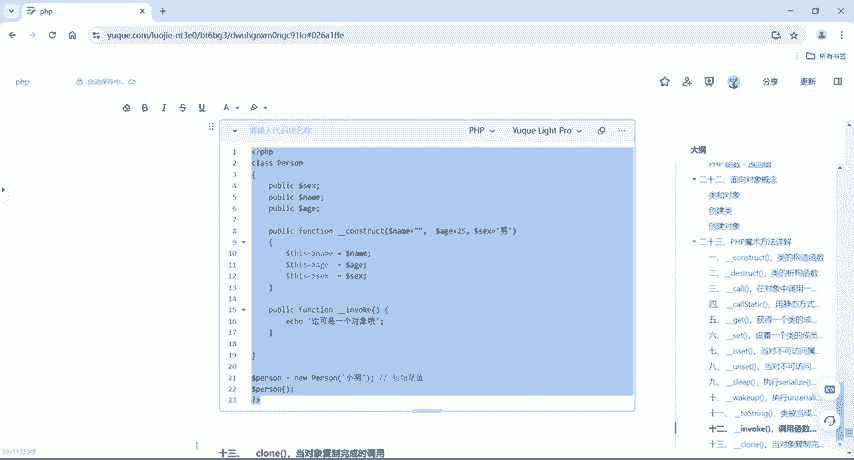

呃，代码啊右键你1个PHPP来1个PHP20。好，把它粘过来。登过来之后，这里面是不是一个inwork，是不是啊？好，如果说我不提供in work的话啊，什么意思啊？报错了，看到没有？

这个地方具体的怎么去写的啊，我把这个对象以方法的格式去调用。方法怎么调用的？方法是不是叫比如说我写了个什么，写了个ABC。😊，打个比方啊，写这个ABC括号。那么这个玩意是不是一个函数啊？

我把这个对象当成函数去执行的话。那它就会报错。那如何避免报错呢？我就在这里给它来一个提示，对吧？也就是万一你在这个代码里面你写错了，你在执行的时候，哎，我有一个inwork，它会提示你。

这可是一个对象哦，对吧？那它要提示你这个对象，就代表你这里写错了，等你测试完了之后，是不是就可以回到这里，把这个玩意给它改掉就可以了。好，那如果说你没有inwork。刚才看到了啊，直接把。😊。

对象当成函数去运行，它是会报错的。好运行。

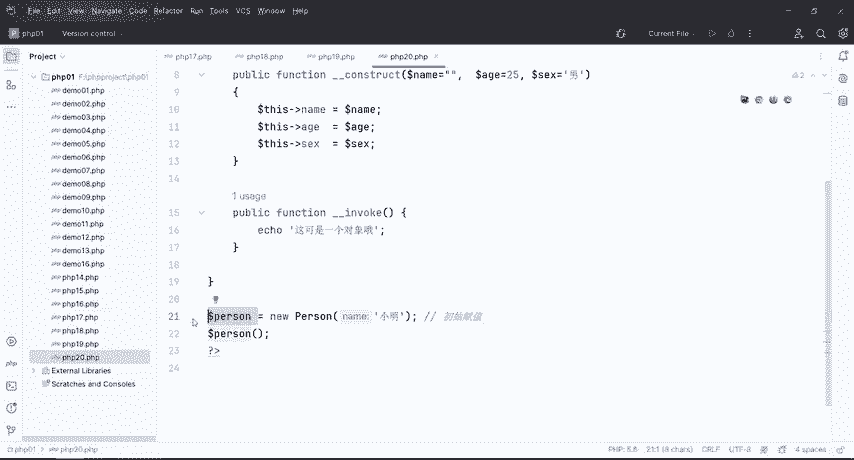

是吧这可是一个对象，他是提示你啊，就给你一个提示。你如果说你是可以调的对吧？你调用呢，但是你要给我提供一个in work的魔术方法，哎，我就不让你报错啊，不让报错。照样的可以让你程序继续运行啊。

这是in work好，那么最后一个啊，最后一个呢就是我们的克隆啊，克隆的话呢。😊。

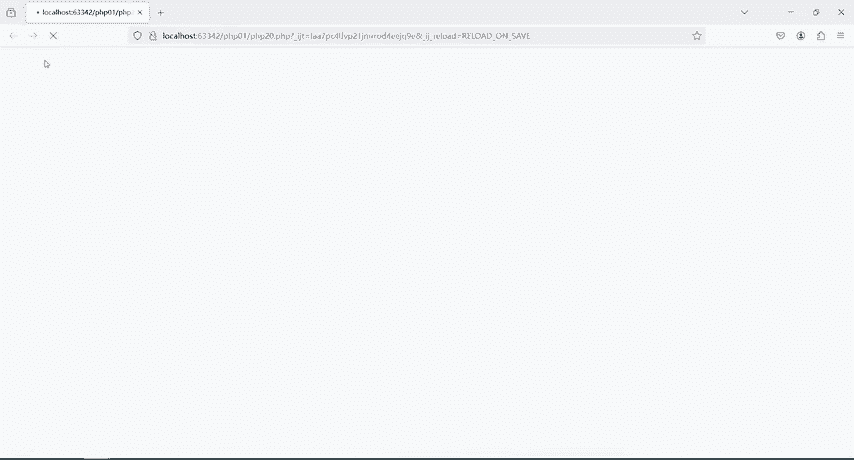

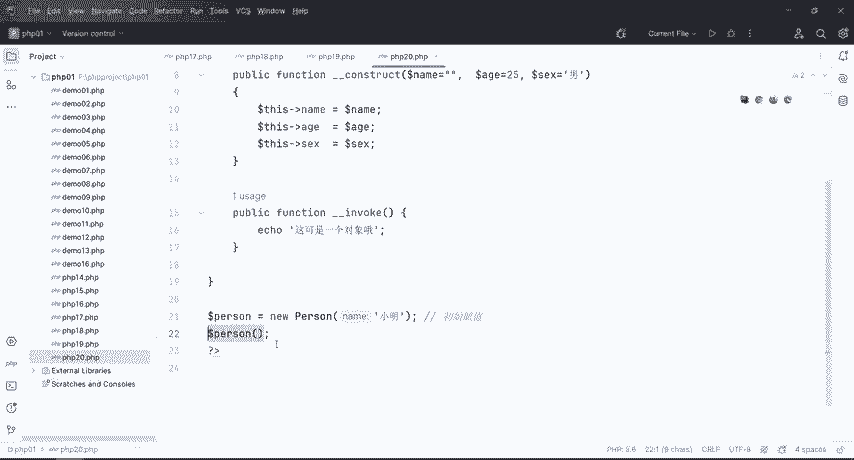

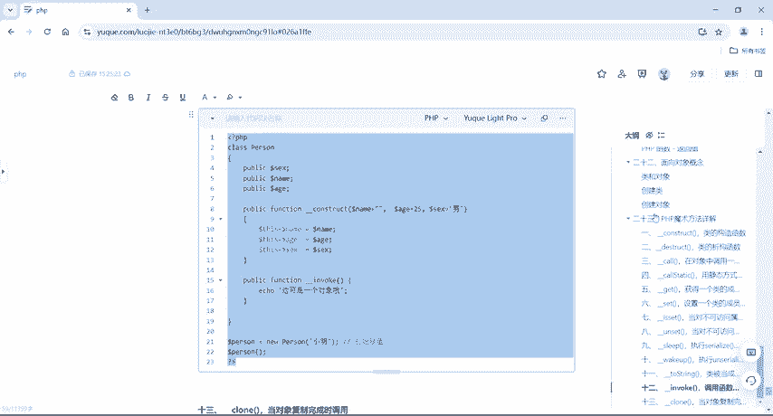

应该都听过啊，它其实就相当于复制啊。当对象复制完成的时候去调用。啊，那么对象复制可以通过colown啊关键字来完成啊，如果可能呢就将调用对象的克隆的方法啊，对象中克隆方法不能直接会被调用。那什么意思呢？

就是说你在这个对象复制的时候，它会自动出发，也是一样的啊，就不需要完全复制一个对象来获得其中属性。但是有一个情况下确实需要哎，如果你有一个。😊，GDK啊GDK窗口对象。那么该对象呢有创口相关的资源。

但是呢。😊，哎，你可能会想复制一个新的窗口啊，保持所有的属性与原来的窗口相同，那也就相当于复制粘贴嘛，对不对啊，好，但是必须是一个新的对象啊，但是如果说不是新的对象，那么一个窗口就会影响到另一个窗口。

如果说你把呃这个窗口的属性跟原来的属性是一模一样的。那你修改的这个窗口，那么找呃第一个窗口同样是会不被影响的对吧？但是我我又不想影响到第一个窗口，那我们就使用克隆啊，那么克隆其实就相当于一个复制复制它。

😊。

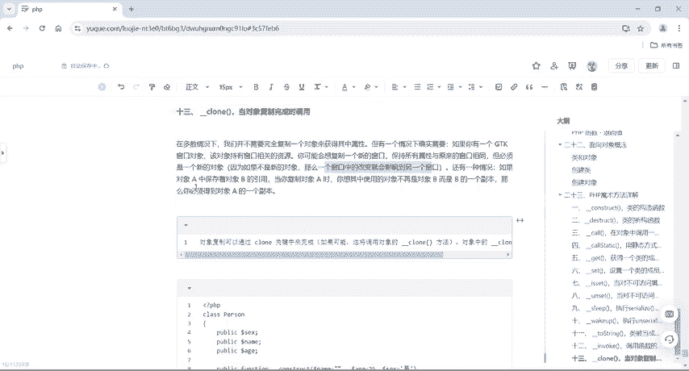

他原来的东西啊，看一下。

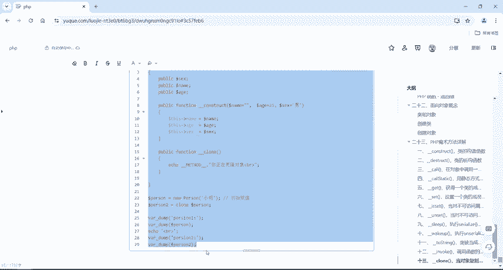

这是复制粘贴，说白了啊。😊，就是我取个名字啊，21啊把这个给给它卡出V啊卡成V你正在克隆对象啊，所以说在这个克隆对象里头啊，一定要提供一个克隆的一个魔术方法。好，那么具体它怎么去使用的呢？

当你在克隆这个poson的时候，它会自动触发这个coown哎魔术方法。那如果说你没有这个coown，对吧？哎，我把它注释掉，对不对？好，你在这个地方poson溜了一个等于小名。

然后poson2克隆的一个小名，我看一下哎。😊，poer是什么？pos2是什么？好，我这里没有克隆啊，我来看一下走。😊。

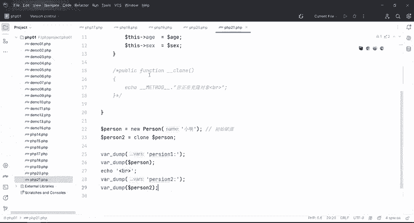

是不是有一个sring9per e objectject，男，小明in特25是不是给我打印出来啊，对不对？

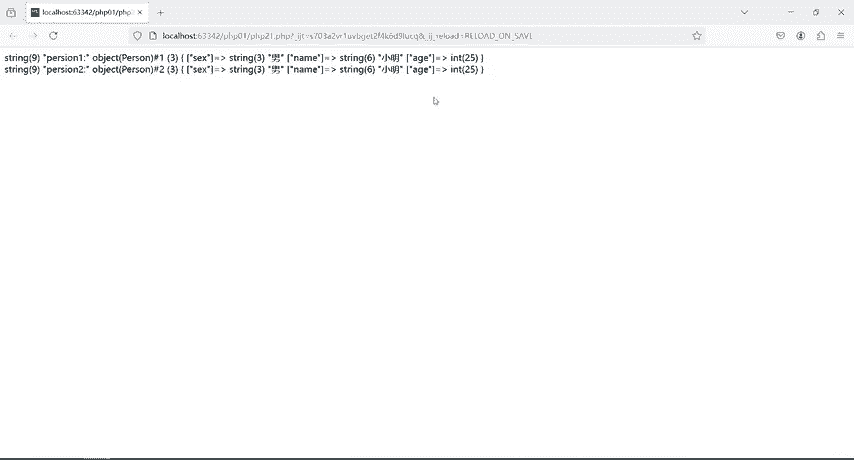

啊，一样的吧，是不是啊？但是这里啊。为什么要给他提供一个克隆的这个模式方法，要给他个来个提示是吧？哎，你正在克隆对象，那么克隆对象我第一个poson啊。

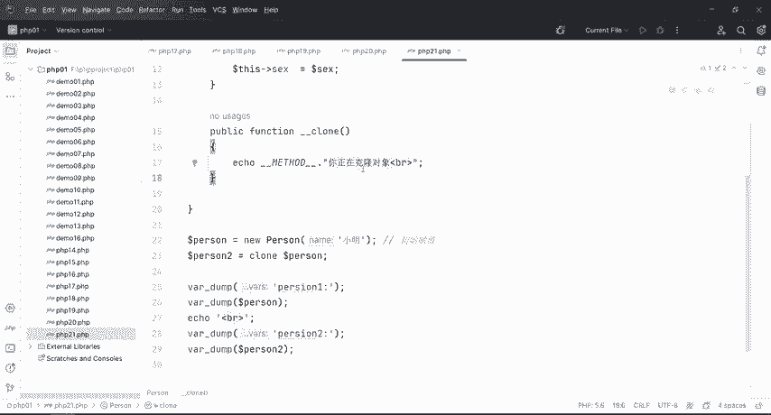

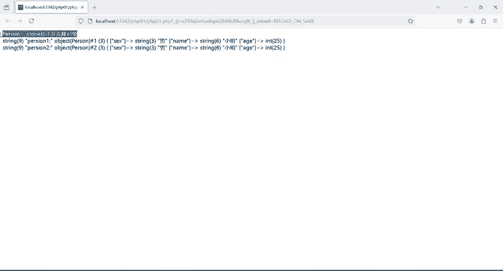

我这个posson是小明，对吧？我这个posson2呢，因为我克隆的这个小明。所以说我出来了这个坡son2，它这个类型。它是跟这个poson是完全是一样的啊，小明25岁，性别男啊。好，看一下。

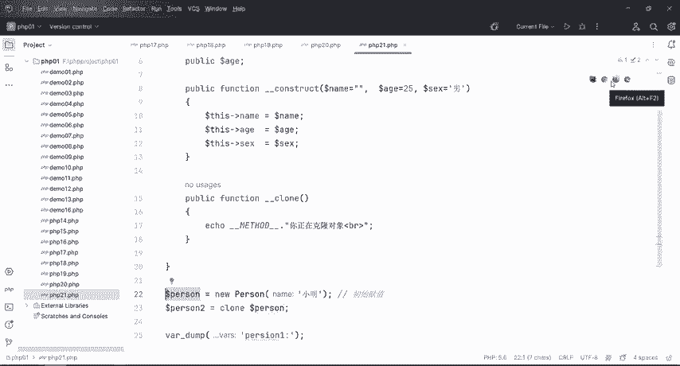

嗯。男是吧小明25岁，他这两个对象通过克隆出来的这个两个对象都是一模一样的，包括他的9对吧？哎po一po2object包括里面的数据属性类型都是一样的好，这个是就相当于复制粘贴我复制一下。

然后粘粘贴到另外一个地方，也就原来的与现在的所有的类型都是一样的，所有属性都是一样的。好，这个就是我们PHP里面的魔术方法啊，魔术方法。好，到这边呢基本上我们PHP基础啊就告一段落了。

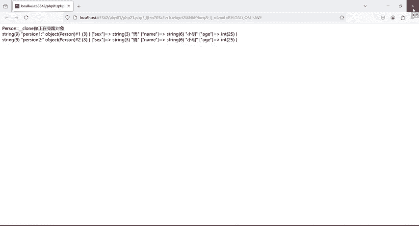

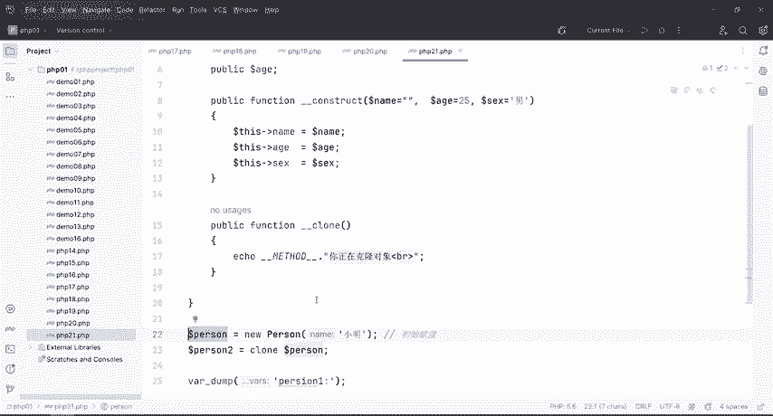

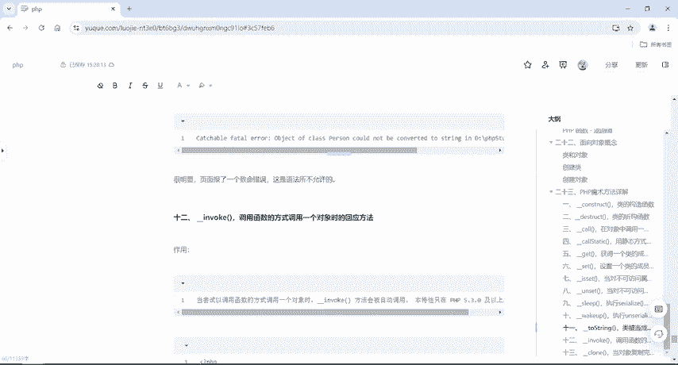