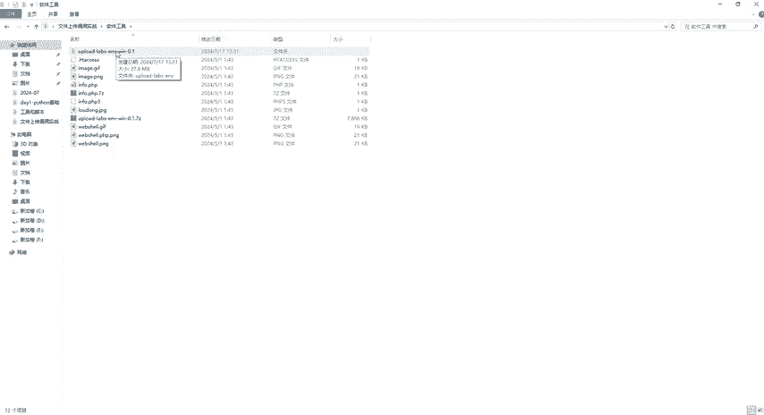

# B站首推！建议所有想参加CTF夺旗赛的同学，死磕这条视频，2024年字节大佬花一周时间整理的CTF入门保姆级教程！从入门到入狱（web渗透／PHP基／SQL注） - P19：1、文件上传漏洞介绍 - CTF入门教学 - BV1JjeJeYE2p

今天我们来讲一下文件上传漏洞攻击实战。那首先我们来看一下什么是文件上传漏洞。那文件上传这个功能在我们这个web应用当中非常常见。比如说头像的一些上传文档一些共享等等。那然而。

如果当文件上传功能这个实现不当的情况，就可能引起严重的安全漏洞。那到底什么是文件上传漏洞呢。那文件上传漏洞是指攻击者利用web应用的文件上传功能，上传可执行的一些文件，比如说我们手悉的一个木马。

还有我们这个web笑等等。从而在服务器上执行恶意代码。那它是怎么形成的呢？那么首先第一个它是缺乏有效的一个输入验证。好，怎么去验证呢？比如说我们现在在这个上网的时候，对吧？要去进行一些文件上传。

它可能呢我在上传头像的时候，它只允许我上传JPGPNG或者GIF对吧？然后还只允许我这个大小限制在50K或者50K以下。还有我们这个具体上传的头像里面的内容进行严格的限制。好。

第二个就是服务器的一个配置不当。比如说文件上传目录具有可执行的一个权限，第三个就是文件类型检查不严格。文件类型检查不严格，主要导致什么呢？就是我们文件扩展名判断文件的类型好。

比如说我今天我要上传1个TXT文件夹啊，或者是文件等等啊，那么他可能看到你这个文件，它的后缀名呢，是TXT对吧？那他就觉得哎。我就可以允许你上传，但是它没有真真真正的把你那个文件给它打开。

看一下里面到底是什么东西啊，这个就是我们漏洞形成的原因。好，针对于这个漏洞形成原因呢，我们来看一下它具体怎么去漏洞检测的，可以分为2块啊。第一块是客户端的检测，第2块是服务端的一个检测。

那么客户端检测里面又分为文件类型和文件大小的一些限制。那服务端检测呢就是检测我们文件的扩展名，文件的内容，还有我们这些权限设置。好，那我们大概的知道我们这个文件上传漏洞怎么形成的。

然后它是怎么去检测的对吧？那接下来我们来了解一下文件上传的危害。那么我们文件上传的危害主要是哪些呢？第一个就是服务器的一些控制。第二个呢就是数据的一个泄露。第三个就是网站篡改。

第四个就是可以作为攻击跳板。那具体是什么样的意思啊。那么服务器控制，比如说我今天给你这个电脑上上传了一个恶意的一些文件。比如说我给你上传了一个木马，然后呢，我通过你的电脑，对吧？你电脑只要一开机。

我这个木马一运行。可就我就可以获得你的电脑的一个控制权啊，这个就是服务器的一个控制。那第二个数据泄露是怎么泄露的呢？我都能控制你的电脑了。那你电脑上面的一些敏感数据，我是不是就可以拿得到。

那第三个网页篡改。我我拿到你的服务器权限获得你一些数据。那我可以把你的网站内容给它进行修改，我可以在你的这个网站上，在你这个服务器上面。进行一些非法的一些宣传获得。一些啊金钱对吧？

或者一些778八的东西啊，然后呢或者还可以去做一些恶意的一些行为啊。那第4个啊，它是怎么去作为工具的跳板的呢？你的电脑被我控制了，你的服务器被我控制了，那你服务器是不是也可以去控制别人的电脑呢？

那我可以以你的名义去对其他的系统进行发起攻击。好，这个就是文件上传的危害。好，那我们今天呢主要是针对于文件上传漏洞这个。进行一个实战。那接下来我就跟大家来介绍一下我们要准备的一些环境。

那么环境的话还是啊我们这个PHP study啊，那么系统呢就直接在我们自己本机上就行了。那么靶场我们今天用的这个靶场叫upload跟la这个靶场。那么具体的这些工具环境，我已经给大家准备好了。

我们各位小伙伴，各位同学都可以在评论区自取，包括这个已经给到你们这个嗯PHP文件呢，对吧？包括我们这些图片码呀啊，还有我们这个uploadlas这个靶场啊，都可以提供到给大家，如果有需要的。

我们评论区自取。😊。

好，那接下来把环境介绍完了之后啊，还需要知道一些。知识啊呃我们来看一下这个图。呃，因为我给大家准备了这个upload跟label呢。版本啊已经给大家设置好了，系统刚才也说了啊。

用我们这个windows那么PHP版本是5。2。17啊，PHP的一些组件，还有我们的中间件啊，一定要满足这些条件。还有同学教问呢，哎，老师你这边哎不是哎除了这个19必须要在linux下面吗？😊。

那不用担心啊，老师已经给你们搞好了。😊，就是我们1到20关啊，都可以在我们这个windows操作系统上面执行。好，那么解压出来的就是这个给到大家的就是这个压缩包。你们拿到压缩包之后，右键解压。

解压完了之后，就是这么一个文件夹。好，那接下来我们就来针对这个app load的靶场1到20关通关进行讲解。

