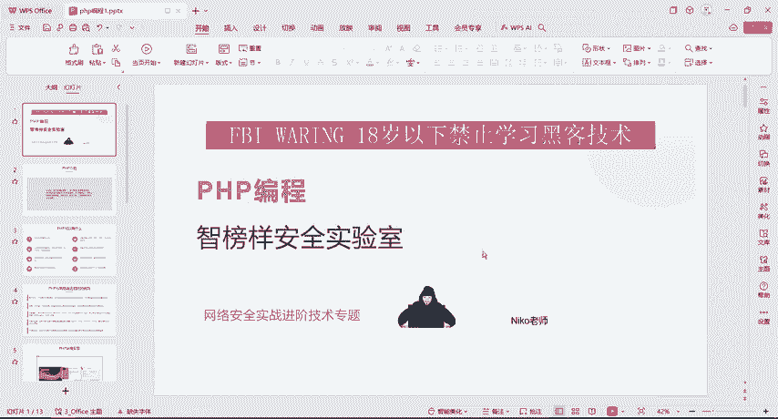
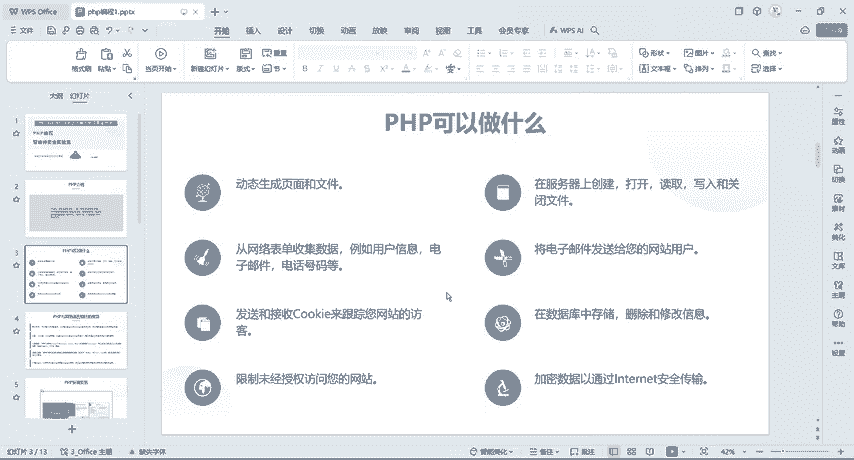
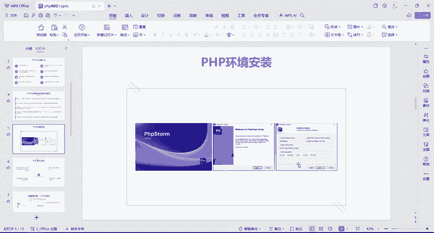
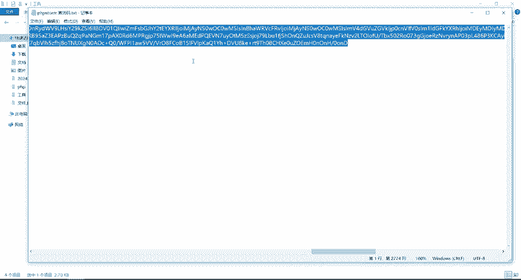
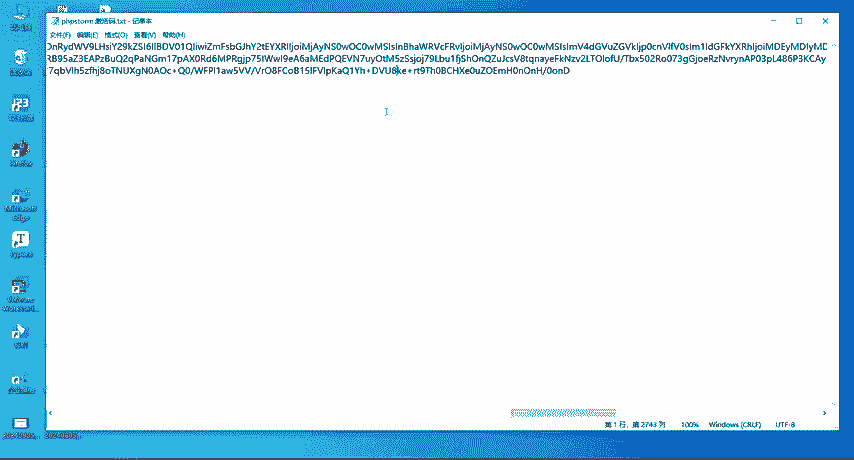
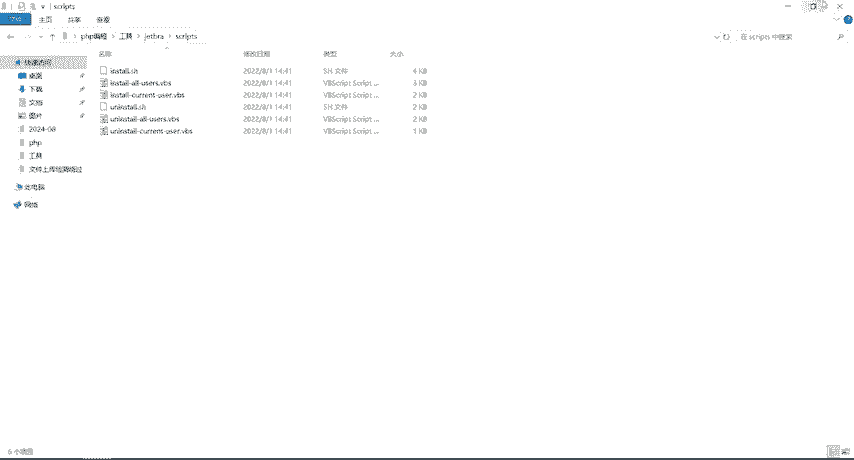
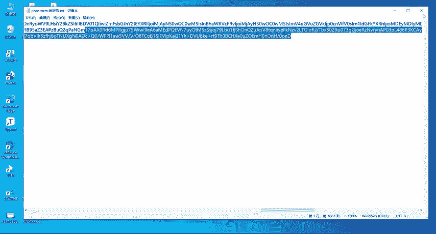
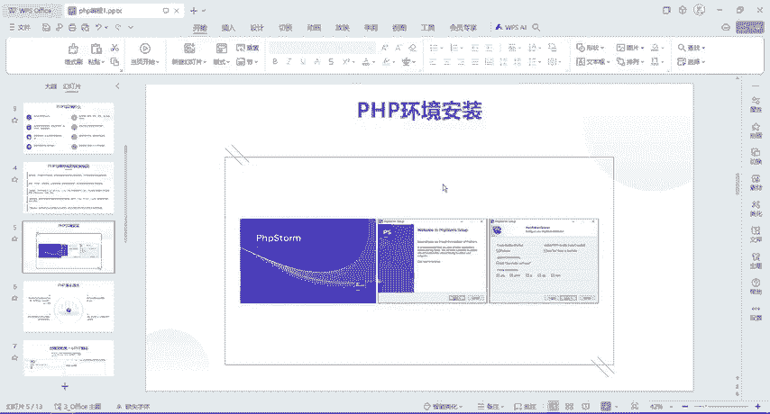

# B站首推！建议所有想参加CTF夺旗赛的同学，死磕这条视频，2024年字节大佬花一周时间整理的CTF入门保姆级教程！从入门到入狱（web渗透／PHP基／SQL注） - P1：1、php介绍及环境安装 - CTF入门教学 - BV1JjeJeYE2p

好，今天给大家讲一下我们这个PHP编程。那首先看一下PHP的一个介绍。PHP它是一个超文本预处理器，是一种通用的开源脚本语言。与我们这个C语言类似是常用的网站编程语言，它比较利于学习使用广泛。

主要适用于外部的一个开发领域，那PHP可以做什么啊，这个东西地方呢我就不不给大家去念了啊，大家可以看一下，啊，包括它可以动态生成页面呢？对吧？在服务器上创建。

关闭读取文件啊等等啊一些的东西它都可以做。那我们PHP能做那么多东西，对吧？但是相对于我们这个其他语言有什么优势，比如说我们的甲va呀，对吧？还有我们这个啦等等啊，各种各样的编程语言。

它具体有什么样的优势。那我们来看一下它的优势啊除了刚才跟大家说的易于学习啊，它还是一个开源的一个项目，还有它的一个可移植性比较高。还有快速的一个性能，相对于比其他的一个脚本语言编写的脚本执行速度啊。

运行会更快。还有一个广阔的一个社区。那PHP呢它是嗯得到了这个世界范围内的一个社区支持啊。所以说呢我们学PHP找到它的一些相关帮助或者文档是很容易很容易的就得到了啊。好，那么把PHP介绍完了之后呢。

那我们接下来看一下，我们如果学习PHP需要干什么。那首先第一步还是最简单的PHP环境安装。那么这个地方给大家截了三个图，就直接点下一步。😊。

下一步就可以了啊。那我这边呢给到大家了，有资料啊，那么我们在这个工具里面，在这个工具里面有我们这个PHP的安装程序，还有我们PHP的一个激活码，还有我们这个破解嘛啊。

就是这是破解的啊1个ZIP那么具体的怎么安装啊，EX1的话呢，就跟我们正常安装游戏的是嗯那个情况是一样的。我们安装游戏EX1就下一步下一步下一步就可以了。好吧，然后安装完了之后呢，在桌面上会显示这个啊。

我们双击给它打开。😊，打开之后呢，它在这个地方它会给我们弹一个框，因为什么？因为我们安装上去之后啊，我们还没有给它去破解啊。呃，如果说不破解的话呢，它可以免费使用30天啊。😊，那如果说要破解。

那我们还得去做一些事情。那首先我们把它关了，关了之后，他就给我退出了啊，对吧？好，给到大家的这个工具包里面，有这个破解文件。那，我们首先给它解压。😊，好，解压出来之后，就在这个地方啊。好。

那我们可以看一下啊，我们先把这个关了。😊，好，打开之后呢，这里面有很多很多文件夹，对吧？那具体怎么去破解它呢？在这个sscriptcrres里面打开，这里面是给我们去安装它的一些程序的。

那么首先第一步我们给它点一个un store啊，un store就卸载卸载所有的一个用户权限。😊，好，我们直接点它啊。如呃一般的话呢，如果说你不去点or，你点它也行啊。那我们为了后面的方便啊。

就是我们给它设置为所有啊所有的用户都可以去访问，都可以去使用。我们双击它，然后它弹个窗对吧？弹了个窗之后点击确定。然后这个档出来之后，我们点击确定。好，这是卸载。然后卸载完了之后呢，我们再inst安装。

好，OK。然后我们这个地方呢要稍等一下啊。它也就会弹出一个框啊，弹出一个档。等到它弹出这个档之后，哎，我们就把这个权限啊，把这个工具已经装好了。那我们这边要稍微等一下啊。好了啊。

这个地方呢可能弹窗的话呢，就是需要等一会儿啊，然后等它弹出来之后啊，我们这里有一个激活码啊，激活码给它打开，打开之后呢，ctrl A给它选中，选中之后ctl C。

好，contrl C完了，我们接下来打开这个软件啊。还是这个界面，那这个地方不是给我们弹出来一个东西嘛？对不对？好，这里有的时候啊这个n要很久，有的时候呢就一会儿就可以弹出来了，好吧，好。😊。

然后选择什么呢？怎么去破解啊，我们激活码已经给到大家了，对不对？好，我们选择这个。😊，在这个地方选择这个地方不用选啊，这个地方选的话可以免费使用30天。那我们呃直接就给它破解了啊，把它默认是这个情况。

对吧？这里可以去注册或者是登录，我们不登，也不去注册。我们选择第二个。第二个之后把刚才复制的这个。😊。

激活码哎，把它粘到这里面来。哎，ctrlV。好，那么复制到这个里面之后，这个码是变成绿色的。然后这个按钮呢是可以点击的。如果说这个按钮。没有这个变成蓝色，就代表你破解失败，我们再重新的走一遍怎么走呢？

走这个就在scrs里面啊，再把它卸了，再把它安装一下。然后我们再重新的把这个码给它复制粘贴进去。好，等到这个按钮可以点击之后，我们点击activeOK然后这边呢会就会显示已经破解成功了啊。

这个时间呢是2025年，对吧？😊。

好，2025年。那我们这代表我们还可以用一年，对不对？但是呢相对来说啊这个这个嗯日期啊，这个日期实际是假的，它其实可以用到2099年的。那如果说以后你们再使用这个PHPstone，它提示过期了啊。

你们再按照我们这个老样子去破解一遍，把这个激活码给它粘进去啊，再active一下就行了。好，那么到这个界面之后，我们就可以开始使用我们这个PHP了。😊。

好，这是PHP环境的一个安装啊。

